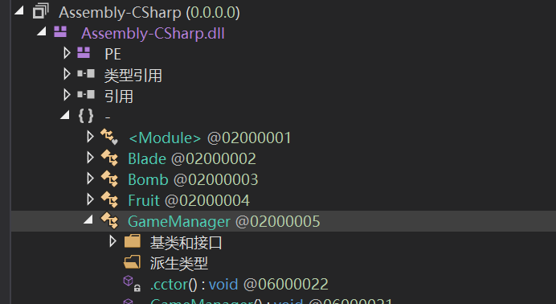
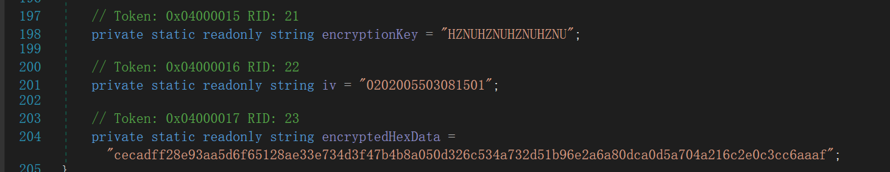
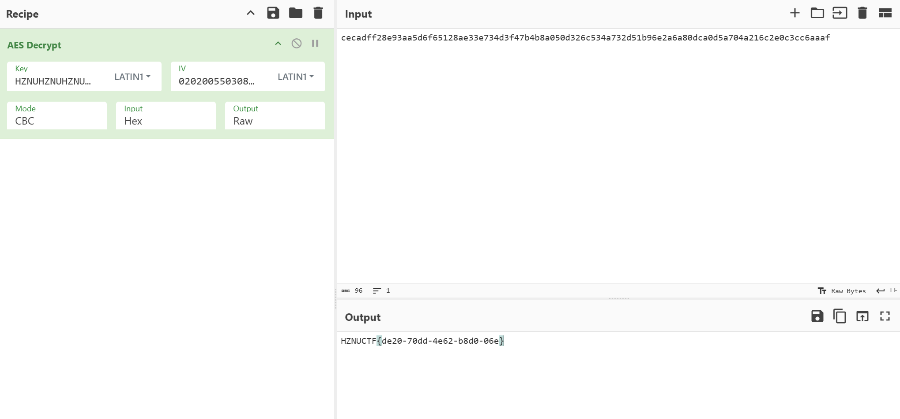
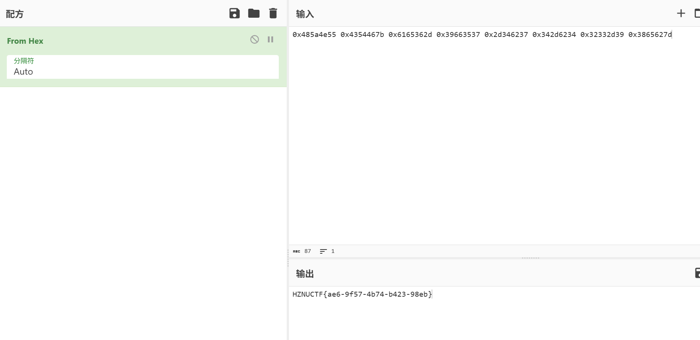
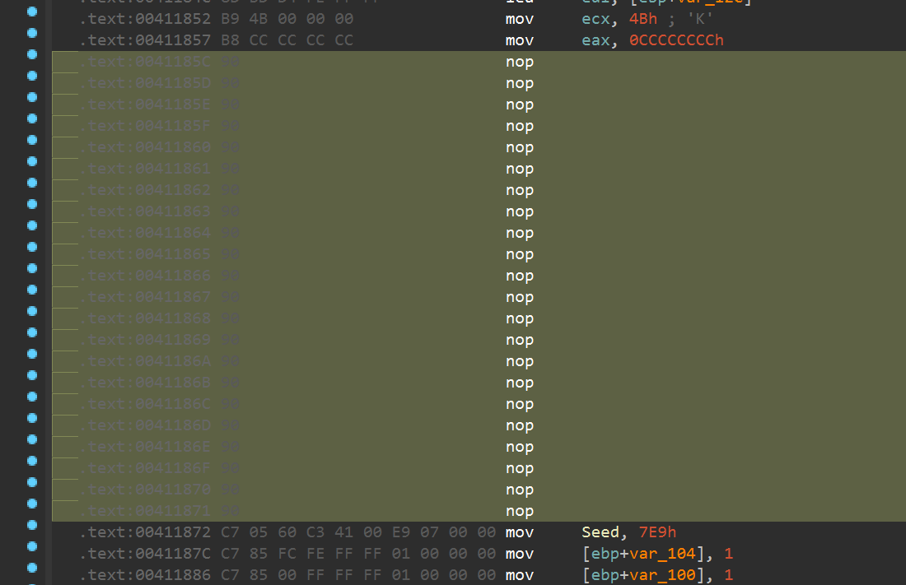
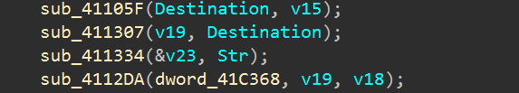

# TGCTF2025逆向方向部分wp-先知社区

> **来源**: https://xz.aliyun.com/news/17748  
> **文章ID**: 17748

---

## Base64

题目描述：如题 flag格式为HZNUCTF{}

给ai写的

```
def custom_base64_decode(encoded_str):
    # 自定义编码表
    custom_table = "GLp/+Wn7uqX8FQ2JDR1c0M6U53sjBwyxglmrCVdSThAfEOvPHaYZNzo4ktK9iebI"

    # 构建反向映射字典：字符 -> 原6位值（考虑右移24位）
    decode_table = {char: (idx - 24) % 64 for idx, char in enumerate(custom_table)}

    # 处理填充并计算原始数据长度
    padding = encoded_str.count('=')
    encoded_str = encoded_str.rstrip('=')
    data_len = len(encoded_str)

    # 计算预期字节长度
    if padding == 2:
        byte_len = (data_len * 6) // 8 - 1
    elif padding == 1:
        byte_len = (data_len * 6) // 8 - 2
    else:
        byte_len = (data_len * 6) // 8

    decoded = bytearray()

    # 每4个字符处理一组
    for i in range(0, len(encoded_str), 4):
        chunk = encoded_str[i:i + 4]

        # 将字符转换为6位值
        bits = 0
        valid_bits = 0
        for c in chunk:
            if c not in decode_table:
                raise ValueError(f"Invalid character: {c}")
            bits = (bits << 6) | decode_table[c]
            valid_bits += 6

        # 提取完整字节
        while valid_bits >= 8:
            valid_bits -= 8
            decoded.append((bits >> valid_bits) & 0xFF)

    # 根据填充调整最终字节
    if padding:
        decoded = decoded[:byte_len]

    return bytes(decoded)


result = custom_base64_decode('AwLdOEVEhIWtajB2CbCWCbTRVsFFC8hirfiXC9gWH9HQayCJVbB8CIF=')
print(result)
```

`HZNUCTF{ad162c-2d94-434d-9222-b65dc76a3`

最后加个`2}`

2是手动爆的

## **蛇年的本命语言**

题目描述：如题...flag的格式为HZNUCTF{}

pyinstxtractor加uncompyle6组合拳得到源码

```
from collections import Counter
print("Welcome to HZNUCTF!!!")
print("Plz input the flag:")
put = input()
oOO0OoOoo000 = Counter(put)
O0o00 = "".join((str(oOO0OoOoo000[i]) for i in put))
print("ans1: ", end="")
print(O0o00)
if O0o00 != "111111116257645365477364777645752361":
    print("wrong_wrong!!!")
    exit(1)
iiIII = ""
for i in put:
    if oOO0OoOoo000[i] > 0:
        iiIII += i + str(oOO0OoOoo000[i])
        oOO0OoOoo000[i] = 0
    else:
        enc = [ord(i) for i in iiIII]
        ii1iIi1i11i = [
         7 * enc[0] == 504,
         9 * enc[0] - 5 * enc[1] == 403,
         2 * enc[0] - 5 * enc[1] + 10 * enc[2] == 799,
         3 * enc[0] + 8 * enc[1] + 15 * enc[2] + 20 * enc[3] == 2938,
         5 * enc[0] + 15 * enc[1] + 20 * enc[2] - 19 * enc[3] + 1 * enc[4] == 2042,
         7 * enc[0] + 1 * enc[1] + 9 * enc[2] - 11 * enc[3] + 2 * enc[4] + 5 * enc[5] == 1225,
         11 * enc[0] + 22 * enc[1] + 33 * enc[2] + 44 * enc[3] + 55 * enc[4] + 66 * enc[5] - 77 * enc[6] == 7975,
         21 * enc[0] + 23 * enc[1] + 3 * enc[2] + 24 * enc[3] - 55 * enc[4] + 6 * enc[5] - 7 * enc[6] + 15 * enc[7] == 229,
         2 * enc[0] + 26 * enc[1] + 13 * enc[2] + 0 * enc[3] - 65 * enc[4] + 15 * enc[5] + 29 * enc[6] + 1 * enc[7] + 20 * enc[8] == 2107,
         10 * enc[0] + 7 * enc[1] + -9 * enc[2] + 6 * enc[3] + 7 * enc[4] + 1 * enc[5] + 22 * enc[6] + 21 * enc[7] - 22 * enc[8] + 30 * enc[9] == 4037,
         15 * enc[0] + 59 * enc[1] + 56 * enc[2] + 66 * enc[3] + 7 * enc[4] + 1 * enc[5] - 122 * enc[6] + 21 * enc[7] + 32 * enc[8] + 3 * enc[9] - 10 * enc[10] == 4950,
         13 * enc[0] + 66 * enc[1] + 29 * enc[2] + 39 * enc[3] - 33 * enc[4] + 13 * enc[5] - 2 * enc[6] + 42 * enc[7] + 62 * enc[8] + 1 * enc[9] - 10 * enc[10] + 11 * enc[11] == 12544,
         23 * enc[0] + 6 * enc[1] + 29 * enc[2] + 3 * enc[3] - 3 * enc[4] + 63 * enc[5] - 25 * enc[6] + 2 * enc[7] + 32 * enc[8] + 1 * enc[9] - 10 * enc[10] + 11 * enc[11] - 12 * enc[12] == 6585,
         223 * enc[0] + 6 * enc[1] - 29 * enc[2] - 53 * enc[3] - 3 * enc[4] + 3 * enc[5] - 65 * enc[6] + 0 * enc[7] + 36 * enc[8] + 1 * enc[9] - 15 * enc[10] + 16 * enc[11] - 18 * enc[12] + 13 * enc[13] == 6893,
         29 * enc[0] + 13 * enc[1] - 9 * enc[2] - 93 * enc[3] + 33 * enc[4] + 6 * enc[5] + 65 * enc[6] + 1 * enc[7] - 36 * enc[8] + 0 * enc[9] - 16 * enc[10] + 96 * enc[11] - 68 * enc[12] + 33 * enc[13] - 14 * enc[14] == 1883,
         69 * enc[0] + 77 * enc[1] - 93 * enc[2] - 12 * enc[3] + 0 * enc[4] + 0 * enc[5] + 1 * enc[6] + 16 * enc[7] + 36 * enc[8] + 6 * enc[9] + 19 * enc[10] + 66 * enc[11] - 8 * enc[12] + 38 * enc[13] - 16 * enc[14] + 15 * enc[15] == 8257,
         23 * enc[0] + 2 * enc[1] - 3 * enc[2] - 11 * enc[3] + 12 * enc[4] + 24 * enc[5] + 1 * enc[6] + 6 * enc[7] + 14 * enc[8] - 0 * enc[9] + 1 * enc[10] + 68 * enc[11] - 18 * enc[12] + 68 * enc[13] - 26 * enc[14] + 15 * enc[15] - 16 * enc[16] == 5847,
         24 * enc[0] + 0 * enc[1] - 1 * enc[2] - 15 * enc[3] + 13 * enc[4] + 4 * enc[5] + 16 * enc[6] + 67 * enc[7] + 146 * enc[8] - 50 * enc[9] + 16 * enc[10] + 6 * enc[11] - 1 * enc[12] + 69 * enc[13] - 27 * enc[14] + 45 * enc[15] - 6 * enc[16] + 17 * enc[17] == 18257,
         25 * enc[0] + 26 * enc[1] - 89 * enc[2] + 16 * enc[3] + 19 * enc[4] + 44 * enc[5] + 36 * enc[6] + 66 * enc[7] - 150 * enc[8] - 250 * enc[9] + 166 * enc[10] + 126 * enc[11] - 11 * enc[12] + 690 * enc[13] - 207 * enc[14] + 46 * enc[15] + 6 * enc[16] + 7 * enc[17] - 18 * enc[18] == 12591,
         5 * enc[0] + 26 * enc[1] + 8 * enc[2] + 160 * enc[3] + 9 * enc[4] - 4 * enc[5] + 36 * enc[6] + 6 * enc[7] - 15 * enc[8] - 20 * enc[9] + 66 * enc[10] + 16 * enc[11] - 1 * enc[12] + 690 * enc[13] - 20 * enc[14] + 46 * enc[15] + 6 * enc[16] + 7 * enc[17] - 18 * enc[18] + 19 * enc[19] == 52041,
         29 * enc[0] - 26 * enc[1] + 0 * enc[2] + 60 * enc[3] + 90 * enc[4] - 4 * enc[5] + 6 * enc[6] + 6 * enc[7] - 16 * enc[8] - 21 * enc[9] + 69 * enc[10] + 6 * enc[11] - 12 * enc[12] + 69 * enc[13] - 20 * enc[14] - 46 * enc[15] + 65 * enc[16] + 0 * enc[17] - 1 * enc[18] + 39 * enc[19] - 20 * enc[20] == 20253,
         45 * enc[0] - 56 * enc[1] + 10 * enc[2] + 650 * enc[3] - 900 * enc[4] + 44 * enc[5] + 66 * enc[6] - 6 * enc[7] - 6 * enc[8] - 21 * enc[9] + 9 * enc[10] - 6 * enc[11] - 12 * enc[12] + 69 * enc[13] - 2 * enc[14] - 406 * enc[15] + 651 * enc[16] + 2 * enc[17] - 10 * enc[18] + 69 * enc[19] - 0 * enc[20] + 21 * enc[21] == 18768,
         555 * enc[0] - 6666 * enc[1] + 70 * enc[2] + 510 * enc[3] - 90 * enc[4] + 499 * enc[5] + 66 * enc[6] - 66 * enc[7] - 610 * enc[8] - 221 * enc[9] + 9 * enc[10] - 23 * enc[11] - 102 * enc[12] + 6 * enc[13] + 2050 * enc[14] - 406 * enc[15] + 665 * enc[16] + 333 * enc[17] + 100 * enc[18] + 609 * enc[19] + 777 * enc[20] + 201 * enc[21] - 22 * enc[22] == 111844,
         1 * enc[0] - 22 * enc[1] + 333 * enc[2] + 4444 * enc[3] - 5555 * enc[4] + 6666 * enc[5] - 666 * enc[6] + 676 * enc[7] - 660 * enc[8] - 22 * enc[9] + 9 * enc[10] - 73 * enc[11] - 107 * enc[12] + 6 * enc[13] + 250 * enc[14] - 6 * enc[15] + 65 * enc[16] + 39 * enc[17] + 10 * enc[18] + 69 * enc[19] + 777 * enc[20] + 201 * enc[21] - 2 * enc[22] + 23 * enc[23] == 159029,
         520 * enc[0] - 222 * enc[1] + 333 * enc[2] + 4 * enc[3] - 56655 * enc[4] + 6666 * enc[5] + 666 * enc[6] + 66 * enc[7] - 60 * enc[8] - 220 * enc[9] + 99 * enc[10] + 73 * enc[11] + 1007 * enc[12] + 7777 * enc[13] + 2500 * enc[14] + 6666 * enc[15] + 605 * enc[16] + 390 * enc[17] + 100 * enc[18] + 609 * enc[19] + 99999 * enc[20] + 210 * enc[21] + 232 * enc[22] + 23 * enc[23] - 24 * enc[24] == 2762025,
         1323 * enc[0] - 22 * enc[1] + 333 * enc[2] + 4 * enc[3] - 55 * enc[4] + 666 * enc[5] + 666 * enc[6] + 66 * enc[7] - 660 * enc[8] - 220 * enc[9] + 99 * enc[10] + 3 * enc[11] + 100 * enc[12] + 777 * enc[13] + 2500 * enc[14] + 6666 * enc[15] + 605 * enc[16] + 390 * enc[17] + 100 * enc[18] + 609 * enc[19] + 9999 * enc[20] + 210 * enc[21] + 232 * enc[22] + 23 * enc[23] - 24 * enc[24] + 25 * enc[25] == 1551621,
         777 * enc[0] - 22 * enc[1] + 6969 * enc[2] + 4 * enc[3] - 55 * enc[4] + 666 * enc[5] - 6 * enc[6] + 96 * enc[7] - 60 * enc[8] - 220 * enc[9] + 99 * enc[10] + 3 * enc[11] + 100 * enc[12] + 777 * enc[13] + 250 * enc[14] + 666 * enc[15] + 65 * enc[16] + 90 * enc[17] + 100 * enc[18] + 609 * enc[19] + 999 * enc[20] + 21 * enc[21] + 232 * enc[22] + 23 * enc[23] - 24 * enc[24] + 25 * enc[25] - 26 * enc[26] == 948348,
         97 * enc[0] - 22 * enc[1] + 6969 * enc[2] + 4 * enc[3] - 56 * enc[4] + 96 * enc[5] - 6 * enc[6] + 96 * enc[7] - 60 * enc[8] - 20 * enc[9] + 99 * enc[10] + 3 * enc[11] + 10 * enc[12] + 707 * enc[13] + 250 * enc[14] + 666 * enc[15] + -9 * enc[16] + 90 * enc[17] + -2 * enc[18] + 609 * enc[19] + 0 * enc[20] + 21 * enc[21] + 2 * enc[22] + 23 * enc[23] - 24 * enc[24] + 25 * enc[25] - 26 * enc[26] + 27 * enc[27] == 777044,
         177 * enc[0] - 22 * enc[1] + 699 * enc[2] + 64 * enc[3] - 56 * enc[4] - 96 * enc[5] - 66 * enc[6] + 96 * enc[7] - 60 * enc[8] - 20 * enc[9] + 99 * enc[10] + 3 * enc[11] + 10 * enc[12] + 707 * enc[13] + 250 * enc[14] + 666 * enc[15] + -9 * enc[16] + 0 * enc[17] + -2 * enc[18] + 69 * enc[19] + 0 * enc[20] + 21 * enc[21] + 222 * enc[22] + 23 * enc[23] - 224 * enc[24] + 25 * enc[25] - 26 * enc[26] + 27 * enc[27] - 28 * enc[28] == 185016,
         77 * enc[0] - 2 * enc[1] + 6 * enc[2] + 6 * enc[3] - 96 * enc[4] - 9 * enc[5] - 6 * enc[6] + 96 * enc[7] - 0 * enc[8] - 20 * enc[9] + 99 * enc[10] + 3 * enc[11] + 10 * enc[12] + 707 * enc[13] + 250 * enc[14] + 666 * enc[15] + -9 * enc[16] + 0 * enc[17] + -2 * enc[18] + 9 * enc[19] + 0 * enc[20] + 21 * enc[21] + 222 * enc[22] + 23 * enc[23] - 224 * enc[24] + 26 * enc[25] - -58 * enc[26] + 27 * enc[27] - 2 * enc[28] + 29 * enc[29] == 130106]
        if all(ii1iIi1i11i):
            print("Congratulation!!!")
        else:
            print("wrong_wrong!!!")
```

解z3

```
from z3 import *

enc = Array('enc', IntSort(), IntSort())
s=Solver()

s.add(7 * enc[0] == 504),
s.add(9 * enc[0] - 5 * enc[1] == 403),
s.add(2 * enc[0] - 5 * enc[1] + 10 * enc[2] == 799),
s.add(3 * enc[0] + 8 * enc[1] + 15 * enc[2] + 20 * enc[3] == 2938),
s.add(5 * enc[0] + 15 * enc[1] + 20 * enc[2] - 19 * enc[3] + 1 * enc[4] == 2042),
s.add(7 * enc[0] + 1 * enc[1] + 9 * enc[2] - 11 * enc[3] + 2 * enc[4] + 5 * enc[5] == 1225),
s.add(11 * enc[0] + 22 * enc[1] + 33 * enc[2] + 44 * enc[3] + 55 * enc[4] + 66 * enc[5] - 77 * enc[6] == 7975),
s.add(21 * enc[0] + 23 * enc[1] + 3 * enc[2] + 24 * enc[3] - 55 * enc[4] + 6 * enc[5] - 7 * enc[6] + 15 * enc[7] == 229),
s.add(2 * enc[0] + 26 * enc[1] + 13 * enc[2] + 0 * enc[3] - 65 * enc[4] + 15 * enc[5] + 29 * enc[6] + 1 * enc[7] + 20 * enc[8] == 2107),
s.add(10 * enc[0] + 7 * enc[1] + -9 * enc[2] + 6 * enc[3] + 7 * enc[4] + 1 * enc[5] + 22 * enc[6] + 21 * enc[7] - 22 * enc[8] + 30 * enc[9] == 4037),
s.add(15 * enc[0] + 59 * enc[1] + 56 * enc[2] + 66 * enc[3] + 7 * enc[4] + 1 * enc[5] - 122 * enc[6] + 21 * enc[7] + 32 * enc[8] + 3 * enc[9] - 10 * enc[10] == 4950),
s.add(13 * enc[0] + 66 * enc[1] + 29 * enc[2] + 39 * enc[3] - 33 * enc[4] + 13 * enc[5] - 2 * enc[6] + 42 * enc[7] + 62 * enc[8] + 1 * enc[9] - 10 * enc[10] + 11 * enc[11] == 12544),
s.add(23 * enc[0] + 6 * enc[1] + 29 * enc[2] + 3 * enc[3] - 3 * enc[4] + 63 * enc[5] - 25 * enc[6] + 2 * enc[7] + 32 * enc[8] + 1 * enc[9] - 10 * enc[10] + 11 * enc[11] - 12 * enc[12] == 6585),
s.add(223 * enc[0] + 6 * enc[1] - 29 * enc[2] - 53 * enc[3] - 3 * enc[4] + 3 * enc[5] - 65 * enc[6] + 0 * enc[7] + 36 * enc[8] + 1 * enc[9] - 15 * enc[10] + 16 * enc[11] - 18 * enc[12] + 13 * enc[13] == 6893),
s.add(29 * enc[0] + 13 * enc[1] - 9 * enc[2] - 93 * enc[3] + 33 * enc[4] + 6 * enc[5] + 65 * enc[6] + 1 * enc[7] - 36 * enc[8] + 0 * enc[9] - 16 * enc[10] + 96 * enc[11] - 68 * enc[12] + 33 * enc[13] - 14 * enc[14] == 1883),
s.add(69 * enc[0] + 77 * enc[1] - 93 * enc[2] - 12 * enc[3] + 0 * enc[4] + 0 * enc[5] + 1 * enc[6] + 16 * enc[7] + 36 * enc[8] + 6 * enc[9] + 19 * enc[10] + 66 * enc[11] - 8 * enc[12] + 38 * enc[13] - 16 * enc[14] + 15 * enc[15] == 8257),
s.add(23 * enc[0] + 2 * enc[1] - 3 * enc[2] - 11 * enc[3] + 12 * enc[4] + 24 * enc[5] + 1 * enc[6] + 6 * enc[7] + 14 * enc[8] - 0 * enc[9] + 1 * enc[10] + 68 * enc[11] - 18 * enc[12] + 68 * enc[13] - 26 * enc[14] + 15 * enc[15] - 16 * enc[16] == 5847),
s.add(24 * enc[0] + 0 * enc[1] - 1 * enc[2] - 15 * enc[3] + 13 * enc[4] + 4 * enc[5] + 16 * enc[6] + 67 * enc[7] + 146 * enc[8] - 50 * enc[9] + 16 * enc[10] + 6 * enc[11] - 1 * enc[12] + 69 * enc[13] - 27 * enc[14] + 45 * enc[15] - 6 * enc[16] + 17 * enc[17] == 18257),
s.add(25 * enc[0] + 26 * enc[1] - 89 * enc[2] + 16 * enc[3] + 19 * enc[4] + 44 * enc[5] + 36 * enc[6] + 66 * enc[7] - 150 * enc[8] - 250 * enc[9] + 166 * enc[10] + 126 * enc[11] - 11 * enc[12] + 690 * enc[13] - 207 * enc[14] + 46 * enc[15] + 6 * enc[16] + 7 * enc[17] - 18 * enc[18] == 12591),
s.add(5 * enc[0] + 26 * enc[1] + 8 * enc[2] + 160 * enc[3] + 9 * enc[4] - 4 * enc[5] + 36 * enc[6] + 6 * enc[7] - 15 * enc[8] - 20 * enc[9] + 66 * enc[10] + 16 * enc[11] - 1 * enc[12] + 690 * enc[13] - 20 * enc[14] + 46 * enc[15] + 6 * enc[16] + 7 * enc[17] - 18 * enc[18] + 19 * enc[19] == 52041),
s.add(29 * enc[0] - 26 * enc[1] + 0 * enc[2] + 60 * enc[3] + 90 * enc[4] - 4 * enc[5] + 6 * enc[6] + 6 * enc[7] - 16 * enc[8] - 21 * enc[9] + 69 * enc[10] + 6 * enc[11] - 12 * enc[12] + 69 * enc[13] - 20 * enc[14] - 46 * enc[15] + 65 * enc[16] + 0 * enc[17] - 1 * enc[18] + 39 * enc[19] - 20 * enc[20] == 20253),
s.add(45 * enc[0] - 56 * enc[1] + 10 * enc[2] + 650 * enc[3] - 900 * enc[4] + 44 * enc[5] + 66 * enc[6] - 6 * enc[7] - 6 * enc[8] - 21 * enc[9] + 9 * enc[10] - 6 * enc[11] - 12 * enc[12] + 69 * enc[13] - 2 * enc[14] - 406 * enc[15] + 651 * enc[16] + 2 * enc[17] - 10 * enc[18] + 69 * enc[19] - 0 * enc[20] + 21 * enc[21] == 18768),
s.add(555 * enc[0] - 6666 * enc[1] + 70 * enc[2] + 510 * enc[3] - 90 * enc[4] + 499 * enc[5] + 66 * enc[6] - 66 * enc[7] - 610 * enc[8] - 221 * enc[9] + 9 * enc[10] - 23 * enc[11] - 102 * enc[12] + 6 * enc[13] + 2050 * enc[14] - 406 * enc[15] + 665 * enc[16] + 333 * enc[17] + 100 * enc[18] + 609 * enc[19] + 777 * enc[20] + 201 * enc[21] - 22 * enc[22] == 111844),
s.add(1 * enc[0] - 22 * enc[1] + 333 * enc[2] + 4444 * enc[3] - 5555 * enc[4] + 6666 * enc[5] - 666 * enc[6] + 676 * enc[7] - 660 * enc[8] - 22 * enc[9] + 9 * enc[10] - 73 * enc[11] - 107 * enc[12] + 6 * enc[13] + 250 * enc[14] - 6 * enc[15] + 65 * enc[16] + 39 * enc[17] + 10 * enc[18] + 69 * enc[19] + 777 * enc[20] + 201 * enc[21] - 2 * enc[22] + 23 * enc[23] == 159029),
s.add(520 * enc[0] - 222 * enc[1] + 333 * enc[2] + 4 * enc[3] - 56655 * enc[4] + 6666 * enc[5] + 666 * enc[6] + 66 * enc[7] - 60 * enc[8] - 220 * enc[9] + 99 * enc[10] + 73 * enc[11] + 1007 * enc[12] + 7777 * enc[13] + 2500 * enc[14] + 6666 * enc[15] + 605 * enc[16] + 390 * enc[17] + 100 * enc[18] + 609 * enc[19] + 99999 * enc[20] + 210 * enc[21] + 232 * enc[22] + 23 * enc[23] - 24 * enc[24] == 2762025),
s.add(1323 * enc[0] - 22 * enc[1] + 333 * enc[2] + 4 * enc[3] - 55 * enc[4] + 666 * enc[5] + 666 * enc[6] + 66 * enc[7] - 660 * enc[8] - 220 * enc[9] + 99 * enc[10] + 3 * enc[11] + 100 * enc[12] + 777 * enc[13] + 2500 * enc[14] + 6666 * enc[15] + 605 * enc[16] + 390 * enc[17] + 100 * enc[18] + 609 * enc[19] + 9999 * enc[20] + 210 * enc[21] + 232 * enc[22] + 23 * enc[23] - 24 * enc[24] + 25 * enc[25] == 1551621),
s.add(777 * enc[0] - 22 * enc[1] + 6969 * enc[2] + 4 * enc[3] - 55 * enc[4] + 666 * enc[5] - 6 * enc[6] + 96 * enc[7] - 60 * enc[8] - 220 * enc[9] + 99 * enc[10] + 3 * enc[11] + 100 * enc[12] + 777 * enc[13] + 250 * enc[14] + 666 * enc[15] + 65 * enc[16] + 90 * enc[17] + 100 * enc[18] + 609 * enc[19] + 999 * enc[20] + 21 * enc[21] + 232 * enc[22] + 23 * enc[23] - 24 * enc[24] + 25 * enc[25] - 26 * enc[26] == 948348),
s.add(97 * enc[0] - 22 * enc[1] + 6969 * enc[2] + 4 * enc[3] - 56 * enc[4] + 96 * enc[5] - 6 * enc[6] + 96 * enc[7] - 60 * enc[8] - 20 * enc[9] + 99 * enc[10] + 3 * enc[11] + 10 * enc[12] + 707 * enc[13] + 250 * enc[14] + 666 * enc[15] + -9 * enc[16] + 90 * enc[17] + -2 * enc[18] + 609 * enc[19] + 0 * enc[20] + 21 * enc[21] + 2 * enc[22] + 23 * enc[23] - 24 * enc[24] + 25 * enc[25] - 26 * enc[26] + 27 * enc[27] == 777044),
s.add(177 * enc[0] - 22 * enc[1] + 699 * enc[2] + 64 * enc[3] - 56 * enc[4] - 96 * enc[5] - 66 * enc[6] + 96 * enc[7] - 60 * enc[8] - 20 * enc[9] + 99 * enc[10] + 3 * enc[11] + 10 * enc[12] + 707 * enc[13] + 250 * enc[14] + 666 * enc[15] + -9 * enc[16] + 0 * enc[17] + -2 * enc[18] + 69 * enc[19] + 0 * enc[20] + 21 * enc[21] + 222 * enc[22] + 23 * enc[23] - 224 * enc[24] + 25 * enc[25] - 26 * enc[26] + 27 * enc[27] - 28 * enc[28] == 185016),
s.add(77 * enc[0] - 2 * enc[1] + 6 * enc[2] + 6 * enc[3] - 96 * enc[4] - 9 * enc[5] - 6 * enc[6] + 96 * enc[7] - 0 * enc[8] - 20 * enc[9] + 99 * enc[10] + 3 * enc[11] + 10 * enc[12] + 707 * enc[13] + 250 * enc[14] + 666 * enc[15] + -9 * enc[16] + 0 * enc[17] + -2 * enc[18] + 9 * enc[19] + 0 * enc[20] + 21 * enc[21] + 222 * enc[22] + 23 * enc[23] - 224 * enc[24] + 26 * enc[25] - -58 * enc[26] + 27 * enc[27] - 2 * enc[28] + 29 * enc[29] == 130106)

if s.check() == sat:
    model = s.model()
    for i in range(30):
        print(model.eval(enc[i]),end=',')
else:
    print("No solution")
    
# [72,49,90,49,78,49,85,49,67,49,84,49,70,49,123,49,97,54,100,50,55,53,102,55,45,52,54,51,125,49]
```

注意到

```
>>> bytes([72,49,90,49,78,49,85,49,67,49,84,49,70,49,123,49,97,54,100,50,55,53,102,55,45,52,54,51,125,49])
b'H1Z1N1U1C1T1F1{1a6d275f7-463}1'
```

显然是以字符＋字频格式排列的，共36个字符

`111111116257645365477364777645752361`这个字符串是给input每一位统计字频得到的

那么，字频就成了索引，直接填上去就行了。例如，所有6都是a，所有2都是d

`HZNUCTF{ad7fa-76a7-ff6a-fffa-7f7d6a}`

## 水果忍者

题目描述：Just for fun...(貌似有些bug？但好像不影响...) flag格式为HZNUCTF{}

unity题，找到水果忍者`\Fruit Ninja_Data\Managed\Assembly-CSharp.dll`

使用dnSpy 反编译，找到GameManager，拉到最下面可以看到数据





有iv，且key是16位字符串，直接猜是aes-cbc加密



## XTEA

题目描述：如题，貌似有点misc味? flag格式为HZNUCTF{}

魔改的xtea，delta是附件给的压缩包密码

这里的rand是伪随机，得到的key不会改变，可以调试得到

```
#include <stdio.h>

void decrypt(unsigned int* a2, unsigned int* a3)
{
    unsigned int v4;
    unsigned int v5;
    unsigned int v6;
    int i;
    int a1 = 0x9E3779B9;
    unsigned int a4[4] = { 6648, 4542, 2449, 13336 };

    v4 = *a2;
    v5 = *a3;
    v6 = 0 - a1 * 32;
    for (i = 31; i >= 0; i--)
    {
        v5 -= (a4[(v6 >> 11) & 3] + v6) ^ (v4 + ((v4 >> 5) ^ (16 * v4)));
        v6 += a1;
        v4 -= (a4[v6 & 3] + v6) ^ (v5 + ((v5 >> 5) ^ (16 * v5)));
    }
    *a2 = v4;
    *a3 = v5;
}


int main()
{
    unsigned int v[8] = { 0x8CCB2324, 0x09A7741A, 0xFB3C678D, 0xF6083A79, 0xF1CC241B, 0x39FA59F2, 0xF2ABE1CC, 0x17189F72 };
    unsigned int k[4] = { 6648, 4542, 2449, 13336 };   // key

    for (int i = 6; i >= 0; i--) {
        decrypt(&v[i], &v[i + 1]);
    }
    for (int j = 0; j < 8; j++) {
        printf("0x%x ", v[j]);
    }

    return 0;
}
```



## randomsystem

题目描述：名字乱取的...flag格式为HZNUCTF{}

ida打开，先看exports，有一个tls回调函数，双击进入

先去掉花指令，把中间这段没用的nop掉就行



```
__int64 __fastcall TlsCallback_0_0(int a1, int a2, int a3, int a4, int a5)
{
  int v5; // eax
  __int64 v7; // [esp-8h] [ebp-200h]
  int j; // [esp+D0h] [ebp-128h]
  int i; // [esp+DCh] [ebp-11Ch]
  int v10; // [esp+E8h] [ebp-110h]
  int v11[65]; // [esp+F4h] [ebp-104h] BYREF
  int savedregs; // [esp+1F8h] [ebp+0h] BYREF

  v5 = 0xCCCCCCCC;
  Seed = 2025;
  v11[0] = 1;
  v11[1] = 1;
  v11[2] = 0;
  v11[3] = 1;
  v11[4] = 0;
  v11[5] = 0;
  v11[6] = 1;
  v11[7] = 0;
  v11[8] = 0;
  v11[9] = 1;
  v11[10] = 1;
  v11[11] = 0;
  v11[12] = 0;
  v11[13] = 1;
  v11[14] = 0;
  v11[15] = 1;
  v11[16] = 0;
  v11[17] = 0;
  v11[18] = 1;
  v11[19] = 1;
  v11[20] = 0;
  v11[21] = 1;
  v11[22] = 1;
  memset(&v11[23], 0, 16);
  v11[27] = 1;
  v11[28] = 0;
  v11[29] = 1;
  v11[30] = 0;
  v11[31] = 1;
  v11[32] = 0;
  v11[33] = 1;
  v11[34] = 0;
  v11[35] = 0;
  v11[36] = 1;
  v11[37] = 0;
  v11[38] = 1;
  memset(&v11[39], 0, 24);
  v11[45] = 1;
  v11[46] = 0;
  v11[47] = 1;
  memset(&v11[48], 0, 24);
  v11[54] = 1;
  v11[55] = 1;
  v11[56] = 0;
  v11[57] = 1;
  v11[58] = 1;
  memset(&v11[59], 0, 16);
  v11[63] = 1;
  v10 = 0;
  for ( i = 0; i < 8; ++i )
  {
    for ( j = 0; j < 8; ++j )
    {
      a2 = v11[v10];
      dword_41C368[8 * i + j] = a2;
      ++v10;
    }
    v5 = i + 1;
  }
  sub_41120D(&savedregs, &dword_411B50, v5, a2);
  return v7;
}
```

这里的seed和dword\_41C368在主函数都有用到

看主函数

下面4个函数全加了一样类型花指令



还原后：

一个简单的打乱flag的函数，前32位与后32位交换打乱

```
void __stdcall sub_413360(char *Str, int *a2)
{
  char v2; // [esp+D3h] [ebp-1Dh]
  size_t i; // [esp+DCh] [ebp-14h]
  size_t v4; // [esp+E8h] [ebp-8h]

  v4 = j_strlen(Str);
  for ( i = 0; i < v4 >> 1; ++i )
  {
    if ( a2[i] >= 0 && a2[i] < v4 )
    {
      v2 = Str[i];
      Str[i] = Str[v4 - a2[i] - 1];
      Str[v4 - a2[i] - 1] = v2;
    }
  }
}
```

相当于a2 = a3

```
void __cdecl sub_4122B0(int *a2, int *a3)
{
  int i, j, v5 = 0;
  for ( i = 0; i < 8; ++i )
  {
    for ( j = 0; j < 8; ++j )
    {
      a2[i * 8 + j] = a3[v5++];
    }
  }

```

将16个十进制数字字符组成的字符串（Str）按每两个字符一组进行十六进制解码，并将结果写入 a2 中。

```
void __stdcall sub_412110(char *Str, int *a2)
{
  signed int i; // [esp+D0h] [ebp-14h]
  size_t v3; // [esp+DCh] [ebp-8h]

  v3 = j_strlen(Str);
  for ( i = 0; i < (v3 - 1); i += 2 )
    *(a2 + i / 2) = (Str[i + 1] - 48) | (16 * (Str[i] - 48));
  *(a2 + 8) = 0;
}
```

矩阵乘法

```
void __stdcall sub_4130E0(int *a1, int *a2, int *a3)
{
  int k; // [esp+D0h] [ebp-20h]
  int j; // [esp+DCh] [ebp-14h]
  int i; // [esp+E8h] [ebp-8h]

  for ( i = 0; i < 8; ++i )
  {
    for ( j = 0; j < 8; ++j )
    {
      a3[8 * i + j] = 0;
      for ( k = 0; k < 8; ++k )
        a3[8 * i + j] += a2[8 * k + j] * a1[8 * i + k];
    }
  }
}
```

这样逻辑就很清晰了

flag先被打乱，然后被赋值到v19，然后与一个可逆矩阵相乘，得到的矩阵经过一次异或加密，最终得到一个已知列表

在打乱步骤中，这里的rand尽量调试得到，我偷懒在vs2022中得到的是错的，废了好长时间才发现错误。。。

脚本

```
import numpy as np

v19 = [0x178, 0x164, 0x0A9, 0x1F5, 0x115, 0x149, 0x08B, 0x156, 0x17C, 0x16D, 0x0A2, 0x102, 0x17D, 0x153, 0x15B, 0x133, 0x107, 0x167, 0x0A2, 0x1E4, 0x136, 0x14D, 0x15A, 0x153, 0x096, 0x0C2, 0x0AF, 0x158, 0x09E, 0x0FA, 0x080, 0x0AF, 0x09E, 0x0AD, 0x098, 0x17B, 0x09E, 0x124, 0x082, 0x16D, 0x0C5, 0x014, 0x0C5, 0x0A1, 0x0C6, 0x00A, 0x0CF, 0x0F4, 0x0CA, 0x00E, 0x0CC, 0x0B0, 0x0C1, 0x0FF, 0x023, 0x007, 0x09E, 0x0B5, 0x091, 0x161, 0x099, 0x165, 0x0F6, 0x097]
str = b"ReVeReSe"
randd = [27, 26, 25, 23, 28, 1, 6, 10, 20, 7, 15, 14, 31, 18, 19, 21, 9, 30, 22, 24, 8, 2, 29, 3, 12, 11, 17,16, 0, 13, 5, 4]
enc = [
    1,1,0,1,0,0,1,0,
    0,1,1,0,0,1,0,1,
    0,0,1,1,0,1,1,0,
    0,0,0,1,0,1,0,1,
    0,1,0,0,1,0,1,0,
    0,0,0,0,0,1,0,1,
    0,0,0,0,0,0,1,1,
    0,1,1,0,0,0,0,1
]


for i in range(len(v19)):
    v19[i] ^= str[i % len(str)]


A = np.array(enc, dtype=float).reshape((8, 8))
C = np.array(v19, dtype=float).reshape((8, 8))

A_inv = np.linalg.inv(A)
B = A_inv @ C
a2 = B.astype(int).flatten().tolist()
print(a2)


for i in range(32):
    a2[i],a2[64 - randd[i] - 1] = a2[64 - randd[i] - 1],a2[i]
print(bytes(a2))
```
