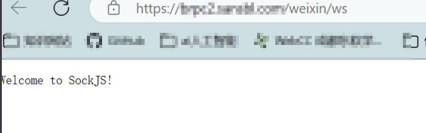
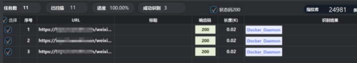
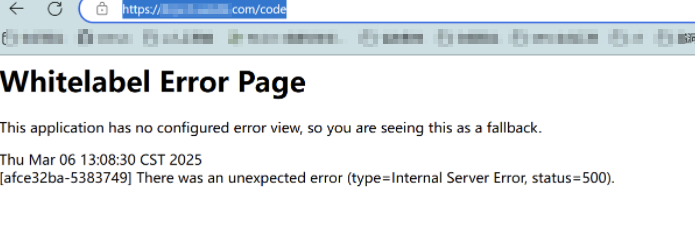
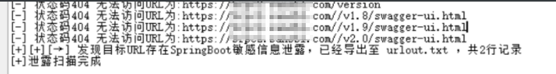
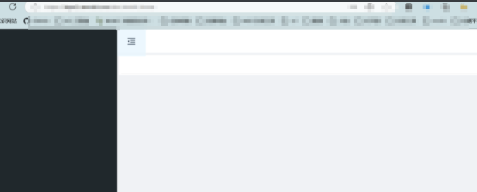
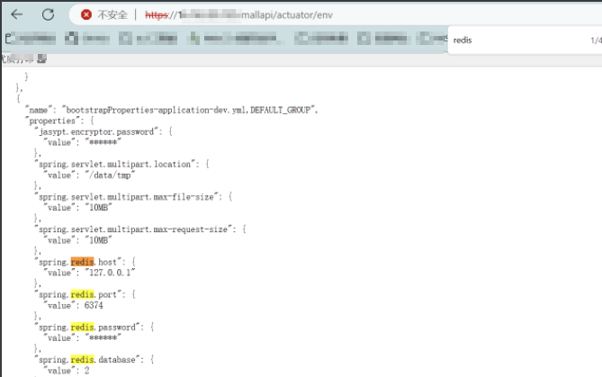
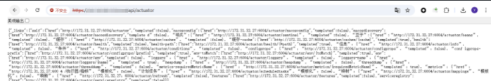
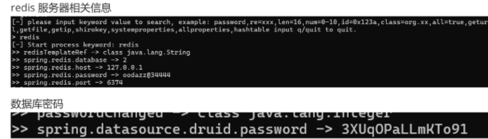

# 记一次诈骗网站渗透测试-先知社区

> **来源**: https://xz.aliyun.com/news/17760  
> **文章ID**: 17760

---

首先看了一下网站的主要运行模式，属于电商诈骗，投钱进去支持两个电商项目，然后每在巴西卖出一单会给你分红，接下来进行信息收集

## 信息收集

没有敏感信息泄露

分析cms发现是经典的webpack加上js的前后端分离

在前端发现照片的来源是阿里的深圳云上

开放端口只有443

根据这里的icon的hash进行查找，找到了他们的供应链后台

[https://xxxxx/#/login](https://brpc2.sansbl.com/#/login)

主要围绕app登录界面和供应链后台展开

## 供应链后台

对其进行接口扫描后返回了html数据，发现使用了webscocket(访问到了 SockJS 服务器的根路径才会显示这行)



对接口进行整理然后重新进行指纹识别发现了docker的守护进程



综合这两者发现目标服务器运行了一个基于 WebSocket 的 Docker 远程管理系统

对接口进行端口重扫然后查看返回的信息

其中有json数据

```
{
  "code": 0,
  "msg": null,
  "data": {
    "records": [
      {
        "id": "1",
        "name": "广东省xxxx有限公司",
        "sort": 1,
        "code": "10000",
        "type": "1",
        "tenantId": "1",
        "phone": null,
        "fax": null,
        "email": null,
        "address": null,
        "remarks": "4145",
        "createTime": "2018-01-22 19:00:23",
        "updateTime": "2020-07-22 21:44:15",
```

有公司的信息，建造的时间和更新时间，备注为4145，公司或组织的编码为1000

​

首先对这个点进行尝试

尝试找 WebSocket API 端点

```
curl -i https://xxx.com/weixin/ws/info
```

返回值

```
{"entropy":1398464894,"origins":["*:*"],"cookie_needed":true,"websocket":true}
```

返回值表明该服务支持 WebSocket，并且可能需要 Cookie

访问 wscat -c ws://xxxx.com/weixin/ws

```
返回error: Unexpected server response: 301
```

猜测可能需要 使用`wss://`而不是`ws://`

访问 wscat -c wss://xxxxx.com/weixin/ws

```
error: Unexpected server response: 200
```

服务器 **没有正确处理 WebSocket 握手**，而是返回了普通 HTML

这条路貌似因为nginx的反向代理走不通

放弃这条路，转而继续收集信息

然后继续对接口进行访问的时候发现访问xxxxx[.com/code](https://brpc2.sansbl.com/code)的时候为这个经典的spring boot页面



直接用工具扫泄露发现两个泄露点



一个类似于后台，但是没有数据



另一个则是暴露了很多api的信息

```
{"openapi":"3.0.1","info":{"title":"OpenAPI definition","version":"v0"},"servers":[{"url":"http://127.0.0.1:9999","description":"Generated server url"}],"paths":{},"components":{}}
```

说明使用了OpenAPI的版本，地址等信息

另外通过对于这个网页的api构造发现其中的basedir是mallapi

所以再进行构造mallapi/xxxxxxx

这里需要把actuator的路径都查看一遍，但是重点看两个页面，一个是/env，一个是/configprops

查看env

里面显示了有redis的服务



同时里面还有redis的端口，继续查看发现还有数据库的类型以及url，还有一些不是那么重要的信息，比如服务器环境和用的joolun，这里我们目标很明显就是查找数据库的密码了

继续访问后又是有信息泄露



可以下载heapdump文件，那么直接解析

发现



直接连接便可
