# TGCTF-misc全解-先知社区

> **来源**: https://xz.aliyun.com/news/17776  
> **文章ID**: 17776

---

# TGCTF-misc方向wp

## next is the end

下载压缩包，拉出第一层文件夹，直接嵌套读取内容找flag

```
import os

def is_last_level_dir(directory):
    """检查目录是否是最后一层（即不包含任何子目录）"""
    for item in os.listdir(directory):
        item_path = os.path.join(directory, item)
        if os.path.isdir(item_path):
            return False
    return True

def find_last_level_txt_files(root_dir):
    """查找所有最后一层的txt文件"""
    txt_files = []
    for root, dirs, files in os.walk(root_dir):
        if is_last_level_dir(root):
            for file in files:
                if file.lower().endswith('.txt'):
                    txt_files.append(os.path.join(root, file))
    return txt_files

def display_file_contents(file_path):
    """显示文件内容"""
    try:
        with open(file_path, 'r', encoding='utf-8') as f:
            print(f"
=== 文件: {file_path} ===")
            print(f.read())
    except UnicodeDecodeError:
        try:
            with open(file_path, 'r', encoding='gbk') as f:
                print(f"
=== 文件: {file_path} ===")
                print(f.read())
        except Exception as e:
            print(f"
无法读取文件 {file_path}: {str(e)}")
    except Exception as e:
        print(f"
无法读取文件 {file_path}: {str(e)}")

def main():
    root_directory = input("请输入要扫描的根目录路径: ")
    if not os.path.isdir(root_directory):
        print("错误: 提供的路径不是一个有效的目录")
        return
    
    txt_files = find_last_level_txt_files(root_directory)
    
    if not txt_files:
        print("没有找到任何最后一层的txt文件")
        return
    
    print(f"
找到 {len(txt_files)} 个最后一层的txt文件:")
    for file in txt_files:
        display_file_contents(file)

if __name__ == "__main__":
    main()
```

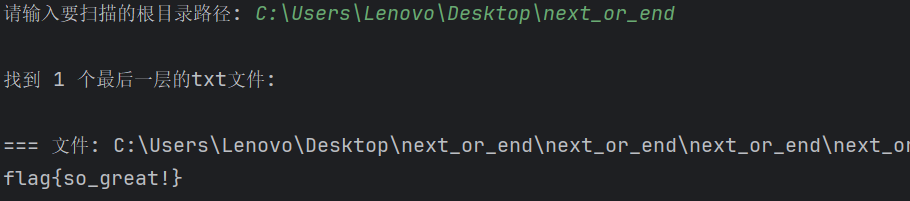

## where it is(osint)

搜图直接定位

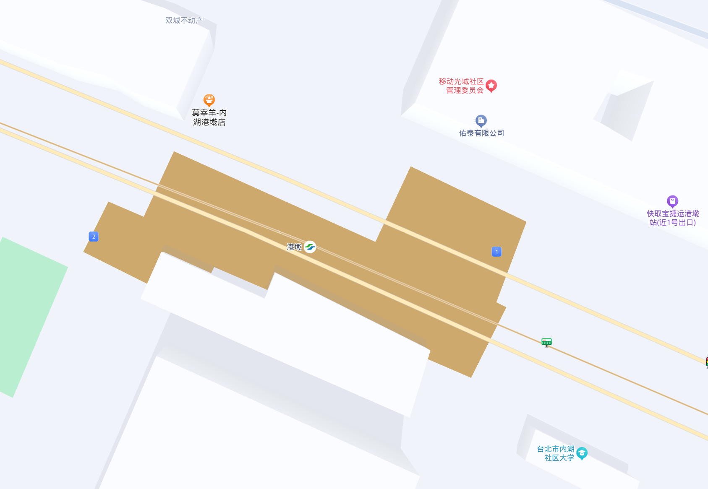

```
TGCTF{港墘站}
```

## 你的运气是好是坏？

直接盲猜CTFer最喜欢的数字114514

```
TGCTF{114514}
```

## 简单签到，关注：”杭师大网安“谢谢喵

关注公众号

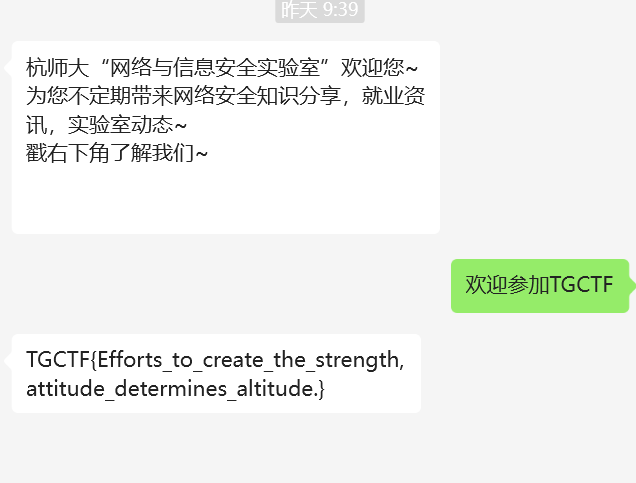

```
TGCTF{Efforts_to_create_the_strength, attitude_determines_altitude.}
```

## 这是啥o\_o

010打开，gif文件头，我们修改后缀并分离动图帧

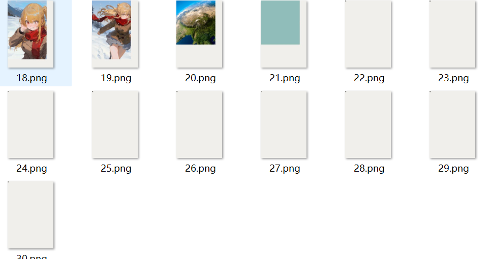

发现二维码片段

我们拼个图

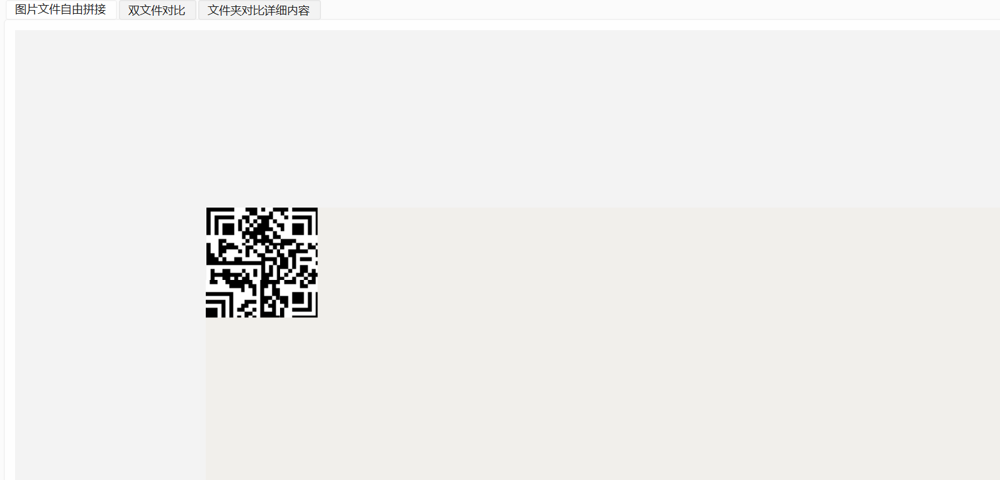

汉信码，扫码内容

```
time is your fortune ,efficiency is your life
```

提示内容指向时间帧，我们查看动图的时间间隔

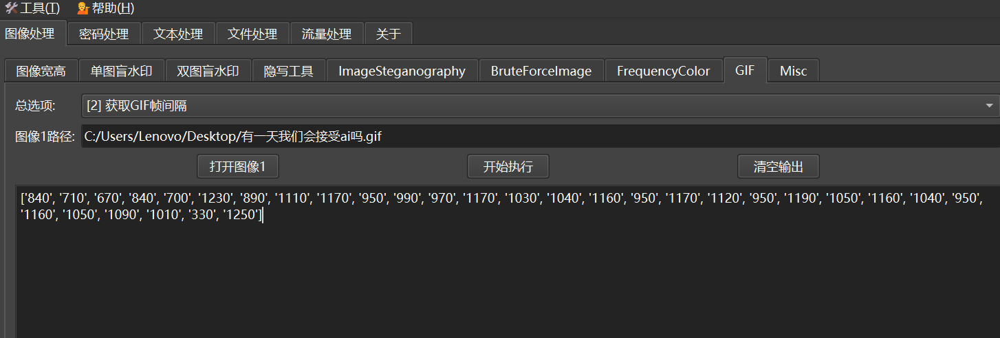

处理一下数据

```
84 71 67 84 70 123 89 111 117 95 99 97 117 103 104 116 95 117 112 95 119 105 116 104 95 116 105 109 101 33 125
```

厨子处理

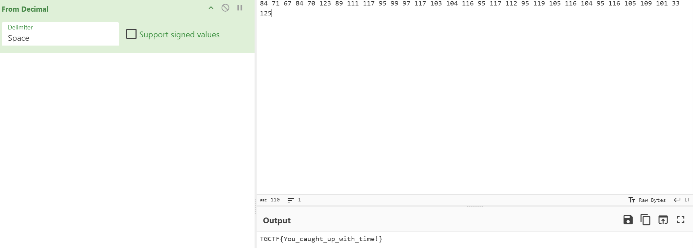

## TeamGipsy&ctfer

下载附件，是虚拟机，开机有密码，取证大师打开

查看终端记录重启过docker，检索文档看到有个mimi.txt

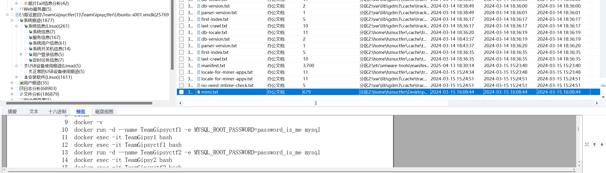

直接上r-studio，恢复并拉出目录下的docker文件

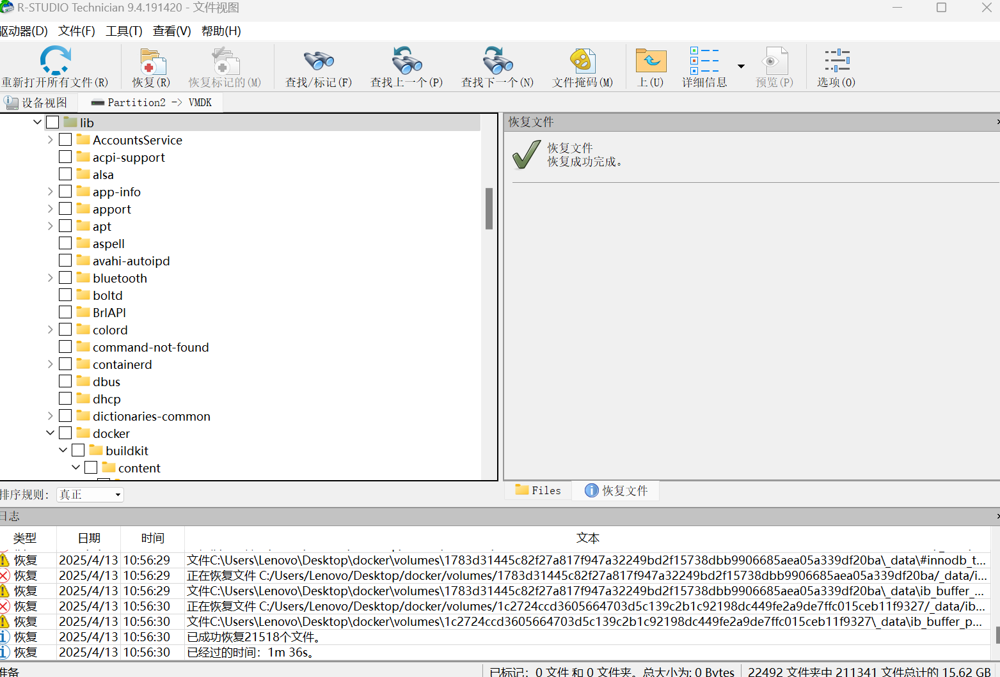

window命令全局搜索

```
findstr /s /i "HZNUCTF{" C:\Users\Lenovo\Desktop\docker\*
```

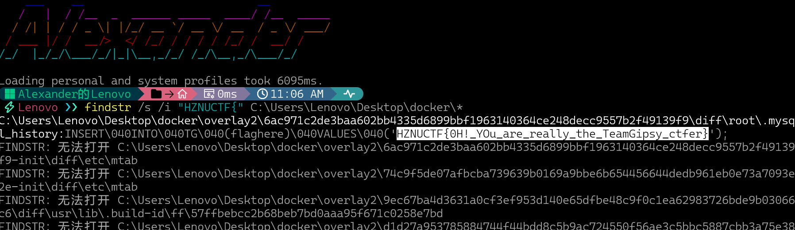

```
HZNUCTF{0H!_YOu_are_really_the_TeamGipsy_ctfer}
```

## ez\_zip

下载附件，第一层直接爆破

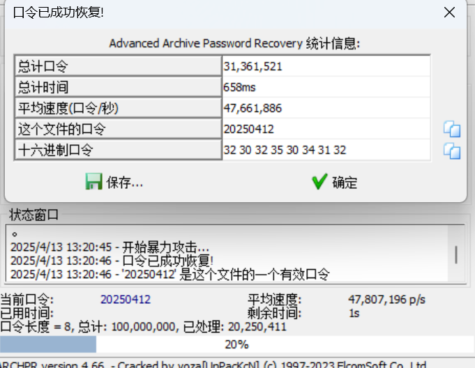

密码

```
20250412
```

打开第二层

我们将第一层sh512中的内容进行sha512加密，另存为一个txt并压缩

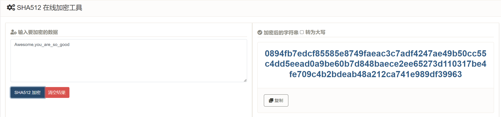

```
0894fb7edcf85585e8749faeac3c7adf4247ae49b50cc55c4dd5eead0a9be60b7d848baece2ee65273d110317be4fe709c4b2bdeab48a212ca741e989df39963
```

进行明文攻击

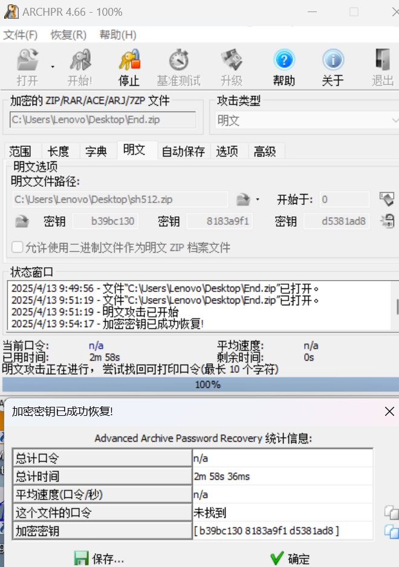

```
加密密钥: [ b39bc130 8183a9f1 d5381ad8 ]
```

清除zip密码，发现flag.zip损坏

010修改数据


用bandzip无视报错解压

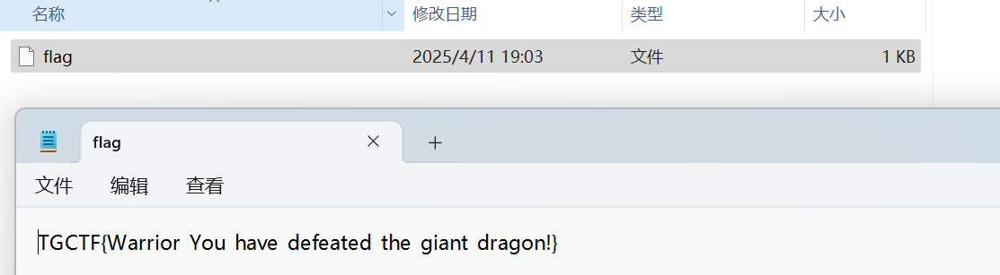

```
TGCTF{Warrior_You_have_defeated_the_giant_dragon!}
```

## 你能发现图中的秘密吗？

第一层，图片拉进随波逐流

在RG0发现解压key

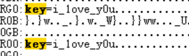

打开第二层

先处理图片

在尾部发现异常的idat块

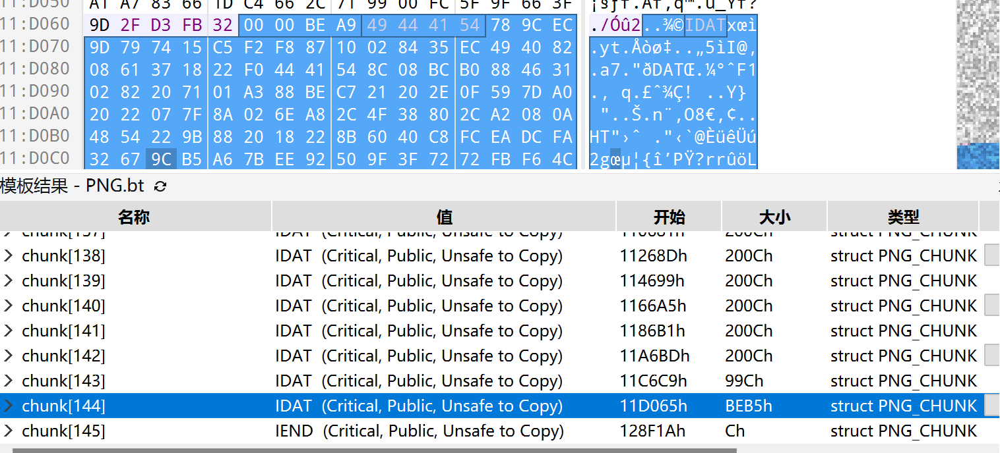

提取出来，补上文件头文件尾，导入010

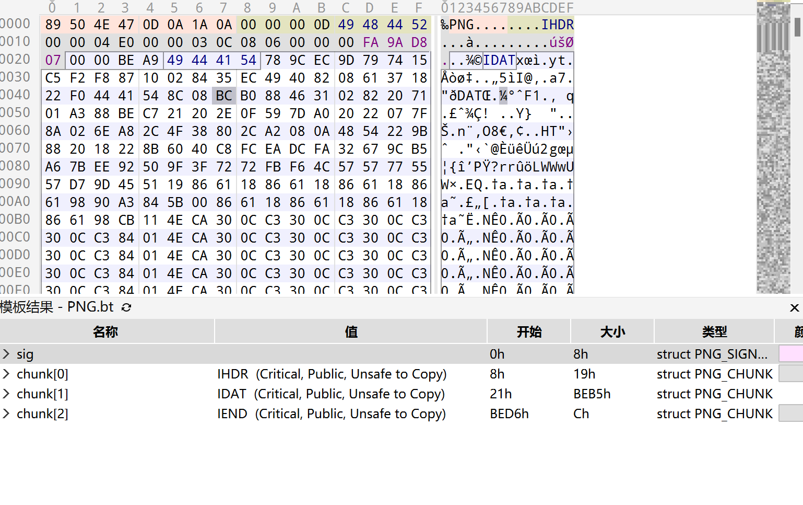

另存png图片

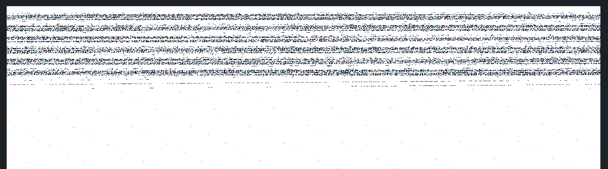

宽高异常，爆破宽高

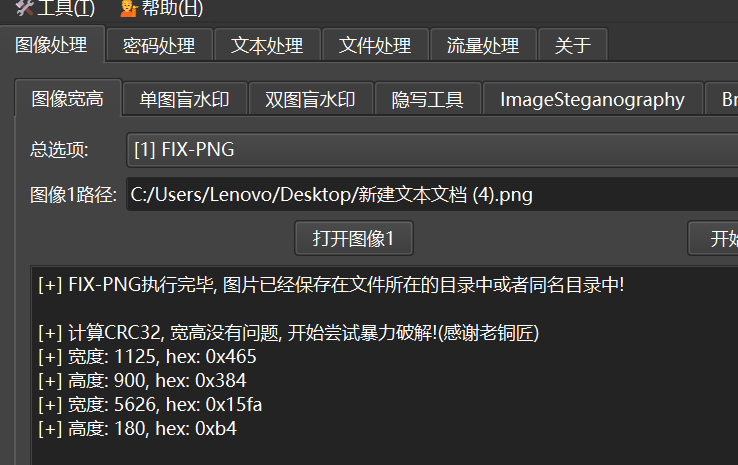


```
part1:flag{you_are_so
```

再看PDF

查看exif信息，用过ps,跟古剑山2024相同思路

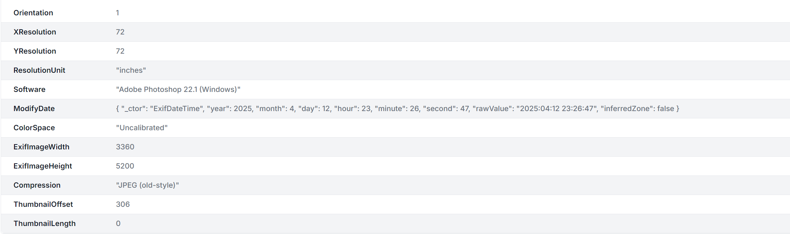

存在2个图层，查看flag2图层

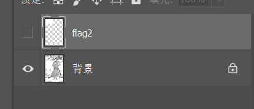

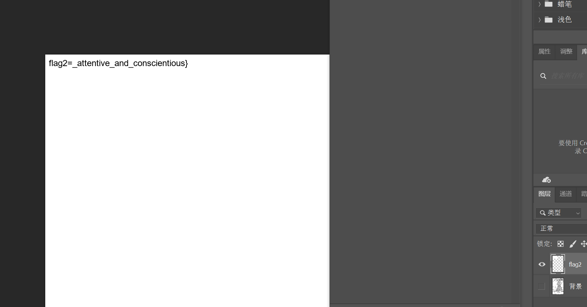

```
part2:attentive_and_conscientious}
```

最后flag

```
flag{you_are_so_attentive_and_conscientious}
```
