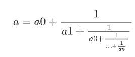
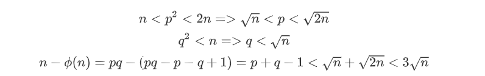

# Wiener's Attack——连分数如何攻破低解密指数RSA-先知社区

> **来源**: https://xz.aliyun.com/news/17784  
> **文章ID**: 17784

---

# 维纳攻击

在 CTF 的 RSA 题目中，维纳攻击（Wiener's Attack）是一种经常会遇到的攻击方式，尤其是使用较小的私钥指数d的时候。大多数情况我们都是直接用脚本，但并没有深入了解其中的原理，只是停留在表面，这里就简单的介绍一下维纳攻击（Wiener's Attack）的基本原理。

简单描述就是，当私钥d足够小时，公钥e和模数n的比值可以通过连分数逼近的方法找到私钥d。再具体点来说，就是通过连分数逼近的方法，对 e/n进行连分数展开来逐步逼近真实的私钥。通过这种方法，攻击者能够恢复出满足RSA方程的有效私钥d。所以在介绍原理之前我们要先了解一些连分数的概念

## **连分数**

连分数是一种特殊的分数表示方法，它将一个实数（包括有理数和无理数）表示为一系列整数的序列。这个序列通过递归的方式定义，每个整数都表示原数在减去前一个整数（或整数序列表示的分数）后的“剩余”部分。

具体来说，对于任何一个有理数a，我们可以将其转换为以下形式：  
  
记为于是我们就将a的连分数记为：a=[a0,a1,a2,…,an]，就相当于用另一种方式表示a。

连分数不仅在理论数学中有深厚的基础，还在许多实际应用中发挥着重要作用。例如，它们可以用于逼近无理数，提供精确的近似值，并在数论、数值计算和信号处理等领域被广泛应用。连分数的结构使得它们在计算中具有高度的灵活性和有效性，能够以相对简单的方式表示复杂的数值，从而帮助人们更好地理解和利用这些数字。

## 收敛分数

收敛分数（也称为分数连分数收敛或连分数逼近）是利用连分数表示法逐步逼近某个实数的过程。具体而言，收敛分数由连分数的前几项构成，旨在提供某个实数的近似值。

设有理数 a=[a0;a1,a2,…,an]a = [a\_0; a\_1, a\_2, \ldots, a\_n]a=[a0;a1,a2,…,an]，其收敛分数包括以下几项：

* [a0]
* [a0,a1]
* [a0,a1,a2]
* ……
* [a0,a1,a2,…,an]

简单来说，收敛分数的计算过程就是把连分数中某一项后面的所有项舍去，从而得到一个a的近似值。随着保留的项数逐渐增多，收敛分数会越来越接近原始数a，这就是它被称为“收敛分数”的原因。

收敛分数不仅在理论上具有重要意义，在实际应用中也非常有用。它们可以为复杂的数值提供高效的近似方法，尤其是对无理数的逼近。通过简单的整数运算，收敛分数使得这些数值的获取变得更加方便。随着项数的增加，收敛分数能够以越来越高的精度表示目标数值，展示了连分数的强大能力和灵活性，因此在数论、计算数学以及信号处理等领域得到了广泛应用。

代码实现：

```
from fractions import Fraction
#取生成连分数
def rational_to_contfrac(x, y):
    # Converts a rational x/y fraction into a list of partial quotients [a0, ..., an]
    a = x // y
    pquotients = [a]
    while a * y != x:
        x, y = y, x - a * y
        a = x // y
        pquotients.append(a)
    return pquotients

l=rational_to_contfrac(17,23)
print(l)
#[0, 1, 2, 1, 5]

def Convergence_function(continued):
    res =[]
    for i in range(1,len(continued)+1):
        tmp = 1
        conver = continued[:i][::-1]
        tmp = Fraction(conver[0])
        for j in conver[1:]:
            tmp = j + 1/tmp
        res.append(tmp)
    return res
print(Convergence_function(l))
#[Fraction(0, 1), Fraction(1, 1), Fraction(2, 3), Fraction(3, 4), Fraction(17, 23)]
```

## 连分数定理（**Legendre's theorem**）

如果存在 a∈Q，且 p,q∈Z满足以下不等式：  
  
那么可以得出结论：分数 p/q 在a的收敛分数展开中，也就是说在求a的收敛分数过程中能够找到p/q 作为一个近似值。

具体来说，这一结果的含义是：当一个有理数a与某个分数p/q的差小于${1\over {2q^2}}$ 时，说明p/q是 a 的一个优良近似值，且它实际上可以在 a 的连分数表示中被找到。这意味着在计算a的连分数时，随着收敛分数的增多，p/q也会出现在收敛分数的某个阶段。

举个例子：  
  
符合要求，就能用连分数定理（**Legendre's theorem**）求出一组含p/q的渐进分数

代码如下：

```
from fractions import Fraction
#取生成连分数
def rational_to_contfrac(x, y):
    # Converts a rational x/y fraction into a list of partial quotients [a0, ..., an]
    a = x // y
    pquotients = [a]
    while a * y != x:
        x, y = y, x - a * y
        a = x // y
        pquotients.append(a)
    return pquotients

l=rational_to_contfrac(309,484)
print(l)
def Convergence_function(continued):
    res =[]
    for i in range(1,len(continued)+1):
        tmp = 1
        conver = continued[:i][::-1]
        tmp = Fraction(conver[0])
        for j in conver[1:]:
            tmp = j + 1/tmp
        res.append(tmp)
    return res
print(Convergence_function(l))

#[0, 1, 1, 1, 3, 3, 1, 2, 1, 2]
#[Fraction(0, 1), Fraction(1, 1), Fraction(1, 2), Fraction(2, 3), Fraction(7, 11), Fraction(23, 36), Fraction(30, 47), Fraction(83, 130), Fraction(113, 177), Fraction(309, 484)]

```

通过这个定理我们就可以得到一分数，里面包含${p \over q}$,而下面的维纳攻击就是我们需要将已知条件凑成我们需要的格式，也就是连分数定理的格式。

## 维纳攻击（wiener attack）

先交代条件：  
  
然后我们开始变换  
  
这里我们就得到了一个和连分数定理（**Legendre's theorem**）里格式接近的式子，然后我们用n代替phin（因为phi(n)与n十分接近）在进行变换：  
  
只要证明其小于1/(2d^2),就能用连分数定理求k/d了

  
因为ed=k*phi(n)+1，代入可以得到：* *由给的条件q<p<2q,n=pq，得到n<p^2<2n,又q^2<n:* *代入到原式可以得到：* *又k*phi(n)+1=ed,所以kphi(n)<ed,然后e<phi(n),所以k\*phi(n)<ed<dphi(n)，所以k<d,于是：  
  
这样我们就能证明：  
  
可以使用连分数定理（**Legendre's theorem**），再通过在得到的渐进分数中筛选出要的k/d,方法如下：

通过将得到的分数的分母d乘e，再利用ed=kphi(n)+1，的特性就能得到需要的渐进分数了，代码如下：

```
import gmpy2
result=(rational_to_contfrac(e,n))
print(result)

res=Convergence_function(result)
print(res)
for i in res:
    try:
        x=(e*i.denominator-1)%i.numerator #(ed-1)//k,如果能整除就说明得到了
        if x==0:
            print(i.denominator)
    except:
        None
```

完整代码：

```
from fractions import Fraction
from Crypto.Util.number import *

def rational_to_contfrac(x, y):
    # Converts a rational x/y fraction into a list of partial quotients [a0, ..., an]
    a = x // y
    pquotients = [a]
    while a * y != x:
        x, y = y, x - a * y
        a = x // y
        pquotients.append(a)
    return pquotients

def Convergence_function(continued):
    res =[]
    for i in range(1,len(continued)+1):
        tmp = 1
        conver = continued[:i][::-1]
        tmp = Fraction(conver[0])
        for j in conver[1:]:
            tmp = j + 1/tmp
        res.append(tmp)
    return res


n = 6969872410035233098344189258766624225446081814953480897731644163180991292913719910322241873463164232700368119465476508174863062276659958418657253738005689
e = 3331016607237504021038095412236348385663413736904453330557803644384818257225138777641344877202234881627514102078530507171735156112302207979925588113589669
c = 1754994938947260364311041300467524420957926989584983693004487724099773647229373820465164193428679197813476633649362998772470084452129370353136199193923837


#获取连分数
result=(rational_to_contfrac(e,n))

#计算渐进分数
res=Convergence_function(result)

#筛选出d，并计算出明文
for i in res:
    try:
        x=(e*i.denominator-1)%i.numerator
        if x==0:
            d=i.denominator
            print(long_to_bytes(pow(c,d,n)))
    except:
        continue


```
