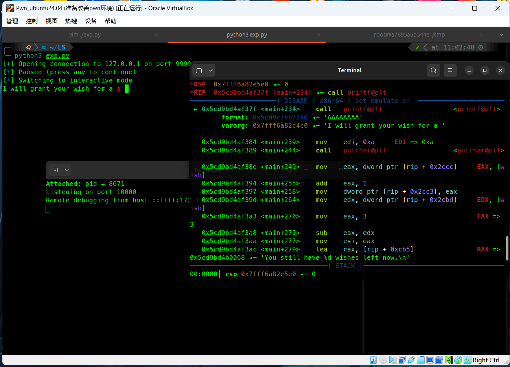

# 利用pwntools脚本联动内置gdb函数优雅的调试docker中的pwn程序-先知社区

> **来源**: https://xz.aliyun.com/news/17785  
> **文章ID**: 17785

---

## 起源：

在CTF中的PWN模块中，我们时常需要用的到gdb来联动exp脚本调试pwn程序，在pwntools的内置函数gdb.attach()上与本地调试非常方便实现，但是本地环境与pwn程序编译时的原生环境还是有所差距，并且一些特殊架构如mips等，或者pwn程序使用了C++的库，利用pathcelf替换libc库就有点力不从心了。

在此之前我尝试过其他师傅的办法，其中最好用的pipe+ tmux 的组合，但是这个办法实测必须要先输入才能输出（pipe有阻塞的特性）。所以仍然不太好用。如果要是在docker内重新安装pwn环境+pwngdb插件会很麻烦（主要是pwngdb难以安装）。

所以我想了一个办法，能对任意docker能运行的镜像系统都能提供一个无缝调试pwn程序体验的办法。非常时候在做题的时候建立临时docker环境用来调试pwn程序。

本文内容截至2025年4月15日仍然有效。

## 步骤：

环境：ubuntu-24.04 + virtualbox7.1.6

前提：已经安装好基础pwn环境和docker环境。

在当前目录下创建Dockerfile文件，内容如下：

```
# 使用基础镜像将该位置的20.04替换成你想要的版本
FROM ubuntu:20.04

#该位置可以提前插入apt的更新源防止apt安装时卡顿
 
# 更新 apt 包索引并安装所需的软件，异架构安装软件办法有所不同，请自行解决
RUN apt-get update && apt-get install -y \
    socat \
    gdb \
    gdbserver \
    vim \
    gcc
 
# 在 /tmp 下生成一个名为 run.sh 的脚本
RUN echo 'socat TCP-LISTEN:9999,fork,reuseaddr EXEC:./pwn' > /tmp/run.sh
 
# 赋予脚本可执行权限
RUN chmod +x /tmp/run.sh
 
# 暴露容器的 9999 和 10000 端口
EXPOSE 9999 10000
 
# 定义容器启动时执行的命令
CMD ["/bin/bash"]
```

使用docker构建镜像（请将当前用户加入docker用户组）：

```
docker build -t pwn-box-20.04 .
```

创建docker容器并赋予一定权限还要开放端口：

```
docker run -it --name pwn-box-20.04 -p 9999:9999 -p 10000:10000 --pid=host --cap-add=SYS_PTRACE pwn-box-20.04 /bin/bash
```

在宿主机将pwn文件复制到docker中：

```
docker cp ./pwn pwn-box-20.04:/tmp/
```

在docker中的/tmp目录下有一个run.sh文件和pwn文件，运行run.sh文件来启用pwn运行在端口9999：

```
./run.sh
```

在你的exp脚本中添加一下函数：

```
import subprocess
import os
 
def get_pid(process_name):
    ps_output = subprocess.check_output(['ps', '-a']).decode('utf-8')
    lines = ps_output.splitlines()
    for line in lines:
        if process_name in line:
            pid = line.split()[0]
            if pid.isdigit():
                return pid
    return None
 
def gdbremote(pid , name = 'pwn-box-20.04' , port = '10000' , ip = '127.0.0.1'):
    os.system("gnome-terminal -- bash -c "docker exec -it " + name + " gdbserver :" + port + " --attach " + pid + " "")
    os.system("gnome-terminal -- bash -c "gdb -ex \"target remote " + ip + ":" + port + "\" "")
```

调用方法为：

```
p = remote("127.0.0.1", 9999)
 
gdbremote(get_pid("pwn"))
pause()
 
#你的exp代码
 
p.interactive()
```

和正常调试一样，运行脚本 ：

```
python3 ./exp.py
```

gdbremote函数会弹出两个窗口，一个是gdbserver的不用管，另外一个是gdb这个和正常使用gdb.attach(p)是一样的，目前测试和本地调试几乎没有区别。在pause时需要先下断点再让exp运行，否则很有可能停不在你想停的地方。

gdb中使用b \*0x??????然后c继续程序，然后才能让exp继续运行。

gdb通过CTRL + D退出后正常来说弹出的两个窗口都会关闭，此时可以重新运行脚本进行调试。

## 效果：


