# Frida-Labs-Native层操作指南-先知社区

> **来源**: https://xz.aliyun.com/news/17791  
> **文章ID**: 17791

---

## Hook Native层中调用的函数并且读取传入的参数

从本章开始进入 Native层

模板如下

```
Interceptor.attach(targetAddress, {
  onEnter: function (args) {
    console.log('Entering ' + functionName);
    // Modify or log arguments if needed
  },
  onLeave: function (retval) {
    console.log('Leaving ' + functionName);
    // Modify or log return value if needed
  }
});
```

它的作用是：

当程序运行到某个特定函数（地址为targetAddress）时：

* 函数刚进入时（onEnter）：打印一句话，说“我进来了”；
* 函数执行完返回时（onLeave）：再打印一句“我出去了”。

每行的意思

```
Interceptor.attach(targetAddress, {
```

用 Frida 的 Interceptor.attach 来拦截（hook）某个函数地址。这个地址是你想观察或修改的函数位置（targetAddress）。

```
onEnter: function (args) {
  console.log('Entering ' + functionName);
  // Modify or log arguments if needed
},
```

当程序刚进入这个函数时，会执行 onEnter 这个回调。  
你可以：

* 打印日志（像现在这样打印“正在进入函数”）；
* 查看和修改传入参数（args 是参数列表）。

```
onLeave: function (retval) {
  console.log('Leaving ' + functionName);
  // Modify or log return value if needed
}
```

当函数执行完准备返回时，会执行 onLeave。  
你可以：

* 打印返回值；
* 修改返回值（retval 是返回值）。

需要获取targetAddress我们可以使用如下API

1. Module.enumerateExports()  
   通过调用 Module.enumerateExports()，我们可以获取到导出函数的名称、地址以及其他相关信息。这些信息对于进行函数挂钩、函数跟踪或者调用其他函数都非常有用。
2. Module.getExportByName()  
   当我们知道要查找的导出项的名称但不知道其地址时，可以使用 Module.getExportByName()。通过提供导出项的名称作为参数，这个函数会返回与该名称对应的导出项的地址。
3. Module.findExportByName()  
   这与 Module.getExportByName() 是一样的。唯一的区别在于，如果未找到导出项，Module.getExportByName() 会引发异常，而 Module.findExportByName() 如果未找到导出项则返回 null
4. Module.getBaseAddress()  
   通过调用 Module.getBaseAddress() 函数，我们可以获取指定模块的基址地址，然后可以基于这个基址地址进行偏移计算，以定位模块内部的特定函数、变量或者数据结构
5. Module.enumerateImports()  
   通过调用 Module.enumerateImports() 函数，我们可以获取到指定模块导入的外部函数或变量的名称、地址以及其他相关信息。

使用 Module.enumerateImports("libfrida0x8.so") 查看导入表

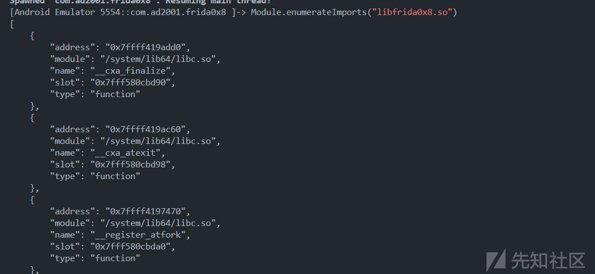

使用Module.findExportByName("libc.so","strcmp");来获取strcmp的地址

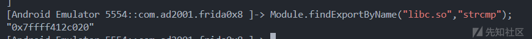

来看这题

加载了一个 frida0x8

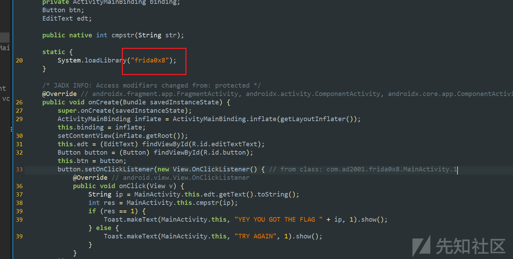

so文件里有一个 strcmp 函数，第二个参数 s2 就是经过处理后的正确的 flag ，所以我们需要把strcmp函数的第二个参数hook出来

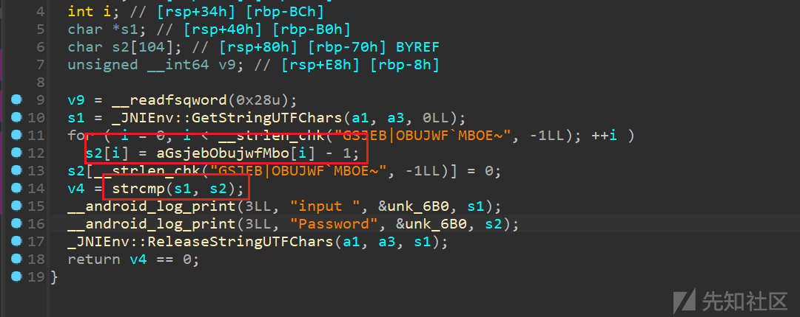

我先按照我自己的想法写了一个脚本

```
function hook() {

  var target = Module.findExportByName("libc.so", "strcmp"); //查找strcmp的地址
  console.log("strcmp addr is :", target.toString(16));

  Interceptor.attach(target, {
    onEnter: function (args) {
      console.log(Memory.readUtf8String(args[1])); //打印strcmp的第二个参数
    },

    onLeave: function (retval) {

    }
  })
}


function main() {
  Java.perform(function () {
    hook();
  })
}
setImmediate(main);
```

输出如下

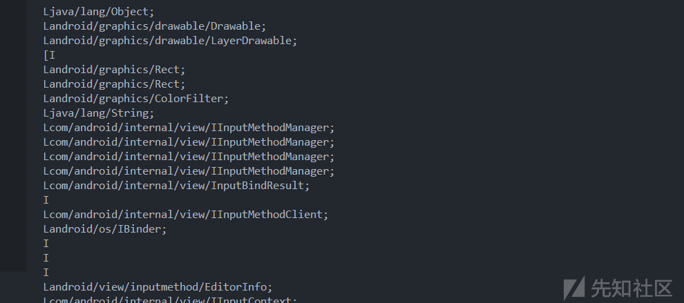

这里其实是因为，我以为我hook的是特定的某一个strcmp，实际上这个 hook 是生效于所有调用 libc.so!strcmp 的地方，无论是 native 调用还是通过 JNI 被 Java 调用的 native 方法，都会被拦截

所以导致了这种情况

所以要加一个判断，当strcmp的第一个参数包含某个数（例如666）时，就打印第二个参数的结果，使我们的目标更加“精确”

修改脚本如下

```
function hook() {

  var target = Module.findExportByName("libc.so", "strcmp"); //查找strcmp的地址
  console.log("strcmp addr is :", target.toString(16));

  Interceptor.attach(target, {
    onEnter: function (args) { //args只是我对参数起的名字，可以改成任何别的

      var input = Memory.readUtf8String(args[0]);

      if (input.includes("666")) {
        console.log(Memory.readUtf8String(args[1])); //打印strcmp的第二个参数
      }

    },

    onLeave: function (retval) {

    }
  })
}


function main() {
  Java.perform(function () {
    hook();
  })
}
setImmediate(main);
```

在 Frida 中：

* Memory 是 Frida 的一个全局对象，提供了访问目标进程内存的方法。
* 它可以用来：

* 读取内存（如 Memory.readUtf8String(ptr)、Memory.readByteArray(ptr, size)）
* 写入内存（如 Memory.writeUtf8String(ptr, "hello")）

你用的 Memory.readUtf8String() 是它最常用的函数之一，专门处理 C 字符串（以 null 结尾的 UTF-8 字符串）。

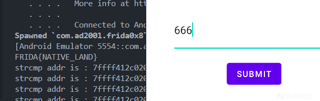

## Hook Native层函数的返回值

check\_flag的值如果是1337就打印flag

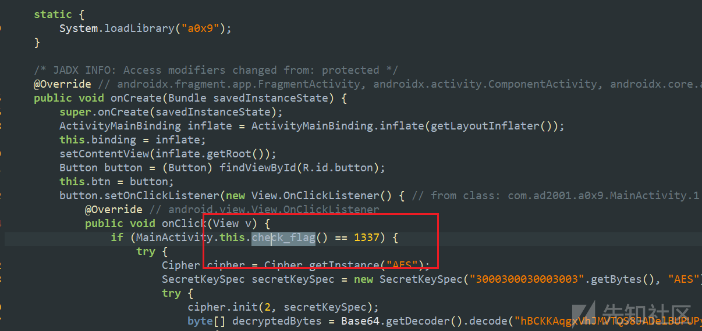

native层中的该函数的返回值是1

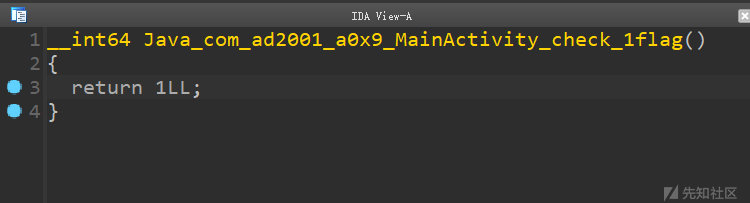

修改该函数的返回值即可

```
function hook() {

  var target = Module.enumerateExports("liba0x9.so")[0]["address"];

  console.log("addr is :", target);

  Interceptor.attach(target, {
    onEnter: function (args) {    
    },

    onLeave: function (retval) {

      console.log("Origin retval is :", retval);
      retval.replace(1337);
    }
  })
}


function main() {
  Java.perform(function () {
    hook();
  })
}
setImmediate(main);
```

思考：

这一句

```
var target = Module.enumerateExports("liba0x9.so")[0]["address"];
```

在 0x8 中使用的是

```
var target = Module.findExportByName("libc.so", "strcmp");
```

我的猜想是，在 0x8 中，我们使用

Module.enumerateImports("libfrida0x8.so")查看导入表，而在该题目中，由于hook的是自己的函数，所以需要使用Module.enumerateExports("liba0x9.so")查看导出表

* 导入表（Imports）：  
  是这个库 调用别人的函数，通常是系统函数，比如 libc.so 里的 malloc、printf、strlen 等。
* 导出表（Exports）：  
  是这个库 暴露给别人用的函数，很多时候是你自己写的，比如 Java\_com\_example\_myapp\_NativeMethod 这种 native 接口，或者一些插件调用的入口函数。

查看导出表

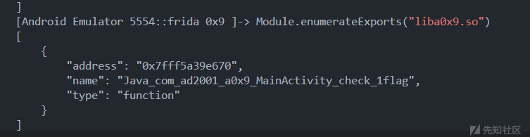

尝试改成跟 0x8 中差不多的写法

```
var target = Module.findExportByName("liba0x9.so", "Java_com_ad2001_a0x9_MainActivity_check_1flag");
```

好吧这样也可以，实践出真知了

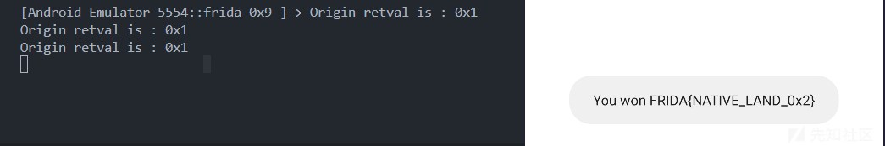

还是解释一下这一句吧

```
var target = Module.enumerateExports("liba0x9.so")[0]["address"];
```

* Module.enumerateExports("liba0x9.so")  
  这会列出 liba0x9.so 这个 native 库里导出的所有函数（也就是那些对外开放可以调用的函数），返回一个包含信息的数组，比如：

```
[
  {name: "check_flag", address: ptr("0x12345678"), type: "function"},
  {name: "init", address: ptr("0x12345690"), type: "function"},
  ...
]
```

* [0]["address"]  
  表示取这个导出函数列表里的第一个函数的地址，也就是 check\_flag 的地址（假设第一个刚好是它）。这一行把这个地址赋值给 check\_flag 变量。[0]表示索引

## Hook Native层未被调用的方法

从本章开始使用模拟器会闪退，这里使用的环境是Redmi K60 安卓14 已ROOT

可以使用如下模板

```
var native_adr = new NativePointer(<address_of_the_native_function>);
const native_function = new NativeFunction(native_adr, '<return type>', ['argument_data_type']);
  native_function(<arguments>);
```

让我们来逐行解释一下

```
var native_adr = new NativePointer(<address_of_the_native_function>);
```

这一句的意思是，我们知道一个原生函数在内存中的地址（比如 0x12345678），把它封装成一个 NativePointer 类型的对象，好让 Frida 能识别这个地址。<address\_of\_the\_native\_function> 是手动填进去的地址，通常是通过逆向分析（IDA、Frida hook 等）找到的函数地址。

```
const native_function = new NativeFunction(native_adr, '<return type>', ['argument_data_type']);
```

这一行的意思是，把这个地址（native\_adr）对应的函数转换成 JavaScript 能调用的函数。

* <return type> 表示这个函数的返回值类型，比如 'int'、'void'、'pointer' 等。
* ['argument\_data\_type'] 表示这个函数的参数类型列表，比如 ['int', 'pointer']。

所以这一行的作用是：用 Frida 的NativeFunction包装原生函数，让你可以像普通 JS 函数那样去调用它。

```
native_function(<arguments>);
```

最后直接调用这个原生函数，传入你需要的参数（这些参数要和上面声明的参数类型匹配）

现在来看看例题

Java层并不能看到什么有用的，只是加载了stringFromJNI()

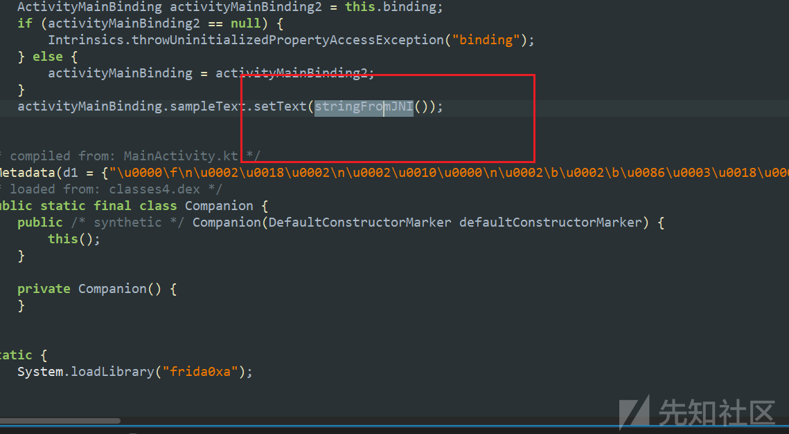

我们来看看native层，stringFromJNI也没什么有用的信息，但是有一个get\_flag函数可以打印flag

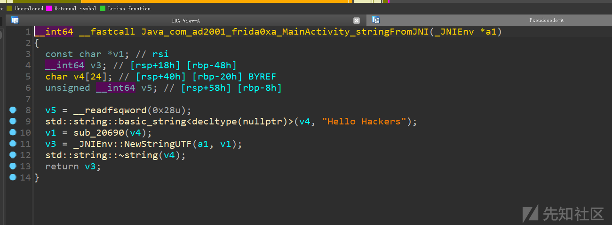

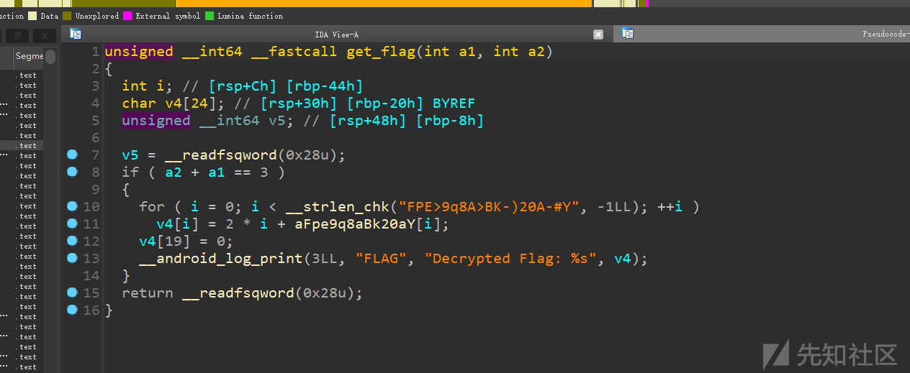

于是思路就是，利用上面的模板 hook 出get\_flag函数

模仿 0x9 中使用 Module.enumerateExports("libfrida0xa.so") 查看导出表，发现导出表非常之长，直接使用var target = Module.enumerateExports("liba0x9.so")[0]["address"];进行索引会有点麻烦，所以我们换一种方法

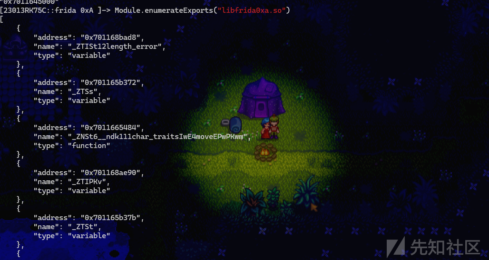

由于ALSR（地址随机化）的问题，所以我们先使用Module.findBaseAddress("libfrida0xa.so");查看一下基地址

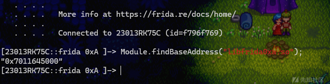

可以构造如下循环

```
var base_addr = Module.findBaseAddress("libfrida0xa.so");
var exports = Module.enumerateExports("libfrida0xa.so");

var target = null;

for (var i = 0; exports[i] != null; i++){

  if (exports[i]["name"] == "_Z8get_flagii") {

    console.log("function get_flag : ", exports[i]["address"]);
    console.log((exports[i]["address"] - base_addr).toString(16));

    target = exports[i]["address"];

  }

}
```

这里我们找到基地址后，遍历导出表，如果在导出表中找到了 get\_flag 函数，就打印出 get\_flag 函数的绝对地址

同时由于我们知道了绝对地址和基地址，于是我们就可以顺便把偏移地址也打印出来

偏移 = 函数地址 - 模块基地址

这样我们就找到了我们需要 hook 的目标函数的地址

这里还有个问题，为什么 get\_flag 要写成 "\_Z8get\_flagii" 呢

这其实是C++ 的 name mangling（名字改编 / 名字重整）问题

什么是 Name Mangling？

在 C++ 中，函数名会被编译器自动改写成一串带有额外信息的名字，称为 mangled name（重整名字）。

这是因为 C++ 支持函数重载（同名函数，不同参数），而汇编语言、链接器、操作系统等底层东西并不支持这一特性。

举个例子：

```
int add(int a, int b);
float add(float a, float b);
```

这两个函数在 C++ 中是合法的，因为它们参数不同。但如果你不做 name mangling，它们在汇编/符号表里都叫 add，系统就不知道你到底想调用哪个。

所以编译器会把它们改名：

```
int add(int, int)       --> _Z3addii
float add(float, float) --> _Z3addff
```

这就是 name mangling。

由于我们主要研究frida hook，这个问题就不过多赘述

回归正题，知道了我们的目标地址后就可以直接写脚本啦，利用上面的模板

```
function hook() {

  var base_addr = Module.findBaseAddress("libfrida0xa.so");
  var exports = Module.enumerateExports("libfrida0xa.so");

  var target = null;

  for (var i = 0; exports[i] != null; i++){

    if (exports[i]["name"] == "_Z8get_flagii") {

      console.log("function get_flag : ", exports[i]["address"]);
      console.log("base addr is:", (exports[i]["address"] - base_addr).toString(16));

      target = exports[i]["address"];

    }

  }

  var get_flag_ptr = new NativePointer(target);
  const My_get_flag = new NativeFunction(get_flag_ptr, 'char', ['int', 'int']);


  var flag = My_get_flag(1, 2);
  console.log(flag);


}

function main() {
  Java.perform(function () {
    hook();
  })
}

setImmediate(main)
```

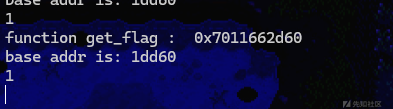

由于打印出的是函数的返回值，而且so文件中使用的函数是\_\_android\_log\_print，所以flag在logcat中可以看到

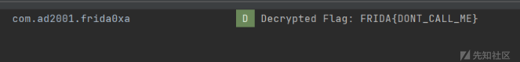

思考：能否直接在frida面板中打印出flag？

有的兄弟，有的

还记得lab0x8的内容吗，我们可以Hook \_\_android\_log\_print这个函数，直接截获 flag

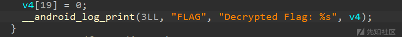

flag的内容是\_\_android\_log\_print的第四个参数，所以我们直接读取它的第四个参数然后打印出来就行

完整hook并打印flag的脚本如下

```
function hook() {

  var base_addr = Module.findBaseAddress("libfrida0xa.so");
  var exports = Module.enumerateExports("libfrida0xa.so");

  var target = null;

  for (var i = 0; exports[i] != null; i++){

    if (exports[i]["name"] == "_Z8get_flagii") {

      console.log("function get_flag : ", exports[i]["address"]);
      console.log("base addr is:", (exports[i]["address"] - base_addr).toString(16));

      target = exports[i]["address"];

    }

  }

  var get_flag_ptr = new NativePointer(target);
  const My_get_flag = new NativeFunction(get_flag_ptr, 'char', ['int', 'int']);

  var print_addr = Module.findExportByName(null, "__android_log_print"); //hook __android_log_print函数
  Interceptor.attach(print_addr, {

    onEnter: function (args) {

      var flagPtr = args[3];
      var flag = flagPtr.readCString();
      console.log(flag); //读取并打印flag内容
    },

    onLeave: function (retval) {

    }
  });

  var flag = My_get_flag(1, 2);
  console.log(flag);


}

function main() {
  Java.perform(function () {
    hook();
  })
}

setImmediate(main)
```

## 更改Native层的汇编指令

先来看x86下的模板

```
var writer = new X86Writer(opcodeaddr);
Memory.protect(opcodeaddr, 0x1000, "rwx");
try {

  writer.flush();

} finally {

  writer.dispose();
}
```

我们来解释一下

```
var writer = new X86Writer(opcodeaddr);
```

* 创建了一个写指令的“写手”对象，叫 writer。
* X86Writer 是 Frida 提供的一个类，用来向指定内存地址写入 x86 汇编指令。
* opcodeaddr 是你想修改的地址，比如某个函数开头或者中间的指令地址。

```
emory.protect(opcodeaddr, 0x1000, "rwx");
```

* 把从 opcodeaddr 开始的一段内存（大小为 0x1000 字节，也就是一页）设置为可读（r）、可写（w）、可执行（x）。
* 默认情况下，程序的代码区域一般是只读的；要想修改它，就得先把它“解锁”。

```
try { writer.flush(); }
```

try块中我们可以插入要修改/添加的x86指令。X86Writer实例提供了各种方法来插入各种x86指令。

writer.flush();

* 插入指令后，调用flush方法将更改应用到内存中。这确保修改后的指令被写入内存位置。

```
finally { writer.dispose(); }
```

最后无论是否出错，都调用 dispose() 来释放资源。否则可能会造成内存泄漏

对于x86而言，我们可以查阅如下文档

[JavaScript API | Frida • A world-class dynamic instrumentation toolkit](https://frida.re/docs/javascript-api/#x86writer)

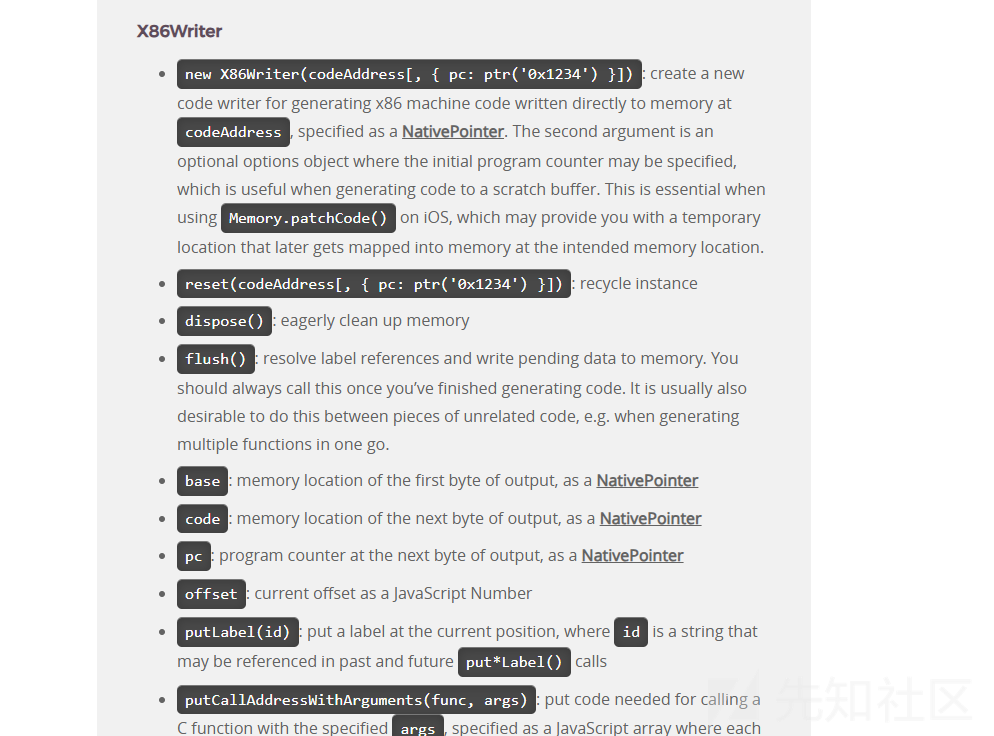

对于arm64而言，我们可以查阅如下文档

[JavaScript API | Frida • A world-class dynamic instrumentation toolkit](https://frida.re/docs/javascript-api/#arm64writer)

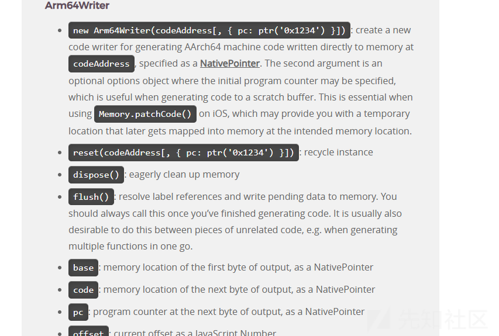

接下来让我们看看例题，使用的架构为arm64架构

Java层依旧是什么都没有

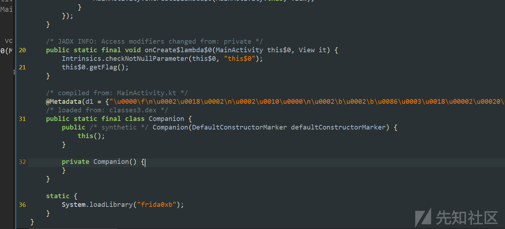

native层中的MainActivity伪代码界面什么都没有，很明显这不正常

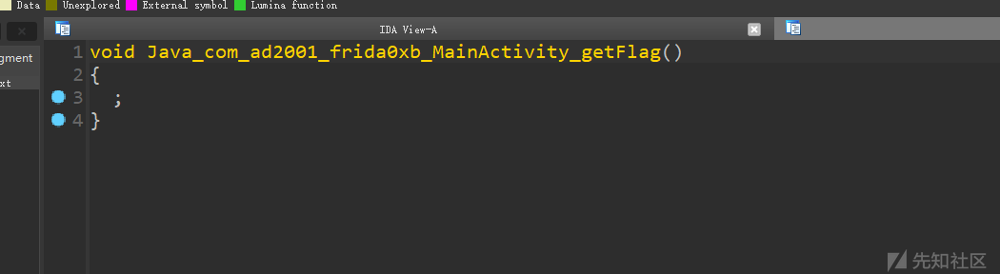

看看控制流，发现这里构成了一个永假跳转指令，导致我们的IDA反编译出错

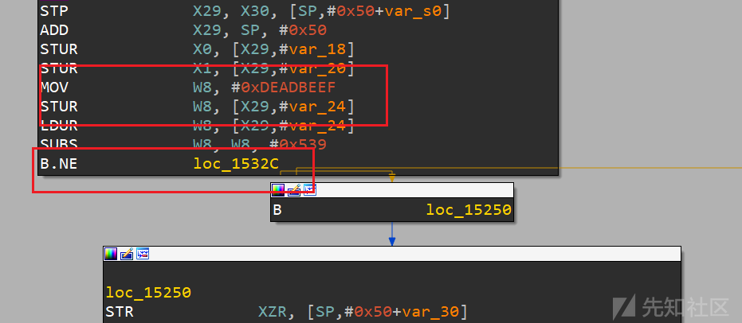

那么，我们直接nop掉这个B.NE即可

IDA查看偏移地址是在0x15248处

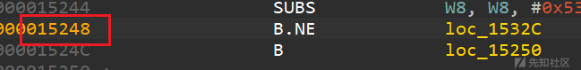

开始hook

```
function hook() {

  var base_addr = Module.getBaseAddress("libfrida0xb.so");

  console.log("Base address : ", base_addr);
  var BNE_addr = base_addr.add(0x15248);

  Memory.protect(base_addr, 0x1000, "rwx");

  var writer = new Arm64Writer(BNE_addr);

  try {
    writer.putNop();
    writer.flush();
    console.log("Success!!");
  } finally {
    writer.dispose();
  }
}

function main() {
  Java.perform(function () {
    hook();
  })
}

setTimeout(main, 1000);
```

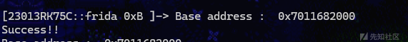

同样是需要到logcat中查看flag

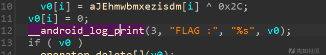
