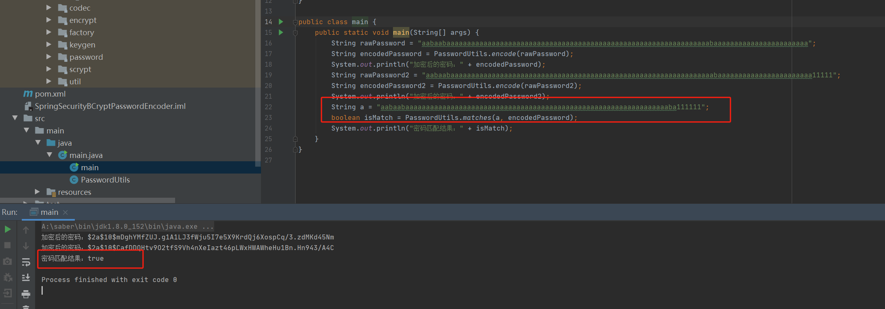
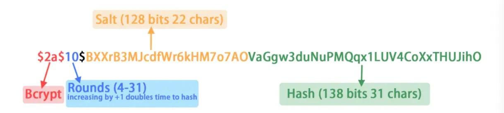
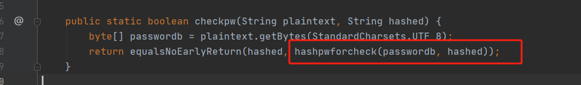
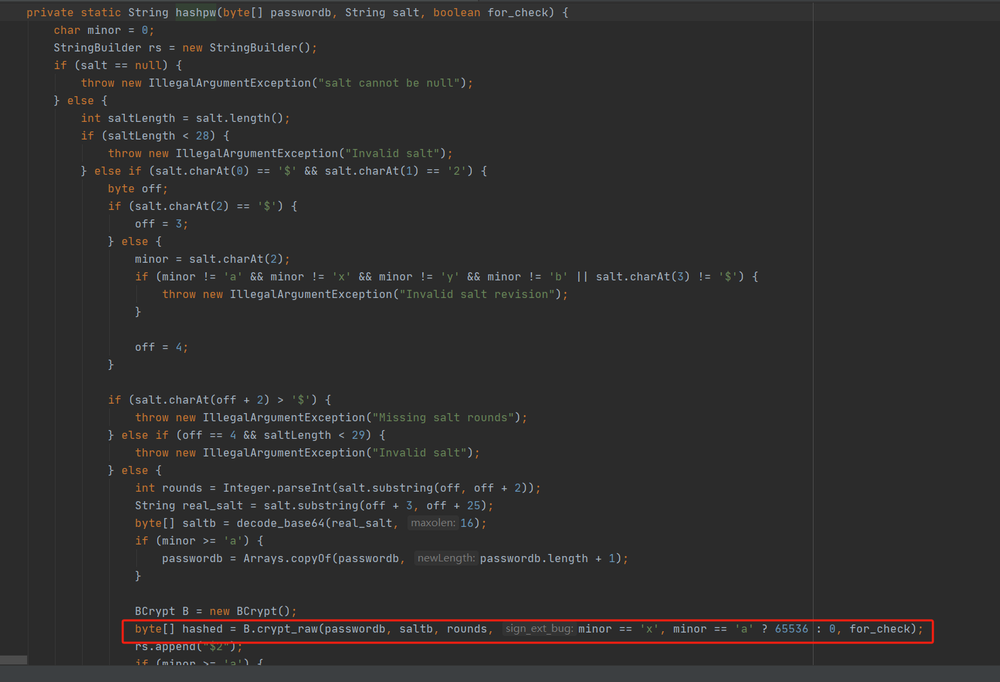
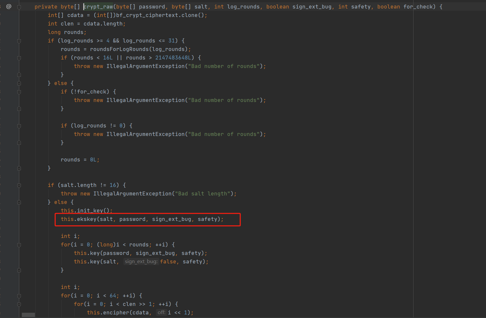
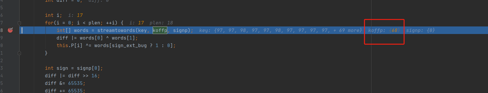
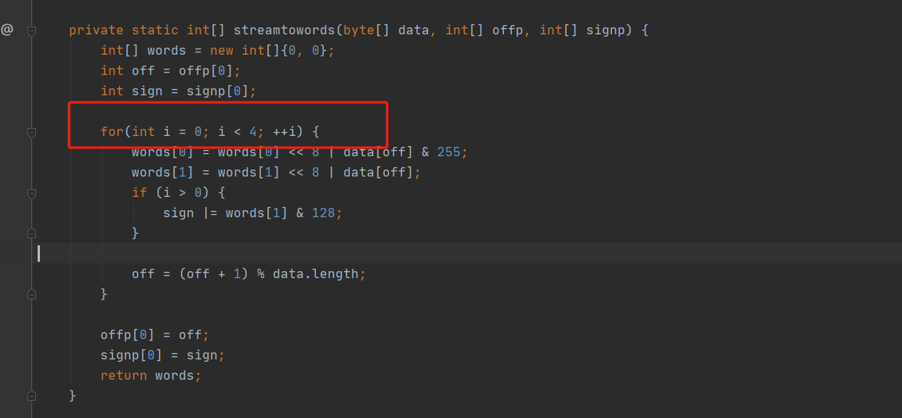
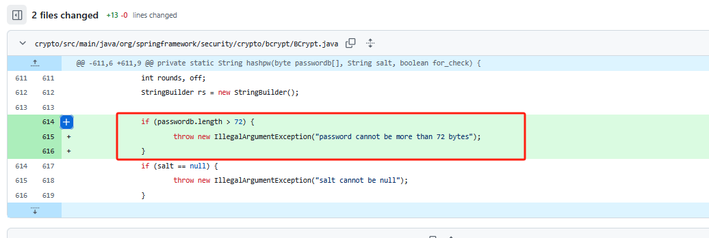

# CVE-2025-22228 Spring Security 超长密码处理不当漏洞分析-先知社区

> **来源**: https://xz.aliyun.com/news/17795  
> **文章ID**: 17795

---

# 0x00 前言

大家好，这里是环境准备10小时，复现漏洞10分钟的Moon。本篇文章将会针对CVE-2025-22228 Spring Security 超长密码处理不当漏洞进行分析，以及分享一些复现和分析漏洞的方法和经验。

复现难易度：2

> 复现难易度从1-5，以此递增，个人见解。  
> 1：简单跟进即可分析漏洞  
> 2：需要对内容进行分析，必要时进行动态调试  
> 3：纯静态无法分析，必须要进行动态调试  
> 4：链路复杂，需要大量的时间和精力。  
> 5：天命

## 1.漏洞概述

危害：中危  
漏洞描述：pring Security BCryptPasswordEncoder 在校验经过 BCrypt 加密后的密码时未对长度做校验，当前 72 个字符相同时会认为密码正确，攻击者可利用该漏洞绕过身份验证，进行提权或窃取系统敏感信息。  
影响组件：org.springframework.security:spring-security-crypto  
影响版本：<6.4.4

# 0x01 漏洞复现

看到漏洞描述，我们就知道得调用org.springframework.security:spring-security-crypto来常见我们的Demo

千万不要去用dependency 加载，否则就会浪费时间进行等待，在没有基础的情况下，不要去构造Springboot。我们的目的是为了分析问题原因，而不是把精力都浪费在Demo上。

我们采用通过maven库下载的方式，进行demo的构造。

在Maven库找一个存在漏洞的版本的jar包，本地只有1.8的小伙伴可以下载低版本一点的。

<https://repo.maven.apache.org/maven2/org/springframework/security/spring-security-crypto/5.8.0/spring-security-crypto-5.8.0.jar>

直接创建Test，然后一个main函数，如下

```
import org.springframework.security.crypto.bcrypt.BCryptPasswordEncoder;

class PasswordUtils {
    private static final BCryptPasswordEncoder encoder = new BCryptPasswordEncoder();

    public static String encode(String rawPassword) {
        return encoder.encode(rawPassword);
    }
    public static boolean matches(String rawPassword, String encodedPassword) {
        return encoder.matches(rawPassword, encodedPassword);
    }
}

public class main {
    public static void main(String[] args) {
        String rawPassword = "aabaabaaaaaaaaaaaaaaaaaaaaaaaaaaaaaaaaaaaaaaaaaaaaaaaaaaaaaaaaaaaaaaaabaaaaaaaaaaaaaaaaaaaaaaa";
        String encodedPassword = PasswordUtils.encode(rawPassword);
        System.out.println("加密后的密码：" + encodedPassword);
        String rawPassword2 = "aabaabaaaaaaaaaaaaaaaaaaaaaaaaaaaaaaaaaaaaaaaaaaaaaaaaaaaaaaaaaaaaaaaabaaaaaaaaaaaaaaaaaaaaaaa11111";
        String encodedPassword2 = PasswordUtils.encode(rawPassword2);
        System.out.println("加密后的密码：" + encodedPassword2);
        String a = "aabaabaaaaaaaaaaaaaaaaaaaaaaaaaaaaaaaaaaaaaaaaaaaaaaaaaaaaaaaaaaaaaaaaba111111";
        boolean isMatch = PasswordUtils.matches(a, encodedPassword);
        System.out.println("密码匹配结果：" + isMatch);
    }
}

```

如果提示commons-logging确实，这个时候再去Maven加载

```
    <dependencies>
        <dependency>
            <groupId>commons-logging</groupId>
            <artifactId>commons-logging</artifactId>
            <version>1.2</version>
        </dependency>
    </dependencies>
```

我们来运行一下结果，可以看到如果72位一致，则会为True，如下图所示：至此漏洞已复现。



# 0x02 BCrypt

如果有耐心看到这里的话，那不妨先了解一下BCrypt

BCrypt 是一种广泛使用的密码哈希算法，主要用于安全地存储用户密码。BCrypt 的一个显著特点是它允许通过调整工作因子（通常称为 cost）来控制哈希计算的复杂度。

主要特点就是计算慢，抗彩虹表，遍历成本高。

来看一下结构：



因为Salt就在Hash中，这样即使是相同的密码也会有不同的Hash，也就是预制彩虹表无法进行使用

# 0x03 漏洞分析

那么这个漏洞的核心点就是为什么只处理了72位，以各位看官的聪明才智应该很快能想到，一定是有一个地方有截取。故我们一起进行分析一下。

首先看`public boolean matches(CharSequence rawPassword, String encodedPassword)`

首先是做了一个简单的判断，然后跟进到`return BCrypt.checkpw(rawPassword.toString(), encodedPassword);`

盯着Password，可以看到在`hashpwforcheck`进行了参数的传入，继续跟进



->`hashpw`跟进到这个方法，是一个比较关键的地方

这里是进行Salt的处理，以及计算Password hash的地方



跟进到`ekskey`，这里就是取Password内容进行计算



在`ekskey`的`streamtowords`方法这里，第一感觉是有问题，向后跟进，但是无果，因为没有看到任何截断Password的操作，随后进行动态调试

这里可以发现`plen`为16，且koffp为4


运行到循环最后一次，off 为68



最后的4在`streamtowords`方法里



至此，我们就可以得到72截取的位置和内容，也达到了我们的目的。

# 0x03 修复

官方修复很简单，修复如下，>72就抛出异常



# 0X04 扩展

可以看到这种漏洞居然也可以通过Cve，那是不是可以把这个当做测试用例，在之后所有的出现BCrypt，都可以去尝试进行这个漏洞的测试，如果没有做截取判断，或者异常判断，那么恭喜，喜获漏洞一枚。

​

以上
