# emlog文件上传漏洞分析（CNVD-2025-04611）-先知社区

> **来源**: https://xz.aliyun.com/news/17803  
> **文章ID**: 17803

---

## 影响版本`​`

v2.5.3

## 描述

emlog是一套基于PHP和MySQL的CMS建站系统。

emlog v2.5.3版本存在文件上传漏洞，该漏洞源于admin/plugin.php插件组件对上传的文件缺少有效的验证。攻击者可利用该漏洞上传恶意文件从而远程执行任意代码。

## 环境安装

官网链接下载：<https://gitee.com/snowsun/emlog/releases/download/pro-2.5.3/emlog_pro_2.5.3.zip>

这里为了方便，使用phpstudy搭建环境

下载源码后解压在WWW目录下，也可以给网站设置一个域名

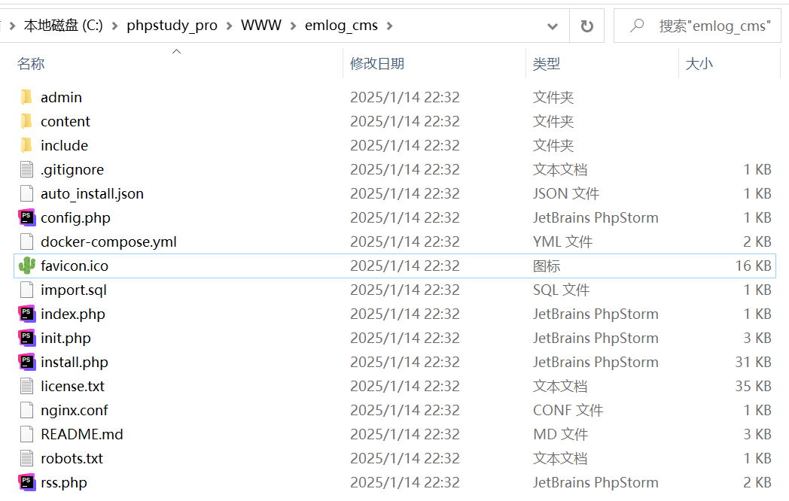

这里演示域名为：emlog.com

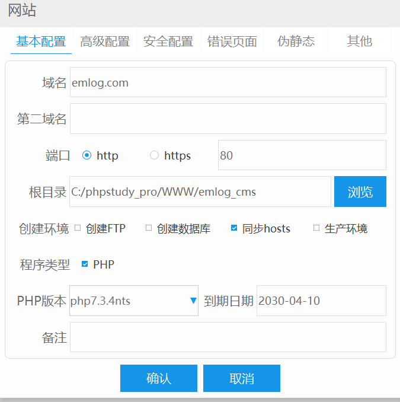

打开网站输入数据库信息正常安装

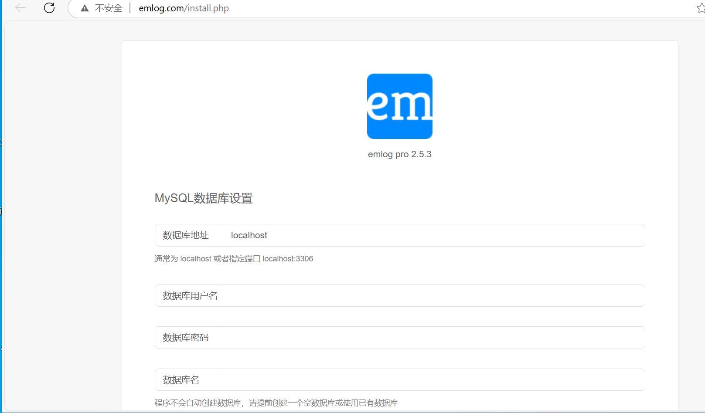

安装成功后，进入后台登录

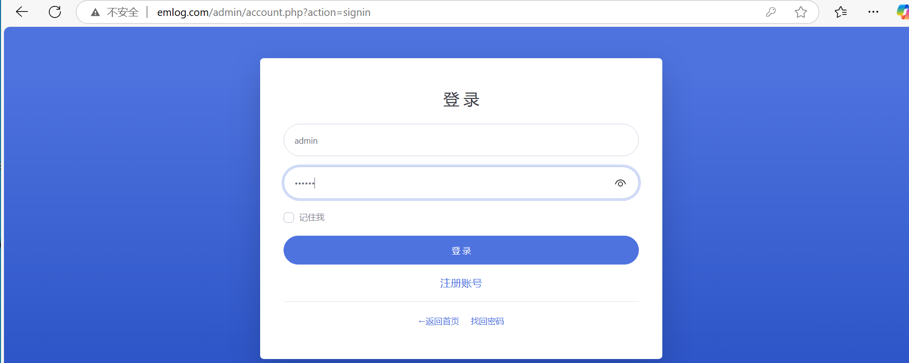

## 漏洞复现

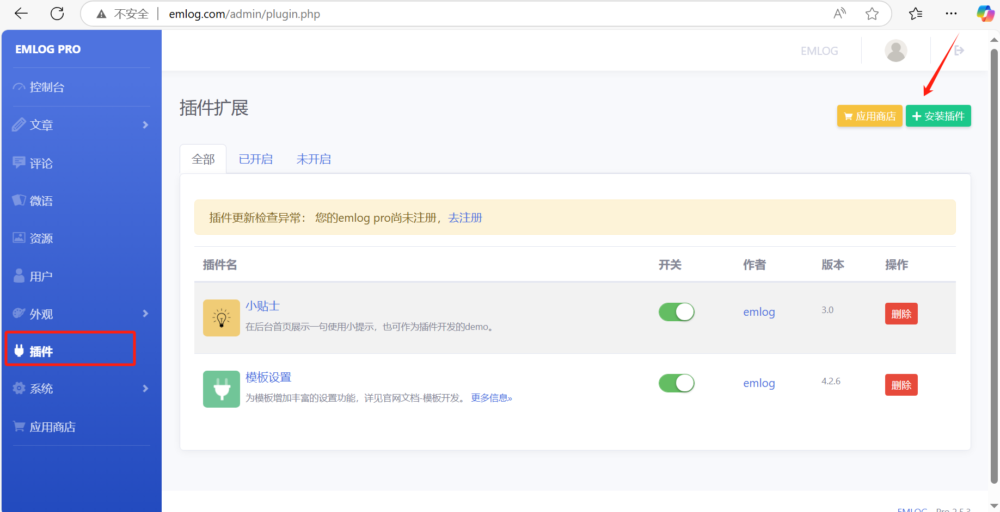

登录后台后，点机安装插件功能

通过描述需要上传一个zip文件

准备一个名为shell的文件夹，里面包含shell.php

php文件内容

`<?php phpinfo();`

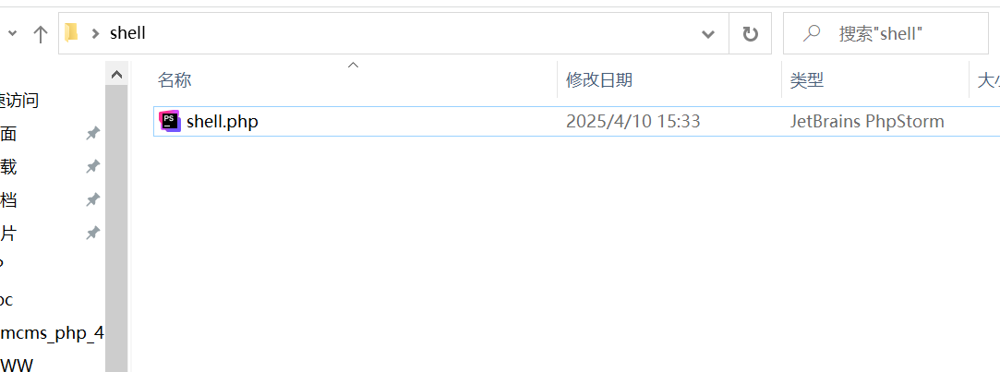

将其shell文件夹压缩为zip文件上传

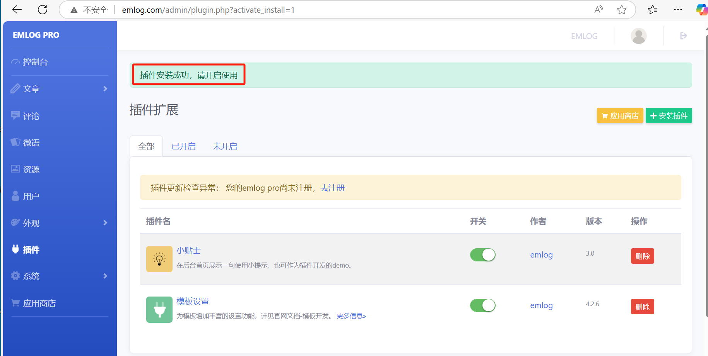

提示插件安装成功

访问目录：/content/plugins/shell/shell.php

成功回显phpinfo

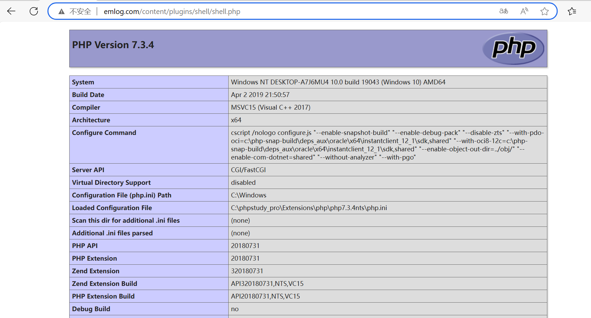

## 代码分析

根据描述找到代码路径admin/plugin.php

由于是上传文件功能，所以直接搜索upload

根据代码大体简单分析，应该就是这里了

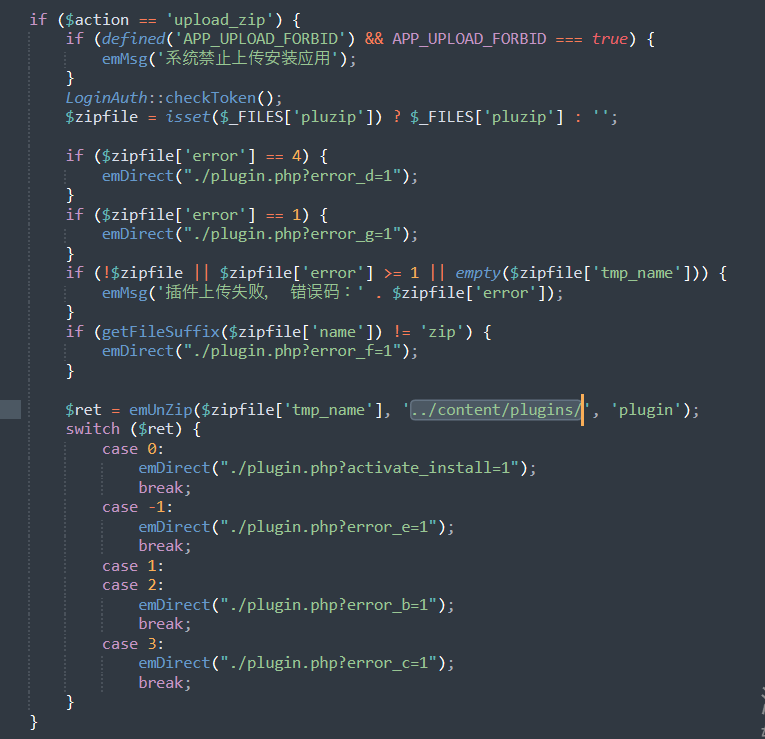

首先的满足`$action == 'upload_zip'`

根据抓包中的传参，满足条件成功

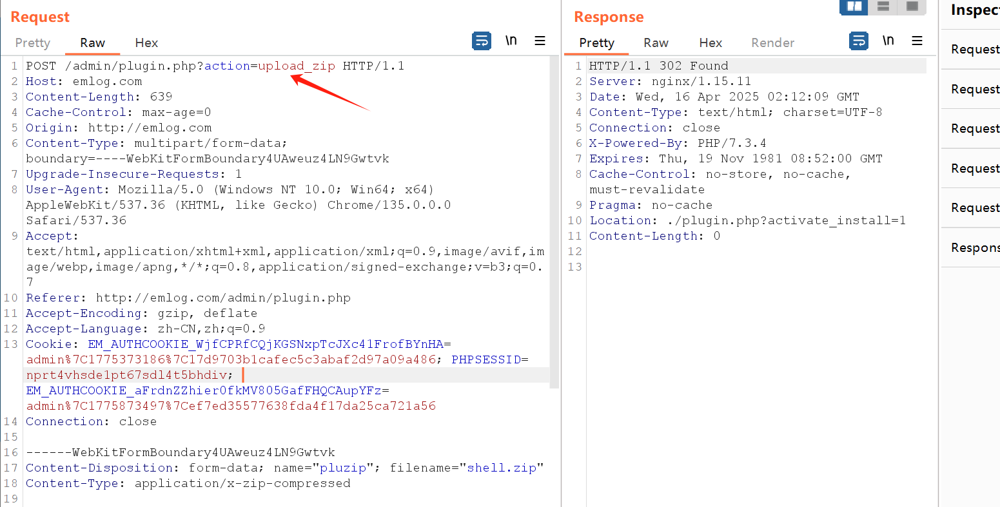

接着分析下面的代码，会判断你上传的文件是否存在

`$zipfile = isset($_FILES['pluzip']) ? $_FILES['pluzip'] : '';`

且会根据报错值显示相对于的返回（如：error\_d）

我们以正常的流程去上传zip文件就不会报错

而`LoginAuth::checkToken();`用于验证用户的Token身份令牌

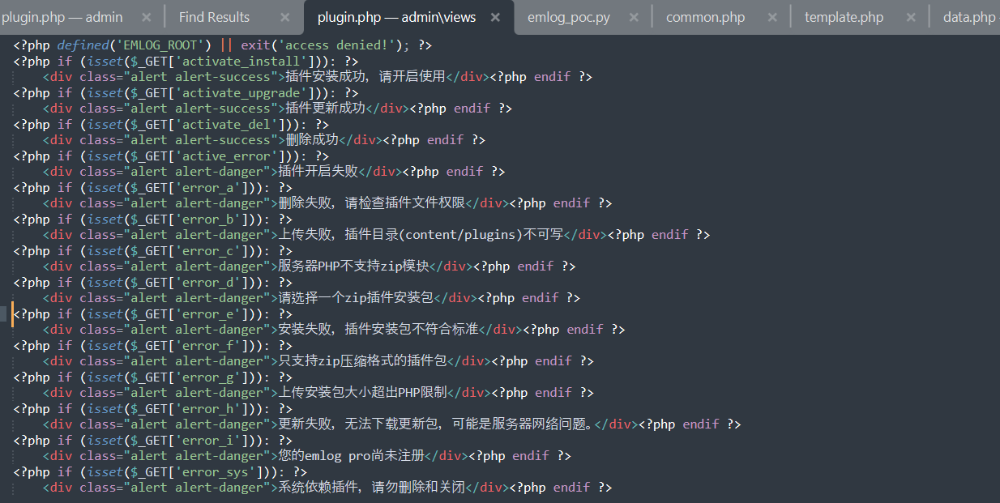

接着就是emUnZip()函数，它大体的意思会将你上传的上传的zip文件解压到指定的目录下。

其中`$r = explode('/', $zip->getNameIndex(0), 2);`把我们上传的zip文件里的第一个文件按照斜杠 (/) 分割成最多两个部分，并将结果存储在数组 `$r` 中

例如：ZIP 文件中第一个文件的名称是“shell/shell.php”，它就会分割为shell与shell.php

我们想让文件正常上传成功，就的让emUnZip()返回值为0

emUnZip()函数接受三个参数，接受的$tpye为“plugin”

其中`$re = $zip->getFromName($dir . $plugin_name . '.php');`

代表着尝试从 ZIP 文件目录中提取文件，插件名拼接后再加上 .php

提取是否成功，如果失败，返回-1，也就是会报错

如果满足了以上条件，接着

if (true === @$zip->extractTo($path)) {

$zip->close();

return 0;

}

就会将ZIP 文件的内容解压缩到指定的路径 $path，$path为传入的第二个参数（../content/plugins/），并返回0

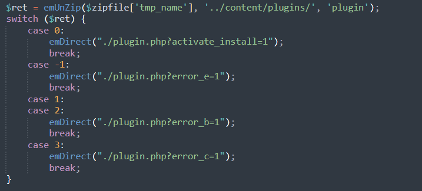

通过以上分析，得出只要我们上传的文件为zip文件，且zip里面的内容必须为文件夹加文件。然而代码中并没有对文件内容做一个合理的检测，导致我们可以很简单的上传恶意文件成功

## POC&EXP

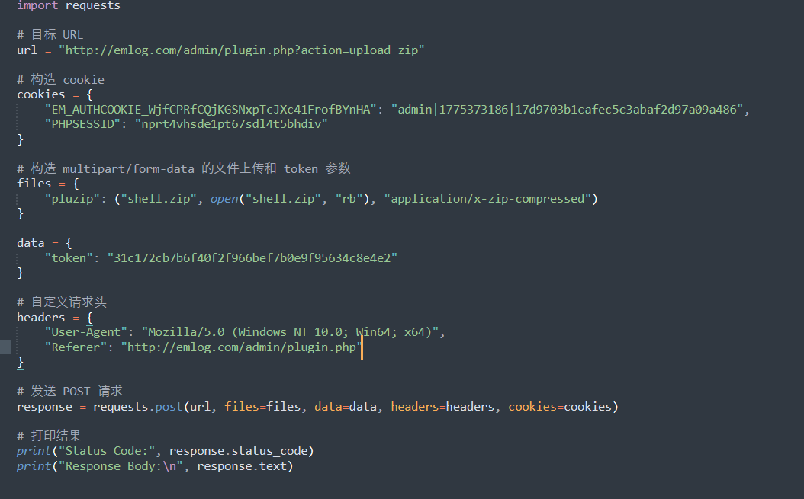

## 建议

1. 开发人员对上传的zip文件内容进行一个合理的检验
2. 升级版本
