# 海洋CMS 远程命令执行 漏洞复现（CVE-2024-42599） 安装教程 + 超详细分析-先知社区

> **来源**: https://xz.aliyun.com/news/17805  
> **文章ID**: 17805

---

# 首先seaCMS 13.0安装

首先安装 seaCMS 13.0 版本   
<https://www.seacms.net/download/%E5%AE%89%E8%A3%85%E5%8C%85/SeaCMS_V13_install.zip>（13.0版本直接下载）

为什么要安装13.0版本呢？因为根据CVE-2024-42599 是13.0 版本

漏洞点是 admin\_files.php 这个文件导致的。 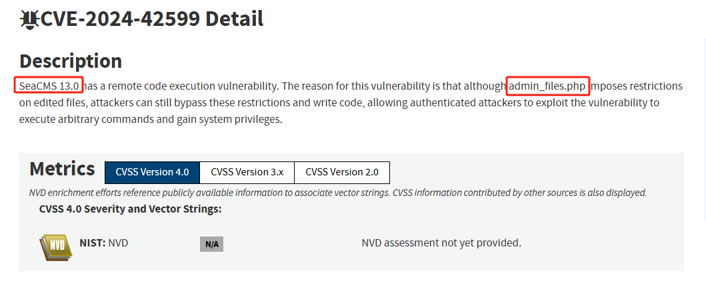

<https://seacms.net/>（seacms官网 里面有安装文档）

下载好了 解压到 小皮面板的www目录下面 自己命名

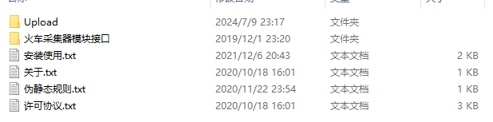

将Upload 里面的文件 移动到 解压的目录下面 这样直接可以进行访问。

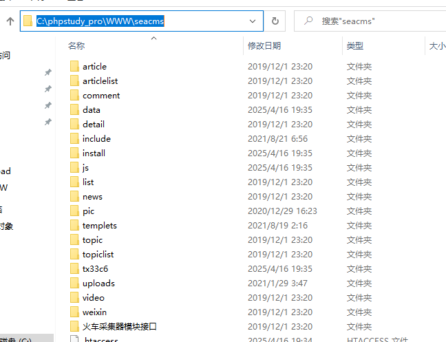

然后打开小皮面板

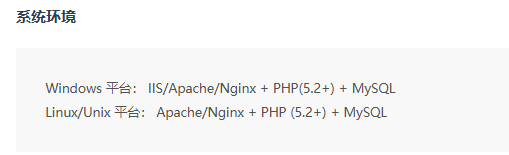

根据需要的系统环境 下载对应的PHP版本和mysql

小皮面板创建网站

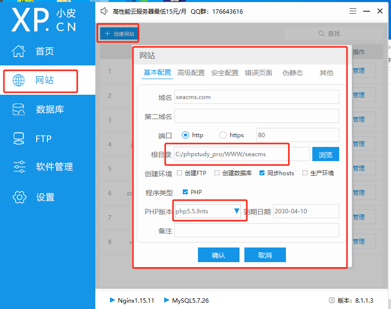

我这里用的 PHP5.5.9nts版本 MySQL5.7.26

访问刚刚的域名即可查看安装的页面

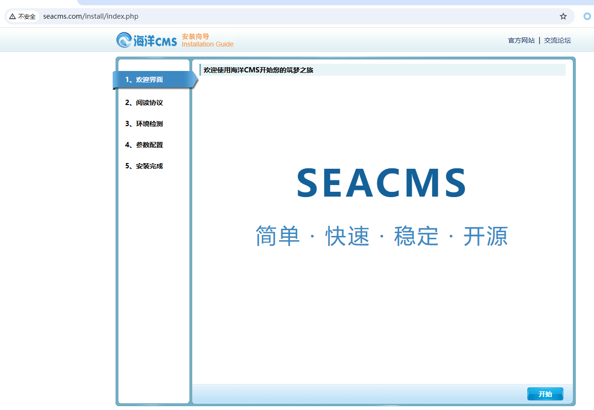

一直 下一步 下一步 下一步即可

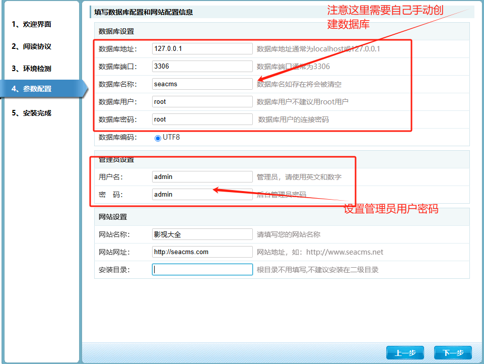

我这里用Navicat Premium 15 进行连接创建数据库

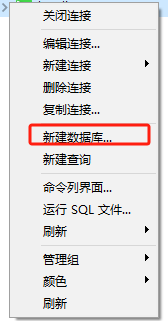

新建数据库

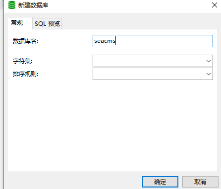

创建好和安装界面的名称一样的 下一步。

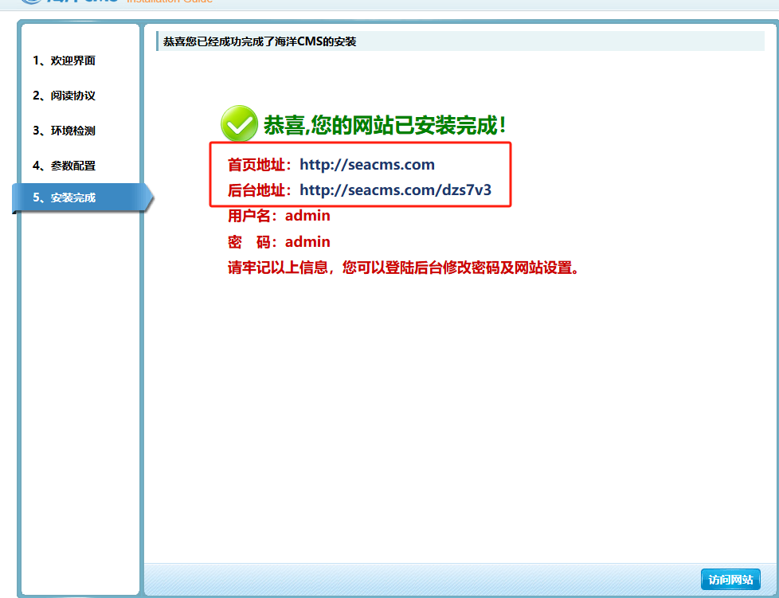安装完成首页地址就是seacms.com 。

后台地址是随机生成了 网站根目录下也会存在这个文件。

seaCMS也安装好了。接下来进行漏洞分析。

​

​

# seaCMS CVE-2024-42599 分析

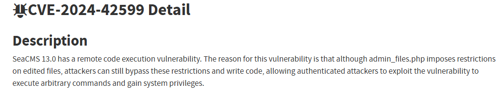

根据漏洞提示 存在远程命令执行漏洞

​

尽管 admin\_files.php 对编辑的文件施加了限制，但攻击者仍然可以绕过这些限制并编写代码，从而允许经过身份验证的攻击者利用此漏洞执行任意命令并获得系统权限。

​

快速分析源码找到安装好的seacms下的admin\_files.php

文件位于 WWW\seacms\dzs7v3\admin\_files.php

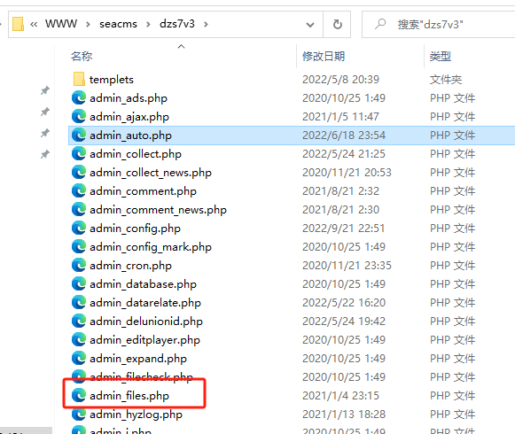

进行分析，已经提示了远程大妈执行漏洞 我们去搜寻远程代码执行漏洞的相关危险函数。

ctrl+f 查找 include require 发现 存在很多include 文件包含

一下是 include 函数详解

<https://www.runoob.com/php/php-includes.html>

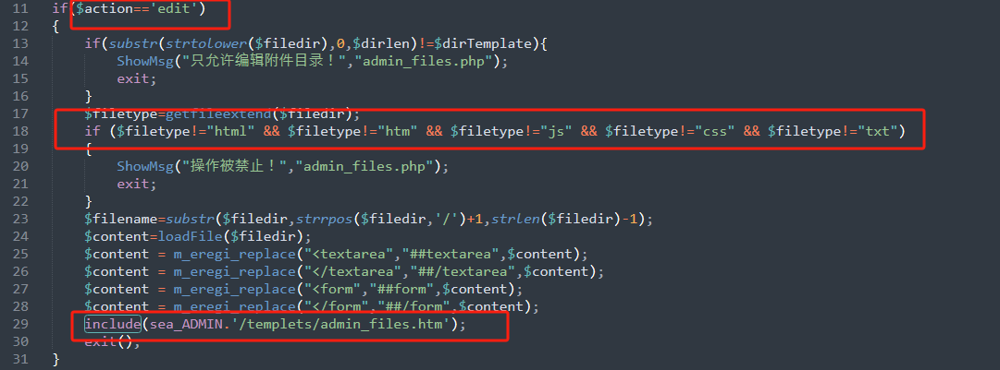

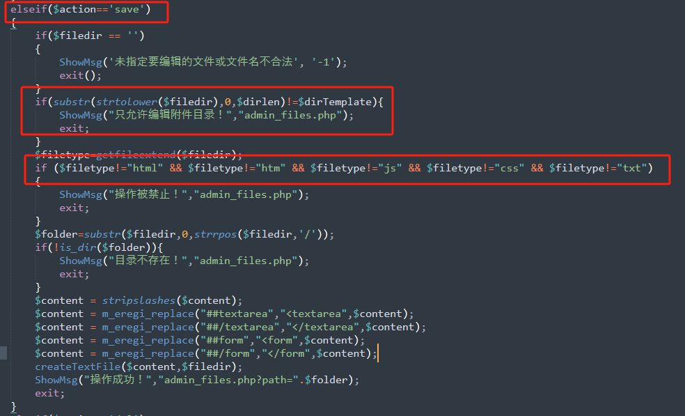

分析发现 很多if条件 $action=='edit' 'editcus' 'saveCus' 'save' 'del'等等 他们的代码几乎都是相同的。都是只做了白名单验证限制 没有对文件内容进行验证。

​

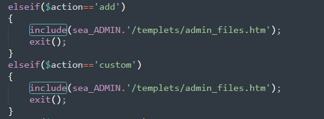

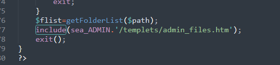

很多地方都对/templets/admin\_files.htm 进行了文件包含 那么我们通过修改

admin\_files.htm 内容进行修改 内容里面带有php命令执行函数 然后被include 解析 即可造成 远程命令执行

​

分析完成 我们登入seacms的后台页面 一步步寻找 admin\_files.php 这给功能点（通过bp抓包）

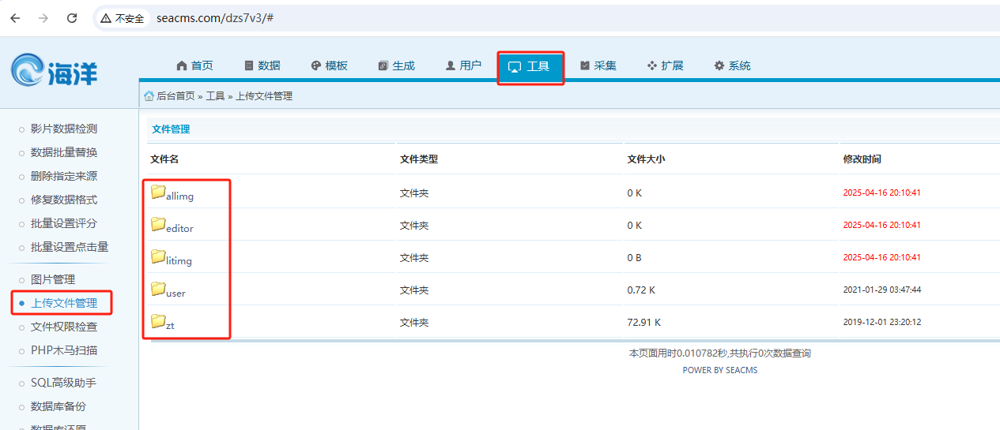

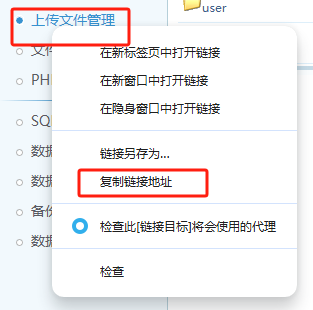

最后找到功能点在这里 我们可以右键复制一下连接地址 看看 <http://seacms.com/dzs7v3/admin_files.php>

发现这里就是admin\_files.php 存在的地方

随便点进去一个文件 里面有着 index.html 可以修改内容

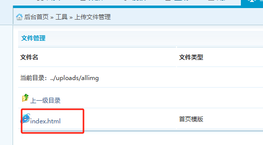

我们抓包看看。

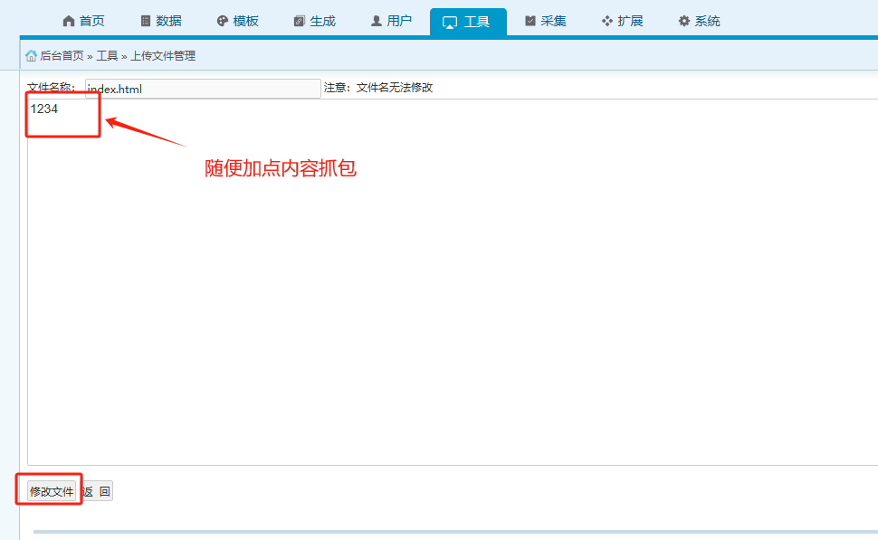

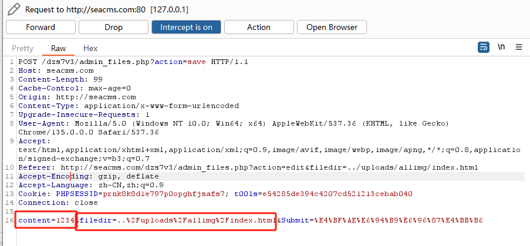

抓包发现 content 是文件内容  
 filedir 是 文件位置

在结合我们刚刚分析的地方

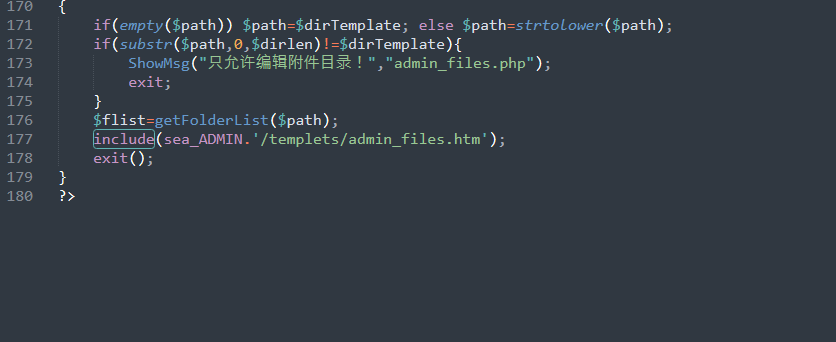

include 会对 /templets/admin\_files.htm 解析

我们就可以构造payload

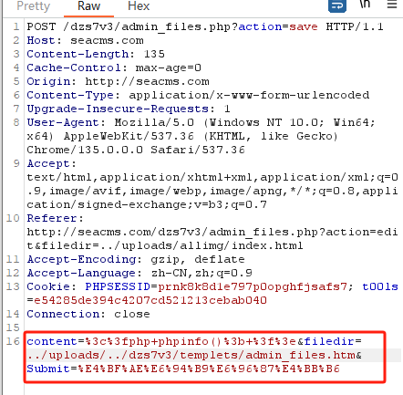

这里为什么要url编码?因为抓包发现修改的内容都会被url编码所以我们上传也要url编码

content=%3c%3fphp+phpinfo()%3b+%3f%3e

​

分析源码就得到了templets/admin\_files.htm 这里为什么要添加../uploads/../呢？

因为../是上一级目录的意思 最后的完整意思就是网站根目录下的/dzs7v3/tmplets/

admin\_files.htm

filedir=../uploads/../dzs7v3/templets/admin\_files.htm

​

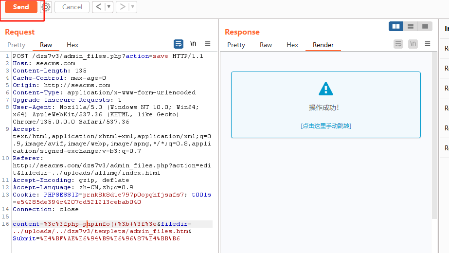

成功修改了 admin\_files.htm 里面有着phpinfo() 我们重新访问一下这里

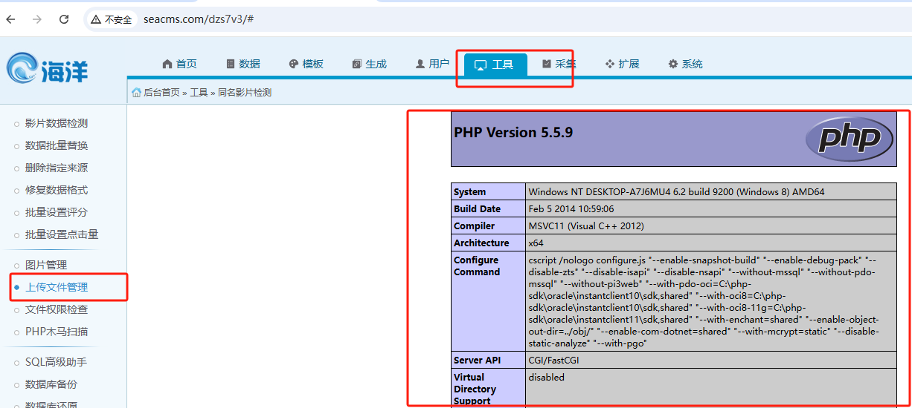

成功弹出了phpinfo的信息

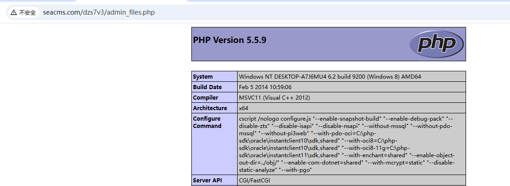

或者直接访问此路径也可以弹出 phpinfo()。
