# WordPress插件WP Umbrella 存在本地文件包含漏洞(CNVD-2024-47708)-先知社区

> **来源**: https://xz.aliyun.com/news/17808  
> **文章ID**: 17808

---

## 简要描述

WordPress是一套使用PHP语言开发的博客平台。该平台支持在PHP和MySQL的服务器上架设个人博客网站。WordPress plugin是一个应用插件。 WordPress插件WP Umbrella: Update Backup Restore & Monitoring存在本地文件包含漏洞，攻击者可利用该漏洞在服务器上包含和执行任意文件，从而允许执行这些文件中的任何PHP代码。目前，供应商发布了安全公告及相关补丁信息，修复了此漏洞。

## 影响版本

WordPress WP Umbrella: Update Backup Restore & Monitoring <2.17.0

## 环境搭建

WordPress下载地址：<https://wordpress.org/latest.zip>

为了方便演示这里使用的是phpstudy去搭建WordPress，设置的域名为：wpcms.com

WP Umbrella插件下载地址：<https://downloads.wordpress.org/plugin/wp-health.v2.16.0.zip>

搭建完WordPress后进入管理后台

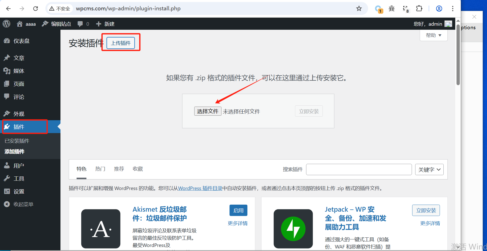

上传我们下载的WP Umbrella插件的zip文件后安装，安装成功后启用插件

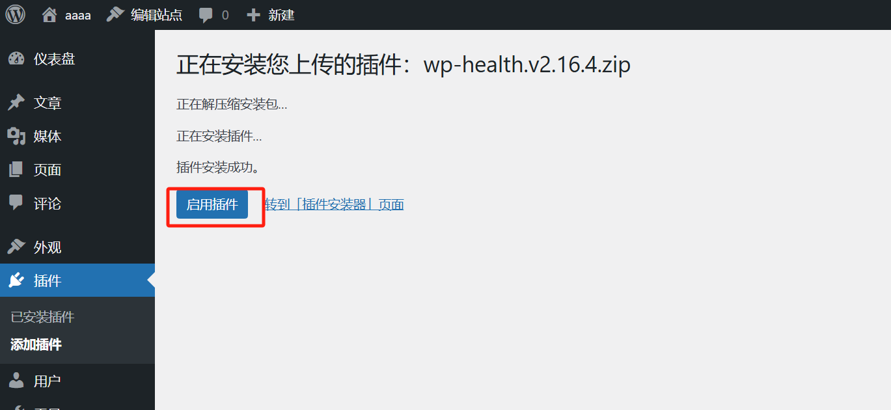

## 漏洞分析

根据漏洞的描述为文件包含漏洞，所以在插件目录下全局搜索php的文件包含危险函数（列如：include\_once）找到漏洞触发点

这里推荐使用Sublime Text

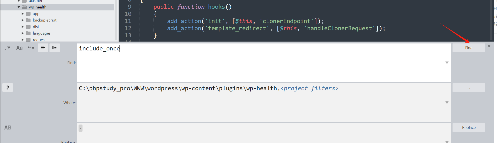

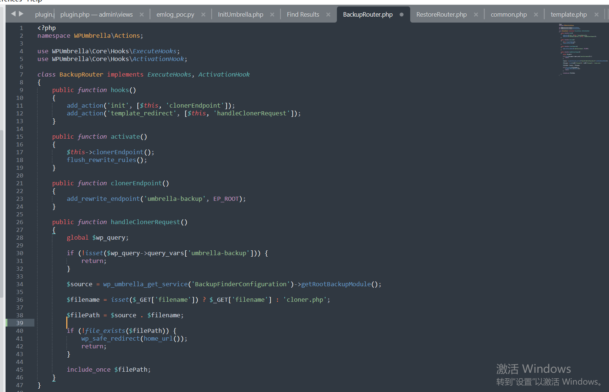

其中WPUmbrella\Core\Hooks\ExecuteHooks 和 WPUmbrella\Core\Hooks\ActivationHook 接口实现了 WordPress 的钩子注册和激活行为

我们重点观察handleClonerRequest()，它是include\_once的触发函数

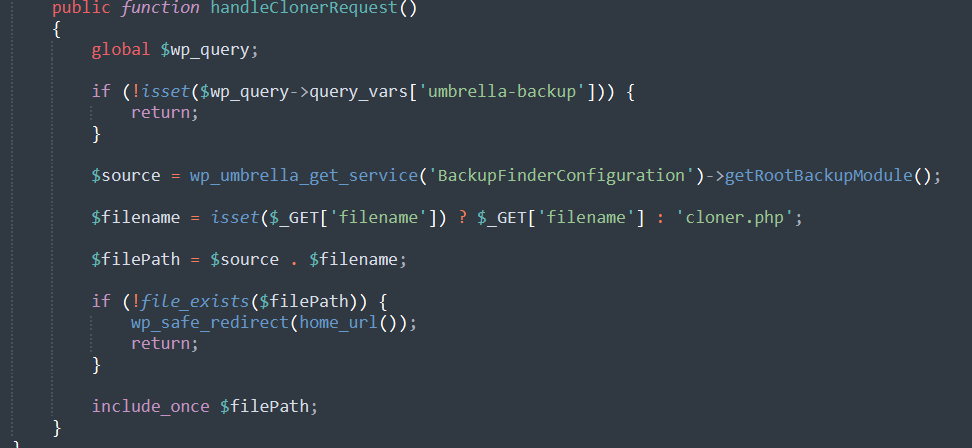

首先检查变量`$wp_query`中是否存在`umbrella-backup`。如果不存在，直接返回，结束函数的执行。query\_vars 是 WordPress 用来存储当前 URL 查询参数的对象。

而`$filename`检查用户GET传参中是否存在filename参数。如果存在，使用其值作为文件名；否则，默认使用cloner.php。

最后`include_once $filePath` 直接包含了用户提供的文件路径（通过 $\_GET['filename'] 拼接）

## 漏洞复现

通过以上分析得出$filename的值为用户可控，且没有对输入进行任何的过滤，但是umbrella-backup的值也是不能为空的

所以构造payload：?umbrella-backup=aaaaa&filename=../123.txt

123.txt内容：

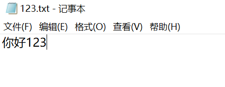

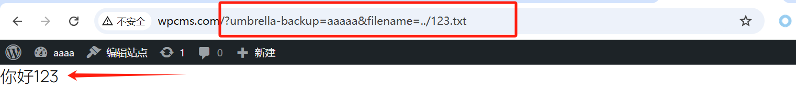

验证可以文件包含后，配合上传图片马进一步利用

在添加文章功能处上传内含php代码的图片

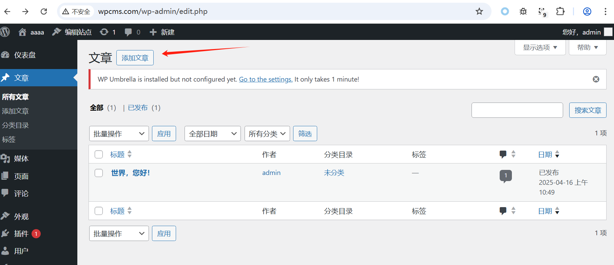

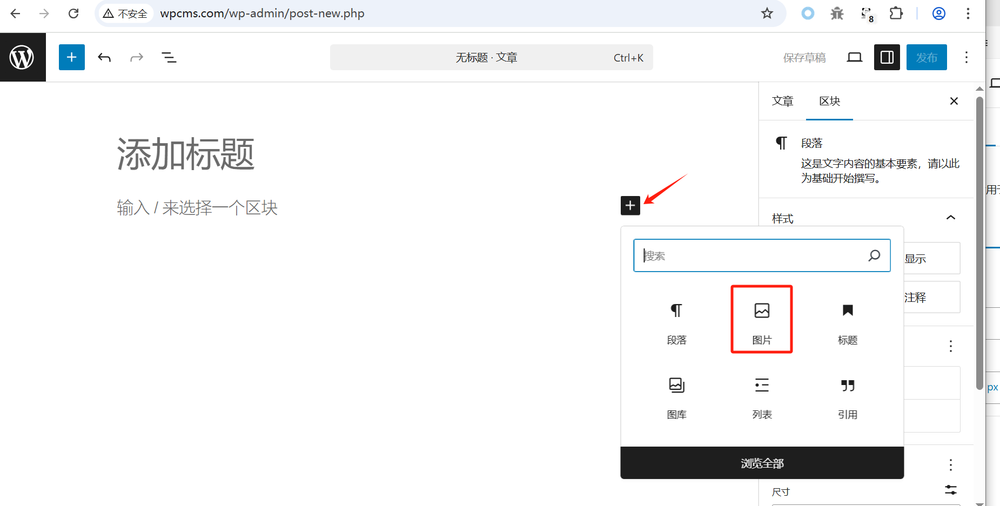

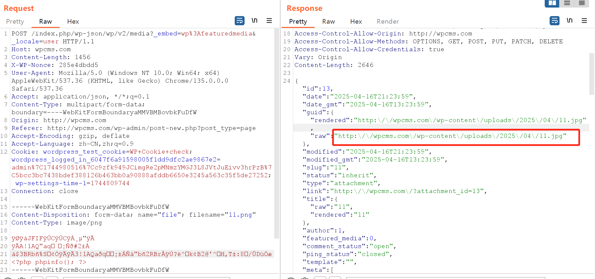

根据返回的路径进行文件包含，成功执行

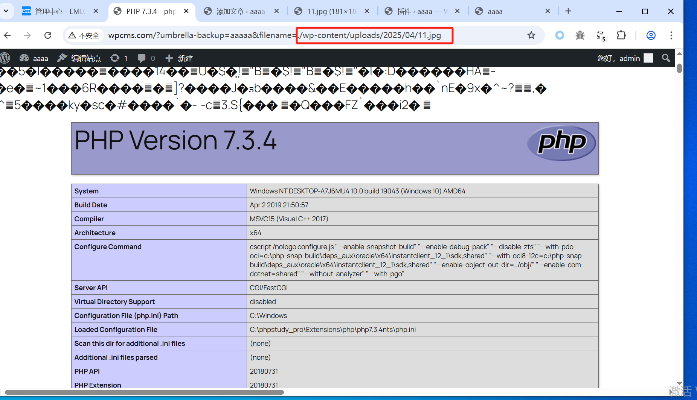
