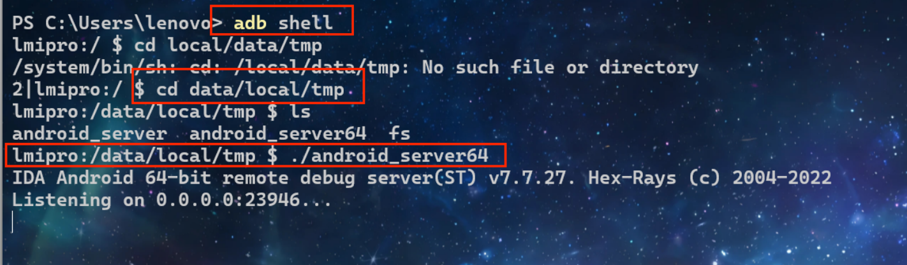
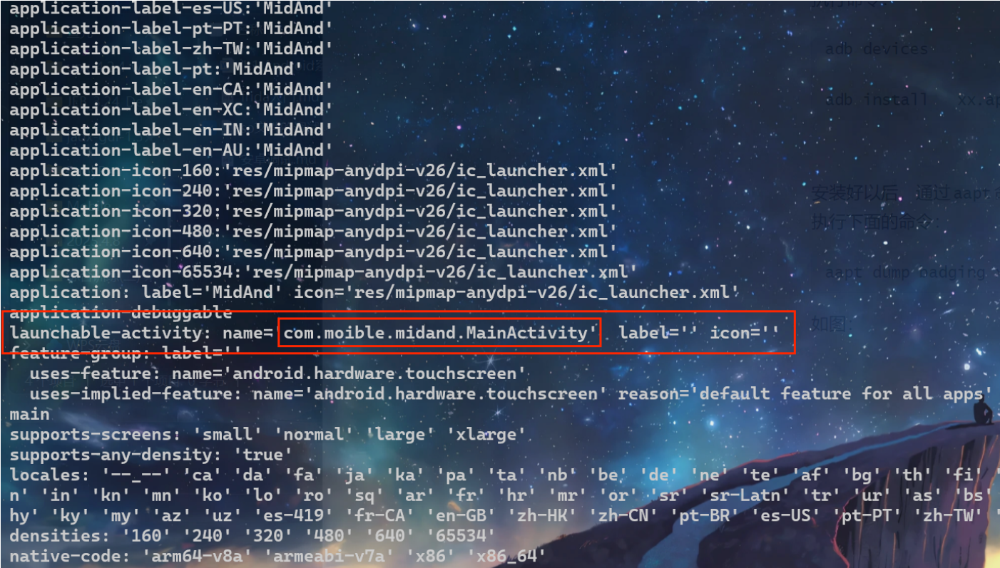
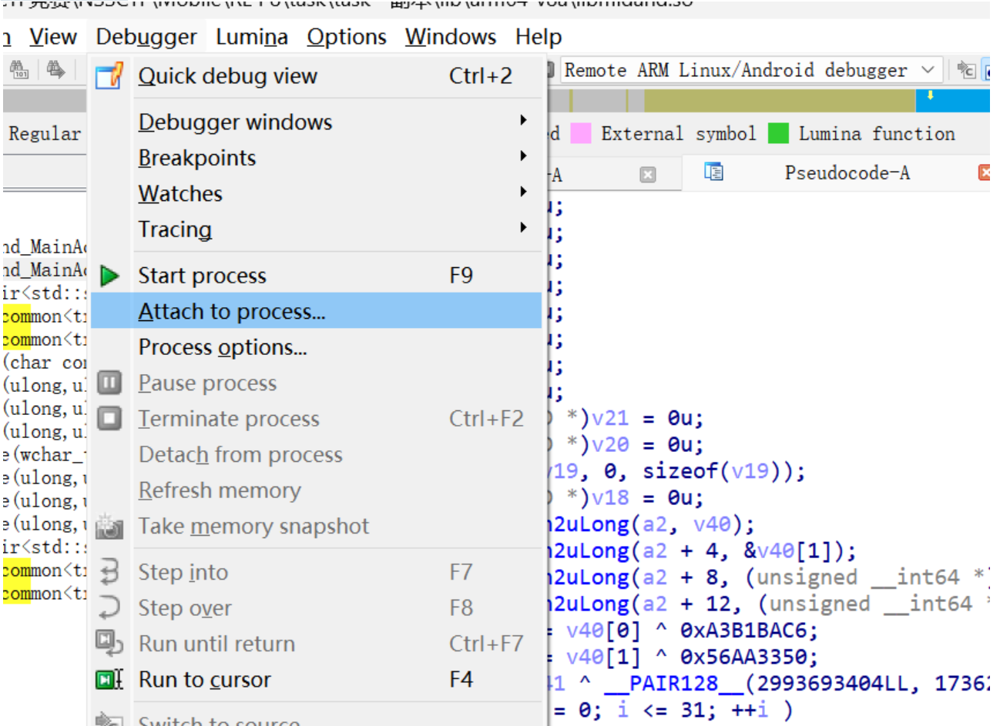
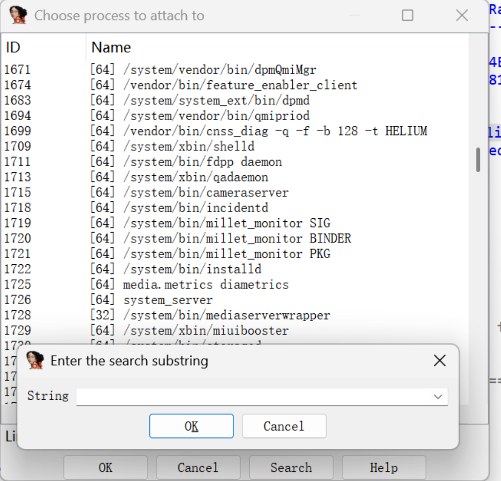
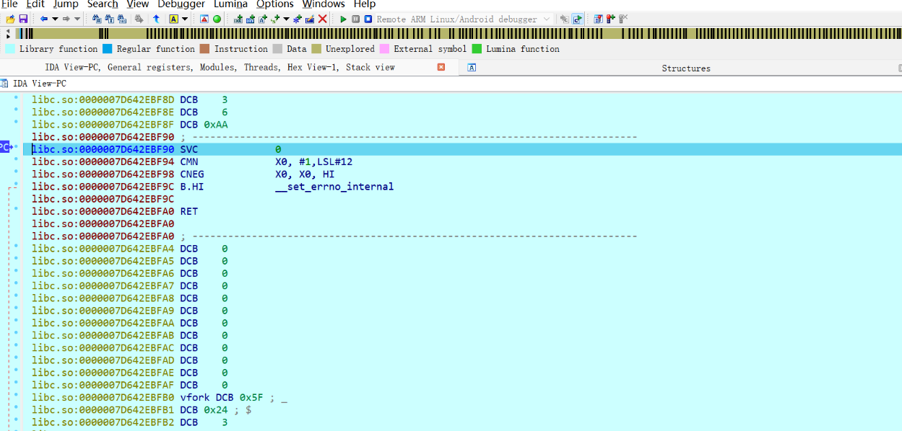
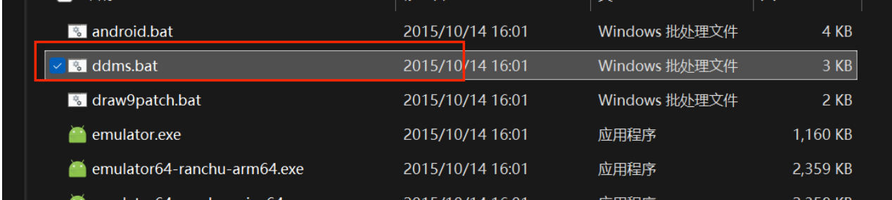
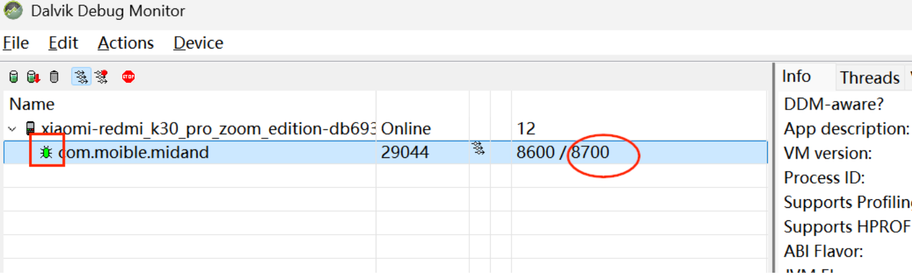
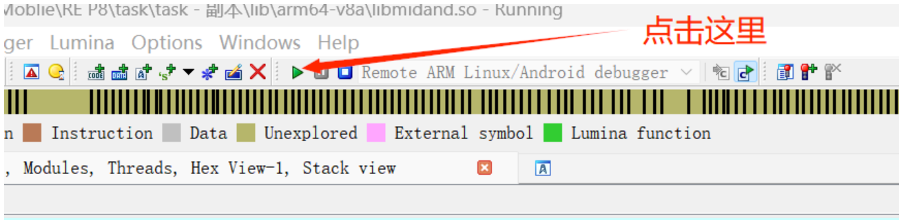
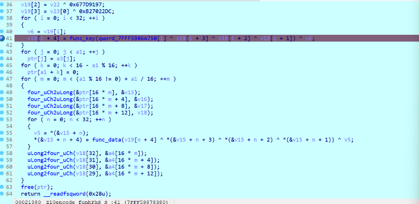

# IDA如何调试So文件-先知社区

> **来源**: https://xz.aliyun.com/news/17813  
> **文章ID**: 17813

---

有很多小伙伴对调试so文件都有疑惑，网上很多都是不是很全或者很复杂，这里详细说明到底如何能够调试起so文件。

这里我们介绍如何调试so 文件：

！！！！！！！！！！！！！！！！！！！！！！！！！！！！！！！！！！！！！！！！！！！！！！！！！！！！！！！！！！！！！！！！！！！！！！！！！！**一定要开启su权限**！！！！！！！！！！！！！！！！！！！！！！！！！！！！！！！！！！！！！！！！！！！！！！！！！！！！！！！！！！！！！！！！！！！！！！！！！！！！

这是一个大坑，每次都忘！  
先启动android\_server

我的机器是：

```
adb shell

cd data/local/tmp

./android_server64
```



这个窗口不能关闭，一直开着：重新打开一个窗口：

进行端口转发：

```
adb forward tcp:23946 tcp:23946
```

使得PC端的IDA连上这个端口

​

现在我们需要将apk安装到模拟器/真机中：执行命令：

```
adb devices

adb install   xx.apk
```

安装好以后，通过aapt命令获取包名：

执行下面的命令：

```
aapt dump badging xx.apk
```



这里就是我们要的包名：com.moible.midand.MainActivity

然后开启调试模式：

```
adb shell am start -D -n com.moible.midand/.MainActivity
```

*注意一定是包名/类名*

​

这里真机/模拟器会出现Debugger wait

不用动。

然后利用IDA加载so文件：配置Debugger:



这里一定要选择附加进程（attach to process）



我们寻找之前的包名：即：adb shell am start -D -n com.moible.midand/.MainActivity

中的com.moible.midand



到这个地方以后：

这里会卡住：

使用ddms获取端口号:





有小虫子的就是正在调试：  
这里显示的是8700



运行命令：

```
jdb -connect com.sun.jdi.SocketAttach:hostname=127.0.0.1,port=8700
```

达到这样的小国就可以了，记得一开始要下断点哦！



后面的和正常调试是一样的。

​

ddms获取链接

我用夸克网盘分享了「installer\_r24.4.1-windows.zip」，点击链接即可保存。打开「夸克APP」，无需下载在线播放视频，畅享原画5倍速，支持电视投屏。

链接：<https://pan.quark.cn/s/52aa3f6af081>
