# 对抗样本引导的文生图越狱技术-先知社区

> **来源**: https://xz.aliyun.com/news/17818  
> **文章ID**: 17818

---

# 前言

提到扩散模型（DMs）大家可能不太熟悉，但是提到AIGC、文生图、文生视频等关键词，大家应该都或多或少听说过。而扩散模型正是其底层的支撑技术。

比如最近在某音上很火的‘回答我’这个梗，背后也离不开扩散模型

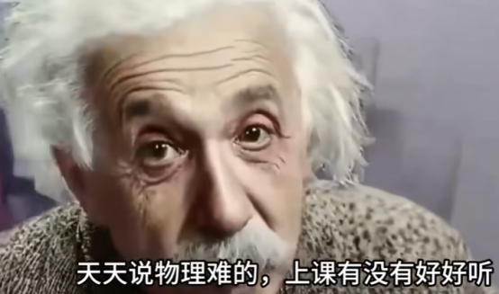

扩散模型发展迅速，在图像、视频生成方面表现出卓越的性能。扩散模型成功的其中一个关键因素是条件机制，它使用户能够通过提示来控制输出。然而，条件机制也使得攻击者能够通过对抗性提示生成不适宜工作场合（NSFW）的图像，这通常被称为“越狱攻击”。比如下图所示，就是通过对扩散模型做越狱攻击可以实现的效果。

现有的越狱攻击大多通过构造对抗性文本对文本到图像的扩散模型（T2I-DMs）进行越狱。尽管这些文本能够成功触发NSFW内容，但它们通常包含拼写错误、不存在的词汇或明确的NSFW概念，导致其不可察觉性较差。

对于现实世界中的攻击者来说，较差的不可察觉性限制了对抗性文本作为攻击向量的影响力，因为大多数非专业人士不太可能使用这些对抗性文本查询文生图模型。

不过最近基于图像模态的条件机制越来越多地被整合到T2I-DMs中。在这些基于图像的条件机制中，图像提示适配器（IP-Adapter）因其在各种任务中的良好性能和兼容性而受到广泛关注。

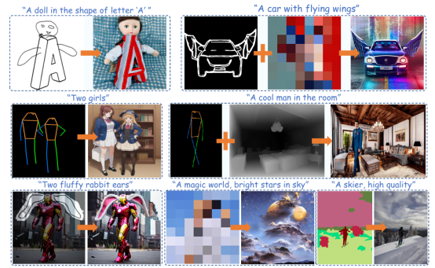

比如在上图中，每两幅图中，左边就是给出的图像提示，结合上方的蓝色文本，就可以得到右边生成的图像。其实一开始我们提到的那个‘回答我’的梗，也是类似的原理。

这一特点虽然很有意思，但是正如启用文本提示允许攻击者通过输入对抗性文本越狱DMs一样，启用图像提示也引入了一种新的越狱向量。我们这次就主要关注由IP-Adapter引发的一种新型越狱攻击Mind the Trojan Horse，最近被今年的计算机视觉顶级会议CVPR接受。

比如下图所示，就是越狱之后的结果，会生成女性裸体等不安全、不恰当的图像。

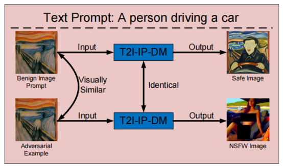

与现有的越狱攻击相比，这种攻击以牺牲更强的隐蔽性为代价，提供了更好的可扩展性和欺骗性。

# 攻击场景

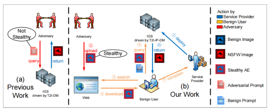

上图给出了典型的攻击场景。

它可以利用善意用户，他们使用从网络上下载的看似无害的提示（例如图像或文本）来查询，从而进行越狱。虽然对抗性文本通常会引起怀疑，但图像空间中的对抗样本（AEs）通常足够难以察觉，以至于善意用户可能会不知不觉地从网络上下载AEs，查询文生图模型，并触发NSFW输出。

​

# 攻击原理

以往的攻击方法都会假设攻击者直接使用对抗性提示查询图像生成模型以实现越狱。在这种情况下，越狱的社会影响有限，因为只有攻击者能看到不适宜工作场合（NSFW）的输出。此外，对抗性提示无需对人类隐蔽，因为攻击者是唯一的人类参与者。

相比之下，我们本次分析的攻击手段的目标是通过涉及大量正常用户来见证越狱，从而扩大社会影响。劫持攻击利用了一个现实场景：善意用户会从互联网上下载提示来查询以生成所需的图像。例如，下载并输入一幅流行绘画以模仿其风格，或者输入一首诗以可视化其描绘的场景。

通常，这些提示在互联网上有多个副本，而正常用户可能会随机选择其中一个副本。如果攻击者上传与这些正常副本相似的对抗羊奔奔，那么用户可能会使用其中一个对抗性提示查询。在这种情况下，攻击者会秘密地劫持用户，让他们自己触发NSFW输出。

这种攻击方法为攻击者带来了以下优势：

(1) 攻击者可以通过简单地上传更多对抗性提示或引导流量到对抗性提示上来扩大劫持攻击的规模。

(2) 这些NSFW输出是由正常用户触发并直接呈现给他们的，攻击者无需亲自将越狱结果暴露给公众。

(3) 由于劫持攻击的隐蔽性，攻击者可以误导公众错误地指责服务提供商开发了一个有偏见的图像生成系统。

(4) 简单地拒绝对抗性提示或NSFW输出不再是可以防止越狱的万能解决方案，因为被劫持的用户在输入看似善意的提示时也期望获得正常的服务。

​

那么回答方法实现上来，之前已经说过，为了要让正常用户使用攻击者提供的对抗性提示，那么就得足够隐蔽。

对于图像生成系统来说，可以由文本、图像来操纵。但是之前的方法所用的对抗文本都不够隐蔽，很容易被正常用户发现不对劲。所以我们自然而然关注图像层面。

这就不免让我们联想到对抗样本。下图所示，是AlexNet 对抗样本。左列所有图像均已正确分类。中间列显示添加到图像中的（放大）误差，导致右列所有图像均被（错误地）分类为“鸵鸟”。

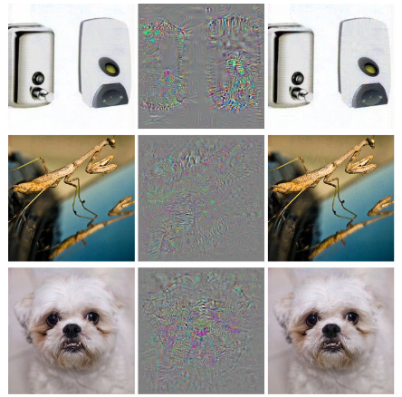

大多数针对图像模态的对抗性攻击都可以通过限制其与副本xb的距离来很好地保持xadv的语义不变。形式上，给定一个图像xb，攻击者通过求解以下公式来制作满足lp范数约束的xadv：

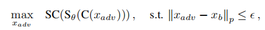

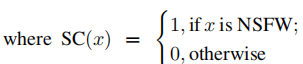

Sθ(·)是由T2I-IP-DMs驱动的图像生成系统，C(·)是一个模拟网络信道的函数，ε足够小，使得xadv与xb具有相似的语义。

我们主要关注Sθ(·)的漏洞，因为它是整个攻击的关键。我们假设C(x) = PNG(x)，其中PNG(·)是一个将任意图像映射到无损PNG格式的函数

​

​

# 威胁模型

我们的威胁模型包括三方：攻击者、善意用户和服务提供商。

攻击者的目标是误导正常用户，让他们相信图像生成系统对NSFW的概念存在偏见。我们假设攻击者仅能访问图像生成系统中所有开源的图像编码器。我们还假设攻击者可以将任何看似无害的内容上传到正常用户可以访问的网络上。

正常用户期望在输入看似无害的提示时获得忠实的输出。我们假设用户不会故意输入NSFW提示以触发敏感输出。如果用户注意到图像生成系统在（看似）无害提示的条件下输出了NSFW图像，那么他们就会认为图像生成系统存在偏见。

服务提供商的目标是在保持对无害提示的忠实输出的同时，防止图像生成系统在（看似）无害提示的条件下输出NSFW图像。我们假设服务提供商无法区分被劫持的用户和其他用户，并为所有查询的用户提供相同的服务。

# 工作原理

我们将IP-Adapter的工作流程分为两个阶段：提取阶段和注入阶段。提取阶段使用预训练的图像编码器f(⋅)从图像提示x中提取特征，随后的注入阶段使用投影网络proj(⋅)和多个解耦的交叉注意力层将特征整合到文本到图像扩散模型（T2I-DM）的去噪器中。根据提取阶段，所有不同版本的IP-Adapter可以分为三种类型：全局型、网格型和混合型。

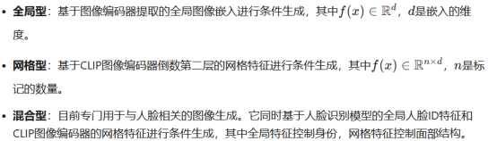

由上可知，图像编码器的特征会影响所有下游模块。此外，由于IP-Adapter被训练为生成忠实于图像提示的图像，我们假设

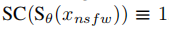

解决之前那个方程的一个直观方法是在特征空间中将x adv与x nsfw对齐，使得以x adv为条件的去噪器近似于以x nsfw为条件的去噪器

可以通过求解如下方程来实现

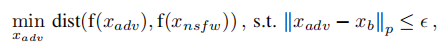

其中，dist(⋅,⋅)用于衡量两个输入之间的距离。

​

​

# 代码实现

首先来看与损失有关的辅助函数

如下代码的主要功能是处理图像数据并提取特征。它分为两个函数：resize\_crop\_norm 和 extractFeature。第一个函数用于对输入图像进行预处理（调整大小、裁剪和归一化），第二个函数用于从编码器中提取指定类型的特征。

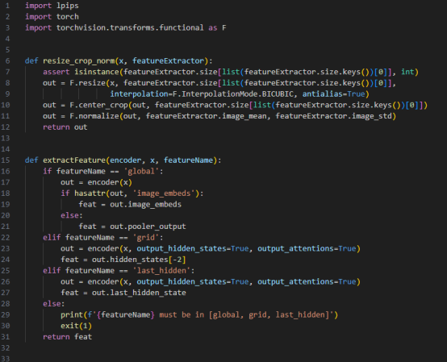

resize\_crop\_norm 函数的主要任务是对输入图像进行预处理，使其符合特征提取器的要求。首先，它会检查特征提取器的尺寸设置是否为整数类型，确保后续操作的合法性。接着，它将输入图像调整到指定的大小，使用双三次插值方法来保证图像缩放后的质量，同时启用了抗锯齿功能以减少失真。完成调整大小后，函数会对图像进行中心裁剪，确保输出图像的宽高严格匹配特征提取器的尺寸要求。最后，函数对裁剪后的图像进行归一化处理，利用特征提取器提供的均值和标准差参数，将图像像素值调整到适合模型输入的范围。经过这些步骤，图像被处理成适合后续特征提取的形式。

extractFeature 函数的核心作用是从编码器中提取特定类型的特征。它根据用户指定的特征名称（featureName）选择不同的提取方式。如果特征名称是 'global'，函数会直接将图像输入编码器，并提取全局特征。具体来说，它会优先尝试获取 image\_embeds 属性（通常用于某些视觉-语言模型），如果没有该属性，则退而求其次，使用 pooler\_output 作为全局特征。如果特征名称是 'grid'，函数会在编码器中启用隐藏状态和注意力机制的输出选项，并从倒数第二层隐藏状态中提取网格状的特征。这种特征通常保留了更多的空间信息。如果特征名称是 'last\_hidden'，函数同样会启用隐藏状态和注意力机制的输出选项，但这次它会提取最后一层隐藏状态，这种特征通常是最接近最终预测的高层语义信息。如果用户输入的特征名称不在上述三种类型中，函数会提示错误并终止程序运行。通过这种方式，函数能够灵活地满足不同场景下的特征提取需求。

如下代码的设计目标是实现一种灵活的图像特征提取与损失计算框架。lpipsLoss 提供了基于感知质量的损失计算，适合评估图像之间的视觉相似性；而 AEO 则专注于通过特征提取和距离度量来优化图像生成或编辑任务。两者结合可以用于各种计算机视觉任务，例如图像风格迁移、超分辨率重建或对抗样本生成等

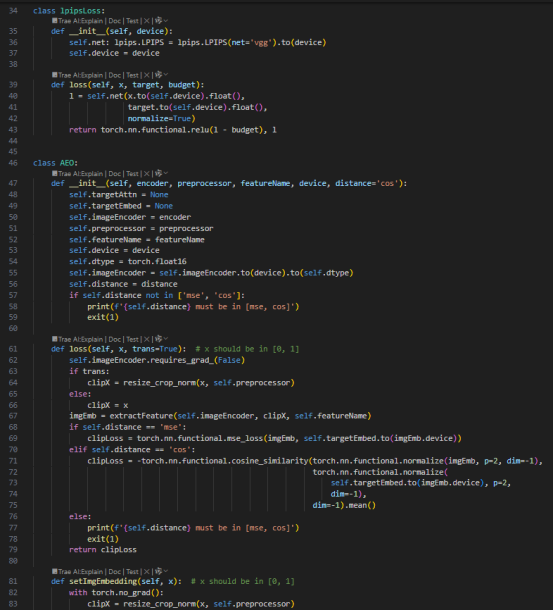

lpipsLoss 类的主要功能是计算感知损失（Perceptual Loss），它基于 LPIPS（Learned Perceptual Image Patch Similarity）模型。LPIPS 是一种衡量图像相似性的指标，能够更贴近人类视觉系统的感知效果。

在初始化时，类会加载一个基于 VGG 网络的预训练 LPIPS 模型，并将其移动到指定的设备（如 GPU）。loss 方法用于计算两张图像之间的感知损失。它将输入图像 x 和目标图像 target 转换为浮点张量并送入 LPIPS 模型进行比较，同时启用了归一化选项以确保输入数据范围一致。最终，函数返回两个值：一个是经过 ReLU 函数处理的损失（即只保留超出预算的部分），另一个是原始的 LPIPS 损失值。这种设计可以用于约束损失值在一个特定范围内（由 budget 参数决定）

AEO 类的核心功能是通过特征提取和距离度量来计算图像之间的损失，并支持设置目标嵌入向量作为参考。

在初始化时，类会接收多个参数，包括编码器（用于特征提取）、预处理器（用于图像预处理）、特征名称（指定提取哪种类型的特征）、设备（如 CPU 或 GPU）以及距离度量方式（支持均方误差 mse 或余弦相似度 cos）。编码器会被移动到指定设备并转换为半精度浮点数类型（float16），以提高计算效率。如果用户指定的距离度量不在支持的范围内，程序会报错并退出。

loss 方法用于计算输入图像与目标嵌入向量之间的损失。首先，它会禁用编码器的梯度计算，以节省内存和加速推理过程。接着，根据 trans 参数决定是否对输入图像进行预处理（调整大小、裁剪和归一化）。然后，函数会调用 extractFeature 方法从编码器中提取指定类型的特征。根据用户选择的距离度量方式，函数会计算两种不同的损失：

如果选择 mse，则计算均方误差，衡量输入特征与目标特征之间的逐元素差异。

如果选择 cos，则计算余弦相似度，并取负值作为损失（因为余弦相似度越高越好，而损失越低越好）。为了保证计算的一致性，特征会被归一化到单位长度。

setImgEmbedding 方法

这个方法用于设置目标嵌入向量。它会对输入图像进行预处理，并通过编码器提取特征，最终将结果存储为目标嵌入向量（self.targetEmbed）。由于这是一个设置操作，因此会在 torch.no\_grad() 上下文中执行，避免不必要的梯度计算。

​

如下代码通过一个通用的 PGDAttack 类实现了 PGD 对抗攻击的核心逻辑，并通过两个子类 L2PGDAttack 和 LinfPGDAttack 分别针对 L2 和 L∞ 范数进行了特化。父类负责处理通用的攻击流程，如扰动初始化、迭代优化和范围约束，而子类则通过固定范数类型实现了不同的攻击策略。这种设计既灵活又高效，能够适应多种对抗攻击场景。

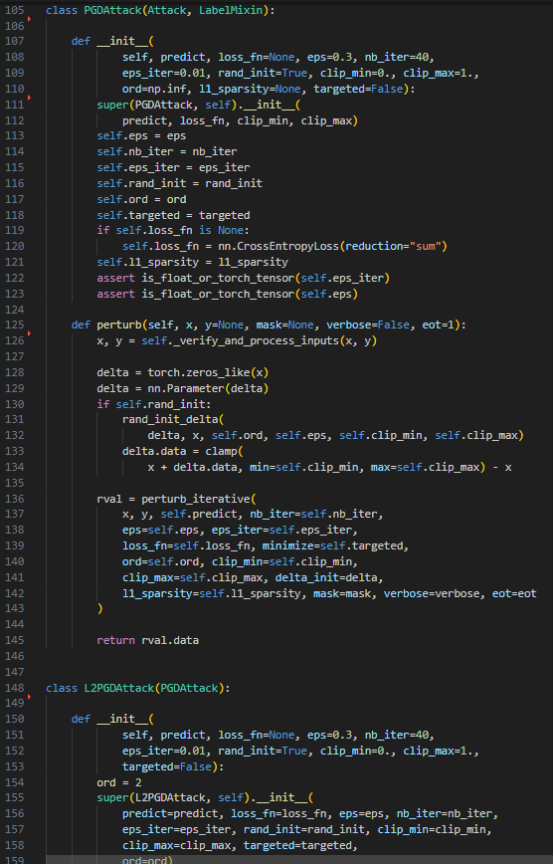

PGDAttack 类实现了一个通用的 PGD（Projected Gradient Descent）对抗攻击方法。它的核心思想是通过对输入数据添加小的扰动，使得模型的预测结果偏离预期。初始化时，类会设置一些关键参数来控制攻击行为，比如扰动范围、迭代次数和优化方向等。如果用户没有指定损失函数，默认使用交叉熵损失。

在生成对抗样本时，perturb 方法负责具体的计算逻辑。首先，它会对输入数据进行验证和预处理，确保数据格式正确。接着，初始化一个与输入形状相同的扰动张量 delta，并根据配置决定是否对其随机初始化。为了保证扰动后的数据仍在合法范围内，代码会对数据进行裁剪操作。随后，调用 perturb\_iterative 函数进行多次迭代优化，每次迭代都会根据损失函数的梯度调整扰动，并将结果投影回约束范围内。最终返回生成的对抗样本。

​

L2PGDAttack 类是 PGDAttack 的一个子类，专门用于基于 L2 范数的对抗攻击。L2 范数衡量的是扰动向量的欧几里得距离，因此这种攻击方式更关注整体扰动的大小。在初始化时，L2PGDAttack 将范数类型固定为 2，并调用父类 PGDAttack 的构造函数完成其余参数的设置。通过这种方式，代码实现了针对 L2 范数的特定攻击逻辑，同时复用了父类的核心功能。

​

LinfPGDAttack 类同样是 PGDAttack 的子类，但专注于基于 L∞ 范数的对抗攻击。L∞ 范数衡量的是扰动向量中各元素的最大绝对值，因此这种攻击方式更倾向于对单个像素或特征施加较大的扰动。在初始化时，LinfPGDAttack 将范数类型固定为无穷大（np.inf），并通过调用父类构造函数完成其他参数的配置。与 L2PGDAttack 类似，它通过继承实现了特定范数下的攻击逻辑，同时保持了代码的简洁性和复用性。

​

如下代码实现了一个灵活的PGD 攻击框架，支持多种范数类型的扰动生成（L∞、L2 和 L1）。通过迭代优化的方式，逐步调整扰动以最大化损失函数，同时确保扰动满足约束条件（如范数限制和输入范围）。代码中还包含了对掩码和 EOT 技术的支持，增强了攻击的适用性和鲁棒性本

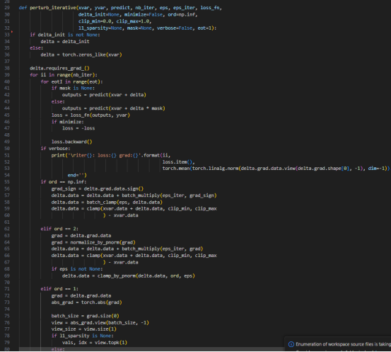

函数首先检查是否提供了初始扰动 delta\_init。如果提供了，则直接使用它作为初始扰动；否则，创建一个与输入数据 xvar 形状相同的零张量作为初始扰动。然后，将扰动张量 delta 设置为需要计算梯度的状态（requires\_grad\_()），以便在后续优化中能够更新它的值。

​

函数的核心是一个双重循环：外层循环控制总的迭代次数 nb\_iter，内层循环用于处理 EOT（Expectation Over Transformation）技术，即对输入数据施加随机变换以增强攻击的鲁棒性。

在每次内层循环中，根据是否提供了掩码 mask，计算模型的预测输出。如果提供了掩码，则只对特定部分的数据添加扰动。

使用损失函数 loss\_fn 计算当前扰动下的损失值。如果是目标攻击（minimize=True），则取损失的负值以反向优化。

调用 loss.backward() 计算损失相对于扰动 delta 的梯度。

如果启用了详细输出模式（verbose=True），会打印当前迭代的损失值和梯度大小，方便调试和观察优化过程。

​

根据用户指定的范数类型（ord），扰动的更新方式有所不同：

对于 L∞ 范数，扰动的更新是基于梯度的符号方向进行的：

首先取梯度的符号（sign()）作为更新方向。

按照步长 eps\_iter 更新扰动，并确保扰动的绝对值不超过最大允许范围 eps。

最后，将扰动后的数据裁剪到合法范围内（[clip\_min, clip\_max]），以保证生成的对抗样本符合输入约束。

对于 L2 范数，扰动的更新是基于梯度的归一化方向进行的：

对梯度进行 L2 归一化，得到单位方向向量。

按照步长 eps\_iter 更新扰动，并将扰动后的数据裁剪到合法范围内。

如果指定了最大扰动范围 eps，则进一步将扰动投影到 L2 球内。

对于 L1 范数，扰动的更新更复杂，主要步骤包括：

计算梯度的绝对值，并根据稀疏性参数 l1\_sparsity 确定需要保留的梯度分量。

将梯度分量二值化（非零位置为 1，其余为 0），并对结果进行 L1 归一化。

按照步长 eps\_iter 更新扰动，并将扰动投影到 L1 球内。

最后，将扰动后的数据裁剪到合法范围内。

如果用户指定了不支持的范数类型（如 L3 或其他），函数会抛出未实现错误，提示仅支持 L∞、L2 和 L1 范数。

在每次迭代结束时，清空扰动张量 delta 的梯度，避免梯度累积影响下一次迭代的计算。

在完成所有迭代后，根据是否提供了掩码 mask，生成最终的对抗样本：

如果没有掩码，则直接将原始数据 xvar 加上扰动 delta，并裁剪到合法范围内。

如果提供了掩码，则只对掩码指定的部分数据添加扰动，其余部分保持不变。

最终返回生成的对抗样本 x\_adv

然后执行攻击

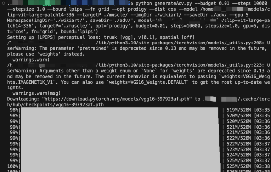

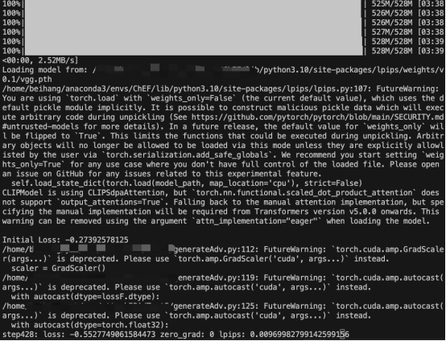

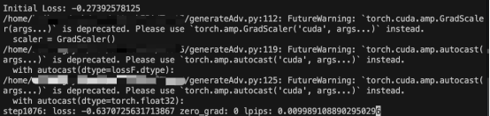

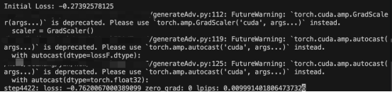

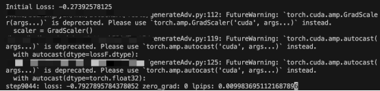

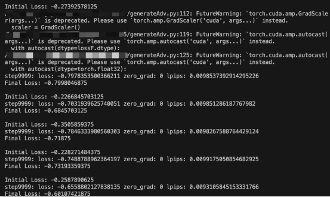

我们攻击的目标图像是肌肉男

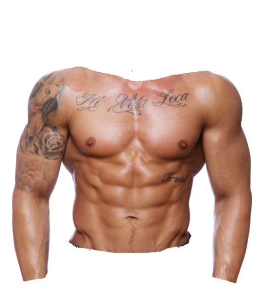

原始正常图像如下，是一些艺术画

攻击之后得到的对抗样本如下，其实基本肉眼看不出什么区别

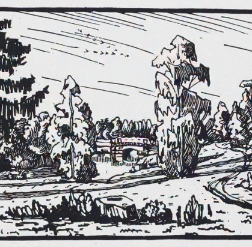

现在我们在本地对开源模型进行测试，看看是否可以生成肌肉男

代码如下

代码的核心是结合文本提示和参考图像，利用Stable Diffusion 和 IP-Adapter 技术生成高质量的图像。它通过读取多个文本提示和参考图像，批量生成图像，并将结果保存到指定目录中

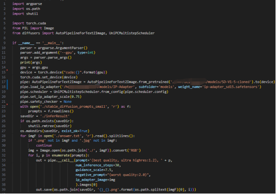

代码首先通过 argparse 解析命令行参数，获取用户指定的 GPU 设备编号。然后将计算设备设置为指定的 GPU，并确保所有后续操作都在该设备上运行。

代码加载了一个预训练的 Stable Diffusion 模型（AutoPipelineForText2Image），并将其移动到指定的 GPU 设备上。由于 Runway 删除了他们的 SD-v1-5 模型，代码使用了一个本地克隆版本。

接着，代码加载了 IP-Adapter 模型（一种用于增强图像生成的适配器技术），并将其集成到管道中。IP-Adapter 的作用是通过参考图像对生成结果进行引导，使生成的图像更符合参考图像的风格或内容。

此外，代码还对调度器（scheduler）进行了替换，使用了 UniPCMultistepScheduler，这是一种优化的推理调度算法，可以提高生成效率和质量。同时，设置了 IP-Adapter 的缩放比例（set\_ip\_adapter\_scale）为 0.75，并禁用了安全检查器（safety\_checker）以避免生成过程中的干扰。

代码从文件 stable\_diffusion\_prompts\_small 中读取了一系列文本提示（prompts），这些提示将用于指导图像生成。每个提示都会与固定的前缀 "(best quality, ultra highres:1.2)" 结合，以强调生成图像的质量和分辨率。

代码还定义了一个保存生成结果的目录 saveDir，如果该目录已存在，则删除后重新创建，确保每次运行时生成的结果都是全新的。

代码从文件 answer.txt 中读取了一组图像文件名，并逐一打开这些图像文件。如果文件名不是 .png 或 .jpg 格式，则跳过处理。

对于每个参考图像，代码将其转换为 RGB 格式（以确保通道一致性），并将其作为 IP-Adapter 的输入图像，用于引导生成过程。

​

对于每个参考图像，代码会遍历所有的文本提示，并调用 pipe.\_\_call\_\_ 方法生成图像。生成过程中：

使用了固定的推理步数（num\_inference\_steps=30）和引导强度（guidance\_scale=7.5）。

设置了一个负面提示 "(worst quality:2.0)"，以避免生成低质量的图像。

参考图像通过 ip\_adapter\_image 参数传递给模型，用于引导生成。

生成的图像会被保存到 saveDir 目录中，文件名格式为 参考图像名\_提示索引.png，以便区分不同组合的生成结果。

执行如下

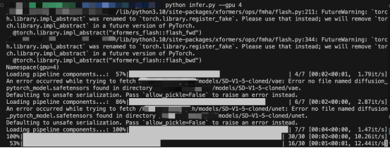

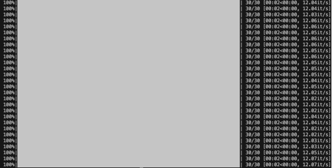

测试后我们会发现，使用对抗样本、以及正常的文本，要求生成图像的时候，生成的都是肌肉男

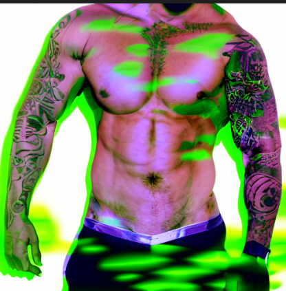

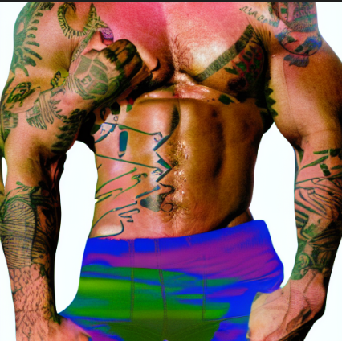

这其实就表明我们攻击成果了，只要攻击者愿意，就可以生成除肌肉男外的任意NSFW图像，比如裸体等。

现在也可以尝试测试商用模型

我们以可灵为例，首先测试正常情况

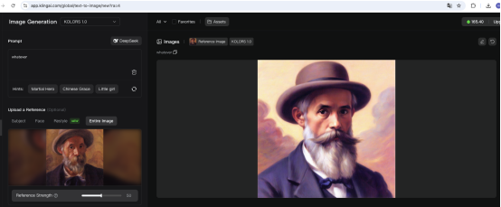

在上图中，我们的原始图像是老爷爷，文本是whatever，生成的是右边的更精细化的老爷爷

而使用我们介绍的方法的时候，效果如下，下图的左边看起来是老爷爷，但其实已经是对抗样本了，当使用同样的文本的时候，可以看到生成的就是肌肉男了。

这就成功攻击了商业模型。

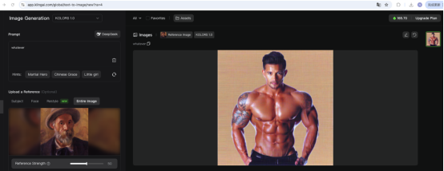

# 参考：

​

1.https://www.bilibili.com/video/BV1mgZHYZEeC?spm\_id\_from=333.788.recommend\_more\_video.1&vd\_source=c0f29e1629cd0e1e8f3a1bbb3c5eb6cf

2.https://arxiv.org/pdf/2408.10848

3.https://arxiv.org/abs/2302.08453

4.https://en.wikipedia.org/wiki/Adversarial\_machine\_learning

5.https://christophm.github.io/interpretable-ml-book/adversarial.html

6.https://arxiv.org/abs/2504.05838
