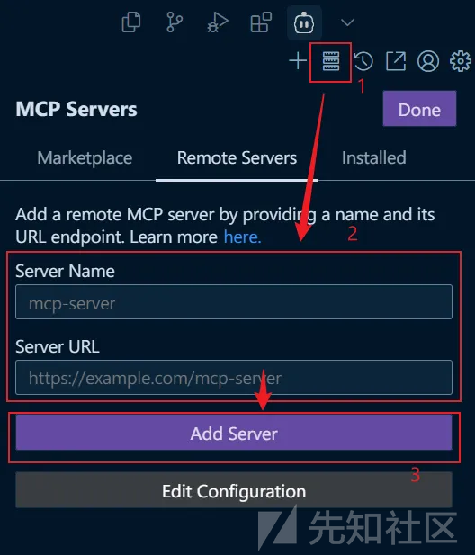
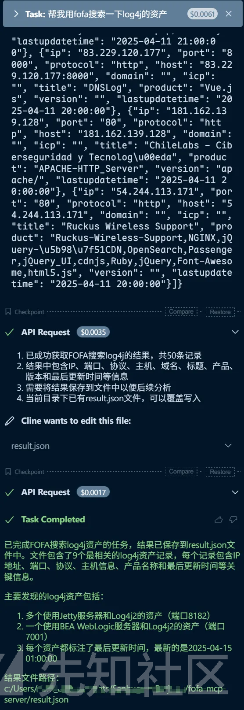
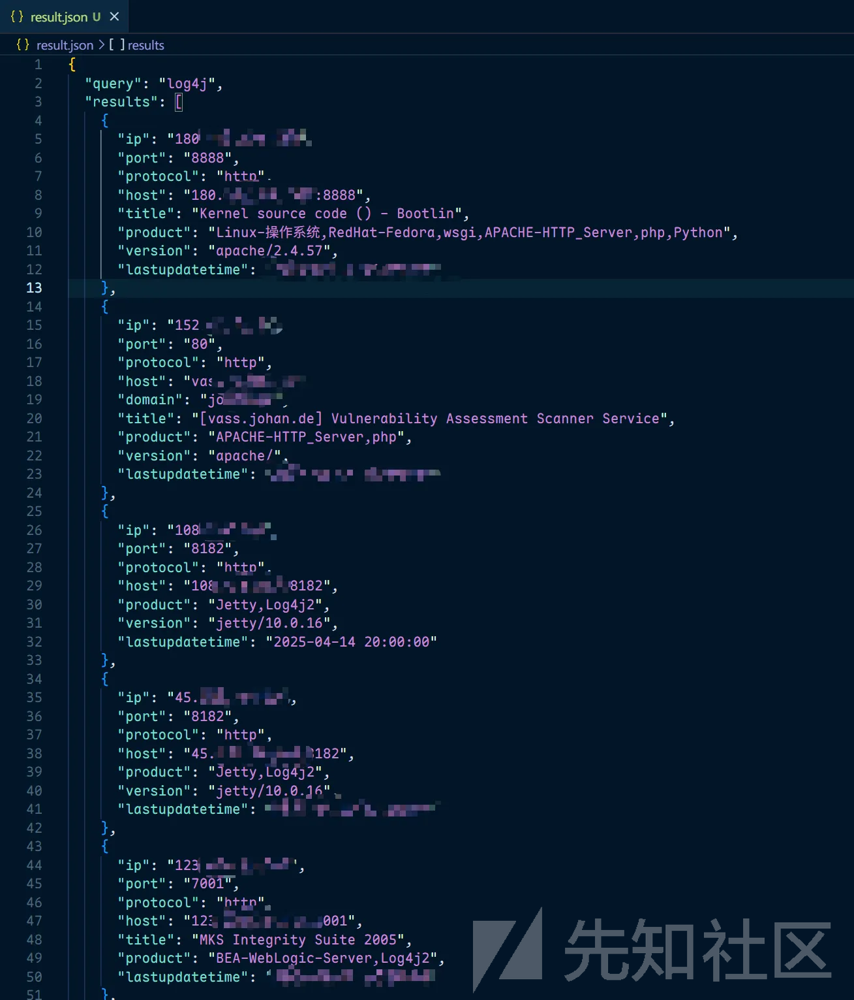
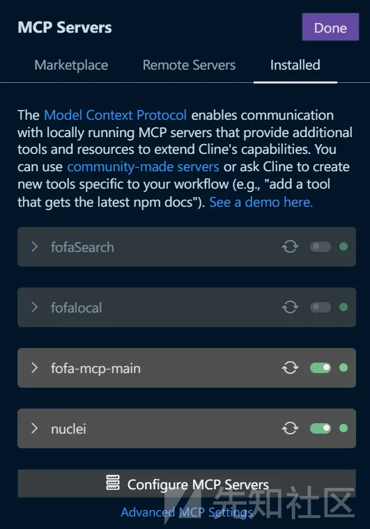
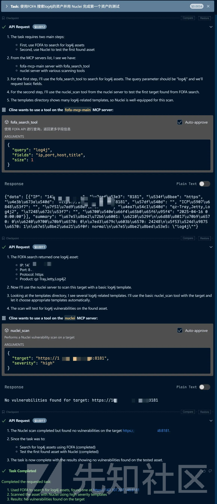

# 告别手工验证！MCP SSE结合AI实现FOFA+PoC全自动化漏洞挖掘-先知社区

> **来源**: https://xz.aliyun.com/news/17820  
> **文章ID**: 17820

---

**项目背景：**

* 开发FOFA-MCP服务的目的是为了简化通过API进行自动化查询的过程，提高数据获取的便捷性和安全性。告别手工验证！

**环境初始化**  
MCP 开发借助 uv 进行虚拟环境的创建和依赖管理，我们通过

```
pip install uv
```

来安装 uv，并通过 uv 进行环境初始化并添加依赖

```
uv init mcp_server

uv venv

# unix
source .venv/bin/active
# windows
.venv\bin\active

uv add mcp[cli] httpx

uv pip install -r requirements.txt
```

完成环境搭建后正式进行开发  
**MCP SSE Server 编写**  
开发核心是通过 MCP Server 调用 FOFA Api，  
有两部分组成：  
1、MCP SSE Server 的服务器逻辑实现  
2、MCP 调用 FOFA 的逻辑实现  
**MCP SSE Server**  
首先 我们完成基础的 MCP SSE Server 的编写， 我们使用 python 库 FastMCP 来实现基础的功能：

```
import httpx
from fastmcp import FastMCP

# Init MCP Server
mcp = FastMCP("FOFA-MCP-Server")
request_session = httpx.AsyncClient()

@mcp.tool()
async def fofa_search_tool():
    """ 使用 FOFA API 进行查询，返回更多字段信息 """
    return None

if __name__ == "__main__": 
    # Run the FastMCP server in SSE transport 
    mcp.run(transport='sse')
```

其中 mcp.run()支持两种格式，一种是常见的 STDIO 的方式，一种是我们的 SSE，函数声明如下：

```
def run(self, transport: Literal["stdio", "sse"] = "stdio") -> None:
    """Run the FastMCP server. Note this is a synchronous function.

        Args:
            transport: Transport protocol to use ("stdio" or "sse")
        """
```

而@mcp.tool()作为装饰器，可以直接将函数表示为 LLM 可以调用的工具，函数声明如下：

```
def tool(
        self, name: str | None = None, description: str | None = None
    ) -> Callable[[AnyFunction], AnyFunction]:
        """Decorator to register a tool.

        Tools can optionally request a Context object by adding a parameter with the
        Context type annotation. The context provides access to MCP capabilities like
        logging, progress reporting, and resource access.

        Args:
            name: Optional name for the tool (defaults to function name)
            description: Optional description of what the tool does

        Example:
            @server.tool()
            def my_tool(x: int) -> str:
                return str(x)

            @server.tool()
            def tool_with_context(x: int, ctx: Context) -> str:
                ctx.info(f"Processing {x}")
                return str(x)

            @server.tool()
            async def async_tool(x: int, context: Context) -> str:
                await context.report_progress(50, 100)
                return str(x)
        """
```

此时我们在终端中直接运行，当看到 FOFA-MCP-Server 运行在 8000 端口的时候，我们就成功的搭建了 MCP SSE Server 了，这时候我们只需要完成 FOFA Api 的调用就可以了！  
**FOFA Search 函数**  
我们使用异步的方式完成 FOFA 的查询

```
async def fofa_search(query: str, fields: str, size: int = 50) -> dict[str, Any] | None:
    """执行 FOFA 查询"""
    query_base64 = base64.b64encode(query.encode()).decode()
    fields = field_check(fields)
    params = {
        "key": FOFA_KEY,
        "qbase64": query_base64,
        "size": size,
        "fields": fields
    }
    headers = {"Accept-Encoding": "gzip"}
    URL = f"{FOFA_API_URL}/search/all"
    try:
        response = await request_session.get(URL, params=params, headers=headers)
        response.raise_for_status()
        data = response.json()
        print(data)
        if data:
            if data.get("error"):
                data["results"] = [
                    dict(zip(FOFA_FIELDS.split(","), item))
                    for item in data["results"]
                ]
            return data
        return None
    except httpx.HTTPError as e:
        print(f"HTTP error occurred: {e}")
        return None
    except Exception as e:
        print(f"Error occurred: {e}")
        return None
    return None
```

针对返回的值，我们进行格式化处理，让 LLM 更好的完成搜索结果的呈现：

```
def format_info(data: dict[str, Any], fields: str) -> dict[str, Any]:
    """格式化查询结果"""
    if not data:
        return {"summary": "未找到结果", "data": []}
    print(data)
    formatted = {}
    formatted["data"] = []
    # 添加查询统计信息
    summary = [
        f"查询状态: {'成功' if not data.get('error', True) else '失败'}",
        f"消耗点数: {data.get('consumed_fpoint', 0)}",
        f"所需点数: {data.get('required_fpoints', 0)}",
        f"结果总数: {data.get('size', 0)}",
        f"当前页数: {data.get('page', 1)}",
        f"查询模式: {data.get('mode', 'extended')}",
        f"查询语句: {data.get('query', '')}"
    ]
    formatted["summary"] = "
".join(summary)
    if data.get('error'):
        return {"summary": "
".join(summary) + f"
错误提示: {data.get('errmsg', '未知错误')}", "data": []}

    if not data.get('results'):
        return {"summary": "
".join(summary) + "
未找到匹配结果", "data": []}

    result = data.get('results')
    formatted = format_response(field=field_check(fields), result=result)
    print(formatted)

    return formatted
```

并同步我们的 @mcp.tool()

```
@mcp.tool()
async def fofa_search_tool(query: str, fields="", size: int = 50) -> dict[str, Any] | None:
    """ 使用 FOFA API 进行查询，返回更多字段信息 """
    result = await fofa_search(query, fields, size, )
    return format_info(result, fields) if result else None
```

这样我们就完成了基础的以 SSE 格式的 MCP Server 的搭建  
**其他函数完善**  
我们补充用户状态的查询功能，为了在搜索出现错误时确认是否用户有效，代码如下：

```
async def fofa_userinfo() -> Any | None:
    """查询FOFA账户信息"""
    URL = f"{FOFA_API_URL}/info/my"
    params = {
        "key": FOFA_KEY
    }
    headers = {"Accept-Encoding": "gzip"}
    try:
        response = await request_session.get(URL, params=params, headers=headers)
        response.raise_for_status()
        return response.json()
    except httpx.HTTPError as e:
        print(f"HTTP error occurred: {e}")
        return None
    except Exception as e:
        print(f"Error occurred: {e}")
        return None
```

并同步我们的 @mcp.tool()

```
@mcp.tool()
async def fofa_userinfo_tool() -> Coroutine[Any, Any, Any | None]:
    """ 查询 FOFA 账户信息 """
    return await fofa_userinfo()
```

这样我们的整体就完成了！  
**完整代码**

```
# -*- coding: utf-8 -*-
import base64
import os
from typing import Any, Coroutine, Dict
import httpx
from mcp.server.fastmcp import FastMCP

# FOFA API 配置
FOFA_KEY = "YOUR_FOFA_KEY"
FOFA_API_URL = "https://fofa.info/api/v1"
# 需要查询的字段
FOFA_FIELDS_ALL = "ip,port,protocol,country,country_name,region,city,longitude,latitude,as_number,as_organization,host,domain,os,server,icp,title,jarm,header,banner,base_protocol,link,certs_issuer_org,certs_issuer_cn,certs_subject_org,certs_subject_cn,tls_ja3s,tls_version,product,product_category,version,lastupdatetime,cname"

FOFA_FIELDS = "ip,port,protocol,host,domain,icp,title,product,version,lastupdatetime"
# Init MCP Server
mcp = FastMCP("FOFA-MCP-Server")
request_session = httpx.AsyncClient()


def format_response(field: str, result: dict[str, Any]) -> dict[str, Any]:
    # 解析field字符串，逗号是分隔符
    fields = field.split(',')  

    # 构建格式化后的输出
    formatted_result = {}
    formatted_result["data"] = []

    for rs in result:
        formatted_output = {}  
        for idx, field_name in enumerate(fields):
            if idx < len(rs):
                formatted_output[field_name] = rs[idx]
            else:
                formatted_output[field_name] = None  

        formatted_result["data"].append(formatted_output)

    return formatted_result

def field_check(fields: str) -> str:
    if fields == 'all':
        return FOFA_FIELDS_ALL
    elif fields == '':
        return FOFA_FIELDS
    else:
        return fields

# FOFA API 查询封装
async def fofa_search(query: str, fields: str, size: int = 50) -> dict[str, Any] | None:
    """执行 FOFA 查询"""
    query_base64 = base64.b64encode(query.encode()).decode()
    fields = field_check(fields)
    params = {
        "key": FOFA_KEY,
        "qbase64": query_base64,
        "size": size,
        "fields": fields
    }
    headers = {"Accept-Encoding": "gzip"}
    URL = f"{FOFA_API_URL}/search/all"
    try:
        response = await request_session.get(URL, params=params, headers=headers)
        response.raise_for_status()
        data = response.json()
        print(data)
        if data:
            if data.get("error"):
                data["results"] = [
                    dict(zip(FOFA_FIELDS.split(","), item))
                    for item in data["results"]
                ]
            return data
        return None
    except httpx.HTTPError as e:
        print(f"HTTP error occurred: {e}")
        return None
    except Exception as e:
        print(f"Error occurred: {e}")
        return None
    return None


def format_info(data: dict[str, Any], fields: str) -> dict[str, Any]:
    """格式化查询结果"""
    if not data:
        return {"summary": "未找到结果", "data": []}
    print(data)
    formatted = {}
    formatted["data"] = []
    # 添加查询统计信息
    summary = [
        f"查询状态: {'成功' if not data.get('error', True) else '失败'}",
        f"消耗点数: {data.get('consumed_fpoint', 0)}",
        f"所需点数: {data.get('required_fpoints', 0)}",
        f"结果总数: {data.get('size', 0)}",
        f"当前页数: {data.get('page', 1)}",
        f"查询模式: {data.get('mode', 'extended')}",
        f"查询语句: {data.get('query', '')}"
    ]
    formatted["summary"] = "
".join(summary)
    if data.get('error'):
        return {"summary": "
".join(summary) + f"
错误提示: {data.get('errmsg', '未知错误')}", "data": []}

    if not data.get('results'):
        return {"summary": "
".join(summary) + "
未找到匹配结果", "data": []}

    result = data.get('results')
    formatted = format_response(field=field_check(fields), result=result)
    print(formatted)

    return formatted


async def fofa_userinfo() -> Any | None:
    """查询FOFA账户信息"""
    URL = f"{FOFA_API_URL}/info/my"
    params = {
        "key": FOFA_KEY
    }
    headers = {"Accept-Encoding": "gzip"}
    try:
        response = await request_session.get(URL, params=params, headers=headers)
        response.raise_for_status()
        return response.json()
    except httpx.HTTPError as e:
        print(f"HTTP error occurred: {e}")
        return None
    except Exception as e:
        print(f"Error occurred: {e}")
        return None


@mcp.tool()
async def fofa_search_tool(query: str, fields="", size: int = 50) -> dict[str, Any] | None:
    """ 使用 FOFA API 进行查询，返回更多字段信息 """
    result = await fofa_search(query, fields, size, )
    return format_info(result, fields) if result else None


@mcp.tool()
async def fofa_userinfo_tool() -> Coroutine[Any, Any, Any | None]:
    """ 查询 FOFA 账户信息 """
    return await fofa_userinfo()


if __name__ == "__main__":
    mcp.run(transport='sse')

```

**Cline 配置**  
我们在 cline 插件中的安装 MCP 服务器中填写我们的服务器 url 完成添加  
请注意在路径后需要添加 sse，例如 `http://192.168.103.22:8000/sse` 才可配置成功



配置完，你应该可以在你的 server 日志上看到 Cline 查询 MCP Server tool 的痕迹，并进行搜索



这里有个小技巧，如果你在当前目录下创建一个 result.json 的文件，Cline 会默认将查询结果写入，方便后续查看和跟踪



**Cherry Studio/Witsy 配置**  
**自动化 PoC 验证**  
下边我们来⚡高端操作，同样使用 MCP 来完成 PoC 的验证  
我们会用到 Nuclei MCP 完成相应的验证工作  
**Nuclei MCP 安装**  
我们会用到这个开源项目

[GitHub - addcontent/nuclei-mcpContribute to addcontent/nuclei-mcp development by creating an account on GitHub.GitHub](https://github.com/addcontent/nuclei-mcp.git)

```
git clone https://github.com/addcontent/nuclei-mcp.git
```

如果你没有安装 go，请先安装 go 环境  
然后进去目录安装依赖：

```
cd ./nuclei-cmp/nuclei

go mod init nuclei

go mod tidy 
```

安装完依赖后我们跑起来

```
go run nuclei_mcp.go -transport sse
```

这样，nuclei\_mcp sse server 就在我们本地跑起来  
**Cline 配置 Nuclei\_MCP**  
同样的方式将我们的 url 输入 `http://0.0.0.0:8080/sse`完成配置



这样我们就能愉快的让 LLM 使用 FOFA 搜索并用 Nuclei 完成第一个资产的测试就完成了自动化的资产收集和 PoC 验证



**特别鸣谢**  
参考和使用的项目

[GitHub - intbjw/fofa-mcp-server: 基于 MCP (Model Control Protocol)的 FOFA API 查询服务器，提供简单易用的 FOFA 数据查询接口。基于 MCP (Model Control Protocol)的 FOFA API 查询服务器，提供简单易用的 FOFA 数据查询接口。 - intbjw/fofa-mcp-serverGitHub](https://github.com/intbjw/fofa-mcp-server.git)

[GitHub - addcontent/nuclei-mcpContribute to addcontent/nuclei-mcp development by creating an account on GitHub.GitHub](https://github.com/addcontent/nuclei-mcp.git)

若有收获，就点个赞吧
