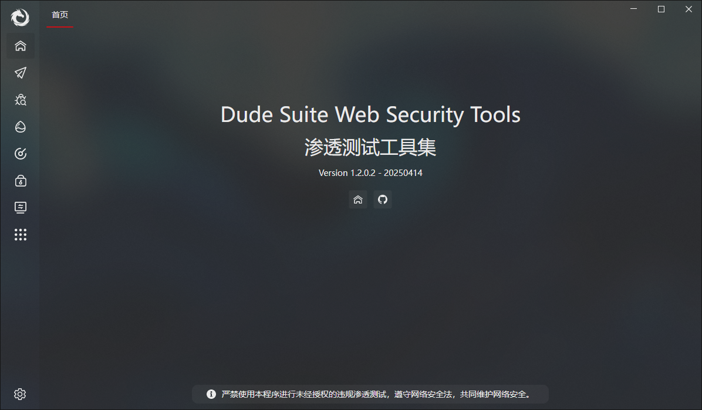
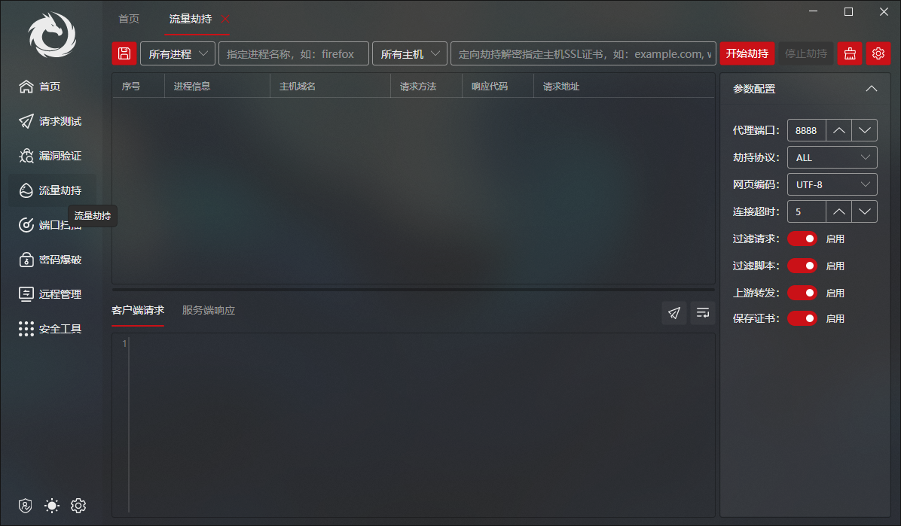
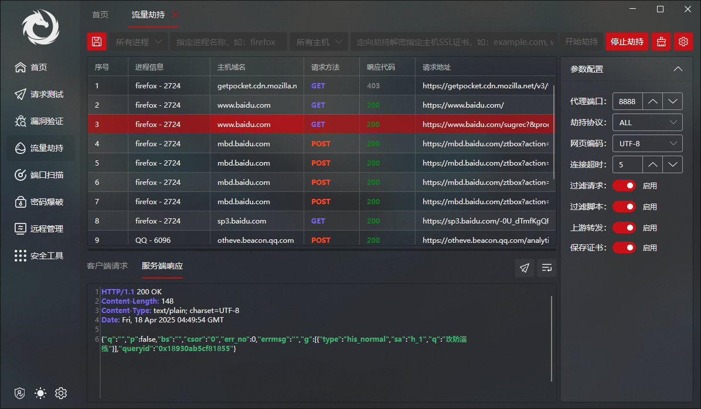
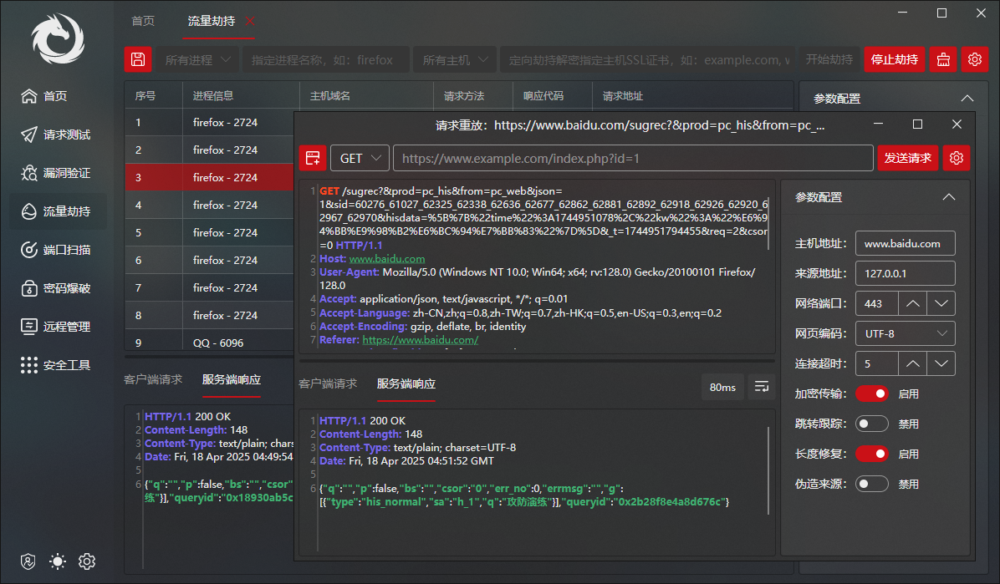
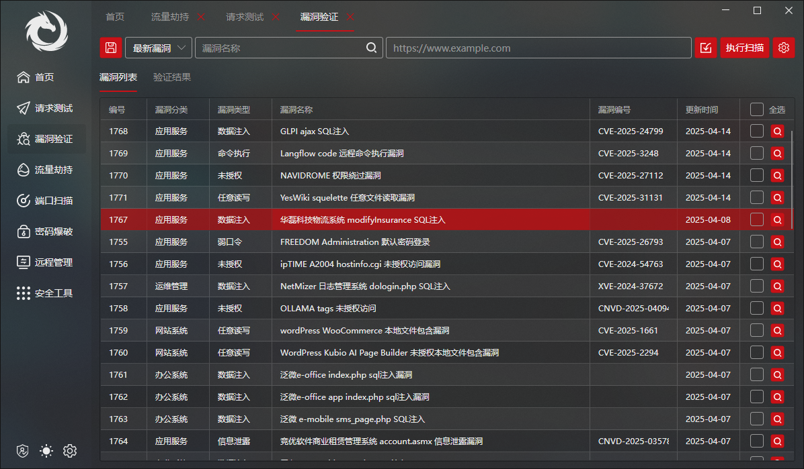
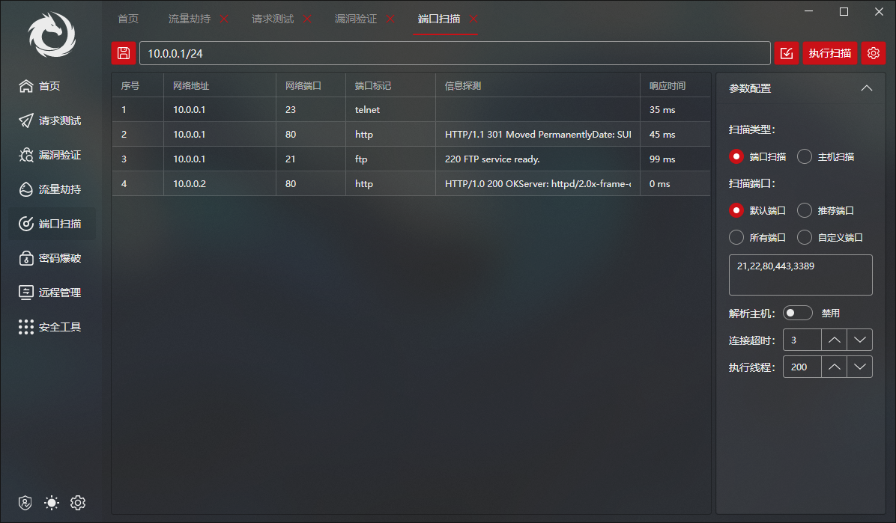
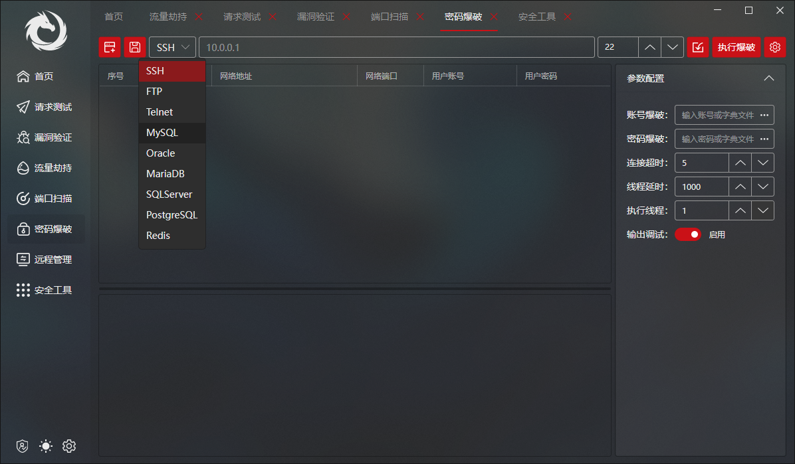
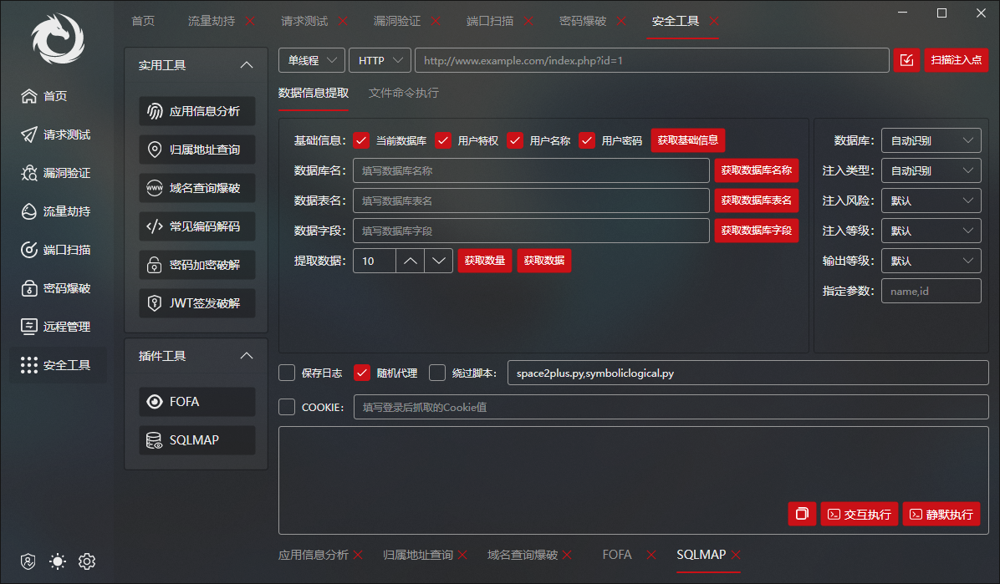

# DudeSuite 一键解锁攻防演练小程序渗透新姿势 | 红队小白不再被劝退-先知社区

> **来源**: https://xz.aliyun.com/news/17821  
> **文章ID**: 17821

---

### 0x01 工具介绍

　　DudeSuite（Dude Suite Web Security Tools）是一款轻量化集成化的Web渗透测试工具集程序，程序包含了多种常见的渗透测试场景适用的工具除经典的请求重放、请求爆破、漏洞验证、流量劫持、端口扫描、远程管理核心功能外不定时的更新常用的功能插件如：常见的编码解码、加密破解、网络空间资产搜索、域名爆破、JWT构造爆破、SQL注入等。可高效地对Web应用程序进行合规渗透测试及漏洞挖掘验证，复现Web应用中的安全隐患，排除信息信息系统潜在安全风险。适用于HW行动、红队大佬、渗透团队、安全评估测评机构等，当然也适合蓝队自查。支持Windows及MacOS。

### 0x02 流量劫持

　　本文重点介绍使用“流量劫持”功能对https及微信小程序的数据包的抓取及重放。先聊聊传统微信小程序调试手法，目前微信小程序调试手法还是挺多的，如：反编译审计代码、强开F12DevTools、Hook进程各种骚操作、当然最流行的还是BurpSuite+Proxy代理这种方式。总的来说条条大路通罗马姿势总不是千篇一律的，偶尔换换姿势也是可以学到很多东西。但是谁不想一键日卫星呢？请看流量劫持、抓包、重放三部曲。

**第一步：点选"流量劫持"选项，开启流量劫持主体功能****第二步：点击"开始劫持"一键完成流量代理、配置、劫持、解密，捕获加密数据流****第三步：点击"请求重放"小飞机进行请求重放、伪造、调试**　　直接进行改包重放，该注入注入、该上传上传、该遍历遍历，调试门槛直接拉低几个档次，再也不需要开几个工具各种设置、也不需要反编译组合参数、更不需要Hook进程不知道搞啥玩意。用过的小伙伴反馈最多的词就是：丝滑、润。

### 0x03 其他功能

**漏洞验证：实时更新大量流行POC****端口扫描：全连接端口扫描精准探测端口服务****密码爆破：常用服务协议高速密码暴力破解****安全工具：众多安全小工具助力渗透测试**

### 0x04 小结

　　DudeSuite 是一款**免费**的渗透测试工具，于2023年开始维护至今期间有两次大的版本变动主要是更改技术栈和架构使其更适合现代APP的需求（好看、跨平台），工具的功能按照作者日常使用工具和渗透习惯编写更加贴近实战（虽然作者渗透水平一般），希望能通过本工具能帮助到新入门的渗透人员，另一方面在接受各种建议的同时也提高作者的技术水平（主要是在一声声大佬中迷失了自我）。
