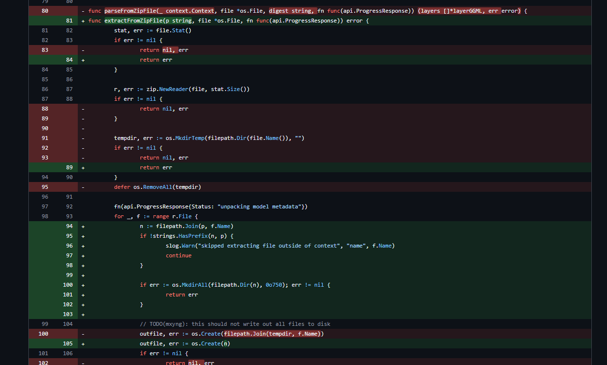
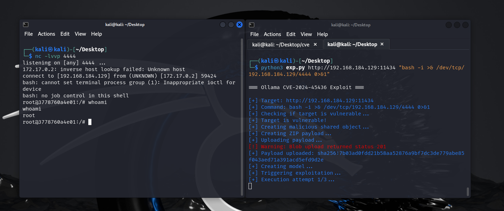

# CVE-2024-45436：Ollama ZIP文件解压导致的命令执行漏洞-先知社区

> **来源**: https://xz.aliyun.com/news/17826  
> **文章ID**: 17826

---

# CVE-2024-45436：Ollama ZIP文件解压导致的命令执行漏洞

## 漏洞概述

CVE-2024-45436是一个在Ollama软件0.1.47版本之前存在的路径遍历漏洞（也称为"Zip Slip"漏洞）。该漏洞允许攻击者利用特制的ZIP文件，将文件解压到系统的任意位置，从而可以访问或覆盖系统文件，最终可能导致远程代码执行。  
**该漏洞仅限Linux系统**

## 技术细节

漏洞位于Ollama的`model.go`文件中的`parseFromZipFile`函数，该函数负责处理ZIP文件的解压。问题在于此函数没有正确验证解压路径，当ZIP文件包含带有`../`序列（目录遍历元素）的路径条目时，应用程序会将这些文件解压到目标目录以外的位置，而不是限制在指定的目标目录内。

攻击主要通过以下步骤：

1. 生成恶意共享对象文件（`hook.so`），该文件包含可执行任意命令的代码
2. 将此文件打包到一个特制的ZIP文件中，包含指向系统关键位置的路径：

* `../../../../../../../../../../etc/ld.so.preload` - 用于启用自定义共享对象的加载
* `../../../../../../../../../../tmp/hook.so` - 恶意共享对象本身

1. 通过Ollama的blob API上传此ZIP文件到有漏洞的服务器
2. 创建一个引用此blob的模型
3. 通过请求embeddings触发有效载荷执行

## 漏洞成因

以下是`ollama-0.1.46`源码中model.go的部分源代码

```
func parseFromZipFile(_ context.Context, file *os.File, digest string, fn func(api.ProgressResponse)) (layers []*layerGGML, err error) {
    stat, err := file.Stat()
    if err != nil {
        return nil, err
    }

    r, err := zip.NewReader(file, stat.Size())
    if err != nil {
        return nil, err
    }

    tempdir, err := os.MkdirTemp(filepath.Dir(file.Name()), "")
    if err != nil {
        return nil, err
    }
    defer os.RemoveAll(tempdir)

```

可以看到其中创建临时文件夹的代码`tempdir, err := os.MkdirTemp(filepath.Dir(file.Name()), "")`  
而由于zip文件的格式中，zip内的文件名称是写在文件头部分的，也就是说，可以构造恶意的文件名`../../../../../../etc/xxx`，使得解压后的文件位于特定目录下。  
于是，我们可以生成恶意的动态链接库，然后修改zip文件头的文件名为带`../../../`前缀的文件名，就可以将恶意链接库解压到任意目录了

对比`ollama-0.1.47`中对应的源码

```
func parseFromZipFile(_ context.Context, file *os.File, digest string, fn func(api.ProgressResponse)) (layers []*layerGGML, err error) {
    tempDir, err := os.MkdirTemp(filepath.Dir(file.Name()), "")
    if err != nil {
        return nil, err
    }
    defer os.RemoveAll(tempDir)

    if err := extractFromZipFile(tempDir, file, fn); err != nil {
        return nil, err
    }

......

func extractFromZipFile(p string, file *os.File, fn func(api.ProgressResponse)) error {
    stat, err := file.Stat()
    if err != nil {
        return err
    }

    r, err := zip.NewReader(file, stat.Size())
    if err != nil {
        return err
    }

    fn(api.ProgressResponse{Status: "unpacking model metadata"})
    for _, f := range r.File {
        n := filepath.Join(p, f.Name)
        if !strings.HasPrefix(n, p) {
            slog.Warn("skipped extracting file outside of context", "name", f.Name)
            continue
        }
```

可以看到新版本的代码在处理文件名称时增加了对文件名称前缀的检查，以此修复旧版本目录穿越的漏洞

​

有关更多信息，可以查看github上两个版本之间的差异：[Comparing v0.1.46...v0.1.47 · ollama/ollama](https://github.com/ollama/ollama/compare/v0.1.46...v0.1.47)



## 漏洞利用详解

### 1. 恶意共享对象生成

攻击者首先创建一个恶意的C语言共享对象，该对象在构造函数中通过`system()`函数执行任意命令：

```
#include <stdio.h>
#include <stdlib.h>
#include <unistd.h>
void __attribute__((constructor)) myInitFunction() {
    const char *f1 = "/etc/ld.so.preload";
    const char *f2 = "/tmp/hook.so";
    unlink(f1);
    unlink(f2);
    system("bash -c '%s'");
}
```

这段代码中的`%s`会被替换为攻击者指定的命令。

### 2. ZIP Slip攻击

攻击者打包一个恶意ZIP文件，其中包含指向系统关键文件的路径：

* `/etc/ld.so.preload`：Linux系统中的一个特殊文件，可用于在程序执行前预加载共享库
* `/tmp/hook.so`：恶意共享对象

### 3. 攻击影响

通过以上步骤，攻击者可以：

1. 向Ollama的API端点`/api/blobs/{blob_id}`提交恶意ZIP文件
2. 使文件写入到预期目录之外
3. 特别是写入到`/etc/ld.so.preload`以加载恶意共享对象
4. 以Ollama服务的权限（可能是root权限）执行任意代码

此漏洞的影响包括：

* 远程代码执行（RCE）
* 未授权的系统访问
* 数据破坏或窃取
* 完全的系统控制权

## 复现过程

首先开一个docker环境

```
docker run -v ollama:/root/.ollama -p 11434:11434 --name ollama ollama/ollama:0.1.46
```

然后运行poc脚本：[srcx404/CVE-2024-45436: exploit script for CVE-2024-45436](https://github.com/srcx404/CVE-2024-45436)

```
python exp.py <target_url> <command>
```

该脚本会通过传入的命令先构造C代码，然后编译生成动态链接库，再通过代码生成zip文件，最后通过`api/upload/`接口提交到ollama。提交之后ollama就会将动态链接库解压到指定文件夹，然后通过`api/embeddings`接口触发动态链接库的运行，执行先前传入的命令。  
需要注意的是，该漏洞的命令执行并没有回显的方式，所以常规打法还是反弹shell



## 受影响系统

该漏洞影响：

* Ollama版本0.1.46及更早版本
* 自托管和云部署的Ollama实例
* 仅支持Linux系统

## 漏洞检测

漏洞检测可通过调用Ollama的API版本端点来确定版本号：  
GET /api/version  
如果版本低于0.1.47，则系统可能存在此漏洞。

## 缓解措施

推荐的缓解措施包括：

1. 将Ollama升级到版本0.1.47或更高版本
2. 如果无法立即升级，限制对Ollama API端点的网络访问

## 漏洞修复

Ollama官方在0.1.47版本中修复了这个问题，修复方案是在解压ZIP文件时，正确验证文件路径，防止路径穿越攻击。防止路径中包含`../`或类似序列导致文件被解压到预期目录外部。

​

## 利用脚本

<https://github.com/srcx404/CVE-2024-45436>
