# ios逆向整理-先知社区

> **来源**: https://xz.aliyun.com/news/17832  
> **文章ID**: 17832

---

# 一般思路

将ipa文件后缀改为zip，解压之后进入Payload，会有一个.app文件夹，进去找到二进制文件就能放到ida里分析

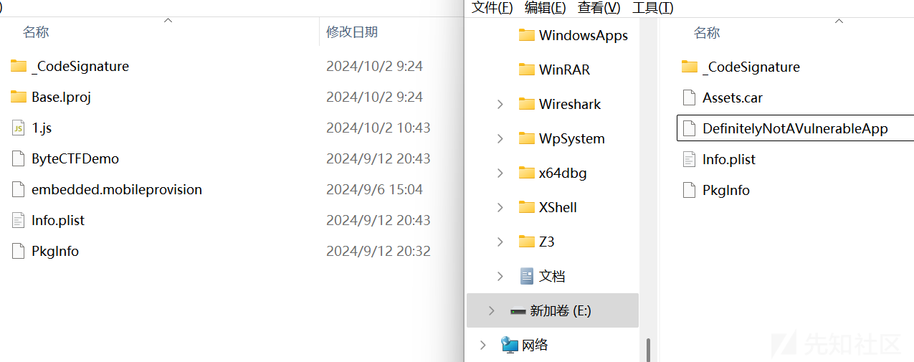

main函数似乎都没什么用

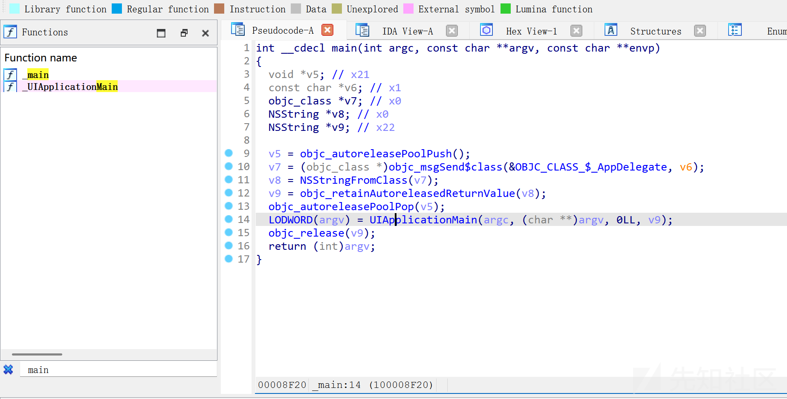

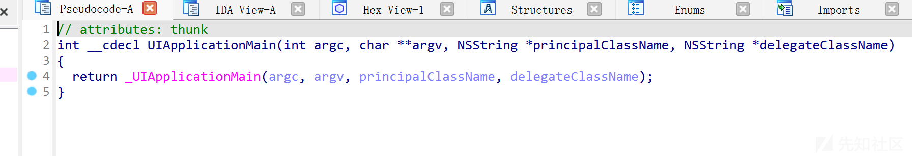

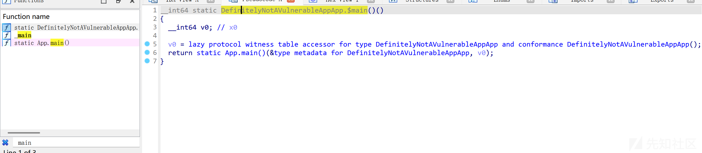

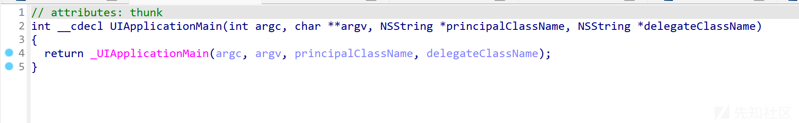

一般都是直接搜字符串然后交叉引用找到关键函数继续分析

# 题目

## 2025数字中国app赛道IOSApp

题目描述：安全审计员审查发现revealFlag函数比较可疑，请分析代码，帮她找到与之相关的flag

搜索string找到一个拼接base64

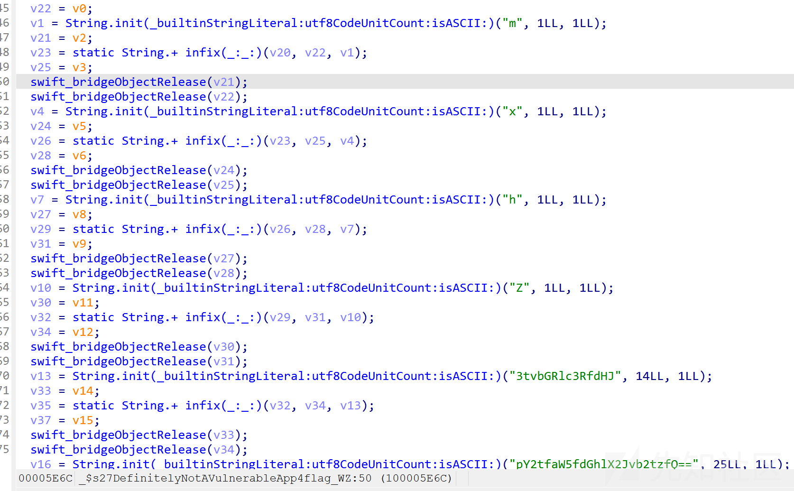

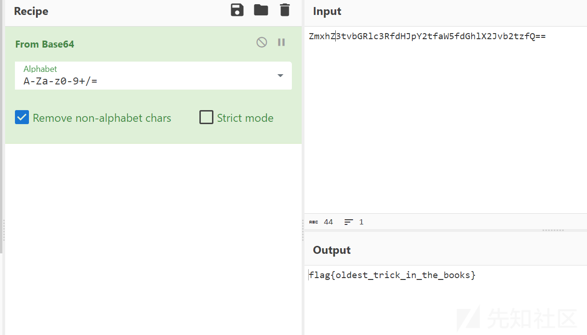

swift就是用cpp写的，所以看上去很像cpp的风格

调用obfuscatedFlag.unsafeMutableAddressor()，表示从 obfuscatedFlag 获取 flag 的密文

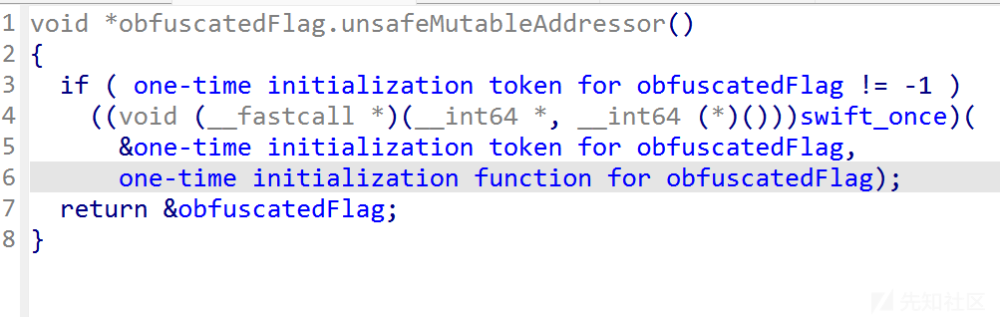

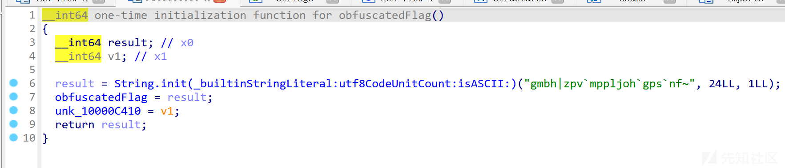

Collection.map<A>(\_:)(closure #1 in revealFlag(if:), ...)表示对 String 类型调用 map，对每一个加密字符应用了解密函数（revealFlag）

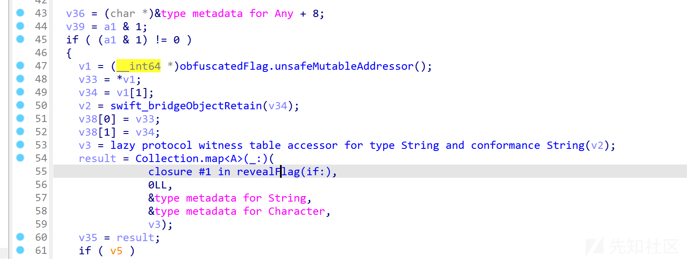

进入解密函数，Character.asciiValue.getter(); 表示获取字符的 ascii 值

result = UnsignedInteger<>.init<A>(\_:)(&v15, ...);可能会让传入的 v15 的一部分（在内存中紧邻的数据）写入了 v16 的值，而v15等于1，也就是每个字符的ascii值都减一

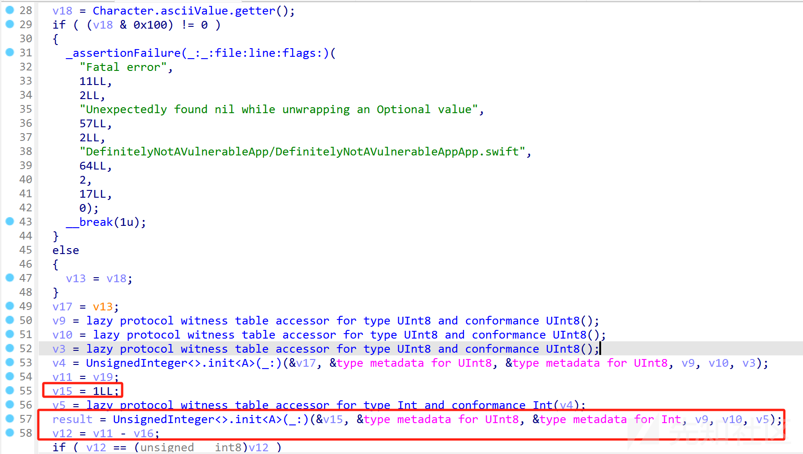

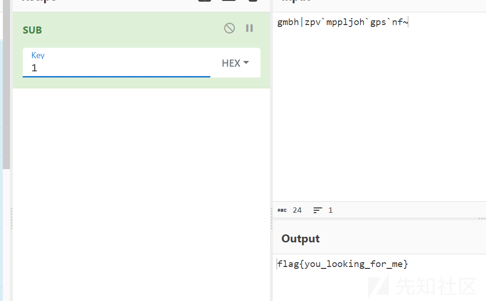

## 2024ByteCTF极限逃脱

010查看格式，修改后缀后解压，直接搜索字符串发现flag格式

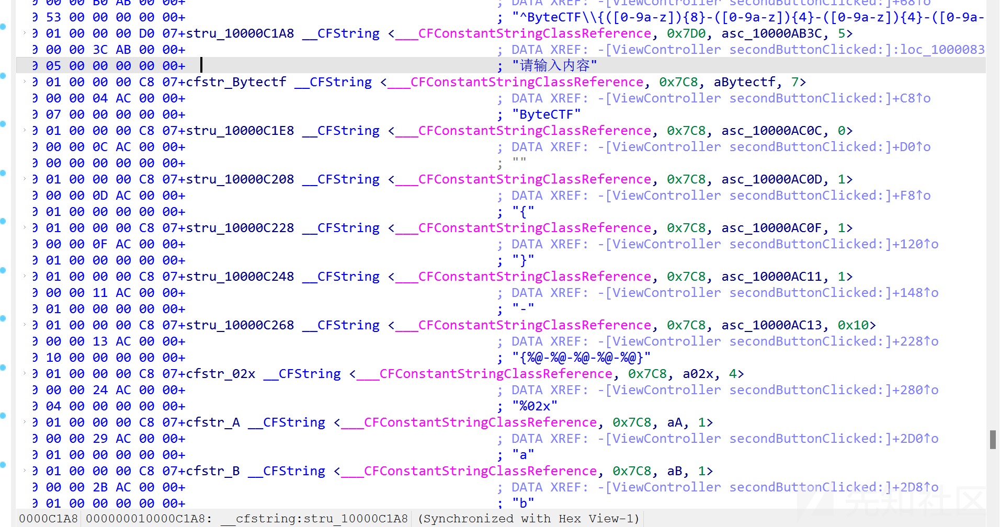

后面有uuid的字符串，直接交不对，且上面有a-f，猜测是某种映射

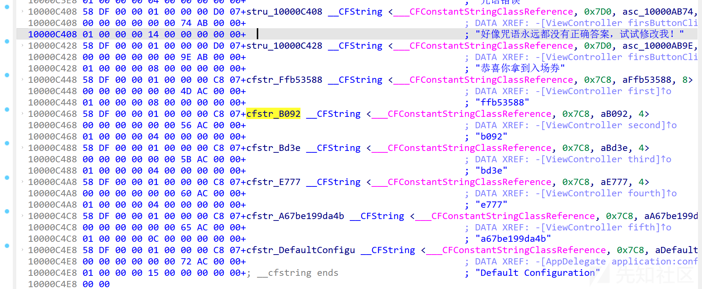

字符串交叉引用找到关键函数，下面分析整个函数

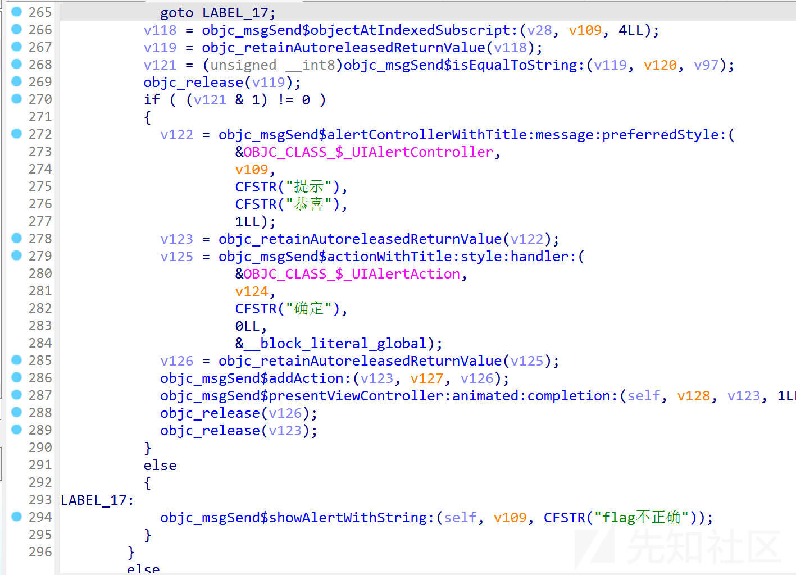

self相当于从内存加载，而输入的直接是最后的flag

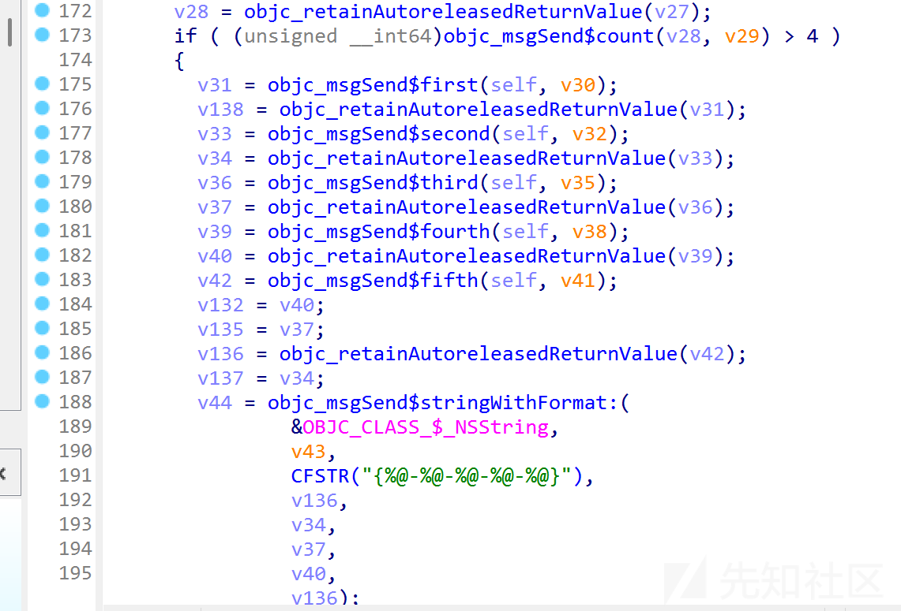

{a67be199da4b-b092-bd3e-e777-a67be199da4b} sha256加密后得到6c9838a3c6810bdb2633ed5910b8547c09a7a4c08bf69ae3a95c5c37f9e8f57e

取子串，第一个变量是源字符串，第二个变量无法查找，第三个变量猜测是下标，第四个变量是长度

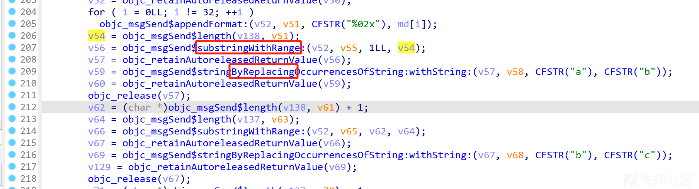

各取一段替换后作为flag一部分

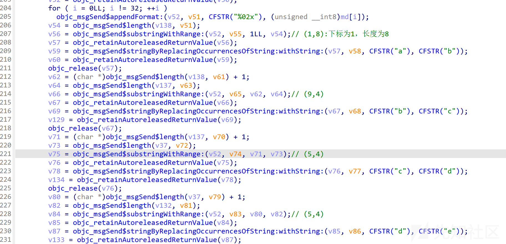

`ByteCTF{c9838b3c-6810-8a3d-8a3c-8a3c6810bdb2}`

## 2017iOS CTF

根据string两次交叉引用找到关键函数

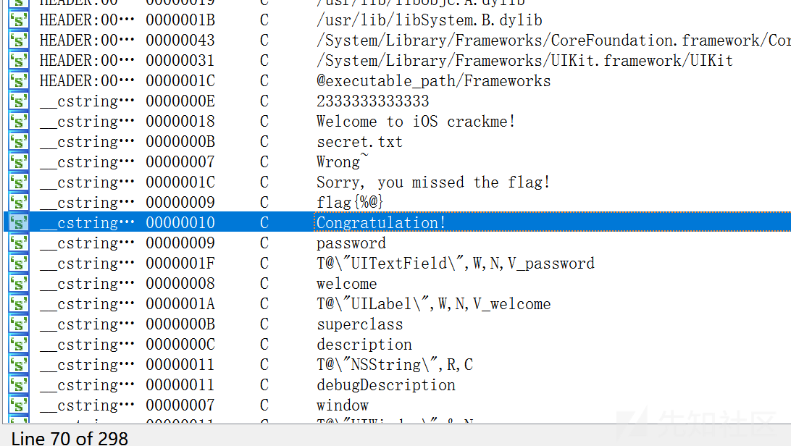

self->password是输入，长度为32，与self->plain相比，相等且self->fg为0则missed

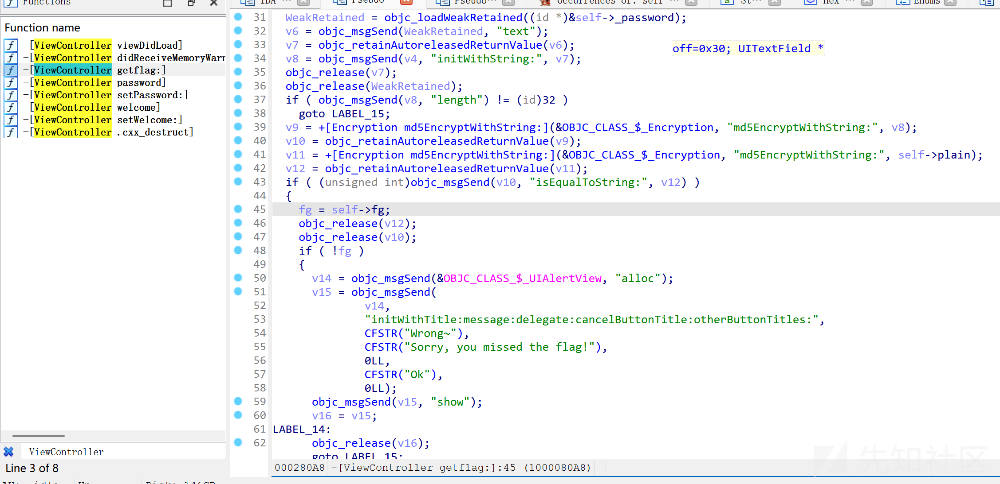

self->plain要从 ViewController 类里的-init 或 -viewDidLoad 等初始化函数中找

self->plain 从 secret.txt 中读取并base64解密

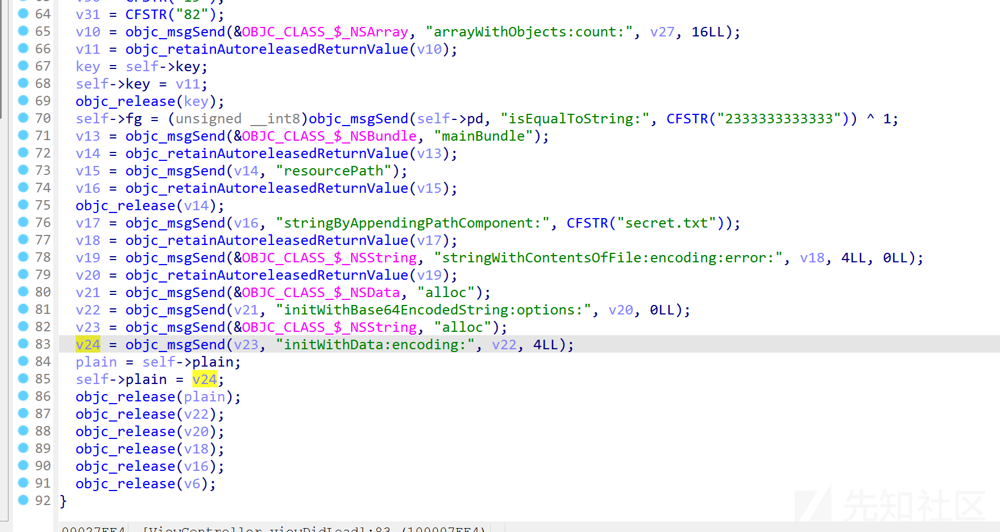

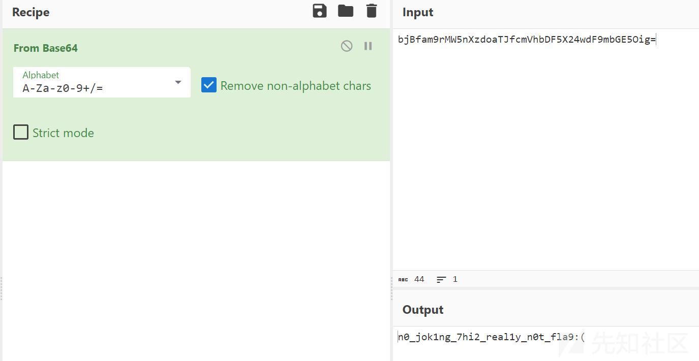

输入和pd前16位相等

```
  if ( (unsigned int)objc_msgSend(v10, "isEqualToString:", v12) )
  {
    fg = self->fg;
    objc_release(v12);
    objc_release(v10);
    if ( !fg )
    {
      v14 = objc_msgSend(&OBJC_CLASS_$_UIAlertView, "alloc");
      v15 = objc_msgSend(
              v14,
              "initWithTitle:message:delegate:cancelButtonTitle:otherButtonTitles:",
              CFSTR("Wrong~"),
              CFSTR("Sorry, you missed the flag!"),
              0LL,
              CFSTR("Ok"),
              0LL);
      objc_msgSend(v15, "show");
      v16 = v15;
LABEL_14:
      objc_release(v16);
      goto LABEL_15;
    }
  }
  else
  {
    objc_release(v12);
    objc_release(v10);
  }
  if ( self->fg )
  {
    NSLog(&stru_10000C488.isa, self->pd);
    v17 = 0LL;
    while ( 1 )
    {
      v18 = (unsigned int)objc_msgSend(v8, "characterAtIndex:", v17);
      if ( v18 != (unsigned int)objc_msgSend(self->pd, "characterAtIndex:", v17) )
        break;
      if ( ++v17 >= 16 )
      {
        v19 = 16LL;
        while ( 1 )
        {
          v20 = (unsigned __int8)objc_msgSend(v8, "characterAtIndex:", v19);
          v21 = (unsigned __int8)((unsigned __int8)objc_msgSend(self->pd, "characterAtIndex:", v19) ^ v20) + 5;
          v22 = v19 - 16;
          v23 = objc_msgSend(self->key, "objectAtIndex:", v22);
          v24 = objc_retainAutoreleasedReturnValue(v23);
          v25 = (unsigned __int8)objc_msgSend(v24, "intValue");
          objc_release(v24);
          if ( v21 != v25 )
            goto LABEL_15;
          v19 = v22 + 17;
          if ( v19 > 31 )
          {
            v26 = objc_msgSend(&OBJC_CLASS_$_NSString, "stringWithFormat:", CFSTR("flag{%@}"), v8);
            v27 = objc_retainAutoreleasedReturnValue(v26);
            v28 = objc_msgSend(&OBJC_CLASS_$_UIAlertView, "alloc");
            v29 = objc_msgSend(
                    v28,
                    "initWithTitle:message:delegate:cancelButtonTitle:otherButtonTitles:",
                    CFSTR("Congratulation!"),
                    v27,
                    0LL,
                    CFSTR("Ok"),
                    0LL);
            objc_msgSend(v29, "show");
            objc_release(v29);
            v16 = (UIAlertView *)v27;
            goto LABEL_14;
          }
        }
      }
    }
  }
```

要想使得self->fg为1，在viewDidLoad中self->pd只能等于2333333333333，可是pd本身都没有16位

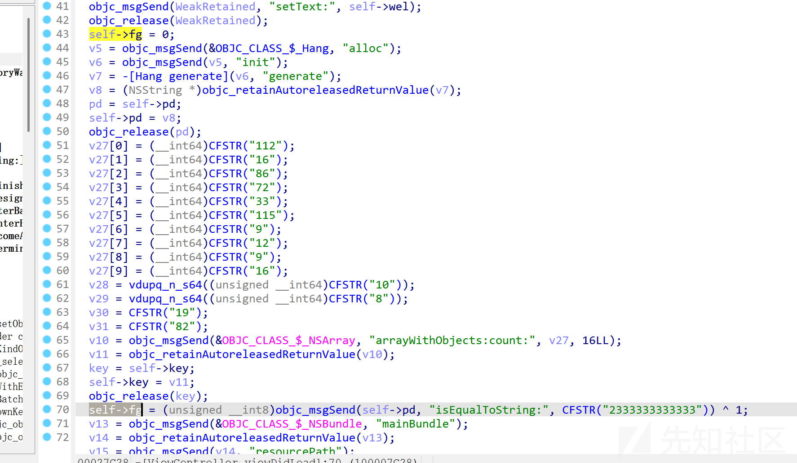

pd由generate生成

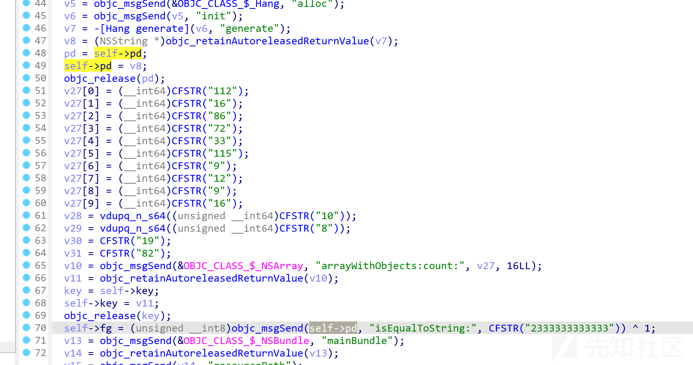

由generate方法决定比较的字符串

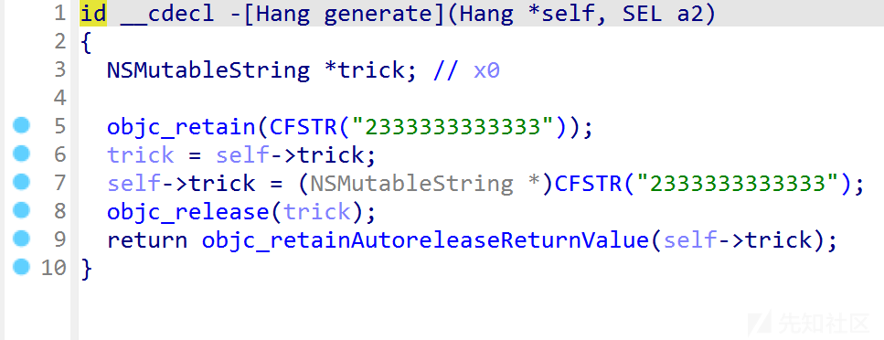

deb里的lib文件hook了generate方法

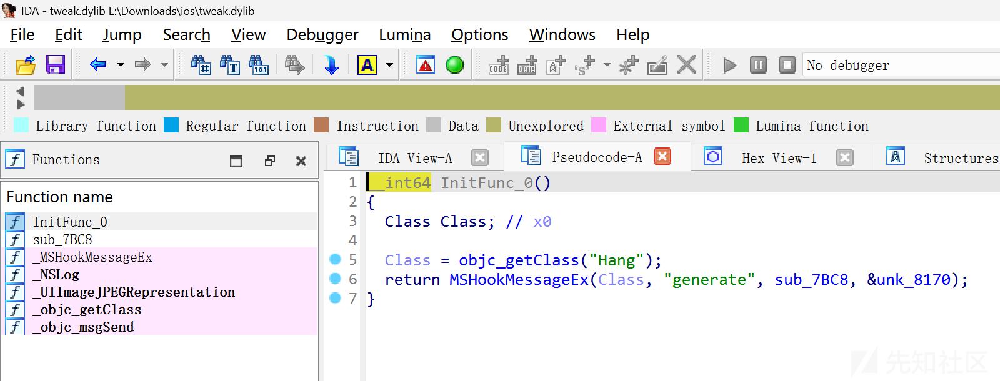

如果有环境的话可以直接把这个 dylib 拷贝到 /Library/MobileSubstrate/DynamicLibraries/ 目录下，让程序运行的时候加载

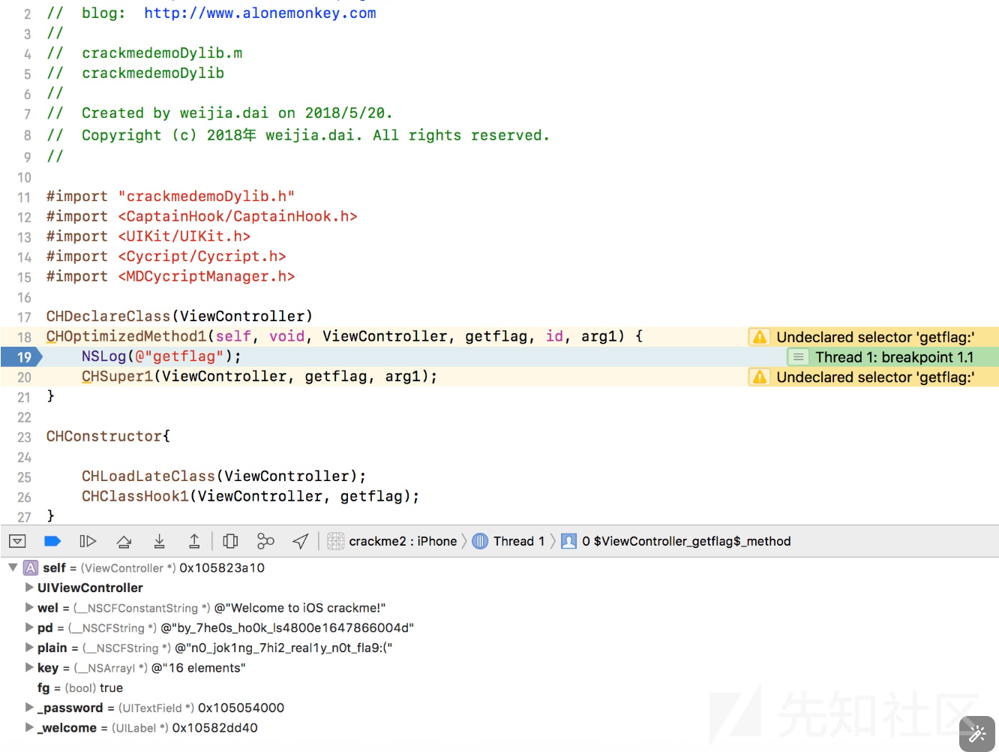

我这里没有环境，选择直接分析程序，首先获取并加载图片

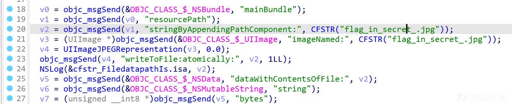

取前 32 个字节中下标为奇数的字节，将 v6 的前16字符替换成混淆后的 v10

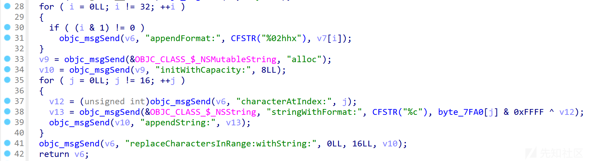

```
byte_7FA0 = [
    0x06, 0x41, 0x3A, 0x07, 0x59, 0x55, 0x04, 0x45,
    0x6B, 0x5E, 0x5F, 0x01, 0x5B, 0x6E, 0x58, 0x4B
]
def generate_custom_string(file_path):
    with open(file_path, "rb") as f:
        data = f.read(32)

    filtered = [data[i] for i in range(1, 32, 2)]
    hex_str = ''.join(f'{b:02x}' for b in filtered)

    transformed = ''
    for i in range(16):
        orig_char = ord(hex_str[i])
        xor_char = byte_7FA0[i] ^ orig_char
        transformed += chr(xor_char)

    final_str = transformed + hex_str[16:]
    return final_str

result = generate_custom_string("flag_in_secret_.jpg")
print(result)
#by_7he0s_ho0k_ls4800e1647866004d
```

后16位相互异或+5之后等于密文key

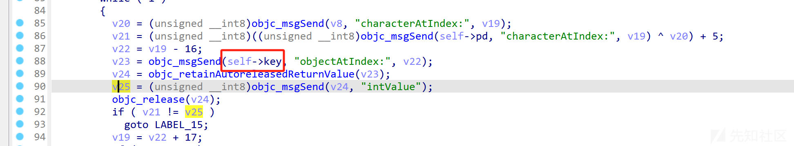

密文只有14位，猜测10和8重复出现

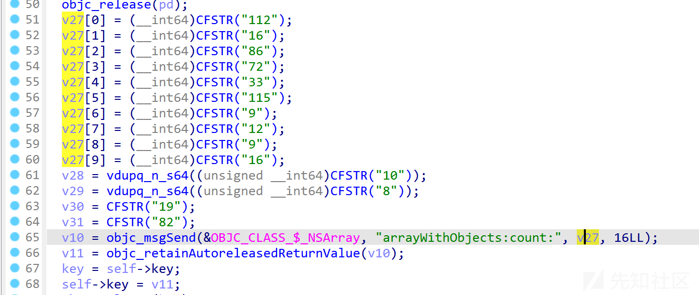

```
p1='by_7he0s_ho0k_ls'
pd='4800e1647866004d'
tmp=''
key=[112,16,86,72,33,115,9,12,9,16,10,10,8,8,19,82]
for i in range(len(key)):
    tmp+=chr((key[i]-5)^ord(pd[i]))
print(p1+tmp)
#by_7he0s_ho0k_ls_3asy_23333333:)
```

超出部分用flag包裹即可

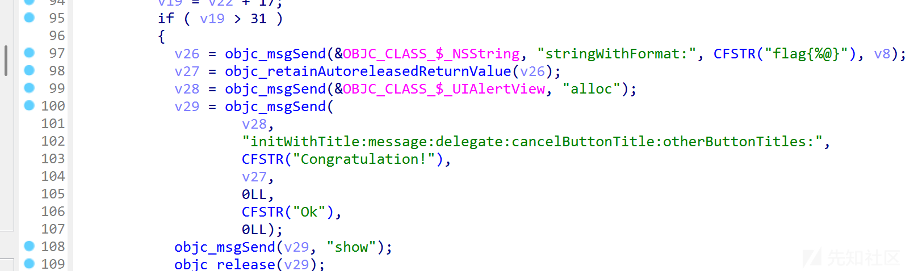

`flag{by_7he0s_ho0k_ls_3asy_23333333:)}`

hopper是一款专门针对ios逆向的工具，也可以考虑使用

练习题：<https://ivrodriguez.com/mobile-ctf/>
