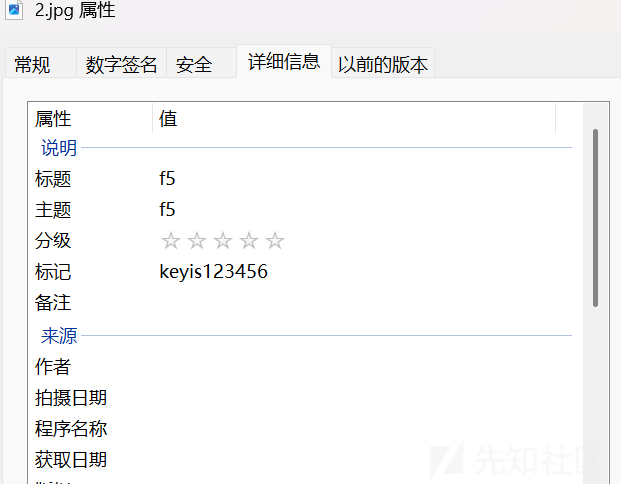
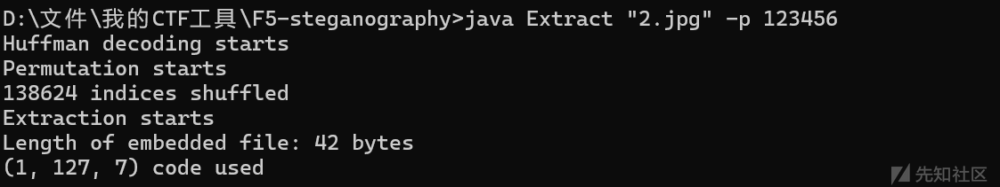
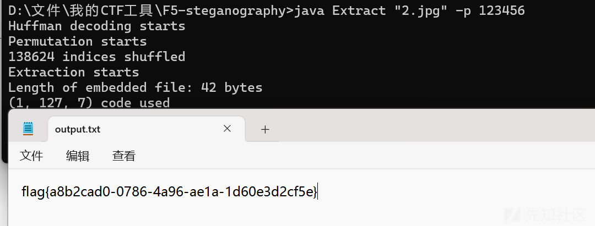
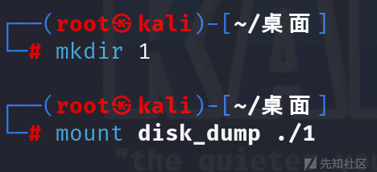
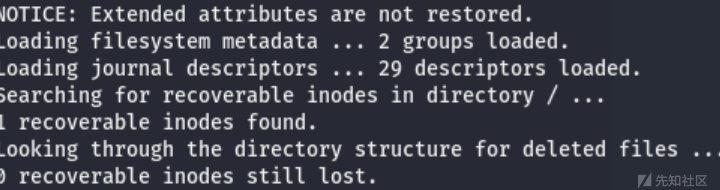

# 2025安徽省网络分布式大赛——漏洞挖掘与防范（高职组）初赛WP-先知社区

> **来源**: https://xz.aliyun.com/news/17834  
> **文章ID**: 17834

---

### F4+1（杂项）

打开图片属性



密码是：123456

F5隐写





flag{a8b2cad0-0786-4a96-ae1a-1d60e3d2cf5e}

### disk—dump（杂项）

挂载镜像




还原文件



extundelete disk\_dump --restore-all

脚本

```
if __name__ == "__main__":
    with open(r"./flag.txt", "rb") as f:
        data = f.read()
    v4=34
    v5=0
    index=len(data)
    for j in range(len(data)):
        
        flag_maybe = (data[j] ^v4)-v5
        print(chr(flag_maybe), end='')
        v4 += 34
        v4 &=0xFF
        v5 = (v5 + 2) & 0xF
```

flag{Good\_hacker}

### 有点复杂的AES（密码）

直接打aes+xor

```
from Crypto.Util.number import *
from Crypto.cipher import AES
def encrypt(msg, key):
    aes = AES.new(key, mode=AES.MODE_CTR)
    return aes.encrypt(msg)
def padding(m):
    padding_length = 16 - len(m) % 16
    return m + padding_length * int.to_bytes(padding_length, 1, 'big')
def xor(a, b):
    return b"".join(bytes([x^y]) for x, y in zip(a, b))
testc = open("test", "rb").read()
cip = open("cip", "rb").read()
test_msg = padding(b"This is a test.")
data_xor = xor(test_msg, testc)
flag = b""
for i in range(len(cip) // 16):
    flag += xor(data_xor, cip[i*16:i*16+17])
print(flag)
```

### JustMath（密码）

附件给出

```
from Crypto.Util.number import *
from secret import flag

def task(flag):
    p = getPrime(256)
    q = getPrime(256)
    n = p * q
    e = 3

    m1 = bytes_to_long(flag)
    m2 = 2025 * m1 + 20250420

    c1 = pow(m1, e, n)
    c2 = pow(m2, e, n)
    assert m1**3 > n
    assert m2**3 > n
    assert m1 < n
    assert m2 < n
    return c1, c2, n
#数据太长不方便展示
if __name__ == '__main__':
    print(task(flag))
```

直接打gcd读写flag

```
from Crypto.Util.number import long_to_bytes
from math import gcd


c1, c2, n = (64885875317556090558238994066256805052213864161514435285748891561779867972960805879348109302233463726130814478875296026610171472811894585459078460333131491392347346367422276701128380739598873156279173639691126814411752657279838804780550186863637510445720206103962994087507407296814662270605713097055799853102, 51027978108953685430923088765631718689518331860283810449342357312947703546986566730824693345876532996932203789468315228909826441179349104700967467298000493361877097365570495922288961191809397661545639212940202693646765580112334572080754654954135130714144349856794420453755808097202756889313632778752288982120, 88093766714072426393952295461093553280685318492938105295005872184383089207181604838583653993849377719062878363016523807541139197056000620355716735409289528)


A = 3 * 2025**2 * 20250420
B = 3 * 2025 * 20250420**2
C = 2025**3 * c1 + 20250420**3 - c2


gcd_A_n = gcd(A, n)
if gcd_A_n != 1:
    print("A and n are not co-prime, gcd(A, n) =", gcd_A_n)

else:
    inv_A = pow(A, -1, n)
    a = 1
    b = (B * inv_A) % n
    c = (C * inv_A) % n


    lhs = (2025**3 * c1) % n
    rhs = c2 % n
    print("2025^3 * c1 ≡ c2 mod n?", lhs == rhs)  


    a_coeff = 2025
    b_coeff = 20250420
    A = 3 * a_coeff**2 * b_coeff
    B = 3 * a_coeff * b_coeff**2
    C = a_coeff**3 * c1 + b_coeff**3 - c2

    gcd_An = gcd(A, n)
    print("gcd(A, n) =", gcd_An)  
    if gcd_An == 1:
        inv_A = pow(A, -1, n)

        a_quad = 1
        b_quad = (B * inv_A) % n
        c_quad = (C * inv_A) % n

        if gcd(2, n) == 1:
            inv_2 = pow(2, -1, n)
            D = (b_quad * inv_2) % n
            rhs = (D**2 - c_quad) % n

    m1 = 56006392793430010663016642098239513811260175999551893260401436587175373756825078
    flag = long_to_bytes(m1)
    print(flag)
```

### SageMath（ 密码）

Coppersmith

```
from Crypto.Util.number import long_to_bytes
from sage.all import *

c = 779103490619447635682993963941843375208618990838174900106787660433203887298420505324997425151
N = 998879862048246911134577548979534254069934125860302590440042839661942024334528660249954652486
gaoweip = 1267257602781076197584095655390592432410816927052082493298830997704264396709039811735525

PR.<x> = PolynomialRing(Zmod(N))
f = high_p + x
X = 2^100
main = f.small_roots(X=X, beta=0.4)
x0 = int(roots[0])
p = int(high_p + x0)
q = N // p
phi = (p - 1) * (q - 1)
d = inverse_mod(7, phi)
m = pow(c, d, N)
flag = long_to_bytes(m)
print( flag)
```

flag{4e5c8922-3b95-9190-1ed6-1198ce4d8064}
