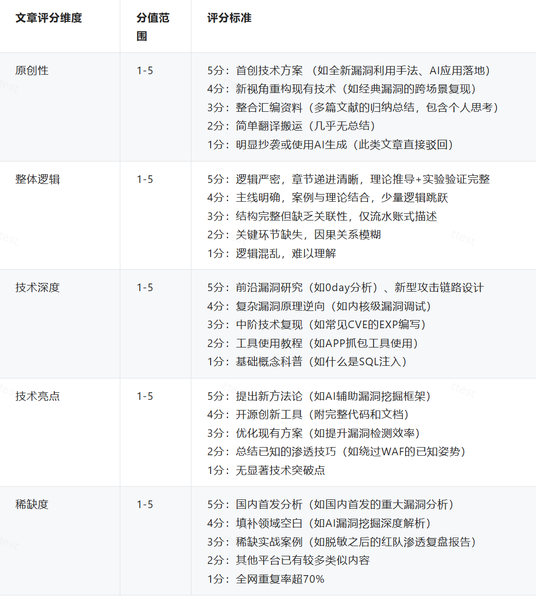
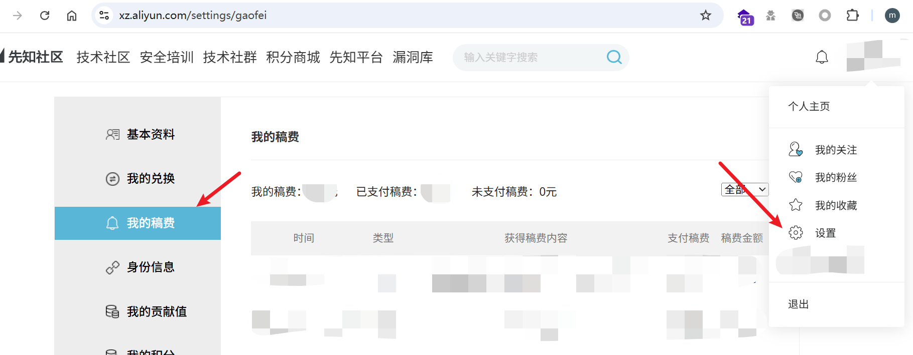
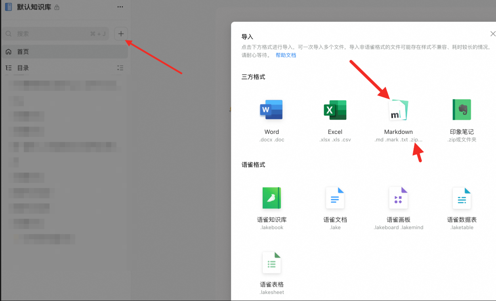
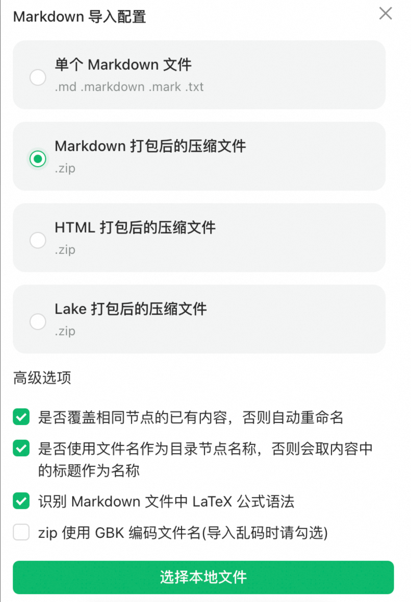
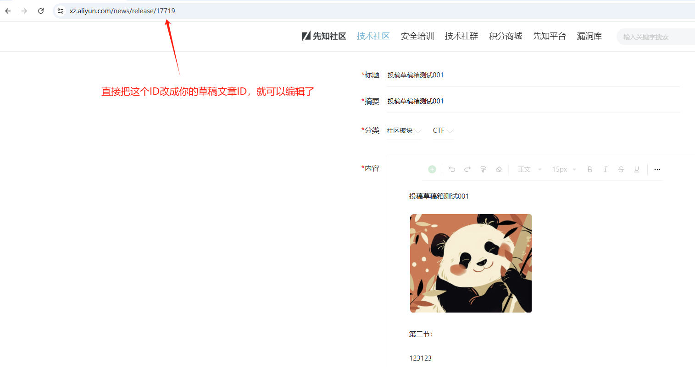
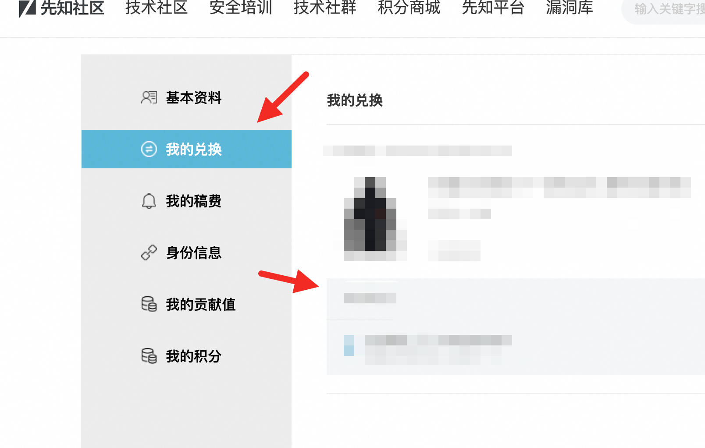

# 先知社区Q&A-先知社区

> **来源**: https://xz.aliyun.com/news/17841  
> **文章ID**: 17841

---

# **稿费结算**

在文章发布时间的下个月进行评定稿费并打款至支付宝(可查看支付宝账单查询)。

请在**个人设置-身份信息**填写好相关信息。

# 稿费评定规则

<https://xz.aliyun.com/news/17597>

# 如何查看稿费

# **转载问题**

需现在先知社区投稿并审核通过后，即可在其他处转载，同时需附上首发/转载先知社区，原文作者、原文链接。

# **文章内容修改**

要修改文章内容，可以联系 霂臣 进行处理。

# **修改头像**

修改头像的时候，上传完头像会显示待审核即可，无需再次点击保存

# 积分作用

可以在积分商城(即将上架商品)兑换相关商品。

# 外链图片相关问题

投稿文章 可以直接复制粘贴，外链图片后台会进行处理，

如果图片是本地markdown+本地图片，可以使用yuque的导入功能，导入后在复制粘贴到社区提交

# 草稿发布

编辑按钮暂时被隐藏了，最近会更新修复这个bug，临时可以直接访问这个URL编辑草稿，如图：

# 积分商城兑换问题

一周发货一次，发货后会有快递单号

​
