# 2025数字中国创新大赛-移动互联网（APP）安全积分争夺赛决赛 Writeup-先知社区

> **来源**: https://xz.aliyun.com/news/17845  
> **文章ID**: 17845

---

# 2025数字中国创新大赛-移动互联网（APP）安全积分争夺赛决赛

## crackme

定位到关键函数 `verify_system_password`：

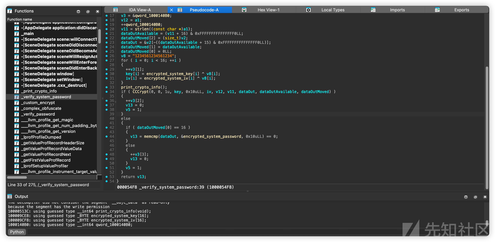

可以看到这里使用了 `CCCrypt` 函数，该函数原型为：

```
CCCryptorStatus CCCrypt(
    CCOperation op,         /* kCCEncrypt, etc. */
    CCAlgorithm alg,        /* kCCAlgorithmAES128, etc. */
    CCOptions options,      /* kCCOptionPKCS7Padding, etc. */
    const void *key,
    size_t keyLength,
    const void *iv,         /* optional initialization vector */
    const void *dataIn,     /* optional per op and alg */
    size_t dataInLength,
    void *dataOut,          /* data RETURNED here */
    size_t dataOutAvailable,
    size_t *dataOutMoved)
```

其中一些相关的枚举量为：

```
/*!
    @enum       CCOperation
    @abstract   Operations that an CCCryptor can perform.

    @constant   kCCEncrypt  Symmetric encryption.
    @constant   kCCDecrypt  Symmetric decryption.
*/
enum {
    kCCEncrypt = 0,
    kCCDecrypt,
};

/*!
    @enum       CCAlgorithm
    @abstract   Encryption algorithms implemented by this module.
    @constant   kCCAlgorithmAES     Advanced Encryption Standard, 128-bit block
    @constant   kCCAlgorithmAES128  Deprecated, name phased out due to ambiguity with key size
    @constant   kCCAlgorithmDES     Data Encryption Standard
    @constant   kCCAlgorithm3DES    Triple-DES, three key, EDE configuration
    @constant   kCCAlgorithmCAST    CAST
     @constant   kCCAlgorithmRC4     RC4 stream cipher
     @constant   kCCAlgorithmBlowfish    Blowfish block cipher
*/
enum {
    kCCAlgorithmAES128 = 0, /* Deprecated, name phased out due to ambiguity with key size */
        kCCAlgorithmAES = 0,
    kCCAlgorithmDES,
    kCCAlgorithm3DES,
    kCCAlgorithmCAST,
    kCCAlgorithmRC4,
    kCCAlgorithmRC2,
    kCCAlgorithmBlowfish
    };
```

可以看到这里就是在使用 AES 对数据进行加密，所以我们简单解密即可：

```
from Crypto.Cipher import AES

key = list(bytes.fromhex("30117653BC9DFCDD32177051B899FEDB"))
iv = list(bytes.fromhex("2306654CA59DFCDD2100634EA199FEDB"))
v8 = "1234561234561234"
for i in range(len(key)):
    key[i] ^= ord(v8[i])
    iv[i] ^= ord(v8[i])

aes = AES.new(key=bytes(key), iv=bytes(iv), mode=AES.MODE_CBC)
print(aes.decrypt(bytes.fromhex("9F8E534C9A66324216842F42E0DB6CEB")).decode())
# iospassword
```

## ezapk

开局一个流量包，里面可以提取出一个 APK，jadx 看看：

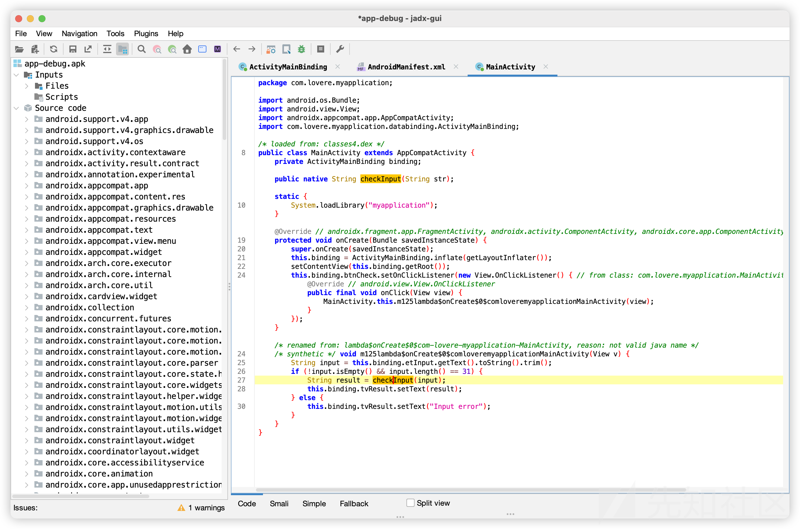

验证逻辑在 so 中，看看 so 中的逻辑：

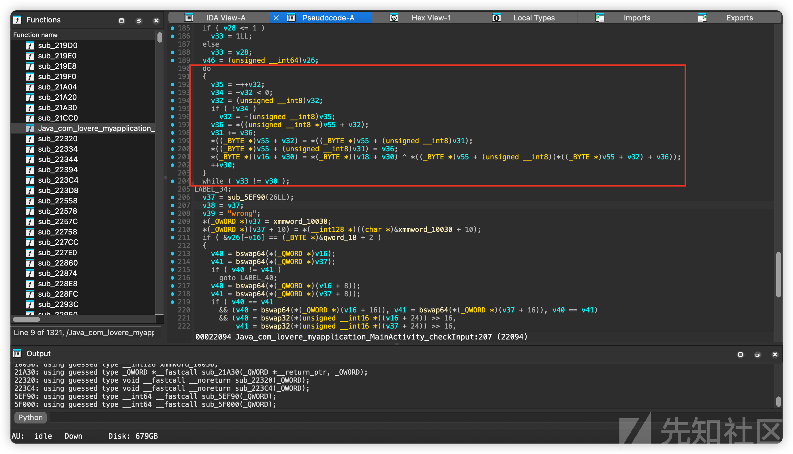

比较容易看出这里是 RC4 的加密逻辑，同时初始化逻辑在上面：

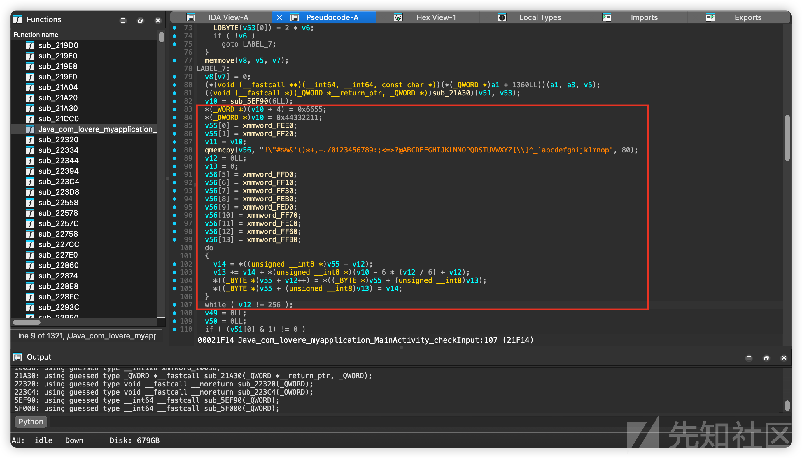

这里魔改的地方是初始化 S 数组是从 1 到 255 再到 0，所以根据魔改后的 RC4 可以解密：

```
class RC4:
    def __init__(self, key: bytes):
        self.key = key

    def get_S(self):
        S = list(range(1, 256))
        S.append(0)
        j = 0
        for i in range(256):
            j = (j + S[i] + self.key[i % len(self.key)]) % 256
            S[i], S[j] = S[j], S[i]
        return S

    def rc4(self, text: bytes):
        S = self.get_S()
        i = j = 0
        out = []
        for char in text:
            i = (i + 1) % 256
            j = (j + S[i]) % 256
            S[i], S[j] = S[j], S[i]
            out.append(char ^ S[(S[i] + S[j]) % 256])
        return bytes(out)

    def encrypt(self, text: bytes):
        return self.rc4(text)


if __name__ == "__main__":
    key = bytes.fromhex("112233445566")
    enc = bytes.fromhex("AF5068EC0A4D9F51ABC8F87F1772FD4343E8E64C60F7BAEEA81E")
    rc4 = RC4(key)
    cipher = rc4.encrypt(enc).decode()
    print(cipher)
# flag{a2_b3_c4_d4_hahahaha}
```

但是发现这里长度与 apk 中要求的 31 并不符合，通过动调可以发现输入会进行处理，对连续的相同字符进行一个类似长度编码的操作，所以正确的 flag 应为 `flag{aa_bbb_cccc_dddd_hahahaha}`

## Task\_get\_vip

首先通过入口点找到一段释放 dex 的逻辑：

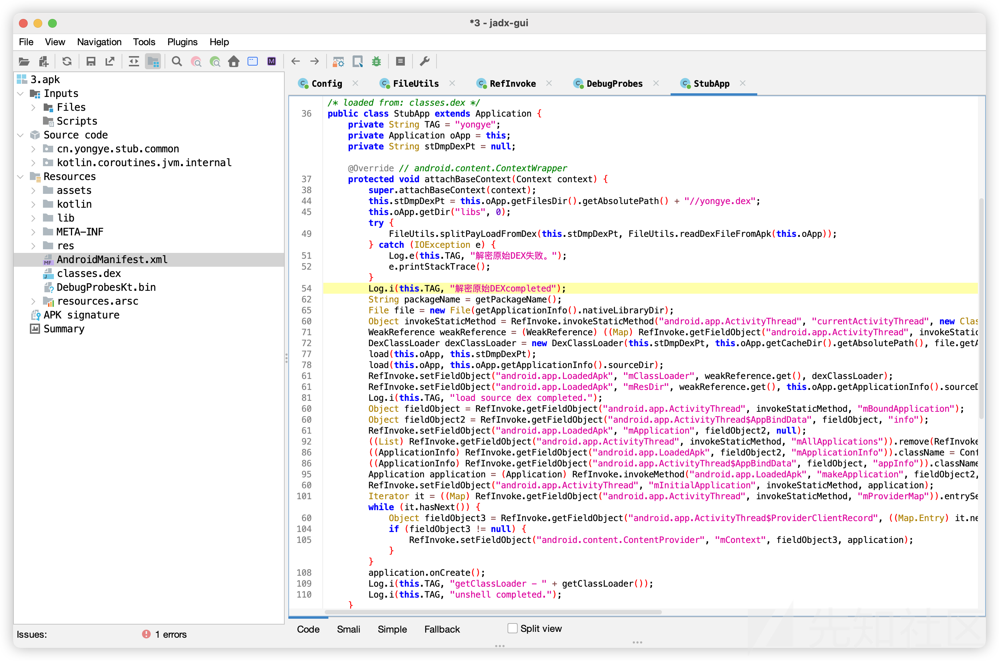

运行后可以在 `/data/user/0/com.example.wyy/files/yongye.dex` 找到释放的 dex，jadx 看看：

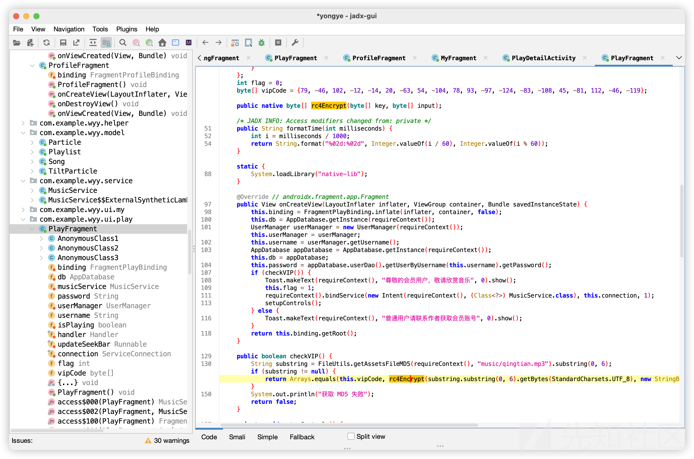

在 `com.example.wyy.ui.play.PlayFragment` 找到验证的逻辑，使用 mp3 文件的 md5 的前 6 位作为密钥进行 rc4 解密即可：

```
from Crypto.Cipher import ARC4

vipcode = [79, -46, 102, -12, -14, 20, -63, 54, -104, 78, 93, -97, -124, -83, -108, 45, -81, 112, -46, -119]
vipcode = bytes([i % 255 for i in vipcode])

rc4 = ARC4.new(key=b'92e3b9')
print(rc4.encrypt(vipcode).decode())
# qjaidlhlf15621149463
```

## taskDB

给了一个 apk 同时给了一个加密的 sqlite 数据库文件，需要逆向 apk 的内容来解密 sqlite 数据库文件。

简单观察可以发现使用的是 `android-database-sqlcipher` 这个组件对数据库进行加密，在 `com.example.managepatients.utils.SecureDatabaseHelper` 类中可以看到密码生成的逻辑：

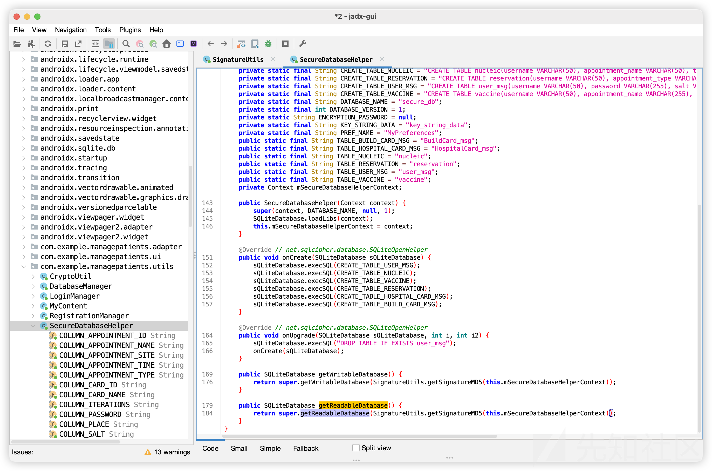

```
public static String getSignatureMD5(Context context) {
    try {
        return byteArrayToHex(MessageDigest.getInstance("MD5").digest(((X509Certificate) CertificateFactory.getInstance("X509").generateCertificate(new ByteArrayInputStream(context.getPackageManager().getPackageInfo(context.getPackageName(), 64).signatures[0].toByteArray()))).getEncoded()));
    } catch (Exception e) {
        Log.e("SignatureUtils", "Error getting MD5", e);
        return null;
    }
}
```

其实就是 APK 签名的 MD5 值：

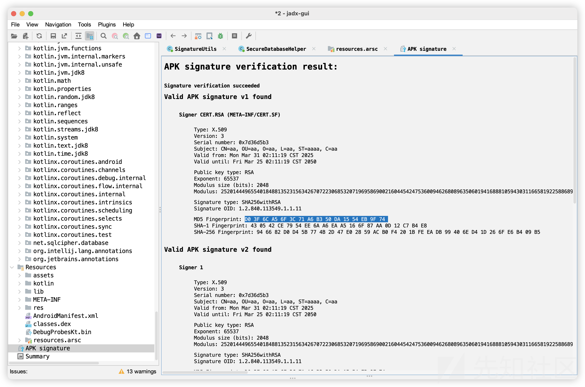

通过密码即可打开 SQLite 数据库文件：

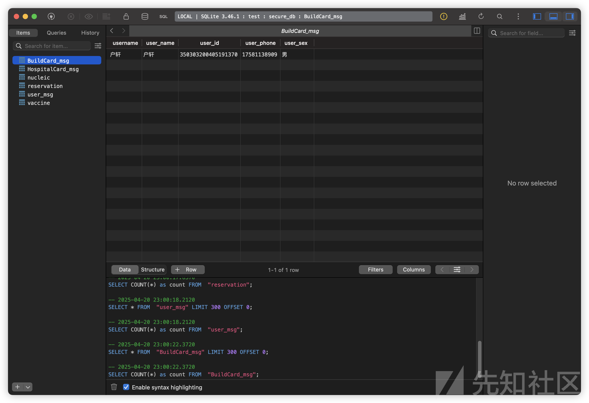

这里需要将用户的密码修改为其电话号码，所以还需要看看密码存储时的处理逻辑：

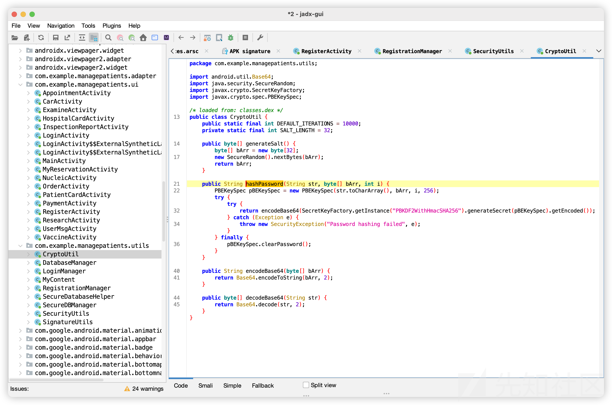

直接抄代码配合数据库里面的数据进行计算即可：

```
package com.example;

import java.util.Base64;
import javax.crypto.SecretKeyFactory;
import javax.crypto.spec.PBEKeySpec;
import java.security.SecureRandom;

public class test {
    public static class CryptoUtil {
        public static final int DEFAULT_ITERATIONS = 10000;
        private static final int SALT_LENGTH = 32;

        public static byte[] generateSalt() {
            byte[] bArr = new byte[32];
            new SecureRandom().nextBytes(bArr);
            return bArr;
        }

        public static String hashPassword(String str, byte[] bArr, int i) {
            PBEKeySpec pBEKeySpec = new PBEKeySpec(str.toCharArray(), bArr, i, 256);
            try {
                try {
                    return encodeBase64(SecretKeyFactory.getInstance("PBKDF2WithHmacSHA256").generateSecret(pBEKeySpec).getEncoded());
                } catch (Exception e) {
                    throw new SecurityException("Password hashing failed", e);
                }
            } finally {
                pBEKeySpec.clearPassword();
            }
        }

        public static String encodeBase64(byte[] bArr) {
            return Base64.getEncoder().encodeToString(bArr);
        }

        public static byte[] decodeBase64(String str) {
            return Base64.getDecoder().decode(str);
        }
    }

    public static void main(String[] args) throws Exception {
        byte[] salt = CryptoUtil.decodeBase64("mzwLy9abXKAeWj8RNC3CRMCEzCHYzbGF+rLv1piGmQ0=");
        String password = "17581138909";
        System.out.println(CryptoUtil.hashPassword(password, salt, CryptoUtil.DEFAULT_ITERATIONS));
    }
}
// x/Mx9u97kkcQ5m/o2gQwoOXjbaRrMayS0iXlFaqzZCw=
```

## taskdecode

运行后是一个查看天气的软件，定位到一个存在恶意行为的 service `com.example.weather.util.SsService`：

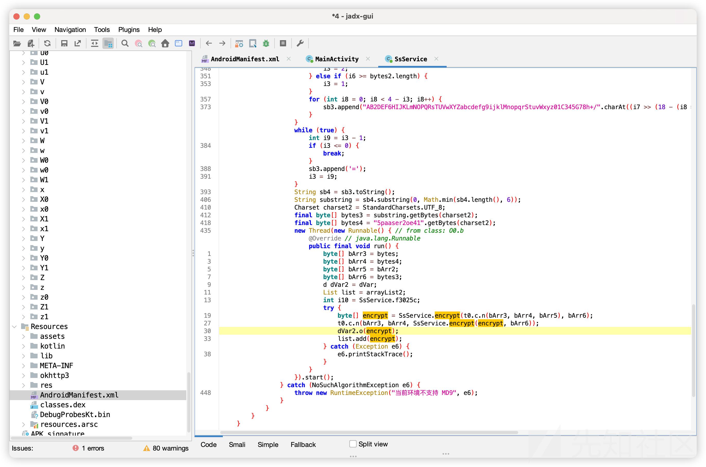

其中 `dVar2.o(encrypt)` 即在对外发送加密数据，加密中 `encrypt` 是在 native 层实现的，其他的过程都是在 Java 层实现的，先看看 native 层：

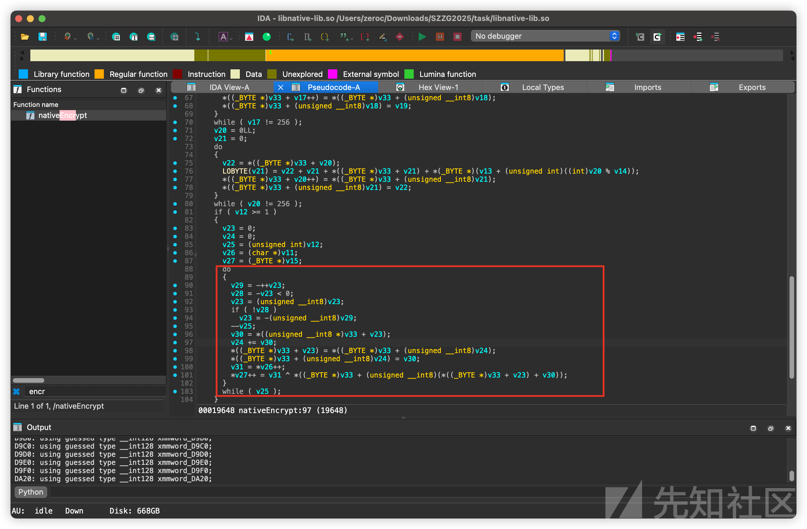

容易看出来是经典的 RC4，但是其初始化过程有一些不一样：

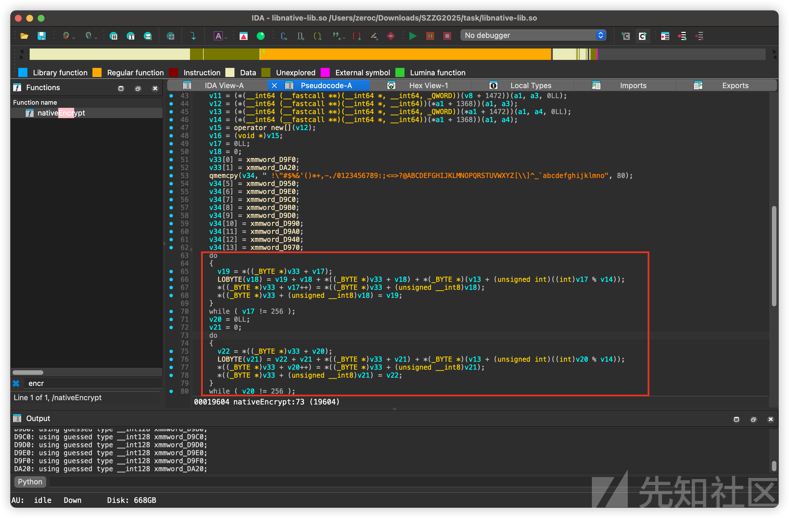

可以看到这个初始化 S 数组的过程进行了两次，并且 j 在计算时也加上了 S[j]，这是 Native 层魔改的部分。

Java 层的加密实际上是魔改的 Chacha20，但是这个以及一些混淆的手段比较好解决，直接 Copy 代码运行即可，最后进行解密的脚本如下：

```
package com.example;

import java.nio.charset.Charset;
import java.nio.charset.StandardCharsets;
import java.nio.file.Files;
import java.nio.file.Paths;
import java.security.MessageDigest;
import java.util.Arrays;

public class test {
    public static class RC4 {
        private int[] state;
        private int x;
        private int y;

        public RC4(byte[] key) {
            this.state = new int[256];
            for (int i = 0; i < 256; i++) {
                this.state[i] = i;
            }
            for (int k = 0; k < 2; k++) {
                int j = 0;
                for (int i2 = 0; i2 < 256; i2++) {
                    j = (j + this.state[i2] + this.state[j] + key[i2 % key.length]) % 256;
                    swap(i2, j);
                }
            }
            this.x = 0;
            this.y = 0;
        }

        private void swap(int i, int j) {
            int temp = this.state[i];
            this.state[i] = this.state[j];
            this.state[j] = temp;
        }

        public byte[] encrypt(byte[] data) {
            byte[] output = new byte[data.length];
            for (int i = 0; i < data.length; i++) {
                this.x = (this.x + 1) % 256;
                this.y = (this.y + this.state[this.x]) % 256;
                swap(this.x, this.y);
                int k = this.state[(this.state[this.x] + this.state[this.y]) % 256];
                output[i] = (byte) (data[i] ^ k);
            }
            return output;
        }
    }

    public static int I(byte[] bArr, int i3) {
        return ((bArr[i3 + 3] & 255) << 24) | (bArr[i3] & 255) | ((bArr[i3 + 1] & 255) << 8) | ((bArr[i3 + 2] & 255) << 16);
    }

    public static void A(int i3, int i4, int i5, int i6, int[] iArr) {
        int i7 = iArr[i3] + iArr[i4];
        iArr[i3] = i7;
        int i8 = i7 ^ iArr[i6];
        int i9 = (i8 >>> 16) | (i8 << 16);
        iArr[i6] = i9;
        int i10 = iArr[i5] + i9;
        iArr[i5] = i10;
        int i11 = iArr[i4] ^ i10;
        int i12 = (i11 >>> 20) | (i11 << 12);
        iArr[i4] = i12;
        int i13 = iArr[i3] + i12;
        iArr[i3] = i13;
        int i14 = iArr[i6] ^ i13;
        int i15 = (i14 >>> 24) | (i14 << 8);
        iArr[i6] = i15;
        int i16 = iArr[i5] + i15;
        iArr[i5] = i16;
        int i17 = iArr[i4] ^ i16;
        iArr[i4] = (i17 >>> 25) | (i17 << 7);
    }

    public static byte[] n(byte[] bArr, byte[] bArr2, byte[] bArr3) {
        int i3;
        byte[] bArr4 = new byte[bArr3.length];
        int[] iArr = new int[16];
        iArr[0] = 1634760805;
        iArr[1] = 857760878;
        int i4 = 2;
        iArr[2] = 2036477234;
        iArr[3] = 1797285236;
        int i5 = 0;
        while (true) {
            i3 = 8;
            if (i5 >= 8) {
                break;
            }
            iArr[i5 + 4] = I(bArr, i5 * 4);
            i5++;
        }
        iArr[12] = 0;
        iArr[13] = I(bArr2, 0);
        int i6 = 4;
        int i7 = 14;
        iArr[14] = I(bArr2, 4);
        iArr[15] = I(bArr2, 8);
        int[] copyOf = Arrays.copyOf(iArr, 16);
        int[] copyOf2 = Arrays.copyOf(copyOf, 16);
        int i8 = 0;
        while (i8 < 20) {
            A(0, i6, i3, 12, copyOf2);
            A(1, 5, 9, 13, copyOf2);
            A(i4, 6, 10, i7, copyOf2);
            A(3, 7, 11, 15, copyOf2);
            A(0, 5, 10, 15, copyOf2);
            A(1, 6, 11, 12, copyOf2);
            A(2, 7, 8, 13, copyOf2);
            A(3, 4, 9, 14, copyOf2);
            i8 += 2;
            i6 = 4;
            i7 = 14;
            i3 = 8;
            i4 = 2;
        }
        for (int i9 = 0; i9 < 16; i9++) {
            copyOf2[i9] = copyOf2[i9] + copyOf[i9];
        }
        System.arraycopy(copyOf2, 0, copyOf, 0, 16);
        for (int i10 = 0; i10 < bArr3.length; i10++) {
            int i11 = i10 % 4;
            bArr4[i10] = (byte) (bArr3[i10] ^ ((copyOf[i11] >>> (i11 * 8)) & 255));
        }
        return bArr4;
    }

    public static void main(String[] args) throws Exception {
        String content = Files.readString(Paths.get("enc"));
        String[] array = content.substring(1, content.length() - 1).split(",");
        byte[] enc = new byte[array.length];
        for (int i = 0; i < array.length; i++) {
            enc[i] = (byte) Integer.parseInt(array[i].trim());
        }

        MessageDigest messageDigest = MessageDigest.getInstance("MD5");
        messageDigest.update("The king of heaven covers the earth tiger".getBytes());
        byte[] digest = messageDigest.digest();
        StringBuilder sb = new StringBuilder();
        for (byte b : digest) {
            sb.append(Character.forDigit((b & 255) >> 4, 16));
            sb.append(Character.forDigit(b & 15, 16));
        }
        String sb2 = sb.toString();
        Charset charset = StandardCharsets.UTF_8;
        final byte[] bytes = sb2.getBytes(charset);
        byte[] bytes2 = "As_if_the_vernal_breeze_had_come_back_overnight".getBytes(charset);
        StringBuilder sb3 = new StringBuilder();
        int i3 = 0;
        for (int i4 = 0; i4 < bytes2.length; i4 += 3) {
            int i5 = i4 + 1;
            int i6 = i4 + 2;
            int i7 = ((bytes2[i4] & 255) << 16) | (i5 < bytes2.length ? (bytes2[i5] & 255) << 8 : 0) | (i6 < bytes2.length ? bytes2[i6] & 255 : 0);
            if (i5 >= bytes2.length) {
                i3 = 2;
            } else if (i6 >= bytes2.length) {
                i3 = 1;
            }
            for (int i8 = 0; i8 < 4 - i3; i8++) {
                sb3.append("AB2DEF6HIJKLmNOPQRsTUVwXYZabcdefg9ijklMnopqrStuvWxyz01C345G78h+/".charAt((i7 >> (18 - (i8 * 6))) & 63));
            }
        }
        while (true) {
            int i9 = i3 - 1;
            if (i3 <= 0) {
                break;
            }
            sb3.append('=');
            i3 = i9;
        }
        String sb4 = sb3.toString();
        String substring = sb4.substring(0, Math.min(sb4.length(), 6));
        Charset charset2 = StandardCharsets.UTF_8;
        final byte[] bytes3 = substring.getBytes(charset2);
        final byte[] bytes4 = "5paaser2oe41".getBytes(charset2);

        RC4 rc4 = new RC4(bytes3);
        byte[] tmp = rc4.encrypt(enc);
        byte[] dec = n(bytes, bytes4, tmp);
        Files.write(Paths.get("dec"), dec);
    }
}
```

解密后得到的是一个 png：


## SignalScope

MainActivity 启动了一个 HttpServer：

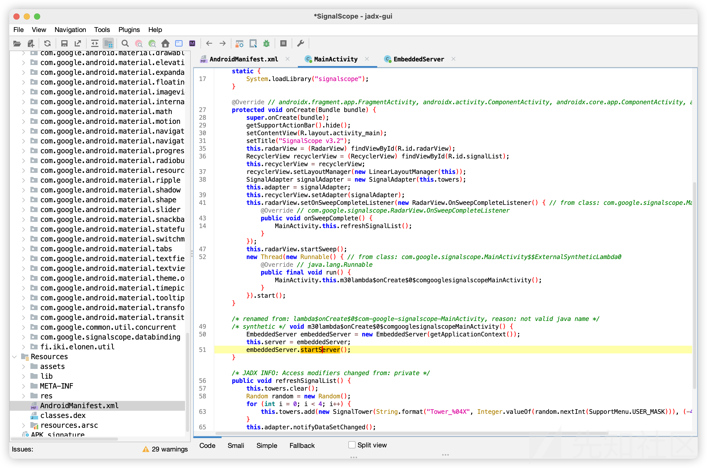

其处理逻辑如下：

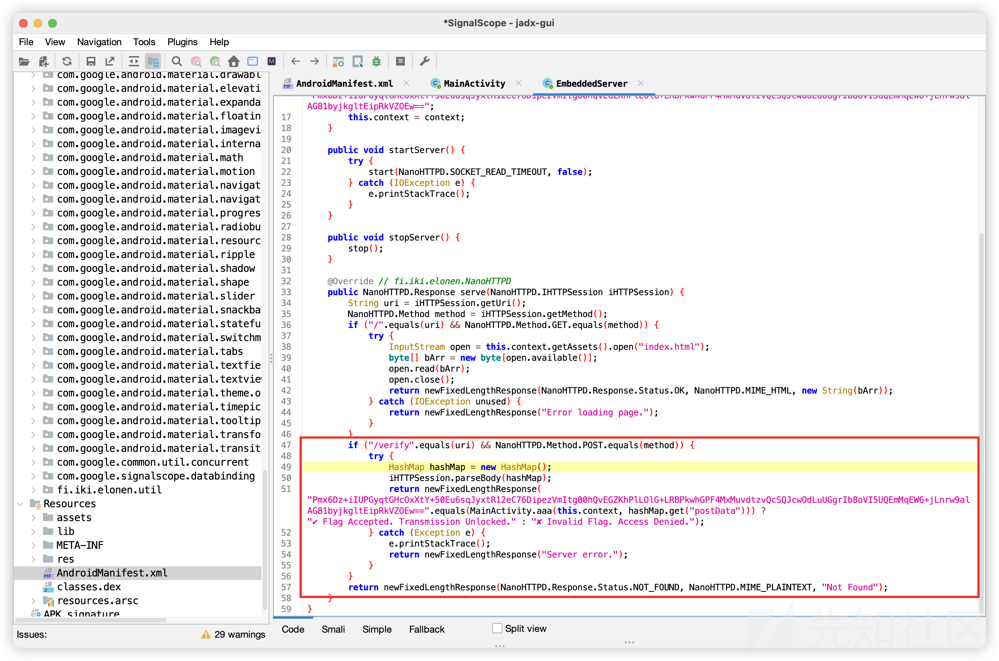

调用 Native 的 `aaa` 方法对 post 数据进行加密后对比，主要逻辑在 Native 层中，Native 层用了一堆 openssl 的接口，整的很复杂，通过动调和一些常量的识别大致还原了过程。

首先会在 Native 层调用 `com.google.signalscope.SignalRadar` 的 `a` 方法：

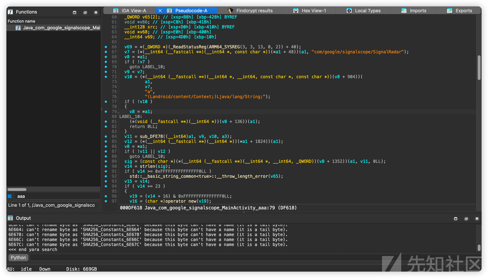

在 Java 层看其实就是获取 APK 的签名：

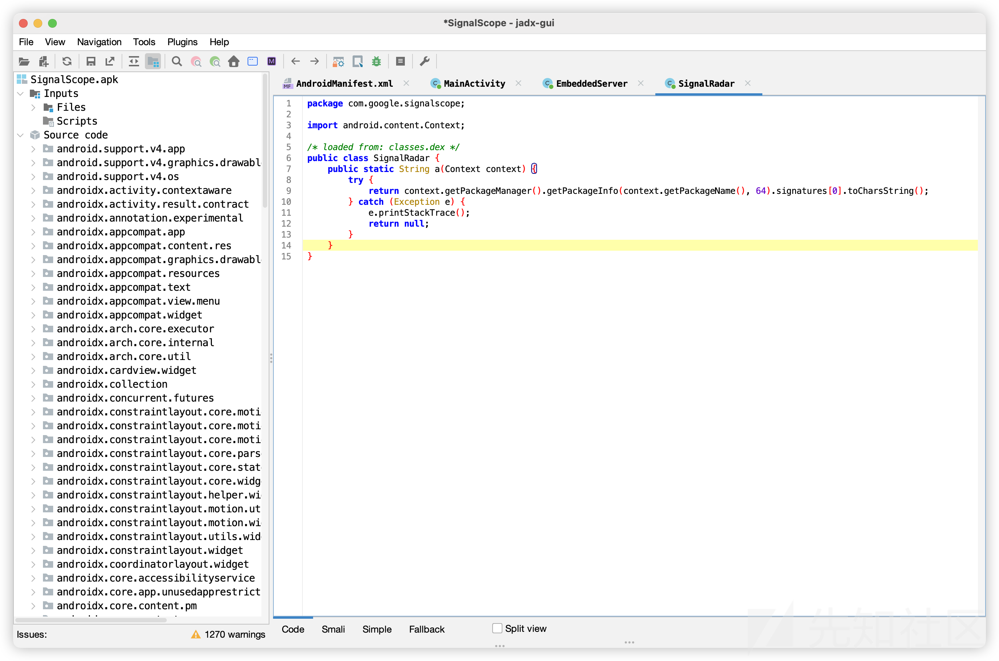

然后会对签名值分别进行两次 sha256 和 sha1 操作，并将其作为参数传入到 `bn_prime.c` 的接口中循环累加并判断是否为素数：

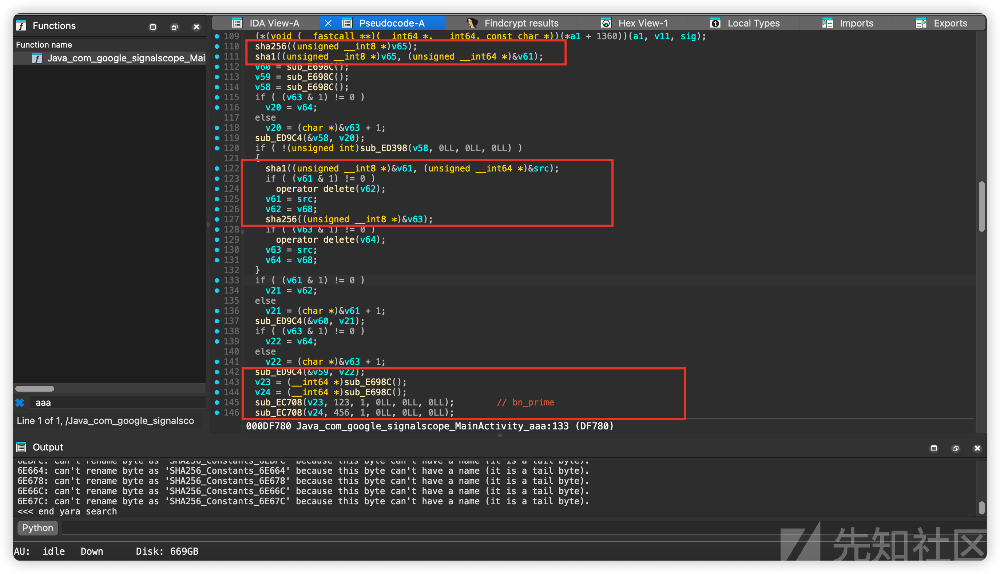

其实上面看到素数相关的东西并且有两个数很容易想到 RSA，后面确实在做相关涉及到 bn\_exp 的操作：

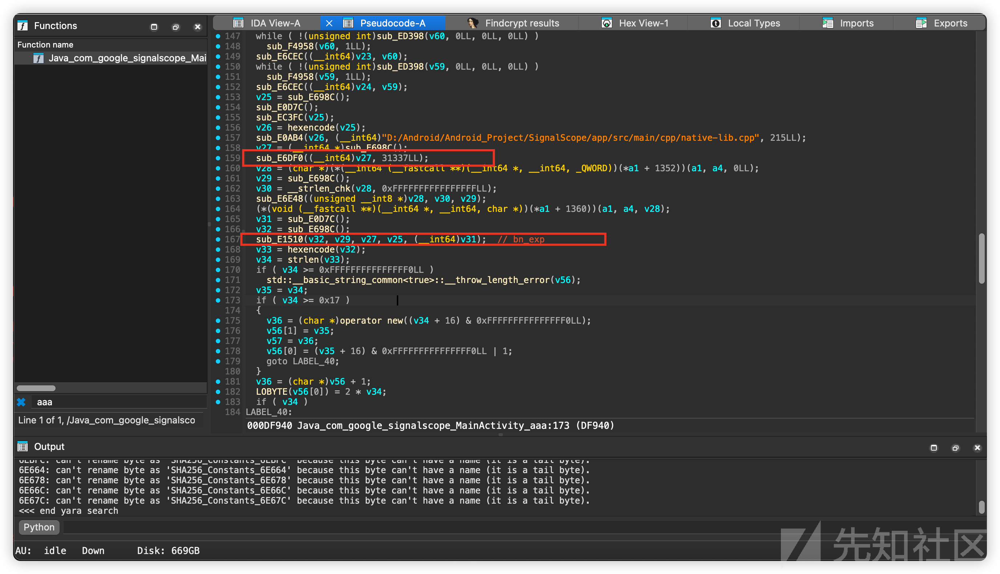

所以前半部分是在做 RSA 的加密操作，p，q 是通过 APK 签名来 sha1 以及 sha256 得到的，后半部分如下：

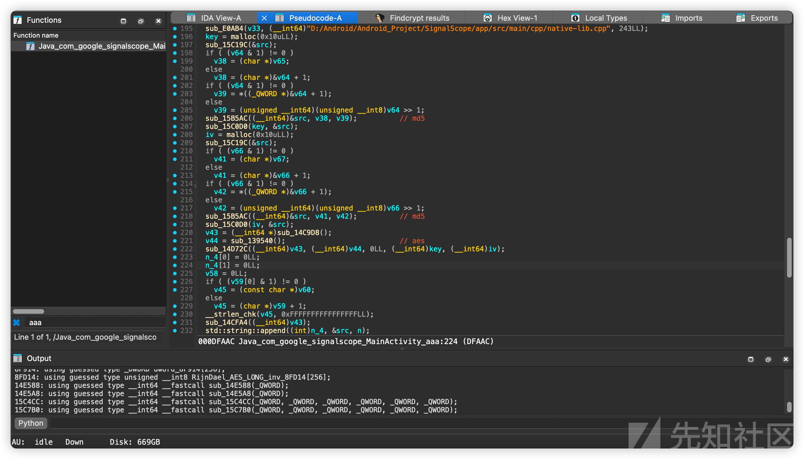

`sub_139540` 函数中比较明显是在获取结构体，看其中的函数指针很容易看出来是 AES 加密，传入的 key 和 iv 是对 p，q 进行 md5 得到的。

根据上述过程可以写出解密脚本：

```
from Crypto.Util.number import *
from Crypto.Util.Padding import unpad
from Crypto.Cipher import AES
from hashlib import sha1, sha256, md5
import base64

sig = b"3082029030820178020101300d06092a864886f70d01010b0500300e310c300a06035504030c034b6579301e170d3234303533313036333035345a170d3439303532353036333035345a300e310c300a06035504030c034b657930820122300d06092a864886f70d01010105000382010f003082010a0282010100b4606d091c037ac785b67f23db2570e3a25755b4a8c8cf880838c660a1eaba116a65a389830a5e718b4ae5d2a7cec2fa78a4dee9694c8775287b7353e01d708e4be71a9a342b66a8a0662dcbaac564654d488f3b8ab1bccba79dbe2fd99186f6a04473f5efaaccf692cd50e5257a20b5efaa82730348b6e164694b7370e2e0aa60af2090258dc8a3e8b91b7e318323a27e215daa6cba277caa8c61c1a3d7ffe85688c51ffdc285563ac8550bfd0a5fd8c76e662ddb69742b65e459f0a6c4f2bbdc075908a685cb31aafaa96266733823c1dcbeb16b6e3aae467d38d7ef54ede93d792d519190805a81e432bc9da76f91d2cab2f7236c9c5a5ffaa20e9a4204b10203010001300d06092a864886f70d01010b050003820101009da41163a4d409a2ca4825ebe41bb5dd708a0be93556b8235a20ed73f8d45a3767dcf1bd0131e18219291d3c84c5d504a9fcea829e4043b256ac7dc27149b2a06334e88127a87d06e9146d37356a7e2d8217d327fc26f591884f6724e53d2de7440e25b15af88d4f159cb8dc5241ac934ee15678859b9903a4d872a7a70b718e87fde6d8453d96dd8be6e98698243f3e89ad33c67b2ed184c712141941e8dcf1c0082306d496428811c4df72cebb3facfa8ce0e8ce26de5f517e2722c06179049198bd92b966f7f2868736dfe28c1ec19cbcd4b64f68e09a78bc419ff7a8cfc2a493a44b1ddc7f2dd394913cffeb51dc3108ea4e2453e5ce432f1620f4edd72c"
enc = base64.b64decode("Pmx6Dz+iIUPGyqtGHcOxXtY+50Eu6sqJyxtR12eC76DipezVmItg00hQvEGZKhPlLOlG+LRBPkwhGPF4MxMuvdtzvQcSQJcwOdLuUGgrIb8oVI5UQEmMqEW6+jLnrw9alAG81byjkgltEipRkVZOEw==")

p = sha1(sha1(sig).hexdigest().encode()).hexdigest()
q = sha256(sha256(sig).hexdigest().encode()).hexdigest()

key = md5(p.encode()).digest()
iv = md5(q.encode()).digest()
cipher = AES.new(key, AES.MODE_CBC, iv)
decrypted = unpad(cipher.decrypt(enc), AES.block_size).decode()

p = int(p, 16)
q = int(q, 16)
while not isPrime(p):
    p += 1
while not isPrime(q):
    q += 1
c = int(decrypted, 16)
e = 31337
d = inverse(e, (p - 1) * (q - 1))
m = pow(c, d, p * q)
print(long_to_bytes(m).decode())
# flag{d4691600a5bca6b84683bcce85d9e6be}
```
