# 主动堆栈欺骗-先知社区

> **来源**: https://xz.aliyun.com/news/17850  
> **文章ID**: 17850

---

# 主动堆栈欺骗

关于主动的堆栈欺骗其核心在于，它通过伪造了多个栈帧，来让回溯栈的时候，呈现出这个函数被多次调用的错觉，但是实际上并不是，而是被我们伪造的

## 手动演示

首先无论你伪造哪个函数都可以，核心在于伪造多个栈帧，首先你要找到你要伪造的函数的位置，这个我的是RtlUserThreadStart+21 具体的偏移值每个系统版本都不一样 ，可以看到CE80+0x21 得到的是下面那条jmp指令的地址

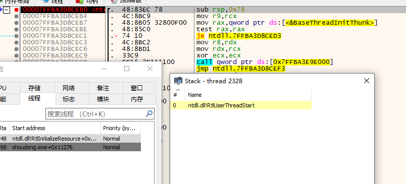

这就是返回地址了，不过就算没有显示+21 其实也能判断出来，这个函数的第一条指令就是sub rsp 0x78 开辟了0x78范围的空间，根据堆栈平衡，下面必然会add rsp,0x78

注意，这里RtlUserThreadStart函数并不是被别的函数显式调用的，它的返回地址不是调用者的下一条指令地址，而是jmp指令的地址，jmp指令会跳转到add那条

然后还需要注意的是x64里面，Rbp寄存器并不是必须的，可以通过Rsp寄存器来找到变量的，具体原理可以看我前两篇文章

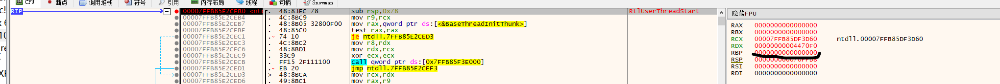

然后可以我们找到当前的rsp的地址，0x78个字节就是移动15次 然后还要加上8个字节的返回地址，也就是总共移动16次

这里可以向上移，也可以向下移，向上移就需要把Rsp的地址改成最上面的那个返回地址，这是因为根据栈的特性，调用函数必然会在栈的低地址，被调用者在栈的高地址，所以你需要把Rsp修改在最上面的那个返回地址，如果你是向下移动的则无需修改Rsp

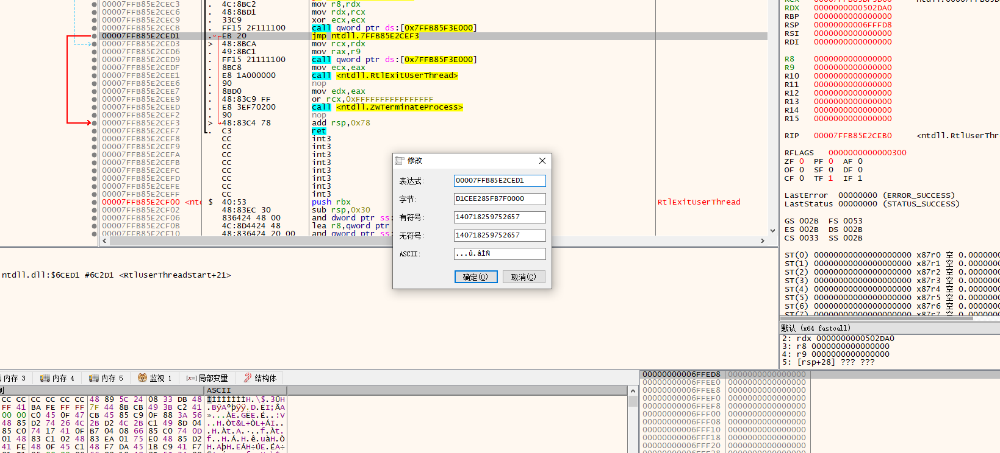

最后用Process Hacker查看栈就会是这样的效果

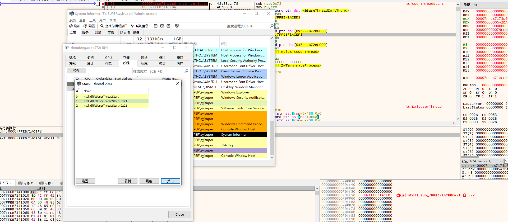

然后我们来分析一个项目

## LoudSunRun

首先拿到printf的函数地址

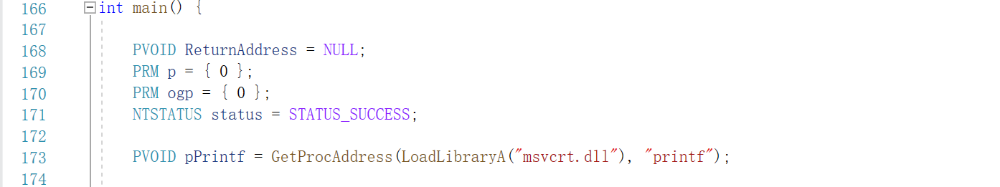

然后它通过FindGadget来比较kernel32的地址有没有是jmp [rbx]开头的指令，`\xFF\x23`机器码对应的就是`jmp [rbx]`

这个的作用是为了跳板做准备，可以看到 p.trampoline存储了这个地址

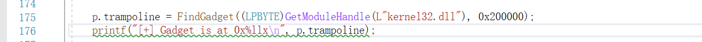

然后这里他还拿到了BaseThreadInitThunk和RtlUserThreadStart的地址包括它们的偏移，也就是我们要伪造的栈帧的函数地址，这个偏移的值每个系统版本不一致，比如我这里就跟原作者一样，但是你自己的电脑不一定是这样

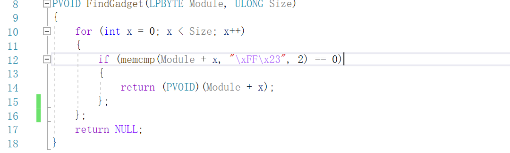

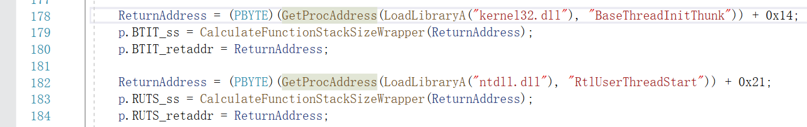

然后这里有个函数为`CalculateFunctionStackSizeWrapper`,这个函数主要是通过`.pdata段`的PRUNTIME\_FUNCTION和 UNWIND\_INFO来解析反汇编信息，以此来获取栈的大小

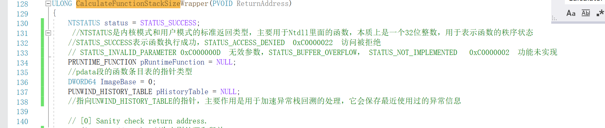

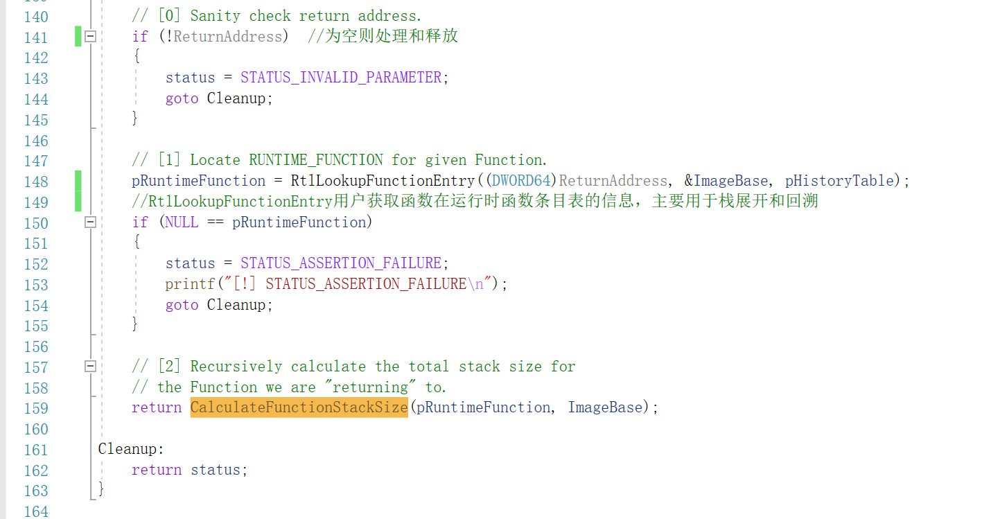

然后这中间有一个UNWIND\_HISTORY\_TABLE结构体，它的作用就是会保存已经使用过的异常信息，用来加速处理栈回溯异常，结构如下:

```
#define UNWIND_HISTORY_TABLE_SIZE 12

typedef struct _UNWIND_HISTORY_TABLE_ENTRY {  //用于处理单个
    DWORD64 ImageBase;  // 可执行文件/模块的基地址
    PRUNTIME_FUNCTION FunctionEntry;  // 指向该模块的 RUNTIME_FUNCTION 结构
} UNWIND_HISTORY_TABLE_ENTRY, *PUNWIND_HISTORY_TABLE_ENTRY;

typedef struct _UNWIND_HISTORY_TABLE {   //处理多个
    DWORD Count;  // 当前缓存的函数数量（最多 12）
    UCHAR  LocalHint;  // 最近使用的条目索引
    UCHAR  GlobalHint; // 最近的全局索引
    BOOLEAN Search;  // 是否启用搜索
    BOOLEAN Once;  // 是否已初始化
    DWORD64 LowAddress;  // 缓存函数的最低地址
    DWORD64 HighAddress;  // 缓存函数的最高地址
    UNWIND_HISTORY_TABLE_ENTRY Entry[UNWIND_HISTORY_TABLE_SIZE];  // 存储最多 12 个最近访问的函数
} UNWIND_HISTORY_TABLE, *PUNWIND_HISTORY_TABLE;

```

这里还用到了一个CalculateFunctionStackSize函数，但是解释放在文章里面的话就太长了，就讲一下大概逻辑，详细的解释我会新开一篇文章

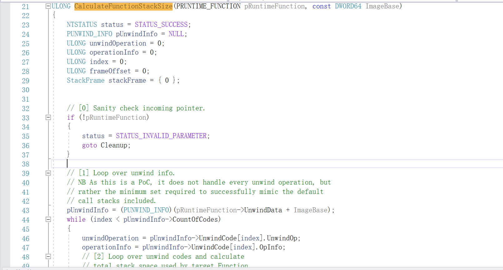

**逻辑流程**

* **[0] 检查** `pRuntimeFunction` **是否为空**，如果为空，则返回 `STATUS_INVALID_PARAMETER`。
* **[1] 解析** `UnwindData` **信息**，从 `pRuntimeFunction->UnwindData + ImageBase` 获取 `PUNWIND_INFO`，然后遍历其中的 `UnwindCode` 。
* **[2] 计算总堆栈大小**

* 处理 `UWOP_PUSH_NONVOL`、`UWOP_ALLOC_SMALL`、`UWOP_ALLOC_LARGE` 等操作码，累加堆栈大小。
* 记录 `UWOP_SET_FPREG` 以判断 `RBP` 是否被设置为帧指针。
* 如果 `UNW_FLAG_CHAININFO` 置位，说明当前函数有级联的 `RUNTIME_FUNCTION`，需要递归处理。

* **[3] 返回总堆栈大小**，包括返回地址 `8` 字节。

然后接下来，Spoof作为外部.asm提供的函数，它正常来讲是接收七个参数，但是也可以接收多参数，前四个参数是经过Spoof调用的真正的函数的参数，第五个参数是一个结构体，第六个参数则是我们真正要调用的函数，第七个参数则是用来判断是不是还需要别的参数，值为几，就表示有几个额外参数，则Spoof会想办法拿到后续的参数

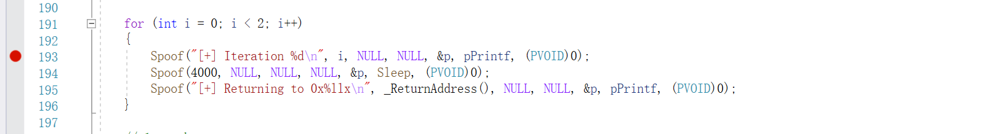

结构体指针如下，这个结构体的主要作用就是保存上下文的环境，以及用于伪造栈帧所需要的数据和系统调用

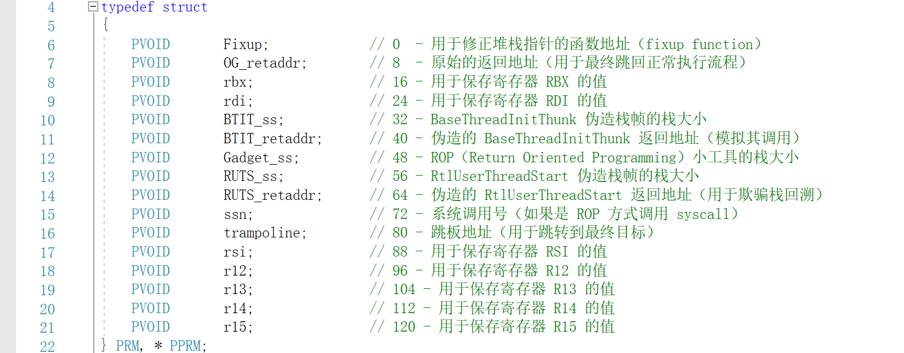

现在进入到Spoof函数里面

然后这里话，有必要说明一下关于64位下的传参，首先前四个参数通过rcx,rdx,r8,r9传参，其余的参数走栈上传参，但是操作系统会预留0x20的字节作为影子空间，这是留给那四个走寄存器传参的参数的

正常情况的时候汇编应该如下

```
rsp + 0x00  →  返回地址
rsp + 0x08  →  shadow space for RCX
rsp + 0x10  →  shadow space for RDX
rsp + 0x18  →  shadow space for R8
rsp + 0x20  →  shadow space for R9
rsp + 0x28  →  参数5（&p）
rsp + 0x30  →  参数6（pPrintf）
rsp + 0x38  →  参数7（(PVOID)0）
```

但是这里呢，它首先就pop rax 了 也就是说会把rsp当前地址的值传给rax，然后rsp+8，这个时候第五个参数的位置自然而然就变成了 rsp+32了其实就是rsp+0x20 只是进制的不同写法(我靠，我愣了好久才反应过来)

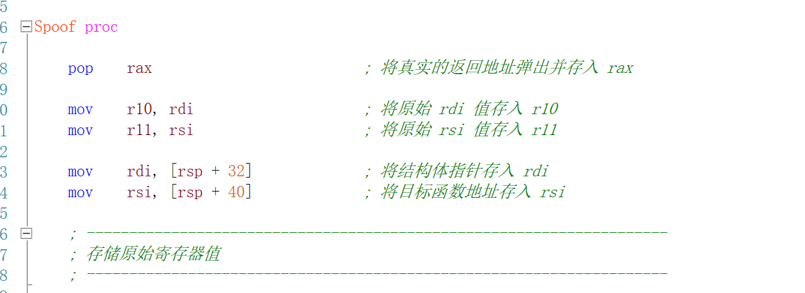

所以这里干的事情如下:1、把返回地址保存到rax，2、读取到了结构体的地址给rdi，3、把真正要调用的函数地址给到了rsi

这里就是保存了原始栈的数据，和把返回地址给到了r12寄存器，因为r12寄存器在windowsx64下是非易失性寄存器，顾名思义就是，调用函数会保存这个寄存器的值，才给被调用者使用，易失性寄存器就是调用者不关心寄存器的值在被调用后是否跟调用前一致

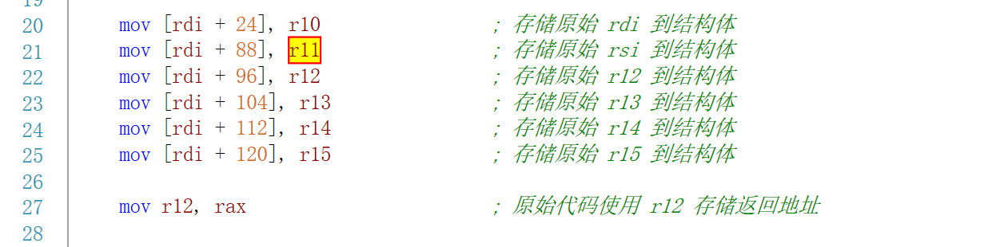

这里的作用是用来多参数判断的，但是这里传入的是printf函数，并没有接收额外的参数，所以无需管

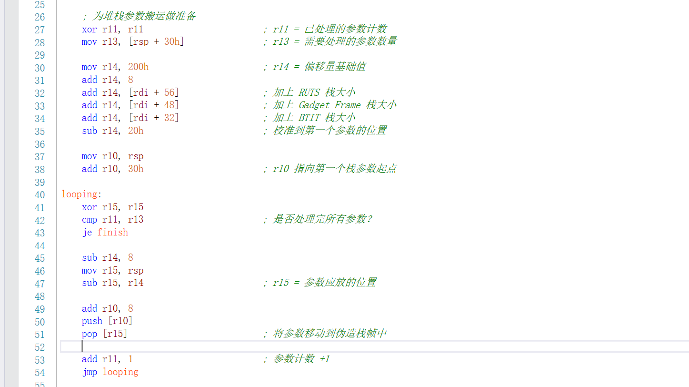

然后接着往下看，他分配了一个200字节的空间，然后用push 0 截断了真实的返回地址,原理就是之前讲过的，他是通过回溯返回地址来得到完整的调用链的。

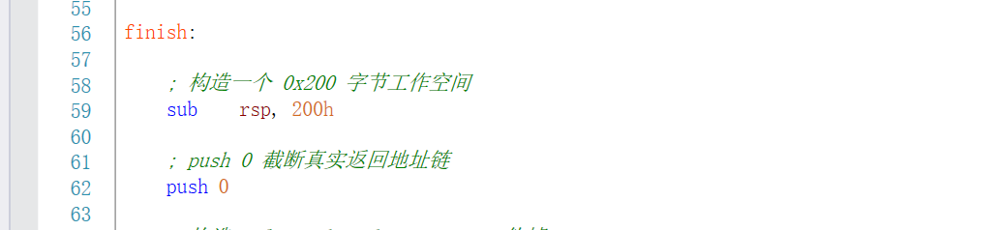

然后这里就是手动操作的那一部分，通过分配假的栈空间，然后写上返回地址,同时要注意这里它把跳板也作为返回地址给写上去了

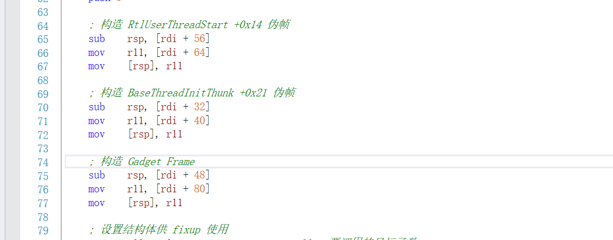

然后来到了,保存了真正要调用的函数地址以及真实的返回地址和rbx的值，然后把fixup的地址给到了那个结构体的第一个参的位置，然后又把fixup的值给到了rbx，然后jmp 11 执行printf去了

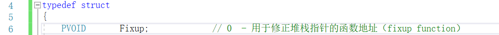

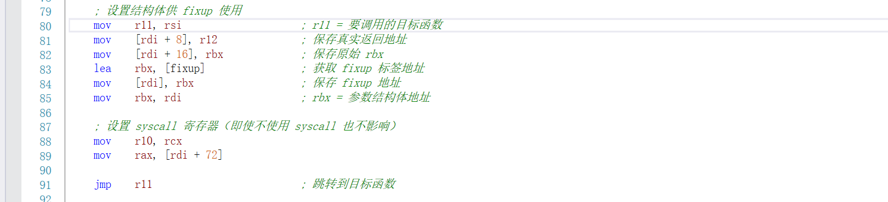

然后最后在执行完printf之后，它会执行jmp rbx，肯定会有疑问，为什么执行完printf之后会执行jmp rbx对不对？

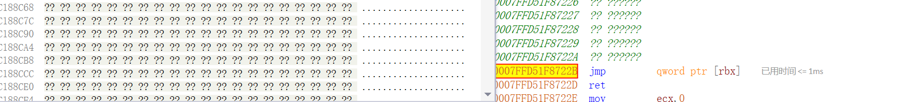

再回到我们上面所讲的，伪造栈空间的那一块代码，无论你记的是内存地址是从高往低增长还是从低往高增长，都一定是RtlUserThreadStart最先伪造，Gadget Frame构造的最晚，所以Gadget Frame也是释放的最快的，这里它把rdi+80也就是跳板的值，也就是jmp rbx这条指令的地址 压到了Gadget Frame的rsp地址，虽然说printf并不是Gadget Frame调用的，但是当printf执行完之后，依然会回到Gadget Frame栈顶的位置

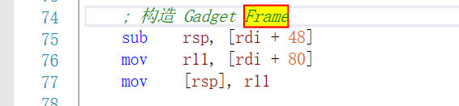

这里有必要讲解一下，函数的调用流程，正常函数调用应该是这样，当你call一个函数的时候，会把下一条指令的地址压入栈中，当执行完之后就会ret 这个地址，跳回到原调用点，

```
call printf  → 会将返回地址压栈
↓
printf 执行
↓
ret          → 从栈顶弹出返回地址，跳回原调用点
```

但是这里却是使用的jmp， 按理来讲 jmp是不会压入下一条指令的地址，所以也不应该执行完printf之后，回来继续执行 jmp rbx，但是这里却依旧回来了。

```
jmp r11      ; r11 = printf
```

这是因为我们手动提前压入返回地址了，push的本质就是两条指令合在一起

```
sub rsp, 8
mov [rsp], r11
```

当我们分配完了Gadget Frame的空间，jmp rbx的地址，写在Gadget Frame的rsp的位置(注意不是rsp变成了jmp rbx的值，而是rsp所表示的地址里面存储的值是jmp rbx的地址)，然后这个时候我们去执行printf，它又会自己分配空间，因为堆栈平衡缘故，到ret指令的时候会刚好停留在 Gadget Frame的rsp的位置，因为我们提前把值给写进去了，所以这个时候就会执行jmp rbx这条指令了

记住此时r11的值，这就是jpm rbx的地址，然后还有此时rsp的值

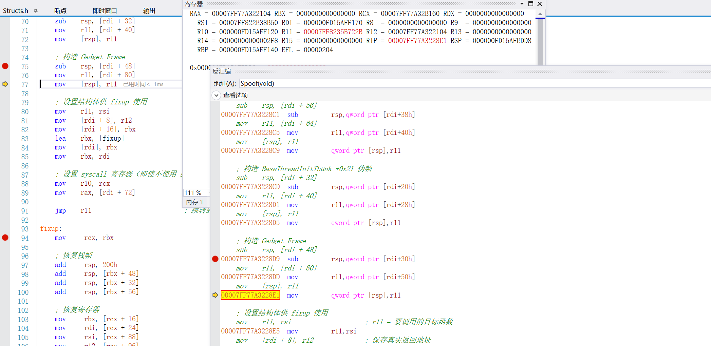

执行完printf之后，来到了内部ret指令的位置，可以看到rsp的值跟上面图是一致的，而且jmp rbx的地址和r11也是一致的

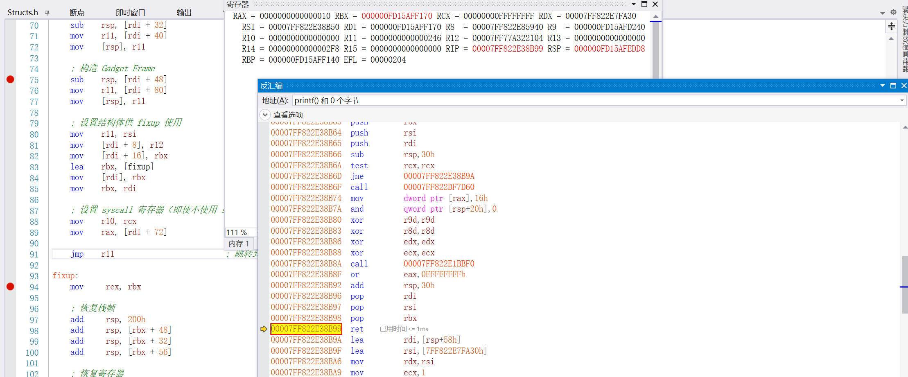

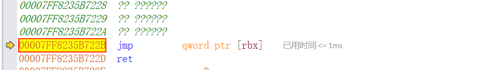

然后fixup就是用来恢复各种数据的啦

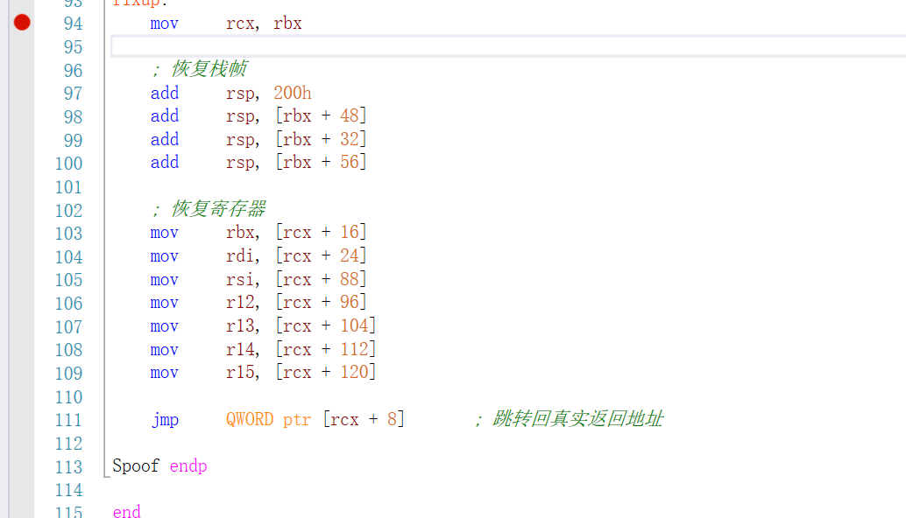

### 多参数

然后来看多参数的传参


首先r11是用来记处理了多少个参数的，然后这里把0x30，也就是第七个参数的位置给存到了r13，通过这样我们后续就可以通过+0x8来找到剩下的参数

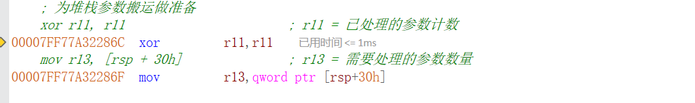

然后这里，它是通过r14寄存器来存储总共需要的栈，0x200对应下面开辟的空间，0x8对应下面的push 0 然后加上三个函数的栈空间，然后减去0x20的影子空间，然后这里可以看到r10现在的值是rsp+0x30的值，也就是第七个参数的位置

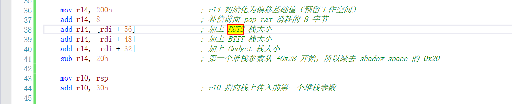

然后这里首先通过用 rsp-r14的值来得到多余的参数，要移动到哪里，然后通过给rsp+8的位置来得到第八个参数的位置，然后用push把rsp的值所表示的地址里面的值给压入栈，然后又通过pop 就把值给到r15的地址了

注意 这种写法本身在x64dbg里面是不符合语法规范的，可以写在.asm文件的原因是汇编器（如 MASM、NASM、YASM）有些**对非法指令或伪指令做了“语法容错”或“自动翻译”**，比如：

```
push [r10]
pop [r15]
```

会翻译成如下

```
mov rax, [r10]
push rax
; 或者
pop rax
mov [r15], rax
```

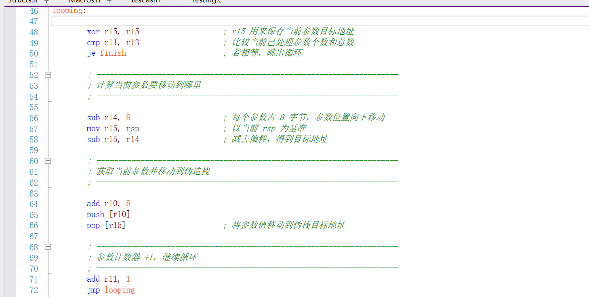

### syscall

然后这份代码还可以使用syscall，这里的syscall地址是作者直接传进去的PBYTE)pNtAllocateVirtualMemory + 0x12

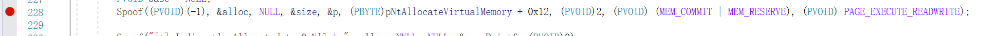

所以你可以在这里看到

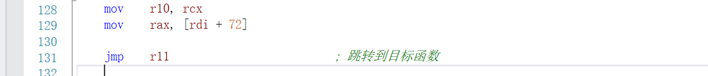

这里是在模拟调用内核函数之前的准备工作啦

```
mov    r10, rcx        ; syscall 机制要求 R10 = RCX
mov    rax, [rdi + 72] ; 设置 syscall number（即系统调用号）
jmp    r11             ; 跳转到包含 syscall 指令的 gadget
```

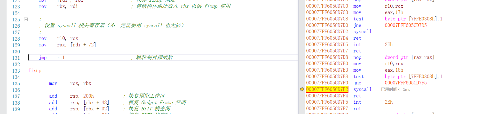
