# 物联网相关协议流量分析-先知社区

> **来源**: https://xz.aliyun.com/news/17853  
> **文章ID**: 17853

---

# 物联网相关协议流量分析

# 工控流量分技巧总结

## wireshark使用

### 过滤规则

在工控流量中，很多并没有tcp网络协议流量混乱，针对寻找异常的数据，我们就可以对大量出现的正常数据流进行过滤，然后针对剩下的数据的id进行追踪就可以找到答案

一般就是正常的正则匹配的思路使用过滤的规则（将要匹配的拖到窗口穿着匹配规则即可），亦可以将提取的大量数据包进行导出，再进行分析

### 追踪流

右键单击感兴趣的包，选择追踪流，可以进行追踪流量（但是主要针对TCP），工控使用较少

## tshark使用

主要用于提取数据，针对二进制数据这种大量的数据提取

### 指令模板

```
tshark -r 1.pcapng -Y "http.request.method == POST" -T fields -e data.data > data.txt
# -r [输入的pcap文件路径]: 指定要分析的pcap文件。
# -Y "http.request.method == POST": 使用一个显示过滤器只显示POST请求。
# -T fields: 输出指定的字段数据。
# -e http.file_data: 输出HTTP负载的数据。
```

### 去除重复行

tshark -r 1.pcapng -Y "dns" -T fields -e dns.qry.name | uniq > data.txt

## 关键词搜索

### flag检索

常见转换：

base64

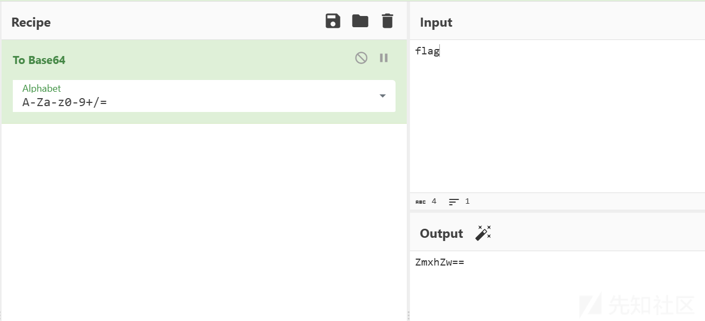

16进制

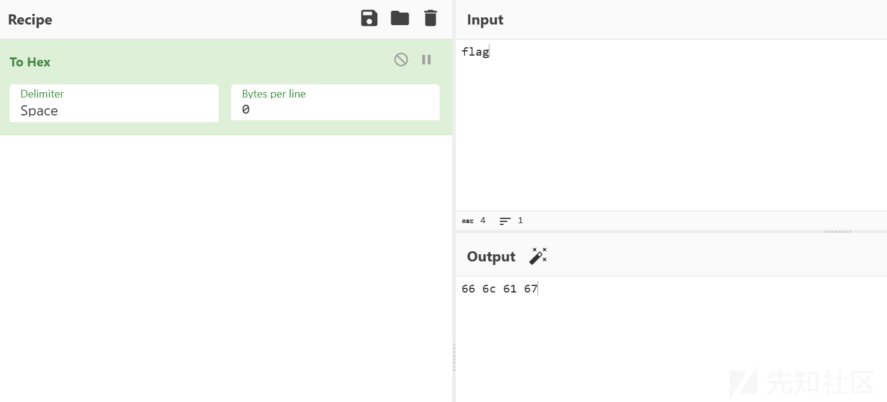

strings检索：

strings | grep flag{

wireshark检索

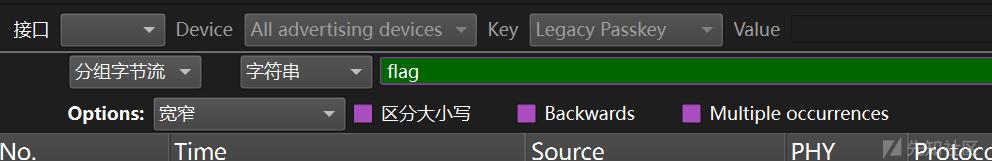

### 协议检索

根据题目的提示，直接先检索对应的协议，简单审计特点或者其他的关键性的东西


## 工控协议总结

### Modbus

三类流量：Modbus/RTU、Modbus/ASCII、Modbus/TCP

#### Modbus/RTU

从机地址1B+功能码1B+数据字段xB+CRC值2B 最大长度256B

#### Modbus/ASCII

用0123456789ABCDEF 表示原本的从机地址、功能码、数据字段

同时添加开始，结束标记

开始标记 (0x3A) + 从机地址 (1B) + 功能码 (2B) + 数据字段 (最大 252B) + LRC 校验值 (2B) + 结束标记 (
\
)

#### Modbus/TCP

最常见的协议，不使用从机地址，使用UnitID

传输标识符2B+协议标识符2B+长度2B+从机ID 1B+功能码1B+数据字段xB

对应功能码的ID进行对照过滤，或者审计

```
1：读线圈 
2：离散输入 
3：读保持 
4：读输入 
5：写单个线圈 
6：写单个保持 
15：写多个线圈 
16：写多个保持
```

### S7comm

基于COTP的上层协议

基于以下的数据帧结合题目信息对报文进行过滤

```
Job (1)：表示下发的任务或指令，通常用于启动某项操作或要求设备执行特定功能

Ack_Data (3)：表示带有返回数据的确认响应，不仅确认任务已接收，还返回执行后的数据

Ack (2)：单纯的确认响应，仅表示接收到指令并处理，但不带有任何额外的数据

Userdata (7)：用户自定义数据区，包含可以自定义的功能指令、控制信息或设备状态数据，用于协议中的扩展功能
```

### MMS

分为四个报文，结构比较简单，基本是一问一答的请求和应答的结构

```
- nitiate-RequestPDU(启动-请求PDU)
- confirmed-RequestPDU(确认-请求PDU）
- initiate-ResponsePDU（启动-应答PDU)
- confirmed-ResponsePDU（确认-应答PDU）
```

服务数据嵌套数据类型结构：

某个字段或元素包含了另一个数据结构，形成嵌套的层级

invokeID是confirmed-ResponsePDU的唯一标识

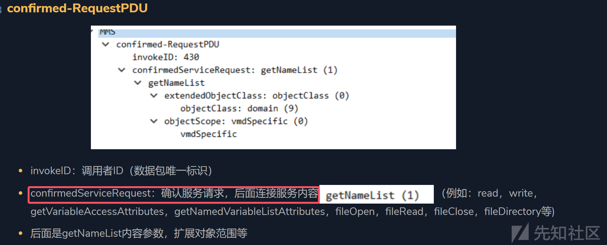

# IEC104协议

## 基本概述

* 一种电力自动化系统中常用的通信协议
* 基于TCP/IP 协议
* 用于监视和控制电力系统中的各种设备（发电机，变电站等）

### client和server

基于TCP/IP所以，也是client/Server 模式

* 受控制站/分站：（TCP Server）

负责和实际的硬件控制，数据采集，命令执行等功能

* 控制站：（TCP Client）

负责远程控制，获取server采集的数据，配置server等

在101协议中，名字不一样

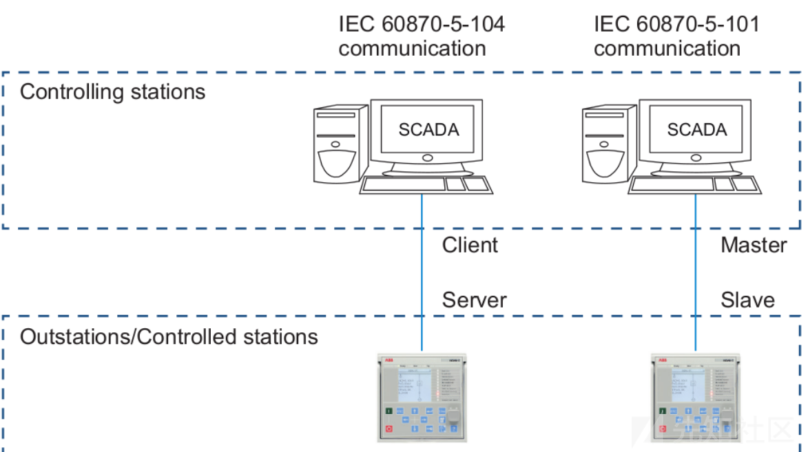

### 链路层传输模式

两种模式：

* 平衡传输模式
* 非平衡传输模式

#### 平衡传输模式

每个client和server都可以启动消息传输

支持的服务类型：

|  |  |
| --- | --- |
| **服务** | **描述** |
| SEND/CONFIRM | 用于发送消息并要求接收方确认收到该消息 |
| SEND/NO REPLY | 这只能由具有多点对点配置中的广播地址的控制站启动，且不会等待接收方的回复 |

#### 非平衡传输模式

* 只有控制站（client）才能启动一次消息传输，受控站（server） 只能响应控制站（client）的请求
* 控制站（client）通过依次轮询 所控制的 受控站（server）来获取对应的业务数据

### 数据对象和编址

IEC104 定义了数据链路层的地址和应用层级的地址

链路地址（COT）：长度可以是 0， 1 ，2 byte 的长度

ASDU地址(通用地址，COA)：站点地址，区分位于那个站点

### 基础功能

#### 数据采集

在IEC 104协议的平衡传输模式下，受控站（Server）不仅回应控制站（Client）的请求，还能主动上报数据变更或周期性数据，且能响应控制命令和读请求

#### 询问操作

总询问：

请求受控站（Server）发送所有群组的所有数据对象的最新值→控制站（Client）获得受控站中所有最新状态的数据

群组询问：

受控站（Server）中的数据对象可以通过配置COT（Cause of Transmission）值为20到36来指定召唤群组

* COT值20代表总召唤
* COT值21到36分别代表INRO1到INRO16（16个不同的召唤群组）

#### 时钟同步

受控站（Server）和 控制站（client)保证时钟同步

```
系统初始化后，控制站（client)应该应当发送一次时钟同步指令
→
周期性地重新同步时钟，发送时钟同步命令（C_CS ACT）
```

#### 命令传输

控制站（client) 用来改变受控站（Server）操作设备的状态的API

##### 直控命令（Single command）

去掉选控命令，直接发执行命令（一般来说保护压板，保护复归为直控）

一般流程如下:

主站下发执行命令→装置回执行确认报文

##### 选控命令（Select and execute）

分为两个阶段执行

* Select 阶段：控制站发送一个该命令的Select的操作，受控站检查该命令正确性，是否正确执行），结论返回给控制站
* execute阶段：如果 Select阶段返回的是预期的确认，表示命令有效并且可以执行，控制站发送Execute命令，开始执行该操作（例如，打开或关闭某个开关，设置某个参数等）

#### 累计量传输

##### 两种获取累计值的方式

1. Freeze-and-Read（冻结并读取）：

对累计量进行采集，并将当前的累计值冻

2. Clear-and-Read（清零并读取）：

获取增量信息，即读取当前计数值并将其清零，然后开始重新计数

## IEC104协议帧

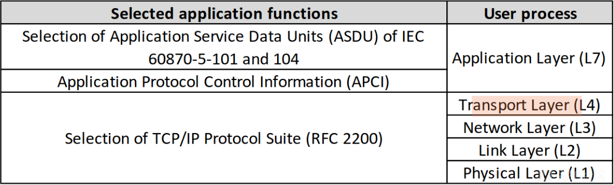

帧结构为 APDU（一般由 APCI 和 ASDU组成）

### APDU

应用协议数据单元→IEC104官方协议帧

```
APDU = APCI 
or
APDU = APCI + ASDU
```

### APCI

应用控制帧型→类似于协议帧头

起始字节0x68（1 byte） + ADPU 的长度（1 byte） +控制位域（CF）（1 byte）× 4

分为两种定长的APDU和可变长度的APDU（也就是是否包含ASDU 部分）

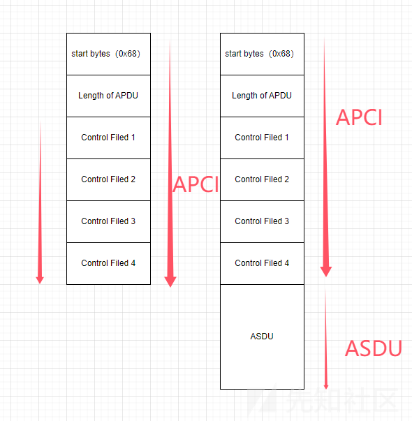

第一个控制位域：（control filed）最少2bit→确认帧的格式

定义三种格式帧：I-FORMAT,S-FORMAT,U-FORMAT

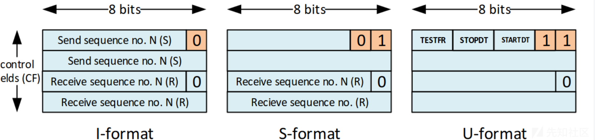

##### I-format

特性：

包含ASDU（携带具体的应用层数据）

利用两个15位的序号报名消息传递方式（发送和接收每个方向一个序号，每次加一，范围：0-0x7FFF）

* 发送端发送一个iFrame（即是一个信息帧），发送序号+1→将iFrame保存到缓冲区→直到接收到对应的接收端发送的包含对应该iFrame序号的APDU，将该iFrame从缓冲区移除
* 接收器接受一个iFrame,接受序号+1→接收端在接收一定数量的 I-frame 或超时未接收到足够的 I-frame 时，会发送 S-frame（ACK）确认已接收的帧；若接收端处于空闲状态且有未确认的 I-frame，也会主动发送 S-frame（ACK）

##### S-format

只有APCI（没有ASDU），只包含一个 15 位的 **接收序号（N(R)）**，用于确认接收到的 I-frame 编号

##### U-format

用于有序的控制功能（APDU 长度固定）

只有一个APCI，没有ASDU

功能：

* TESTFR（测试帧）
* STOPDT（传输停止）
* STARTDT（传输开启）

其中传输的开启和停止可以同时被激活

STARTDT 和 STOPDT 都可以在通信初始化后立即被发送，不是指“同时”执行，只是允许它们按顺序发送

|  |  |  |  |  |  |  |  |  |  |
| --- | --- | --- | --- | --- | --- | --- | --- | --- | --- |
| **U-Frame Function** | **7** | **6** | **5** | **4** | **3** | **2** | **1** | **0** | **Hexa Value** |
| Test Frame Activation | 0 | 1 | 0 | 0 | 0 | 0 | 1 | 1 | 0x43 |
| Test Frame Confirmation | 1 | 0 | 0 | 0 | 0 | 0 | 1 | 1 | 0x83 |
| Stop Data Transfer Activation | 0 | 0 | 0 | 1 | 0 | 0 | 1 | 1 | 0x13 |
| Stop Data Transfer Confirmation | 0 | 0 | 1 | 0 | 0 | 0 | 1 | 1 | 0x23 |
| Start Data Transfer Activation | 0 | 0 | 0 | 0 | 0 | 1 | 1 | 1 | 0x07 |
| Stop Data Transfer Confirmation | 0 | 0 | 0 | 0 | 1 | 0 | 1 | 1 | OxOB |

### ASDU

包含两个部分

* 数据单元识别符（长度固定为6Byte）
* 数据段（一个或者多个信息对象构成）

#### 报文构成

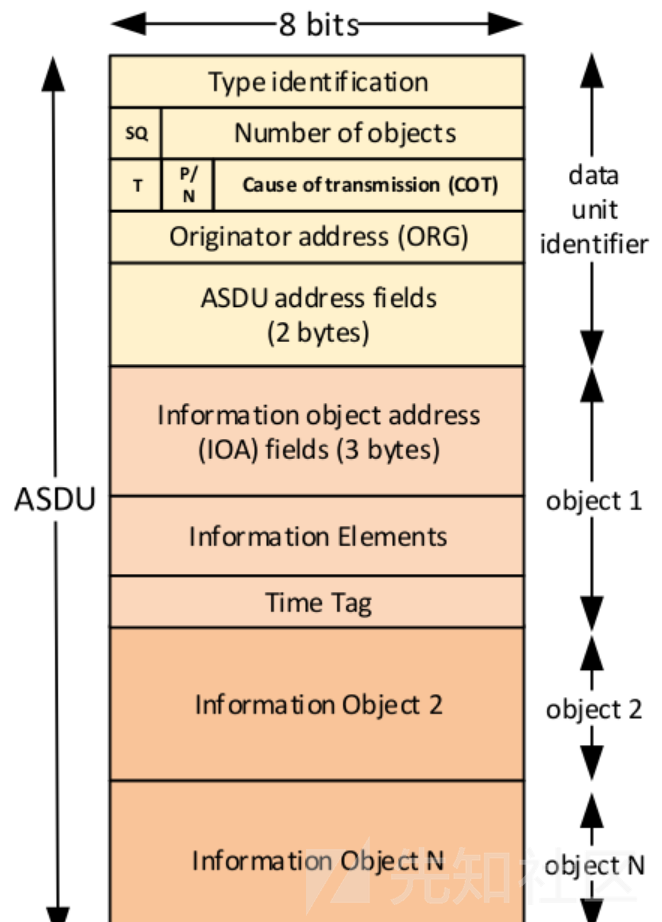

#### 信息对象类型

命名规范

M\_ ：监视方向的信息元素\_Nx：不带时标\_Tx： 带时标\_xA：type A: 有质量描述副的状态或归一化值\_xB：type B: 有质量描述副的标量值\_xC：type C: 有质量描述副的浮点值\_xD：type D: 没有有质量描述副的归一化值

##### 监视方向上的过程信息

|  |  |  |  |  |
| --- | --- | --- | --- | --- |
| **类型标 识** | **描述** | **引用** | **信息对象格式** | **合法的COT** |
| 1 | 单点信息 | M\_SP\_NA\_1 | SIQ | 2,3,5,11,20,20+G |
| 3 | 双点信息 | M\_DP\_NA\_1 | DIQ | 3,5,11,12 |
| 5 | 步位量信息 | M\_ST\_NA\_1 | VTI + QDS | 2,3,5,11,12,20,20+G |
| 7 | 32比特串 | M\_BO\_NA\_1 | BSI + QDS | 2,3,5,11,12,20,20+G |
| 9 | 归一化测量值 | M\_ME\_NA\_1 | NVA + QDS | 2,3,5,11,12,20,20+G |
| 11 | 标量化测量值 | M\_ME\_NB\_1 | SVA + QDS | 2,3,5,11,12,20,20+G |
| 13 | 浮点型测量值 | M\_ME\_NC\_1 | IEEE STD 754 + QDS | 2,3,5,11,12,20,20+G |
| 15 | 累计值 | M\_IT\_NA\_1 | BCR | 2,37,37+G |
| 20 | 带状态检出的成组单点信息 | M\_PS\_NA\_1 | SCD+QDS | 2,3,5,11,12,20,20+G |
| 21 | 不带品质描送的归一化测量值 | M\_ME\_ND\_1 | NVA | 1,2,3,5,11,12,20,20+G |
| 22~29 | 为将来的兼容定义保留 |  |  |  |
| 30 | 带时标CP56Time2a的单点信息 | M\_SP\_TB\_1 | SIQ+ CP56Time2a | 3,5,11,12 |
| 31 | 带时标CP56Time2a的双点信息 | M\_DP\_TB\_1 | DIQ+ CP56Time2a | 3,5,11,12 |
| 32 | 带时标CP56Time2a的步位置信息 | M\_ST\_TB\_1 | VTI + QDS+ CP56Time2a | 2,3,5,11,12 |
| 33 | 带时标CP56Time2a的32比特串 | M\_BO\_TB\_1 | BSI + QDS+CP56Time2a | 3.5 |
| 34 | 带时标CP56Time2a的归一化测量值 | M\_ME\_TD\_1 | NVA + QDS+CP56Time2a | 3.5 |
| 35 | 带时标CP56Tme2a的标量化测量值 | M\_ME\_TE\_1 | SVA + QDS+CP56Time2a | 3.5 |
| 38 | 带时标CP56Time2a的浮点型测量值 | M\_ME\_TF\_1 | IEEE STD 754 + QDS+CP56Time2a | 2,3,5,11,12,20,20+G |
| 37 | 带时标CP56Time2a的累计值 | M\_IT\_TB\_1 | BCR+CP56Time2a | 3,37,37+G |
| 38 | 带时标CP56Tme2a的继电器保护装量事件 | M\_EP\_TD\_1 | QDP+CP16Time2a+CP56Time2a | 3 |
| 39 | 带时标CP56Time2a的继电器保护装量成组启动事件 | M\_EP\_TE\_1 | SEP + QDP+CP16Time2a+CP56Time2a | 3 |
| 40 | 带时标CP56Time2a的继电器保护装量成组输出电路信 息 | M\_EP\_TF\_1 | OCI + QDP+CP16Time2a+CP56Time2a | 3 |

##### 控制方向上的过程信息

|  |  |  |  |  |
| --- | --- | --- | --- | --- |
| **类型标识** | **描述** | **引用** | **信息对象格式** | **合法的COT** |
| 45 | 单命令 | C\_SC\_NA\_1 | SCO | 6,7,8,9,10,44,45,46,47 |
| 46 | 双命令 | C\_DC\_NA\_1 | DCO | 6,7,8,9,10,44,45,46,47 |
| 47 | 步调节命令 | C\_RC\_NA\_1 | RCO | 6,7,8,9,10,44,45,46,47 |
| 48 | 设点命令，归一化值 | C\_SE\_NA\_1 | NVA + QOS | 6,7,8,9,10,44,45,46,47 |
| 49 | 设点命令，标量值 | C\_SE\_NB\_1 | SVA+ QOS | 6,7,8,9,10,44,45,46,47 |
| 50 | 设点命令，短浮点值 | C\_SE\_NC\_1 | IEEE STD 754 +QOS | 6,7,8,9,10,44,45,46,47 |
| 51 | 32比特串 | C\_BO\_NA\_1 | BSI | 6,7,8,9,10,44,45,46,47 |
| 52~57 | 为将来的兼容定义保留 |  |  |  |
| 58 | 带时标CP56Time2a的单命令 | C\_SC\_TA\_1 | SCO+CP56Time2a | 6,7,8,9,10,44,45,46,47 |
| 59 | 带时标CP56Time2a的双命令 | C\_DC\_TA\_1 | DCO+CP56Time2a | 6,7,8,9,10,44,45,46,47 |
| 60 | 带时标CP56Time2a的步调节命令 | C\_RC\_TA\_1 | RCO+CP56Time2a | 6,7,8,9,10,44,45,46,47 |
| 61 | 带时标CP56Time2a的设点命令，归一化值 | C\_SE\_TA\_1 | NVA + QOS+CP56Time2a | 6,7,8,9,10,44,45,46,47 |
| 62 | 带时标CP56Time2a的设点命令，标量值 | C\_SE\_TB\_1 | SVA + QOS+CP56Time2a | 6,7,8,9,10,44,45,46,47 |
| 63 | 带时标CP56Time2a的设点命令，短浮点值 | C\_SE\_TC\_1 | IEEE STD 754+QOS+CP56Time2a | 6,7,8,9,10,44,45,46,47 |
| 64 | 带时标CP56Time2a的32比特串 | C\_BO\_TA\_1 | BSI+CP56Time2a | 6,7,8,9,10,44,45,46,47 |
| 65~69 | 为将来的兼容定义保留 |  |  |  |

##### 监视方向上的系统信息

|  |  |  |  |  |
| --- | --- | --- | --- | --- |
| **类型标识** | **描述** | **引用** | **信息对象格式** | **合法的COT** |
| 70 | 初始化结束 | M\_EI\_NA\_1 | COI | 4 |
| 71～99 | 为将来的兼容定义保留 |  |  |  |

##### 控制方向上的系统信息

|  |  |  |  |  |
| --- | --- | --- | --- | --- |
| **类型标识** | **描述** | **引用** | **信息对象格式** | **合法的COT** |
| 100 | 总召唤命令 | C\_IC\_NA\_1 | QOI | 6,7,8,9,10,44,45,46,47 |
| 101 | 电能脉冲召唤命令 | C\_CI\_NA\_1 | QCC | 6,7,8,9,10,44,45,46,47 |
| 102 | 读命令 | C\_RD\_NA\_1 | 无 | 5 |
| 103 | 时钟同步命令 | C\_CS\_NA\_1 | CP56Time2a | 3,6,7,44,45,46,47 |
| 104 | (IEC 101) Test command | C\_TS\_NB\_1 | FBP | 6,7,44,45,46,47 |
| 105 | 复位进程命令 | C\_RP\_NC\_1 | QRP | 6,7,44,45,46,47 |
| 107 | 带时标CP56Time2a的测试命令 | C\_TS\_TA\_1 |  |  |
| 108~109 | 为将来的兼容定义保留 |  |  |  |

##### 控制方向上的参数

|  |  |  |  |  |
| --- | --- | --- | --- | --- |
| **类型标识** | **描述** | **引用** | **信息对象格式** | **合法的COT** |
| 110 | 归一化测量值 | P\_ME\_NA\_1 | NVA + QPM | 6,7,9,10,20,20+G,44,45,46,47 |
| 111 | 标量化测量值 | P\_ME\_NB\_1 | SVA + QPM | 6,7,20,20+G,44,45,46,47 |
| 112 | 浮点测量值 | P\_ME\_NC\_1 | IEEE STD 754 +QPM | 6,7,20,20+G,44,45,46,47 |
| 113 | 参数激活 | P\_AC\_NA\_1 | QPA | 6,7,8,9,44,45,46,47 |
| 114 ~ 119 | 为将来的兼容 定义保留 |  |  |  |
| 参数都是控制方向上的，和监控方向的对象相比，其值发生变化时， 不会上报，只有总召唤时，可以上报给数据的值。 |  |  |  |  |

##### 文件传输

|  |  |  |  |  |
| --- | --- | --- | --- | --- |
| **类型标识** | **描述** | **引用** | **信息对象格式** | **合法的COT** |
| 120 | 文件已准备好 | F\_FR\_NA\_1 | NOF + LOF + FRQ | 13 |
| 121 | 节点已准备好 | F\_SR\_NA\_1 | NOF + NOS + LOF +SRQ | 13 |
| 122 | 召唤目录，选择文件，召唤文件，选择节 | F\_SC\_NA\_1 | NOF + NOS + SCQ | 5,13 |
| 123 | 最后的节，最后的段 | F\_LS\_NA\_1 | NOF + NOS + LSQ +CHS | 13 |
| 124 | 确认文件，确认节 | F\_AF\_NA\_1 | NOF + NOS + AFQ | 13 |
| 125 | 段 | F\_SG\_NA\_1 | NOF + NOS + LOS +segement | 13 |
| 126 | 目录 | F\_DR\_TA\_1 | NOF + LOF + SOF +CP56Time2a | 3,5 |
| 127 | 日至查寻-请求存档文件 | F\_SC\_NB\_1 |  |  |

# MMS协议

## 概述

MMS(Manufacturing Message Specification)报文制造规范

### 应用来源

是运用在IEC61850规范标准站控层和间隔层之间的底层协议

在2015之后，IEC61850标准将其引入电力自动化领域，将其核心ACSI服务直接映射到MMS标准

MMS通过对实际设备进行面向对象建模方法，实现了网络环境下不同制造设备之间的互操作

### 协议基本定义

每个设备中必须存在一组标准对象（standard objects）

* 主要对象：VMD（变量，域，日志，文件等都属于VMD范围内）
* 客户端和服务器站之间有一组用来监视或控制上述对象的一组标准信息
* 一组用于在传输时将信息映射到位和字节的编码规则

### MMS的协议栈

可以依照ISO协议框架类比

|  |  |
| --- | --- |
| **Application** | **Association Control Service Element (ACSE)- ISO 8649/8650** |
| Presentation | Connection Oriented Presentation – ISO 8822/8823 Abstract Syntax Notation (ASN)- ISO 8824/8825 |
| Session | Connection Oriented Session – ISO 8326/8327 |
| Transport | Connection Oriented Transport – ISO 8072/8073 |
| Network | Connectionless network – ISO 8348 |
| Link | MAC – ISO 8802-3 [Ethernet] MAC – ISO 8802-4 [Token Ring] |
| Physical | Ethernet Token Ring |

## COTP协议

COTP（ISO 8073/X.224 COTP Connection-Oriented Transport Protocol→面向连接的传输协议

详见我的笔记<http://www.giraffexiu.love/index.php/2024/11/21/s7comm%e5%8d%8f%e8%ae%ae/>

## MMS协议分析

### 协议分类

* nitiate-RequestPDU(启动-请求PDU)
* confirmed-RequestPDU(确认-请求PDU）
* initiate-ResponsePDU（启动-应答PDU)
* confirmed-ResponsePDU（确认-应答PDU）

### initiate-RequestPDU

根据这个报文进行分析

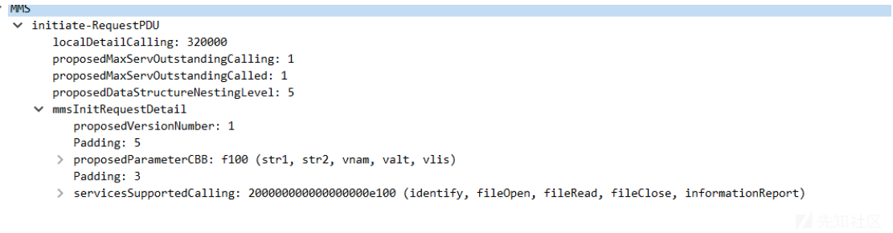

#### 报文构成：

* localDetailingCalling：本地详细呼叫（不固定字节大小，但不小于64位，建议大小为512个8位位组）
* proposedMaxServOutstandingCalling：提出最大服务端呼叫，与confirmed-RequestPDU有关（一起说明）
* proposedMaxServOutstandingCalled：提出最大服务端被呼叫
* propodedDataStructureNestingLevel：预先编码的数据结构嵌套级别
* MMSInitRequestDetail：MMS初始请求详细信息主要，由三部分组成

proposedVersionNumber 建议版本号

proposedParameterCBB 参数集合或配置项

services Supported Calling 支持的服务调用功能

#### 嵌套级别：

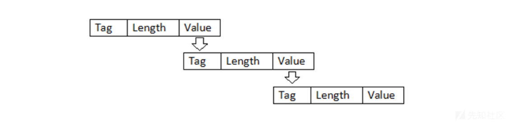

结构类型数据形成分层结构时，从外层开始层层嵌套最后嵌套成最简单的数据类型

### initiate-ResponsePDU

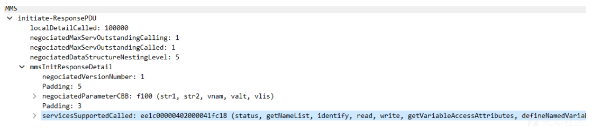

与initiate-RequestPDU结构相似

#### initiate-RequestPDU应答：

* negociatedMaxServoutstandingCalling：议最大服务端呼叫
* negociatedMaxServoutstandingCalling：议最大服务端被呼叫
* negociatedDataStructureNestingLevel：相关的数据结构嵌套级别

因为initiate-ResponsePDU的作用就是对initiate-RequestPDU的内容进行应答，所以可以发现initiate-ResponsePDU的三条数据和initiate-RequestPDU的三条数据内容是相对应的

#### mmsInitResponseDetail：

同样是对前面内容的应答但是内容对应不一致，最后的serviceSupportedCalled存在很多参数→对之前包中内容的回应，传递一个回复服务端呼叫的内容

### confirmed-RequestPDU

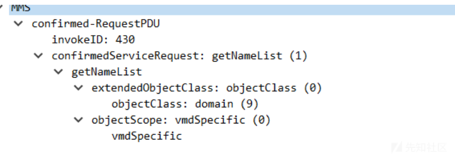

* invokeID：调用者ID（数据包唯一标识）
* confirmedServiceRequest：确认服务请求，后面连接服务内容（例如：read，write，getVariableAccessAttributes，getNamedVariableListAttributes，fileOpen，fileRead，fileClose，fileDirectory等)
* 后面是getNameList内容参数，扩展对象范围等

### confirmed-ResponsePDU

基本对应上面一个提问数据的应答，一问一答

confirmed-RequestPDU->confirmed-ResponsePDU，confirmedServiceRequest->confirmedServerResponse

# Modbus协议

## 1.前言

### **1.协议概述**

为了保证单片机交互的统一性，内容的规范性，保证双方同时遵守，从而实现两者的通信

### **2.串口-RS**

串口实际是一种电平标准（在工控中数据的而传输实际是一种物理的电平信号）

#### **基本信号**

1. **TXD (Transmit Data)**: 发送数据信号
2. **RXD (Receive Data)**: 接收数据信号

#### **控制信号**

|  |  |
| --- | --- |
| **Signal** | **Description** |
| **RTS (Request to Send)** | 请求发送信号，由发送方产生，用于请求发送数据，通常用于硬件流控制 |
| **CTS (Clear to Send)** | 清除发送信号，由接收方产生，指示发送方可以发送数据，通常与RTS信号配对使用 |
| **DSR (Data Set Ready)** | 数据设备就绪信号，由调制解调器或其他数据终端设备产生，指示设备已准备好通信 |
| **DTR (Data Terminal Ready)** | 数据终端就绪信号，由计算机或终端设备产生，指示设备已准备好通信 |
| **DCD (Data Carrier Detect)** | 数据载波检测信号，由调制解调器产生，指示已检测到载波信号，表明可以进行通信 |
| **RI (Ring Indicator)** | 振铃指示信号，由调制解调器产生，指示有来电 |

### **串口通信参数**

#### **波特率 (Baud Rate)**: 数据传输速度，表示每秒钟传输的比特数。常见的波特率有9600、19200、115200等

1. **数据位 (Data Bits)**: 每个字符的数据位数，常见的有7位、8位
2. **停止位 (Stop Bits)**: 每个字符结束时的停止位，通常为1位或2位
3. **奇偶校验 (Parity)**: 一种错误检测机制，分为无校验 (None)、奇校验 (Odd)、偶校验 (Even)

#### **串口通信标准**

#### **1.RS-232:**

最常见的串口通信标准，使用单端信号传输，传输距离较短

* 全双工
* 逻辑1：-15V–5V
* 逻辑0：+3V–+15V

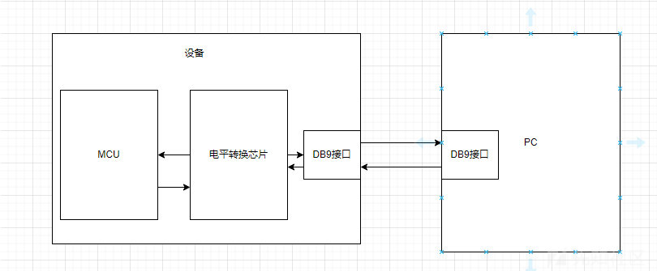

#### **2.RS-485:**

使用差分信号传输，抗干扰能力强，传输距离较长，支持多点通信

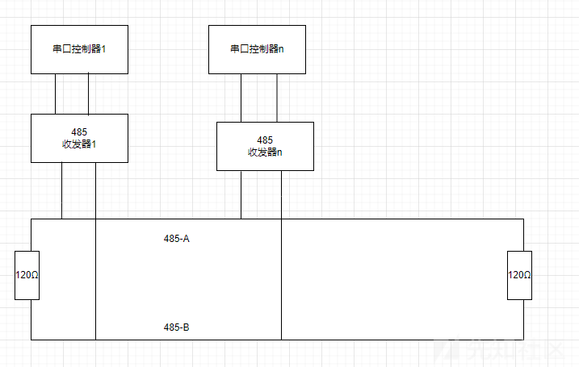

* 半双工
* 逻辑1：+2V~+6V
* 逻辑0： -2V~ -6V
* **注意485的电平指的是485-A和485-B两根传输线，两线间的电压差，不是传输线上的电压**

**RS-485电平标准确定传输过来的数据是0还是1，在此基础上，这些字节数据根据modbus通信协议来进行数据的交互传输**

#### **3.RS-422:**

也是使用差分信号传输，但通常用于点对点通信，传输距离较长

### **3.Modbus协议概述**

#### **1.简要说明**

是一个总线通信协议，不依赖于硬件的总线

#### **2.特性优势**

#### **特性**

1. **开放标准**: Modbus是一个开放的通信协议，任何人都可以使用
2. **简单易用**: 协议结构简单，容易理解和实现
3. **多种传输方式**: 支持串行通信（RS-232、RS-485）和网络通信（Modbus TCP/IP）
4. **主/从架构**: 一个主设备与多个从设备通信，主设备发起请求，从设备响应
5. **功能码**: 定义操作类型，如读写寄存器、线圈等

#### **优势**

1. **广泛兼容**: 几乎所有工业设备制造商都支持Modbus，设备间通信方便
2. **便携性**: 可以在不同物理层上工作，支持多种实现方式

#### **3.应用**

* **PLC（可编程逻辑控制器）**: PLC之间及与其他设备的通信
* **远程监控和数据采集（SCADA）**: 远程终端单元（RTU）中使用
* **智能仪表**: 如电能表、流量计的数据传输
* **建筑管理系统（BMS）**: 监控和控制楼宇设备

## **2.Modbus协议详解**

Modbus协议中，主设备发起请求，从设备接收并响应。通信是半双工的，每次只有一个设备在总线上传输数据，即主设备发送请求，从设备应答

### **1.Mosdus通信流程**

注意Modbus是一主多从的通信协议

Modbus通信中只有一个设备可以发送请求。其他从设备接收主机发送的数据来进行响应，从机是任何外围设备，如I/O传感器，阀门，网络驱动器，或其他测量类型的设备。从站处理信息和使用Modbus将其数据发送给主站

也就是说,不能Modbus同步进行通信,主机在同一时间内只能向一个从机发送请求，总线上每次只有一个数据进行传输,即主机发送,从机应答,主机不发送,总线上就没有数据通信。

从机不会自己发送消息给主站，只能回复从主机发送的消息请求

#### **1.流程简述**

**主机发送请求**：

主机发起通信，向从机发送一个请求帧，请求帧包括设备地址、功能码、数据和错误校验（CRC）

**从机接收请求**：

从机接收到请求帧后，解析帧内容。如果请求有效且地址匹配，从机执行相应的操作（如读写寄存器）

**从机发送响应**：

从机根据主机请求执行操作后，生成响应帧。响应帧包括设备地址、功能码、数据和错误校验（CRC）

**主机接收响应**：

主机接收到响应帧后，解析帧内容，检查是否存在错误，并读取响应数据

#### **2.请求帧结构**

**设备地址**：1字节，指定目标从机地址

**功能码**：1字节，指定操作类型（如读写寄存器）

**数据**：根据功能码的不同，数据长度和内容会有所不同

**错误校验（CRC）**：2字节，用于检测传输错误

#### **3.响应帧结构**

**设备地址**：1字节，响应的从机地址

**功能码**：1字节，与请求中的功能码一致

**数据**：返回的操作结果（如寄存器值）

**错误校验（CRC）**：2字节，用于检测传输错误

#### **4.模拟通信**

主机发送请求：

* **设备地址**：0x01
* **功能码**：0x03
* **起始地址**：0x0000
* **寄存器数量**：0x0002
* **CRC**：0xXXXX（根据具体计算得出）

从机响应：

* **设备地址**：0x01
* **功能码**：0x03
* **字节数**：0x04
* **寄存器值**：0x1234 0x5678
* **CRC**：0xXXXX（根据具体计算得出）

#### **5.结构示意图**

```
主机                      从机
 |                        |
 |--- 发送请求帧 -------->|
 |                        |
 |<--- 接收并处理请求帧 ---|
 |                        |
 |<--- 发送响应帧 --------|
 |                        |
 |--- 接收并处理响应帧 --->|
```

### **2.Modbus存储区**

从机存储数据，所以这里的文件操作同样存在（w）和（wr）类型

#### **存储类型：**

布尔值：存储电平高低，开关灯等

16位寄存器：存储面膜，温度等其他数据

#### **存储分区：**

|  |  |  |  |
| --- | --- | --- | --- |
| **区号** | **名称** | **读写** | **地址范围** |
| 0区 | 输出线圈 | 可读可写布尔量 | 00001-09999 |
| 1区 | 输入线圈 | 只读布尔量 | 10001-19999 |
| 3区 | 输入寄存器 | 只读寄存器 | 30001-39999 |
| 4区 | 保持寄存器 | 可读可写寄存器 | 40001-49999 |

主机向从机获取数据时，只需要告诉从机数据的起始地址，还有获取多少字节的数据，从机就可以发送数据给主机

!<https://g1rffe.oss-cn-chengdu.aliyuncs.com/typora/image-20240713010111210.png>

### **3.Modbus协议类型**

Modbus RTU使用紧凑的十六进制格式和16位CRC校验，Modbus ASCII使用每个8位字节作为两个ASCII字符发送并采用LRC校验。通过以太网传输时使用Modbus TCP/IP，不使用额外校验，因为TCP协议本身提供可靠性

#### **1. Modbus RTU (Remote Terminal Unit)**

**特点**：使用二进制格式传输数据，效率高 **应用**：常用于RS-232或RS-485通信链路

#### **帧结构：**

* **设备地址**：1字节，标识目标设备
* **功能码**：1字节，表示请求的操作类型（如读写寄存器）
* **数据**：可变长度，根据功能码决定内容（如寄存器地址和数量）
* **CRC校验**：2字节，用于错误检测。

```
+-------------+------------+----------+---------+
| 设备地址 (1) | 功能码 (1) | 数据 (N) | CRC (2) |
+-------------+------------+----------+---------+
```

#### **实现步骤：**

1. 主设备构建请求帧，包含设备地址、功能码、数据和CRC校验
2. 通过RS-232或RS-485链路发送请求帧
3. 从设备接收请求帧，验证CRC校验，解析并执行请求
4. 从设备构建响应帧，包含设备地址、功能码、数据和CRC校验
5. 从设备发送响应帧，主设备接收并验证CRC校验

#### **2. Modbus ASCII**

**特点**：使用ASCII码传输数据，适合调试和显示 **应用**：常用于串行链路

#### **帧结构：**

* **起始符**：1字节，通常为冒号（:）
* **设备地址**：2个ASCII字符，表示16进制数
* **功能码**：2个ASCII字符，表示16进制数
* **数据**：可变长度，每个字节用2个ASCII字符表示
* **LRC校验**：2个ASCII字符，用于错误检测
* **结束符**：2字节，通常为回车和换行（CR LF）

```
+-------+-------------+------------+----------+--------+-----+
| 起始符 | 设备地址 (2) | 功能码 (2) | 数据 (N) | LRC (2) | 结束符 |
+-------+-------------+------------+----------+--------+-----+
  (:)         (0-9, A-F)    (0-9, A-F)  (0-9, A-F)  (0-9, A-F)  (CR LF)
```

**实现步骤**：

1. 主设备构建请求帧，包含起始符、设备地址、功能码、数据和LRC校验
2. 通过串行链路发送请求帧
3. 从设备接收请求帧，验证LRC校验，解析并执行请求
4. 从设备构建响应帧，包含起始符、设备地址、功能码、数据和LRC校验
5. 从设备发送响应帧，主设备接收并验证LRC校验

#### **3. Modbus TCP/IP**

**特点**：基于以太网通信，数据通过TCP/IP网络传输 **应用**：适用于现代网络环境MBAP报文头字段详细描述

#### **帧结构：**

1. Transaction Identifier（事务标识符）

* **长度**: 2字节
* 事务标识符由客户端生成，用于匹配请求和响应。服务器会在响应中复制这个字段，以便客户端识别对应的请求

2. Protocol Identifier（协议标识符）

* **长度**: 2字节
* 用于标识使用的协议。Modbus协议的值为0

3. Length（长度）

* **长度**: 2字节
* 表示MBAP头之后数据的长度（包括Unit Identifier和PDU）。用于确定数据帧的结束

4. Unit Identifier（单元标识符）

* **长度**: 1字节
* 用于在多设备通信环境中标识具体设备。在简单的单设备网络中，这个值通常为0

#### **MBAP报文头表格**

|  |  |  |  |
| --- | --- | --- | --- |
| **字节偏移量** | **字段名称** | **长度（字节）** | **描述** |
| 0-1 | Transaction Identifier | 2 | 事务标识符，用于匹配请求和响应 |
| 2-3 | Protocol Identifier | 2 | 协议标识符，0表示Modbus协议 |
| 4-5 | Length | 2 | 剩余长度，表示MBAP头之后数据的长度（包括Unit Identifier和PDU） |
| 6 | Unit Identifier | 1 | 单元标识符，用于多设备通信环境中标识具体设备 |

#### **Modbus TCP 数据帧示例**

以下是一个示例Modbus TCP数据帧：

|  |  |  |  |
| --- | --- | --- | --- |
| **字节偏移量** | **字段名称** | **示例值（十六进制）** | **描述** |
| 0-1 | Transaction Identifier | 0x00 0x01 | 事务标识符，客户端生成，表示第一个事务 |
| 2-3 | Protocol Identifier | 0x00 0x00 | 协议标识符，0表示Modbus协议 |
| 4-5 | Length | 0x00 0x06 | 剩余长度，表示MBAP头之后的6个字节数据（包括Unit Identifier和PDU） |
| 6 | Unit Identifier | 0x01 | 单元标识符，表示设备地址 |
| 7 | Function Code | 0x03 | 功能码，0x03表示读取保持寄存器 |
| 8-9 | Starting Address | 0x00 0x00 | 起始地址，读取地址从0开始 |
| 10-11 | Quantity of Registers | 0x00 0x01 | 寄存器数量，读取一个寄存器 |

这个示例表示一个读取保持寄存器的请求，从地址0开始，读取一个寄存器

#### **结构图**

```
+------------------------+----------------+----------+-------------+----------+----------+
| 事务处理标识符 (2) | 协议标识符 (2) | 长度 (2) | 单元标识符 (1) | 功能码 (1) | 数据 (N) |
+------------------------+----------------+----------+-------------+----------+----------+
```

#### **实现步骤：**

1. 主设备构建请求帧，包含事务处理标识符、协议标识符、长度域、单元标识符、功能码和数据
2. 通过TCP/IP网络发送请求帧
3. 从设备接收请求帧，解析并执行请求
4. 从设备构建响应帧，包含事务处理标识符、协议标识符、长度域、单元标识符、功能码和数据
5. 从设备发送响应帧，主设备接收并处理响应

#### **4. Modbus Plus (Modbus+)**

**特点**：使用令牌传递机制的高性能网络协议，支持多主站和高速通信 **应用**：常用于工业自动化环境中的PLC和其他控制设备 **传输介质**：使用屏蔽双绞线进行通信，支持长距离传输和高数据速率

#### **帧结构：**

* **起始字节**：标识帧的开始
* **目标地址**：标识目标设备
* **源地址**：标识发送设备
* **功能码**：表示请求的操作类型
* **数据**：根据功能码决定内容
* **校验码**：用于错误检测

```
+-------------+-------------+------------+-----------+----------+--------+
| 起始符 (1) | 目标地址 (1) | 源地址 (1) | 功能码 (1) | 数据 (N) | CRC (2) |
+-------------+-------------+------------+-----------+----------+--------+
```

#### **实现步骤：**

1. 主设备通过令牌传递机制获得发送权
2. 主设备构建请求帧，包含起始字节、目标地址、源地址、功能码、数据和校验码
3. 通过屏蔽双绞线发送请求帧
4. 从设备接收请求帧，验证校验码，解析并执行请求
5. 从设备构建响应帧，包含起始字节、目标地址、源地址、功能码、数据和校验码
6. 从设备发送响应帧，主设备接收并验证校验码

### 4.Modbus的功能码

#### **1.功能码汇总**

|  |  |  |  |  |
| --- | --- | --- | --- | --- |
| **功能码** | **描述** | **请求数据字段** | **响应数据字段** | **示例操作** |
| 01 | 读线圈状态 | 起始地址 (2字节) |  |  |
| 读取数量 (2字节) | 字节计数 (1字节) |  |  |  |
| 线圈状态 (N字节) | 读取指定地址范围的线圈状态 |  |  |  |
| 02 | 读离散输入 | 起始地址 (2字节) |  |  |
| 读取数量 (2字节) | 字节计数 (1字节) |  |  |  |
| 输入状态 (N字节) | 读取指定地址范围的离散输入状态 |  |  |  |
| 03 | 读保持寄存器 | 起始地址 (2字节) |  |  |
| 读取数量 (2字节) | 字节计数 (1字节) |  |  |  |
| 数据 (N字节) | 读取指定地址范围的保持寄存器值 |  |  |  |
| 04 | 读输入寄存器 | 起始地址 (2字节) |  |  |
| 读取数量 (2字节) | 字节计数 (1字节) |  |  |  |
| 数据 (N字节) | 读取指定地址范围的输入寄存器值 |  |  |  |
| 05 | 写单个线圈 | 地址 (2字节) |  |  |
| 状态 (2字节) | 地址 (2字节) |  |  |  |
| 状态 (2字节) | 将指定地址的单个线圈状态设置为开或关 |  |  |  |
| 06 | 写单个保持寄存器 | 地址 (2字节) |  |  |
| 值 (2字节) | 地址 (2字节) |  |  |  |
| 值 (2字节) | 将指定地址的单个保持寄存器的值设置为给定值 |  |  |  |
| 15 | 写多个线圈 | 起始地址 (2字节) |  |  |
| 写入数量 (2字节) |  |  |  |  |
| 字节计数 (1字节) |  |  |  |  |
| 线圈状态 (N字节) | 起始地址 (2字节) |  |  |  |
| 写入数量 (2字节) | 将指定地址范围内的多个线圈状态设置为开或关 |  |  |  |
| 16 | 写多个保持寄存器 | 起始地址 (2字节) |  |  |
| 写入数量 (2字节) |  |  |  |  |
| 字节计数 (1字节) |  |  |  |  |
| 数据 (N字节) | 起始地址 (2字节) |  |  |  |
| 写入数量 (2字节) | 将指定地址范围内的多个保持寄存器的值设置为给定值 |  |  |  |
| 17 | 强制单个线圈状态 | 地址 (2字节) |  |  |
| 状态 (2字节) | 地址 (2字节) |  |  |  |
| 状态 (2字节) | 强制将指定线圈设置为开或关状态（仅适用于某些设备） |  |  |  |
| 18 | 强制多个线圈状态 | 起始地址 (2字节) |  |  |
| 写入数量 (2字节) |  |  |  |  |
| 字节计数 (1字节) |  |  |  |  |
| 线圈状态 (N字节) | 起始地址 (2字节) |  |  |  |
| 写入数量 (2字节) | 强制将指定地址范围内的多个线圈状态设置为开或关（仅适用于某些设备） |  |  |  |
| 23 | 读/写多个寄存器 | 读寄存器地址 (2字节) |  |  |
| 读寄存器数量 (2字节) |  |  |  |  |
| 写寄存器地址 (2字节) |  |  |  |  |
| 写寄存器数量 (2字节) |  |  |  |  |
| 写数据 (N字节) | 读数据 (N字节) | 读取和写入指定寄存器的数据 |  |  |

#### **2.功能码实现图示**

#### **读线圈状态 (01)**

```
+-------------+------------+----------+---------+
| 设备地址    | 功能码     | 数据     | CRC     |
| (1字节)     | (1字节)    | (N字节)   | (2字节)  |
+-------------+------------+----------+---------+
```

#### **读离散输入 (02)**

```
+-------------+------------+----------+---------+
| 设备地址    | 功能码     | 数据     | CRC     |
| (1字节)     | (1字节)    | (N字节)   | (2字节)  |
+-------------+------------+----------+---------+
```

#### **读保持寄存器 (03)**

```
+-------------+------------+----------+---------+
| 设备地址    | 功能码     | 数据     | CRC     |
| (1字节)     | (1字节)    | (N字节)   | (2字节)
```

### **5.Modbus-CRC校验**

#### **1.CRC校验概述**

CRC（循环冗余校验）是一种用于检测数据传输错误的算法。它通过将数据与生成多项式进行数学运算来生成一个短的、固定长度的校验码（CRC码），用于确保数据在传输过程中没有发生错误

#### **2.CRC校验流程**

1. 选择生成多项式（Polynomial）

：

* 选择一个适当的生成多项式来进行CRC计算。常见的生成多项式包括 CRC-16、CRC-32 等（Modbus RTU中使用的生成多项式为 0x8005（CRC-16-CCITT））

2. 初始化CRC寄存器

：

* 将CRC寄存器初始化为一个预设值。对于Modbus RTU，CRC寄存器通常初始化为 0xFFFF

3. 逐位处理数据

：

* 将待检数据的每一位从数据帧的第一个字节到最后一个字节逐位处理，并与CRC寄存器中的值进行异或运算

4. 进行多项式除法运算

：

* 每次将CRC寄存器的最高位与生成多项式进行异或运算，移位处理以完成多项式除法的计算
* 当最高位为1时，执行CRC多项式的除法运算（即CRC寄存器异或生成多项式），然后左移一位

5. 继续处理数据位

：

* 对数据中的每一位进行相同的操作，直到所有数据位都处理完成

6. 完成CRC计算

：

* 将CRC寄存器中的值作为校验码附加到数据帧中

#### **3.CRC计算实例详解**

#### **1. 选择生成多项式**

选择一个生成多项式 0x8005（即 x^16 + x^15 + x^2 + 1）

#### **2. 初始化CRC寄存器**

初始化CRC寄存器为0xFFFF

#### **3. 逐字节处理数据**

对于每一个字节的数据：

* 将数据字节与CRC寄存器的当前值进行异或
* 对字节进行逐位处理，逐步移位，并根据最高位的值决定是否进行异或操作

#### **4. 处理示例数据**

计算数据 **0x01, 0x03, 0x00, 0x00, 0x00, 0x01** 的CRC

**初始化CRC寄存器**：

1. CRC = 0xFFFF
2. **第一个字节** **0x01**：

* **0x01** 与 CRC 寄存器的高位进行异或
* 进行多项式除法运算
* 结果更新CRC寄存器的值

3. **继续处理每个字节**：

* 将下一个字节与CRC寄存器进行异或，并重复步骤2中的运算

4. **处理完所有数据字节**：

* 完成计算后，CRC寄存器中的值即为CRC校验码

#### **5. CRC校验码示例计算**

计算完成后，CRC值为 **0x4B37**。在Modbus RTU中，这个值会附加在数据帧的末尾进行传输。

#### **CRC计算流程图**

以下是CRC计算流程图的简化表示：

```
+-------------------------+
|  初始化 CRC 值为 0xFFFF  |
+-----------+-------------+
            |
            v
+-----------+-------------+
|  对于数据块中的每一个字节 |
+-----------+-------------+
            |
            v
+-----------+-------------+
|  将当前字节与 CRC 当前值进行异或 |
+-----------+-------------+
            |
            v
+-----------+-------------+
|  对于每一个比特（0 到 7）  |
+-----------+-------------+
            |
            v
+-----------+-------------+
|  检查 CRC 的最低有效位 (LSB) |
|  如果 LSB 为 1             |
|    将 CRC 右移一位         |
|    CRC 与多项式进行异或    |
|  否则                    |
|    仅将 CRC 右移一位       |
+-----------+-------------+
            |
            v
+-----------+-------------+
|  处理下一个字节          |
+-----------+-------------+
            |
            v
+-----------+-------------+
|  完成所有字节后           |
|  将 CRC 的高低字节交换   |
+-----------+-------------+
            |
            v
+-----------+-------------+
|   输出 CRC 值           |
+-------------------------+
```

#### **CRC校验算法伪代码**

以下是CRC校验算法的伪代码，展示了如何对每个字节的数据进行CRC计算：

```
Function CRC16(data):
    CRC = 0xFFFF  // 初始化CRC寄存器
    For each byte in data:
        CRC = CRC XOR byte  // 与数据字节异或
        For 8 bits:
            If (CRC & 0x8000) == 0x8000:
                CRC = (CRC << 1) XOR 0x8005  // 进行多项式除法
            Else:
                CRC = CRC << 1  // 左移一位
    Return CRC
```

#### **CRC校验实用工具**

* **CRC计算器**：在线CRC计算工具可以帮助验证CRC计算的正确性
* CRC算法代码

：常用编程语言中的CRC计算代码示例：

* Python: **crc16 = crcmod.predefined.Crc('xmodem')**
* C/C++: **uint16\_t crc16(uint16\_t crc, const uint8\_t \\*buf, size\_t len)**

#### **常见的CRC多项式**

|  |  |  |  |
| --- | --- | --- | --- |
| **CRC类型** | **生成多项式 (Hex)** | **生成多项式 (Binary)** | **描述** |
| CRC-16 | 0x8005 | 1000 0000 0000 0101 | 常用在Modbus RTU中 |
| CRC-16-CCITT | 0x11021 | 0001 0001 0000 0010 0001 | 标准CRC-16多项式 |
| CRC-32 | 0x04C11DB7 | 0000 0100 1100 0001 0001 1101 1011 0111 | 常用于网络传输，如ZIP文件 |

# S7comm协议

## 协议简介

### 基本背景

西门子为PLC，SCADA，PLC之间的通信设计的专属协议，相比较Modbus协议栈修改程度更高

适用于S7-300、S7-400、S7-1200

应用层数据→COTP协议+TPKT协议→TCP传输数据

### 西门子PLC系统

PLC指Programmable Logic Controller（逻辑控制器）

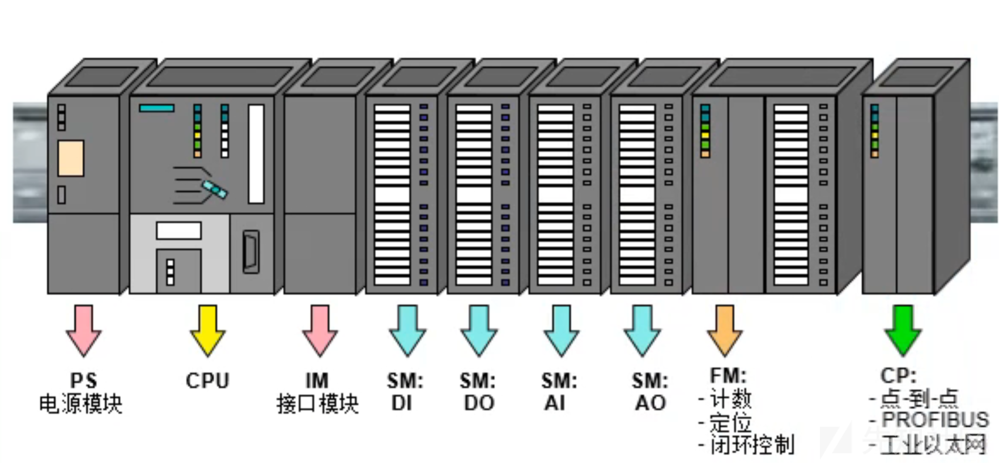

|  |  |  |
| --- | --- | --- |
| **模块名称** | **缩写** | **功能** |
| 电源模块 | PS | 提供PLC系统运行所需的电源 |
| CPU模块 | CPU | 负责处理信息和执行用户编写的程序 |
| 通信模块 | IM | 实现PLC与其他设备之间的通讯和数据交换 |
| 数字量输入模块 | DI | 接收外部数字量信号（如开关信号、传感器信号） |
| 数字量输出模块 | DO | 输出数字量信号控制外部设备（如继电器、灯等） |
| 模拟量输入模块 | AI | 接收外部模拟量信号（如电压、电流等） |
| 模拟量输出模块 | AO | 输出模拟量信号控制外部设备（如变频器等） |

### S7comm协议栈

|  |  |  |
| --- | --- | --- |
| **level** | **OSI layer** | **Protocol** |
| 7 | Application Layer 应用层 | S7 communication |
| 6 | Presentation Layer 表示层 | S7 communication(COTP) |
| 5 | Session Layer 会话层 | S7 communication(TPKT) |
| 4 | Transport Layer 传输层 | ISO-on-TCP (RFC 1006) |
| 3 | Network Layer 网络层 | IP |
| 2 | Data Link Layer 数据链路层 | Ethernet |
| 1 | Physical Layer 物理层 | Ethernet |

前面四层S7comm协议并不涉及，由计算机底层驱动实现

第五层：TPRK 应用数据传输协议，介于TCP和COTP之间，建立两者之间桥梁

第六层：COTP 定位于TCP协议之上的协议，以“Packet”为基本单位传输数据

第七层：S7 comm 与用户数据相关，对PLC数据的读取报文在这里完成

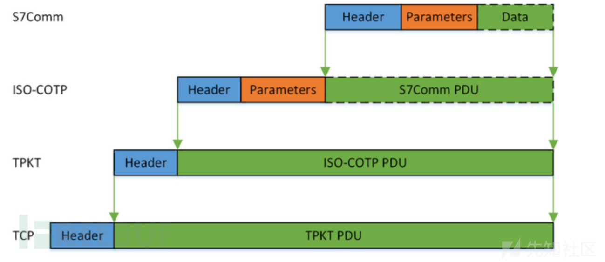

## TPKT协议

### 基本概述

```
TPKT is an "encapsulation" protocol. It carries the OSI packet in its own packet's data payload and then passes the resulting structure to TCP, from then on, the packet is processed as a TCP/IP packet. The OSI programs passing data to TPKT are unaware that their data will be carried over TCP/IP because TPKT emulates the OSI protocol Transport Service Access Point(TSAP)

翻译：

TPKT 是一种 “封装 ”协议。
它在自己的数据包有效载荷中携带 OSI 数据包，然后将产生的结构传递给 TCP
同时，数据包就作为 TCP/IP 数据包处理，向 TPKT 传输数据的 OSI 程序并不知道它们的数据将通过 TCP/IP 传输
因为 TPKT 模拟的是 OSI 协议传输服务接入点（TSAP）
```

### 协议包解析

解析：

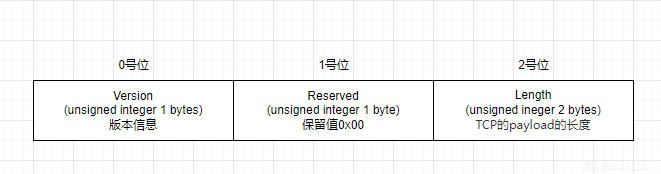

示例：

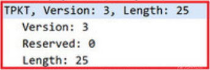

## COTP协议

### 基本概述

官方定义：<https://standards.iso.org/ittf/PubliclyAvailableStandards/index.html>

OSI 7层协议定义的位于TCP之上的协议，以“Packet”为基本单位来传输数据

两种形态：

COTP连接包（COTP Connection Packet）

COTP功能包（COTP Fuction Packet）

### COTP Connection Packet

S7Comm的握手包

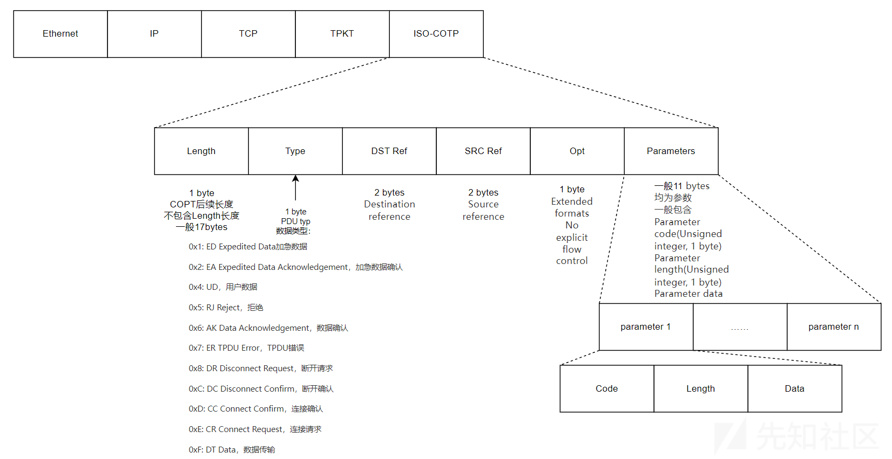

示例：

#### 请求连接包

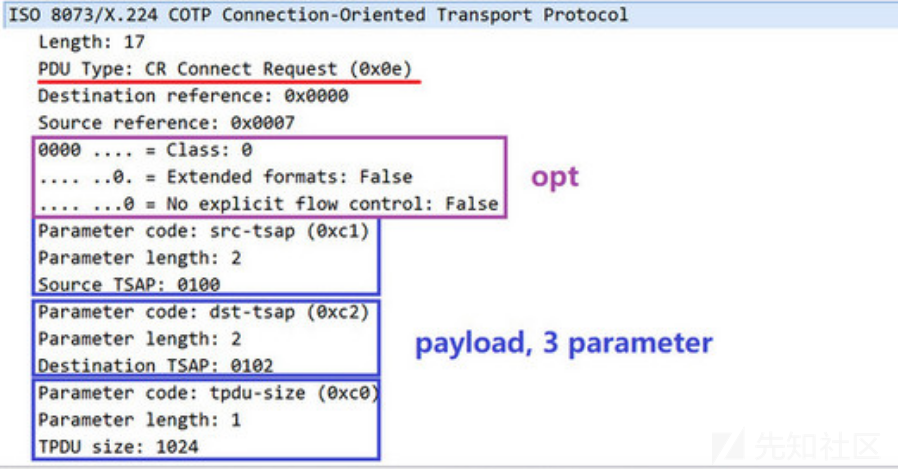

#### 连接确认包

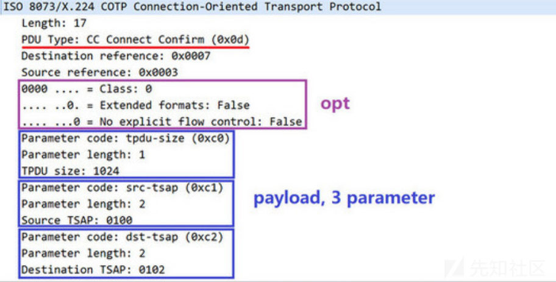

### COTP Fuction Packet

相较于COTP Connection Packet更加简洁

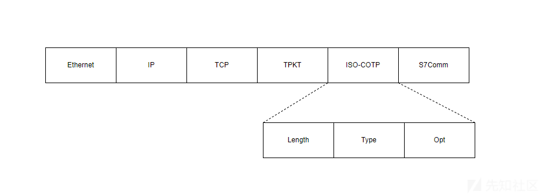

#### Length：

和COTP Connection Packet类似

#### PDU type：

```
0x1: ED Expedited Data，加急数据
0x2: EA Expedited Data Acknowledgement，加急数据确认
0x4: UD，用户数据
0x5: RJ Reject，拒绝
0x6: AK Data Acknowledgement，数据确认
0x7: ER TPDU Error，TPDU错误
0x8: DR Disconnect Request，断开请求
0xC: DC Disconnect Confirm，断开确认
0xD: CC Connect Confirm，连接确认
0xE: CR Connect Request，连接请求
0xF: DT Data，数据传输
```

#### opt：

Boolean类型

Extended formats

No explicit flow control

#### 示例：

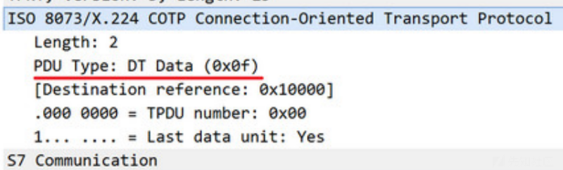

PDU类型为连接请求（0x0f）→数据传输的包

## S7Comm协议

### 协议概述

S7Comm数据作为COTP数据包的有效载荷

#### 协议标识符：

第一个字节0x32

#### 协议构成：

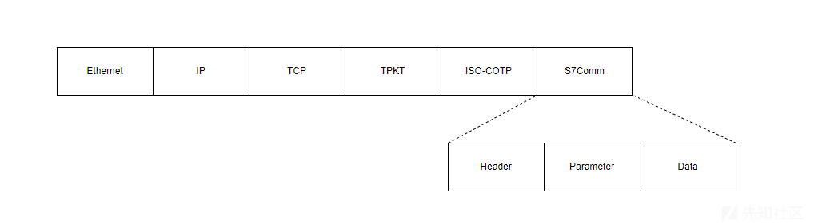

### S7Comm Header

#### Header 定义：

* 包的类型
* 参数长度
* 数据长度

#### Header 格式

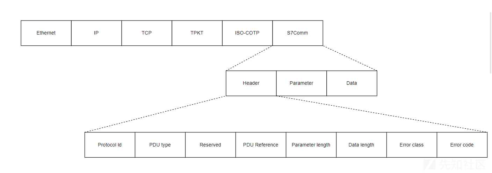

1. 协议ID → Protocol Id：0x32
2. PDU Type:

```
0x01 - JOB(Request： job with acknowledgement)：作业请求。由主设备发送的请求（例如，读/写存储器，读/写块，启动/停止设备，设置通信）；
0x02 - ACK(acknowledgement without additional field)：确认响应，没有数据的简单确认（未遇到过由S7 300/400设备发送得）
0x03 - ACK_DATA(Response： acknowledgement with additional field)：确认数据响应，这个一般都是响应JOB的请求；
0x07 - USERDATA：原始协议的扩展，参数字段包含请求/响应ID（用于编程/调试，读取SZL，安全功能，时间设置，循环读取...）
```

3. Reserverd→冗余数据：通常0x0000
4. PDU Reference→协议数据单元参考，随着事件的请求数量而增加
5. Parameter length→参数的总长度
6. Data length→数据长度

* 读取PLC内部数据，设置为0x0000
* 其余功能。设置为Dta部分数据长度

7. Error class→错误类型
8. Error code→错误代码

#### 示例：

常规数据包：

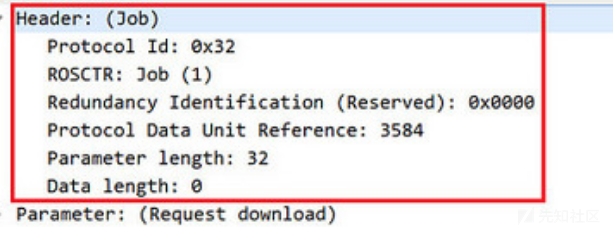

展示报错的数据包：

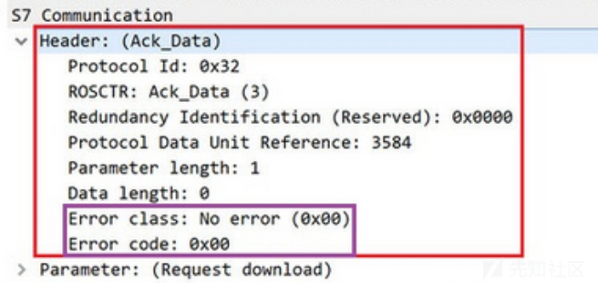

### Job & Ack\_Data

Parameter的第一个字段是function→Job & Ack\_Data

类型：unsigned integer→1 byte

后面将根据不同function对应的data以及后续的结构进行讲解（因为不同的function对应的data数据段的结构不一样）

#### 建立通信（0xF0）

Setup communication [0xF0]

适用场景：每个会话开始时被发送，然后开始进行其他信号的交换

报文构成：

1. 用于协商ACK队列的大小→决定了可以同时启动而不需要确认的并行作业的数量 大端序
2. 用于协商最大的PDU长度→根据PDU类型长度定义功能 大端序

##### PDU=JOB

当PDU设置为JOB的时候，通信功能Parameter结构：

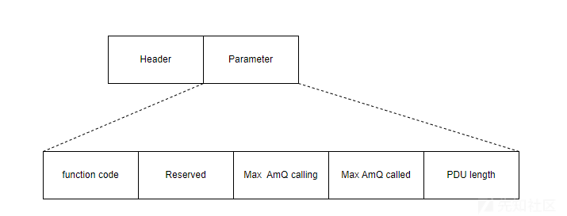

```
Rserverd：保留字节
Max AmQ calling：parallel jobs with ack
Max AmQ called：parallel jobs with ack
PDU length：协商PDU长度
```

##### 示例：

建立通信报文

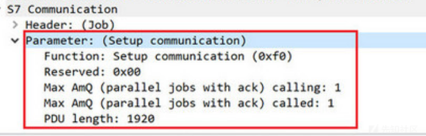

确认响应报文

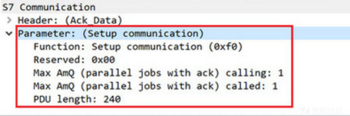

ACK队列的大小为1；最大PDU长度为240

#### 读取值（0x04）

使用场景：数据读写操作通过指定变量的存储区域，地址（偏移量）及其大小或类型来执行

##### PDU=JOB

当PDU为JOB时，S7comm的结构为：

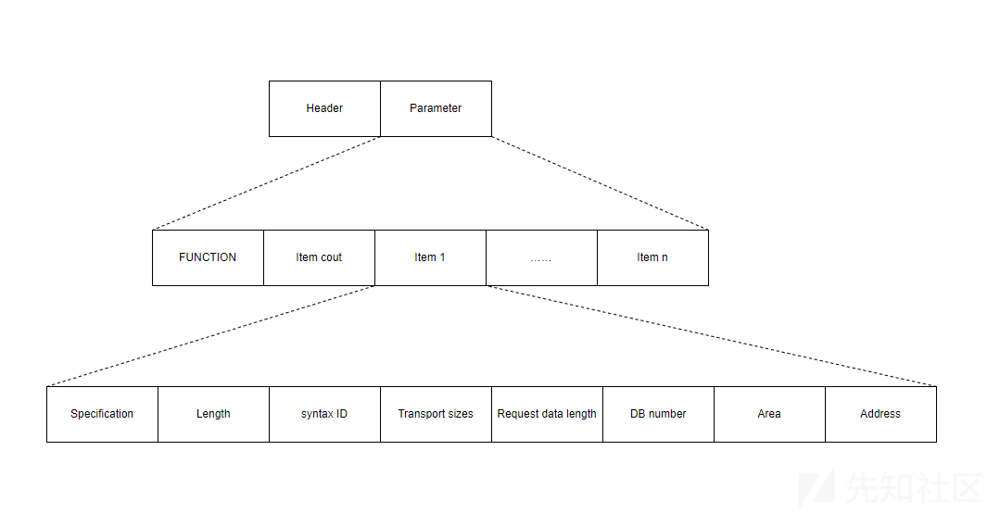

###### parameter结构：

```
item count（Unsigned integer 1 byte)：项目个数
Item 1:
Item 2:
Item 3:
Item ……:
Item n:
```

###### Item结构：

```
Request data lengthSpecification(Unsigned integer 1 byte): 确定项目结构的主要类型，通常为0x12，代表变量规

Length(Unsigned integer 1 byte): 本Item其余部分的长度

Syntax ID(Unsigned integer 1 byte): 确定寻址模式和其余项目结构的格式

Transport sizes(Unsigned integer 1 byte): 确定变量的类型和长度

Request data length(Unsigned integer 2 byte): 请求的数据长度

DB number(Unsigned integer 2 byte): DB模块的编号，如果访问的不是DB区域，为0x0000

Area(Unsigned integer, 1 byte): 区域类型

Address(Unsigned integer, 3 byte): 地址
```

###### 示例：

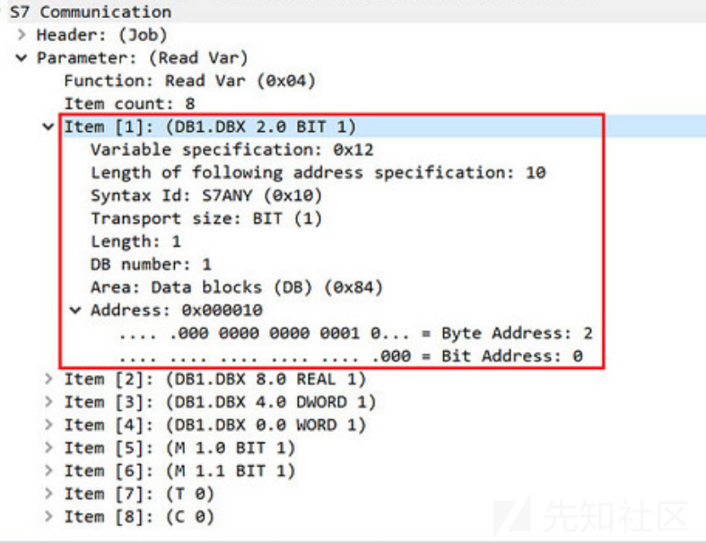

##### PDU=Ack\_Data

当PDU类型为Ack\_Data时，S7Comm的结构：

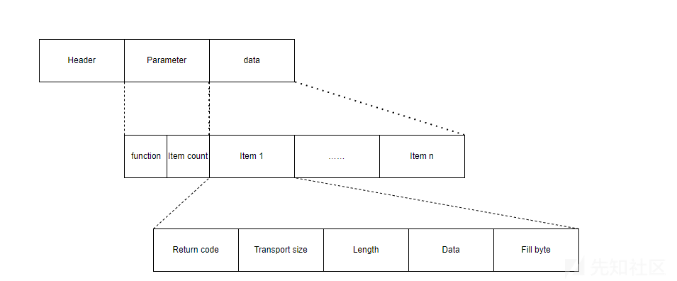

Parameter只有function，item count两个字段

data段：

```
Return code(Unsigned integer, 1 byte): 返回代码

1Transport size(Unsigned integer, 1 byte): 数据的传输尺寸

Length(Unsigned integer, 2 bytes): 数据的长度

Data（根据情况而定）：数据

Fill byte(Unsigned integer, 1 byte): 填充字节
```

示例：

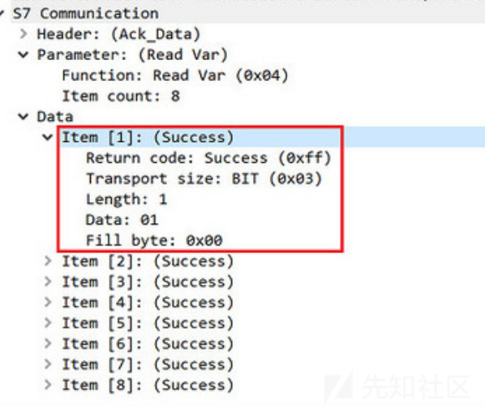

item1是读取DB1的0x000010（DB1.DBX 2.0 BIT 1）值→相应数据为01

#### 写入值（0x5）

Write Va还需写入值，Write Var比Read Var多Data项

##### PDU=JOB

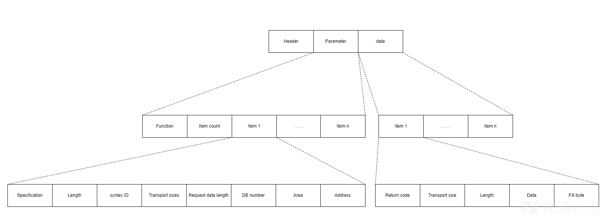

data结构：

```
Return code(Unsigned integer, 1 byte): 返回代码，这里是未定义，所以为Reserved（0x00）

Transport size(unsigned integer, 1 byte): 确定变量的类型和长度

Length(unsigned integer, 2 bytes): 写入值的数据长度

Data(1 byte): 写入的数据

Fill byte(unsigned integer, 1 byte): 填充字节，如果数据的长度不足Length的话，则填充
```

示例：

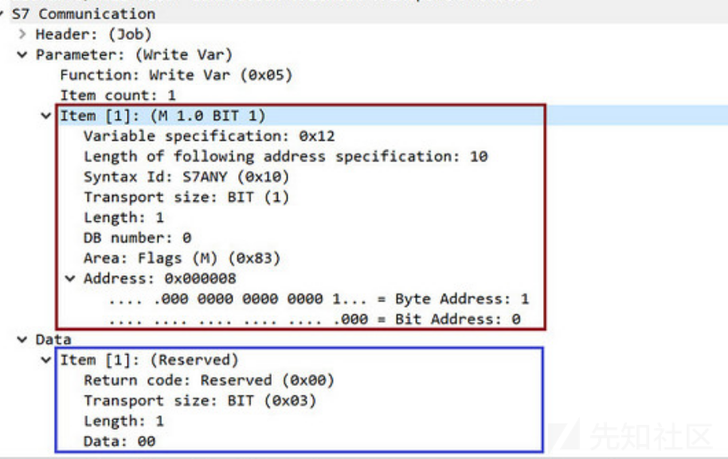

向地址为0x000008的Flags（M）写入0x00的作业请求

##### PDU=Ack\_Data

Parameter：function，item count字段

Data：Return code字段

示例：

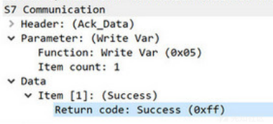

向地址为0x000008的Flags（M）写入0x00成功

#### 下载功能

西门子设备程序代码和大部分数据存储在块中（存在自己的编码格式的块）

##### 文件夹格式

1. File identifier（ASCII）：(1 byte)文件标识符,Complete Module)，$(Module header for up-loading)
2. Block type：(2 bytes)块类型。具体类型
3. Block number(5 bytes)块编号
4. Destination filesystem（ASCII）：(1 byte)目标的文件系统(三种文件系统如下：

* P（Passive (copied, but not chained) module)：被动文件系统
* A (Active embedded module)：主动文件系统
* B (Active as well as passive module)：既主既被文件系统

示例：

文件名为*0A00001P*

文件标识是\_，块类型为DB，块的编号为00001，目标块的文件系统是P

用于将DB 1复制到被动文件系统或从被动文件系统复制

下载有3中不同的功能类型：

```
请求下载（Request download [0x1A]）
下载块（Download block [0x1B]）
下载结束（Download ended [0x1C]）
```

#### 下载流程

Step7向PLC发送一个请求下载的Job

PLC收到后则回复一个Ack\_Data

Step7向PLC发送一个下载结束的Job来关闭下载会话（所有字节传输完毕后）

时序图：

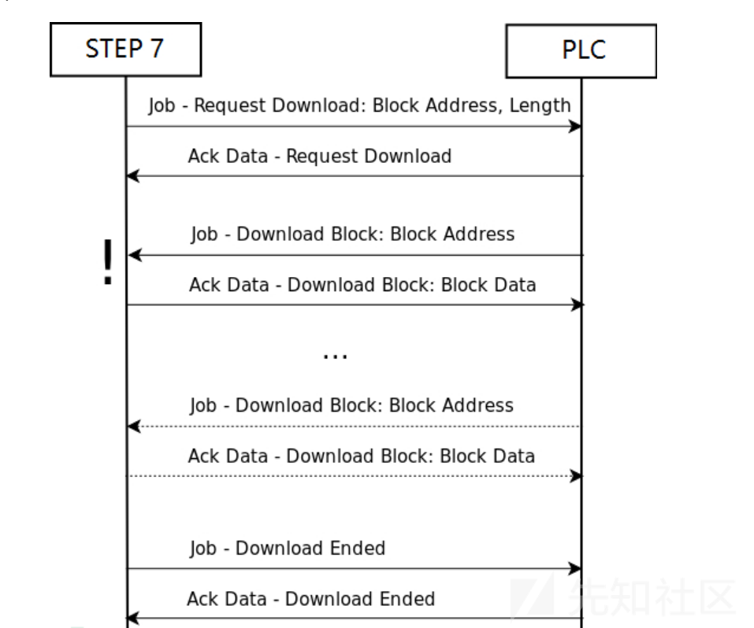

##### 请求下载（Request download [0x1A]）

###### PDU=JOB

Request download [0x1A]没有Data

Parameter的结构:

1. (1 byte): Function Status，功能码状态
2. (2 bytes): for all unknown bytes in blockcontrol
3. (4 bytes): 无意义，一般为0x00000000
4. (1 byte): filename length，文件名长度
5. (\_ bytes): filename, default is 9 byte，文件名，长度一般为9个字节

* (1 byte): File identifier（ASCII），文件标识符。其有\_ (Complete Module)，$ (Module header for up-loading)两种文件标识符
* (2 bytes): Block type，块类型
* (5 bytes): Block number，块编号
* (1 byte): Destination filesystem（ASCII），目标的文件系统

6. (1 byte): Length part 2 in bytes，参数的第二部分长度，也就是接下来的字段长度
7. (1 byte): Unknown char（ASCII）
8. (6 bytes): Length load memory in bytes（ASCII）
9. (6 bytes): Length of MC7 code in bytes（ASCII）

示例：

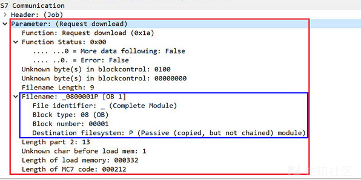

文件标识：\_ (Complete Module)

块类型：OB

块编号：00001

目标块的文件系统：P (Passive (copied, but not chained) module)

###### PDU=Ack\_Data

Request download [0x1A]的Parameter中仅一个function

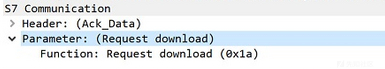

#### 下载块（0x1B）

##### PDU=JOB

Download block [0x1B]也没有Data，其Parameter的结构与Request download（0x1A）的Parameter的第一部分相同

示例：

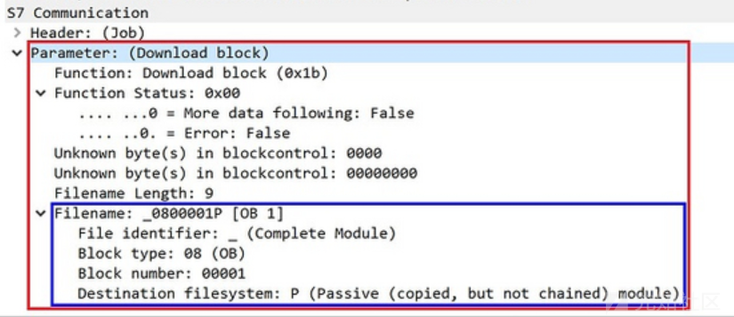

##### PDU=Ack\_Data

Parameter：

(1 byte): Function Status，功能码状态

Data：

1. (Unsigned integer, 2 bytes): Length，数据长度
2. (Unsigned integer, 2 bytes): Unknown byte(s) in blockcontrol，未知字节
3. (Label，data\_length-4 bytes): Data，数据

示例：

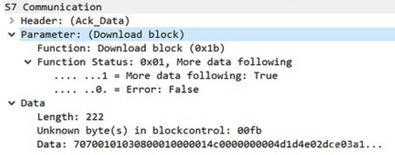

#### 下载结束（0x1C）

##### PDU=JOB

Download ended [0x1C]没有Data，Parameter与Download block （0x1B）的Parameter和Request download（0x1A）的Parameter的第一部分相同

示例：

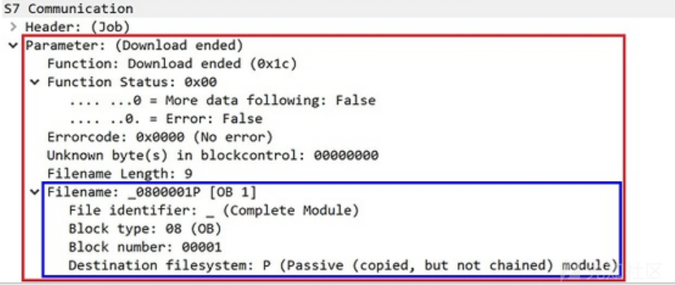

##### PDU=Ack\_Data

Download ended [0x1C]的Parameter中只有一个function

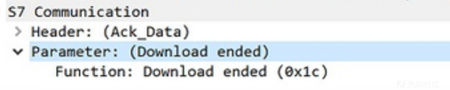

#### 上传功能

上传是PLC发送块数据给Step7

功能类型：

* 开始上传（Start upload [0x1D]）
* 上传（Upload [0x1E]）
* 上传结束（End upload [0x1F]）

#### 上传流程：

1. Step7向PLC发送开始上传的Job
2. PLC收到后回复Ack\_Data（包含Step7块的长度，上传会话ID）
3. PLC继续上传块数据到Step7（直到STEP7接收完毕）
4. Step7发送结束上传的作业请求→关闭上传会话

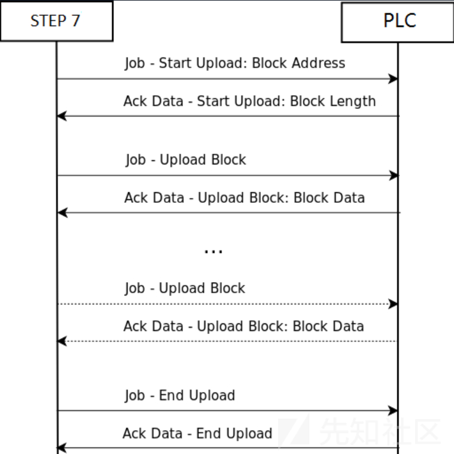

完整上传示例：

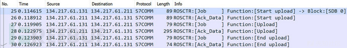

#### 开始请求（0x1D）

##### PDU=JOB

Start upload [0x1D]没有Data，Parameter:

1. (1 byte)Function Status：功能码状态
2. (2 bytes)for all unknown bytes in blockcontrol
3. (4 bytes)上传的会话ID：此时为0x00000000
4. (1 byte)filename length：文件名长度
5. (? bytes) filename, default is 9 byte：文件名，长度一般为9个字节

(1 byte)File identifier（ASCII）：文件标识符，\_ (Complete Module)、$ (Module header for up-loading)两种文件标识符

(2 bytes)Block type：块类型

(5 bytes)Block number：块编号

(1 byte)Destination filesystem（ASCII）：目标的文件系统（和下载一样）

示例：

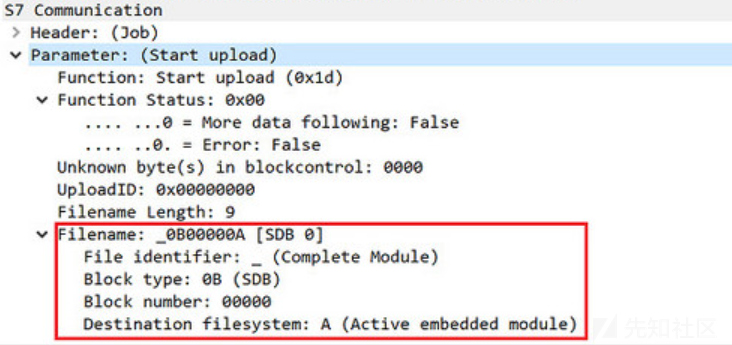

文件标识：\_ (Complete Module)

块类型：0B（SDB）

块的编号；00000

文件系统：A (Active embedded module)

##### PUD=Ack\_Data

Start upload [0x1D]的Parameter结构：

1. (1 byte): Function Status，功能码状态
2. (2 bytes): for all unknown bytes in blockcontrol
3. (4 bytes): 上传的会话ID，告诉Step7上传会话ID
4. (Unsigned integer, 1 byte): Blocklengthstring Length
5. (Character string): Blocklength，块的长度

示例：

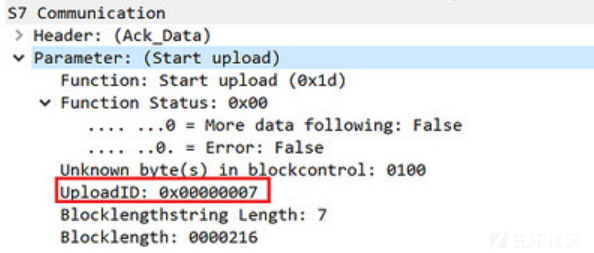

ID：0x00000007

#### 上传（0x1E）

PDU=JOB

没有Data，Parameter结构：

1. (1 byte)Function Status：功能码状态
2. (2 bytes)for all unknown bytes in blockcontrol
3. (4 bytes)上传的会话ID：告诉Step7上传会话ID

示例：

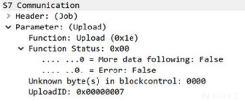

##### PDU=Ack\_Data

Parameter结构：

(1 byte):Function Status：功能码状态

Data结构：

1. (Unsigned integer, 2 bytes)Length：数据长度
2. (Unsigned integer, 2 bytes)Unknown byte(s) in blockcontrol：未知字节
3. (Label，data\_length-4 bytes)Data：数据

示例：


#### 上传结束（0x1F）

PLC收到后关闭会话，返回一个结束相应

##### PDU=JOB

没有Data，Parameter结构：

1. (1 byte)Function Status：功能码状态
2. (2 bytes)Error code：错误代码
3. (4 bytes):：上传的会话ID

示例：


##### PDU=Ack\_Data

End upload [0x1F]的Parameter中只有一个function


#### 程序调用服务（0x28）

程序调用是用于在PLC执行修改执行/内存状态的日常工作（启动或停止PLC控制程序、激活或删除程序块）

##### PDU=JOB

没有Data，Parameter结构：

1. (7 bytes): Unknown
2. (Unsigned integer, 2 bytes)：Parameter block length
3. (?bytes): Parameter block：参数
4. (Unsigned integer, 1 byte)String length：PI service的字符串长度
5. (Character string, ASCII)PI (program invocation) Service name：程序调用服务名

服务名称相关参数的示例：

```
_INSE：激活设备上下载的块，参数是块的名称（比如：OB 1）

_DELE：从设备的文件系统中删除一个块，该参数也是该块的名称

P_PROGRAM：设置设备的运行状态（启动、停止、复位）

_GARB：压缩PLC内存

_MODU：将ram复制到ROM，参数包含文件系统标识符（A/E/P）
```

服务调用的参数是块的话

Parameter block结构：

1. (1 byte)Number of block
2. (1 byte)Unknown：默认为0x00
3. (? bytes)filename；文件名

```
(2 bytes, ASCII)Block type：块类

(5 bytes, ASCII)Block number：块编号

(1 byte, ASCII)Destination filesystem（ASCII）：目标的文件系统（和下载上传相同）
```

示例：

###### \_INSE（激活PLC模块）的作业请求


对应的请求响应：


###### \_MODU（复制RAM到ROM）的作业请求


Parameter block中只有Argument

**5.2.7 PLC STOP [0x29]**

和程序调用服务（0x28）类似，没有Parameter block

示例：


# 工控流量常见题目解析

# IEC104\_1.pcapng

## 筛选协议

存在多个协议交互


筛选iec61870\_asdu(应用服务数据单元),更关注数据的应用层内容不管是104还是101的数据


过滤分组为0的数据包，这样得到的为同一个连接的数据包，数据也是连贯的

Wireshark 为每个独立的 TCP 连接分配一个唯一的流编号（从 0 开始递增），标识双向通信的数据流

iec60870\_asdu && tcp.stream == 0

## 过滤破损数据

IOA Value值表示信息对象的地址，用于标识特定的数据对象

存在破损的数据包


通过iec60870\_asdu.normval进行筛选（ **标准化值**）


## 根据TypeID进行过滤

一个一个提取id的时候发现34很多，把他过滤掉

((((iec60870\_asdu && tcp.stream == 0)) && (iec60870\_asdu.normval)) && (iec60870\_asdu.typeid != 34))

在审计的时候发现大部分为9，少部分为48等，将9过滤掉

((((iec60870\_asdu && tcp.stream == 0)) && (iec60870\_asdu.normval)) && (iec60870\_asdu.typeid != 34)) && (iec60870\_asdu.typeid != 9)

可以看到最后是两个等号，像bas64的补位，向前再看，发现最后的data像是base64


第一个flag应该开头是Zmxh才对，所以这里猜测应该是每两个颠倒顺序


mZhx3ZKtTOTJ0VadnNYdVSnlUUBNQf== → ZmxhZ3tKOTJTV0daNndYSVlnUUNBfQ==


# IEC104\_2.pcapng的wp

直接过滤这里的iec60870\_104协议

向下检索可以找到flag


# IEC104\_3.pcapng的wp

## 检索iec104


### 查看追踪流


可以直接看出来flag就是flag{welcome}

# MMS\_1pcapng的wp

一次握手后开始传输数据


## 遍历mms数据包


大致浏览一下数据，发现这里的domainID和itemID存在重合，进行过滤（定义域和项目的id）

## 过滤domainID和itemID

domainID都一样值

itemID开头都是LLN0


(mms) && (mms.domainId) && !(mms.itemId contains "LLN0")


字符可能存在偏移，提取出来试试

这一段偏移为6的时候为

666i5250356j4249


6167325579683567


两段拼接出来有flag，猜测是提取自两段id

每两个字节拼一下出现flag

flagRP2U5myhBI5m

加上括号就行

# MMS\_2.pcap的wp

## 查找flag

可以看到这里有一个fileopen的操作


## 过滤fileopen操作

mms.confirmedServiceRequest == 72&&mms.FileName\_item == "flag.txt"


id：


## 过滤open的id

mms.invokeID == 513||mms.invokeID == 526||mms.invokeID == 533||mms.invokeID == 1134

找到了两个文件读取的句柄


mms&&(mms.fileRead == 87504092)

## 提取读取的数据


他的下一条就应该是返回的读取的值


是一个base64图片，找工具转换


iVBORw0KGgoAAAANSUhEUgAAAdAAAABiCAYAAADgKILKAAAAAXNSR0IArs4c6QAAAARnQU1BAACxjwv8YQUAAAAJcEhZcwAADsMAAA7DAcdvqGQAABzXSURBVHhe7Z2Js11Fncfn75maqZmaqZkaS0elXAp1GHRUhGFAQHYQFQRFBWQRiBoBWQyyKaBsxo0tCAgkQHayQEL2jSxAyEoSIAHOvM/JPTPn9fv1Od19+9z3bvh+qr5FkXe77z33ntO/7l//fr/+m0IIIYQQ0ciACiGEEAnIgAohhBAJyIAKIYQQCciACiGEEAnIgAohhBAJyIAKIYQQCciACiGEEAnIgAohhBAJyIAKIYQQCciACiGEEAnIgAohhBAJyIAKIYQQCciACiGEEAnIgAohhBAJyIAKIYQQCciACiGEEAnIgAohhBAJyIAKIYQQCciACiGEEAnIgAohhBAJyIAKIYQQCciACiGEEAnIgAohhBAJyIAKIYQQCciACiGEEAnIgAohhBAJyIAKIYQQCciACiGEEAl0ZkDff78oNm/ZV8xfuK2Y8fxrxex5W4vlK3cVe/Ye6L1CCCGEGF6yGtC33n63uOPuNcW/fHJG8bcffsarf/3UjNLAVtz/h/Xm6/h3IYQQYiKSzYBufePt4thT55qG0NXxp8/ttTqIDGj/vP3Oe+VKf/L1y4qTzppffOq/ni/+6bDpxY+ve7n3irHw/VrKzdsjE6tFL24v7p26rrhs0pLy8x3+pZnFhz/zbDnZ+th/PFd86auzi3MuWFhcc+Py4qFpG4s1694cNcmKYf/+94oXFm4rbr1zdXHe9xcVn/+fWcVHPvv/7/WVk+YU371kcXHbyN9nzd1a7JVXRHxAeGdknFi2Ylfx+FNbiql/3lA8MPK8/+XJzcXLy3eWz80wcdxpc4t//sSMciw55Zz5xXW/WF4+zwcODO46shhQBqCjvzbHNIKWfnjVS72WB2HQtl7XxWB+KDJz9tbiM1+eaX6HTQbUej3KxZKXdxRXTV5aehys92kThm/u/Dd6vbXD9sDd960tPvH558z+fGKicfmPl5RGW4hBsnDx9lGT10q5YTuNyemHDn/WfAYQk8xf3LqyeGPb271W3bLl1X2l0bP01PRXe6/ygwG1ruOLx88uFr+0o/eqbsliQPlhrAvxiZVBHW4Y63Vd3EiHGtOe2Gx+d5XGw4CuWLWrOPv8BWbfsXp25uu9XptZMDIQ+SYRoXrksU293oToFp6Rc7+3yLwPUS7ee+/94r6p64t//Ph0830sYWSffGZLr4duwLt0wcWLzfdHGNE2fAYU/f1HpxezR1ajXdO3Ad24aW/xdx+xL+LIY2cV0597rdj95v7yh9y9e3/pysOFUEcGNA1mcKyerO/us0fNLF2iv/vjht6rx2K1Q6ngAvrlHau890OKdu3a3+vdz2NPbs7ynq++tq/XoxDd8MrGvaUHzrr/6srBu+++X1w5eanZf4gwvF2BXbDes1KIAWXhdta3FxSHHWl7nNiueXNP+/jRD30b0Ft+tcr88J/7ysxi+/YwV4AMaBpTbls55js75uQ5xcpVu3uvaMZtWymFnbveKc449wWzv1SxV9rG3BfeyGI8+d6E6IrXt75VDvisjKz7z1UOMEJW3zF68un8K9E9ew6U+5bW+1UKMaAVrGbJ9vj0F58f088fH3ql96pu6NuAEvzhfmjEDCMUGdA08PXXv69/+Nj0cq8jlHrbumLZsfOdoD3wE8+cV9zzwLrS3cpqjz1LghrwUODJwBiyh0lAAK8norsJ2n3yC2Mfmkpfv2BBOQDQ9959B8pgph073iknGLi+L5+05P/2Z2+/a/S2ghA52LV7f3Hrr1eXwS7u/dmkfmla4bG4mfqnDaU3kBiDm+9YVfzbp+3Px/OBpysnN94yduLvKsaAVry4ZMeYfggi7JK+DCgrTPcDo3//3LNRkVAyoPGQMuR+X0SWxuC2rxQDRunkrx80eD5d+MPFwaviig0b9xSbNu/t/Z/NXfesNd+P/Z6/PtMehAAYcaIRyVEWIjd4Uax7tE39wGTRWo0hDIqVi8/E252QVyJyPhfs/YZ4jFIMKBBhX++HbIQu6cuAWhYfff/yF3uvCEMGNB5r8tK2YnNx21eK4Wc3LDP7QAQjPPNsuCciBvbUfYMEq0shJgKkSln36FfPmFemWvk8eP1wz+/WmX1iXDCuPja8sse7Ul67vv8IdfZk8ULV+/3a2fPNgMNUA0o0fb0fvHJd0pcBfXrGq6M+bCVcFjHIgMaDa8j9vnhwYnDbVwpl/oJtZnvExv7qtXGrzhhWrdltvu9RJ85Jzh8VIjdLl+0cdX/iPmVbgQkg5DagBPL5tjVw2bbx69+uMdv+fMqK3ivSYT/S7Ze8zRMco4pSDShZB/V+cEF3SV8G9M+PbBz1YSs1RX5ayIDGw2zO/b64+WNw21cK4cDI+2OsrPa4UEnM7hLC7K33nnL7qt4rhBh/eE7JSybHkqIFbHnUyW1AMUhWf6d/64XeK5ohnoFVm9uez99PoQVyS90cVAwnk13yvev/jlINKC7qej9HHD2r95du6MuAYijrH7ZSbOSTDGgargvzhl/GzRLrbesKgT1Gqy2i4lDXsG9pvTdBSkJMJJ6f/bo3HSu3AaVwidXfE0+FR9N+77IXzT4I/kvFSt2ZOedgnqaVhpJqQL98wujv89RvhE0cUunLgPoM33gaUGY0zHZwV7BKeXBklcznmfb45jLijIiyrlx89EvEJxFwvx8Z4Pn8vO9LS3eU0aa5YVZZ/75+ct2y3l/CqLetKwRfcASBCIMoCeYzoKkP3kSHqGXuK6InmaCwz4sbO/Re5jdZ8vLO8n4kv4/VEFswg8h95d4nXuLhaZvKz86zwUqJKOpQSAOhqMYfHnyl7IPnmmozuZ8rVmDsTfL9Mm48+OjG8n2pUoXXJTc5DShuYcsYEbQTkk9dQUERtw/0q9/EebgqGHfdvtj7rO5dKwI45TmmPzcv/uIfja56l5soA9qW/Nqm8y+yQ4r7NaC4SbjpybOigIDVV124DNgvzJVki1uGh833MCDqvhIuTjGJihtuXjHmdTGRtKRh1Nte/TN/1SGLetu62li3/k2zHaKowSDwrYBx2XQx0HXBFT8Zu1pwXdBMBM88z1/VicCQ52b5qzVhELjvcMFZ7REFN2Jd7gScWH3VB2qiPUkP8r03rn6eWT6jBQMi1WRO+6Y/v5iI/7vvXVtGpaeC4SHYrS2PGRckv9mCRduCJy5t5DSg6zfYvwmBOzGsWWs/39wnsfC7UFDH7Yu8zQqrGEyKASUX3e2HMbZLht6AMpD6wq/bxN5ETK1VC2bW1g3iEwnEhHKDVSWEKLJQ3A1zSoPFUG9bVxusAKx2zCT37UsfyGJoMuKscIYBCv+7n33StQcnQUwKb7q1PV+uEgNFFZhSwRGCHz8irC4wq5SY2AVWrlY/m7YcTD1atXp3OZmxXuOKZ8KtQ0x97ZCKPZX++5S55So1ltdef2uMJydE/Y4bFTkNqC+oM9aI4K2wCj6wCIidODCBcvv5xncWjurH/TtKMaBECrv9dL2lM/QGlFJOVttQMXBwXSlwikFoZZG6uBEp6fUdoxYkM/JQfvrz0QMwq5EY6m3raoOZqNXu0qvz5Yu1wQPomzjxm3RRQSU37Fm7n52cWa4NQ+r+rU31IDK2L1IqNBEYGML2HWNn+4h8WlYw3OPW330iX68qYk6lGlx81uuahDGKcQuTZ+xLhWoSK6amdJAYchpQ0tisvnCdx+LuJVaKKTS/bmRF7AYk4XVg7KtT/3ulFAPKqtbthzG6S4begOI6tdoiaiFWx3pZf69E7pP7o7bhm+2FigHCzYlClEYMxR2Aud4Y6m3ragL3qC9X7NHHB1uMnYHB+hyVmGCQ7jNR4VAF9zMT9MD+nvvvIcJgYrzwiqRM7JA1wFlg5Kz2jBExHpm6LrnypXIVzThh/T1E1Qq+DfZOWbVafSC+P8YOa3+OIJtc5DSgbg5kJba3Yvn2D+zfYLlTx9wHv6O1uMHd7uK+BqUYUCbNbj9UN+uSKAOK24xSa5V8pwnw7/XXVfJV+O/HgFauJAYPfvRH/rKp/Jz1QBZ+TGZDFDq3QrRRzEPB/k/ToeHlHusD68o8SQKIOJqHmztkUIspKefOOOk/hnrbupogSMpqgyrX9KCg2pWVQ1YXkwoCZnKtGHJCUIb7edkvdI9/I9Gc54frwO3fNCHEq/Gfx4w2YASWXHvT8jIAiepNbV6bkMozb701thIWcmuc1t+b+7XJaCGrMAclGRl46QMPTZtbmue/jT89bE+8Mf4cD8j5uhU7RlbbRNJi4BlnHv9rvlVNTgPq2ysO+T5cJl1je0CqyNk2iIVw25L2ZgV9ua9DKQbUWkwRaNclUQbUpR/DV6fffu4cGRTayr5VEADgM2QhdWRxrzUFdWAAfVGoFBawcp7qiol0w0jX27IyjKHetq4mLDdJpXqA1KBgzy1kn49gE77b0AMOBgFG0fqslTiejdWkC9fsy8F1xfmOGDsX9vB89U95PnDRNsE9brWtC8PpTlyYzLr3rU8YMyKHXVj9XnSFf3+Ua27DLfmGcDtvfaP5/iBQJ+d9ntOA+rY0tiXc89ZBFYiDuNsgmMd6Jq17GdzXoRQDykH8bj8p++IxHBIGNJbrp4zde0KEyLcxZ97YkOxKv7m/fcOaoIWmA58ZVENxb3Iexhjqbetqgnwyqw0r8tgAg1ysXL07+BBtJhl8bzzk481vR+4X6zMiBqCmCR21gnG3Wm0rtZV2nPG8f0umbaDElW+1q9RmxHwrnEq4T5sGPwy4z/tAtZ+me9FXwzsm/iAXOQ2oL9o5JbDPV5GIlXsbbnAjYjvFh/talGJArSISXR+S/4E0oOSPWe+Hi6YN394AbjE3CtKHzwghBtUQeC93o59BKYZ627qa8O05E4wxnpDfG1O4mxUpe7bjZfTBd9+jEDehNVBVOvbUuWUkbxNcu+8ggBBjYrVDIbnATA6stpVCAvvY37Laoibjy1aD1SZm8pqLnAbUF5vQ9ltY+LwjuNGbYJXptmFy2xSL4L4epRhQApzcfrqOyP9AGlD2NKz3a4tixRVitUNLXrbdExbs3VkJzyjkmjGeVgCKz0Xiw21fqQnfb4VrerxhoCC/1zeQWOLgA+t0ikHg+y4ZcEJOMyJH0mqPQgvq+yZE7Ke1YbVDoZG8FFS32uO6DpmMsgpmImT10RQ4w8lAVhtfkGOX5DSgVj8oZZJ4/+/jx2SeP+tYw7aTkdzXoxQDCq5rn/sDD1VXfCANKAEC1vuRKN2EFeWFMLyxN+mPfmqX3PJdMwMKqxL28aybNLaMH7h9VGrCVwGIQW+iwD4Wbvq26OtKDOTj4dL13ffcGyGw6rbao9AzHH2rsZDf02qHQiPa3TSsSjEVtS681C471+SCZg/TaoOowjNIchpQX9pSzNGSFd4VaMOKzjoFhtq0bWOj2walGlA8D9y79b4IHMW7yGQxNIo4lEPWgPJFUl2ElRqrjONPn1u6GZuiZ1ETnEhgtYk9fQYIfLL68l0zszvr9axWSHtImWVa/aEmrI161Db5GA/wNOASD9kfJX2kydVFdDe/TayaKvzwd+uzWKH+Fr6JIAqtxkTlIKt9yCkWVjsUWl7P9wyEbmOAL9ilba/uWxfaucyIil5twUS5yGlAfWNbPaI4FF9Oqe97xSXven74/5DAzHqbSqkGFPjtyHqwJhT99GtxSBlQSvMxy/C5hkLUhC/8n1qZscRes2VACTShtmnTwN+E21+lJkjJsdogK9pzIkCpRarstCX3NwXd+Aa6NjXdw/3e90yarPYoFN/EDLVhtUGh9Hv94FsptfVBdK/VrhLeC/aBSVnrkpwG1HeMWUwd3ArKP1p9WUXpuQ+t3F1qLofgtkP9Gjo8MPSRu1+XQ8KA4t4kgrap3meomiC6z2rDnkossdfcNNDhQq5KqMVg9YWasIIEKpFrO5EhyOCb3/WvPBg0fZVWJqIBBas9isFqj9qw2qBQclx/P32EptNQn7qr4/lyGlBfjm2oO7+Oz73OvruLVWCHILbQib3bFvVj6LAFvnz/2AM32hh6A8p+BrUVrfYpasLnIglxU7ikXDOuMfLQCDF3UxiIfIwtqF1vX1cTvhqoiOpMEx32gzihwfr8yFc7UwZ0LFYbFEqO6++nD1ZOBMv49g5dMfhSozcnOQ2ozy2dYvwpKWn15e4hkpPrFs9A1DHmNwiR2xaxpeK+LiRQ0zpkgpgRjDzpSyHBaTEMtQHFYDTVzGRfjv0MqmIsG/nhycEkJ4pBNOXGtV6P6DeWfr87KwKT/ckY3PaVmuAGdA/GrTQeeXQp4Gr+wnH27+87P5DBiXsmVuyd+uj3HgCrPYrBao/asNqgUHJcf44+8KpYhRUsMRjnTM7nHrHeJwWrihMKSQlyYQVp9eUWZfAdbN+F2tKMSNtyT+Pi9+oyyn6oDeiNt9gBBCzf+bKbZospN64vPYKk9lhyfHfuKRKUcYuh3rauNqwi+Ijk92E5SowcUOsaWNnnnqX6yHEPWO1RDFZ71IbVBoWS4/pz9AHctxQetyLcXfGaiVhM3vddEB0bA/e/NdZRucp9Nppy2nOrzYBa6UldHyoxtAYUv75Vko9/CykgnHLj+vZAFyac1J6SZ+Vym5MLiislhnrbutrw5Q4ia49kIoLXwPr8yHc+ZW5yPD9WexSD1R61YbVBoeS4/hx91MGtSw5p27YQdbVzkNOAzvMUlsCdGoOv3jVBlC4TyYBanyX2kJBYhtaA+qLvQupgQsqNS1Frq01IeSsXX6msmO+O0oH1tqy8Y6i3rauNpn1QXKApKTWDpqkUXcyRTf2Q4/mx2qMYrPaoDasNCiXH9efowwdF5X11lknzybEKzWlAmfhZfRGdG/NM+iLtrUnDRDKgBA+5bVK212IYWgPqSymhYHsIKTcuxtlqQ55pLJxsb/UV8925oea4H2Oot60rBF9JQzQMZ3Gyf259dkRgxCDI8fxY7VEMVnvUhtUGhZLj+nP00QQnmbin41RixdcvOQ0o+PYuQ8dF8JWItA4R5zliwtmPrPe6avLSMa9rC+CytmU4ZLtLhtaA+maGoUnDHHNltW+CI42sNhiuHS2nV9Rhs9uXsxXz3bkFudmDjKHetq4Qmk5lIZ0o9HSc8cJXzo37alDkeH6s9igGqz1qw2qDQslx/Tn6aMMXa/Hgo3FBexa5Dah1RB4KPeWJnGkrHZAMhK6OBHTfC6WksWDg3X5iy5vGMrQG1Bd6HpJ71FTIuglmQL5UlpiDsCm8YPWBYr47ymTV23IOZAz1tnWFgEvonAv8+0TUxu3afdIPN3m8CT+4It9hyW3keH6s9igGqz1qw2qDQslx/Tn6aMMXadpU1i6U3AaUlabVH9W4QgqdEEhltaeyT1dY75diQDn70+0nJQI5hqE1oL5UCvIk28DYWW1RG74EY4KXQmY71Fz1BSOhmO/OTZym3xjqbesKhSotTfVmWRGnnIYfSkoBC1i6bKc30XqQ7uccz4/VHsVgtUdtWG1QKDmuP0cfbbDStN4j5GzMNnIbUPAdrM1h6k2wQPCNTV2u5Kz3SzGgnGHr9kPAY5cMrQE95Rw7/5PI1CY4ysw3eKK2FAaiunwHclMqbv4Cv8Eg+KatzGDMd+fWeOUA4hjqbeuKgTq8Vh91XT5pSbFmbdxeBJGATW2qgAlW4ZzRGlIwm1UzM1JfST9qJePCGhQ5nh+rPYrBao/asNqgUHJcf2ofbDGEBNY0eVpynPLRhQH1ndLDuOWb0LKtRLSu1Q6DHBOEFIv1nikGlLHbHdtvvyu+TnkMQ2tAfYWo+QI5WNWFL5cZoy8goFKIC5hoNKttJdyAuGnJDyXdZtGL28ui123vjWK+O3evwgozb6Letq4YeLBuuNkusu+KyQN7MUQ34m5hQkFwAMaS2qS4yqbcvqo47rSDK2uK9/twD4NmT5tTTFgtMEmiT4pK8/1TwQR324meA5grWXU+uyTH82O1RzFY7VEbVhsUSo7rT+mDe/aIo2eVk3Aq1/gS7ZlM+Vz9bJe0TbZD6MKAcn1nn28HWeIxoi50tZ/Ja5kINJW47KqMYYX1nqml/Phd6v1MujbujORYhtaAMjA2rSQvuHhxeZgqxdaZhRx1YlilkZB9Akrq+Q4iDtWZ59k3eOh3x43vroRDj8GqqLetKxYGEo5Ts/rqRxhcH9feNLZQdD+6cvLS8jsdJDmeH6s9isFqj9qw2qBQclx/Sh94NuqvZRxh8kmwEEUHSJeggpkvUBER8ZmDLgwoMIGk8IHVN+KaqcblC6asxIS2a6z3TTWgZ5w72n2Nh6pLhtaAgltIIFTcNL5jkELPhSTqtlopxYo9WF8xAmaHITA7dttyTTG47SulwlmKMYdZt4lAMUovumDo3JlmP7ps0pLgwtc5yfH8WO1RDFZ71IbVBoWS4/pT+rDOrYwRxeVzrD6hKwMKeOJ8200hYhGScpZoLNZ7pxpQt871MSfP6f2lG4bagPLj+g7U9Yl9LlwWCxbZaRjM3ELh+LRLr15i9mOJWR8PLwbAZ0BDN70x4G7bmHMUwW1fqR/4/nyl/lL00tKxwQt8702rg1DhzuIeyzUYxpLj+bHaoxis9qgNqw0KJcf1p/TRj/eInO+cx/Z1aUCB7ZKQrSNXjGsp54imYL1/qgF1gzyJd+iSoTaggBFlJdrkzq1E8QIq8gMDvfUa9itjISey6YBe8kQJpKkn9foM6LQnNvde0QzX4bYNzfWqcNtXygH7JrhFU1ekzJyZ6fvOY8SIPjByf/gGoCbh2sIFnHLMU05yPD9WexSD1R61YbVBoeS4/pQ+MCqxRpToVFI8crv5uzagQOBj6IlVLDC6uM4mrM+RakAZc+r9YBe6pC8DyiDJjeoqdtM5Rz8EpLB3wV4G0anMuqgNy+Y4Je/clSWzK+s9+znTklUhEaFEpjK449JcsHi7GaTgK0VoBUBZWJV0Lrkyrualdf0oJ7hg+U7Yh8ZbwKkXBD9VriUmF/xOJ501v5z13n3v2vL1GMgQeNBJXXp42qZy9klgCOkz1YQKA467lwGE/ZyZc7Z2lhAeS4773mqPYrDaozasNiiUHNffTx9Mzij/xn1Hgfhqz5CtA+4h9tPYFiGyvitXJqf1WJ+/C/hOeAZ41qprZZzk2tnzJUJ9UKvOOtb1N2UzNHGCEyhIwZou6cuAinSIDqv/0JVWRYTGuzlbPBScjyqEEB80WGnXx0NEClKXyICOE5brhplvzP7K5OvHFnXgINyJssISQohBgPfPOhvad0B+LmRAxwH2Qt0fGpGnGAOHhFv9HHbkc+UKF9c17lAhhDjUeOzJzWV1JaLorZQdtodyHn5uIQM6DpCv6f7YiOIQsfhOoa/EyQpCCHGo0ZZGeO/UblefIAM6YNiot35sROWiWAhuuOZGf1EBGVAhxKGIz4CyFcbKdBCRxDKgiVAyjvM4if4NgVzDh6Zt9KbbpJwpWocC6Rxv5tbHlQEVQhyKuAaUoMrrp6zoK5MiFhnQROp5n6TO3Dd1fbFw8fbS506VIIozE8zDgbwYzqYi8iT0p6w+LZh1UU2J/las2lVs2jKxz+UUQogUKMlIURxSFHe/OT7ZBzKgCZDXGVK4IVS56moKIYQYHDKgCVDJxDKEKaLgghBCiOFDBjQBcossYxgj/PXzXlCKiRBCDCsyoIlwQjvlrz50uH04s0/Hnjq3DEAa5MHNQggh8iMD2icH3n2/WLlqd1kE/tY7VxdXTV5a1nw9/6JF5X8paECR96dnvDruxcuFEELkQwZUCCGESEAGVAghhEhABlQIIYRIQAZUCCGESEAGVAghhEhABlQIIYRIQAZUCCGESEAGVAghhEhABlQIIYRIQAZUCCGESEAGVAghhEhABlQIIYRIQAZUCCGESEAGVAghhIimKP4XBcAIzFfvoBoAAAAASUVORK5CYII="


# Modbus\_1.pcapng的wp

## 筛选Modbus

可以看到很多除了modbus之外的协议，先筛选modbus协议


## 根据功能码分析


```
import pyshark
def get_code():
     captures = pyshark.FileCapture("Modbus_1.pcap")
     func_codes = {}
     for c in captures:
         for pkt in c:
             if pkt.layer_name == "modbus":
                 func_code = int(pkt.func_code)
                 if func_code in func_codes:
                     func_codes[func_code] += 1
                 else:
                     func_codes[func_code] = 1
     print(func_codes)
if __name__ == '__main__':
 get_code()
```

查看各个功能码的流量数量，可以发现16最少


在16找到flag


# Modbus\_2.pcapng的wp

## 筛选modbus协议


存在多种功能码，一个个查询

## 查询功能码

查询17，里面很多应该是正常数据里，排除06000的数据，看看有没有异常的

((modbus) && (modbus.func\_code==17))&&(modbus.data!=06:00:00)


没有的

同样的方式查询109,54,67

在1中发现异常流量数据，同样去除这里的大部分正常数据


(modbus.func\_code == 1) && (modbus.bit\_cnt != 8)

找异常就应该是请求包的数据


# Modbus\_3.pcap的wp

## 筛选modbus


## 筛选转速写入

这里的转速数据包，应该是写入的的操作

（6：写操作）

过滤写的操作码

modbus.func\_code==6

## 分析写入的包

这里的说的转速超过2000就是关注大于对应的16进制数据，大于7D0的数据


只有几条数据包，一条条看，可以看到是这一串数据


flag{4d0000000006010600000bb8}

# Modbus\_4.pcapng的wp

查看当前的功能码对应的数据包

```
import pyshark
def get_code():
    captures = pyshark.FileCapture("Modbus_4.pcap")
    func_codes = {}
    for c in captures:
        for pkt in c:
            if pkt.layer_name == "modbus":
                func_code = int(pkt.func_code)
                if func_code in func_codes:
                    func_codes[func_code] += 1
                else:
                    func_codes[func_code] = 1
    print(func_codes)


if __name__ == '__main__':
    get_code()
```


功能码3对应226个,6对应16个,所以先查看这里的功能码6对应的数据

直接追踪tcp流


提取数据MMYWMX3GNEYWOXZRGAYDA=

base32解密得到flag


# S7comm\_1.pcapng

## 过滤s7comm协议

可以看到这里的ACK\_DATA里面的返回值带了二进制数据


## 过滤有响应数据的流量

(s7comm)&&(s7comm.resp.data)


发现这里的JOB包也有二进制数据

## 所有二进制数据过滤并分组


## tshark提取数据

```
tshark -r test.pcap -T fields -e s7comm.resp.data | uniq
01100110
01101100
01100001
01100111
01111011
01100110
01101100
01100001
01100111
01011111
01101001
01110011
01011111
01101000
01100101
01110010
01100101
01111101
```

## 赛博厨子解密


# S7comm\_2.pacpng的wp

## 筛选s7comm


## 筛选修改的参数

这里可以知道job参数为0x05是写入


((s7comm) && (s7comm.param.func == 0x05))

筛选出JOB

(s7comm.header.rosctr == 1)

## 筛选数据

可以看到很多的f结尾数据，过滤掉


(((s7comm) && (s7comm.param.func == 0x05)) && (s7comm.header.rosctr == 1)) && !(s7comm.resp.data == 66)

导出为特定分组，tshark提取数据，再16进制解码即可

或者直接可以找到，手动提取


# S7comm\_3.pacpng的wp

## 筛选s7common数据流


## 筛选异常返回值

```
JOB：发布指令

Ack_Data：带有返回数据

Ack：无数据返回
```

需要异常的数据包，就反选正确的数据包

随便查看一个返回success的数据包


!(s7comm.data.returncode == 0xff) and s7comm

但是没有找到异常返回值，只有直接去找异常的JOB指令

## 筛选异常JOB

可以看到大多数的数据都是fffff开头


我们筛选不是ffff开头的data可以找到这个asc数据

```
((s7comm) && !(s7comm.header.rosctr == 3)) && (s7comm.resp.data[0:2] != ff:ff)
#排除ACK包，同时前两个字节ff:ff
```


得到flag：flag{ffad28a0ce69db34751f}

# goose\_1.pcapng的wp

## 筛选goose


导出特定分组(方便点)


## len筛选

分析这里数据,我们可以发现这里的数据包对于数据的长度是存在区别的,这里的长度为205和206的数据的最后一位data出现了类似base加密的数据,我们将他筛选出来,然后利用tshark脚本将这里的数据提取出来分析


## 提取脚本

```
import os
import subprocess
import json
from urllib.parse import unquote

# Define the tshark command to extract data from the pcap file
command = 'tshark -r goose.pcapng -Y "frame.len == 205 or frame.len == 206" -T json -e goose.integer -e frame.len > 2.json'

# Run the command using subprocess
proc = subprocess.Popen(command, shell=True, stdout=subprocess.PIPE, stderr=subprocess.PIPE)
proc.communicate()  # Wait for the command to finish execution

# Parse the resulting JSON file
try:
    with open("2.json", "r") as f:
        data = json.load(f)
except FileNotFoundError:
    print("Error: The file '2.json' was not created.")
    exit()
except json.JSONDecodeError:
    print("Error: Failed to decode JSON from the file.")
    exit()

# Extract and process the data
flag = ''
for i in data:
        tmp = i["_source"]["layers"]["goose.integer"][2]  # Adjust the key based on your actual JSON structure
        flag += chr(int(tmp))  # Convert the integer to a character
# Print the final flag
print(flag)
```

提取出来

TVpXRONaMNNTLJHS05KVEcONERNTUpWTU1ZREdOWLRHSjZRPT09PQ==

解密有点问题,重新再去看一下流量包,这里直接不使用-Y 过滤,然后我们再利用python的报错try来过滤提取

```
import os
import subprocess
import json
from urllib.parse import unquote

# Define the tshark command to extract data from the pcap file
command = 'tshark -r goose.pcapng -T json -e goose.integer -e frame.len > 2.json'

# Run the command using subprocess
proc = subprocess.Popen(command, shell=True, stdout=subprocess.PIPE, stderr=subprocess.PIPE)
proc.communicate()  # Wait for the command to finish execution

# Parse the resulting JSON file
try:
    with open("2.json", "r") as f:
        data = json.load(f)
except FileNotFoundError:
    print("Error: The file '2.json' was not created.")
    exit()
except json.JSONDecodeError:
    print("Error: Failed to decode JSON from the file.")
    exit()

# Extract and process the data
flag = ''
for i in data:
    try:
        tmp = i["_source"]["layers"]["goose.integer"][2]  # Adjust the key based on your actual JSON structure
        flag += chr(int(tmp))  # Convert the integer to a character
    except (KeyError, IndexError, ValueError):
        continue  # Skip entries that don't have the expected structure

# Print the final flag
print(flag)
```

提取得到

TVpXR0NaMzNNTlJHS05KVEc0NERNTUpWTU1ZREdOWlRHSjZRPT09PQ==

解一次base32和base64即可


# goose\_2.pcapng的wp

## 筛选协议

根据这里的提示将goose筛选出来


## DATA过滤

根据这里有PDU 的data值都是VBfMWV


goose.appid==8Data出现异常


## 得到flag

提取字符串

MZWGCZ33MZNDSV2SKZYGGMCGJQYFQ5DMKV6Q

解base32即可


flag{fZ9WRVpc0FL0XtlU}

# IEC61850\_1.pcap的wp

## 检索flag


这里打开了一个flag.txt的file

检索flag.txt


## fileopen

这是一个RequestPDU

```
MMS
    confirmed-RequestPDU
        invokeID: 513
        confirmedServiceRequest: fileOpen (72)
            fileOpen
                fileName: 1 item
                    FileName item: flag.txt
                initialPosition: 0
```

对应的RequestPDU

fileOpen 的数据告诉我们的仅仅是打开文件的名字

这些文件中存在一个文件名叫 flag.txt的文件，而我们需要的是 fileRead 或是 fileWrite

根据 fileOpen 为 72 来看，73 应该为 fileRead，74 应该为 fileWrite，75 应该为 fileClose

但是75 返回的内容为空，即说明不存在 write 的操作

那么直接mms.confirmedServiceRequest == 73，且在 1798 行后寻找读 flag.txt 的filedata


得到flag{61850@102}
