# web+wx浏览器组合拳拿下edu证书站-先知社区

> **来源**: https://xz.aliyun.com/news/17855  
> **文章ID**: 17855

---

这次是在某个无聊的假期闲逛edusrc礼品的时候，某个证书站有种莫名奇妙的魔力吸引了手中的鼠标，随后开始的一段证书挖掘。。。

## 0x01

首先来一波信息收集

找到一个仅限于微信客户端打开的链接（注意这个提示的微信客户端，等一下会用上）

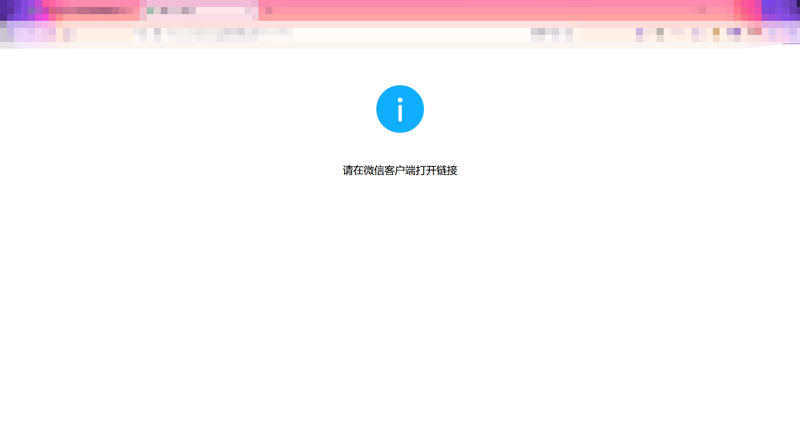

那可以F12把页面调成手机端

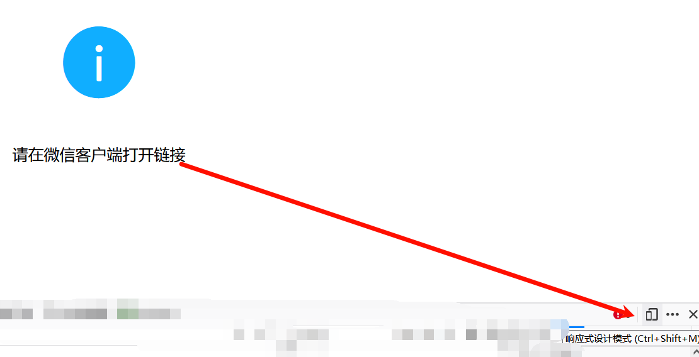

之后把UA头改为微信内置浏览器的UA头

<https://blog.csdn.net/qq_40738764/article/details/138656816>（收藏的500多条不同设备的微信浏览器UA头）

选一个刷新页面进入了一个体检的页面

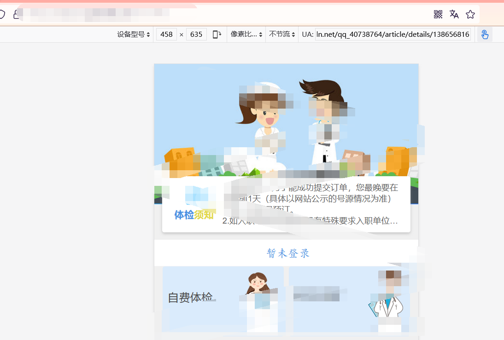

扫一下目录，找到了一个后台登录页面

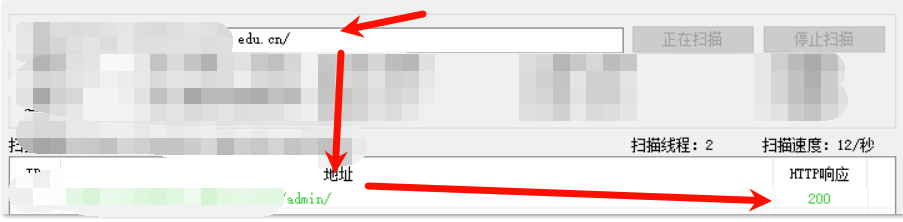

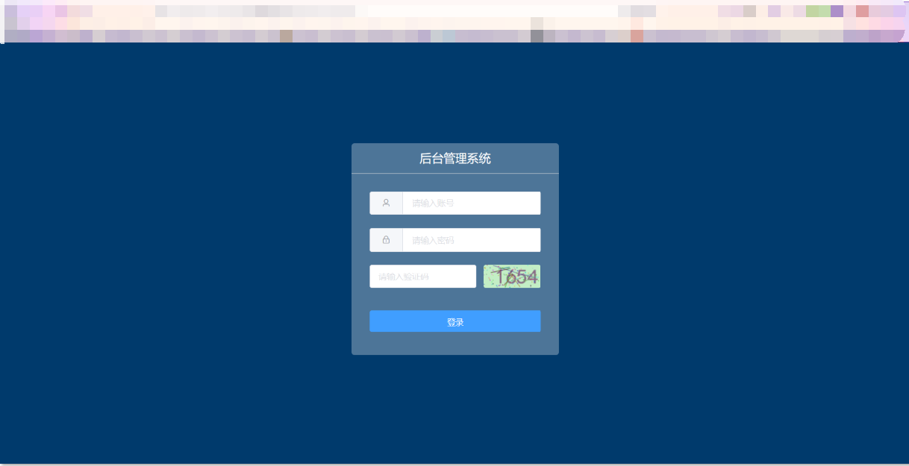

ok，下面就是edu经典的修改返回包

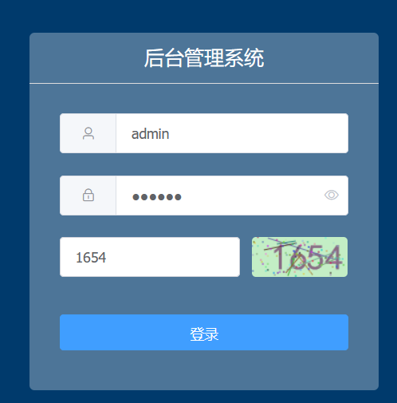

抓包

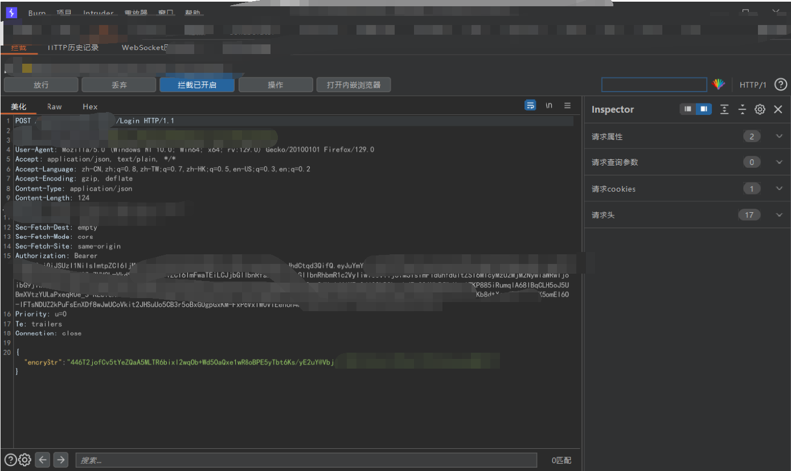

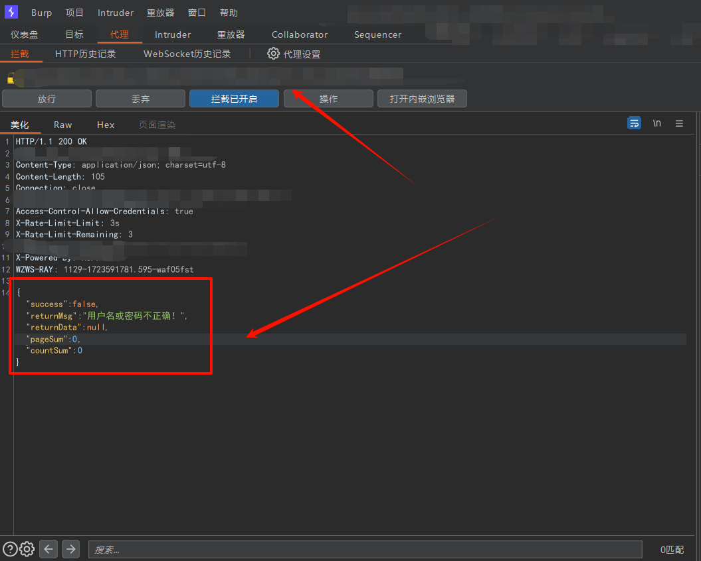

之后就是各种修改，success改为true，returnMag改为登录成功，但都无法进入

那就去看一下findsomething，可能会有一些意想不到的结果

果然看到了一个UserInfoByOpenId的接口

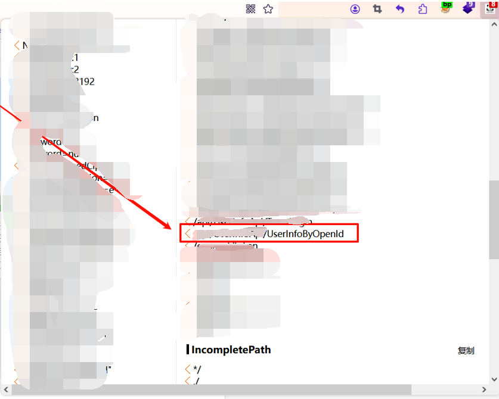

抓包看看提示openid为空或unerfind，注意观察返回的格式

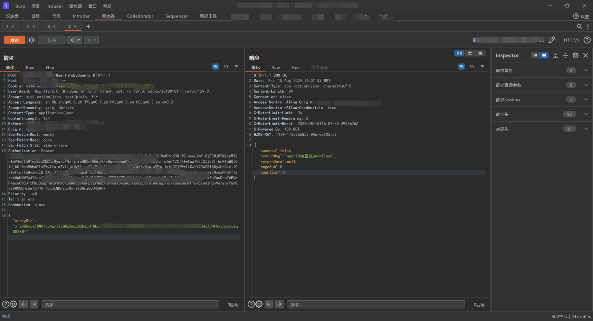

## 0x02

怎么获取到openid呢，回到一开始就提到了这个站就是指定要用微信浏览器打开。openId是为了识别用户，每个用户针对每个公众号或小程序等应用会产生一个安全的Id，公众号或应用可将此ID进行存储，便于用户下次登录时辨识其身份，或将其与用户在第三方应用中的原有账号进行绑定。那么，这个站点在微信上面会不会有一个一键登录呢。

​

ok，想法有了就打开proxifier抓微信的包

微信浏览器访问网站，什么操作都没有做，直接弹出了一个登录页面

抓包，他这里是直接记录了微信的openid，甚至都没有登录。

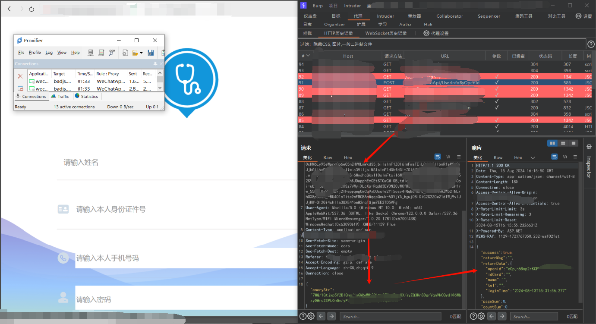

把响应包返回的结果记录下来，回到后台登录

之后就是将登录的响应包替换为记录的returnData，并且修改success为true，idCard、name为admin，将格式对齐

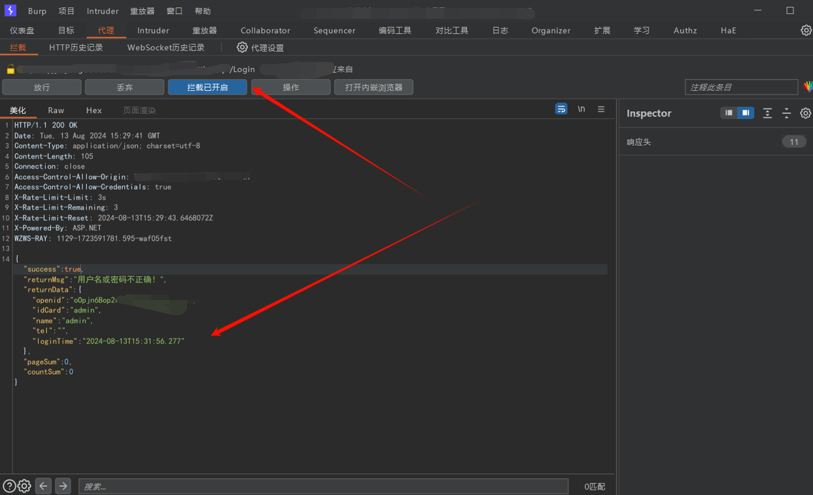

放包成功进入后台

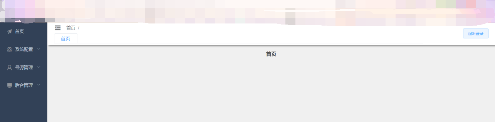

没数据？

那就抓包看看，最后也是拿下了全站数据

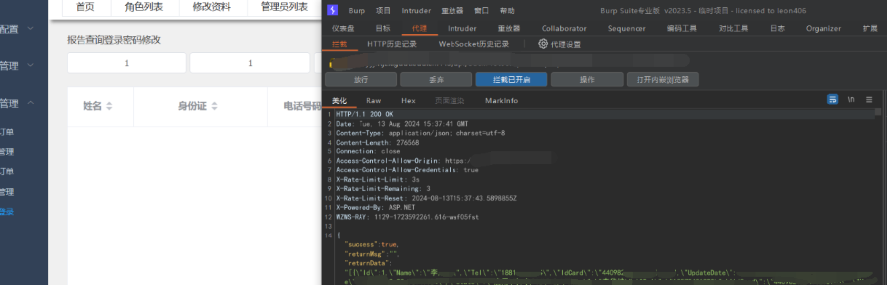
