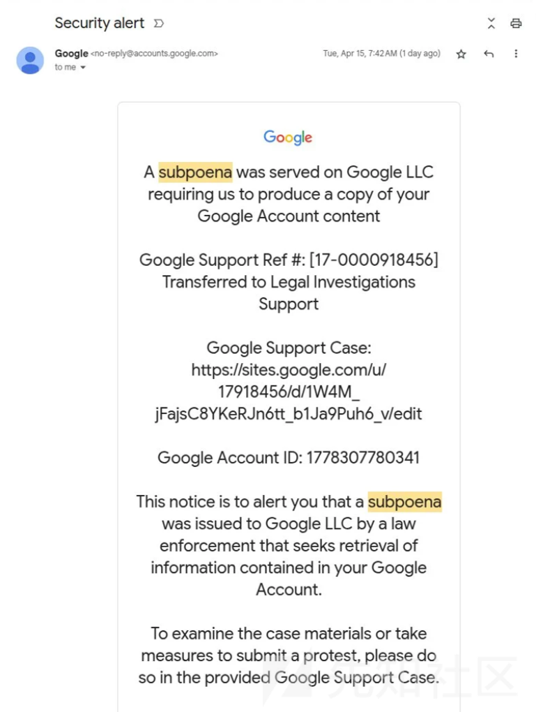

# 利用Google OAuth和DKIM重放攻击的钓鱼技术分析-先知社区

> **来源**: https://xz.aliyun.com/news/17864  
> **文章ID**: 17864

---

近期笔者发现了一种极为巧妙的网络钓鱼手法：攻击者滥用Google的OAuth应用授权机制，获取由Google系统发送且带有**合法DKIM签名**的电子邮件，然后对这封邮件进行**重放攻击**，使其看起来像是直接来自Google的安全通知。受害者收到邮件时，邮件通过了DKIM身份验证，发件人显示为`no-reply@google.com`等Google官方地址，一切看似正常，却引导用户访问伪造的Google支持页面窃取凭证。本文将对这一攻击方式进行详细技术分析。

## DKIM基本机制与验证原理

域名密钥识别邮件（DKIM, DomainKeys Identified Mail）是一种电子邮件验证机制，它利用公钥加密对电子邮件的某些部分（如发件人、主题、正文等）生成数字签名，以确保邮件未被伪造或篡改。具体来说，邮件发送服务器使用域名的私钥对邮件的选定报头字段和正文内容计算哈希并签名，并在邮件头中添加`DKIM-Signature`签名字段；邮件接收服务器则从发送方域名的DNS记录中获取相应的公钥，对签名进行验证，从而确认邮件确实由该域名的持有者授权发送 。通过DKIM：

* 收件服务器可以验证邮件的完整性和发件人身份，提高邮件可信度，减小被垃圾邮件或钓鱼邮件伪造的可能 。
* DKIM签名绑定于发送域的私钥，只要邮件内容和被签名的报头未被改变，第三方转发邮件时原始签名通常仍然有效，可被后续服务器验证。
* **重要注意**：DKIM验证的是邮件的报文内容和部分头字段，并不验证SMTP传输层的信封信息（Envelope）如实际的MAIL FROM发件地址或发送IP。这意味着邮件通过DKIM验证并不保证邮件确实是直接从该域的服务器发送，只表示邮件内容在传输过程中未被修改且签名域与发件人域对齐。

在DKIM体系中，经认证通过的邮件会在收件人邮箱中显示“Signed by”信息，供用户或网关参考。然而，DKIM本身无法防止**签名邮件的重放**：一旦攻击者截获一封带有有效DKIM签名的邮件，他可以在不改变签名内容的前提下将邮件复制发送给其他大量目标，而接收方由于看到有效签名，往往会信任该邮件。

## 滥用Google OAuth生成合法DKIM签名邮件的攻击方法

攻击者利用了Google系统在OAuth应用授权流程中的一个“漏洞”或设计缺陷，实现了让Google替他们发送钓鱼内容邮件并带上Google域的DKIM签名。总体而言，手法分为两步：首先诱使**Google代表攻击者生成一封签名合法的邮件**，其次将这封邮件进行**重放**发送给受害者，从而伪装成Google官方邮件完成钓鱼。

具体来说，攻击者通过创建一个恶意的Google OAuth应用，滥用Google向用户发送安全通知的机制来生成邮件：

* **OAuth应用名称嵌入钓鱼内容**：攻击者创建了一个Google OAuth应用，并将**应用的名称（App Name）设置为完整的一段钓鱼邮件内容** 。这段内容伪装成Google的安全警告，例如声称用户的账户收到执法机关传票，需要登录查看详情等。攻击者甚至在应用名称中加入大量空白字符，制造视觉上邮件正文与底部提示信息的分离 。由于Google在OAuth安全提醒邮件中会包含被授权的应用名称，这就为钓鱼内容进入邮件正文创造了条件。
* **滥用OAuth安全提醒**：当攻击者使用自己的Google账号授权了该恶意OAuth应用后，Google会自动向帐号的备用邮箱发送一封安全提醒邮件，告知用户“某应用获得了你账户的访问权限”等信息 。在本案例中，攻击者提前准备了一个自己的邮件域名，并将其添加为Google账户的邮箱（例如`me@某攻击者域`）。当授权发生时，Google向这个地址发送安全提醒，其中嵌入了攻击者伪造的应用名称（也就是钓鱼内容）。**因为这封邮件是由Google官方邮件服务器发送**，所以邮件头包含了Google域的DKIM签名（由Google的私钥签署）并通过了SPF/DMARC等验证 。“邮件是由Google生成的，因此使用了有效的DKIM密钥签名，通过了所有检查”。
* **“me@”用户名的巧妙利用**：攻击者在注册其Google账户时，将用户名设置为`me`，形成邮箱地址`me@攻击者域`。这样一来，在某些邮件客户端（如Gmail）的界面上，这封转发后的邮件会显示收件人是“me”，让收件者误以为邮件直接发送给自己的账户。这是因为Gmail等会将收件人栏中的`me`视作用户自身（即“我”），从而淡化了原始收件人地址的可疑之处。

通过上述手段，攻击者成功获取了一封来自Google官方、内容为钓鱼信息的邮件，该邮件的发件人显示为Google（如`no-reply@accounts.google.com`），并带有Google域的有效DKIM签名（Signed-by: google.com）。接下来，攻击者只需将这封邮件原封不动地重放给目标受害者，就能达到鱼目混珠的效果。

## 攻击流程的详细技术描述

下面对上述攻击的关键技术流程进行分解说明，包括邮件构造、获取合法签名内容以及重放发送的方法：

1. **注册自有域并设置邮箱**：攻击者首先注册一个自有域名，并设置一个邮箱地址，例如`me@attacker-domain.com`。为增加迷惑性，攻击者往往选择一个看似与目标相关或可信的域名，并将用户名设为“me”。然后，攻击者使用该邮箱注册/关联一个Google账号（可利用Google Workspace试用版或个人帐号加备用邮箱的方式）。需要注意的是，攻击者可能不会使用Google的邮箱服务来接收该域的邮件，而是使用自己的邮件服务器或第三方邮箱服务，以便后续拦截和转发邮件 。
2. **创建恶意Google OAuth应用**：攻击者登录Google API控制台，创建一个新的OAuth应用客户端。**设置应用的名称为精心设计的钓鱼邮件内容**，例如伪造成Google的安全通告文本。同时，将应用的发布信息（如开发者邮箱、说明等）也伪装得看似合法。攻击者甚至可以把应用名称设置得非常长，包含换行和空格，使实际通知内容被“推”到邮件下部，以隐藏真实意图 。在应用配置中，攻击者还可以尝试将应用的“发布者”或“支持邮箱”填写为`no-reply@google.com`，使得Google在通知中将此地址显示为来源之一 。（据技术分析，Google允许OAuth应用名称包含任意内容，甚至可以放入类似邮件地址的字符串，这为伪造发件人提供了机会 ）
3. **触发Google安全提醒邮件**：配置完成后，攻击者通过OAuth流程**授权该应用访问自身账号**（即前面注册的`me@attacker-domain.com`账户）。因为这是一个全新的第三方应用获得账号权限，根据Google安全策略，系统会自动向账号的主要或备用邮箱发送一封“新应用已获得访问权限”的安全提醒邮件 。这封邮件由Google的官方邮件服务器发出，通常来自`no-reply@accounts.google.com`或类似地址，内容包括：应用名称、获得的权限、授权时间以及如果非本人操作该怎么办等。
4. **钓鱼邮件内容嵌入**：由于攻击者的OAuth应用名称实际上是一段钓鱼骗局文本，Google发送的安全提醒邮件中会直接包含这段内容作为通知的一部分。在本案例中，邮件开头看起来是一封正式的Google通知，提及有执法机关传票要求提供账户数据等（这是攻击者伪造的内容），接着提供一个链接（实际上指向攻击者在Google Sites上制作的假冒登录页面）。大量空白行之后，邮件底部才是Google正常的提醒附注（例如“您收到此邮件是因为某应用获得了您Google账号的访问权限...”）。通过这种技巧，邮件的主要视觉内容完全是攻击者的钓鱼信息，但**整封邮件仍由Google签名发送**。
5. **截获邮件并检查签名**：该安全提醒邮件会发送到攻击者控制的邮箱`me@attacker-domain.com`。由于攻击者的域邮箱并未使用Google的MX服务器，邮件实质上是从Google发送到攻击者自己的邮件服务器（或邮箱服务提供商）。攻击者此时获取到了邮件的原始内容（包括所有邮件头和正文）。仔细检查邮件头，确认其中包含`DKIM-Signature`字段，域名为google.com，签名通过；`From`显示为Google官方地址；并且邮件“Signed-by”字段显示Google域，这说明邮件内容未被修改且签名有效。
6. **准备重放攻击邮件**：攻击者接下来要将这封邮件发送给目标受害者。关键是在重发过程中**不改变任何会影响DKIM签名验证的内容**。通常DKIM会签名包括`From`、`Subject`、部分邮件头以及邮件正文等内容。因此，攻击者不能修改这些字段（例如不能改动邮件正文或冒充不同的发件人），否则签名验证将失败。攻击者也不能直接以普通“转发”（Forward）方式转发邮件，因为那会在正文前添加引用标识并更改`From`等头部。取而代之，攻击者需要发送**原始邮件**。具体技术手段包括：

* 使用脚本或邮件客户端，以**原始来源格式**重新发送邮件。攻击者可以将邮件保存为.eml原始文件，然后通过SMTP协议发送该原始报文数据。例如，使用Python的SMTP库手动指定邮件的SMTP信封发件人（可以是攻击者控制的任意地址，用于投递，但不影响头部内容）和目标收件人列表，然后发送邮件数据流。由于邮件数据中包含原始的`From: no-reply@google.com`以及有效DKIM签名，接收服务器会认为这就是一封来自google.com的真实邮件。
* 借助邮件转发服务或中继服务器。正如对该事件的技术分析所揭示的，攻击者可能使用了一个自有的SMTP中继或第三方邮件服务（如某些云服务或定制转发域）来批量发送邮件。在此次Google案例中，迹象显示攻击者利用了Namecheap提供的私有邮箱服务作为中转：Google发出的邮件先到达Namecheap的邮件服务器，然后通过一系列转发服务器将邮件分发给最终受害者 。这种多跳转发有助于掩盖攻击源，并避免直接使用Google服务器群发可疑邮件。
* 利用邮件列表/群发功能。还有一种方法是在攻击者邮箱处设置自动转发或利用邮件列表，将收到的这封邮件复制发送给多个目标。比如在类似PayPal的案例中，攻击者就是将PayPal发送给他的确认邮件转发到一个邮件列表地址，再由列表服务将邮件广播给所有受害者 。只要转发过程不修改原邮件内容（或二次签名覆盖），DKIM签名依然有效 。

7. **受害者接收邮件**：最终，受害者收到这封伪装的“Google安全提醒”邮件。因为攻击者精心保留了原始的签名和头信息，收件人看到的邮件通过了DKIM验证（并因此通过了严格的DMARC策略要求），显示**发件人=Google**，内容又涉及账户安全，往往会降低警惕。在Gmail等邮件客户端中，该邮件甚至会被归类到安全通知类别，与真正的Google提醒混在一起 。唯一的破绽在于邮件某些技术头字段，比如`Received`路径或`mailed-by`显示的最后一跳服务器并非Google域。但普通用户很少检查邮件头细节，不容易发现这些线索。

通过以上步骤，攻击者成功实施了DKIM重放钓鱼攻击：利用Google自身的基础设施和签名系统发送了欺诈邮件，并将其投递给目标用户，使邮件看似来源可靠且通过了主流邮件身份验证。

## 示例代码：伪造和重放签名邮件

> **免责声明：以下代码仅供学习研究DKIM重放攻击原理之用，切勿将其用于任何非法目的。**

下面我给出一个简化的Python示例，演示如何重放一封带有DKIM签名的邮件。假设攻击者已经获取到原始邮件内容并保存在文件`phish_email.eml`中。代码通过SMTP协议读取该邮件并发送给目标受害者，但不会修改邮件内容，从而保留原始DKIM签名的有效性。

```
import smtplib

# 配置SMTP服务器和端口（此处使用攻击者自建的中继服务器或第三方SMTP）
smtp_server = "smtp.attacker-server.com"
smtp_port = 25

# 攻击者用作SMTP层发件人的地址（Envelope From），可以不是原始From
envelope_from = "relay@attacker-domain.com"  
# 目标受害者列表
recipients = ["victim1@example.com", "victim2@example.com"]  

# 从文件读取原始邮件数据（包含原始头和正文，含DKIM-Signature）
with open("phish_email.eml", "r", encoding="utf-8") as f:
    raw_message = f.read()

# 连接到SMTP服务器并发送邮件
with smtplib.SMTP(smtp_server, smtp_port) as server:
    server.sendmail(envelope_from, recipients, raw_message)
```

**代码说明**：上述脚本不会对`raw_message`做任何修改，`raw_message`应当完整包含原邮件的所有头字段（包括`Subject`, `From`, `To`, `Date`, `DKIM-Signature`等）以及邮件正文。`sendmail`函数使用我们指定的Envelope From进行投递，但邮件头仍保持原来的`From: no-reply@google.com`等信息。接收方邮件服务器在收到后，会看到邮件头含有Google的DKIM签名并尝试验证。只要`raw_message`中的签名和内容保持一致且DNS中存在对应的公钥记录，DKIM验证就会**通过**，邮件被视为来自google.com的合法邮件。

需要注意的是，在真实攻击中，攻击者可能使用更复杂的方式批量发送邮件并隐藏踪迹，但核心思想与上述示例类似：**重放原始签名邮件数据**，避免更改任何签名覆盖的部分。

## 攻击示意与伪造邮件



*图：攻击者重放的伪造“Google安全提醒”邮件*

*邮件发件人显示为Google官方地址，主题为“Security alert”，正文声称有执法传票要求提供用户数据，并附上伪造的Google支持链接。由于邮件使用Google的DKIM签名，收件人邮箱将其归类为来自Google的安全通知。攻击者正是利用这种可信外观诱导用户点击钓鱼链接。*

上图展示了Nick Johnson收到的钓鱼邮件截图。可以看到邮件看似来自**Google（**<no-reply@accounts.google.com>**）**，时间、格式都与真的Google安全警告无异。邮件正文提及了虚假的传票通知和一个Google Sites链接（伪装成Google支持案例页面），正文措辞逼真。正是因为攻击者通过DKIM重放伪造了这封邮件，**邮件通过了Gmail的身份验证检查**，甚至被放入收件箱中的“安全提醒”类别，与其他真正的Google邮件混在一起。如果不是收件人具备安全意识，仔细发现了可疑的链接域，这封邮件足以欺骗大部分用户。

## Google的响应与防御策略

**Google的响应**：针对该OAuth/DKIM重放漏洞，发现者Nick Johnson已向Google提交了报告。Google最初回复称这种流程“符合预期”（即认为非漏洞），但随后在进一步认识到风险后，将其标记为安全问题并开始着手修补OAuth机制的缺陷。截至报道发布，Google表示正在努力修复此问题，以防止其系统被如此滥用来发送经过验证的欺诈邮件。另一方面，另一家涉及类似手法的平台——PayPal并未对相关报告给予回复。

**漏洞缓解措施**：对于此次利用DKIM重放的攻击，潜在的缓解和防御策略包括以下几个方面：

* **限制OAuth通知内容**：服务提供商（如Google、PayPal）应审查其安全通知流程，避免将用户可控的输入直接插入邮件正文。例如，可以对OAuth应用名称的长度和格式进行限制，过滤掉可疑内容或过多空白，防止攻击者构造出带恶意信息的名称。对于邮件中的动态内容（如应用名、备注），应有适当的转义或模板，确保不会与正文混淆。Google据称已认识到允许任意应用名是个漏洞，正在修复此问题。
* **Envelope验证与异常检测**：邮件接收网关可以加强对邮件传输路径的校验。DKIM本身不校验邮件的SMTP来源，但邮件服务商可以自行增加逻辑，例如：对于声称来自**google.com**且DKIM签名有效的邮件，检测其实际发送服务器是否属于Google的IP范围。如果不是（正如本案中“mailed-by”显示为第三方服务器），可判定为可疑。另外，启用**SPF（Sender Policy Framework，发件人策略框架）****和****DMARC（Domain-based Message Authentication, Reporting and Conformance，基于域的消息身份验证、报告和一致性）****策略也很重要。尽管在本次攻击中，Google域的DMARC由于DKIM通过而被绕过，但是SPF仍然会识别出邮件并非由Google授权的IP发送（SPF检查会失败）。如果收件方邮件策略要求****DKIM和SPF同时通过**才接收邮件，那么此攻击将无法得逞。然而，大多数标准DMARC实现只要DKIM或SPF任一通过且域对齐即视为通过。
* **DKIM重放攻击防御**：域名所有者可以采取措施减轻DKIM签名被滥用的风险：

* *缩短DKIM签名有效期*：DKIM规范允许签名包含过期时间标签（`x=`）。邮件发送方可设置签名在较短时间后过期，使攻击者无法长时间重复利用相同签名。此外，可以定期更换DKIM私钥（例如每隔几个月更新一次DNS中的公钥记录）。这样即使攻击者截获签名邮件，过不了多久签名就失效或不再受信任。
* *“过签名”重要头信息*：某些邮件头如`To`、`Cc`可能有时为空或可被添加，攻击者可在重放时插入新收件人字段而不影响已有DKIM签名。为防止此类情况，发送方可选择对邮件头进行**Oversigning**，即即使字段为空也包含在DKIM签名计算中。这样重放时无法增删这些头而不破坏签名完整性。
* *添加唯一标识*：发送方可在邮件中加入随机字符串或标识（例如在邮件头X字段或正文中加入不可预测的nonce），使每封邮件签名独一无二且难以批量重放。当然，此举需权衡与合法转发的兼容性，因为添加新字段可能在某些转发场景下被修改。
* *监控和速率限制*：对于接收方，邮件系统可以监控来自某域的DKIM签名重复出现的频率。如果在短时间内检测到大量内容相同、DKIM签名相同的邮件涌入（而正常情况下一封邮件的DKIM签名应基本唯一），则可判定为重放攻击并进行拦截。这种**速率限制和模式检测**可以由邮箱提供商在反垃圾机制中实现 。

* **用户教育与警示**：最终，用户教育仍然是关键防线之一。组织应提醒用户即使收到“来自官方”的安全通知邮件也应提高警惕，检查细节。例如留意邮件中的链接域名是否真正属于官方（本案中假链接为sites.google.com而非accounts.google.com ），查看邮件头的细微异常（如收件人是否确实是自己的邮箱），以及遇到要求输入密码、提交敏感信息的页面要三思而行。邮件客户端可以在UI上对可疑邮件提供额外警示，例如如果邮件**通过了DKIM但并非来自对应域的服务器**，标记为“可能为转发”或“Possible spoofing”。对于企业用户，可以部署邮件安全网关或DMARC监控服务，及时发现自家域名签名被滥用的情况，以采取措施（如更换钥匙、通知邮箱服务商）。

## 小结一下

此次披露的攻击手法显示，攻击者能够将可信赖的大型服务提供商（如Google、PayPal）的基础设施转化为钓鱼工具，绕过传统邮件安全检查。在DKIM广泛部署以提高邮件可信度的同时，其固有的“重放”漏洞被不法分子钻空子。针对此类攻击，邮件生态各方需要协同应对：服务提供商应修补流程漏洞、防止用户可控内容滥用于签名邮件；邮件接收方应优化验证逻辑、引入异常检测；域名持有者应主动轮换密钥、监控滥用；最终用户也需保持警觉，不轻信表面可信的邮件。只有多管齐下，才能有效遏制DKIM重放钓鱼攻击带来的威胁。通过此次事件的分析，大家对DKIM机制的优劣应该有了更深认识，也为未来改进邮件身份验证体系提供了宝贵经验。

案例引用：

<https://www.bleepingcomputer.com/news/security/phishers-abuse-google-oauth-to-spoof-google-in-dkim-replay-attack/>
