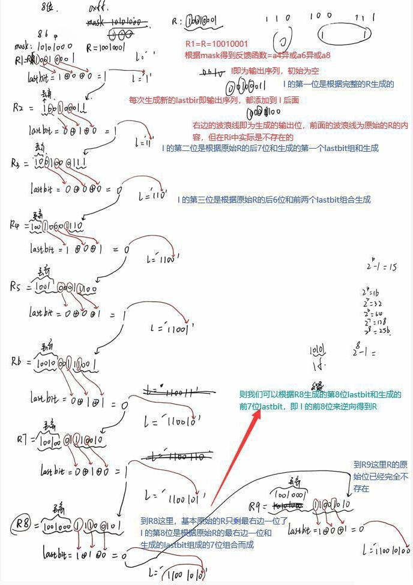
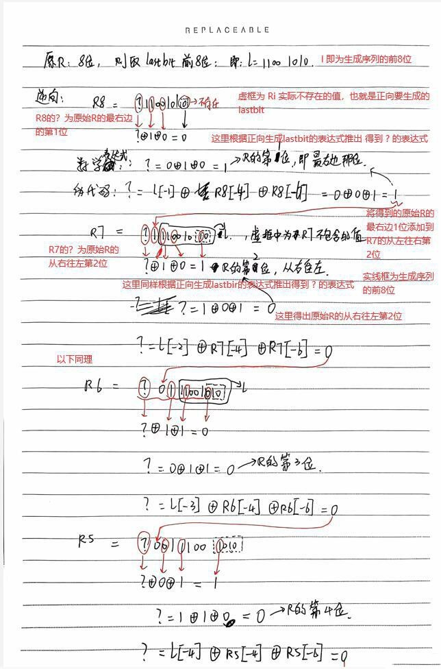
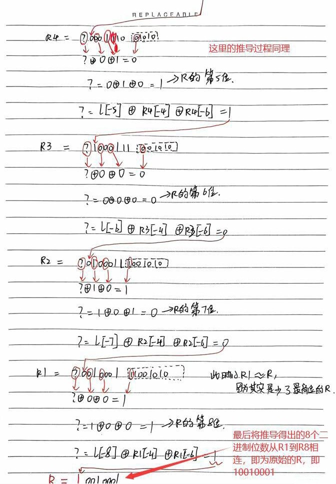
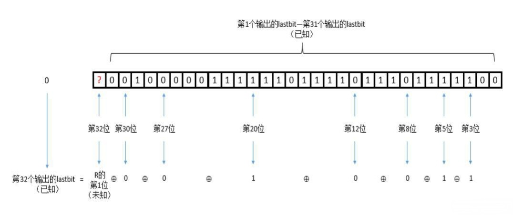
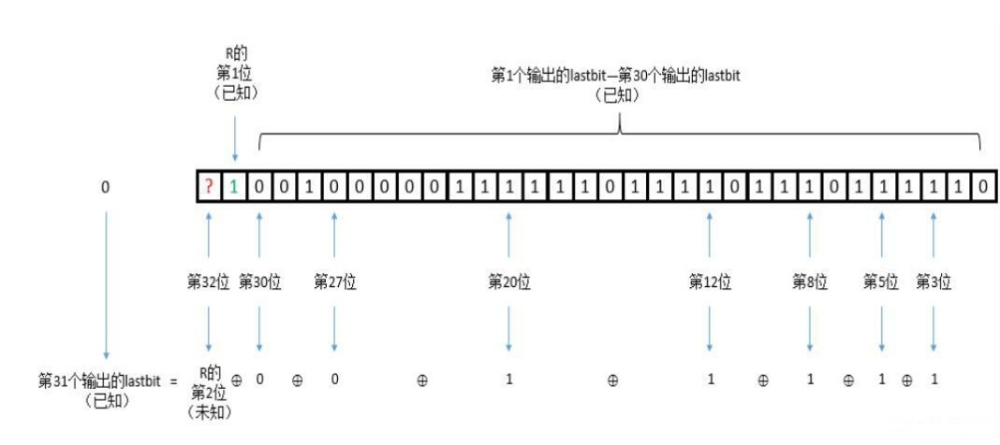
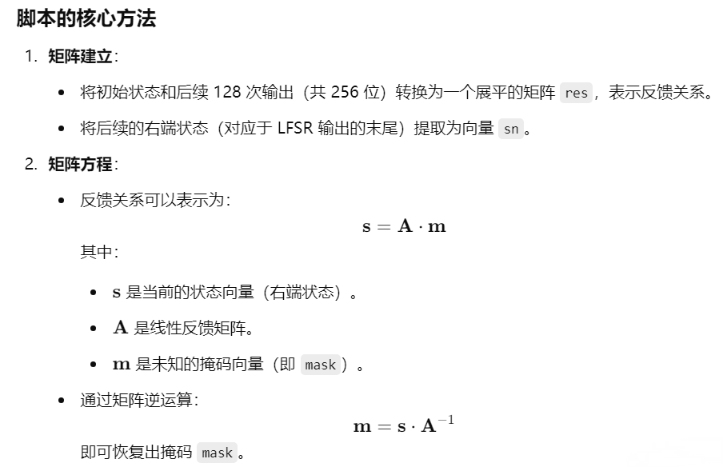
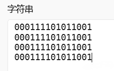

# ctf-Crypto密码学-LFSR线性反馈移位寄存器-先知社区

> **来源**: https://xz.aliyun.com/news/17876  
> **文章ID**: 17876

---

在打比赛的过程中，已经遇到了好多lfsr（线性反馈移位寄存器）相关的题目，一直没有进行深入的学习，现在用一道经典的题目进行学习。

废话不多说，直接上题目和解题过程。

## 第一类、给出输出序列和掩码mask，求初始状态（或者说是种子seed）

### 例题-CISCN2018 oldstreamgame

题目代码

```
flag = "flag{xxxxxxxxxxxxxxxx}"
assert flag.startswith("flag{")
assert flag.endswith("}")
assert len(flag)==14
def lfsr(R,mask):  # 传入flag与mask
    output = (R << 1) & 0xffffffff

    i=(R&mask)&0xffffffff
    lastbit=0
    while i!=0:
        lastbit^=(i&1)
        i=i>>1

    output^=lastbit
    return (output,lastbit)

R=int(flag[5:-1],16)  # flag
mask = 0b10100100000010000000100010010100

f=open("key","w")
for i in range(100):
    tmp=0
    for j in range(8):
        (R,out)=lfsr(R,mask)
        tmp=(tmp << 1)^out
    f.write(chr(tmp))
f.close()
```

附件key的内容，这个内容是从其他博主的文章中拿来的，真实啥样也不知道≡(▔﹏▔)≡

```
key=20FDEEF8A4C9F4083F331DA8238AE5ED083DF0CB0E7A83355696345DF44D7C186C1F459BCE135F1DB6C76775D5DCBAB7A783E48A203C19CA25C22F60AE62B37DE8E40578E3A7787EB429730D95C9E1944288EB3E2E747D8216A4785507A137B413CD690C
```

还有一个，大家就看着用吧

```
 婶?3?婂?=鹚z?V?]鬗|lE浳_肚gu哲悍鋳 <??`産硙桎x悃x~?s
暽釘B堧>.t}?U??蚷
```

还有一个版本 (我用这个)

```
0b100000111111011110111011111000101001001100100111110100000010000011111100110011000111011010100000100011100010101110010111101101000010000011110111110000110010110000111001111010100000110011010101010110100101100011010001011101111101000100110101111100000110000110110000011111010001011001101111001110000100110101111100011101101101101100011101100111011101011101010111011100101110101011011110100111100000111110010010001010001000000011110000011001110010100010010111000010001011110110000010101110011000101011001101111101111010001110010000000101011110001110001110100111011110000111111010110100001010010111001100001101100101011100100111100001100101000100001010001000111010110011111000101110011101000111110110000010000101101010010001111000010101010000011110100001001101111011010000010011110011010110100100001100
```

这个key的2进制表示是第一个16进制key对每个字符转化为4位的2进制位表示的。最前面的第一个16进制数2转换为2进制后前面的两个0省略了，即本来是0b0010，省略后是0b10，文章后面也会进行解释。

已知的内容都列出来了，下面先分析代码

```
flag = "flag{xxxxxxxxxxxxxxxx}"
assert flag.startswith("flag{")
assert flag.endswith("}")
assert len(flag)==14
```

这是确定flag的格式，flag一共14长，除去flag{}这6个字符，中间应该包含8个字符

```
def lfsr(R,mask):  # 传入R与mask
    output = (R << 1) & 0xffffffff  # 将R左移一位并取低32位。即 将R整体左移一位，最后一位补0，取低32位赋值给output，
    i = (R & mask) & 0xffffffff  # R与mask进行 与 操作，并取低32位
    lastbit = 0  # lastbit，字面意思即 最后一位，也就是输出序列的每一位
    while i != 0:  # while循环的作用即为，i的每一位都与lastbit 异或 后再赋值给lastbit，
        lastbit ^= (i & 1)  # i的最后一位与1进行 与 操作，即 取了i的最后一位，然后该位与lastbit进行 异或 后赋值给lastbit
        i = i >> 1  # i向右移动一位
    output ^= lastbit  # 将lastbit添加到output的最后一位
    return (output,lastbit)  # 返回output与lastbit
```

这个叫做**lfsr**的函数是实现**线性反馈移位寄存器**中的从**初始状态**根据**反馈函数**得到**输出序列**的过程的代码实现，每一行的解释已经注释了，本质上就是一个**输入R输出output和lastbit的函数**

```
R=int(flag[5:-1],16)  # flag，初始状态
mask = 0b10100100000010000000100010010100
```

R为flag{}中的内容，即一个8长的16进制表示的字符串，将其转换为了十进制。

mask为定义的一个值，长32位的二进制数，长度对应了flag中的字符的值，8长16进制的内容，每一个字符占4位，8长即32位。

mask的二进制形式的值也确定了**线性反馈移位寄存器**中的**反馈函数**的形式（为什么确定，这里给出一段其他师傅写的解释）

```
mask只有第3、5、8、12、20、27、30、32这几位为1，其余位均为0。
mask与R做按位与运算得到i，当且仅当R的第3、5、8、12、20、27、30、32这几位中也出现1时，i中才可能出现1，否则i中将全为0。
lastbit是由i的最低位向i的最高位依次做异或运算得到的，在这个过程中，所有为0的位我们可以忽略不计（因为0异或任何数等于任何数本身，不影响最后运算结果），因此lastbit的值仅取决于i中有多少个1：当i中有奇数个1时，lastbit等于1；当i中有偶数个1时，lastbit等于0。
当R的第3、5、8、12、20、27、30、32这几位依次异或结果为1时，即R中有奇数个1，因此将导致i中有奇数个1；当R的第3、5、8、12、20、27、30、32这几位依次异或结果为0时，即R中有偶数个1，因此将导致i中有偶数个1。
因此我们可以建立出联系：lastbit等于R的第3、5、8、12、20、27、30、32这几位依次异或的结果。
```

这段话最重要的是根据**代码分析**得出**数学联系**，即：

```
lastbit等于R的第3、5、8、12、20、27、30、32这几位依次异或的结果
```

个人理解，也就是得到了反馈函数的表达式，即

f(a32,a32,...a2,a1)=a32⊕a30⊕a27⊕a20⊕a12⊕a8⊕a5⊕a3=lastbit

到这里，以上代码就基本实现了**线性反馈移位寄存器**最重要的部分，后面的就是**循环使用**该函数，生成**输出序列**，然后将输出的内容转换成字符写到一个文件中

```
f=open("key","w")  # 打开叫做key的文件，以写的方式
for i in range(100):  # 100次循环
    tmp=0
    for j in range(8):  # 8次循环
        (R,out)=lfsr(R,mask)  # 调用lfsr函数，生成输出内容
        tmp=(tmp << 1)^out  # 将lfsr生成的内容附加到tmp上
    f.write(chr(tmp))  # 将每8个一组的输出内容转换为字符写到文件中，最后文件中共有100个字符
f.close()
```

到这里，代码基本分析完成，下面列出已知的内容

```
mask = 0b10100100000010000000100010010100
key = 0b100000111111011110111011111000101001001100100111110100000010000011111100110011000111011010100000100011100010101110010111101101000010000011110111110000110010110000111001111010100000110011010101010110100101100011010001011101111101000100110101111100000110000110110000011111010001011001101111001110000100110101111100011101101101101100011101100111011101011101010111011100101110101011011110100111100000111110010010001010001000000011110000011001110010100010010111000010001011110110000010101110011000101011001101111101111010001110010000000101011110001110001110100111011110000111111010110100001010010111001100001101100101011100100111100001100101000100001010001000111010110011111000101110011101000111110110000010000101101010010001111000010101010000011110100001001101111011010000010011110011010110100100001100
```

mask即为得到**反馈函数**的值，key即为文件中的内容转换为二进制的内容，即为**输出序列**，但是这个key只有798位，按道理应该有800位，因为外循环100次，内循环8次，lfsr一共生成了800个二进制数，这是因为python在输出二进制数值时，会将最前面的0忽略，所以在前面添加2个0

```
key = 0b00100000111111011110111011111000101001001100100111110100000010000011111100110011000111011010100000100011100010101110010111101101000010000011110111110000110010110000111001111010100000110011010101010110100101100011010001011101111101000100110101111100000110000110110000011111010001011001101111001110000100110101111100011101101101101100011101100111011101011101010111011100101110101011011110100111100000111110010010001010001000000011110000011001110010100010010111000010001011110110000010101110011000101011001101111101111010001110010000000101011110001110001110100111011110000111111010110100001010010111001100001101100101011100100111100001100101000100001010001000111010110011111000101110011101000111110110000010000101101010010001111000010101010000011110100001001101111011010000010011110011010110100100001100
```

目前已知**反馈函数**，**输出序列**，因为R的值为8个16进制数，转换为二进制即为32位，而mask也为32位，则可以根据key的**前32个二进制位**还原出**初始状态R**

具体的原理如图，图为手画推导，以8位初始状态R=10010001和mask=10101000为例

先给出**正向**得出**输出序列**的推导，有一些草稿抱歉( ╯□╰ )

以上为**正向**根据**初始状态**和**反馈函数**得到**输出序列**的细节

下面给出**逆向推导**原始R的图片，字迹潦草抱歉了啊(;´༎ຶД༎ຶ`)

以上为**逆向推导**得出原始R的过程，字迹有些曲折，给大家两张其他师傅的图洗洗眼睛(￣y▽,￣)╭ (￣y▽,￣)╭ ，但是只有两张，给出我自己的推导过程，也是因为梳理整体思路 这张图表示了我们的题目中的内容，即生成序列的第32位是根据R的第1位，也就是从右往左的第1位和前面生成的31位lastbit组合生成的 同理，这是**输出序列**的第31位的生成过程

然后我们根据**逆向推导**的具体细节，就可以写出代码，然后得出原始的R了

解题脚本

```
mask = '10100100000010000000100010010100'
key = '00100000111111011110111011111000'  # 生成序列的前32位
 
tmp=key  # 暂存
# 题解
R = ''  # 空字符串R用于存储得到的R
for i in range(32):  # 32次循环得到完整的R
    output = '?' + key[:31]  # 这里即为从第32轮开始到第1轮的不含第一位的Ri
    ans = int(tmp[-1-i])^int(output[-3])^int(output[-5])^int(output[-8])^int(output[-12])^int(output[-20])^int(output[-27])^int(output[-30])
    # 根据推导表达式得到的生成原始R的代码，int(tmp[-1-i])为相应轮次中输出序列输出的lastbit，后面的其他值即为根据反馈函数需要使用的Ri的值
    R += str(ans)  # 将得到的R的值添加到空字符串中
    key = str(ans) + key[:31]  # 这里将得出的R添加到key的最前面，用于更新Ri
 
R = format(int(R[::-1],2),'x')  # 字符串得到的R是从第32轮到第1轮的R的值，需要逆置得到真实的R的值，然后转换为16进制
flag = "flag{" + R + "}"
print(flag)  # flag{926201d7}
```

代码具体的解释已经写到了注释中

最后得到flag，8位16进制的数

## 第二类、给出初始状态和输出序列，求掩码mask

可以使用B-M算法，对于算法的介绍：<https://ctf-wiki.org/crypto/streamcipher/fsr/lfsr/>

但是使用B-M的前提是知道2n长的输出序列。B-M的具体使用还不懂

但这里使用矩阵的逆运算，是一种笨一点的方法，但胜在好理解

### 例题题目：

这题是某位师傅问我的，具体哪里来的不晓得，感觉挺不同就学了一下

```
from Crypto.Util.number import *
import random
from secrets import mask
 
def lfsr(R, mask):
    output = (R << 1) & 0xffffffffffffffffffffffffffffffff
    i = (R & mask) & 0xffffffffffffffffffffffffffffffff
    lastbit = 0
    while i != 0:
        lastbit ^= (i & 1)
        i = i >> 1
    output ^= lastbit
    return (output, lastbit)
 
 
flag = b'flag{' + mask + b'}'
mask = b'******'
num_mask = bytes_to_long(mask)
R = random.getrandbits(128)  # 176011035589551066670092363165068881602
print(R)
for _ in range(128):
    R, out = lfsr(R, num_mask)
print(R)
# 176011035589551066670092363165068881602
# 157117237038314150714243518116791116977
```

可以看到第一次输出的R，即为**初始状态**，也就是种子seed，

第二次输出的R，是128个**输出序列**，看到这里只给出了n长的序列，所以不能使用B-M

而flag的即为mask，我们要反求出mask

解题脚本1：来自 <https://www.cnblogs.com/naby/p/18487794>

```
# sagemath
seeds=[176011035589551066670092363165068881602,157117237038314150714243518116791116977]  # 初始状态与后续输出序列
seed="".join([bin(i)[2:].zfill(128) for i in seeds])  # 将初始状态和后续输出转换为二进制连起来
key=seed
lfsr_bits=128
 
r = seed
a = []
for i in range(len(r)):  # 将二进制字符串每个字符存储到数组中
    a.append(int(r[i]))
 
res = []  # res 是一个展平的矩阵，最终用于创建 LFSR 的反馈矩阵 A
# 将二进制表达式转换为128个方程组的形式，也就是矩阵的形式
for i in range(lfsr_bits):  # 外层循环为行
    for j in range(lfsr_bits):  # 内层循环为列
        if a[i+j]==1:
            res.append(1)
        else:
            res.append(0)
 
sn = []  # 提取矩阵右端的状态,sn 表示 LFSR 当前状态向后移位一次后的右端状态
for i in range(lfsr_bits):
    if a[lfsr_bits+i]==1:
        sn.append(1)
    else:
        sn.append(0)
 
MS = MatrixSpace(GF(2),lfsr_bits,lfsr_bits)  # 128×128 的二进制矩阵空间
MSS = MatrixSpace(GF(2),1,lfsr_bits)  # 1×128 的二进制矩阵空间
A = MS(res)  # 将展平的矩阵 res 转换为一个实际的 128×128 矩阵,即反馈矩阵
s = MSS(sn)  # 将 sn 转换为 1×128 矩阵，s 是右端状态（sn）
inv = A.inverse()  # 求矩阵 A 的逆矩阵,inv 是反馈矩阵的逆矩阵，用于将已知状态和反馈机制反推出 LFSR 的掩码 mask
mask = s*inv  # 通过矩阵运算 s * inv，计算出掩码矩阵 mask
 
flag=""
for i in mask[0]:  # 将掩码矩阵的第 1 行转换为二进制字符串并转为整数
    flag+=str(i)
flag=int(flag,2)
print(flag)  # 87985526350865221468704373212448903457
from Crypto.Util.number import *
print(long_to_bytes(flag))  # b'B1e_ju@n_le_QAQ!'
```

Naby师傅太强了┗|｀O′|┛ 嗷~~

这里给出一张GPT分析的过程

 还没有手推过，先看看，后面手推一遍我再补充

解题脚本2：来自 <https://blog.csdn.net/weixin_52640415/article/details/143099594>

```
 
c0 = 165943427582675380464843619836793254673
c1 = 176011035589551066670092363165068881602#299913606793279087601607783679841106505
c2 = 157117237038314150714243518116791116977#192457791072277356149547266972735354901
 
#left*mask = right
c = ''.join([bin(i)[2:].zfill(128) for i in [c1,c2]])  # c1 和 c2 转换为二进制字符串，并按长度 128 位补零（zfill(128)）
c = [int(i) for i in c]  # 将拼接的二进制字符串 c 转换为一个数字列表，其中每个元素是二进制位的值（0 或 1）
left = matrix(GF(2),[c[i:i+128] for i in range(128)])
# 构造 left 矩阵：取 c 的前 128 位，逐行取长度为 128 的块，形成 128×128 的矩阵。这个矩阵代表 LFSR 的反馈矩阵
right = matrix(GF(2),[c[i+128:i+129] for i in range(128)])
# 构造 right 矩阵：从 c 的第 129 位开始，每次取一位，形成一个 128×1 的列向量。这个列向量是 LFSR 的输出状态。
M = left.solve_right(right)
# 使用线性代数方法求解 left⋅mask=right，得到反馈掩码 mask
# solve_right用于求解矩阵方程，返回 mask 的列向量表示
 
mask = int(''.join([str(i[0]) for i in M]) ,2)  # 将矩阵 𝑀M 中的列向量形式（每一行是一个二进制位）转换为二进制字符串，然后再转为十进制整数，得到最终的 mask
print(mask)  # 87985526350865221468704373212448903457
from Crypto.Util.number import *
print(long_to_bytes(mask))  # b'B1e_ju@n_le_QAQ!'
```

基本逻辑与脚本1相同，不过更简练。

## 一些简单的测试

简单介绍，lfsr，即**线性反馈移位寄存器**，简单来说就是根据**初始状态**和**反馈函数**得到一个**输出序列。**具体的实现过程这里就不给出了，可以查看其他师傅的文章了解学习。

### 测试一：正向测试

这里的正向测试，也就是手推正向过程之前使用代码进行了测试

```
def lfsr(R,mask):  # 传入flag与mask
    output = (R << 1) & 0xff
    print('中间的R:',bin(output))  # 即为当前轮次使用的Ri
    i=(R&mask)&0xff
    lastbit=0
    while i!=0:
        lastbit^=(i&1)
        i=i>>1
    output^=lastbit
    return (output,lastbit)
 
R = 0b10010001  # 初始状态
mask = 0b10101000
l = ''  # 空的输出序列
i = 0
print("正向测试")
for i in range(0,8):
    print(i+1)
    print('之前的R:', bin(R))  # 即为当前轮次使用的Ri之前的Ri
    R, out = lfsr(R, mask)
    print('之后的R:', bin(R))  # 即为当前轮次后面的轮次使用的Ri，也就是下一轮的Ri
    print('lastbit:', out)  # 即为当前轮次的生成的输出序列
    l += str(out)
    print()
print(l)  # 最后输出8轮lsfr的生成序列
```

最后得到的 l 与手推得到的 l 一致，都是11001010

### 测试二：循环测试

在查阅关于lfsr的资料的过程中，在其他师傅的文章中看到这样一句话

> 对于一个**n级**的LFSR来讲，其最大周期为**2^n-1** ，因此对于我们上面的**5级**LFSR来讲，其最大周期为 **2^5-1=31**，再后面的输出序列即为前31位的**循环**。

于是对于LFSR的**循环**进行了探索，发现只有当**反馈多项式**是一个 本原多项式时，才会达到最大周期**2^n-1**，那么什么是**本原多项式**呢(⊙o⊙)？，哈哈，这里就不多解释了，因为我也还没特别清楚啊－O－

只是简单验证了一下在4级LFSR上，使用一个4阶的本原多项式x^4+x+1（在模2的有限域中），最大周期是否为2^4-1=15

```
def lfsr(R,mask):  # 传入flag与mask
    output = (R << 1) & 0xf
    print('中间的R:',bin(output))
    i=(R&mask)&0xf
    lastbit=0
    while i!=0:
        lastbit^=(i&1)
        i=i>>1
    output^=lastbit
    return (output,lastbit)
 
R = 0b1001  # 输出状态
mask = 0b1001  # 本原多项式对应需要的mask
l = ''
 
for j in range(60):  # 生成60个输出序列
    (R, out) = lfsr(R, mask)
    l += str(out)
print("循环测试")
print(l)  # 000111101011001000111101011001000111101011001000111101011001
```

对输出序列进行了验证，确实是以15长为循环，如下



当使用的**反馈多项式**不是**本原多项式**时，**输出序列**的循环大小就达不到最大循环了，但是也是循环的。

最后暂时完结，有需要再来补充啊ヾ(^▽^\*)))

参考文章：

[LFSR | DexterJie'Blog](https://dexterjie.github.io/2023/07/12/%E6%B5%81%E5%AF%86%E7%A0%81/%E6%B5%81%E5%AF%86%E7%A0%81-LFSR/#%E4%BE%8B%E9%A2%981-CISCN2018-oldstreamgame)

[CTF中的LFSR考点(一)\_ctf lfsr-CSDN博客](https://blog.csdn.net/xiao__1bai/article/details/120392307)

[深入分析CTF中的LFSR类题目（一）-安全客 - 安全资讯平台](https://www.anquanke.com/post/id/181811)

[线性反馈移位寄存器 - LFSR - CTF Wiki](https://ctf-wiki.org/crypto/streamcipher/fsr/lfsr/)

[[CISCN2018]oldstreamgame （考点: LFSR）-CSDN博客](https://blog.csdn.net/MikeCoke/article/details/113853227)

[攻防世界：streamgame1（考点：LFSR）\_攻防世界简单的lfsr-CSDN博客](https://blog.csdn.net/MikeCoke/article/details/113847890?spm=1001.2014.3001.5502)
