# Vulnerability: API Security-先知社区

> **来源**: https://xz.aliyun.com/news/17879  
> **文章ID**: 17879

---

API Security这个模块在今年一月就更新了，两个月之前就准备完成它，但是当时使用的是kali，因为不想改环境，就放下了，今天就想着把它完成了。

​

## 环境问题

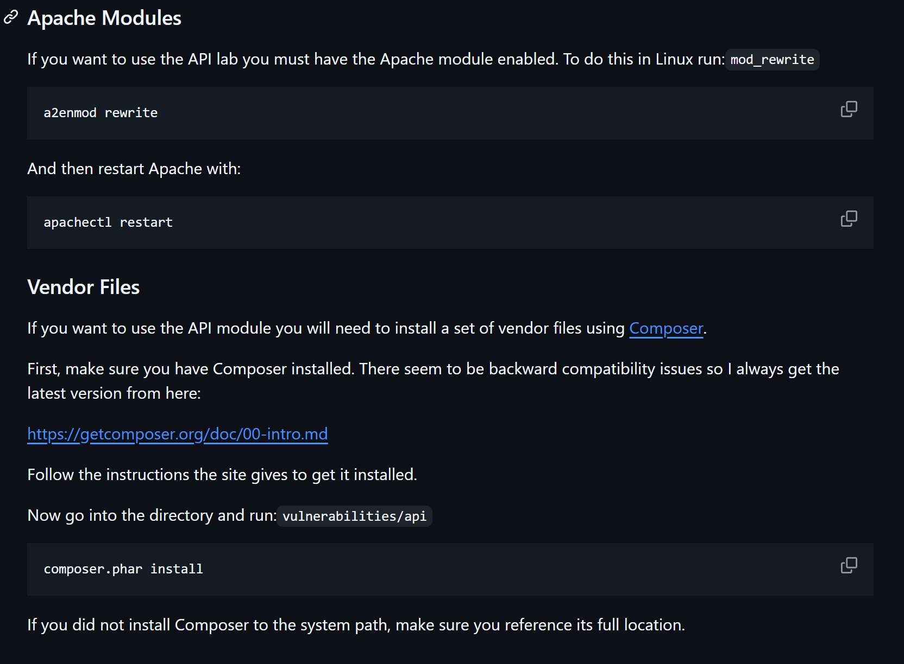

官方文档给出了api在liunx的说明，liunx修改我嫌麻烦，我在Windows又配置了半天，始终无法添加这个v2/user这个接口，尝试了写进去php，json文件都不行

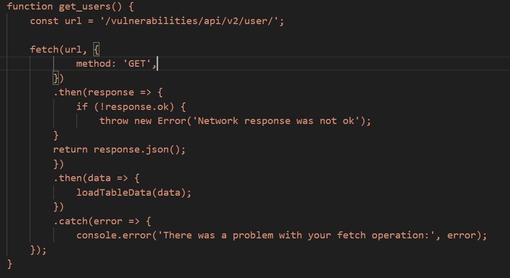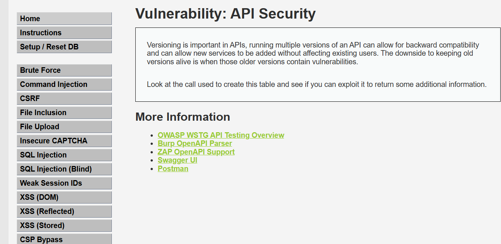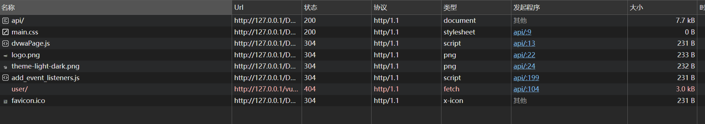

所以只能启动万能的docker了，在github上打包下来运行

```
docker compose up -d
```

这才是正常的页面

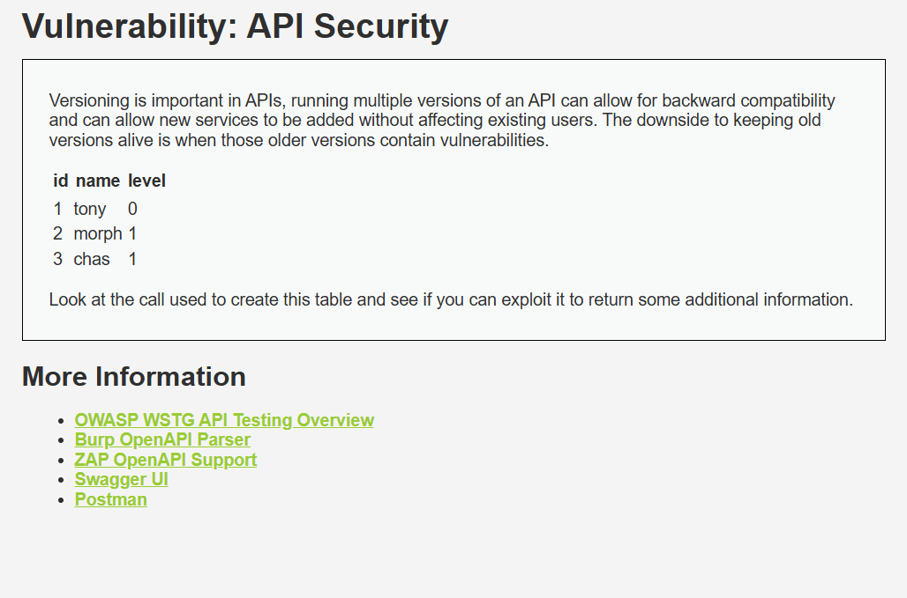

ok

​

## Low Level

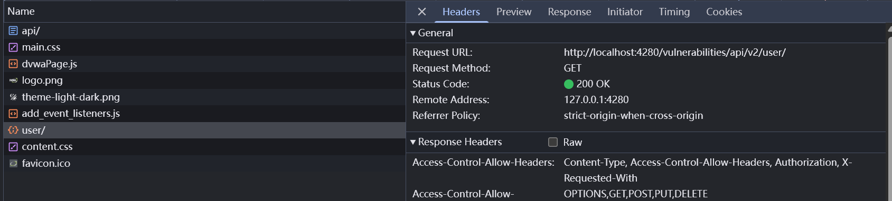

f12发现有一个fetch类型的包（Web API，用于发起 HTTP 请求，并获取网络资源如 JSON 数据、HTML、文件等）

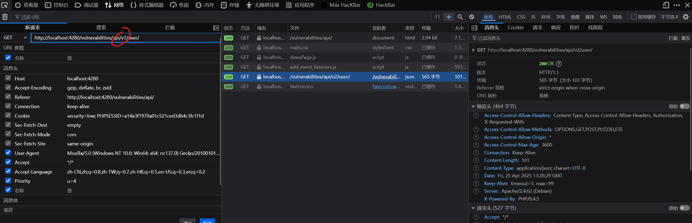

使用火狐编辑重发，很明显的一个IDOR漏洞

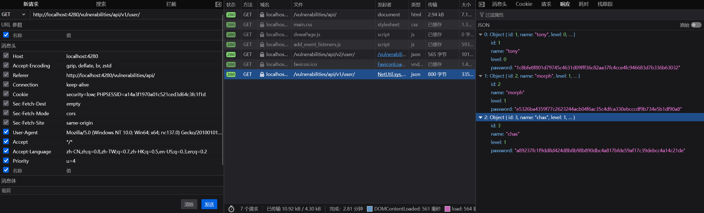

密码出现

​

使用在线网站破解密码

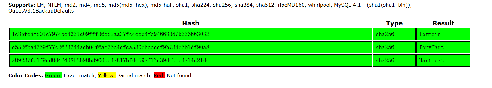

​

漏洞形成的原因应该就是 const url = '/vulnerabilities/api/v2/user/';请求接口不规范

```
<?php
  $errors = "";
$success = "";
$messages = "";

if ($_SERVER['REQUEST_METHOD'] == "POST") {
}

echo "
<p>
    Versioning is important in APIs, running multiple versions of an API can allow for backward compatibility and can allow new services to be added without affecting existing users. The downside to keeping old versions alive is when those older versions contain vulnerabilities.
</p>
";

echo "
<script>
    function update_username(user_json) {
        console.log(user_json);
        var user_info = document.getElementById ('user_info');
        var name_input = document.getElementById ('name');

        if (user_json.name == '') {
            user_info.innerHTML = 'User details: unknown user';
            name_input.value = 'unknown';
        } else {
            if (user_json.level == 0) {
                level = 'admin';
            } else {
                level = 'user';
            }
            user_info.innerHTML = 'User details: ' + user_json.name + ' (' + level + ')';
            name_input.value = user_json.name;
        }

        const message_line = document.getElementById ('message');
        if (user_json.id == 2 && user_json.level == 0) {
            message_line.style.display = 'block';
        } else {
            message_line.style.display = 'none';
        }
    }

    function get_users() {
        const url = '/vulnerabilities/api/v2/user/';
         
        fetch(url, { 
                method: 'GET',
            }) 
            .then(response => { 
                if (!response.ok) { 
                    throw new Error('Network response was not ok'); 
            } 
            return response.json(); 
            }) 
            .then(data => { 
                loadTableData(data);
            }) 
            .catch(error => { 
                console.error('There was a problem with your fetch operation:', error); 
        }); 
    }

    HTMLTableRowElement.prototype.insert_th_Cell = function(index) {
        let cell = this.insertCell(index)
        , c_th = document.createElement('th');
        cell.replaceWith(c_th);
        return c_th;
    }

    function loadTableData(items) {
        const table = document.getElementById('table');
        const tableHead = table.createTHead();
        const row = tableHead.insertRow(0);

        item = items[0];
        Object.keys(item).forEach(function(k){
            let cell = row.insert_th_Cell(-1);
            cell.innerHTML = k;
            if (k == 'password') {
                successDiv = document.getElementById ('message');
                successDiv.style.display = 'block';
            }
        });

        const tableBody = document.getElementById('tableBody');

        items.forEach( item => {
            let row = tableBody.insertRow();
            for (const [key, value] of Object.entries(item)) {
                let cell = row.insertCell(-1);
                cell.innerHTML = value;
            }
        });
    }
    </script>
";

echo "

<table id='table' class=''>
  <thead>
    <tr id='tableHead'>
    </tr>
  </thead>
  <tbody id='tableBody'></tbody>
</table>


        <p>
            Look at the call used to create this table and see if you can exploit it to return some additional information.
        </p>
        <div class='success' style='display:none' id='message'>Well done, you found the password hashes.</div>
        <script>
            get_users();
        </script>
";

?>
```

## Medium Level

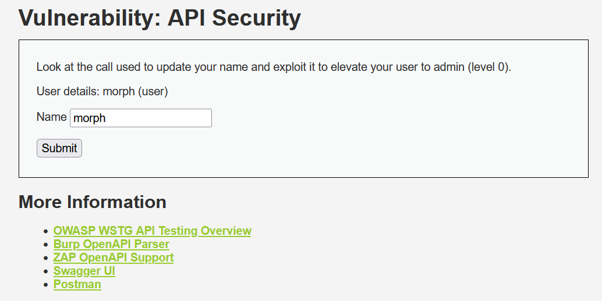

​

让我们修改他的权限为level 0

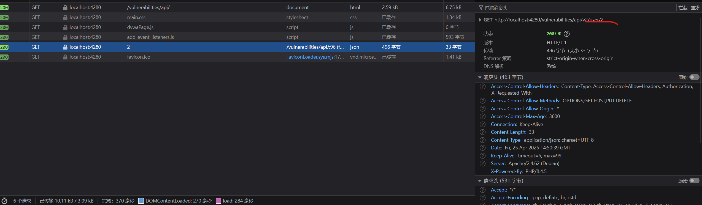

接口写完整了，抓个包看看

是个put请求，而且下面还有提交的json格式

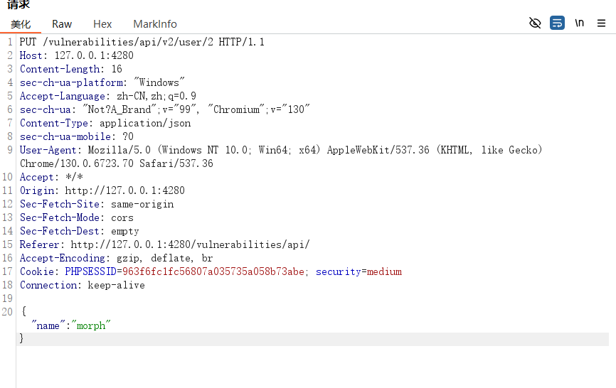

添加“level”:0

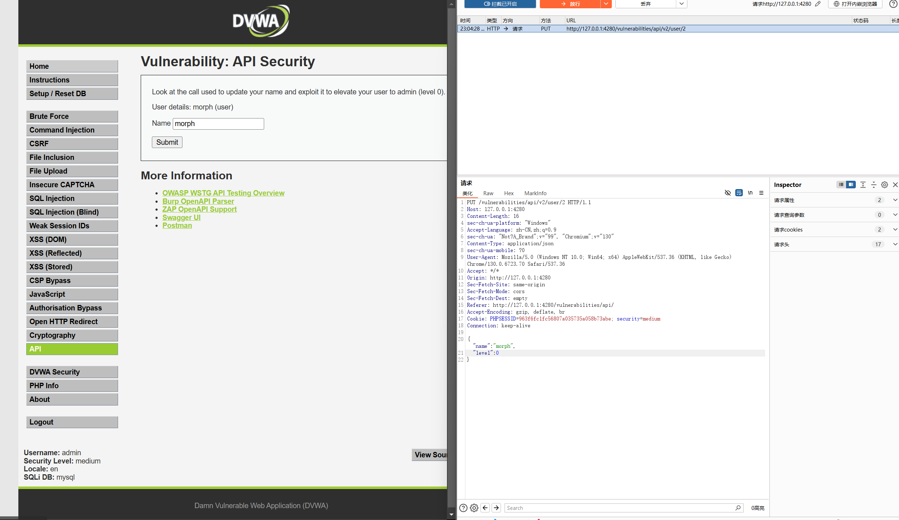

直接信任了我们的数据

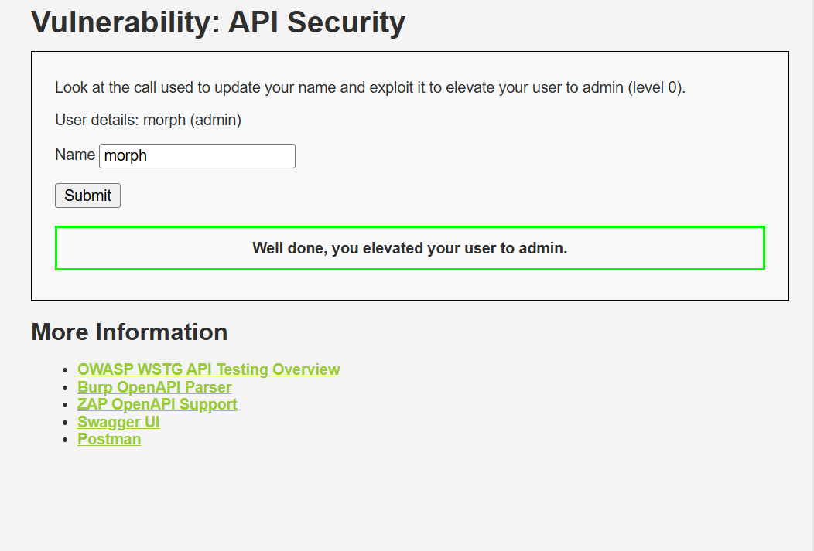

```
<?php

  $html .= "
  <script>
  function update_username(user_json) {
    console.log(user_json);
    var user_info = document.getElementById ('user_info');
    var name_input = document.getElementById ('name');

    if (user_json.name == '') {
      user_info.innerHTML = 'User details: unknown user';
      name_input.value = 'unknown';
    } else {
      var level = 'unknown';
      if (user_json.level == 0) {
        level = 'admin';
        successDiv = document.getElementById ('message');
        successDiv.style.display = 'block';
      } else {
        level = 'user';
      }
      user_info.innerHTML = 'User details: ' + user_json.name + ' (' + level + ')';
      name_input.value = user_json.name;
    }
  }

  function get_user() {
  const url = '/vulnerabilities/api/v2/user/2';

  fetch(url, { 
        method: 'GET',
        }) 
    .then(response => { 
          if (!response.ok) { 
          throw new Error('Network response was not ok'); 
} 
return response.json(); 
}) 
.then(data => { 
      update_username (data);
      }) 
  .catch(error => { 
         console.error('There was a problem with your fetch operation:', error); 
         }); 
}

function update_name() {
  const url = '/vulnerabilities/api/v2/user/2';
			const name = document.getElementById ('name').value;
			const data = JSON.stringify({name: name});
			 
			fetch(url, { 
					method: 'PUT', 
					headers: { 
						'Content-Type': 'application/json' 
					}, 
					body: data
				}) 
				.then(response => { 
					if (!response.ok) { 
						throw new Error('Network response was not ok'); 
				} 
				return response.json(); 
				}) 
				.then(data => { 
					update_username(data);
				}) 
				.catch(error => { 
					console.error('There was a problem with your fetch operation:', error); 
			}); 
		}
	</script>
";

$html .= "
		<p>
			Look at the call used to update your name and exploit it to elevate your user to admin (level 0).
		</p>
		<p id='user_info'></p>
		<form method='post' action="" . $_SERVER['PHP_SELF'] . "">
			<p>
				<label for='name'>Name</label>
				<input type='text' value='' name='name' id='name'>
			</p>
			<p>
				<input type="button" value="Submit" onclick='update_name();'>
			</p>
		</form>
		<div class='success' style='display:none' id='message'>Well done, you elevated your user to admin.</div>
		<script>
			get_user();
		</script>
";

?>

```

​

## High level

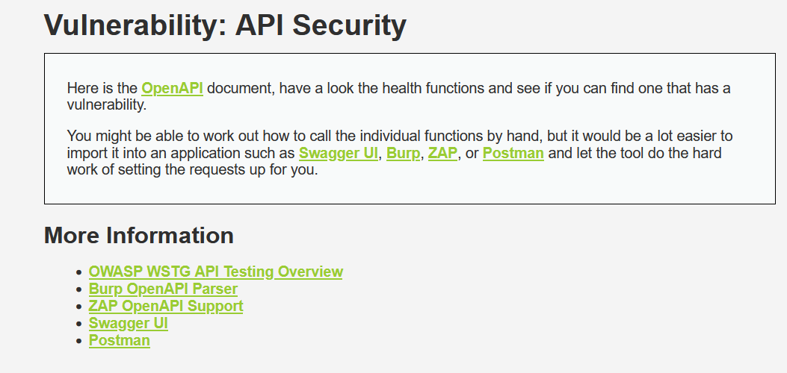

给了一个api的文档，让根据这个文档来找其他的漏洞

一个一个慢慢试，yml文档里都给你提示了

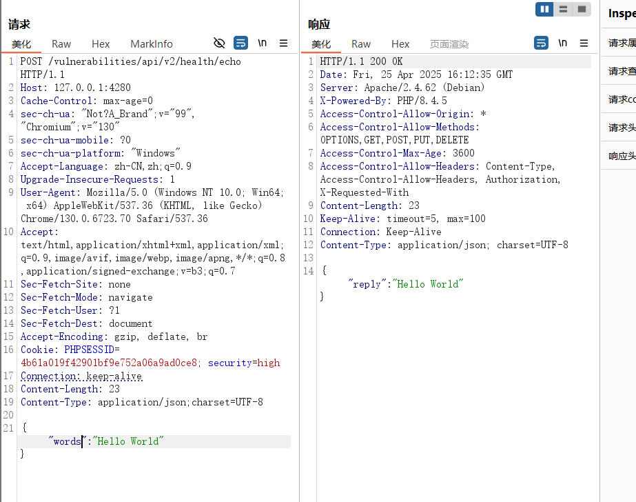

看看第一个echo接口，没测出来

第二个connectivity接口，提示target=digi.ninja

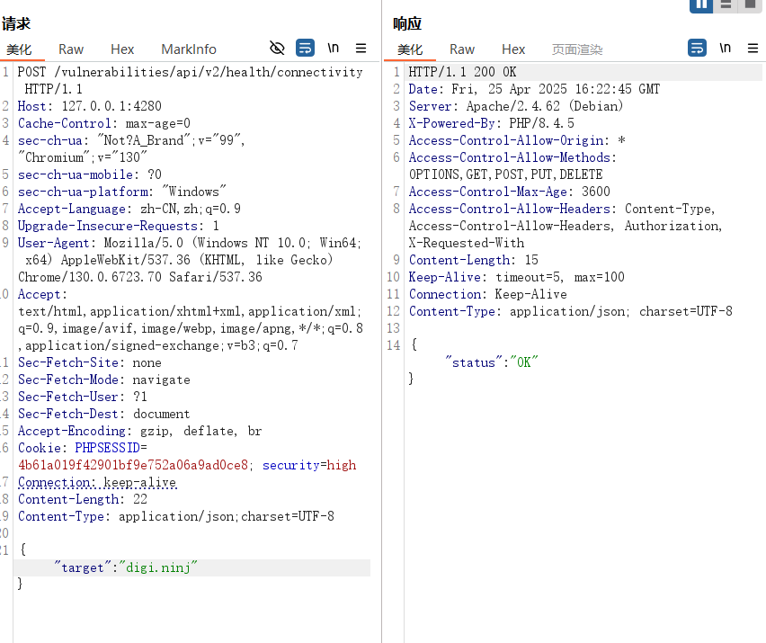

看不到内容，起个监听器，并配置个公网地址，看回显数据

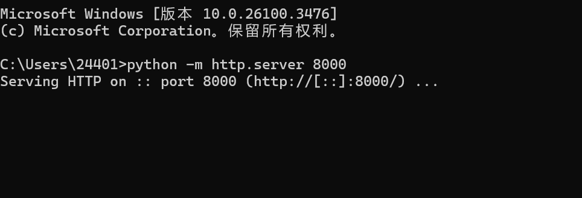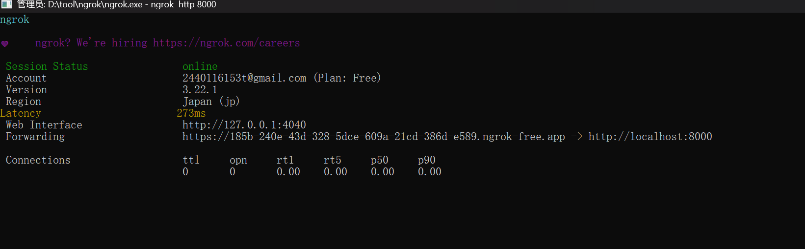

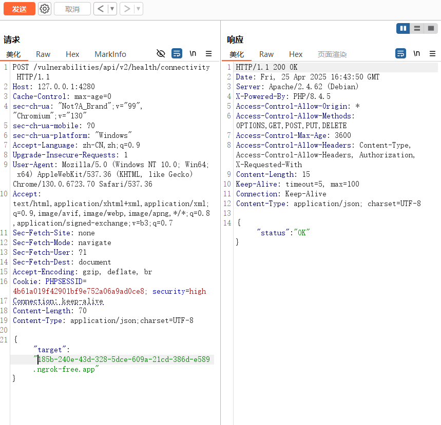

ok，可以访问

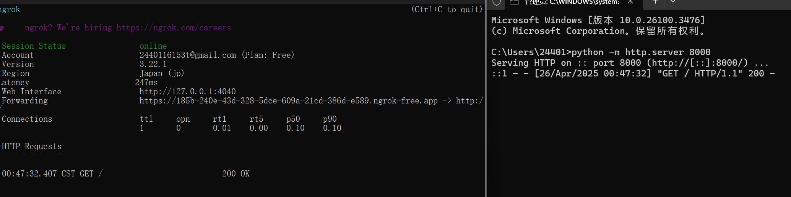

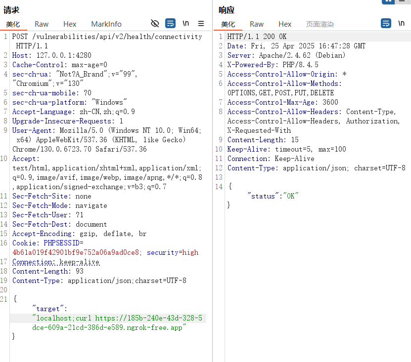

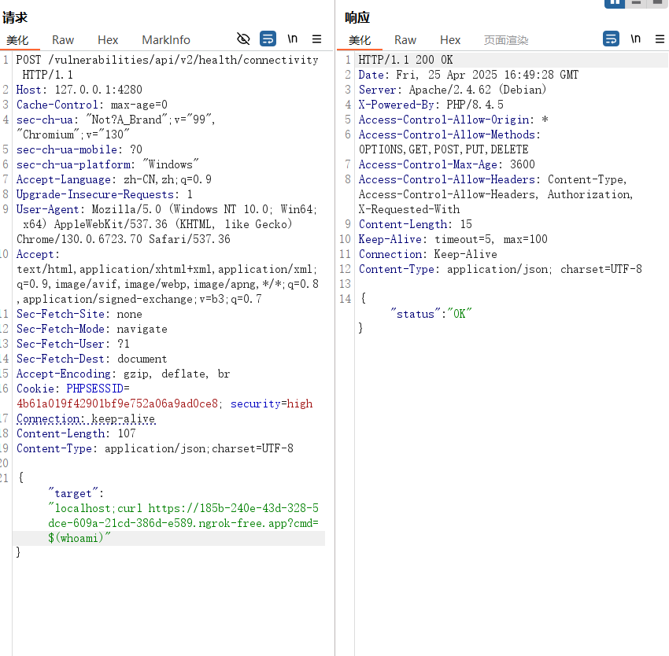

使用curl查看执行whoami命令的数据结果

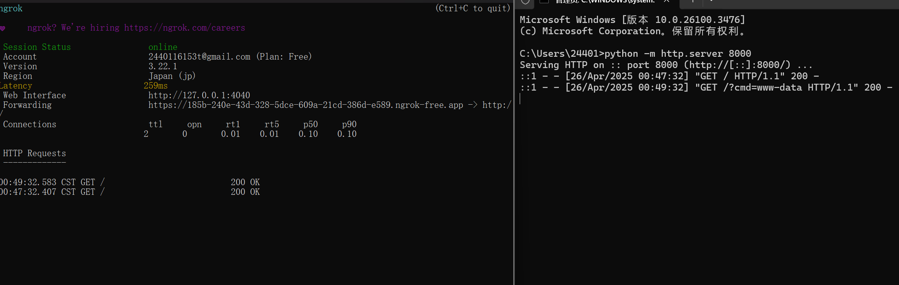

ok，就这样了。

```
<?php

$message = "";

echo "
    <p>
        Here is the <a href='openapi.yml'>OpenAPI</a> document, have a look the health functions and see if you can find one that has a vulnerability.
    </p>
    <p>
        You might be able to work out how to call the individual functions by hand, but it would be a lot easier to import it into an application such as <a href='https://swagger.io/tools/swagger-ui/'>Swagger UI</a>, <a href='https://portswigger.net/bappstore/6bf7574b632847faaaa4eb5e42f1757c'>Burp</a>, <a href='https://www.zaproxy.org/docs/desktop/addons/openapi-support/'>ZAP</a>, or <a href='https://www.postman.com/'>Postman</a> and let the tool do the hard work of setting the requests up for you.
    </p>
";

?>
```

### Impossible

```
Impossible Unknown Vulnerability Source

<?php

$message = "";

echo "
    <p>
        Rather than try to develop a perfect API, there is a different type of challenge for this level.
    </p>
    <p>
        The order system uses <a href='https://oauth.net/2/'>OAuth 2.0</a> for authentication. Being able to automate using this in your tools will greatly help with efficiency, removing the need to manually login and copy access tokens around. Use this level to practice setting up OAuth 2.0 in your testing tool of choice, for me this is <a href='https://www.postman.com/'>Postman</a> which is then proxied through <a href='https://portswigger.net/burp'>Burp</a>, but you can pick whatever tools are most appropriate for your testing environment.
    </p>
    <p>
        Here are some guides that might help:
</p>
<ul>
<li><a href='https://learning.postman.com/docs/sending-requests/authorization/oauth-20/'>Authenticate with OAuth 2.0 authentication in Postman</a></li>
<li><a href='https://blog.postman.com/what-is-oauth-2-0/'>What is OAuth 2.0?</a></li>
</ul>

";

?>

```

​

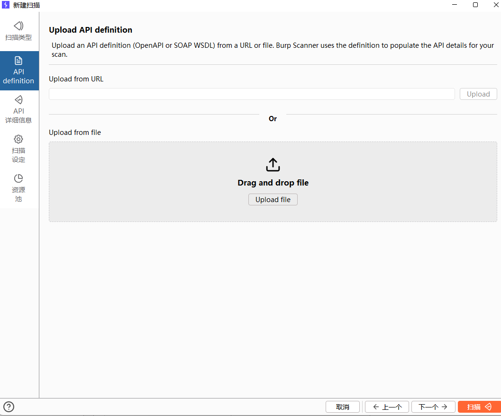

bp里面也配置了api自动扫描，写入字典即可。

​

这个vulnerabilities/api模块就这是

* 用户数据暴露（使用IDOR漏洞）
* 缺乏身份验证/授权
* 不安全的输入处理（如 JSON 注入、参数污染）
* 可控字段导致的权限提升（如将 level 改为 0）
