# Go-Zero框架代码审计-先知社区

> **来源**: https://xz.aliyun.com/news/17886  
> **文章ID**: 17886

---

# 前言

这篇文章是针对Go-Zero框架的代码审计。这个框架对于我来说也是一个“新”的框架，因为之前也没审过。那么我遇到一个新的框架的时候，我会用一个通用的方法去学习如何审计这个框架。即学习这个框架的项目结构，你需要了解这个框架的结构特性，以便你更好的找到你想要审计的接口。

所以这篇文章会介绍Go-Zero框架的项目结构、以及为什么是这样的结构，以便你了解为什么要这样审计这个框架。

# Go-Zero介绍

在了解项目结构之前，我们先了解这个框架，它有哪些特点、怎么用这个框架的。

Go-Zero 是一个集成了各种工程实践的 web 和 rpc 框架。通过弹性设计保障了大并发服务端的稳定性，经受了充分的实战检验。

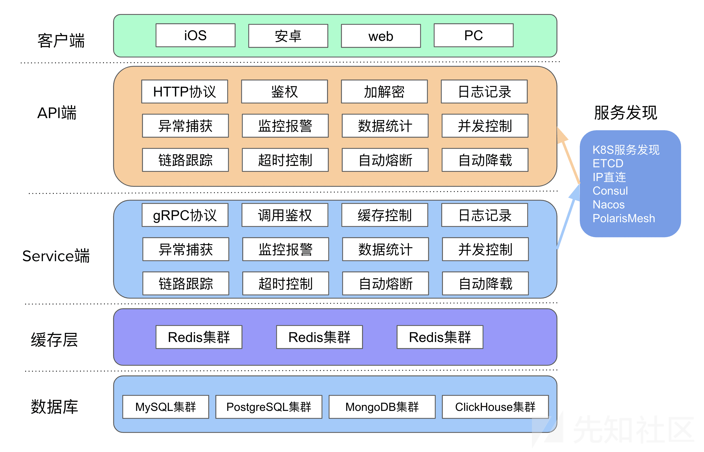

go-zero 包含极简的 API 定义和生成工具 goctl，可以根据定义的 api 文件一键生成 Go, iOS, Android, Kotlin, Dart, TypeScript, JavaScript 代码，并可直接运行

划重点了，这个框架可以根据定义的api文件（还有proto文件），一键生成代码。那么我们如果知道它是如何生成代码的是不是就可以理解它的项目结构了

# Go-Zero——API

首先创建一个api目录，然后创建一个api后缀的文件(.api)，这个文件是定义接口、接口处理函数、接口响应函数关系的文件 主要内容如下 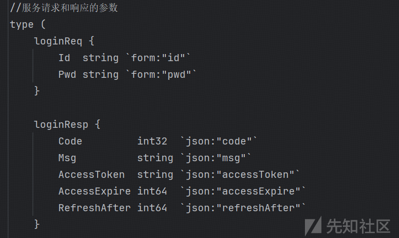

定义loginReq请求所需参数，如Id、Pwd loginResp服务响应参数，如Code、Msg，然后需要对request和response以及api接口进行一个绑定

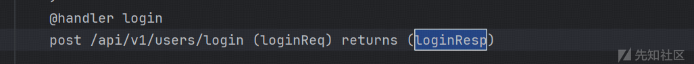

这样就定义好了一个api需要的请求参数、请求返回参数、以及要进行处理的handler，具体写法参考官方文档：<https://go-zero.dev/docs/tasks/dsl/api>

# Go-Zero——定位API逻辑

接着上文，由于这个api接口是在common 里的

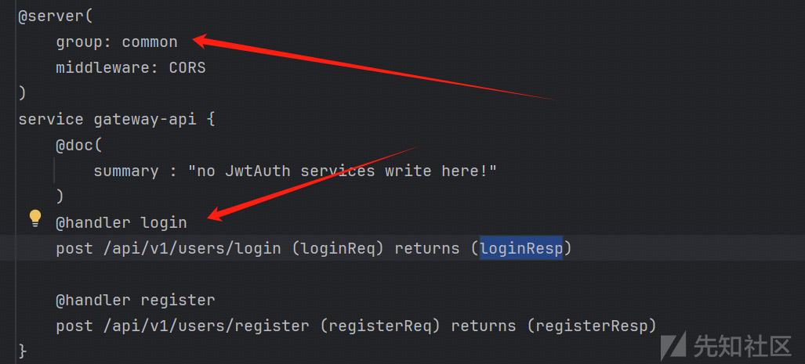

（在routes.go里可以看到所有接口的handler，以及请求方法）

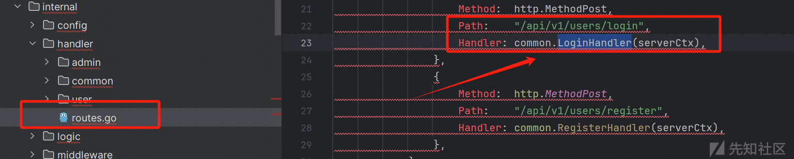

这里我们的handler有3个，那么我们就需要去common里看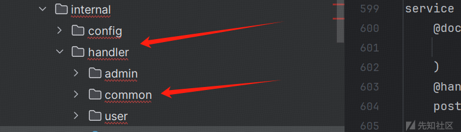

找到loginhandler.go

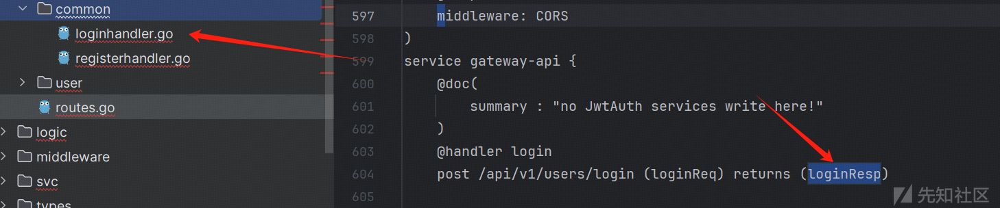

看到loginhandler的代码 真正处理login的逻辑是在logic里 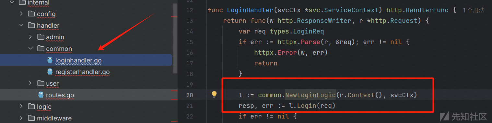

按下ctrl+鼠标左键

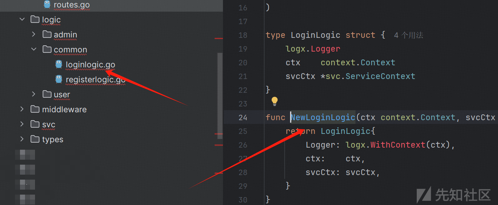

这里我们就要了解到logic目录了，这个目录就是开发自己需要填充具体逻辑代码的地方了 在loginlogic.go也就存放的真正这个接口处理用户请求的逻辑代码了 即l.Login(req)

这些英文也就是在生成代码时 用于提醒程序员的注释 告诉程序员这里是你要编写处理逻辑的地方，然后给程序员写好了你要接收的参数

```
	id := req.Id
	pwd := req.Pwd
```

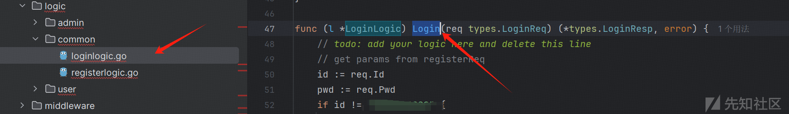

那么从一个api接口到寻找它具体处理逻辑代码的过程也就结束了，但是对于代码审计还没有真正结束。

# Go-Zero——RPC

我们继续往下看，它有去调用RPC接口，那么我们要完全读懂login这api的处理逻辑，就需要把RPC的处理逻辑给理解，所以我们还要去寻找RPC的处理逻辑代码在哪

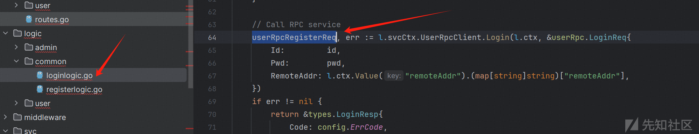

在寻找这个RPC接口的逻辑代码之前，我们还需要了解Go-Zero是如何规范编写RPC的

首先创建一个rpc目录，然后创建一个proto扩展名的文件，这个文件是编写想要写的rpc接口的接口请求和响应需要的参数，以及绑定关系，跟api一样的

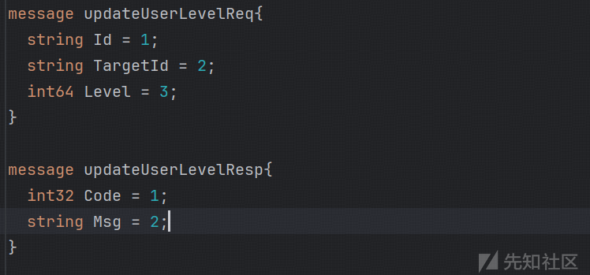

这里updateUserLevelReq就是处理用户发起请求的函数，updateUserLevelResp就是处理返回值的函数，然后id target level code msg就是相应的传入和传出参数，那么要将二者做一个绑定关系就同样需要一行代码，进行绑定

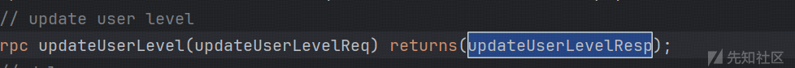

写好proto文件之后就可以使用goctl 生成相应的grpc代码了，这个源码生成的结构如下

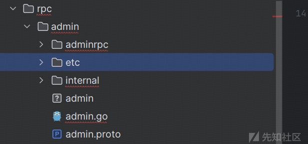

这就定义好了一个RPC接口服务了（是不是跟api很像）。写法可以参考官方文档：<https://go-zero.dev/docs/tasks/dsl/proto>

# Go-Zero——定位RPC逻辑

上文提到loginhandler.go代码调用的RPC是“userRpc.LoginReq”

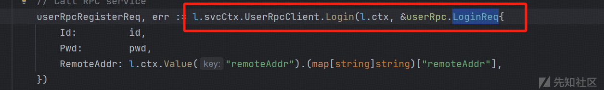

我们去看看api的servicecontext（即svcCtx）

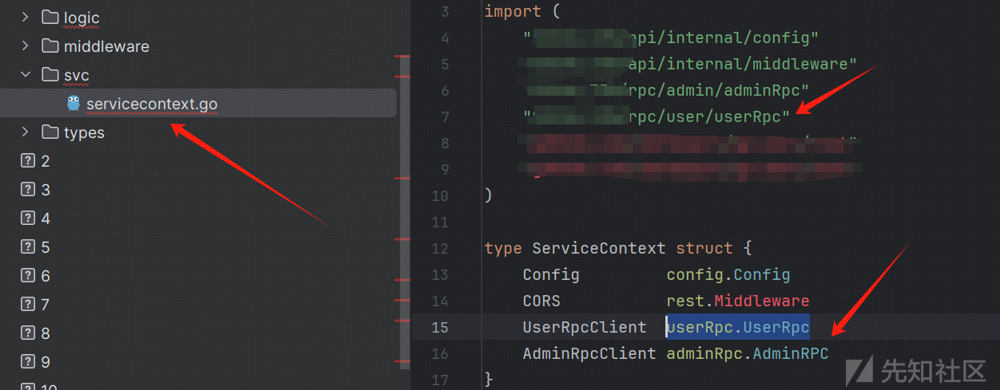

这里就跳到了rpc目录下的UserRpc了 UserRpc定义了一个接口叫Login也就是上文调用的，Login最好调用的是LoginResp

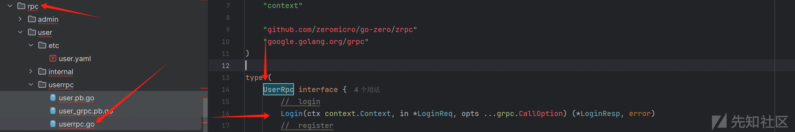

我们就直接去proto里搜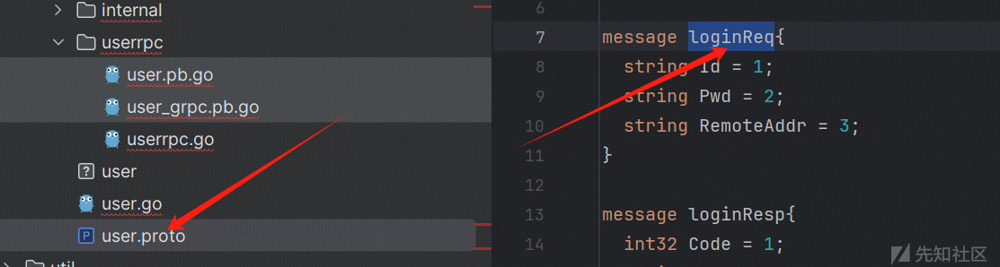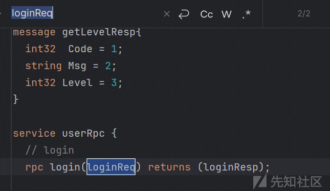

那么同api一样去logic里找loginlogic.go，也就找到了rpc的login处理逻辑

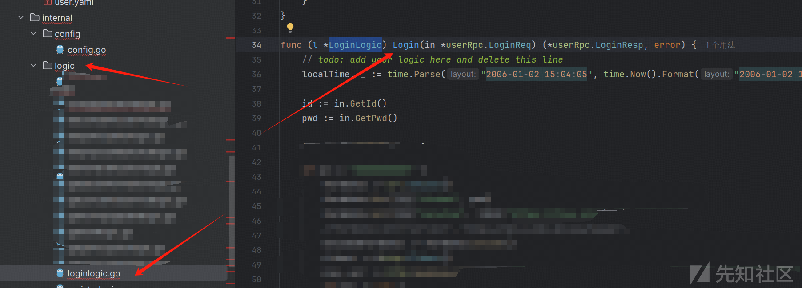

# 总结

看完之后相信你对Go-Zero的项目结构也有了一定的了解了，也知道拿到Go-Zero的源码之后应该从哪入手、如何找到处理逻辑。
